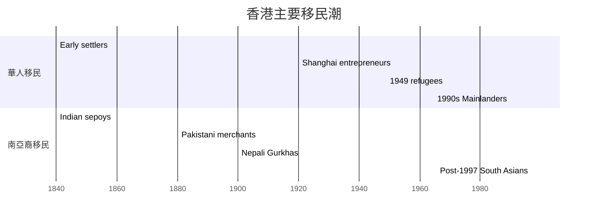
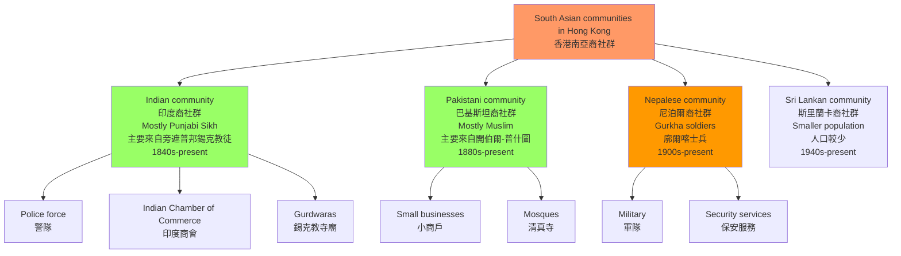
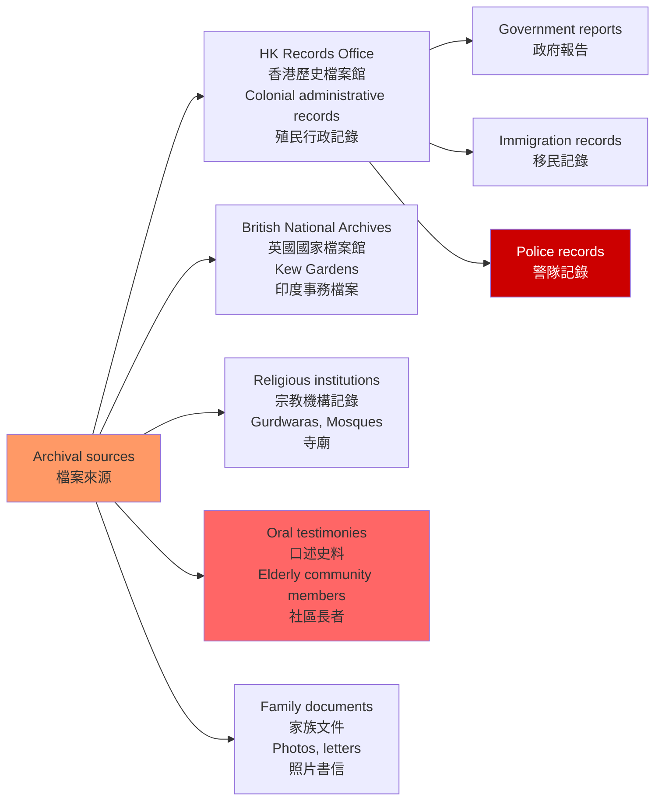
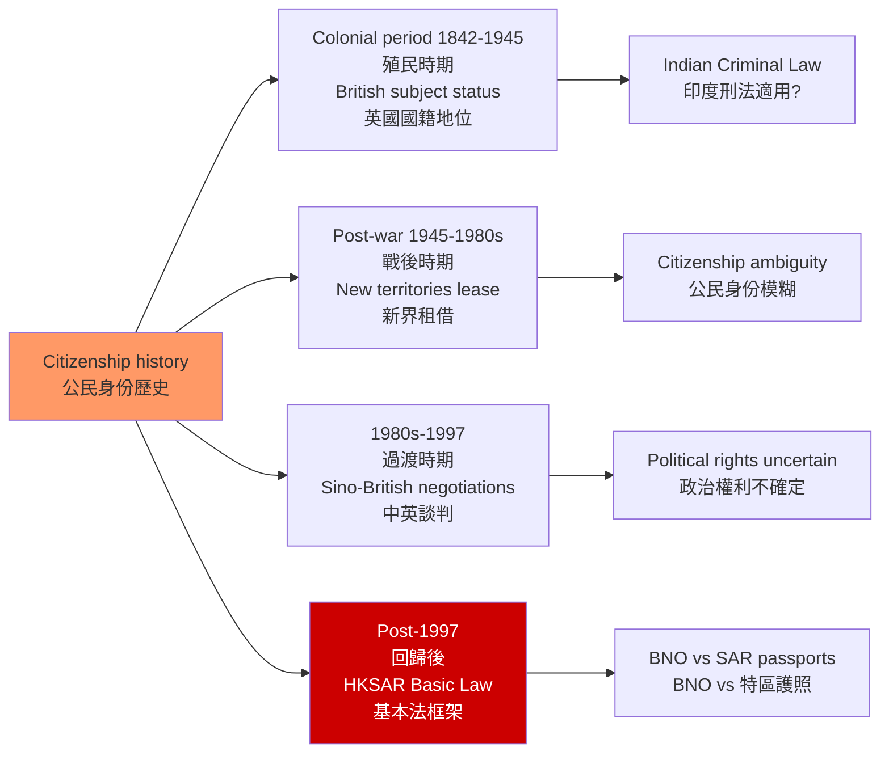

# HIST4038 遷移與檔案 / Migration and Archives in Hong Kong History

**Instructor**: Rotating (2025-26 focus: South Asian migration to Hong Kong)
**Department**: History, HKU
**Official source**: [HKU History Course Description](https://history.hku.hk/ug_cd/)
**Style**: 袁騰飛式 — 犀利、聚焦香港南亞裔社群的歷史——那些被主流歷史話語忽略的聲音

---

## 問題 1：5 個核心心智模型

### 1. 香港作為移民城市（Hong Kong as a City Built on Migration）

**專家如何思考**: 香港從一個約 5,000 人的小漁村，發展為 750 萬人口的國際都會——這個過程幾乎完全是由移民驅動的。學者 **John K. Fairbank** 和 **Elizabeth Sinn** 等人研究：香港的移民潮分為多波——1840 年代珠三角農民、1920-30 年代上海企業家、1950-60 年代內地政治移民、1970-80 年代越南船民、1990 年代以來內地新移民。

- **典型學者**: **Elizabeth Sinn** — *Power and Charity* (1989); **John Carroll** — *A Concise History of Hong Kong* (2020)
- **驗證案例**: 1950 年代初期，大量內地移民（1949 年後）湧入香港，其中很多是上海企業家，他們帶來了紡織業技術和資本，奠定了香港工業化的基礎

### 2. 南亞裔移民的特殊歷史（South Asian Migration to Hong Kong）

**專家如何思考**: 2025-26 年度的 HIST4038 聚焦於南亞裔移民（印度、巴基斯坦、尼泊爾）歷史。學者 **Ian Stone** 和 **John Brown** 研究：英屬印度軍人和商人是最早的南亞裔香港居民之一——從 1840 年代開始，印度社群就在香港建立了自己的社區結構。

- **典型學者**: **Ian Stone** — research on South Asian community in Hong Kong; **Gunnel Forsberg** — research on Pakistani community
- **驗證案例**: 1845 年香港已有印度裔警員記錄；1880 年代已有印度商人在上環和西環建立商舖社區；1900 年代香港警隊中約 10% 是印度裔警員

### 3. 檔案研究方法（Archival Research Methods）

**專家如何思考**: HIST4038 的核心技能之一是檔案研究——如何在 HKU 圖書館、香港歷史檔案館（Hong Kong Records Office）和英國國家檔案館（Kew Gardens）的館藏中，找到與移民史相關的一手史料。

- **典型挑戰**: 南亞裔移民在主流歷史檔案中的「隐形」——官方檔案主要以英語書寫，反映的是殖民當局的視角
- **替代史料**: 口述歷史、照片、教堂和廟宇記錄、體育會記錄（如 香港印度商會 Indian Chamber of Commerce）

### 4. 口述歷史與邊緣群體（Oral History and Marginalized Groups）

**專家如何思考**: 對於主流歷史檔案中「隐形」的群體，口述歷史是重建其歷史的關鍵工具。學者 **Alistair Thomson** 的口述歷史方法論強調：受訪者的記憶不是「客觀事實」，而是主觀建構——但這種主觀建構本身，就是理解過去的重要窗口。

- **典型方法**: 深度訪談（2-3 小時）、知情同意、錄音轉錄、記憶分析
- **挑戰**: 南亞裔長者的語言障礙（中英雙語 vs 三語）

### 5. 公民身份與邊界（Citizenship and Borders）

**專家如何思考**: 移民史研究的核心問題之一是公民身份（citizenship）和邊界（borders）。學者 **Arif Dirlik** 和 **Engseng Ho** 研究：誰被允許進入、誰被排除，是國家權力的核心表現——而香港作為英帝國殖民地的特殊身份，塑造了複雜的公民權體系。

- **典型問題**: 1997 年後，南亞裔香港居民的公民身份如何受到影響？他們在「一國兩制」框架下的法律地位是什麼？

---

## 問題 2：3 個根本分歧

### 分歧 1：香港身份——多元文化 vs 同化壓力？
**核心問題**: 香港的南亞裔社群如何在「華人主導的社會」中保持自己的文化認同？他們面臨的是多元文化共存，還是持續的同化壓力？

### 分歧 2：殖民時期——印度裔的特權 vs 歧視？
**核心問題**: 在英帝國的殖民體系中，南亞裔（印度人）扮演了什麼角色？他們是殖民權力的「合作者」，還是同樣受制於殖民歧視？

### 分歧 3：回歸後——公民身份的延續 vs 斷裂？
**核心問題**: 1997 年回歸後，南亞裔香港居民的法律地位和社會地位，與回歸前相比是延續還是斷裂？

---

## 問題 3：10 個深度問題

1. 什麼是「檔案的幽靈」（archival silence）？南亞裔移民在香港歷史檔案中的「隐形」，如何揭示了殖民檔案本身的意識形態偏見？
2. **英屬印度軍團（Indian Army）在香港）：1840-1940 年代，英屬印度軍團在香港的軍事參與（如 防守香港、參與二戰）如何影響了印度裔社群的形成？這些印度裔士兵的後代在香港的生活經歷是什麼？
3. 比較香港的「印度社群」（Indian community）和「巴基斯坦社群」（Pakistani community）的歷史形成。這兩個社群的宗教、語言、階級和移民時間有什麼差異？為什麼這種差異經常被「南亞裔」這一籠統標籤遮蔽？
4. **香港警隊中的印度裔警員**：為什麼印度裔香港人在殖民時期的香港警隊中佔有很高的比例？這種「警員職業模式」對印度裔社群的社會流動性和社區結構有什麼影響？
5. **宗教與身份**：南亞裔香港人的印度教、伊斯蘭教、錫克教宗教實踐，如何塑造了他們的社區認同？香港的宗教自由保障與實際的宗教歧視之間存在什麼差距？
6. 從「檔案批判」（archival critique）角度，分析香港歷史檔案館（Hong Kong Records Office）中關於南亞裔的官方記錄——這些記錄是誰寫的？為什麼寫？忽略了什麼？
7. **香港印度商會（Indian Chamber of Commerce）的歷史**：這個商會成立於什麼時候？它的主要功能和會員構成是什麼？它如何反映了香港印度商人在殖民經濟中的位置？
8. 什麼是「少數族裔」的「模範少数」（model minority）話語？這種話語如何影響了我們對香港南亞裔社群的理解？這種話語的局限性是什麼？
9. **回歸後的南亞裔香港人**：1997 年後，隨著《基本法》和《國安法》的實施，南亞裔香港居民的政治權利和公民身份有什麼具體變化？他們如何應對這些政治變化？
10. 從「記憶政治」（memory politics）角度，香港的南亞裔社群如何記憶自己的歷史？口述歷史項目如何挑戰或強化這種集體記憶？

---

# 核心心智模型深化（中英對照）

## 1. 香港作為移民城市

### 1.1 Bilingual 概念對照
| 英文 | 中文 | 歷史含義 | 關鍵數據 |
|---|---|---|---|
| Migration-driven growth | 移民驅動增長 | 香港人口增長的主要動力 | 1945年:60萬→1960年:300萬 |
| Refugee waves | 难民潮 | 政治動亂驅動的移民 | 1949, 1950s, 1989 |
| Ethnic Chinese migrants | 華人移民 | 華人主體 | 佔總人口95% |
| South Asian migrants | 南亞裔移民 | 印度、巴基斯坦、尼泊爾裔 | 佔總人口0.5% |

### 1.3 袁騰飛式犀利觀察
歷史書本把香港講成「華人的香港」——但香港從一開始就是一個多種族的城市。1842 年英國佔領香港島時，島上除了約 5,000 名華人，還有少數印度水手和商人。英帝國的殖民不只是「英國人管治華人」，而是「一個多種族帝國在不同地方使用不同族群」的複雜操作。

**香港的「中國性」是後來建構的**——1949 年後大量內地移民的湧入，使華人成為絕對多數；但在此之前，香港的身份是相當多元和模糊的。

### 1.5 圖解：香港移民時間線


---

## 2. 南亞裔移民的特殊歷史

### 2.1 圖解：香港南亞裔社群的主要類型


---

## 3. 檔案研究方法

### 3.1 圖解：香港南亞裔歷史的檔案來源


---

## 4. 口述歷史與邊緣群體

### 4.1 圖解：口述歷史訪談設計
```mermaid
flowchart TD
    A[Oral history project design<br/>口述歷史項目設計] --> B[Research question<br/>研究問題<br/>"How do Pakistani Hong Kongers<br/>understand their identity?"]
    B --> C[Identify interviewees<br/>識別受訪者<br/>Diversity: age, gender, religion, class]
    C --> D[Ethics approval<br/>倫理審批<br/>HKU IRB]
    D --> E[Prepare questions<br/>準備問題<br/>Life story, community, discrimination]
    E --> F[Conduct interviews<br/>進行訪談<br/>2-3 hours each]
    F --> G[Transcribe<br/>轉錄]
    G --> H[Analyze themes<br/>分析主題]
    H --> I[Write history<br/>撰寫歷史<br/>Integrate with archival research]
    
    style A fill:#f96
    style F fill:#9f6
```

---

## 5. 公民身份與邊界

### 5.1 圖解：香港南亞裔公民身份的歷史變遷


---

# 總結

1. **香港的多元種族歷史被嚴重低估**：歷史書本把香港簡化為「華人社會」，掩蓋了印度、巴基斯坦、尼泊爾裔社群對香港長達一個半世紀的歷史貢獻。

2. **檔案的幽靈揭示了殖民權力的意識形態**：南亞裔在主流歷史檔案中的「隐形」，不是因為他們不存在，而是因為殖民檔案只記錄對殖民統治有用的信息。

3. **口述歷史是邊緣群體發聲的關鍵工具**：當官方檔案保持沉默時，社區長者的記憶填補了歷史的空白。

4. **回歸後的公民身份政治**：在南亞裔香港居民群體中，回歸帶來了新的法律不確定性——BNO 護照、特區護照、「一國兩制」框架下的政治權利。

5. **香港的多元種族歷史是理解香港特殊性的關鍵**：如果我們只看到「華人香港」，我們就無法真正理解香港與中國內地的根本差異。

**自學建議**: 配合 Ian Stone 的南亞裔香港研究 + Elizabeth Sinn 的香港移民史研究，輸出社區歷史報告到 `06_Reading_Notes/`。
