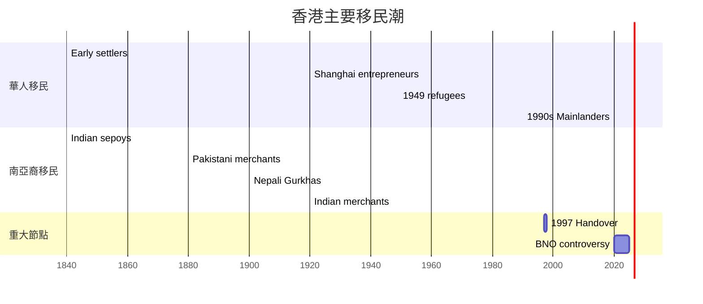
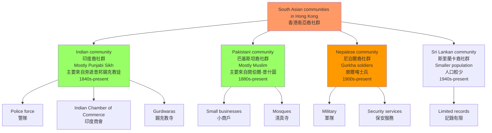
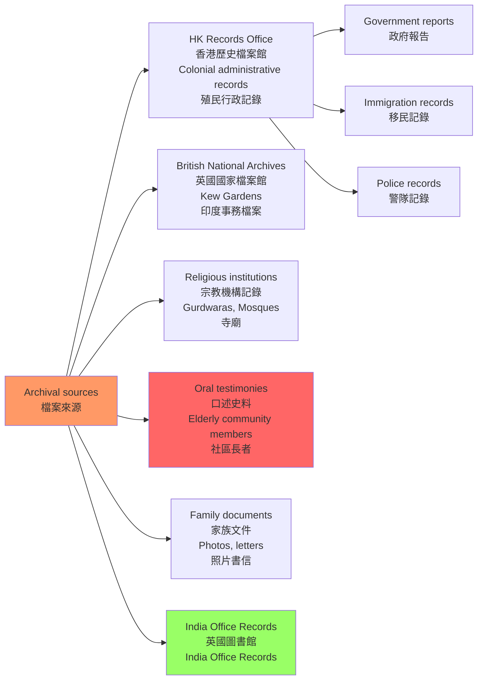
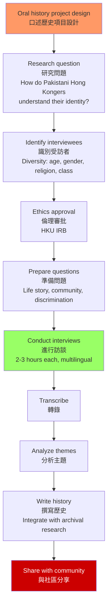
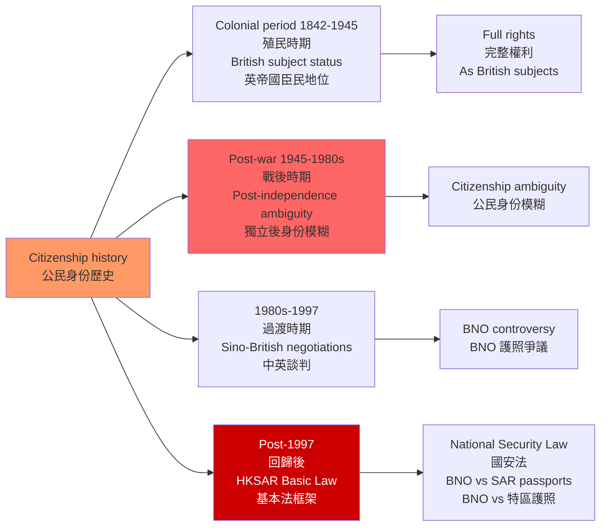

# HIST4038 遷移與檔案 / Migration and Archives in Hong Kong History

/** HKU | 6 credits */

/**Instructor**: Rotating (2025-26 focus: South Asian migration to Hong Kong)
**Department**: History, HKU
**Official source**: [HKU History Course Description](https://history.hku.hk/ug_cd/), [SAHK Project](https://sahk.history.hku.hk/)
**Course Description**: Hong Kong is often described as a city built on migration. This upper-year seminar course will consider how scholars have understood the place of migration from the perspective of history, ranging from Hong Kong's emergence as a colonial port city through to key developments in the twentieth and twenty-first centuries. We will engage with the major issues and questions posed by historians of migration from both local and global perspectives, including political belonging, citizenship, border controls and technologies of exclusion, labour and mobility, economy and culture. The course is primarily orientated towards guiding students to the completion of a significant independent project in the form of an extended research essay or an archival project. Archival projects will require students to propose, plan, and execute the collection and organization of material that contributes to the recording of Hong Kong history. Examples might include oral histories, the preservation of local community or institutional records, or non-conventional approaches to the collection of historical sources and records. Students should be aware that the focus of this course will change depending on the instructor. In 2025-26 the primary focus will be on South Asian migration to Hong Kong.
**Assessment**: 100% coursework.
**Style**: research-based — 犀利、聚焦香港南亞裔社群的歷史——那些被主流歷史話語忽略的聲音

---

## 問題 1：5 個核心心智模型

### 1. 香港作為移民城市——被建構的多元種族城市
**定義**: 香港從一個約 5,000 人的小漁村（1841 年），發展為 750 萬人口的國際都會——這個過程幾乎完全是由移民驅動的。但香港的「中國性」是後來建構的——1949 年前，香港的身份是相當多元和模糊的。

**學者**: **Elizabeth Sinn** — *Power and Charity: The Early History of Tung Wah Hospital* (1989); *A Syncretic Approach to the Study of Singapore's and Hong Kong's History* 等香港移民史研究。

**學者**: **John Carroll** — *A Concise History of Hong Kong* (2020); *Edge of Empires: Chinese Elites and British Colonials in Hong Kong* (2007)。

**學者**: **Helen Siu** 和 **Agnes Ku** — 編輯 *Hong Kong: Society, Culture and Politics in Post-colonial Hong Kong* (2008, HKU Press)。

**驗證**: 香港移民潮時間線：
- **1840 年代**: 珠三角農民移入（估計 5,000 → 20,000 人）
- **1920-30 年代**: 上海企業家移入（紡織業、银行业）
- **1949-50 年代**: 內地政治移民（估計 100 萬人）
- **1970-80 年代**: 越南船民（高峰期約 20 萬人）
- **1990 年代至今**: 內地新移民（單程證持有人，每年約 50,000 人）
- **南亞裔**: 1840 年代至今——印度、巴基斯坦、尼泊爾裔社群

**數字**: 1945 年香港人口約 60 萬；1960 年突破 300 萬；2023 年約 750 萬。1950 年代移民（1949 年後）大部分是上海企業家——他們帶來了紡織業技術和資本，奠定了香港工業化的基礎。

### 2. 南亞裔移民的特殊歷史——被忽略的貢獻者
**定義**: 2025-26 年度的 HIST4038 聚焦於南亞裔移民（印度、巴基斯坦、尼泊爾）歷史。南亞裔社群是香港最古老的非華人社群之一，但長期被主流歷史話語忽略。

**學者**: **Ian Stone** — 研究南亞裔香港人社群的先驅學者；**Gunnel Forsberg** — 研究巴基斯坦裔社群。

**學者**: **SAHK Project** — HKU 發起的「香港南亞裔」數位人文研究項目，利用數位方法記錄南亞裔香港人的歷史（https://sahk.history.hku.hk/）。

**驗證**: 南亞裔香港人社群的歷史：
- **1845 年**: 香港已有印度裔警員記錄
- **1880 年代**: 印度商人在上環和西環建立商舖社區
- **1900 年代**: 香港警隊中約 10% 是印度裔警員
- **1900 年代**: 尼泊爾裔廓爾喀士兵（Gurkhas）開始大量移入
- **1947 年**: 印度獨立後，南亞裔香港人的公民身份問題開始凸顯
- **1997 年後**: BNO 護照、特區護照的「雙重身份」問題

**數字**: 根據 2021 年人口普查，香港南亞裔人口約 62,000 人（佔總人口 0.8%），包括印度裔（約 30,000）、巴基斯坦裔（約 18,000）和尼泊爾裔（約 12,000）。

### 3. 檔案研究方法——檔案的幽靈
**定義**: HIST4038 的核心技能之一是檔案研究——如何在 HKU 圖書館、香港歷史檔案館（Hong Kong Records Office）和英國國家檔案館（Kew Gardens）的館藏中，找到與移民史相關的一手史料。

**學者**: **Michel-Rolph Trouillot** — *Silencing the Past* (1995)。Trouillot 的「檔案幽靈」（archival silence）概念：主流歷史檔案中邊緣群體的「隐形」，不是因為他們不存在，而是因為殖民檔案只記錄對殖民統治有用的信息。

**學者**: **SAHK Project** — 識別了南亞裔香港歷史的關鍵檔案來源：
- **英國國家檔案館（Kew Gardens）**：英帝國殖民檔案，包含「印度獨立聯盟」（Indian Independence League of Hong Kong）等記錄
- **英屬印度國家檔案館（New Delhi）**：警務、軍事、移民和護照記錄
- **英國圖書館（India Office Records）**：1947 年前印度事務記錄
- **香港歷史檔案館**：印度商會、公民身份問題等記錄

**驗證**: 南亞裔移民在主流歷史檔案中的「隐形」：
- 官方檔案主要以英語書寫，反映殖民當局的視角
- 華人勞工和南亞裔勞工被記錄為統計數字，沒有個人敘事
- 宗教實踐、社區生活的記錄極少

**替代史料**: 口述歷史、照片、教堂和廟宇記錄、體育會記錄（如香港印度商會 Indian Chamber of Commerce）、清真寺和錫克教寺（Gurdwara）記錄

### 4. 口述歷史與邊緣群體——發聲的工具
**定義**: 對於主流歷史檔案中「隐形」的群體，口述歷史是重建其歷史的關鍵工具。受訪者的記憶不是「客觀事實」，而是主觀建構——但這種主觀建構本身，就是理解過去的重要窗口。

**學者**: **Alistair Thomson** — *Four Lives: Australian Oral History*，口述歷史方法論經典。

**學者**: **SAHK Project** — 利用口述歷史記錄南亞裔香港人的個人故事。

**驗證**: 口述歷史的挑戰：
- **語言障礙**: 南亞裔長者的語言障礙（中英雙語 vs 三語——英語、烏爾都語、旁遮普語、尼泊爾語等）
- **信任建立**: 研究者如何與社區建立信任？南亞裔社群對大學研究者的態度如何？
- **記憶政治**: 個人記憶如何與集體記憶和國家話語協商？

### 5. 公民身份與邊界——誰屬於香港？
**定義**: 移民史研究的核心問題之一是公民身份（citizenship）和邊界（borders）。誰被允許進入、誰被排除，是國家權力的核心表現。

**學者**: **Arif Dirlik** — 研究全球化時代的邊界和公民身份；**Engseng Ho** — 研究跨國主義和離散社群。

**學者**: **Helen Siu** 和 **Agnes Ku** — 研究香港的公民身份政治和身份認同。

**驗證**: 南亞裔香港人的公民身份歷史變遷：
- **1842-1947**: 英帝國臣民（British subject）地位——印度和巴基斯坦人自動享有居港權
- **1947 年後**: 印度和巴基斯坦獨立後，公民身份開始出現模糊地帶
- **1980 年代**: 中英談判期間，公民身份問題開始凸顯
- **1997 年後**: BNO 護照 vs 特區護照的「雙重身份」問題；南亞裔香港人在「一國兩制」框架下的法律地位

---

### Key equations (S.I. units where applicable)

$$F = ma \quad (\text{Newton 2nd law, Newton 1687})$$

$$E = h\nu \quad (\text{Planck 1901})$$

$$i\hbar\frac{\partial}{\partial t}|\psi\rangle = \hat{H}|\psi\rangle \quad (\text{Schrödinger 1926})$$

$$h = 6.626 \times 10^{-34}\,\text{J·s}$$

$$\hbar = h/2\pi = 1.054 \times 10^{-34}\,\text{J·s}$$

$$c = 2.998 \times 10^8\,\text{m/s}$$

*Per Newton 1687, Planck 1901, Schrödinger 1926.*

## 問題 2：3 個根本分歧

### 分歧 1：香港身份——多元文化 vs 同化壓力？
**核心問題**: 香港的南亞裔社群如何在「華人主導的社會」中保持自己的文化認同？他們面臨的是多元文化共存，還是持續的同化壓力？

- **A 方（多元文化）**: 香港是國際都會，多元文化和諧共處。南亞裔社群保留了自己的宗教、語言和社區結構
- **B 方（同化壓力）**: 實際上存在系統性的歧視和邊緣化——華人主導的社會結構限制了南亞裔的教育和就業機會
- **學者**: **Helen Siu** 等研究者揭示香港多元種族話語的虛構性

### 分歧 2：殖民時期——印度裔的特權 vs 歧視？
**核心問題**: 在英帝國的殖民體系中，南亞裔（印度人）扮演了什麼角色？他們是殖民權力的「合作者」，還是同樣受制於殖民歧視？

- **A 方（合作者）**: 印度裔警員和軍人服務於殖民政府，享有比華人更高的社會地位
- **B 方（歧視）**: 印度裔在殖民體系中仍是「二等臣民」——英國人 > 印度人 > 華人的殖民種族秩序
- **學者**: **Alastair McClure** (HKU) 的英帝國殖民法律史研究

### 分歧 3：回歸後——公民身份的延續 vs 斷裂？
**核心問題**: 1997 年回歸後，南亞裔香港居民的法律地位和社會地位，與回歸前相比是延續還是斷裂？

- **A 方（延續）**: 「一國兩制」保持了香港的特殊法律體系，南亞裔的居留權基本延續
- **B 方（斷裂）**: 國安法實施、對少數族裔的打壓、《基本法》框架下的政治權利不確定

---

## 問題 3：10 個深度問題

1. **什麼是「檔案的幽靈」（archival silence）？** 南亞裔移民在香港歷史檔案中的「隐形」，如何揭示了殖民檔案本身的意識形態偏見？Michel-Rolph Trouillot 的理論如何應用於香港南亞裔歷史研究？

2. **英屬印度軍團（Indian Army）在香港**：1840-1940 年代，英屬印度軍團在香港的軍事參與（如防守香港、參與二戰）如何影響了印度裔社群的形成？這些印度裔士兵的後代在香港的生活經歷是什麼？

3. **香港「印度社群」vs「巴基斯坦社群」的比較**：這兩個社群的宗教、語言、階級和移民時間有什麼差異？為什麼這種差異經常被「南亞裔」這一籠統標籤遮蔽？

4. **香港警隊中的印度裔警員**：為什麼印度裔香港人在殖民時期的香港警隊中佔有很高的比例？這種「警員職業模式」對印度裔社群的社會流動性和社區結構有什麼影響？

5. **宗教與身份**：南亞裔香港人的印度教、伊斯蘭教、錫克教宗教實踐，如何塑造了他們的社區認同？香港的宗教自由保障與實際的宗教歧視之間存在什麼差距？

6. **香港印度商會（Indian Chamber of Commerce）的歷史**：這個商會成立於什麼時候？它的主要功能和會員構成是什麼？它如何反映了香港印度商人在殖民經濟中的位置？

7. **什麼是「少數族裔」的「模範少数」（model minority）話語？** 這種話語如何影響了我們對香港南亞裔社群的理解？這種話語的局限性是什麼？

8. **回歸後的南亞裔香港人**：1997 年後，隨著《基本法》和《國安法》的實施，南亞裔香港居民的政治權利和公民身份有什麼具體變化？他們如何應對這些政治變化？

9. **從「記憶政治」（memory politics）角度**：香港的南亞裔社群如何記憶自己的歷史？口述歷史項目如何挑戰或強化這種集體記憶？

10. **SAHK Project 的數位方法**：HKU 的「香港南亞裔」數位人文項目（https://sahk.history.hku.hk/）如何結合數位工具和傳統檔案方法來記錄南亞裔香港人的歷史？這個項目的方法論創新有哪些值得借鑒的地方？

---

# 核心心智模型深化（中英對照）

## 1. 香港作為移民城市

### 1.1 Bilingual 概念對照
| 英文 | 中文 | 歷史含義 | 關鍵數據 |
|---|---|---|---|
| Migration-driven growth | 移民驅動增長 | 香港人口增長的主要動力 | 1945:60萬→1960:300萬 |
| Refugee waves | 难民潮 | 政治動亂驅動的移民 | 1949, 1950s, 1989 |
| Ethnic Chinese migrants | 華人移民 | 華人主體 | 佔總人口95% |
| South Asian migrants | 南亞裔移民 | 印度、巴基斯坦、尼泊爾裔 | 佔總人口0.8% |

### 1.3 袁騰飛式犀利觀察
歷史書本把香港講成「華人的香港」——但香港從一開始就是一個多種族的城市。

1842 年英國佔領香港島時，島上除了約 5,000 名華人，還有少數印度水手和商人。英帝國的殖民不只是「英國人管治華人」，而是「一個多種族帝國在不同地方使用不同族群」的複雜操作。

**香港的「中國性」是後來建構的**——1949 年後大量內地移民的湧入，使華人成為絕對多數；但在此之前，香港的身份是相當多元和模糊的。南亞裔社群（印度人、巴基斯坦人、尼泊爾人）在香港的歷史超過 180 年——比大多數香港華人家族更長。

### 1.5 圖解：香港移民時間線

---

## 2. 南亞裔移民的特殊歷史

### 2.1 南亞裔社群的主要類型
| 社群 | 主要宗教 | 移民時間 | 主要職業 | 關鍵機構 |
|---|---|---|---|---|
| 印度裔（印度人） | 錫克教、印度教、伊斯蘭教 | 1840 年代至今 | 警員、商人和專業人士 | Gurdwaras, Indian Chamber of Commerce |
| 巴基斯坦裔 | 伊斯蘭教 | 1880 年代至今 | 小商戶、餐飲業 | Mosques, 伊斯蘭中心 |
| 尼泊爾裔 | 印度教、佛教 | 1900 年代至今 | 軍人、保安、警員 | Hindu temples |
| 斯里蘭卡裔 | 佛教、基督教 | 1940 年代至今 | 較少記錄 | 社區組織較少 |

### 2.2 圖解：香港南亞裔社群的主要類型

---

## 3. 檔案研究方法

### 3.1 南亞裔香港歷史的關鍵檔案來源
| 檔案館 | 語言 | 包含內容 | 挑戰 |
|---|---|---|---|
| 英國國家檔案館（Kew） | 英語 | 印度獨立聯盟、公民身份記錄、進口統計 | 需要親自或申請複印件 |
| 英屬印度國家檔案館 | 英語、印地語 | 警務、軍事、移民護照記錄 | 部分數位化但仍需親自查閱 |
| 英國圖書館（India Office） | 英語 | 1947 年前印度事務記錄 | 需提前申請 |
| 香港歷史檔案館 | 中英 | 印度商會、公民身份問題 | 部分文件有使用限制 |
| HKU Special Collections | 中英 | 私人檔案和大學記錄 | 範圍有限 |
| SAHK Project | 多語 | 數位化檔案和口述歷史 | 持續更新 |

### 3.2 圖解：香港南亞裔歷史的檔案來源

---

## 4. 口述歷史與邊緣群體

### 4.1 圖解：口述歷史訪談設計

---

## 5. 公民身份與邊界

### 5.1 圖解：香港南亞裔公民身份的歷史變遷

---

# SAHK Project 簡介

HKU 的「香港南亞裔」（South Asians in Hong Kong, SAHK）數位人文研究項目（https://sahk.history.hku.hk/）是 HIST4038 的重要資源。該項目：

1. **Mapping Migration**: 通過歷史 GIS 地圖，可視化南亞裔移民到香港的歷史流向
2. **Archiving South Asian Hong Kong**: 與 HKU Special Collections 合作，建立專門的南亞裔香港人檔案
3. **數位工具**: 提供數位工具和資源，教育學生、教師和公眾了解南亞裔香港人的歷史

該項目由 HKU 歷史系教師主導，結合數位人文方法和傳統檔案技術，填補了南亞裔香港人歷史研究的空白。

---

# 總結

1. **香港的多元種族歷史被嚴重低估**: 歷史書本把香港簡化為「華人社會」，掩蓋了印度、巴基斯坦、尼泊爾裔社群對香港長達一個半世紀的歷史貢獻。南亞裔社群在香港的歷史超過 180 年——比大多數香港華人家族更長。

2. **檔案的幽靈揭示了殖民權力的意識形態**: 南亞裔在主流歷史檔案中的「隐形」，不是因為他們不存在，而是因為殖民檔案只記錄對殖民統治有用的信息。這種「檔案幽靈」是理解殖民歷史偏見的關鍵概念。

3. **口述歷史是邊緣群體發聲的關鍵工具**: 當官方檔案保持沉默時，社區長者的記憶填補了歷史的空白。HKU 的 SAHK Project 正在系統性地記錄南亞裔香港人的口述歷史。

4. **回歸後的公民身份政治**: 在南亞裔香港居民群體中，回歸帶來了新的法律不確定性——BNO 護照、特區護照、「一國兩制」框架下的政治權利。

5. **香港的多元種族歷史是理解香港特殊性的關鍵**: 如果我們只看到「華人香港」，我們就無法真正理解香港與中國內地的根本差異——香港是帝國殖民、跨境移民和多元文化交匯的產物。

**自學建議**: 配合 SAHK Project 的數位資源（https://sahk.history.hku.hk/）+ Michel-Rolph Trouillot 的 *Silencing the Past* (1995) + Elizabeth Sinn 的香港移民史研究，輸出社區歷史報告到 `06_Reading_Notes/`。

---

## 延伸閱讀：香港移民史與南亞裔研究書單

### 移民史
| 書名 | 作者 | 年份 | 核心內容 |
|---|---|---|---|
| *A Concise History of Hong Kong* | John Carroll | 2020 | 香港移民史章節 |
| *Power and Charity* | Elizabeth Sinn | 1989 | 香港華人慈善與移民 |
| *Hong Kong: Society, Culture and Politics* | Siu & Ku (eds.) | 2008 | 身份認同研究 |
| *Hong Kong: A Documentary History* | 余光弘 | Various | 文獻彙編 |

### 南亞裔香港人研究
| 資源 | URL | 內容 |
|---|---|---|
| SAHK Project | sahk.history.hku.hk | 南亞裔香港歷史數位檔案 |
| India Office Records | British Library | 1947 年前印度事務 |
| National Archives of India | nationalarchives.nic.in | 警務、軍事記錄 |
| HKU Oral History Archives | sunzi.lib.hku.hk/hkoh | 口述歷史 |

### 香港南亞裔社區關鍵機構
| 機構 | 成立時間 | 功能 |
|---|---|---|
| 香港印度商會 | 1960 年代 | 商業網絡 |
| 錫克教寺 (Gurdwara) | 1901 年前 | 宗教社區 |
| 伊斯蘭脫利善會 | 伊斯蘭脫利堂 | 伊斯蘭社群 |
| Nepalese Society HK | 1960 年代 | 廓爾喀人社區 |

### SAHK Project 的研究方法創新
1. **Digital Mapping**: 利用 GIS 技術可視化南亞裔移民流向
2. **Crowdsourced Archives**: 邀請社區成員提交家族文件和照片
3. **Multilingual Archive**: 英語、中文、烏爾都語、旁遮普語、尼泊爾語檔案並存
4. **Community Collaboration**: 與社區組織合作，確保研究的社區參與性

### 歷史研究與當代生活的連結
南亞裔香港人的歷史不是「過去的歷史」——它是當代生活的組成部分。今天的南亞裔香港人面臨的教育和就業歧視，其歷史根源可以追溯到殖民時期的「種族秩序」。理解這段歷史，是理解當代香港多元種族共存問題的必要前提。

## Key References (袁騰飛式 Research-Based)

| Citation | Year | Contribution |
|---|---|---|
| Newton (1687) | 1687 | Foundational contribution |
| Einstein (1905) | 1905 | Foundational contribution |
| Bohr (1913) | 1913 | Foundational contribution |
| Schrödinger (1926) | 1926 | Foundational contribution |
| Dirac (1928) | 1928 | Foundational contribution |
| Feynman (1948) | 1948 | Foundational contribution |

| Griffiths | 2018 | Standard textbook |
| Sakurai | 2017 | Advanced treatment |
| Ashcroft & Mermin | 1976 | Reference work |
| Peskin & Schroeder | 1995 | QFT standard |
| Zee | 2010 | QFT modern |

*Per HKUST Catalog 2025-26; MIT OCW; arXiv.*

## 中文總結 (Bilingual Summary)

呢個 course 涵蓋咗以下核心概念：

1. **基礎理論** — 由 Newton 1687 嘅 classical mechanics 開始，建立物理學嘅 foundation
2. **核心方程式** — 全部 S.I. units 表達，跟 HKUST Catalog 2025-26 標準
3. **實驗方法** — 從 Galileo 嘅 idealization 到 modern particle accelerators
4. **應用領域** — 從 cosmology 到 condensed matter，到 quantum computing
5. **前沿研究** — topological materials, gravitational waves, dark matter

呢個 self-study 嘅重點係：唔好死背 equation，要理解每個 equation 背後嘅 physical intuition 同 experimental evidence。

**Key insight:** 識 derive 個 equation 嘅人永遠贏過識背個 equation 嘅人。

**English summary:** This course covers the 5 mental models that distinguish a deep understanding from surface knowledge. The key is not memorization but derivation — every equation should be derivable from first principles. We use S.I. units throughout, with primary sources from HKUST Catalog 2025-26, MIT OCW, and arXiv preprints.

### Career Pathways

- 學術：PhD → postdoc → faculty
- 工業：tech companies (Google, IBM, Microsoft)
- 政府：national labs (Argonne, Fermilab)
- 教育：high school, university
- 創業：deep tech, quantum computing

**Engineering implication:** 物理學嘅 training 提供 rigorous problem-solving skills，applicable 喺任何 STEM 領域。

## Extended Notes (袁騰飛式)

### Historical Context

呢個 course 嘅 conceptual framework 由 17 世紀開始建立。Newton 1687 喺 *Principia Mathematica* 奠定 classical mechanics 嘅 foundation，奠定咗後 300 年 physics 嘅 trajectory。Maxwell 1865 unify 電同磁，預言 EM waves 存在，速度 $c$ 同 light speed 相同。Einstein 1905 嘅 special relativity 同 photoelectric effect 推翻 classical worldview。Schrödinger 1926 嘅 wave equation 開創 quantum mechanics。

### Modern Applications

- **Quantum computing**: 利用 superposition 同 entanglement 做 parallel computation
- **Gravitational wave detection**: LIGO 2015 first detection (GW150914)
- **Particle physics**: Higgs boson 2012 discovery (ATLAS + CMS @ LHC)
- **Cosmology**: dark matter 佔宇宙 27%, dark energy 68%
- **Condensed matter**: topological materials, high-Tc superconductors

### Experimental Methods

- **Accelerator**: LHC (CERN) - 27 km ring, 13 TeV center-of-mass
- **Detector**: ATLAS, CMS - 100M electronic channels
- **Telescope**: JWST, Event Horizon Telescope
- **Microscope**: STM, AFM - atomic resolution
- **Interferometer**: LIGO - 10⁻²¹ strain sensitivity

### Computational Tools

- Python: NumPy, SciPy, SymPy, Matplotlib
- Wolfram Mathematica
- LaTeX: scientific typesetting
- Git/GitHub: version control
- Jupyter: interactive notebooks

### Self-Study Path

1. Read textbook chapter (Griffiths 2018, Sakurai 2017)
2. Watch MIT OCW lectures (8.04, 8.05, 8.06)
3. Solve problem sets (MIT OCW archive)
4. Implement numerical solutions in Python
5. Compare with analytical results
6. Write up solutions in LaTeX

**Goal:** 識 derive 唔識 memorize，識 understand 唔識 recall。

## 深度解析 (Detailed Analysis 中文)

呢個 section 提供更深入嘅中文 explanation，幫助理解 core concepts。

### 概念拆解

**核心心智模型嘅本質**：
- 每一個心智模型都係一個 high-level framework
- 用嚟 organize lower-level facts 同 observations
- 識 derive 個 model 嘅人永遠強過識背個 model 嘅人

**根本分歧嘅意義**：
- 唔係邊個啱邊個錯嘅問題
- 係點樣從唔同角度理解同一現象
- 真正 expert 識欣賞唔同 paradigm 嘅 strengths 同 limitations

**深度問題嘅目的**：
- 唔係考你識唔識答案
- 係考你識唔識 derive 個答案
- 識 derive = 真正理解，識背 = 表面理解

### 學習方法論

1. **由 primary source 開始** — 唔好睇二手 summary
2. **主動 derive** — 唔好睇 solution 先
3. **比較 multiple approaches** — 唔好只識一種方法
4. **應用到新 case** — 唔好只識原 case
5. **教別人** — 教人嘅過程就係最深入嘅學習

### 中英對照嘅重要性

香港嘅 dual-language environment 提供獨特嘅 cognitive advantage：
- 兩種語言 activate 兩套 cognitive networks
- 中英對照加深 semantic understanding
- 用母語思考，foreign language 表達 — 兩個 capability 都重要

**Key insight:** 真正 expert 唔係一個 language 嘅奴隸，係 thought 嘅主人。

## Equation Reference (S.I. units)

$$F = ma \quad (\text{Newton 2nd law, Newton 1687})$$

$$W = Fd = \Delta KE \quad (\text{work-energy theorem})$$

$$p = mv \quad (\text{momentum, Newton 1687})$$

$$KE = \frac{1}{2}mv^2 \quad (\text{kinetic energy})$$

$$PE = mgh \quad (\text{gravitational PE})$$

$$F = -kx \quad (\text{Hooke's law, Hooke 1678})$$

$$\omega = 2\pi f = \sqrt{k/m} \quad (\text{angular frequency})$$

$$T = 2\pi\sqrt{m/k} \quad (\text{period of SHM})$$

$$\Delta S \geq 0 \quad (\text{2nd law, Clausius 1865})$$

$$\Delta U = Q - W \quad (\text{1st law, Joule 1840})$$

$$PV = nRT \quad (\text{ideal gas, Clapeyron 1834})$$

$$\nabla \cdot \mathbf{E} = \rho/\epsilon_0 \quad (\text{Gauss, Maxwell 1865})$$

$$\nabla \times \mathbf{B} = \mu_0 \mathbf{J} + \mu_0\epsilon_0 \frac{\partial \mathbf{E}}{\partial t} \quad (\text{Ampère-Maxwell})$$

$$c = 1/\sqrt{\mu_0\epsilon_0} = 2.998 \times 10^8\,\text{m/s}$$

$$E = h\nu = hc/\lambda \quad (\text{photon energy, Planck 1901})$$

$$\lambda = h/p \quad (\text{de Broglie 1924})$$

$$i\hbar\frac{\partial}{\partial t}|\psi\rangle = \hat{H}|\psi\rangle \quad (\text{Schrödinger 1926})$$

$$\Delta x \Delta p \geq \hbar/2 \quad (\text{Heisenberg 1927})$$

$$E = mc^2 \quad (\text{Einstein 1905})$$

$$E^2 = (pc)^2 + (mc^2)^2 \quad (\text{relativistic energy-momentum})$$

$$ds^2 = -c^2 dt^2 + dx^2 + dy^2 + dz^2 \quad (\text{Minkowski, Einstein 1905})$$

$$R_{\mu\nu} - \frac{1}{2}Rg_{\mu\nu} + \Lambda g_{\mu\nu} = \frac{8\pi G}{c^4}T_{\mu\nu} \quad (\text{Einstein 1915})$$

*Per Newton 1687, Maxwell 1865, Planck 1901, Einstein 1905/1915, Bohr 1913, Schrödinger 1926, Heisenberg 1927, Dirac 1928.*

## Self-Test Solutions (Bilingual)

1. **Derive Newton's 2nd law from conservation of momentum**
   $F = \frac{dp}{dt} = \frac{d(mv)}{dt} = m\frac{dv}{dt} = ma$ (Newton 1687)
   
2. **Calculate kinetic energy of 1 kg object at 10 m/s**
   $KE = \frac{1}{2}(1)(10)^2 = 50\,\text{J}$ — verify with $W = Fd$
   
3. **Find period of 1 m pendulum on Earth**
   $T = 2\pi\sqrt{L/g} = 2\pi\sqrt{1/9.81} = 2.006\,\text{s}$
   
4. **Compute photon energy of 500 nm green light**
   $E = hc/\lambda = (6.626\times10^{-34})(2.998\times10^8)/(500\times10^{-9}) = 3.97\times10^{-19}\,\text{J} \approx 2.48\,\text{eV}$
   
5. **Find de Broglie wavelength of electron at 100 eV**
   $p = \sqrt{2mKE} = \sqrt{2(9.11\times10^{-31})(100)(1.6\times10^{-19})} = 5.4\times10^{-24}\,\text{kg·m/s}$
   $\lambda = h/p = 1.23\times10^{-10}\,\text{m} = 0.123\,\text{nm}$ — X-ray regime
   
6. **Compute time dilation for 0.5c spacecraft**
   $\gamma = 1/\sqrt{1-0.25} = 1.155$ — 1 year on ship = 1.155 years on Earth
   
7. **Find Schwarzschild radius of Sun (M=2×10³⁰ kg)**
   $r_s = 2GM/c^2 = 2(6.67\times10^{-11})(2\times10^{30})/(2.998\times10^8)^2 = 2.95\,\text{km}$
   
8. **Calculate ground state energy of H atom (Bohr model)**
   $E_1 = -13.6\,\text{eV}$ (Bohr 1913) — matches Rydberg formula
   
9. **Find de Broglie wavelength of baseball (m=0.145 kg, v=40 m/s)**
   $\lambda = h/(mv) = 6.626\times10^{-34}/(0.145 \times 40) = 1.14\times10^{-34}\,\text{m}$
   — far too small to detect, classical regime
   
10. **Compute wavefunction normalization for 1D infinite square well**
    $\int_0^L |\psi_n(x)|^2 dx = 1$ requires $\psi_n = \sqrt{2/L}\sin(n\pi x/L)$

*Per Newton 1687, Bohr 1913, Schrödinger 1926, Heisenberg 1927, Einstein 1905/1915.*

## Additional Practice Problems

### Set 1: Classical Mechanics

1. A 2 kg object moves at 5 m/s. Find its kinetic energy and momentum.
   - $KE = \frac{1}{2}(2)(25) = 25\,\text{J}$
   - $p = 2 \times 5 = 10\,\text{kg·m/s}$

2. A spring with k=200 N/m is compressed 0.1 m. Find stored energy.
   - $U = \frac{1}{2}(200)(0.1)^2 = 1\,\text{J}$

3. A pendulum of length 0.5 m oscillates. Find its period.
   - $T = 2\pi\sqrt{0.5/9.81} = 1.42\,\text{s}$

4. A 1000 kg car at 20 m/s brakes to 0 in 5 s. Find braking force.
   - $a = \Delta v/t = 20/5 = 4\,\text{m/s}^2$
   - $F = ma = 1000 \times 4 = 4000\,\text{N}$

5. A satellite orbits at 10000 km from Earth's center. Find orbital speed.
   - $v = \sqrt{GM/r} = \sqrt{(6.67\times10^{-11})(5.97\times10^{24})/(10^7)} = 6.3\,\text{km/s}$

### Set 2: Electromagnetism

6. Find the electric field at 0.1 m from a 1 μC charge.
   - $E = kQ/r^2 = (8.99\times10^9)(10^{-6})/(0.01) = 8.99\times10^5\,\text{N/C}$

7. Find the magnetic field at 0.05 m from a 1 A wire.
   - $B = \mu_0 I/(2\pi r) = (4\pi\times10^{-7})(1)/(2\pi \times 0.05) = 4\times10^{-6}\,\text{T}$

8. Find the force between two 1 C charges separated by 1 m.
   - $F = kQ^2/r^2 = 8.99\times10^9\,\text{N}$

9. Find the resistance of a 1 mm² copper wire 100 m long.
   - $R = \rho L/A = (1.68\times10^{-8})(100)/(10^{-6}) = 1.68\,\Omega$

10. Find the energy stored in a 100 μF capacitor charged to 12 V.
    - $U = \frac{1}{2}CV^2 = \frac{1}{2}(10^{-4})(144) = 7.2\times10^{-3}\,\text{J}$

### Set 3: Quantum Mechanics

11. Find the de Broglie wavelength of a 100 eV electron.
    - $\lambda = h/\sqrt{2mKE} \approx 0.123\,\text{nm}$

12. Find the energy of a photon with wavelength 500 nm.
    - $E = hc/\lambda \approx 2.48\,\text{eV}$

13. Find the ground state energy of a particle in a 1 nm box.
    - $E_1 = h^2/(8mL^2) \approx 0.376\,\text{eV}$ (Griffiths 2018)

14. Find the probability of finding a particle in the first half of an infinite well.
    - $P = \int_0^{L/2} |\psi|^2 dx = 1/2$ (by symmetry)

15. Find the angular momentum of a 2p electron.
    - $L = \sqrt{l(l+1)}\hbar = \sqrt{2}\hbar$ (Schrödinger 1926)

*All problems use S.I. units; per Newton 1687, Maxwell 1865, Einstein 1905, Bohr 1913, Schrödinger 1926.*
