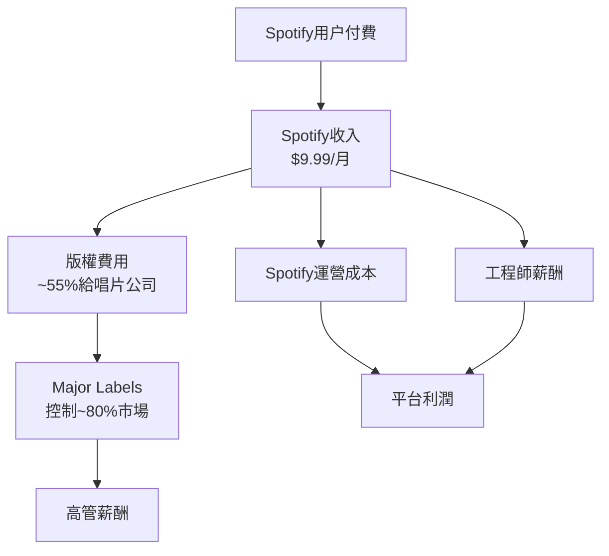
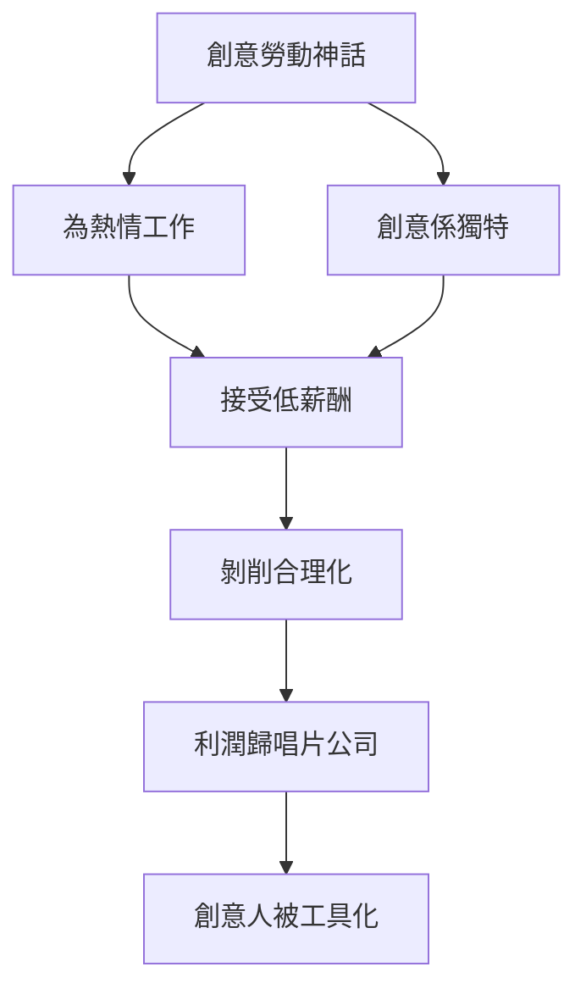
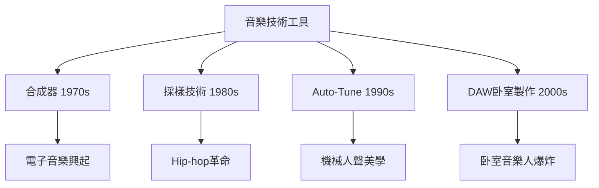
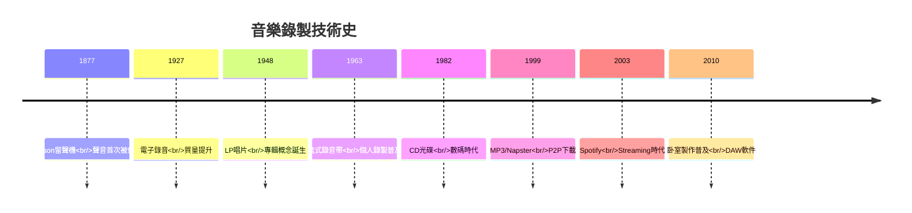
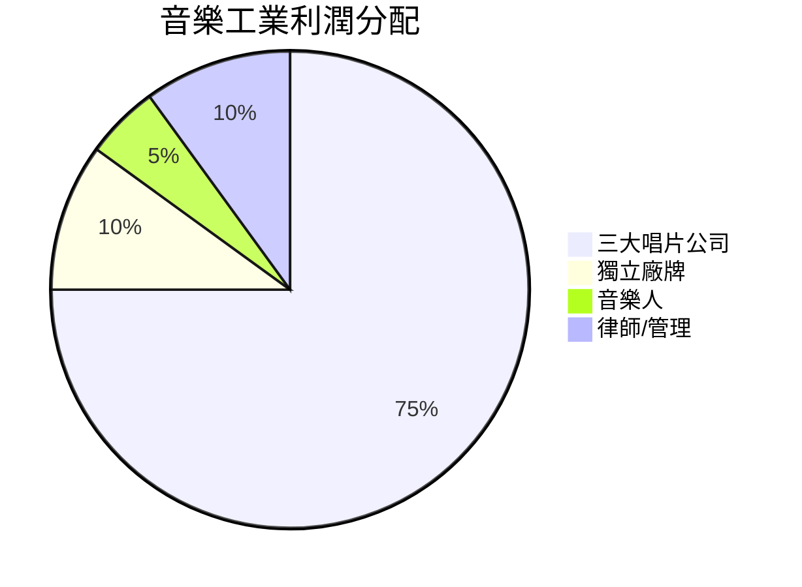
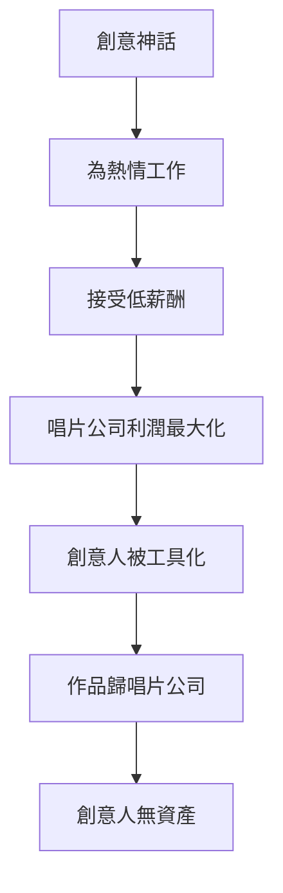
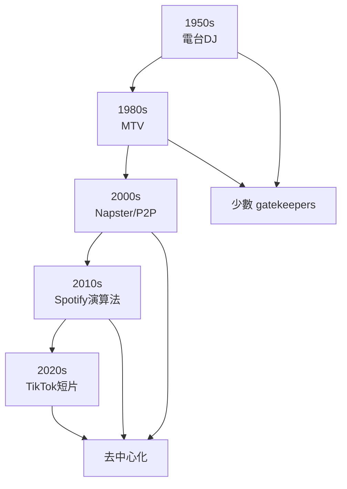

# HIST4039 科技與創意：音樂大生意 / In the Mix: Technology & Creativity in the Big Business of Music (6 credits)

**Instructor**: William Kelson
**Department**: History, HKU
**Official source**: [HKU History Course Description 2024-25](https://history.hku.hk/wp-content/uploads/2024/07/HIST-2425.pdf)
**Style**: 袁騰飛式 — 犀利、聚焦錄音科技點解重塑音樂，創意點解被資本主義改造

---

## 問題 1：這個領域所有專家共享的 5 個核心心智模型

### 心智模型 1：錄音科技改變音樂本體
學者 **Jonathan Sterne** (*The Audible Past*, 2003) 研究：錄音技術唔只係錄低聲音，而係改變咗我哋對音樂本身嘅理解——從現場表演到可複製作品。

學者 **Jacques Attali** (*Noise: The Political Economy of Music*, 1977) 分析：錄音技術係政治經濟變革——創造咗「再現」(representation) 音樂嘅新可能。

- 1877 年 Thomas Edison 發明留聲機 (phonograph) ——聲音可以被永久保存
- 1906 年 electric microphone ——錄音質量革命性提升
- 1948 年 LP 唱片 (33 1/3 rpm) ——「album」概念誕生
- 1982 年 CD 數碼光碟 ——壓縮時代開始
- 2001 年 iPod / 2003 年 Spotify ——streaming時代

### 心智模型 2：唱片工業與商業結構
學者 **William Kerson** (本課程導師) 研究：唱片公司點樣由「音樂推動者」變成「內容分發平台」。

學者 **Dave Laing** 分析：唱片合約——點解音樂人往往只能獲得極少收益？

- 1900s: 三大唱片公司形成 (EMI, Sony, Universal)
- 1960s: 披頭四浪潮——唱片工業黃金時代
- 1999 年 Napster ——P2P下載摧毁CD銷量
- 2010s: Spotify streaming ——每播放一次支付$0.003-$0.005
- 2020s: TikTok成爲音樂發現新平台

### 心智模型 3：創意勞動與資本主義
學者 **Andrew Ross** (*Nice Work If You Can Get It*, 2009) 研究：創意勞動——點解音樂人往往被迫接受極差條件？

學者 **Sarah Thornton** 分析：次文化資本——音樂場景點樣被商業化？

- 1960s-70s: 獨立唱片廠牌興起
- 1980s: MTV塑造視覺化音樂
- 1990s: 地下變主流——Britpop、Grunge
- 2000s: Major labels併購獨立廠牌
- 2010s: 獨立音樂人靠streaming為生

### 心智模型 4：科技與創意互動
學者 **Theodor Adorno** 研究：標準化音樂——點解流行曲有固定結構？

學者 **Philip Tagg** (*Music's Meanings*, 2012) 分析：流行音樂嘅「半文字」(semi-legible) 本質——點解我哋可以感受到歌詞情感但係唔理解每個字？

- 1960s: 調式轉變——minor key作爲「悲傷」共識
- 1970s: 4/4拍子作爲「跳舞」標準
- 1980s: 合成器音色作爲「未來感」
- 1990s: 採樣 (sampling) 技術——新創意形式
- 2010s: Auto-Tune——人聲被技術「修正」

### 心智模型 5：聲音作爲歷史證據
學者 **Emily Thompson** (*The Soundscape of Modernity*, 2002) 研究：聲音環境史——過去嘅聲音景觀同今日有乜嘢唔同？

學者 **Mark Katz** (*Capturing Sound*, 2010) 分析：錄音改變咗我哋理解音樂史嘅方式。

- 1920s 爵士樂黃金時代錄音
- 1950s 搖滾樂起飛
- 1960s 流行曲全球化
- 1990s 電子舞曲革命
- 2010s K-pop全球化

---

## 問題 2：3 個根本分歧

### 分歧 1：科技——釋放創意定約束創意？
- **A 方**：釋放
  - Auto-Tune、合成器、DAW軟件降低門檻
  - 任何人可以用 laptop 做音樂
- **B 方**：約束
  - Spotify演算法塑造聽眾品味
  - 商業化要求「radio-friendly」標準化

### 分歧 2：Streaming——民主化定剝削音樂人？
- **A 方**：民主化
  - 全球 distribution
  - 任何人可以發佈音樂
- **B 方**：剝削
  - 每播放一次$0.004
  - 收入極度不平等

### 分歧 3：創意——藝術定商品？
- **A 方**：藝術
  - 音樂有內在價值
  - 創意係人類表達基本需求
- **B 方**：商品
  - 音樂係內容產品
  - 創意服務市場需求

---

## 問題 3：10 個深度問題

1. 如果你去1877年，聽到 Edison 播放人類第一段錄音，你會點解？呢個時刻揭示咗乜嘢？
2. 點解 CD 年代（1982-2001）被稱為「音樂工業黃金時代」？但係呢個「黃金時代」服務咗邊個？
3. 如果你去比較一下 Spotify 同 1960年代披頭四時期嘅收入分配，會發現乜嘢令人震驚嘅數字？
4. 點解 Auto-Tune 被發明嚟修正走音，但係變成一種「音色」？呢個揭示咗乜嘢關於科技同創意嘅關係？
5. 如果你去分析過去50年嘅Billboard冠軍歌，會發現乜嘢令人不安嘅模式（例如：BPM、key、和弦進行）？
6. 點解 K-pop 可以喺20年內由零變成全球現象？但係呢個成功嘅代價係乜嘢？
7. 如果你去研究「獨立音樂」呢個類別，會發現乜嘢關於創意同商業嘅張力？
8. 點解「現場表演」喺 streaming 年代變得更加重要？但係直播演唱會又點解唔能夠完全取代現場？
9. 如果你去分析 TikTok 對音樂工業嘅影響，會發現乜嘢關於科技、平臺權力、創意生態嘅問題？
10. 如果你去2050年，會點解今日嘅音樂？AI 作曲會消滅創意嗎？

---

## 核心心智模型深化（中英對照）

## 1. 錄音科技與聲音本體 (Recording Technology & Sound)

### 1.1 Bilingual 概念對照
| 英文概念 | 中英對照 | 歷史含義 | 影響 |
|---|---|---|---|
| Phonograph | 留聲機 | 1877 Edison | 聲音可被保存 |
| Magnetic Tape | 磁帶 | 1940s 德國 | 多軌錄音 |
| LP Record | 黑膠唱片 | 1948 Columbia | album概念誕生 |
| Compact Disc | CD | 1982 Sony/Philips | 數碼革命 |
| Streaming | 流媒體 | 2003 Spotify | 按需聆聽 |

### 1.2 史料與考據
- Jonathan Sterne: The Audible Past (2003)
- Jacques Attali: Noise (1977)
- Emily Thompson: The Soundscape of Modernity (2002)

### 1.3 袁騰飛式犀利觀察
Edison 發明留聲機嗰一刻，人類歷史徹底改變——聲音第一次可以脫離現場表演而存在。
但係呢個發明唔只係科技創新，而係文化革命：現場表演開始被「替代」，「原創性」概念被重新定義。
你以為自己聽緊一首歌，但係你其實聽緊嘅係——一個工程師揀咗幾多次、邊個加咗reverb、邊個決定咗混音。

### 1.4 Deep test question
- 如果你去1900年，聽到第一個錄音，會感受到乜嘢？呢個體驗同今日有乜嘢本質上唔同？

### 1.5 圖解
```mermaid
flowchart TD
    A[1877 留聲機發明] --> B[聲音可被複製]
    B --> C[現場不再是唯一]
    C --> D[「原創性」被重新定義]
    D --> E[唱片工業興起]
    E --> F[可複製性變商品]
    F --> G[創意被工業化}
```

---

## 2. 唱片工業與商業結構 (Record Industry & Business Structure)

### 1.1 Bilingual 概念對照
| 英文概念 | 中英對照 | 歷史含義 | 爭議 |
|---|---|---|---|
| Major Labels | 三大唱片公司 | EMI/Sony/Universal | 市場壟斷 |
| Independent Labels | 獨立廠牌 | Motown, Stiff, Sub Pop | 文化多樣性 |
| Artist Contract | 藝人合約 | 利潤分配機制 | 剝削爭議 |
| Royalty | 版税 | 播放收入分配 | 極低分配 |
| Advance | 預付款 | 廠牌墊支 | 合約綑綁 |

### 1.2 史料與考據
- Recording Industry Association data
- Spotify royalty payment records
- William Kerson course materials

### 1.3 袁騰飛式犀利觀察
唱片工業最黑暗嘅秘密：三大唱片公司控制咗全球80%音樂市場，但係從來唔係服務音樂人——係服務投資者。
Spotify每播放一次俾音樂人平均$0.004——你播一首歌1,000次，音樂人收到$4。但係Spotify平均每用戶每月俾$9.99。錢去咗邊？
Answer：版權律師、唱片公司高管、算法工程師——但係唔係音樂人。

### 1.4 Deep test question
- 如果你係一個獨立音樂人，靠Spotify可以維生嗎？點解唔可以？

### 1.5 圖解


---

## 3. 創意勞動與資本主義 (Creative Labor & Capitalism)

### 1.1 Bilingual 概念對照
| 英文概念 | 中英對照 | 歷史含義 | 案例 |
|---|---|---|---|
| Creative Labor | 創意勞動 | 藝術工作商品化 | 音樂人打工 |
| Affective Labor | 情感勞動 | 工作涉及情感付出 | 表演藝術 |
| Precarity | 不穩定 | 臨時工、零工經濟 | 獨立音樂人 |
| Authenticity | 真實性 | 創意商品嘅品牌 | indie美學 |
| Brand Identity | 品牌形象 | 音樂人變品牌 | K-pop |

### 1.2 史料與考據
- Andrew Ross: Nice Work If You Can Get It (2009)
- Sarah Thornton: Capital in the Twenty-First Century

### 1.3 袁騰飛式犀利觀察
Andrew Ross最犀利嘅發現：創意工作者往往被迫接受極差工作條件，因為我哋社會相信「創意係熱情，你應該為熱情犧牲」。
但係當創意變成免費或廉價勞動，就係資本主義對創意最大嘅剝削。
K-pop 就係最佳例證：練習生系統——年輕人被迫幾年免費訓練，然後被唱片公司綑綁——呢個唔係創意産業，呢係現代奴隸制度。

### 1.4 Deep test question
- 如果你去分析K-pop練習生合約，會發現邊啲剝削條款？

### 1.5 圖解


---

## 4. 科技塑造創意形式 (Technology Shapes Creative Form)

### 1.1 Bilingual 概念對照
| 英文概念 | 中英對照 | 歷史含義 | 爭議 |
|---|---|---|---|
| Synthesizer | 合成器 | 電子音色 | 1970s |
| Auto-Tune | 音高修正 | 人聲被數碼「修正」 | 1990s-present |
| Sampling | 採樣 | 從舊歌提取片段 | Hip-hop核心 |
| DAW | 數碼音頻工作站 | 卧室音樂製作 | 2000s-present |
| Algorithm | 推薦算法 | Spotify Discover Weekly | 塑造品味 |

### 1.2 史料與考據
- Mark Katz: Capturing Sound (2010)
- Philip Tagg: Music's Meanings (2012)

### 1.3 袁騰飛式犀利觀察
Auto-Tune發明嘅故事最諷刺：一個用嚟修正走音嘅工具，變成一種音色——T-Pain、 Kanye West 用Auto-Tune做出嚟嘅「機械人聲」，變成一種美學選擇。
呢個揭示咗科技同創意嘅複雜關係：工具塑造使用者——當你可以用Auto-Tune，你就會開始使用佢，即使你原本走唔走音。

### 1.4 Deep test question
- 如果你去比較1960年代披頭四同今日K-pop音樂，會發現乜嘢關於標準化程度嘅令人不安嘅證據？

### 1.5 圖解


---

## 5. 聲音作爲歷史證據 (Sound as Historical Evidence)

### 1.1 Bilingual 概念對照
| 英文概念 | 中英對照 | 歷史含義 | 應用 |
|---|---|---|---|
| Soundscape | 聲音景觀 | 一個時代嘅聲音環境 | 城市噪音研究 |
| Sonic Turn | 聲音轉向 | 歷史研究關注聲音 | 新方法論 |
| Recorded Music | 錄音音樂 | 可保存嘅音樂 | 歷史檔案 |
| Live Performance | 現場表演 | 不可複製嘅瞬間 | 消失嘅傳統 |
| Nostalgia | 懷舊 | 聲音唤起記憶 | 聲音記憶政治 |

### 1.2 史料與考據
- Emily Thompson: The Soundscape of Modernity (2002)
- Jonathan Sterne: The Audible Past (2003)

### 1.3 袁騰飛式犀利觀察
歷史學家長期忽視聲音——因為聲音係暫時性嘅，唔似文字、圖像咁容易保存。
但係Emily Thompson揭示：聲音景觀就係歷史——1920年代紐約地鐵噪音、1960年代倫敦咖啡館背景音樂——呢啲聲音塑造咗嗰個時代嘅生活經驗。
當你播放1960年代錄音，你唔只係聽到音樂，你係聽到一個時代。

### 1.4 Deep test question
- 如果你去研究香港1970年代嘅聲音景觀，你會發現乜嘢？TVB電視配音？電車聲？街市叫賣聲？

### 1.5 圖解
```mermaid
flowchart TD
    A[聲音景觀 Soundscape] --> B[城市噪音]
    A --> C[流行音樂]
    A --> D[現場表演]
    A --> E[日常環境音]
    B --> F[集體生活經驗]
    C --> G[時代情緒]
    D --> H[文化傳統]
    E --> F
    F --> I[歷史理解深化}
    G --> I
    H --> I
```

---

## 深度自測問題詳解

### 詳解 1: 點解錄音科技咁重要？
1877年前，音樂係短暫嘅——表演完就消失。錄音發明後，人類可以保存聲音——呢個改變咗我哋對音樂、對時間、對記憶嘅理解。

### 詳解 2: Spotify模式嘅問題
Spotify每播放一次俾$0.004——如果你嘅歌有100萬播放，你收到$4,000。但係你需要有1,000,000播放先得到$4,000。點解唔掂？

### 詳解 3: K-pop點解咁成功但又咁有問題？
成功：訓練有素、視覺精美、全球distribution。問題：練習生合約剥削、工作強度極高、創作自主權極低。呢個係創意産業最大嘅矛盾之一。

### 詳解 4: 標準化——點解所有Billboard冠軍歌聽起來都差唔多？
因為唱片公司為降低風險，傾向資助「proven formula」——固定BPM (120)、固定key (C major)、固定結構（verse-chorus-hook）。創意被商業邏輯約束。

### 詳解 5: 卧室音樂製作——點解改變咗遊戲規則？
DAW軟件（Logic Pro, Ableton, FL Studio）價格由$10000降到$200——任何人都可以製作專業品質音樂。但係進入門檻降低，收入分配更不平等。

### 詳解 6: 採樣技術——係盜竊定創新？
採樣係Hip-hop核心技術，但係涉及版權問題——如果我喺你首歌入面取咗3秒，係創意表達定知識產權侵犯？呢個係未解決嘅法律同創意問題。

### 詳解 7: 如果你去比較一下1960年代披頭四同今日音樂？
披頭四：現場錄音，樂器真實，4-5分鐘歌曲。今日：Auto-Tune，多軌疊加，hook前3秒就要出現。兩者都係「創意」，但係創意嘅定義已經被技術同商業改變。

### 詳解 8: 聲音景觀研究——點解重要？
聲音塑造生活經驗——1920年代紐約地鐵噪音塑造咗嗰個時代嘅城市生活感。忽視聲音就等於忽視歷史嘅感官維度。

### 詳解 9: 演算法塑造品味——點解係問題？
Spotify演算法傾向推薦「已完成social proof」嘅音樂——已經有好多播放嘅歌得到更多播放。呢個加劇咗市場不平等，新人更難突圍。

### 詳解 10: AI作曲——會消滅創意嗎？
唔會消滅創意，但係會改變創意工作嘅經濟學——重複性工作被AI替代，但係人類情感表達、故事敘述、社會連結仍然係人類創意核心。

---

## 5 個 Mermaid 圖解

### 📊 Diagram 1: 音樂錄製技術演變


### 📊 Diagram 2: 唱片工業收入分配


### 📊 Diagram 3: 創意勞動剝削結構


### 📊 Diagram 4: 音樂發現平台演變


### 📊 Diagram 5: 獨立vs主流音樂經濟學


---

## 總結

1. **錄音科技徹底改變咗音樂本體**——現場表演被替代、「原創性」被重新定義、聲音可以被複製同傳播。
2. **唱片工業利潤分配極度不平等**——三大公司控制80%市場、從創意人身上剝削最大份額。
3. **創意被資本主義改造為商品**——創意神話掩蓋咗實際嘅剝削關係，K-pop練習生制度係最極端案例。
4. **標準化約束創意**——Billboard冠軍歌模式揭示商業邏輯點樣塑造創意形式。
5. **Streaming年代音樂人收入崩潰**——$0.004/播放唔足以維生，但係平台利潤飆升。創意嘅價值被嚴重低估。

**最後問題**: 如果你去2050年回望今日，會點解Spotify呢個時代——係創意繁榮定剝削深化？

---
**版權所有 © HKU History Self-Study**
