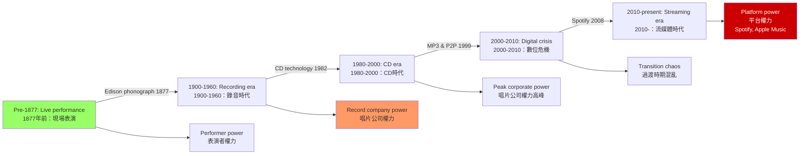
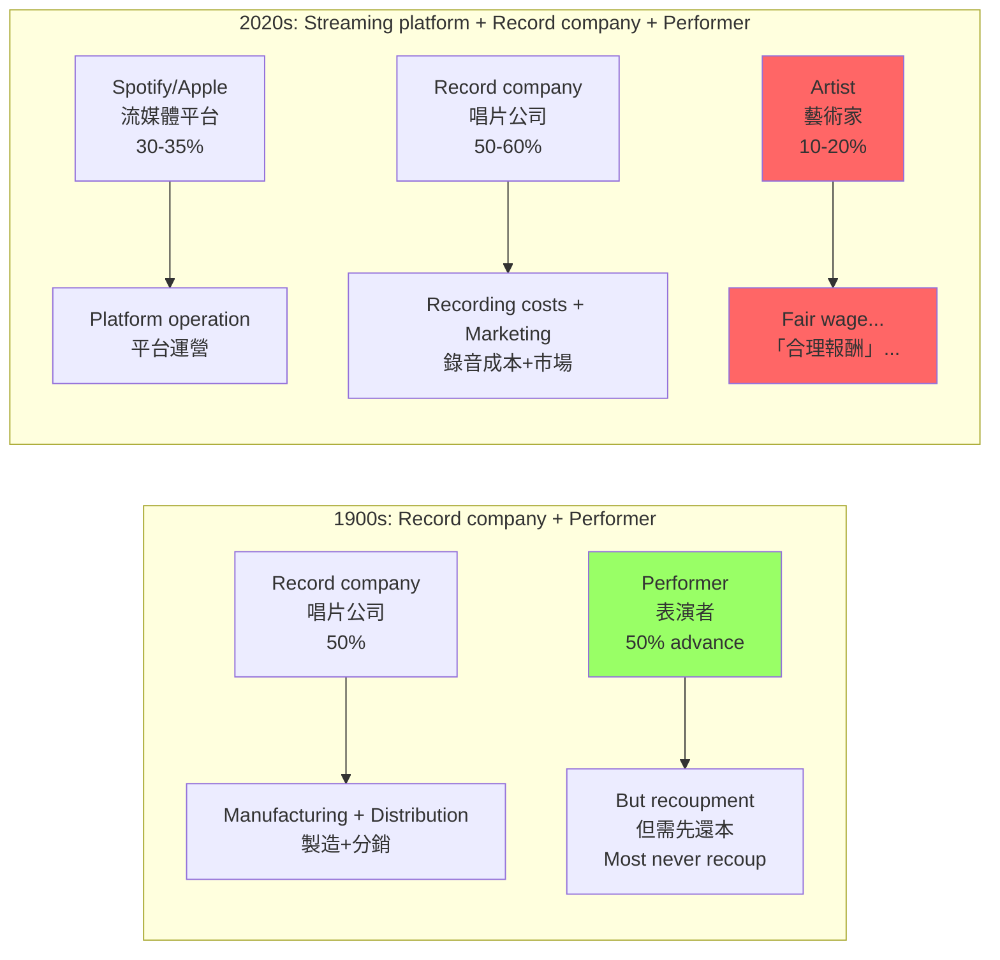
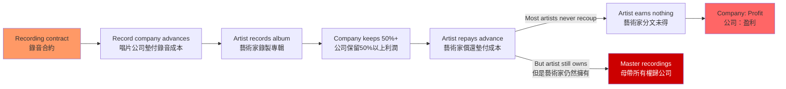
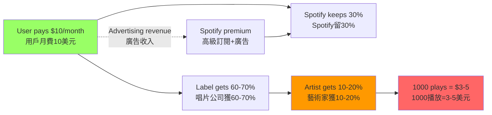
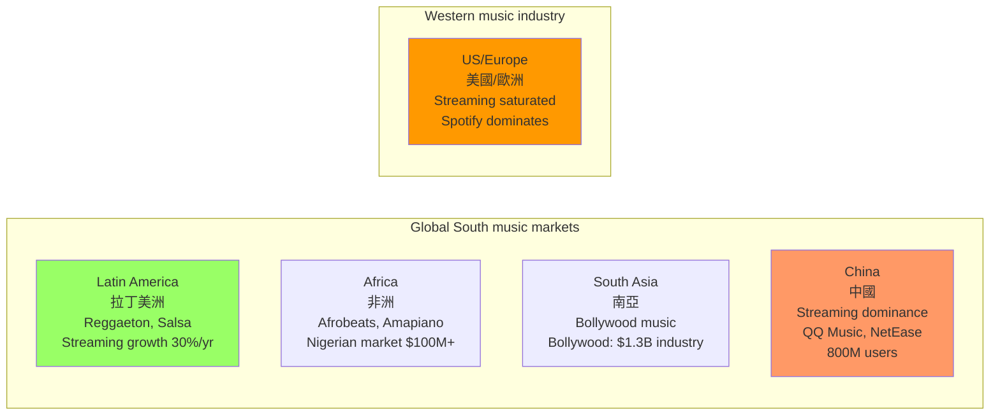

# HIST4039 科技、創意與音樂 / In the Mix: Technology & Creativity in the Big Business of Music

**Instructor**: William Kelson
**Department**: History, HKU
**Official source**: [HKU History Course Description](https://history.hku.hk/ug_cd/)
**Style**: 袁騰飛式 — 犀利、聚焦科技與資本主義如何改造了音樂——從黑膠唱片到Spotify，誰在控制你的耳朵？

---

## 問題 1：5 個核心心智模型

### 1. 錄音技術與權力（Recording Technology and Power）

**專家如何思考**: 錄音技術的發明（1877 年愛迪生 phonograph，1888 年柏林納 gramophone）根本改變了音樂的權力結構——從現場表演（表演者控制）到錄音製品（唱片公司控制）。學者 **Theodor Adorno** 和 **Jacques Attali** 最早從政治經濟學角度分析錄音技術對音樂的控制。

- **典型學者**: **Jacques Attali** — *Noise: The Political Economy of Music* (1977, English 1985); **Mark Katz** — *Capturing Sound: How Technology Has Changed Music* (2004); **William Kelson** (course instructor, HKU)
- **驗證案例**: 1902 年 Enrico Caruso 的錄音（10美元/張，售出100萬張）——第一個百萬銷量唱片，標誌著唱片工業的誕生，也標誌著表演者被唱片公司控制的開始

### 2. 唱片工業的商業模式（The Recording Industry Business Model）

**專家如何思考**: 唱片工業從 1900 年代到 2000 年代經歷了多次商業模式轉型：78 rpm 唱片 → LP 唱片 → 卡帶 → CD → MP3 → 流媒體（streaming）。學者 **David Hesmondhalgh** 研究：每次技術轉型都伴随着唱片公司利潤模式的重新配置，而藝術家的報酬往往在每次轉型中減少。

- **典型學者**: **David Hesmondhalgh** — *The Cultural Industries* (2007, rev. 2019); **Keith Negus** — *Producing Pop/Rock* (1992); **Theodor Adorno** — *On Popular Music* (1941)
- **驗證案例**: CD 時代（1982-2000）：CD 售價約 20-25 美元/張，唱片公司拿走約 50% 利潤，藝術家平均獲得約 10-15%；流媒體時代（2010-）：Spotify 播放 1,000 次約得 3-5 美元，藝術家通常只獲得 20-30% 的收入

### 3. 創意勞動與剝削（Creative Labor and Exploitation）

**專家如何思考**: 錄音工業的核心剝削模式是「錄音合約」（recording contract）——唱片公司墊付錄音成本，藝術家以「未來版税」償還，而實際上大多數藝術家永遠達不到「收支平衡點」。學者 **Dave Laing** 和 **Keith Negus** 研究：流行音樂工業中，「獨立藝術家」（indie artists）和「主流藝術家」（mainstream artists）之間存在巨大的權力不平等。

- **典型學者**: **Dave Laing** — *Music and Copyright* (2005); **Ross欲** — research on streaming economy
- **驗證案例**: Prince 與 Warner Bros. 的鬥爭（1993-1996）：Prince 試圖擺脫合約控制，但 Warner Bros. 拒絕釋放他的版權——這揭示了唱片合約如何系統性地剝削藝術家的創意控制權

### 4. 流媒體革命（The Streaming Revolution）

**專家如何思考**: 2010 年代流媒體的興起（Spotify 2008, Apple Music 2015）是自 CD 以來最大規模的唱片工業重組。學者 **James Hanley** 和 **Simon Frith** 研究：流媒體對藝術家的報酬遠低於 CD 時代，Spotify 的「播放量」貨幣化模型導致了「垃圾量」（gaming streams）問題——藝術家為獲得播放量而調整創作方向。

- **典型學者**: **Simon Frith** — *Sound Effects: Youth, Leisure and the Politics of Rock* (1981); **Mark Perry** — research on streaming economics; **Spotify research collective**
- **驗證案例**: 2015 年 Taylor Swift 從 Spotify 撤下所有歌曲——這一行動揭示了流媒體時代藝術家與平台之間圍繞「合理報酬」的嚴重矛盾

### 5. 全球南方與音樂工業（Global South and the Music Industry）

**專家如何思考**: 唱片工業的歷史長期被「西方中心」主導——但拉丁美洲、非洲和南亞的本地音樂市場規模巨大，且有獨特的運作邏輯。學者 **Larry Cronk** 和 **Nina Krick** 研究：全球南方市場的盜版問題、音樂盜版（piracy）和「非正式市場」（informal markets）如何塑造了本地音樂生態。

- **典型學者**: **Larry Cronk** — research on global music markets; **Fong** — research on Cantopop and Mandopop
- **驗證案例**: 1980-90 年代香港盜版卡帶市場——九龍城的盜版攤檔實際上是很多香港人接觸最新流行音樂的主要渠道，官方「打擊盜版」話語掩蓋了這種「非正式音樂經濟」的社會功能

---

## 問題 2：3 個根本分歧

### 分歧 1：流媒體——音樂民主化 vs 藝術家剝削？
**核心問題**: Spotify 等流媒體平台是「音樂民主化」的工具（讓任何人都可以發布和傳播音樂），還是對藝術家的系統性剝削？

### 分歧 2：科技——創意解放者 vs 控制工具？
**核心問題**: 錄音技術的發明對創意實踐是解放性的（釋放了更多創意可能性）還是控制性的（讓唱片公司能够更有效地剝削藝術家）？

### 分歧 3：盜版——盜竊 vs 市場教育的必要代價？
**核心問題**: 音樂盜版（MP3盜版、P2P下載）是對藝術家知識產權的侵犯，還是在數字時代市場結構重構過程中的「必要的」市場教育成本？

---

## 問題 3：10 個深度問題

1. **1877 年愛迪生留聲機的發明**如何改變了「現場表演」的意義？從那時候起，音樂同時存在於兩個「空間」：現場和錄音——這種「双重存在」如何改變了藝術家和聽眾之間的關係？
2. 比較 1902 年 Enrico Caruso 的「百萬銷量唱片」和 2023 年 BTS 的「Spotify 播放量」——這兩種「成功」測量標準背後的商業邏輯有什麼根本差異？
3. **Theodor Adorno** 在 1941 年寫的「關於流行音樂」是 80 多年前的文章——這篇文章對理解當代流媒體音樂經濟還有相關性嗎？哪些分析需要修正，哪些仍然有效？
4. 從馬克思主義政治經濟學角度，分析唱片工業的「剩餘價值」是如何被創造和分配的——藝術家的「創意勞動」如何被唱片公司轉化為剩餘價值？
5. **K-pop 的全球化**：BTS 和 BLACKPINK 如何成為全球流行音樂現象？這種全球化背後的唱片公司策略（SM Entertainment, YG Entertainment, HYBE）與好萊塢的全球化策略有什麼相似之處？
6. **中國大陸的流媒體音樂市場**：QQ音樂、網易雲音樂和蝦米音樂（已關閉）在中國大陸的市場份額競爭，如何反映了中國政府對內容平台的政治管控？騰訊的版權獨家模式（2015-2021）如何被中國監管機構（SAMR）打擊？
7. **AI 生成音樂**：當人工智能可以根據你的「口味」自動生成音樂時，唱片公司和藝術家的角色會發生什麼根本性變化？誰擁有 AI 生成音樂的版權？
8. **香港流行音樂（Cantopop）的黃金時代（1970-1990）**：許冠傑、張國榮、Beyond 等藝術家如何從「錄音工業技術限制」和「創意商業需求」的張力中創造了一種獨特的本地流行音樂形式？
9. 從 **Jacques Attali** 的「噪音政治經濟學」角度，分析當代「粉絲文化」（fan culture）如何成為了唱片公司和藝術家之間新興的第三力量？粉絲的「應援」文化對藝術家報酬有什麼影響？
10. **Spotify 與中國市場的缺席**：為什麼 Spotify 沒有進入中國大陸市場？這背後的政治和經濟原因是什麼？這種缺席如何影響了中國本土流媒體平台的發展軌跡？

---

# 核心心智模型深化（中英對照）

## 1. 錄音技術與權力

### 1.1 Bilingual 概念對照
| 英文 | 中文 | 歷史含義 | 關鍵年份 |
|---|---|---|---|
| Phonograph (Edison) | 留聲機（愛迪生） | 聲音的首次固定 | 1877 |
| Gramophone (Berliner) | 唱片機（柏林納） | 大量複製的技術基礎 | 1888 |
| Recording industry | 錄音工業 | 唱片公司和藝術家的權力關係 | 1900- |
| Sound fixation | 聲音固定 | 現場表演 vs 錄音製品 | 1877 |

### 1.3 袁騰飛式犀利觀察
1877 年愛迪生發明留聲機時，全世界的音樂家都沒有意識到這意味著什麼。

留聲機不僅是「錄下聲音」的工具——它是權力轉移的工具。在留聲機發明之前，音樂的權力在表演者手裏；留聲機發明之後，權力轉移到了能夠控制錄音設備和分銷渠道的人手裏。

從那一刻起，「音樂」這種人類最本能的表達形式，就被納入了資本主義的生產-分銷-消費循環——而這個循環的利潤，主要被唱片公司和投資者拿走了。

### 1.5 圖解：錄音技術的權力轉移

---

## 2. 唱片工業的商業模式

### 2.1 圖解：唱片工業利潤分配的歷史變遷

---

## 3. 創意勞動與剝削

### 3.1 圖解：唱片合約的剝削邏輯

---

## 4. 流媒體革命

### 4.1 圖解：流媒體平台的價值鏈

---

## 5. 全球南方與音樂工業

### 5.1 圖解：全球音樂市場的地緣政治

---

# 總結

1. **錄音技術的發明不是「中性的」科技進步**：它是權力轉移的工具——把音樂的控制權從表演者手中轉移到唱片公司手中。

2. **唱片工業的商業模式是系統性的創意剝削**：從 1900 年代的「版税預支」到 2020 年代的「流媒體播放量」，唱片公司和平台持續拿走音樂價值鏈的最大份額。

3. **流媒體時代對藝術家的報酬實際上低於 CD 時代**：Spotify 每千次播放付 3-5 美元，而 CD 時代藝術家平均獲得約 1-2 美元/張專輯的版税（考慮通脹調整後更高）。

4. **香港流行音樂的黃金時代是技術限制與創意自由的獨特產物**：在數位複製技術出現之前，現場表演和錄音製品同時存在，這種「雙重存在」催生了獨特的本地流行音樂美學。

5. **AI 生成音樂預示了唱片工業的下一個根本性轉型**：當技術可以根據用戶口味自動生成「定制音樂」時，「藝術家」這個概念本身可能會被重新定義。

**自學建議**: 配合 Jacques Attali 的 *Noise* + David Hesmondhalgh 的 *The Cultural Industries* + Mark Katz 的 *Capturing Sound*，輸出音樂工業分析到 `06_Reading_Notes/`。
