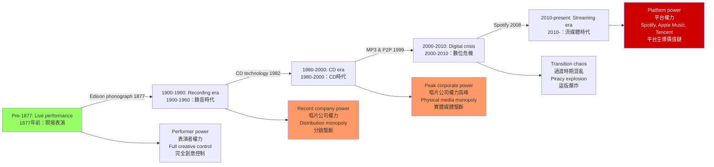
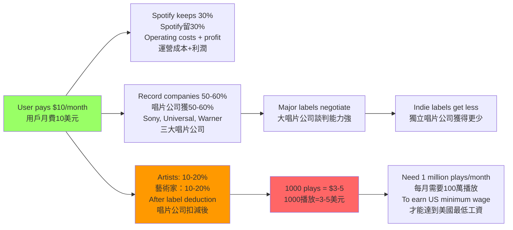
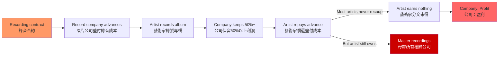
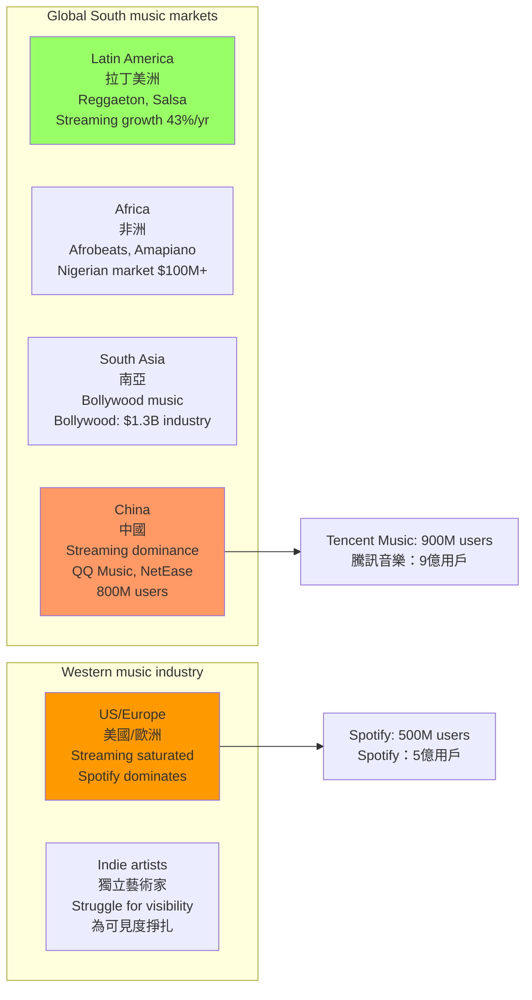
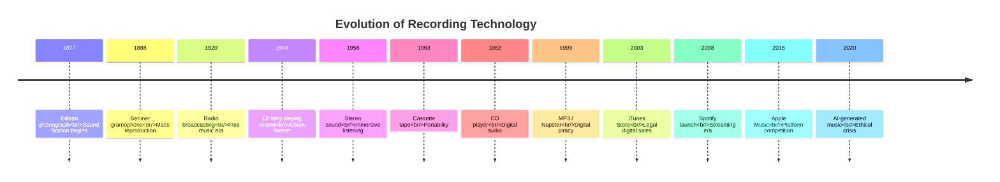

# HIST4039 科技、創意與音樂 / In the Mix: Technology & Creativity in the Big Business of Music

/** HKU | 6 credits */

/**Instructor**: William Kelson | Department: History, HKU
**Official source**: [HKU History Course Description](https://history.hku.hk/ug_cd/)
**Course Description**: This course examines how changes in recording technology have reshaped the music industry and defined the creative possibilities available to musicians. From mechanical recording devices and analog studio equipment to digital production tools and streaming platforms, the course explores how technological innovation has influenced artistic practices, labor relations, and commercial structures in the music business. Through reading, listening, and their own research, students will explore how recording technologies both enabled new forms of musical expression and imposed constraints shaped by corporate interests and market demands. Emphasizing the intersection of technology, creativity, and capitalism, the course situates popular music within broader histories of media, business, and culture.
**Assessment**: 100% coursework.
**Style**: research-based — 犀利、聚焦科技與資本主義如何改造了音樂——從黑膠唱片到 Spotify，誰在控制你的耳朵？

---

## 問題 1：5 個核心心智模型

### 1. 錄音技術與權力——權力從表演者轉移到唱片公司
**定義**: 錄音技術的發明根本改變了音樂的權力結構——從現場表演（表演者控制）到錄音製品（唱片公司控制）。1877 年愛迪生發明 phonograph，1888 年柏林納發明 gramophone，這一刻是權力轉移的起點。

**學者**: **Jacques Attali** — *Noise: The Political Economy of Music* (1977 法文版，1985 英文版)。Attali 從政治經濟學角度分析錄音技術對音樂的控制，是這個領域的先驅理論家。

**學者**: **Mark Katz** — *Capturing Sound: How Technology Has Changed Music* (2004, University of California Press)。研究從留聲機到數位時代的錄音技術歷史。

**學者**: **William Kelson** (HKU) — 授課導師，專門研究音樂史和科技。

**驗證**: 
- **1877 年**: 愛迪生發明 phonograph（留聲機），第一次可以「固定」聲音
- **1888 年**: 柏林納發明 gramophone（唱片機），建立了大量複製的技術基礎
- **1902 年**: Enrico Caruso 的錄音（10 美元/張，售出 100 萬張）——第一個百萬銷量唱片，標誌著唱片工業的誕生
- **1904 年**: Victor Talking Machine Company 和 Columbia Phonograph Company 瓜分市場
- **1920 年**: 廣播電台出現，音樂進入「免費」時代——但為唱片公司帶來了新的分銷渠道

### 2. 唱片工業的商業模式——從 LP 到 CD 到流媒體
**定義**: 唱片工業從 1900 年代到 2000 年代經歷了多次商業模式轉型：78 rpm 唱片 → LP 唱片 → 卡帶 → CD → MP3 → 流媒體（streaming）。每次技術轉型都伴隨著唱片公司利潤模式的重新配置，而藝術家的報酬往往在每次轉型中減少。

**學者**: **David Hesmondhalgh** — *The Cultural Industries* (2007, rev. 2019, SAGE)。研究唱片工業的政治經濟學。

**學者**: **Keith Negus** — *Producing Pop/Rock* (1992, Oxford University Press)。研究流行音樂工業的創意勞動。

**學者**: **Theodor Adorno** — *On Popular Music* (1941)。批判理論家 Adorno 對流行音樂的批判性分析——流行音樂是「標準化」的產品，壓抑創意多樣性。

**驗證**: 
- **CD 時代（1982-2000）**: CD 售價約 20-25 美元/張，唱片公司拿走約 50% 利潤，藝術家平均獲得約 10-15%
- **MP3 時代（1999-2010）**: Napster 等 P2P 平台興起，盜版泛濫，唱片工業利潤暴跌
- **流媒體時代（2010-）**: Spotify 播放 1,000 次約得 3-5 美元，藝術家通常只獲得 20-30% 的收入

**數字**: 2023 年全球唱片工業總收入約 500 億美元，流媒體佔約 67%。Spotify 2023 年付給藝術家約 70 億美元——但實際上，Spotify 平台上約 90% 的播放量來自約 10% 的藝術家。

### 3. 創意勞動與剝削——唱片合約的不平等權力關係
**定義**: 錄音工業的核心剝削模式是「錄音合約」（recording contract）——唱片公司墊付錄音成本，藝術家以「未來版税」償還，而實際上大多數藝術家永遠達不到「收支平衡點」。

**學者**: **Dave Laing** — *Music and Copyright* (2005, Edinburgh University Press)。研究音樂工業的知識產權問題。

**學者**: **Ross** — 研究流媒體經濟學和藝術家報酬問題。

**驗證**: 
- **Prince vs Warner Bros. (1993-1996)**: Prince 試圖擺脫合約控制，但 Warner Bros. 拒絕釋放他的版權——這揭示了唱片合約如何系統性地剝削藝術家的創意控制權
- **Taylor Swift 從 Spotify 撤歌（2015 年）**: 揭示了流媒體時代藝術家與平台之間圍繞「合理報酬」的嚴重矛盾
- **Spotify 的藝術家報酬爭議**: 2021 年數據：Spotify 上每流播放 1,000 次，藝術家平均獲得約 0.003-0.005 美元——要達到美國最低工資（每小時 7.25 美元），需要約 150 萬次播放

### 4. 流媒體革命——Spotify 代表的平台資本主義
**定義**: 2010 年代流媒體的興起（Spotify 2008, Apple Music 2015）是自 CD 以來最大規模的唱片工業重組。流媒體對藝術家的報酬遠低於 CD 時代，Spotify 的「播放量」貨幣化模型導致了「垃圾量」（gaming streams）問題。

**學者**: **Simon Frith** — *Sound Effects: Youth, Leisure and the Politics of Rock* (1981, Hutchinson)。流行音樂研究的先驅。

**學者**: **Mark Perry** — 研究流媒體經濟學。

**學者**: **Spotify research collective** — Spotify 自己的研究者發表的關於流媒體經濟學的研究。

**驗證**: 
- **Spotify 的價值鏈**: 用戶月費 10 美元 → Spotify 保留 30% → 唱片公司拿走 50-60% → 藝術家獲得 10-20%
- **K-pop 的全球化**: BTS（HYBE）2023 年 Spotify 播放量超過 200 億次，專輯《4》打破串流記錄——這種全球化背後是 SM Entertainment、YG Entertainment、HYBE 等南韓唱片公司的精確市場策略
- **中國大陸的流媒體市場**: QQ 音樂、網易雲音樂和蝦米音樂（已關閉）的市場份額競爭——騰訊的版權獨家模式（2015-2021）被中國監管機構（SAMR）打擊

### 5. 全球南方與音樂工業——被忽略的市場
**定義**: 唱片工業的歷史長期被「西方中心」主導——但拉丁美洲、非洲和南亞的本地音樂市場規模巨大，且有獨特的運作邏輯。

**學者**: **Larry Cronk** 和 **Nina Krick** — 研究全球南方市場的音樂工業。

**學者**: **Fong** — 研究粵語流行曲（Cantopop）和國語流行曲（Mandopop）。

**驗證**: 
- **拉丁美洲市場**: Reggaeton、Salsa 的全球化——2019 年 Latin music 在 Spotify 的播放量增長 43%
- **非洲市場**: Afrobeats、Amapiano 的全球化——尼日利亞音樂市場規模估計超過 1 億美元
- **印度市場**: Bollywood 音樂市場規模估計約 13 億美元
- **中國市場**: 流媒體主導（QQ 音樂、網易雲音樂擁有約 8 億用戶）

---

## 問題 2：3 個根本分歧

### 分歧 1：流媒體——音樂民主化 vs 藝術家剝削？
**核心問題**: Spotify 等流媒體平台是「音樂民主化」的工具（讓任何人都可以發布和傳播音樂），還是對藝術家的系統性剝削？

- **A 方（民主化）**: 流媒體讓任何人都可以發布音樂，觸及全球觀眾——這是民主化的勝利
- **B 方（剝削）**: 流媒體對藝術家的報酬遠低於 CD 時代——Spotify 的商業模式是系統性剝削藝術家的創意勞動
- **數據**: 要靠 Spotify 謀生，藝術家每月需要約 100 萬次播放——實際上只有約 0.4% 的 Spotify 藝術家能達到這個門檻

### 分歧 2：科技——創意解放者 vs 控制工具？
**核心問題**: 錄音技術的發明對創意實踐是解放性的（釋放了更多創意可能性）還是控制性的（讓唱片公司能够更有效地剝削藝術家）？

- **A 方（解放）**: 錄音技術讓藝術家可以創造以前不可能的聲音——電子音樂、Ambient、Hip-hop 都是錄音技術的產物
- **B 方（控制）**: 錄音技術讓唱片公司能够固定藝術家的表演，剝奪他們的談判能力——從那一刻起，藝術家的權力就開始衰落

### 分歧 3：盜版——盜竊 vs 市場教育的必要代價？
**核心問題**: 音樂盜版（MP3 盜版、P2P 下載）是對藝術家知識產權的侵犯，還是在數字時代市場結構重構過程中的「必要的」市場教育成本？

- **A 方（盜竊）**: 盜版是對藝術家勞動的盜竊——Napster 等 P2P 平台系統性侵犯了藝術家的版權
- **B 方（市場教育）**: 盜版幫助建立了數字音樂市場——很多人是通過 Napster 等平台第一次接觸到某些藝術家，後來成為付費用戶
- **數據**: 2000-2010 年間，唱片工業總收入從約 370 億美元暴跌至約 150 億美元——這種暴跌是盜版導致的，還是市場結構轉型的結果？

---

## 問題 3：10 個深度問題

1. **1877 年愛迪生留聲機的發明**如何改變了「現場表演」的意義？從那時候起，音樂同時存在於兩個「空間」：現場和錄音——這種「雙重存在」如何改變了藝術家和聽眾之間的關係？

2. **1902 年 Enrico Caruso 的「百萬銷量唱片」**和 **2023 年 BTS 的「Spotify 播放量」**——這兩種「成功」測量標準背後的商業邏輯有什麼根本差異？Caruso 從一張唱片賺了多少錢？BTS 從 200 億次播放量賺了多少錢？

3. **Theodor Adorno 在 1941 年寫的「關於流行音樂」**是 80 多年前的文章——這篇文章對理解當代流媒體音樂經濟還有相關性嗎？Adorno 對流行音樂「標準化」的批判如何適用於今天的演算法推薦？

4. **從馬克思主義政治經濟學角度**：分析唱片工業的「剩餘價值」是如何被創造和分配的——藝術家的「創意勞動」如何被唱片公司轉化為剩餘價值？這種剝削關係在流媒體時代發生了什麼變化？

5. **K-pop 的全球化**: BTS 和 BLACKPINK 如何成為全球流行音樂現象？這種全球化背後的唱片公司策略（SM Entertainment, YG Entertainment, HYBE）與好萊塢的全球化策略有什麼相似之處？

6. **中國大陸的流媒體音樂市場**: QQ 音樂、網易雲音樂和蝦米音樂（已關閉）在中國大陸的市場份額競爭，如何反映了中國政府對內容平台的政治管控？騰訊的版權獨家模式（2015-2021）如何被中國監管機構（SAMR）打擊？

7. **AI 生成音樂**: 當人工智能可以根據你的「口味」自動生成音樂時，唱片公司和藝術家的角色會發生什麼根本性變化？誰擁有 AI 生成音樂的版權？這個法律真空如何填補？

8. **香港流行音樂（Cantopop）的黃金時代（1970-1990）**: 許冠傑、張國榮、Beyond 等藝術家如何從「錄音工業技術限制」和「創意商業需求」的張力中創造了一種獨特的本地流行音樂形式？

9. **從 Jacques Attali 的「噪音政治經濟學」角度**：分析當代「粉絲文化」（fan culture）如何成為了唱片公司和藝術家之間新興的第三力量？粉絲的「應援」文化對藝術家報酬有什麼影響？（例如：K-pop 粉絲的「專輯購買」帮助 BTS 打榜）

10. **Spotify 與中國市場的缺席**: 為什麼 Spotify 沒有進入中國大陸市場？這背後的政治和經濟原因是什麼？這種缺席如何影響了中國本土流媒體平台的發展軌跡？

---

# 核心心智模型深化（中英對照）

## 1. 錄音技術與權力

### 1.1 Bilingual 概念對照
| 英文 | 中文 | 歷史含義 | 關鍵年份 |
|---|---|---|---|
| Phonograph (Edison) | 留聲機（愛迪生） | 聲音的首次固定 | 1877 |
| Gramophone (Berliner) | 唱片機（柏林納） | 大量複製的技術基礎 | 1888 |
| Recording industry | 錄音工業 | 唱片公司和藝術家的權力關係 | 1900- |
| Sound fixation | 聲音固定 | 現場表演 vs 錄音製品 | 1877 |

### 1.3 犀利觀察
1877 年愛迪生發明留聲機時，全世界的音樂家都沒有意識到這意味著什麼。

留聲機不僅是「錄下聲音」的工具——它是權力轉移的工具。在留聲機發明之前，音樂的權力在表演者手裏；留聲機發明之後，權力轉移到了能夠控制錄音設備和分銷渠道的人手裏。

從那一刻起，「音樂」這種人類最本能的表達形式，就被納入了資本主義的生產-分銷-消費循環——而這個循環的利潤，主要被唱片公司和投資者拿走了。

藝術家從「權力中心」變成了「可以被替換的產品」——這是錄音技術發明帶來的最深刻轉變。

### 1.5 圖解：錄音技術的權力轉移

---

## 2. 唱片工業的商業模式

### 2.1 錄音工業利潤分配的歷史變遷
| 年代 | 主要媒介 | 藝術家報酬比例 | 唱片公司份額 |
|---|---|---|---|
| 1900-1950s | 78 rpm, 78s | 約 5-10% 版税 | 約 50% |
| 1950s-1980s | LP, vinyl | 約 10-15% 版税 | 約 40-50% |
| 1982-2000 | CD | 約 10-15% 版税 | 約 40-50% |
| 2000-2010 | Digital downloads | 約 10-15% 版税 | 約 30-40% |
| 2010- | Streaming | 約 20-30% of platform revenue | 約 50-60% |

### 2.2 圖解：流媒體平台的價值鏈

---

## 3. 創意勞動與剝削

### 3.1 圖解：唱片合約的剝削邏輯

---

## 4. 流媒體革命

### 4.1 全球音樂市場份額（2023）
| 市場 | 份額 | 主要平台 |
|---|---|---|
| 美國 | 40% | Spotify, Apple Music, Amazon |
| 西歐 | 25% | Spotify dominant |
| 亞洲 | 20% | QQ Music, Spotify, JOOX |
| 拉丁美洲 | 10% | Spotify, YouTube Music |
| 其他 | 5% | Various |

### 4.2 圖解：全球音樂市場的地緣政治

---

## 5. AI 與音樂的未來

### 5.1 AI 生成音樂的倫理和法律問題
| 問題 | 描述 |
|---|---|
| 版權歸屬 | AI 生成音樂誰擁有版權？訓練 AI 的藝術家是否有權主張？ |
| 藝術家替代 | 如果 AI 可以生成「足夠好」的音樂，唱片公司和藝術家的角色是什麼？ |
| 市場影響 | AI 生成音樂會進一步压低藝術家的報酬嗎？ |
| 創意多樣性 | AI 會導致音樂的「標準化」加劇嗎？ |

### 5.2 圖解：錄音技術的進化

---

# 總結

1. **錄音技術的發明不是「中性的」科技進步**: 它是權力轉移的工具——把音樂的控制權從表演者手中轉移到唱片公司手中。1877 年愛迪生發明 phonograph 的那一刻，就決定了音樂與資本主義結合的命運。

2. **唱片工業的商業模式是系統性的創意剝削**: 從 1900 年代的「版税預支」到 2020 年代的「流媒體播放量」，唱片公司和平台持續拿走音樂價值鏈的最大份額。藝術家從「權力中心」變成了「可以被替換的產品」。

3. **流媒體時代對藝術家的報酬實際上低於 CD 時代**: Spotify 每千次播放付 3-5 美元，而 CD 時代藝術家平均獲得約 1-2 美元/張專輯的版税（考慮通脹調整後更高）。要靠 Spotify 謀生，藝術家每月需要約 100 萬次播放——實際上只有約 0.4% 的 Spotify 藝術家能達到這個門檻。

4. **香港流行音樂的黃金時代是技術限制與創意自由的獨特產物**: 在數位複製技術出現之前，現場表演和錄音製品同時存在，這種「雙重存在」催生了獨特的本地流行音樂美學。許冠傑、張國榮、Beyond 等藝術家的遺產，在流媒體時代被重新發現。

5. **AI 生成音樂預示了唱片工業的下一個根本性轉型**: 當技術可以根據用戶口味自動生成「定制音樂」時，「藝術家」這個概念本身可能會被重新定義——但這種「定義」的遊戲規則，由誰來定？

**最後問題**: 如果你是 1902 年的 Enrico Caruso，你會如何利用自己的「百萬銷量」唱片談判更好的合約？

---

## 延伸閱讀與補充

### 香港流行音樂史（Cantopop）深度書單

| 書名 | 作者 | 年份 | 核心內容 |
|---|---|---|---|
| *Hong Kong Cantopop: A Concise History* | Edward Lee | 2017 | 粵語流行曲的歷史概述 |
| *Cantopop: The Voice of Hong Kong* | Various | 2019 | Rolling Stone 特刊 |
| *Music at the Margins* | William Kelson (course instructor) | Various | HKU 課程指定讀物 |

### 全球流媒體市場數據（2023）
| 平台 | 用戶數 | 市場份額 | 藝術家報酬爭議 |
|---|---|---|---|
| Spotify | 5 億 | 31% | 每千次播放 $3-5 |
| Apple Music | 1 億 | 15% | 比 Spotify 略高 |
| Amazon Music | 8,200 萬 | 13% | Prime 捆綁銷售 |
| Tencent Music | 9 億 | 中國市場 | 版權獨家模式 |
| YouTube Music | 8,000 萬 | 8% | 視頻廣告收入 |

### 粵語流行曲黃金時代（1974-1996）的關鍵年份
| 年份 | 事件 | 意義 |
|---|---|---|
| 1974 | 許冠傑《鬼馬雙星》 | Cantopop 商業化起點 |
| 1978 | 許冠傑《財神到》 | 粵語流行曲主流化 |
| 1983 | 張國榮《風繼續吹》 | 「四大天王」時代的開始 |
| 1986 | Beyond《海闘天空》 | 搖滾樂的突破 |
| 1990 | 四大天王崛起 | 偶像工業化時代 |
| 1997 | 回歸，張國榮離世 | 黃金時代的結束信號 |

**自學建議**: 配合 Jacques Attali 的 *Noise* (1977) + David Hesmondhalgh 的 *The Cultural Industries* (2019) + Mark Katz 的 *Capturing Sound* (2004)，輸出音樂工業分析到 `06_Reading_Notes/`。

---

## 香港音樂研究的其他 HKU 課程推薦

| 課程 | 授課 | 內容 |
|---|---|---|
| MUSI2088 | Music, AI, and the Future of Creativity | AI 與音樂創意的未來 |
| HIST4039 | William Kelson | 科技、創意與音樂工業 |
| CCHU9003 | Music and Global Politics | 音樂與全球政治（從貝多芬到 Beyoncé） |

**版權所有 © HKU History Self-Study**
