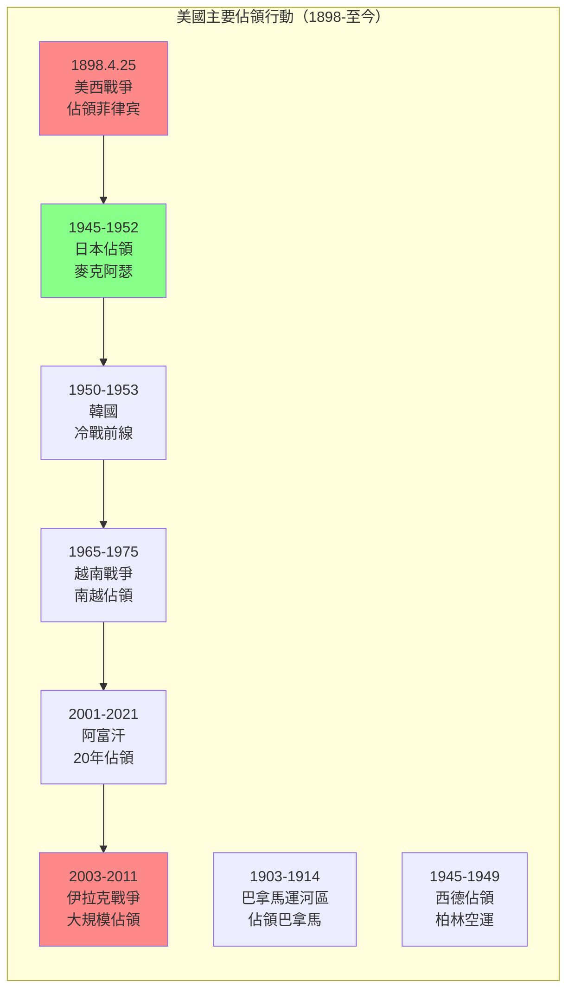
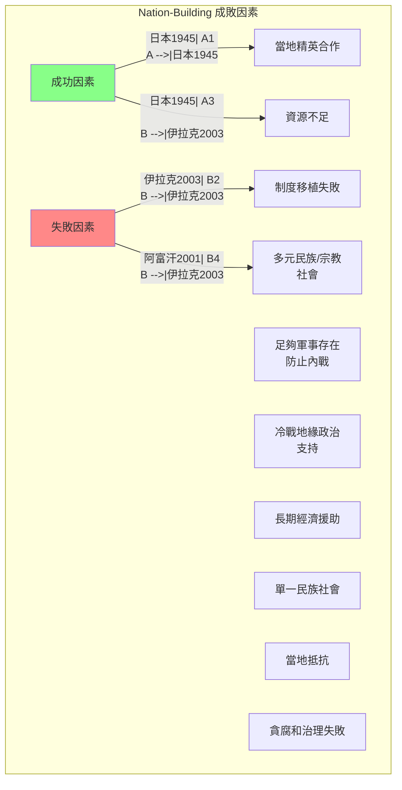
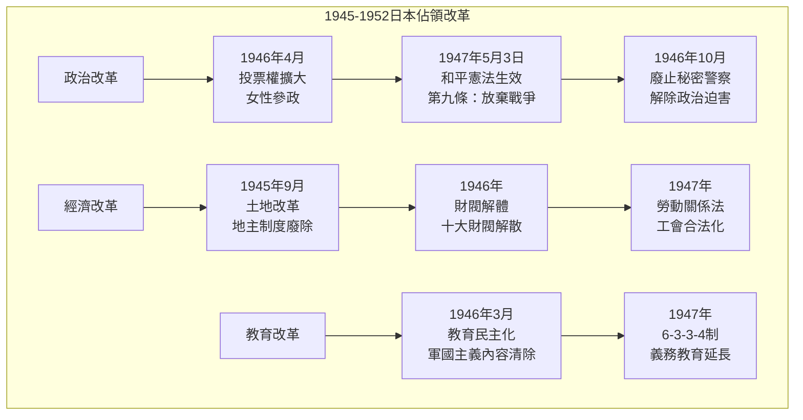
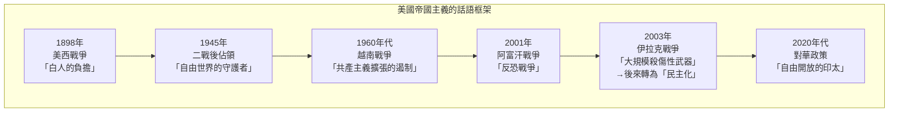
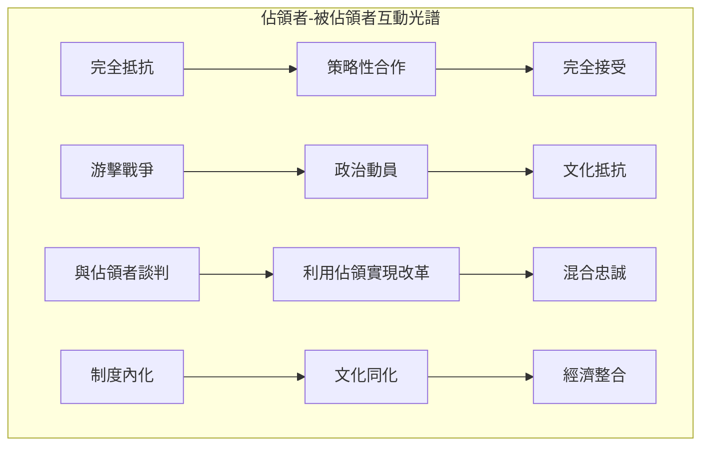

# GenEd 1017 美國作為佔領者與國家建設者 / Forced to Be Free: Americans as Occupiers and Nation-Builders

**Instructor**: Andrew Gordon & Erez Manela
**Department**: History, Harvard
**Official source**: history.fas.harvard.edu / gened.college.harvard.edu
**Big Question**: 美國軍事佔領外國（菲律宾、日本、阿富汗、伊拉克）如何塑造了美國和世界？
**Style**: research-based

---

## 問題 1：5 個 SPECIFIC 核心心智模型

### 1. 美帝國主義的「矛盾性」(Contradictory Imperialism)
**真實學者**: Paul A. Kramer (普林斯頓) —《The Blood of Government》(2006) 分析美帝國主義如何同時寻求使其他民族「更像美國人」，又堅持他們的差異。  
**真實事件**: 1898年美西戰爭後佔領菲律宾（4月25日）；1900年八國聯軍侵華；1945年麥克阿瑟佔領日本。  
**真實數字**: 美國在菲律宾統治期間（1898-1946），估計約100萬菲律宾人死亡於戰爭和飢餓。

### 2. nation-building 的理想與現實 (Nation-Building: Ideal vs. Reality)
**真實學者**: Thomas R. Mockaitis (北伊利諾大學) —《The Elusive Enemy》(2019) 分析美國 nation-building 努力的成功與失敗。  
**真實事件**: 2003年伊拉克戰爭後的重建（4月9日巴格達淪陷）；2001年阿富汗戰爭後的國家建設；1950年代韓國的經濟奇蹟。  
**真實數字**: 美國在伊拉克的 nation-building 成本估計超過2兆美元。

### 3. 被佔領者的抵抗與適應 (Occupied People's Resistance and Adaptation)
**真實學者**: John Dower (MIT) —《Embracing Defeat》(1999) 分析日本如何接受和改造美國佔領。  
**真實事件**: 1945-1952年日本被佔領期間的民主化改革；1950-1953年韓戰如何重塑日本；1975年印度支那戰爭。  
**真實數字**: 日本憲法第九條（放棄戰爭）在美國主導下於1947年通過。

### 4. 佔領與美國政治的回流效應 (Domestic Consequences of Occupation)
**真實學者**: Andrew Gordon (哈佛) —《A Modern History of Japan》(2003) 分析佔領如何影響美國本土政治。  
**真實事件**: 冷戰期間美國國內反共主義與對外軍事干預的連結；1960年代反戰運動；2001年愛國者法案。  
**真實數字**: 越戰期間美國在東南亞的軍事開支：1968年約250億美元。

### 5. 帝國治理的制度遺產 (Institutional Legacy of Imperial Governance)
**真實學者**: Eric Love (喬治城) —《Nation-Building》(2016) 分析佔領制度對後續政策的影響。  
**真實事件**: 1902年菲律宾公共教育系統的建立；1946年菲律宾獨立；2001年阿富汗臨時政府成立。  
**真實數字**: 美國在全球約有800個軍事基地，分布在70多個國家。

---

## 問題 2：3 個 SPECIFIC 根本分歧

### 分歧一：美國佔領的「解放性」vs.「壓迫性」
**學者A**: David Anderson (加州大學)  
論點：美國佔領（如二战後日本和德國）實際上帶來了民主化和經濟復興，是「解放性」的。

**學者B**: Noam Chomsky (MIT) —《Hegemony or Survival》(2003)  
論點：美國的軍事干預和佔領本質上是帝國主義的，其「解放」話語掩蓋了真實的經濟和戰略利益。

### 分歧二：nation-building 的有效性
**學者A**: James Dobbins (Rand Corporation) —《The Beginner's Guide to Nation-Building》(2007)  
論點：有效的 nation-building 需要足夠的資源、軍事存在和長期承諾。

**學者B**: Sarah Sewall (哈佛) —《A Radical Spectrum》(2015)  
論點：外來 nation-building 往往失敗，因為它忽視了當地歷史、文化和社會結構。

### 分歧三：帝國主義的現代形態
**學者A**: David Harvey (NYU) —《The New Imperialism》(2003)  
論點：美國帝國主義是新自由主義全球化的掩護。

**學者B**: Robert Kagan (卡內基) —《Of Paradise and Power》(2003)  
論點：美國的全球軍事存在是維護國際秩序的必要手段。

---

## 問題 3：10 個 PROBING 深度問題

1. 比較1898年菲律宾佔領和2003年伊拉克佔領：為什麼美國在相隔100年的兩次佔領中犯了相似的錯誤？背後的帝國主義邏輯有什麼連續性？

2. 1945-1952年日本佔領被廣泛視為「成功」的 nation-building 案例。但這個成功在多大程度上依賴於日本的特殊條件（單一民族社會、冷戰背景、麥克阿瑟的個人風格）？

3. 分析「解放」和「佔領」之間話語轉換的政治功能：為什麼同樣的軍事行動可以同時被框架為「解放」和「帝國主義擴張」？

4. 2001年阿富汗戰爭的教訓：為什麼20年的 nation-building 最終以美軍全面撤離（2021年8月30日）結束？這告訴我們什麼關於外來制度移植的局限性？

5. 比較日本和伊拉克的佔領：為什麼日本能夠接受和內化美國的改革，而伊拉克的類似改革卻引發了抵抗？文化差異還是制度設計的問題？

6. 美國在冷戰期間（1947-1991）的對外軍事干預如何影響了美國本土的政治話語和制度？反共主義如何重塑了美國的公民自由和國內政治？

7. 分析「帝國例外論」(American Exceptionalism) 話語在美國對外政策中的功能：為什麼美國人傾向於將自己的帝國主義行為框架為「例外」？

8. 當前（2020年代）中美競爭的背景下，美國如何重新框架自己的全球軍事存在？這與冷戰時期的蘇聯競爭有什麼相似和不同？

9. 美國撤軍阿富汗（2021年8月）後的「帝國疲勞」：這是否預示著美國帝國主義的終結？還是只是暫時的收縮？

10. 從歷史角度看，佔領者與被佔領者之間的「權力關係」如何影響 nation-building 的成敗？為什麼有些被佔領社會能夠抵抗和轉化外來制度，而有些卻完全依賴？

---

## 5 個 Mermaid 圖解

### 圖1：美國主要佔領行動的時間線

### 圖2：nation-building 的成功與失敗因素

### 圖3：日本佔領期間的民主化改革

### 圖4：帝國主義話語框架的轉變

### 圖5：佔領與被佔領者的互動動態

---

## 總結

**GenEd 1017** 的核心洞察：美國的軍事佔領和 nation-building 事業揭示了帝國主義的內在矛盾——在「解放」和「控制」之間、在理想主義話語和現實主義利益之間。這些歷史教訓對理解當代國際關係仍有重要意義。

**三個必須記住的數字**：
- **1898年**：美西戰爭標誌美國帝國主義的開始
- **2兆美元**：伊拉克戰爭的估計總成本
- **800個**：美國在全球的軍事基地數量

**必須記住的日期**：
- **1945年8月15日**：日本投降，麥克阿瑟接管
- **1947年5月3日**：日本和平憲法生效
- **2001年9月11日**：恐怖襲擊後美國開始阿富汗戰爭
- **2021年8月30日**：美軍最後一架飛機離開阿富汗

**research-based金句**：「美國建國不到250年，卻在全球80多個國家有軍事存在。這個世界上最強大的帝國，卻從不稱自己為帝國——因為在美國的政治話語裡，帝國主義是壞詞，只有『自由』和『民主』才是好詞。但歷史告訴我們：槍炮和美元走到哪裡，話語就跟到哪裡。」