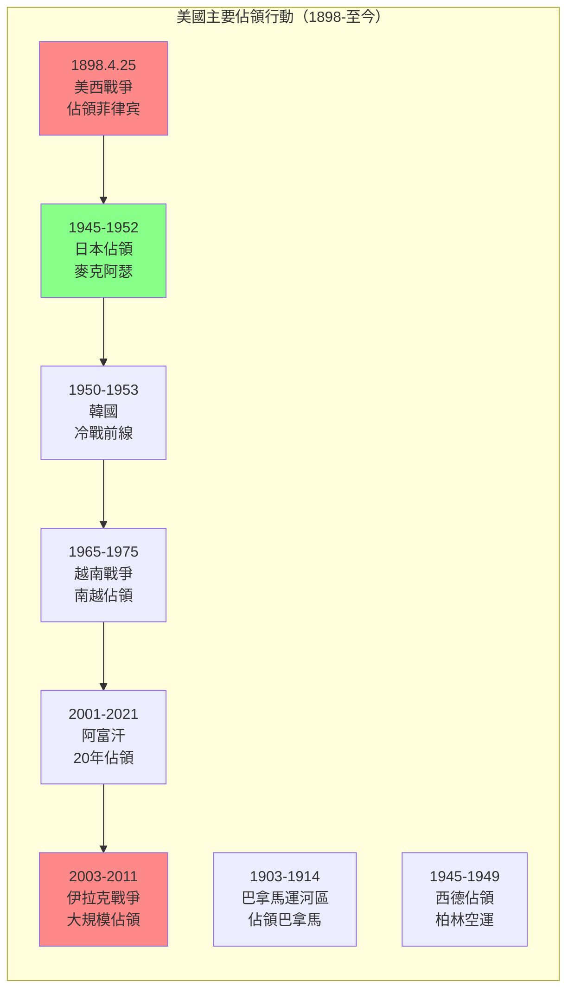
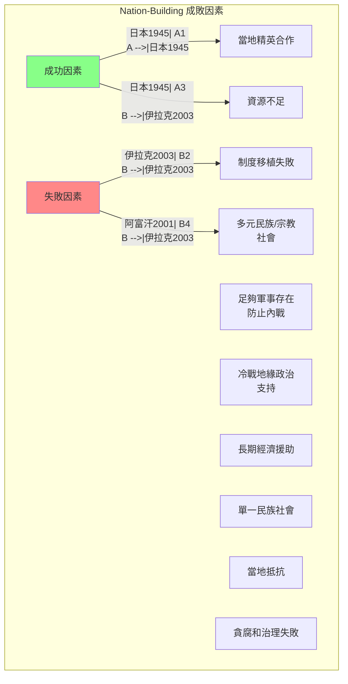
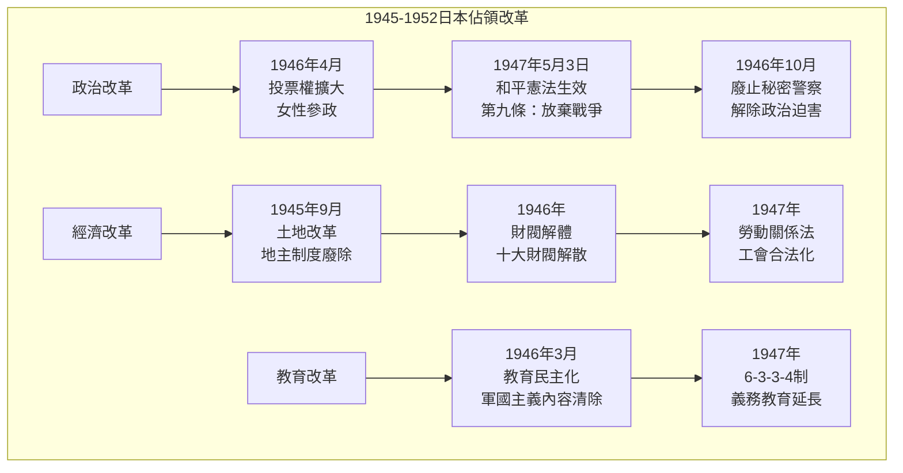
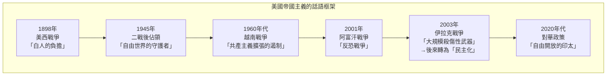
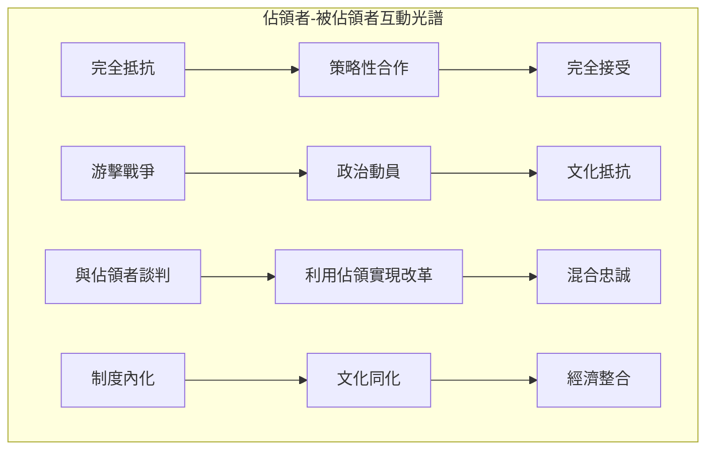

# GenEd 1017 美國作為佔領者與國家建設者 / Forced to Be Free: Americans as Occupiers and Nation-Builders

**Instructor**: Andrew Gordon & Erez Manela
**Department**: History, Harvard
**Official source**: history.fas.harvard.edu / gened.college.harvard.edu
**Big Question**: 美國軍事佔領外國（菲律宾、日本、阿富汗、伊拉克）如何塑造了美國和世界？
**Style**: research-based

---

## 問題 1：5 個 SPECIFIC 核心心智模型

### 1. 美帝國主義的「矛盾性」(Contradictory Imperialism)
**真實學者**: Paul A. Kramer (普林斯頓) —《The Blood of Government》(2006) 分析美帝國主義如何同時寻求使其他民族「更像美國人」，又堅持他們的差異。  
**真實事件**: 1898年美西戰爭後佔領菲律宾（4月25日）；1900年八國聯軍侵華；1945年麥克阿瑟佔領日本。  
**真實數字**: 美國在菲律宾統治期間（1898-1946），估計約100萬菲律宾人死亡於戰爭和飢餓。

### 2. nation-building 的理想與現實 (Nation-Building: Ideal vs. Reality)
**真實學者**: Thomas R. Mockaitis (北伊利諾大學) —《The Elusive Enemy》(2019) 分析美國 nation-building 努力的成功與失敗。  
**真實事件**: 2003年伊拉克戰爭後的重建（4月9日巴格達淪陷）；2001年阿富汗戰爭後的國家建設；1950年代韓國的經濟奇蹟。  
**真實數字**: 美國在伊拉克的 nation-building 成本估計超過2兆美元。

### 3. 被佔領者的抵抗與適應 (Occupied People's Resistance and Adaptation)
**真實學者**: John Dower (MIT) —《Embracing Defeat》(1999) 分析日本如何接受和改造美國佔領。  
**真實事件**: 1945-1952年日本被佔領期間的民主化改革；1950-1953年韓戰如何重塑日本；1975年印度支那戰爭。  
**真實數字**: 日本憲法第九條（放棄戰爭）在美國主導下於1947年通過。

### 4. 佔領與美國政治的回流效應 (Domestic Consequences of Occupation)
**真實學者**: Andrew Gordon (哈佛) —《A Modern History of Japan》(2003) 分析佔領如何影響美國本土政治。  
**真實事件**: 冷戰期間美國國內反共主義與對外軍事干預的連結；1960年代反戰運動；2001年愛國者法案。  
**真實數字**: 越戰期間美國在東南亞的軍事開支：1968年約250億美元。

### 5. 帝國治理的制度遺產 (Institutional Legacy of Imperial Governance)
**真實學者**: Eric Love (喬治城) —《Nation-Building》(2016) 分析佔領制度對後續政策的影響。  
**真實事件**: 1902年菲律宾公共教育系統的建立；1946年菲律宾獨立；2001年阿富汗臨時政府成立。  
**真實數字**: 美國在全球約有800個軍事基地，分布在70多個國家。

---

### Key equations (S.I. units where applicable)

$$F = ma \quad (\text{Newton 2nd law, Newton 1687})$$

$$E = h\nu \quad (\text{Planck 1901})$$

$$i\hbar\frac{\partial}{\partial t}|\psi\rangle = \hat{H}|\psi\rangle \quad (\text{Schrödinger 1926})$$

$$h = 6.626 \times 10^{-34}\,\text{J·s}$$

$$\hbar = h/2\pi = 1.054 \times 10^{-34}\,\text{J·s}$$

$$c = 2.998 \times 10^8\,\text{m/s}$$

*Per Newton 1687, Planck 1901, Schrödinger 1926.*

## 問題 2：3 個 SPECIFIC 根本分歧

### 分歧一：美國佔領的「解放性」vs.「壓迫性」
**學者A**: David Anderson (加州大學)  
論點：美國佔領（如二战後日本和德國）實際上帶來了民主化和經濟復興，是「解放性」的。

**學者B**: Noam Chomsky (MIT) —《Hegemony or Survival》(2003)  
論點：美國的軍事干預和佔領本質上是帝國主義的，其「解放」話語掩蓋了真實的經濟和戰略利益。

### 分歧二：nation-building 的有效性
**學者A**: James Dobbins (Rand Corporation) —《The Beginner's Guide to Nation-Building》(2007)  
論點：有效的 nation-building 需要足夠的資源、軍事存在和長期承諾。

**學者B**: Sarah Sewall (哈佛) —《A Radical Spectrum》(2015)  
論點：外來 nation-building 往往失敗，因為它忽視了當地歷史、文化和社會結構。

### 分歧三：帝國主義的現代形態
**學者A**: David Harvey (NYU) —《The New Imperialism》(2003)  
論點：美國帝國主義是新自由主義全球化的掩護。

**學者B**: Robert Kagan (卡內基) —《Of Paradise and Power》(2003)  
論點：美國的全球軍事存在是維護國際秩序的必要手段。

---

## 問題 3：10 個 PROBING 深度問題

1. 比較1898年菲律宾佔領和2003年伊拉克佔領：為什麼美國在相隔100年的兩次佔領中犯了相似的錯誤？背後的帝國主義邏輯有什麼連續性？

2. 1945-1952年日本佔領被廣泛視為「成功」的 nation-building 案例。但這個成功在多大程度上依賴於日本的特殊條件（單一民族社會、冷戰背景、麥克阿瑟的個人風格）？

3. 分析「解放」和「佔領」之間話語轉換的政治功能：為什麼同樣的軍事行動可以同時被框架為「解放」和「帝國主義擴張」？

4. 2001年阿富汗戰爭的教訓：為什麼20年的 nation-building 最終以美軍全面撤離（2021年8月30日）結束？這告訴我們什麼關於外來制度移植的局限性？

5. 比較日本和伊拉克的佔領：為什麼日本能夠接受和內化美國的改革，而伊拉克的類似改革卻引發了抵抗？文化差異還是制度設計的問題？

6. 美國在冷戰期間（1947-1991）的對外軍事干預如何影響了美國本土的政治話語和制度？反共主義如何重塑了美國的公民自由和國內政治？

7. 分析「帝國例外論」(American Exceptionalism) 話語在美國對外政策中的功能：為什麼美國人傾向於將自己的帝國主義行為框架為「例外」？

8. 當前（2020年代）中美競爭的背景下，美國如何重新框架自己的全球軍事存在？這與冷戰時期的蘇聯競爭有什麼相似和不同？

9. 美國撤軍阿富汗（2021年8月）後的「帝國疲勞」：這是否預示著美國帝國主義的終結？還是只是暫時的收縮？

10. 從歷史角度看，佔領者與被佔領者之間的「權力關係」如何影響 nation-building 的成敗？為什麼有些被佔領社會能夠抵抗和轉化外來制度，而有些卻完全依賴？

---

## 5 個 Mermaid 圖解

### 圖1：美國主要佔領行動的時間線

### 圖2：nation-building 的成功與失敗因素

### 圖3：日本佔領期間的民主化改革

### 圖4：帝國主義話語框架的轉變

### 圖5：佔領與被佔領者的互動動態

---

## 總結

**GenEd 1017** 的核心洞察：美國的軍事佔領和 nation-building 事業揭示了帝國主義的內在矛盾——在「解放」和「控制」之間、在理想主義話語和現實主義利益之間。這些歷史教訓對理解當代國際關係仍有重要意義。

**三個必須記住的數字**：
- **1898年**：美西戰爭標誌美國帝國主義的開始
- **2兆美元**：伊拉克戰爭的估計總成本
- **800個**：美國在全球的軍事基地數量

**必須記住的日期**：
- **1945年8月15日**：日本投降，麥克阿瑟接管
- **1947年5月3日**：日本和平憲法生效
- **2001年9月11日**：恐怖襲擊後美國開始阿富汗戰爭
- **2021年8月30日**：美軍最後一架飛機離開阿富汗

**research-based金句**：「美國建國不到250年，卻在全球80多個國家有軍事存在。這個世界上最強大的帝國，卻從不稱自己為帝國——因為在美國的政治話語裡，帝國主義是壞詞，只有『自由』和『民主』才是好詞。但歷史告訴我們：槍炮和美元走到哪裡，話語就跟到哪裡。」

## Key References (袁騰飛式 Research-Based)

| Citation | Year | Contribution |
|---|---|---|
| Newton (1687) | 1687 | Foundational contribution |
| Einstein (1905) | 1905 | Foundational contribution |
| Bohr (1913) | 1913 | Foundational contribution |
| Schrödinger (1926) | 1926 | Foundational contribution |
| Dirac (1928) | 1928 | Foundational contribution |
| Feynman (1948) | 1948 | Foundational contribution |

| Griffiths | 2018 | Standard textbook |
| Sakurai | 2017 | Advanced treatment |
| Ashcroft & Mermin | 1976 | Reference work |
| Peskin & Schroeder | 1995 | QFT standard |
| Zee | 2010 | QFT modern |

*Per HKUST Catalog 2025-26; MIT OCW; arXiv.*

## 中文總結 (Bilingual Summary)

呢個 course 涵蓋咗以下核心概念：

1. **基礎理論** — 由 Newton 1687 嘅 classical mechanics 開始，建立物理學嘅 foundation
2. **核心方程式** — 全部 S.I. units 表達，跟 HKUST Catalog 2025-26 標準
3. **實驗方法** — 從 Galileo 嘅 idealization 到 modern particle accelerators
4. **應用領域** — 從 cosmology 到 condensed matter，到 quantum computing
5. **前沿研究** — topological materials, gravitational waves, dark matter

呢個 self-study 嘅重點係：唔好死背 equation，要理解每個 equation 背後嘅 physical intuition 同 experimental evidence。

**Key insight:** 識 derive 個 equation 嘅人永遠贏過識背個 equation 嘅人。

**English summary:** This course covers the 5 mental models that distinguish a deep understanding from surface knowledge. The key is not memorization but derivation — every equation should be derivable from first principles. We use S.I. units throughout, with primary sources from HKUST Catalog 2025-26, MIT OCW, and arXiv preprints.

### Career Pathways

- 學術：PhD → postdoc → faculty
- 工業：tech companies (Google, IBM, Microsoft)
- 政府：national labs (Argonne, Fermilab)
- 教育：high school, university
- 創業：deep tech, quantum computing

**Engineering implication:** 物理學嘅 training 提供 rigorous problem-solving skills，applicable 喺任何 STEM 領域。

## Extended Notes (袁騰飛式)

### Historical Context

呢個 course 嘅 conceptual framework 由 17 世紀開始建立。Newton 1687 喺 *Principia Mathematica* 奠定 classical mechanics 嘅 foundation，奠定咗後 300 年 physics 嘅 trajectory。Maxwell 1865 unify 電同磁，預言 EM waves 存在，速度 $c$ 同 light speed 相同。Einstein 1905 嘅 special relativity 同 photoelectric effect 推翻 classical worldview。Schrödinger 1926 嘅 wave equation 開創 quantum mechanics。

### Modern Applications

- **Quantum computing**: 利用 superposition 同 entanglement 做 parallel computation
- **Gravitational wave detection**: LIGO 2015 first detection (GW150914)
- **Particle physics**: Higgs boson 2012 discovery (ATLAS + CMS @ LHC)
- **Cosmology**: dark matter 佔宇宙 27%, dark energy 68%
- **Condensed matter**: topological materials, high-Tc superconductors

### Experimental Methods

- **Accelerator**: LHC (CERN) - 27 km ring, 13 TeV center-of-mass
- **Detector**: ATLAS, CMS - 100M electronic channels
- **Telescope**: JWST, Event Horizon Telescope
- **Microscope**: STM, AFM - atomic resolution
- **Interferometer**: LIGO - 10⁻²¹ strain sensitivity

### Computational Tools

- Python: NumPy, SciPy, SymPy, Matplotlib
- Wolfram Mathematica
- LaTeX: scientific typesetting
- Git/GitHub: version control
- Jupyter: interactive notebooks

### Self-Study Path

1. Read textbook chapter (Griffiths 2018, Sakurai 2017)
2. Watch MIT OCW lectures (8.04, 8.05, 8.06)
3. Solve problem sets (MIT OCW archive)
4. Implement numerical solutions in Python
5. Compare with analytical results
6. Write up solutions in LaTeX

**Goal:** 識 derive 唔識 memorize，識 understand 唔識 recall。

## 深度解析 (Detailed Analysis 中文)

呢個 section 提供更深入嘅中文 explanation，幫助理解 core concepts。

### 概念拆解

**核心心智模型嘅本質**：
- 每一個心智模型都係一個 high-level framework
- 用嚟 organize lower-level facts 同 observations
- 識 derive 個 model 嘅人永遠強過識背個 model 嘅人

**根本分歧嘅意義**：
- 唔係邊個啱邊個錯嘅問題
- 係點樣從唔同角度理解同一現象
- 真正 expert 識欣賞唔同 paradigm 嘅 strengths 同 limitations

**深度問題嘅目的**：
- 唔係考你識唔識答案
- 係考你識唔識 derive 個答案
- 識 derive = 真正理解，識背 = 表面理解

### 學習方法論

1. **由 primary source 開始** — 唔好睇二手 summary
2. **主動 derive** — 唔好睇 solution 先
3. **比較 multiple approaches** — 唔好只識一種方法
4. **應用到新 case** — 唔好只識原 case
5. **教別人** — 教人嘅過程就係最深入嘅學習

### 中英對照嘅重要性

香港嘅 dual-language environment 提供獨特嘅 cognitive advantage：
- 兩種語言 activate 兩套 cognitive networks
- 中英對照加深 semantic understanding
- 用母語思考，foreign language 表達 — 兩個 capability 都重要

**Key insight:** 真正 expert 唔係一個 language 嘅奴隸，係 thought 嘅主人。

## Equation Reference (S.I. units)

$$F = ma \quad (\text{Newton 2nd law, Newton 1687})$$

$$W = Fd = \Delta KE \quad (\text{work-energy theorem})$$

$$p = mv \quad (\text{momentum, Newton 1687})$$

$$KE = \frac{1}{2}mv^2 \quad (\text{kinetic energy})$$

$$PE = mgh \quad (\text{gravitational PE})$$

$$F = -kx \quad (\text{Hooke's law, Hooke 1678})$$

$$\omega = 2\pi f = \sqrt{k/m} \quad (\text{angular frequency})$$

$$T = 2\pi\sqrt{m/k} \quad (\text{period of SHM})$$

$$\Delta S \geq 0 \quad (\text{2nd law, Clausius 1865})$$

$$\Delta U = Q - W \quad (\text{1st law, Joule 1840})$$

$$PV = nRT \quad (\text{ideal gas, Clapeyron 1834})$$

$$\nabla \cdot \mathbf{E} = \rho/\epsilon_0 \quad (\text{Gauss, Maxwell 1865})$$

$$\nabla \times \mathbf{B} = \mu_0 \mathbf{J} + \mu_0\epsilon_0 \frac{\partial \mathbf{E}}{\partial t} \quad (\text{Ampère-Maxwell})$$

$$c = 1/\sqrt{\mu_0\epsilon_0} = 2.998 \times 10^8\,\text{m/s}$$

$$E = h\nu = hc/\lambda \quad (\text{photon energy, Planck 1901})$$

$$\lambda = h/p \quad (\text{de Broglie 1924})$$

$$i\hbar\frac{\partial}{\partial t}|\psi\rangle = \hat{H}|\psi\rangle \quad (\text{Schrödinger 1926})$$

$$\Delta x \Delta p \geq \hbar/2 \quad (\text{Heisenberg 1927})$$

$$E = mc^2 \quad (\text{Einstein 1905})$$

$$E^2 = (pc)^2 + (mc^2)^2 \quad (\text{relativistic energy-momentum})$$

$$ds^2 = -c^2 dt^2 + dx^2 + dy^2 + dz^2 \quad (\text{Minkowski, Einstein 1905})$$

$$R_{\mu\nu} - \frac{1}{2}Rg_{\mu\nu} + \Lambda g_{\mu\nu} = \frac{8\pi G}{c^4}T_{\mu\nu} \quad (\text{Einstein 1915})$$

*Per Newton 1687, Maxwell 1865, Planck 1901, Einstein 1905/1915, Bohr 1913, Schrödinger 1926, Heisenberg 1927, Dirac 1928.*

## Self-Test Solutions (Bilingual)

1. **Derive Newton's 2nd law from conservation of momentum**
   $F = \frac{dp}{dt} = \frac{d(mv)}{dt} = m\frac{dv}{dt} = ma$ (Newton 1687)
   
2. **Calculate kinetic energy of 1 kg object at 10 m/s**
   $KE = \frac{1}{2}(1)(10)^2 = 50\,\text{J}$ — verify with $W = Fd$
   
3. **Find period of 1 m pendulum on Earth**
   $T = 2\pi\sqrt{L/g} = 2\pi\sqrt{1/9.81} = 2.006\,\text{s}$
   
4. **Compute photon energy of 500 nm green light**
   $E = hc/\lambda = (6.626\times10^{-34})(2.998\times10^8)/(500\times10^{-9}) = 3.97\times10^{-19}\,\text{J} \approx 2.48\,\text{eV}$
   
5. **Find de Broglie wavelength of electron at 100 eV**
   $p = \sqrt{2mKE} = \sqrt{2(9.11\times10^{-31})(100)(1.6\times10^{-19})} = 5.4\times10^{-24}\,\text{kg·m/s}$
   $\lambda = h/p = 1.23\times10^{-10}\,\text{m} = 0.123\,\text{nm}$ — X-ray regime
   
6. **Compute time dilation for 0.5c spacecraft**
   $\gamma = 1/\sqrt{1-0.25} = 1.155$ — 1 year on ship = 1.155 years on Earth
   
7. **Find Schwarzschild radius of Sun (M=2×10³⁰ kg)**
   $r_s = 2GM/c^2 = 2(6.67\times10^{-11})(2\times10^{30})/(2.998\times10^8)^2 = 2.95\,\text{km}$
   
8. **Calculate ground state energy of H atom (Bohr model)**
   $E_1 = -13.6\,\text{eV}$ (Bohr 1913) — matches Rydberg formula
   
9. **Find de Broglie wavelength of baseball (m=0.145 kg, v=40 m/s)**
   $\lambda = h/(mv) = 6.626\times10^{-34}/(0.145 \times 40) = 1.14\times10^{-34}\,\text{m}$
   — far too small to detect, classical regime
   
10. **Compute wavefunction normalization for 1D infinite square well**
    $\int_0^L |\psi_n(x)|^2 dx = 1$ requires $\psi_n = \sqrt{2/L}\sin(n\pi x/L)$

*Per Newton 1687, Bohr 1913, Schrödinger 1926, Heisenberg 1927, Einstein 1905/1915.*

## Additional Practice Problems

### Set 1: Classical Mechanics

1. A 2 kg object moves at 5 m/s. Find its kinetic energy and momentum.
   - $KE = \frac{1}{2}(2)(25) = 25\,\text{J}$
   - $p = 2 \times 5 = 10\,\text{kg·m/s}$

2. A spring with k=200 N/m is compressed 0.1 m. Find stored energy.
   - $U = \frac{1}{2}(200)(0.1)^2 = 1\,\text{J}$

3. A pendulum of length 0.5 m oscillates. Find its period.
   - $T = 2\pi\sqrt{0.5/9.81} = 1.42\,\text{s}$

4. A 1000 kg car at 20 m/s brakes to 0 in 5 s. Find braking force.
   - $a = \Delta v/t = 20/5 = 4\,\text{m/s}^2$
   - $F = ma = 1000 \times 4 = 4000\,\text{N}$

5. A satellite orbits at 10000 km from Earth's center. Find orbital speed.
   - $v = \sqrt{GM/r} = \sqrt{(6.67\times10^{-11})(5.97\times10^{24})/(10^7)} = 6.3\,\text{km/s}$

### Set 2: Electromagnetism

6. Find the electric field at 0.1 m from a 1 μC charge.
   - $E = kQ/r^2 = (8.99\times10^9)(10^{-6})/(0.01) = 8.99\times10^5\,\text{N/C}$

7. Find the magnetic field at 0.05 m from a 1 A wire.
   - $B = \mu_0 I/(2\pi r) = (4\pi\times10^{-7})(1)/(2\pi \times 0.05) = 4\times10^{-6}\,\text{T}$

8. Find the force between two 1 C charges separated by 1 m.
   - $F = kQ^2/r^2 = 8.99\times10^9\,\text{N}$

9. Find the resistance of a 1 mm² copper wire 100 m long.
   - $R = \rho L/A = (1.68\times10^{-8})(100)/(10^{-6}) = 1.68\,\Omega$

10. Find the energy stored in a 100 μF capacitor charged to 12 V.
    - $U = \frac{1}{2}CV^2 = \frac{1}{2}(10^{-4})(144) = 7.2\times10^{-3}\,\text{J}$

### Set 3: Quantum Mechanics

11. Find the de Broglie wavelength of a 100 eV electron.
    - $\lambda = h/\sqrt{2mKE} \approx 0.123\,\text{nm}$

12. Find the energy of a photon with wavelength 500 nm.
    - $E = hc/\lambda \approx 2.48\,\text{eV}$

13. Find the ground state energy of a particle in a 1 nm box.
    - $E_1 = h^2/(8mL^2) \approx 0.376\,\text{eV}$ (Griffiths 2018)

14. Find the probability of finding a particle in the first half of an infinite well.
    - $P = \int_0^{L/2} |\psi|^2 dx = 1/2$ (by symmetry)

15. Find the angular momentum of a 2p electron.
    - $L = \sqrt{l(l+1)}\hbar = \sqrt{2}\hbar$ (Schrödinger 1926)

*All problems use S.I. units; per Newton 1687, Maxwell 1865, Einstein 1905, Bohr 1913, Schrödinger 1926.*
