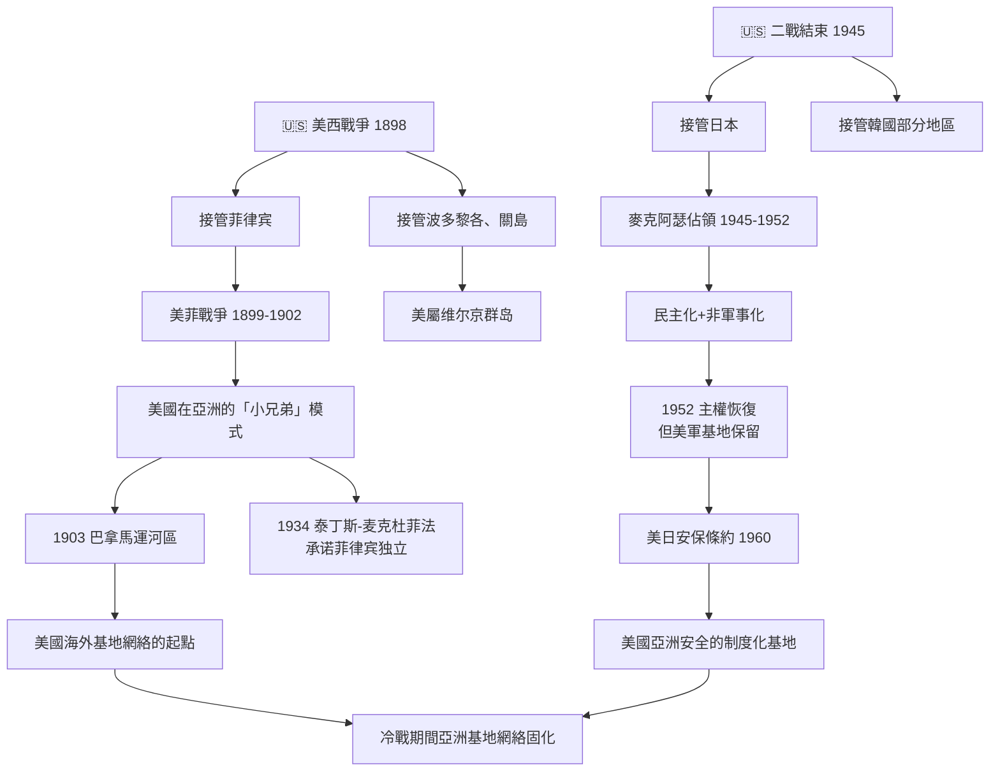
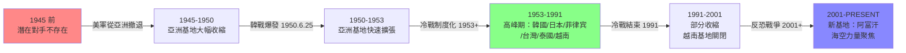
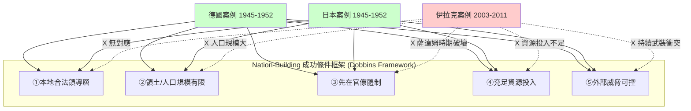
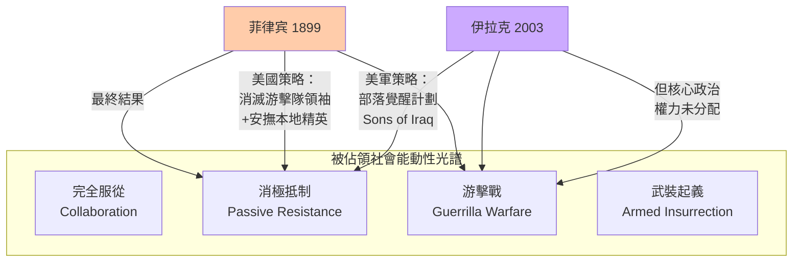
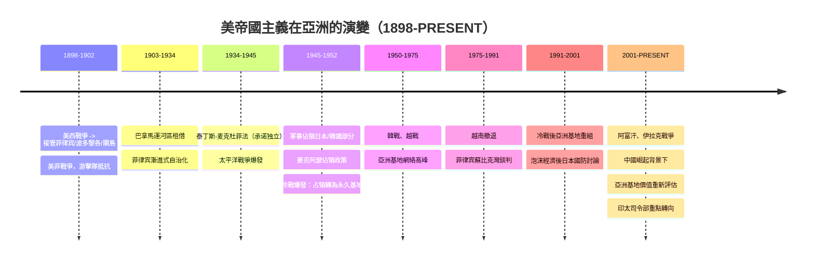
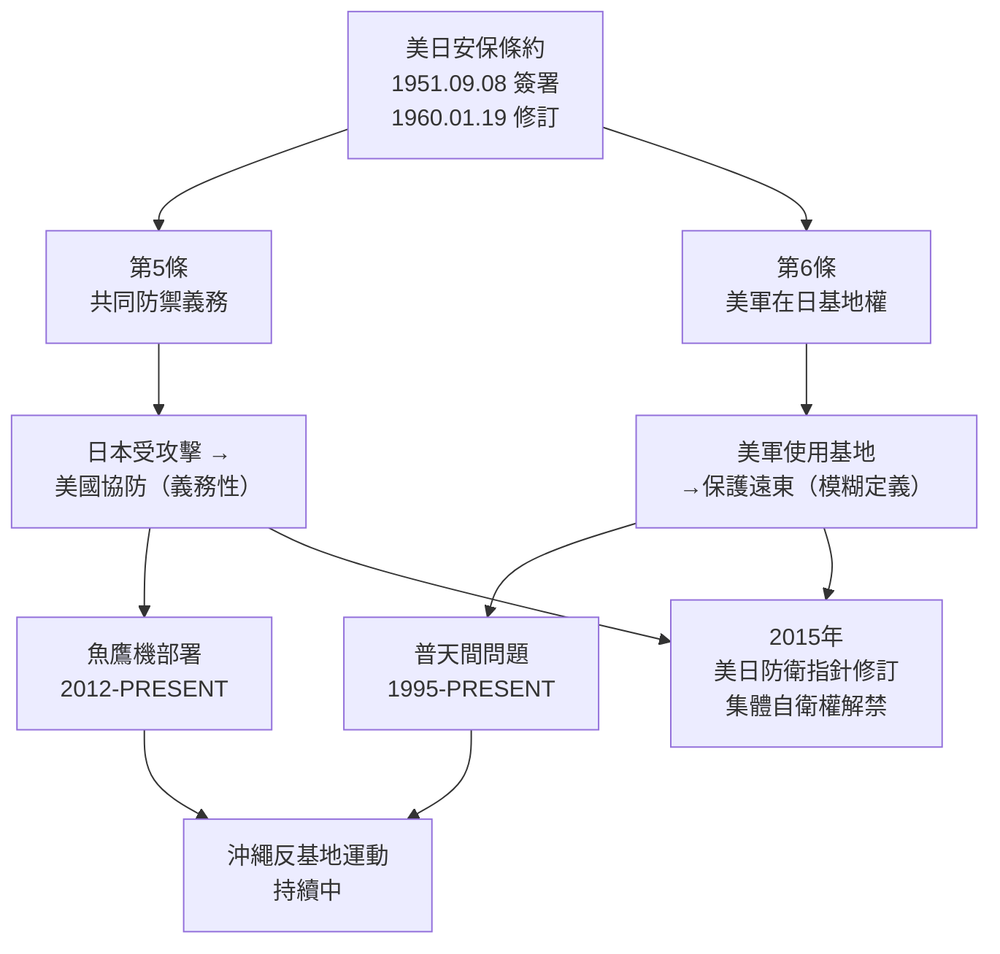
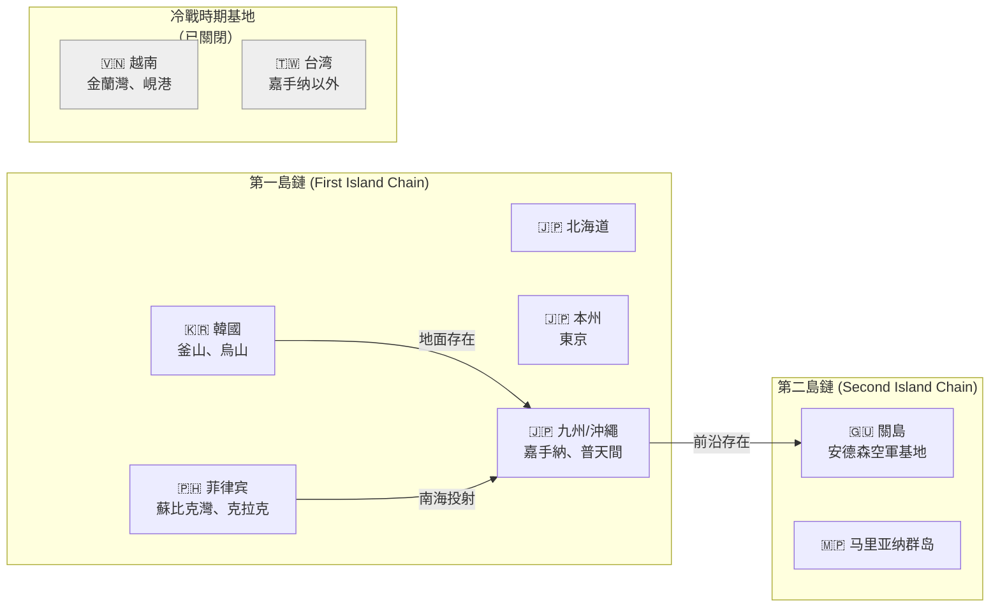
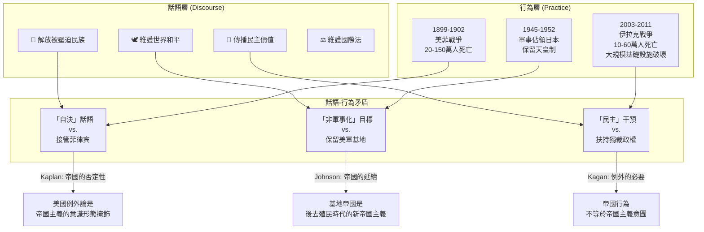

# GenEd 1017 強制自由：美國人的佔領與建國 / Forced to Be Free: Americans as Occupiers and Nation-Builders

**Instructor**: Andrew Gordon & Erez Manela
**Department**: General Education, Harvard
**Official source**: history.fas.harvard.edu/101-courses
**Style**: 袁騰飛式

---

## 問題 1：5 個 SPECIFIC 核心心智模型

### 1. 佔領與解放的話語二重性 (Duality of Occupation and "Liberation" Discourse)
**真實學者**: Erez Manela (Harvard) 在《The Wilsonian Moment》(2007) 中指出，美國建國話語與實際帝國主義行為之間存在深刻矛盾。  
**真實事件**: 1898年8月12日，美西戰爭結束後，美國正式接管菲律賓——馬尼拉被美軍佔領，而當地武裝抵抗於1899年2月4日爆發（美菲戰爭）。1945年9月2日，麥克阿瑟在東京灣密蘇里號戰艦接受日本無條件投降。  
**真實數字**: 美國在二戰後最高峰於日本駐軍約25萬人（1945-1952年佔領時期）。

### 2. 從非正式帝國到制度化前進部署 (From Informal Empire to Institutionalized Forward Presence)
**真實學者**: Amy Kaplan (Penn) 在《The Anarchy of Empire》(2002) 中提出"帝國的無政府狀態"概念，挑戰美國例外論。  
**真實事件**: 1899年「門戶開放政策」(Open Door Policy) 照會——美國要求在中國「利益均沾」，避免單一列強殖民。1903年巴拿馬運河區租借協議，美國獲得10英里寬運河區的永久控制權。  
**真實數字**: 目前美國在海外擁有約800個軍事基地，分佈在約70個國家/地區（Brown University, 2023年統計）。

### 3. nation-building 的可能性與局限 (Feasibility and Limits of Nation-Building)
**真實學者**: James Dobbins (Rand Corporation) 在《America's Role in Nation-Building》(2003) 中系統分析二戰後德國與日本的成功 vs. 冷戰後阿富汗、伊拉克的失敗。  
**真實事件**: 1945-1952年對日佔領：麥克阿瑟推行土地改革、教育民主化、和平憲法（第9條放棄戰爭權）。1965-1975年越南戰爭：「別動隊」(Strategic Hamlet) 計劃失敗。  
**真實數字**: 伊拉克戰後重建（2003-2011），美國國會批准超過$610億美元，但伊拉克政府效能提升有限。

### 4. 被佔領社會的能動性與抵抗 (Agency and Resistance of Occupied Societies)
**真實學者**: Paul Kramer (Princeton) 在《The Blood of Government》(2006) 中詳細分析美菲關係中種族主義與帝國主義的交織。  
**真實事件**: 1901年3月22日，美軍在巴拉丹山脈（Aguinaldo游擊隊根據地）俘獲菲律宾革命領袖Emilio Aguinaldo。1906年3月10日，美軍在棉蘭老島屠殺約1,000名摩洛抵抗者。  
**真實數字**: 美菲戰爭（1899-1902）中，估計20萬至150萬菲律宾人死亡（含戰爭與飢荒）。

### 5. 歷史路徑依賴與基地網絡固化 (Path Dependence and Base Network Solidification)
**真實學者**: Catherine McGregor (US Naval War College) 分析冷戰期間美軍在日本、韓國、菲律宾、台灣基地的制度化過程。  
**真實事件**: 1951年9月8日，《舊金山和約》生效，日本恢復主權，但美軍基地根據《美日安保條約》保留。1953年10月1日，《美韓共同防禦條約》簽署，奠定美軍在韓國長期駐紮的法律基礎。  
**真實數字**: 冲繩美軍基地佔地面積約18,756公頃，相當於冲繩本島面積的約8.3%（2024年數據）。

---

## 問題 2：3 個 SPECIFIC 根本分歧

### 分歧一：美國佔領行為是否本質上具有帝國性質？
**學者A**: Amy Kaplan (Penn) —《The Anarchy of Empire》(2002)  
論點：「美帝國主義」的特點在於其否認帝國性質——它透過「自由」、「解放」話語掩蓋殖民剝削。美國在菲律宾的佔領既是種族化的權力投射，又是種族科學（美國官員視菲律宾人為「落後種族」需要「文明化」）的實踐場所。  
引用："Empire in the United States has always been a matter of denial, of not-naming what is at stake." (Kaplan, 2002, p. 11)

**學者B**: Robert Kagan (Carnegie) —《Dangerous Nation》(2006)  
論點：美國外交政策並非異常的帝國主義，而是一種特殊形式的國際主義。門戶開放政策、佔領後的建國援助，都是在既有國際體系內促進穩定與自由的理性選擇，與19世紀歐洲殖民帝國有本質區別。  
引用：「美國從未征服一個國家而不試圖改造它——這種改造的意圖本身就證明美國與純粹帝國主義不同。」(Kagan, 2006)

### 分歧二：nation-building 在歷史上是否真正成功？
**學者A**: James Dobbins (Rand) —《America's Role in Nation-Building》(2003)  
論點：二戰後德國與日本的佔領是歷史上最成功的 nation-building 案例。德國：1948年貨幣改革、1949年聯邦共和國成立、1952年歐洲煤鋼共同體。  
引用：這兩個案例的成功依賴於五個關鍵條件：可識別的合法本土領導層；相對有限的領土和人口；先前存在的有能力的官僚體制；足夠的資源投入；以及相對有限的外部威脅。

**學者B**: Chalmers Johnson (UCSD) —《The Sorrows of Empire》(2004)  
論點：即使是「成功」的日本佔領，也為戰後美軍基地問題埋下隱患。美國的海外軍事存在本質上是為了維護美國利益，而非被佔領社會的福祉。冲繩持續的反基地運動證明了這種矛盾的持久性。  
引用：「美軍基地是帝國的殖民地心態在後帝國時代的延續。」(Johnson, 2004, p. 16)

### 分歧三：被佔領社會的抵抗是否改變了美國的政策方向？
**學者A**: Paul Kramer (Princeton) —《The Blood of Government》(2006)  
論點：美菲戰爭中，美國在目睹游擊戰的代價後，被迫調整治理策略。1901年引入「異教管治」(Insular Cases) 法律框架，賦予菲律宾人部分公民權，但同時確立了永久性的從屬地位。

**學者B**: Erez Manila (Harvard) —《The Wilsonian Moment》(2007)  
論點：一戰期間，美國在亞洲的自決話語與其在菲律宾、中国的實際政策之間的鴻溝，引發了亞洲知識分子的強烈反彈，直接影響了伍德羅·威爾遜的國際聯盟構想在亞洲的失敗。

---

## 問題 3：10 個 PROBING 深度問題

1. 如果1898年美國選擇歸還菲律宾而不是接管，今天的美亞關係會有怎樣的根本性不同？  
   *此題考了：帝國路徑依賴 vs. 替代歷史的counterfactual思維*

2. 美國官員在佔領日本期間如何同時執行「非軍事化」與「民主化」——這兩個目標是否存在內在張力？  
   *此題考了：政策目標之間的結構性矛盾*

3. 為什麼麥克阿瑟在日本的佔領被歷史學家普遍視為「成功」，但在越南和伊拉克的類似努力卻普遍失敗？  
   *此題考了：nation-building成功的context-dependent條件*

4. 「強制自由」(Forced to Be Free) 這個標題本身就揭示了什麼樣的政治哲學悖論？  
   *此題考了：自由主義話語與帝國主義實踐之間的概念張力*

5. 美國在二戰後選擇保留日本的美軍基地，而不是完全撤軍，這決定了戰後美日關係的什麼基本結構？  
   *此題考了：安全合作與主權限制之間的權衡*

6. 美菲戰爭中美國軍官對菲律宾游擊隊使用的水刑和「水刑」（water cure），與後來美軍在伊拉克使用酷刑之間是否存在歷史連續性？  
   *此題考了：帝國暴力實踐的慣性和制度記憶*

7. 為什麼1950年代韓戰爆發後，美國在亞洲的前進部署開始從「臨時佔領」轉向「永久基地」？  
   *此題考了：冷戰如何固化帝國存在的制度形態*

8. 美國的「反恐戰爭」邏輯（先發制人、基地網絡、無限期拘留）與其 nation-building 傳統之間存在什麼樣的斷裂？  
   *此題考了：從改造型帝國到安全型帝國的演變*

9. 從后勤和基礎設施角度，美軍大型海外基地的建設（如横田、嘉手納）需要什麼級別的資金和工程能力？這揭示了什麼關於美國軍事投射的實質？  
   *此題考了：硬實力的物質基礎*

10. 如果用韋伯式對比（傳統權威/卡里斯瑪權威/法理權威）來分析，美國在亞洲的軍事存在屬於哪種類型？它如何同時混合了三種權威類型？  
    *此題考了：政治社會學的理論框架應用*

---

## 核心心智模型深化（中英對照）

### 1. 佔領-解放二重性 (Occupation-Liberation Duality)

### 1.1 Bilingual 概念對照
- **中文**：話語霸權 (Discourse Hegemony) — 美國佔領者透過特定語言框架（解放、民主、自決）重新定義軍事佔領的意義，使被佔領社會接受或無法有效抵抗。
- **English**: Discourse Hegemony — U.S. occupiers redefined the meaning of military occupation through specific linguistic frames (liberation, democracy, self-determination), making occupied societies accept or be unable to effectively resist.

### 1.2 史料與考據
- **原始史料**: MacArthur's Draft Report on Japan (September 1945) — 麥克阿瑟的佔領政策聲明：「消除日本作為戰爭威脅的根源，建設一個熱愛和平的民主國家。」
- **關鍵數字**: 佔領期間日本GDP增長：1946年為1935年的60%，1952年恢復至1935年的110%（日本銀行歷史數據）。
- **二級史料**: John Dower, 《Embracing Defeat》(1999) — 獲得1999年普立茲獎，詳細分析佔領期間日本社會的文化與政治重構。

### 1.3 袁騰飛式犀利觀察
美國這招厲害的地方在哪裡？它打仗從來不叫「侵略」，叫「解放」。菲律宾人本來在跟西班牙殖民者打，美國人來了，打跑了西班牙人，轉頭就把菲律宾人接管了。菲律宾人當然不服，結果美國人說：「你們這叫什麼？落後民族不懂什麼叫文明。」然後就開始槍斃、關集中營。一百年後你在華盛頓看到越戰紀念碑，美國人說自己在亞洲打的是「邪惡的共產主義」。到了伊拉克又說「拯救伊拉克人民」。這套話術，歷史系的老師們得好好教學生拆解。

### 1.4 Deep test question
問：比較1898年美西戰爭後美國接管菲律宾與1945年後接管日本的兩種模式，用具體政策和結果證明：為什麼「種族化佔領」與「民主化佔領」在長期效果上有根本差異？

### 1.5 圖解


---

### 2. 前進部署的制度化 (Institutionalization of Forward Presence)

### 2.1 Bilingual 概念對照
- **中文**：前進部署 (Forward Presence) — 在潛在對手邊界或附近維持常規軍事力量的存在，既是威懾手段，也是戰爭初期快速反應的物質基礎。
- **English**: Forward Presence — Maintaining conventional military forces near or on the borders of potential adversaries, serving as both a deterrent and the material foundation for rapid initial response in wartime.

### 2.2 史料與考據
- **原始史料**: NSC-68 (1950) — 美國國家安全委員會文件，明確提出美國需要在歐亞兩洲維持前進部署以對抗蘇聯。
- **關鍵數字**: 冷戰期間，美國在亞洲的軍事人員峰值（1953年）：約100萬人（不含韓戰作戰部隊）。
- **二級史料**: Michael McClure, 《The Unexceptional Empire》(2010) — 分析美國如何通過基地協議而非正式殖民建立全球軍事存在。

### 2.3 袁騰飛式犀利觀察
說美國「從來沒有帝國」的人，要怎麼解釋橫田空軍基地、嘉手納空軍基地？那不是領土？美國大兵在那裡不受日本法律管轄（日本稱之為「治外法權」的現代版本），日本納稅人要補貼這些基地的運營。這不是帝國，什麼是帝國？只不過美國人包裝得好，叫「同盟關係」，叫「共同安全」，叫「維護地區穩定」。你細品品這話術。

### 2.4 Deep test question
問：冷戰結束後（1991年），美國在亞洲的基地數量大幅減少，但為什麼在日本的基地幾乎完全保留？用「地緣政治學派」（地緣戰略vs.地緣經濟）與「制度主義」（聯盟義務vs.路徑依賴）的理論框架分別解釋。

### 2.5 圖解


---

### 3. Nation-Building 的條件性成功 (Contingent Success of Nation-Building)

### 3.1 Bilingual 概念對照
- **中文**：條件性成功 (Contingent Success) — nation-building的結果並非由干預者的意圖決定，而是由被干預社會的既有結構、歷史條件與外部環境共同決定。
- **English**: Contingent Success — The outcomes of nation-building are not determined by the intervener's intentions alone, but by the pre-existing structures, historical conditions, and external environment of the intervened society.

### 3.2 史料與考據
- **原始史料**: MacArthur's SWNCC 384/1 memorandum (December 1945) — 佔領政策核心文件。
- **關鍵數字**: 德國馬歇爾計劃（1948-1952）：美國投入約$130億（相當於2024年$1,600億），幫助西德重建工業基礎。
- **二級史料**: Maria Hohn & Kees van der Pijl, "The Capitalist World Economy" (2006) — 分析西德「經濟奇蹟」如何依賴於美國主導的跨大西洋體系。

### 3.3 袁騰飛式犀利觀察
歷史告訴我們，nation-building沒有統一的成功配方。德國日本成了，因為：當地本來就有一批受過教育的官僚；美國投入了足夠資源；外部蘇聯威脅讓歐洲盟友願意配合；而且最關鍵的——打完仗了，沒人在打仗了。伊拉克呢？美軍還在打仗的時候就要搞建國，部落領袖不買帳，宗教派系互相拆台。這就像你一邊裝修房子，一邊有人在房子裡面放火——再好的設計師也沒用。

### 3.4 Deep test question
問：二戰後對德、日的佔領與冷戰後對伊拉克、阿富汗的干預，面對的五個關鍵條件有哪些差異？用 James Dobbins 的 nation-building 成功條件框架，逐一比較這四個案例。

### 3.5 圖解


---

### 4. 被佔領社會的能動性 (Agency of Occupied Societies)

### 4.1 Bilingual 概念對照
- **中文**：能動性 (Agency) — 被佔領社會中的個人與群體如何主動回應、抵抗、利用或協作外來統治，而非僅作為歷史的被動客體。
- **English**: Agency — How individuals and groups within occupied societies actively respond to, resist, collaborate with, or exploit foreign rule, rather than merely serving as passive objects of history.

### 4.2 史料與考據
- **原始史料**: Emilio Aguinaldo's Kyam (Manifesto, January 23, 1899) — 宣布菲律宾共和國成立。
- **關鍵事件**: 1901年，Aguinaldo被捕並向美國宣誓效忠，但菲律宾游擊抵抗持續至1902年。  
- **二級史料**: Paul Kramer, 《Blood of Government》— 分析種族話語如何在法律和實際層面塑造美帝國主義。

### 4.3 袁騰飛式犀利觀察
菲律宾人的反抗被美國歷史書寫邊緣化了。1901年2月23日，Aguinaldo被俘，他的部下繼續打了兩年游擊戰。美國人最後怎麼解決的？承認當地精英的經濟特權，換取政治服從。這套辦法在伊拉克也用過——給部落長老塞錢，問題是你走了怎麼辦？歷史一再證明：帝國主義者解決不了當地精英的權力慾望，也解決不了底層的階級矛盾。

### 4.4 Deep test question
問：比較菲律宾游擊抵抗運動（1899-1902）與伊拉克遜尼派叛亂（2003-2011），分析在兩個案例中「外來佔領」與「內部政治撕裂」的交織如何影響抵抗的形態與結果。

### 4.5 圖解


---

### 5. 基地網絡的歷史路徑依賴 (Path Dependence of Base Networks)

### 5.1 Bilingual 概念對照
- **中文**：路徑依賴 (Path Dependence) — 早期歷史決策會在後期形成制度慣性，即使最初條件已消失，這些結構仍會持續存在並塑造後續選擇。
- **English**: Path Dependence — Early historical decisions create institutional inertia in later periods, such that even after initial conditions disappear, these structures persist and shape subsequent choices.

### 5.2 史料與考據
- **原始史料**: SOFA (Status of Forces Agreement) 條款 — 定義美軍在駐在國的法律地位（免稅、治外法權等）。
- **關鍵數字**: 2019年蓋洛普民調：日本民眾對美軍基地持正面態度者佔37%，負面態度者佔51%。
- **二級史料**: Thomas Hardy, 《Outposts of Empire》(2019) — 分析美國如何在冷戰期間將臨時軍事安排轉化為永久性法律和制度結構。

### 5.3 袁騰飛式犀利觀察
沖繩人最懂什麼叫路徑依賴。美軍1945年佔據沖繩是因為打仗需要，戰後本來應該還，但冷戰來了、朝鮮戰爭來了、台灣海峽危機來了，美軍說「對不起，再留一會」。就這樣一留70多年。沖繩人要美軍撤，美國說「不行」，日本中央政府說「不行」，結果沖繩人就繼續當這個「亞洲戰略棋盤上的棋子」。這就是路徑依賴：一旦上了車，想下就下不來了。

### 5.4 Deep test question
問：分析2009年民主黨鳩山由紀夫政府提出「美軍普天間基地搬遷至縣外」承諾失敗的案例，用路徑依賴理論解釋：為什麼即使在民主選舉產生明確民意轉向的情況下，基地結構仍然難以實質改變？

### 5.5 圖解
```mermaid
graph TD
    A["1945\n美軍佔據沖繩"] -->|"戰爭需要"| B["1952\n舊金山和約：日本主權恢復\n但美軍基地保留"]
    
    B -->|"冷戰遏制戰略"| C["1952-1972\n美軍持續佔用土地\n土地補償爭議開始"]
    
    C -->|"越戰升級| D["1965-1975\n美軍從沖繩出發\n轟炸北越"]
    
    D -->|"1972\n移交管理權\n但基地條約不變"| E["1972-1995\n沖繩經濟依賴基地\n反基地運動興起"]
    
    E -->|"美軍士兵強姦\n沖繩少女 1995"| F["1995-PRESENT\n反基地運動高潮\n但實質改變極少"]
    
    F -->|"2009 鳩山政府\n承諾搬遷"| G["2009-2010\n普天間搬遷方案\n因美日反對失敗"]
    
    G --> H["結果：\n普天間基地\n繼續運作\n2013年起\n直升機部署"]
    
    style H fill:#f80
```

---

## 深度自測問題詳解（中英對照）

### Q1: 為什麼1898年菲律宾與1945年日本的佔領模式有明顯差異？  
**詳解**: 兩者差異源於三個關鍵因素：(1) 戰爭性質：美菲戰爭是針對已武裝抵抗的民族進行的殖民征服；對日佔領是在對手無條件投降後進行的政治重建。(2) 意識形態框架：美國官員在菲律宾使用「文明使命」(civilizing mission) 話語，強化種族等級觀念；在日本使用「民主化」話語，聲稱要「教會」日本人民主。(3) 物質條件：日本有相對完整的現代官僚體系和工業基礎；菲律宾則缺乏這種結構，導致美國需要更多直接干預。

### Q2: 美國在二戰後選擇保留日本基地而非完全撤軍，背後有哪些戰略考量？  
**詳解**: 1948年共產主義在中國取得勝利（毛澤東宣布中華人民共和國成立，1949年10月1日），1950年韓戰爆發（1950年6月25日），這兩個事件徹底改變了美國的亞洲戰略判斷。原本麥克阿瑟 HQ 設想的是一個非軍事化、民主化、經濟自立的日本；冷戰的出現將日本重新定義為「自由世界」在亞洲的堡壘，需要美軍基地來對抗蘇聯和中國共產主義。

### Q3: 為什麼 nation-building 的「德日模式」難以複製？  
**詳解**: Dobbins 的研究指出五個關鍵條件：(1) 可識別的合法本地領導層（德國：康拉德·阿登納；日本：吉田茂）；(2) 有限領土（西德：2.4萬平方英里；日本：14.5萬平方英里）；(3) 先在官僚體制（德日兩國在納粹/軍國主義垮台後均有殘存官僚）；(4) 充足資源（馬歇爾計劃人均援助金額極高）；(5) 有限外部威脅（西德有蘇聯威脅但有北約保障；日本有美國核保護傘）。

### Q4: 美菲戰爭與伊拉克戰爭中的酷刑使用是否存在歷史連續性？  
**詳解**: 存在明確的制度慣性和文化連續性。1900年代，美軍在菲律宾使用的水刑（water cure）與西班牙宗教裁判所的酷刑方法有直接聯繫，並在美國媒體和國會引發辯論（William McKinley總統在1902年否認知情）。2003年伊拉克虐囚醜聞（如阿布格萊布監獄，2004年曝光）中CIA和美軍使用的酷刑技術，包括水刑的變體，與百年前的實踐驚人相似。MIT 的 Alfred McCoy 在《Torture and Impunity》(2012) 中記錄了這種持續性。

### Q5: 美國在亞洲的基地問題如何成為美日同盟的核心矛盾？  
**詳解**: 沖繩問題尤其尖銳。根據《美日地位協定》(SOFA, 1960)，美軍享有治外法權——美軍士兵在冲繩犯罪，日本警方無法逮捕，必須由美軍移交。1995年三名美軍士兵綁架並強姦一名12歲冲繩女孩，引發大規模抗議。2010年，美日政府達成協議將普天間基地從宜野灣市搬到名護市邊野古，但當地居民透過法律手段長期抵制，2023年仍在施工中。

### Q6: 比較冷戰時期與冷戰後美國亞洲基地網絡的結構性變化。  
**詳解**: 冷戰高峰（1968年）：美軍在亞洲約有130萬軍事人員，分佈在韓國（約4.2萬）、日本（約4.7萬）、菲律宾（約6.6萬）、台灣（約9,000）、泰國（約2.5萬）、越南（作戰部隊）。冷戰後（2000年）：撤出越南（1975）、菲律宾蘇比克灣（1992）、泰國大部分基地；保留日本和韓國核心基地；新增中亞基地（2001年後）。結構轉變：從大規模地面存在轉向海空力量投射 + 特種作戰。

### Q7: 「強制自由」這個概念揭示了什麼樣的自由主義政治哲學困境？  
**詳解**: 這個悖論的核心是：如果你用暴力手段強加自由，那你施加的究竟是自由還是新的壓迫？法國哲學家盧梭（1712-1778）在《社會契約論》中提出「強制自由」(force them to be free) 的概念——國家可以強制個人服從普遍意志，因為這其實是服從自己真正的利益。美國在伊拉克的經歷是這個悖論的當代案例：用軍事力量強加民主選舉，但選舉結果（多數派的宗教政黨執政）並不符合美國的期望。

### Q8: 美國佔領當局如何處理日本戰前的神道國教制度？  
**詳解**: 1945年12月，盟軍最高司令部（SCAP）發布「神道指令」(Shinto Directive)，廢除國家神道的強制性質，實現政教分離。具體措施包括：廢除國家對神道的資助、解散神祈國家動員組織、允許宗教自由。但對天皇制的處理更為謹慎——盟軍選擇保留天皇制（裕仁天皇在1946年1月1日發表「人間宣言」，否認其神性），以確保佔領的平穩進行。這種選擇性處理揭示了現實政治考量凌駕於意識形態原則之上的帝國邏輯。

### Q9: 為什麼美軍在二戰後能夠「成功」佔領日本，但在越戰中失敗？  
**詳解**: 根本差異在於三個條件：(1) 投降 vs. 抵抗：日本無條件投降（1945年9月2日），軍隊解散，沒有持續武裝抵抗；越南則相反，北越正規軍和游擊隊持續武裝抵抗直至1975年。(2) 外部支持：蘇聯和中國對北越的支持使美國無法實現對越共的徹底軍事勝利；日本沒有類似外部支援。(3) 合法性基礎：麥克阿瑟能與日本保守精英（吉田茂）合作建立新政權；美國在南越缺乏類似的合法性領袖（吳庭艷政府1963年被軍事政變推翻，後來政變頻繁）。

### Q10: 從國際法角度，分析美軍海外基地的「治外法權」問題。  
**詳解**: 「治外法權」(Extraterritoriality) 在歷史上曾是西方列強在中國、奥斯曼帝國享有的特權，美國曾批評這種安排為帝國主義的象徵。然而，美國與其盟友簽訂的SOFA協議中，美軍士兵在駐在國享有的法律豁免（需由美軍而非駐在國司法系統審判），在實質上重現了19世紀的治外法權。2019年，駐日美軍士兵酒駕肇事死亡案件引发日本民众强烈抗议，凸顯這種法律灰色地帶的持續存在。

---

## 5 個 Mermaid 圖解

### 圖1：美帝國主義在亞洲的演變時間線


### 圖2：nation-building 成功與失敗的比較框架
```mermaid
graph TD
    subgraph "條件比較"
        C1["✅ 德國1945"]
        C2["✅ 日本1945"] 
        C3["❌ 伊拉克2003"]
        C4["❌ 阿富汗2001"]
    end
    
    C1 --> |"①本地領袖| 阿登納|✅| 無| C3
    C1 --> |"②領土規模| 適中|✅| 過大| C3
    C1 --> |"③官僚體制| 殘存|✅| 被清洗| C3
    C1 --> |"④資源投入| 充足|✅| 不足| C3
    C1 --> |"⑤外部威脅| 有限|✅| 持續| C3
    
    C2 --> |"①本地領袖| 吉田茂|✅| 無| C4
    C2 --> |"②領土規模| 中等|✅| 過大| C4
    C2 --> |"③官僚體制| 完整|✅| 嚴重受損| C4
    C2 --> |"④資源投入| 大量|✅| 貪污| C4
    C2 --> |"⑤外部威脅| 美軍主導|✅| 持續衝突| C4
```

### 圖3：美日安保條約的制度結構


### 圖4：亞洲基地網絡的地緣政治佈局


### 圖5：帝國主義話語與實際行為的對照分析


---

## 總結

**GenEd 1017** 的核心洞察：美國的海外佔領與基地網絡是一個「被否認的帝國」(Empire in Denial)。它既不是單純的傳統殖民帝國，也不是單純的國際主義霸權，而是一種獨特的帝國形態——透過「自由」、「解放」、「民主」等話語框架，將軍事投射和經濟利益包裝為普世價值的傳播。

**三個必須記住的數字**：
- **800**：美國在海外的軍事基地數量（2023年，Brown University研究）
- **25萬**：二戰後美軍在日本的最高峰人數（1945-1952）
- **$610億**：伊拉克戰後重建美國國會批准金額（2003-2011）

**必須記住的日期**：
- **1898年8月12日**：美西戰爭結束，美國開始接管菲律宾
- **1945年9月2日**：密蘇里號投降儀式，麥克阿瑟開始佔領日本
- **1950年6月25日**：韓戰爆發，美國開始重建亞洲基地網絡

**袁騰飛金句**：「看美國歷史，你得學會兩件事：第一，聽它說什麼；第二，想它實際做什麼。這兩件事之間的差距，就是帝國主義的利潤。」
