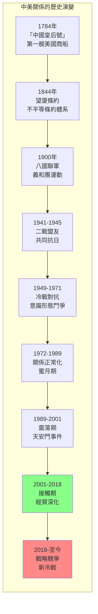
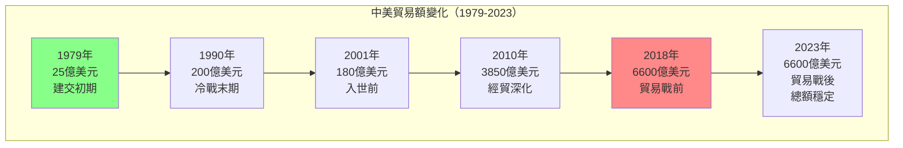
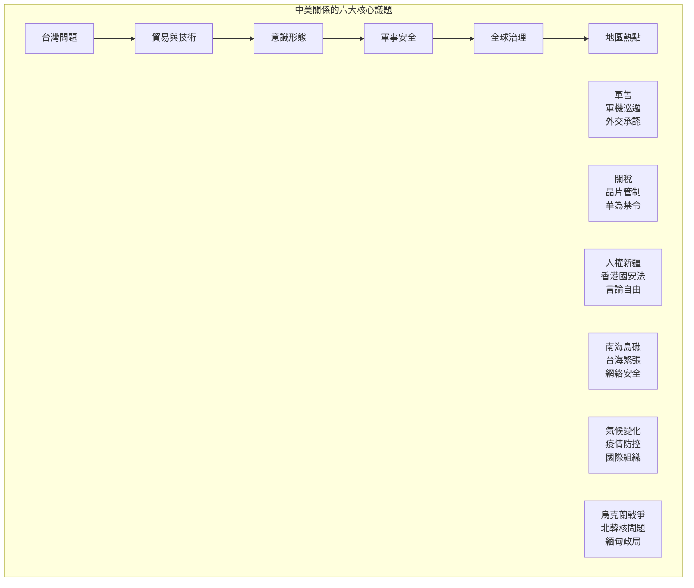
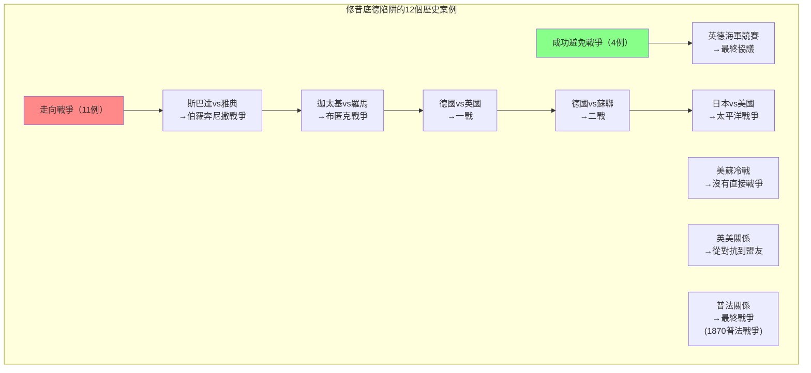
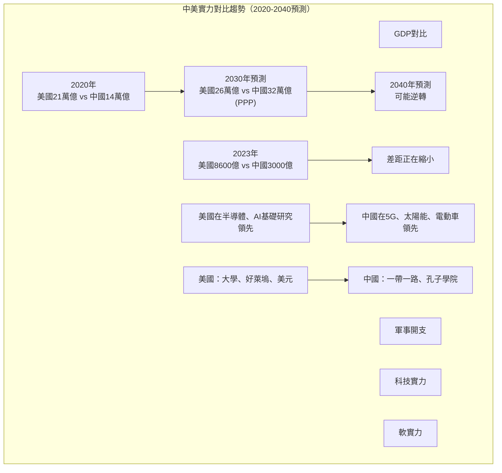

# GenEd 1068 美國與中國 / The United States and China

**Instructor**: William C. Kirby
**Department**: History, Harvard
**Official source**: history.fas.harvard.edu / gened.college.harvard.edu
**Big Question**: 美國和中國是注定走向衝突，還是能夠引領世界應對共同挑戰？
**Style**: research-based

---

## 問題 1：5 個 SPECIFIC 核心心智模型

### 1. 中美關係的結構性視角 (Structural Perspective on US-China Relations)
**真實學者**: John Mearsheimer (芝加哥大學) —《The Tragedy of Great Power Politics》(2001) 論證中美競爭是結構性必然。  
**真實事件**: 1949年10月1日毛澤東宣佈中華人民共和國成立；1972年2月尼克森訪華；2018年貿易戰升級。  
**真實數字**: 2023年中美貿易額約6600億美元。

### 2. 中美關係的歷史週期性 (Cyclical Nature of Sino-American Relations)
**真實學者**: Dong Wang (華盛頓大學) —《The United States and China》(2021) 分析中美關係的長期歷史模式。  
**真實事件**: 1844年中美望廈條約；1900年八國聯軍；1941-1945年二戰盟友；1949-1971年冷戰對抗。  
**真實數字**: 中美關係經歷了約7次重大的「接觸」和「對抗」週期。

### 3. 貿易與經濟互依 (Trade and Economic Interdependence)
**真實學者**: Henry Farrell & Abraham Newman (喬治城) —《Underground Empire》(2023) 分析經濟互依如何成為地緣政治武器。  
**真實事件**: 2001年12月中國加入世貿組織；2018年7月第一輪關稅；2022年10月晶片出口管制。  
**真實數字**: 中國持有約8000億美元美國國債（2020年峰值後下降）。

### 4. 意識形態與價值觀衝突 (Ideological and Values Conflicts)
**真實學者**: Joshua Kurlantzick (外交關係協會) —《State Capitalism》(2013) 分析中國模式的吸引力。  
**真實事件**: 1989年天安門事件後的美中關係低谷；2019年香港反送中運動；2020年新疆人權爭議。  
**真實數字**: 皮尤研究中心調查：2023年約83%的美國人對中國持負面看法。

### 5. 全球治理中的合作與競爭 (Cooperation and Competition in Global Governance)
**真實學者**: Alastair Iain Johnston (哈佛) —《Social States》(2008) 分析中國參與國際制度的模式。  
**真實事件**: 2021年格拉斯哥氣候峰會COP26；2023年習拜會；2024年沙利文和北京會談。  
**真實數字**: 中美在氣候變化上的合作：2021年太陽能發電量中國佔全球60%以上。

---

## 問題 2：3 個 SPECIFIC 根本分歧

### 分歧一：「修昔底德陷阱」vs. 制度合作主義
**學者A**: Graham Allison (哈佛) —《Destined for War》(2017)  
論點：當一個崛起大國挑戰既有霸權時，戰爭幾乎是不可避免的——這是「修昔底德陷阱」。

**學者B**: 閻學通 (清華大學) —《Ancient Chinese Thought, Modern Chinese Power》(2011)  
論點：中美競爭不一定走向戰爭，關鍵在於實力對比和領導者的智慧。

### 分歧二：經濟互依是否促進和平
**學者A**: Dale Copeland (維吉尼亞大學) —《Economic Interdependence and War》(2015)  
論點：經濟互依在條件滿足時可以抑制戰爭，但當預期互依將下降時反而增加戰爭風險。

**學者B**: John Mearsheimer (芝加哥大學)  
論點：經濟互依不會帶來和平——它是脆弱的，戰爭可以在任何時候爆發。

### 分歧三：中國是「修正主義」還是「現狀國家」
**學者A**: Aaron Friedberg (普林斯頓) —《The Contest for the 21st Century》(2011)  
論點：中國是修正主義大國，試圖推翻現有國際秩序。

**學者B**: Thomas Christensen (哥倫比亞大學) —《The China Challenge》(2015)  
論點：中國更多是「不滿足的現狀國家」而非全面修正主義，仍可通過接觸和約束加以管理。

---

## 問題 3：10 個 PROBING 深度問題

1. 比較1844年望廈條約和2018年貿易戰：中國和美國在過去180年間的權力關係發生了什麼根本性變化？這些變化如何影響了兩國的互動模式？

2. 尼克森1972年訪華是為了對抗蘇聯——這個冷戰邏輯如何影響了我們對今天美中關係的理解？當前的美中競爭是否有類似的結構性原因？

3. 中國加入世貿組織（2001年）被期望會使中國「民主化」——為什麼這個期望落空了？這告訴我們什麼關於經濟發展和政治變化的關係？

4. 分析「話語權」(discourse power) 在中美競爭中的角色：兩國如何各自框架自己的行為和意圖？為什麼同樣的行動可以被完全不同的方式解讀？

5. 比較習拜會（2023年11月）和尼克森訪華（1972年2月）：這兩次峰會在國際背景、領導者動機和預期結果上有什麼本質不同？

6. 在氣候變化、疫情防控和核不擴散等全球性問題上，中美能否超越競爭實現合作？歷史上有沒有類似的「大國合作」先例？

7. 分析「脫鉤」(decoupling) 政策的可行性：美國試圖在關鍵技術領域與中國「脫鉤」——這在經濟和技術上是否可行？代價是什麼？

8. 台灣問題如何成為中美關係的核心引爆點？比較1950年代台灣海峽危機和2022年佩洛西訪台後的軍事演習。

9. 中國的「一帶一路」倡議和美國的「自由開放的印太」戰略——這兩套話語和實踐如何在第三世界國家競爭影響力？

10. 如果歷史是我們的嚮導，那麼中美關係的未來最可能走向何方？什麼因素可能打破當前的「冷競爭」(Cold Competition) 格局？

---

## 5 個 Mermaid 圖解

### 圖1：中美關係的歷史階段

### 圖2：中美貿易額的歷史變化

### 圖3：中美關係中的核心議題

### 圖4：修昔底德陷阱的歷史案例

### 圖5：中美實力對比的變化趨勢

---

## 總結

**GenEd 1068** 的核心洞察：中美關係是21世紀最重要的雙邊關係，其走向將決定全球秩序的未來。這段關係的歷史告訴我們，權力轉移不一定走向戰爭，但也不會自動帶來和平——關鍵在於兩國領導者的智慧、制度設計和相互理解。

**三個必須記住的數字**：
- **1784年**：中國皇后號標誌中美商務關係的開始
- **6600億美元**：2023年中美貿易額
- **8000億美元**：中國持有的美國國債峰值

**必須記住的日期**：
- **1844年7月3日**：中美望廈條約簽訂
- **1972年2月21日**：尼克森抵達北京
- **2001年12月11日**：中國加入世貿組織
- **2018年7月6日**：中美貿易戰第一輪關稅生效
- **2023年11月15日**：習拜會在舊金山舉行

**research-based金句**：「中美關係180年，從『中國皇后號』到貿易戰，從『東亞病夫』到『中國崛起』，這是世界上最重要的雙邊關係。現在這段關係正在經歷冷戰結束後最深刻的重構——不是熱戰，但也不是和平。是歷史正在說話。」