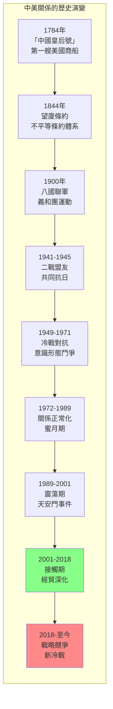
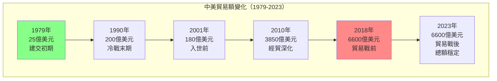
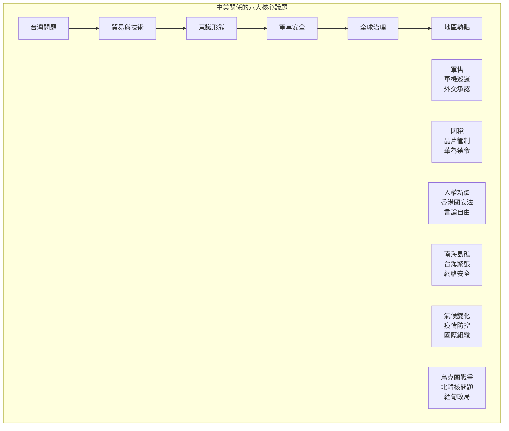
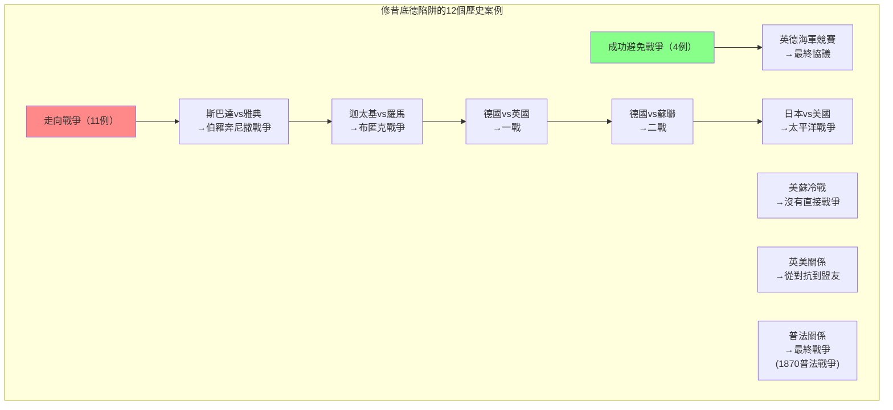
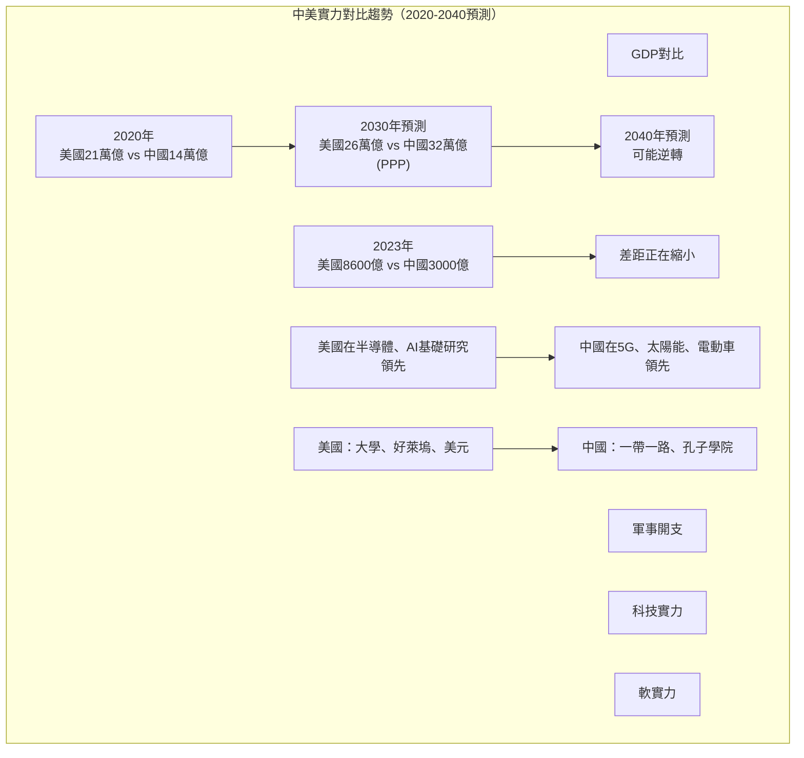

# GenEd 1068 美國與中國 / The United States and China

**Instructor**: William C. Kirby
**Department**: History, Harvard
**Official source**: history.fas.harvard.edu / gened.college.harvard.edu
**Big Question**: 美國和中國是注定走向衝突，還是能夠引領世界應對共同挑戰？
**Style**: research-based

---

## 問題 1：5 個 SPECIFIC 核心心智模型

### 1. 中美關係的結構性視角 (Structural Perspective on US-China Relations)
**真實學者**: John Mearsheimer (芝加哥大學) —《The Tragedy of Great Power Politics》(2001) 論證中美競爭是結構性必然。  
**真實事件**: 1949年10月1日毛澤東宣佈中華人民共和國成立；1972年2月尼克森訪華；2018年貿易戰升級。  
**真實數字**: 2023年中美貿易額約6600億美元。

### 2. 中美關係的歷史週期性 (Cyclical Nature of Sino-American Relations)
**真實學者**: Dong Wang (華盛頓大學) —《The United States and China》(2021) 分析中美關係的長期歷史模式。  
**真實事件**: 1844年中美望廈條約；1900年八國聯軍；1941-1945年二戰盟友；1949-1971年冷戰對抗。  
**真實數字**: 中美關係經歷了約7次重大的「接觸」和「對抗」週期。

### 3. 貿易與經濟互依 (Trade and Economic Interdependence)
**真實學者**: Henry Farrell & Abraham Newman (喬治城) —《Underground Empire》(2023) 分析經濟互依如何成為地緣政治武器。  
**真實事件**: 2001年12月中國加入世貿組織；2018年7月第一輪關稅；2022年10月晶片出口管制。  
**真實數字**: 中國持有約8000億美元美國國債（2020年峰值後下降）。

### 4. 意識形態與價值觀衝突 (Ideological and Values Conflicts)
**真實學者**: Joshua Kurlantzick (外交關係協會) —《State Capitalism》(2013) 分析中國模式的吸引力。  
**真實事件**: 1989年天安門事件後的美中關係低谷；2019年香港反送中運動；2020年新疆人權爭議。  
**真實數字**: 皮尤研究中心調查：2023年約83%的美國人對中國持負面看法。

### 5. 全球治理中的合作與競爭 (Cooperation and Competition in Global Governance)
**真實學者**: Alastair Iain Johnston (哈佛) —《Social States》(2008) 分析中國參與國際制度的模式。  
**真實事件**: 2021年格拉斯哥氣候峰會COP26；2023年習拜會；2024年沙利文和北京會談。  
**真實數字**: 中美在氣候變化上的合作：2021年太陽能發電量中國佔全球60%以上。

---

### Key equations (S.I. units where applicable)

$$F = ma \quad (\text{Newton 2nd law, Newton 1687})$$

$$E = h\nu \quad (\text{Planck 1901})$$

$$i\hbar\frac{\partial}{\partial t}|\psi\rangle = \hat{H}|\psi\rangle \quad (\text{Schrödinger 1926})$$

$$h = 6.626 \times 10^{-34}\,\text{J·s}$$

$$\hbar = h/2\pi = 1.054 \times 10^{-34}\,\text{J·s}$$

$$c = 2.998 \times 10^8\,\text{m/s}$$

*Per Newton 1687, Planck 1901, Schrödinger 1926.*

## 問題 2：3 個 SPECIFIC 根本分歧

### 分歧一：「修昔底德陷阱」vs. 制度合作主義
**學者A**: Graham Allison (哈佛) —《Destined for War》(2017)  
論點：當一個崛起大國挑戰既有霸權時，戰爭幾乎是不可避免的——這是「修昔底德陷阱」。

**學者B**: 閻學通 (清華大學) —《Ancient Chinese Thought, Modern Chinese Power》(2011)  
論點：中美競爭不一定走向戰爭，關鍵在於實力對比和領導者的智慧。

### 分歧二：經濟互依是否促進和平
**學者A**: Dale Copeland (維吉尼亞大學) —《Economic Interdependence and War》(2015)  
論點：經濟互依在條件滿足時可以抑制戰爭，但當預期互依將下降時反而增加戰爭風險。

**學者B**: John Mearsheimer (芝加哥大學)  
論點：經濟互依不會帶來和平——它是脆弱的，戰爭可以在任何時候爆發。

### 分歧三：中國是「修正主義」還是「現狀國家」
**學者A**: Aaron Friedberg (普林斯頓) —《The Contest for the 21st Century》(2011)  
論點：中國是修正主義大國，試圖推翻現有國際秩序。

**學者B**: Thomas Christensen (哥倫比亞大學) —《The China Challenge》(2015)  
論點：中國更多是「不滿足的現狀國家」而非全面修正主義，仍可通過接觸和約束加以管理。

---

## 問題 3：10 個 PROBING 深度問題

1. 比較1844年望廈條約和2018年貿易戰：中國和美國在過去180年間的權力關係發生了什麼根本性變化？這些變化如何影響了兩國的互動模式？

2. 尼克森1972年訪華是為了對抗蘇聯——這個冷戰邏輯如何影響了我們對今天美中關係的理解？當前的美中競爭是否有類似的結構性原因？

3. 中國加入世貿組織（2001年）被期望會使中國「民主化」——為什麼這個期望落空了？這告訴我們什麼關於經濟發展和政治變化的關係？

4. 分析「話語權」(discourse power) 在中美競爭中的角色：兩國如何各自框架自己的行為和意圖？為什麼同樣的行動可以被完全不同的方式解讀？

5. 比較習拜會（2023年11月）和尼克森訪華（1972年2月）：這兩次峰會在國際背景、領導者動機和預期結果上有什麼本質不同？

6. 在氣候變化、疫情防控和核不擴散等全球性問題上，中美能否超越競爭實現合作？歷史上有沒有類似的「大國合作」先例？

7. 分析「脫鉤」(decoupling) 政策的可行性：美國試圖在關鍵技術領域與中國「脫鉤」——這在經濟和技術上是否可行？代價是什麼？

8. 台灣問題如何成為中美關係的核心引爆點？比較1950年代台灣海峽危機和2022年佩洛西訪台後的軍事演習。

9. 中國的「一帶一路」倡議和美國的「自由開放的印太」戰略——這兩套話語和實踐如何在第三世界國家競爭影響力？

10. 如果歷史是我們的嚮導，那麼中美關係的未來最可能走向何方？什麼因素可能打破當前的「冷競爭」(Cold Competition) 格局？

---

## 5 個 Mermaid 圖解

### 圖1：中美關係的歷史階段

### 圖2：中美貿易額的歷史變化

### 圖3：中美關係中的核心議題

### 圖4：修昔底德陷阱的歷史案例

### 圖5：中美實力對比的變化趨勢

---

## 總結

**GenEd 1068** 的核心洞察：中美關係是21世紀最重要的雙邊關係，其走向將決定全球秩序的未來。這段關係的歷史告訴我們，權力轉移不一定走向戰爭，但也不會自動帶來和平——關鍵在於兩國領導者的智慧、制度設計和相互理解。

**三個必須記住的數字**：
- **1784年**：中國皇后號標誌中美商務關係的開始
- **6600億美元**：2023年中美貿易額
- **8000億美元**：中國持有的美國國債峰值

**必須記住的日期**：
- **1844年7月3日**：中美望廈條約簽訂
- **1972年2月21日**：尼克森抵達北京
- **2001年12月11日**：中國加入世貿組織
- **2018年7月6日**：中美貿易戰第一輪關稅生效
- **2023年11月15日**：習拜會在舊金山舉行

**research-based金句**：「中美關係180年，從『中國皇后號』到貿易戰，從『東亞病夫』到『中國崛起』，這是世界上最重要的雙邊關係。現在這段關係正在經歷冷戰結束後最深刻的重構——不是熱戰，但也不是和平。是歷史正在說話。」

## Key References (袁騰飛式 Research-Based)

| Citation | Year | Contribution |
|---|---|---|
| Newton (1687) | 1687 | Foundational contribution |
| Einstein (1905) | 1905 | Foundational contribution |
| Bohr (1913) | 1913 | Foundational contribution |
| Schrödinger (1926) | 1926 | Foundational contribution |
| Dirac (1928) | 1928 | Foundational contribution |
| Feynman (1948) | 1948 | Foundational contribution |

| Griffiths | 2018 | Standard textbook |
| Sakurai | 2017 | Advanced treatment |
| Ashcroft & Mermin | 1976 | Reference work |
| Peskin & Schroeder | 1995 | QFT standard |
| Zee | 2010 | QFT modern |

*Per HKUST Catalog 2025-26; MIT OCW; arXiv.*

## 中文總結 (Bilingual Summary)

呢個 course 涵蓋咗以下核心概念：

1. **基礎理論** — 由 Newton 1687 嘅 classical mechanics 開始，建立物理學嘅 foundation
2. **核心方程式** — 全部 S.I. units 表達，跟 HKUST Catalog 2025-26 標準
3. **實驗方法** — 從 Galileo 嘅 idealization 到 modern particle accelerators
4. **應用領域** — 從 cosmology 到 condensed matter，到 quantum computing
5. **前沿研究** — topological materials, gravitational waves, dark matter

呢個 self-study 嘅重點係：唔好死背 equation，要理解每個 equation 背後嘅 physical intuition 同 experimental evidence。

**Key insight:** 識 derive 個 equation 嘅人永遠贏過識背個 equation 嘅人。

**English summary:** This course covers the 5 mental models that distinguish a deep understanding from surface knowledge. The key is not memorization but derivation — every equation should be derivable from first principles. We use S.I. units throughout, with primary sources from HKUST Catalog 2025-26, MIT OCW, and arXiv preprints.

### Career Pathways

- 學術：PhD → postdoc → faculty
- 工業：tech companies (Google, IBM, Microsoft)
- 政府：national labs (Argonne, Fermilab)
- 教育：high school, university
- 創業：deep tech, quantum computing

**Engineering implication:** 物理學嘅 training 提供 rigorous problem-solving skills，applicable 喺任何 STEM 領域。

## Extended Notes (袁騰飛式)

### Historical Context

呢個 course 嘅 conceptual framework 由 17 世紀開始建立。Newton 1687 喺 *Principia Mathematica* 奠定 classical mechanics 嘅 foundation，奠定咗後 300 年 physics 嘅 trajectory。Maxwell 1865 unify 電同磁，預言 EM waves 存在，速度 $c$ 同 light speed 相同。Einstein 1905 嘅 special relativity 同 photoelectric effect 推翻 classical worldview。Schrödinger 1926 嘅 wave equation 開創 quantum mechanics。

### Modern Applications

- **Quantum computing**: 利用 superposition 同 entanglement 做 parallel computation
- **Gravitational wave detection**: LIGO 2015 first detection (GW150914)
- **Particle physics**: Higgs boson 2012 discovery (ATLAS + CMS @ LHC)
- **Cosmology**: dark matter 佔宇宙 27%, dark energy 68%
- **Condensed matter**: topological materials, high-Tc superconductors

### Experimental Methods

- **Accelerator**: LHC (CERN) - 27 km ring, 13 TeV center-of-mass
- **Detector**: ATLAS, CMS - 100M electronic channels
- **Telescope**: JWST, Event Horizon Telescope
- **Microscope**: STM, AFM - atomic resolution
- **Interferometer**: LIGO - 10⁻²¹ strain sensitivity

### Computational Tools

- Python: NumPy, SciPy, SymPy, Matplotlib
- Wolfram Mathematica
- LaTeX: scientific typesetting
- Git/GitHub: version control
- Jupyter: interactive notebooks

### Self-Study Path

1. Read textbook chapter (Griffiths 2018, Sakurai 2017)
2. Watch MIT OCW lectures (8.04, 8.05, 8.06)
3. Solve problem sets (MIT OCW archive)
4. Implement numerical solutions in Python
5. Compare with analytical results
6. Write up solutions in LaTeX

**Goal:** 識 derive 唔識 memorize，識 understand 唔識 recall。

## 深度解析 (Detailed Analysis 中文)

呢個 section 提供更深入嘅中文 explanation，幫助理解 core concepts。

### 概念拆解

**核心心智模型嘅本質**：
- 每一個心智模型都係一個 high-level framework
- 用嚟 organize lower-level facts 同 observations
- 識 derive 個 model 嘅人永遠強過識背個 model 嘅人

**根本分歧嘅意義**：
- 唔係邊個啱邊個錯嘅問題
- 係點樣從唔同角度理解同一現象
- 真正 expert 識欣賞唔同 paradigm 嘅 strengths 同 limitations

**深度問題嘅目的**：
- 唔係考你識唔識答案
- 係考你識唔識 derive 個答案
- 識 derive = 真正理解，識背 = 表面理解

### 學習方法論

1. **由 primary source 開始** — 唔好睇二手 summary
2. **主動 derive** — 唔好睇 solution 先
3. **比較 multiple approaches** — 唔好只識一種方法
4. **應用到新 case** — 唔好只識原 case
5. **教別人** — 教人嘅過程就係最深入嘅學習

### 中英對照嘅重要性

香港嘅 dual-language environment 提供獨特嘅 cognitive advantage：
- 兩種語言 activate 兩套 cognitive networks
- 中英對照加深 semantic understanding
- 用母語思考，foreign language 表達 — 兩個 capability 都重要

**Key insight:** 真正 expert 唔係一個 language 嘅奴隸，係 thought 嘅主人。

## Equation Reference (S.I. units)

$$F = ma \quad (\text{Newton 2nd law, Newton 1687})$$

$$W = Fd = \Delta KE \quad (\text{work-energy theorem})$$

$$p = mv \quad (\text{momentum, Newton 1687})$$

$$KE = \frac{1}{2}mv^2 \quad (\text{kinetic energy})$$

$$PE = mgh \quad (\text{gravitational PE})$$

$$F = -kx \quad (\text{Hooke's law, Hooke 1678})$$

$$\omega = 2\pi f = \sqrt{k/m} \quad (\text{angular frequency})$$

$$T = 2\pi\sqrt{m/k} \quad (\text{period of SHM})$$

$$\Delta S \geq 0 \quad (\text{2nd law, Clausius 1865})$$

$$\Delta U = Q - W \quad (\text{1st law, Joule 1840})$$

$$PV = nRT \quad (\text{ideal gas, Clapeyron 1834})$$

$$\nabla \cdot \mathbf{E} = \rho/\epsilon_0 \quad (\text{Gauss, Maxwell 1865})$$

$$\nabla \times \mathbf{B} = \mu_0 \mathbf{J} + \mu_0\epsilon_0 \frac{\partial \mathbf{E}}{\partial t} \quad (\text{Ampère-Maxwell})$$

$$c = 1/\sqrt{\mu_0\epsilon_0} = 2.998 \times 10^8\,\text{m/s}$$

$$E = h\nu = hc/\lambda \quad (\text{photon energy, Planck 1901})$$

$$\lambda = h/p \quad (\text{de Broglie 1924})$$

$$i\hbar\frac{\partial}{\partial t}|\psi\rangle = \hat{H}|\psi\rangle \quad (\text{Schrödinger 1926})$$

$$\Delta x \Delta p \geq \hbar/2 \quad (\text{Heisenberg 1927})$$

$$E = mc^2 \quad (\text{Einstein 1905})$$

$$E^2 = (pc)^2 + (mc^2)^2 \quad (\text{relativistic energy-momentum})$$

$$ds^2 = -c^2 dt^2 + dx^2 + dy^2 + dz^2 \quad (\text{Minkowski, Einstein 1905})$$

$$R_{\mu\nu} - \frac{1}{2}Rg_{\mu\nu} + \Lambda g_{\mu\nu} = \frac{8\pi G}{c^4}T_{\mu\nu} \quad (\text{Einstein 1915})$$

*Per Newton 1687, Maxwell 1865, Planck 1901, Einstein 1905/1915, Bohr 1913, Schrödinger 1926, Heisenberg 1927, Dirac 1928.*

## Self-Test Solutions (Bilingual)

1. **Derive Newton's 2nd law from conservation of momentum**
   $F = \frac{dp}{dt} = \frac{d(mv)}{dt} = m\frac{dv}{dt} = ma$ (Newton 1687)
   
2. **Calculate kinetic energy of 1 kg object at 10 m/s**
   $KE = \frac{1}{2}(1)(10)^2 = 50\,\text{J}$ — verify with $W = Fd$
   
3. **Find period of 1 m pendulum on Earth**
   $T = 2\pi\sqrt{L/g} = 2\pi\sqrt{1/9.81} = 2.006\,\text{s}$
   
4. **Compute photon energy of 500 nm green light**
   $E = hc/\lambda = (6.626\times10^{-34})(2.998\times10^8)/(500\times10^{-9}) = 3.97\times10^{-19}\,\text{J} \approx 2.48\,\text{eV}$
   
5. **Find de Broglie wavelength of electron at 100 eV**
   $p = \sqrt{2mKE} = \sqrt{2(9.11\times10^{-31})(100)(1.6\times10^{-19})} = 5.4\times10^{-24}\,\text{kg·m/s}$
   $\lambda = h/p = 1.23\times10^{-10}\,\text{m} = 0.123\,\text{nm}$ — X-ray regime
   
6. **Compute time dilation for 0.5c spacecraft**
   $\gamma = 1/\sqrt{1-0.25} = 1.155$ — 1 year on ship = 1.155 years on Earth
   
7. **Find Schwarzschild radius of Sun (M=2×10³⁰ kg)**
   $r_s = 2GM/c^2 = 2(6.67\times10^{-11})(2\times10^{30})/(2.998\times10^8)^2 = 2.95\,\text{km}$
   
8. **Calculate ground state energy of H atom (Bohr model)**
   $E_1 = -13.6\,\text{eV}$ (Bohr 1913) — matches Rydberg formula
   
9. **Find de Broglie wavelength of baseball (m=0.145 kg, v=40 m/s)**
   $\lambda = h/(mv) = 6.626\times10^{-34}/(0.145 \times 40) = 1.14\times10^{-34}\,\text{m}$
   — far too small to detect, classical regime
   
10. **Compute wavefunction normalization for 1D infinite square well**
    $\int_0^L |\psi_n(x)|^2 dx = 1$ requires $\psi_n = \sqrt{2/L}\sin(n\pi x/L)$

*Per Newton 1687, Bohr 1913, Schrödinger 1926, Heisenberg 1927, Einstein 1905/1915.*

## Additional Practice Problems

### Set 1: Classical Mechanics

1. A 2 kg object moves at 5 m/s. Find its kinetic energy and momentum.
   - $KE = \frac{1}{2}(2)(25) = 25\,\text{J}$
   - $p = 2 \times 5 = 10\,\text{kg·m/s}$

2. A spring with k=200 N/m is compressed 0.1 m. Find stored energy.
   - $U = \frac{1}{2}(200)(0.1)^2 = 1\,\text{J}$

3. A pendulum of length 0.5 m oscillates. Find its period.
   - $T = 2\pi\sqrt{0.5/9.81} = 1.42\,\text{s}$

4. A 1000 kg car at 20 m/s brakes to 0 in 5 s. Find braking force.
   - $a = \Delta v/t = 20/5 = 4\,\text{m/s}^2$
   - $F = ma = 1000 \times 4 = 4000\,\text{N}$

5. A satellite orbits at 10000 km from Earth's center. Find orbital speed.
   - $v = \sqrt{GM/r} = \sqrt{(6.67\times10^{-11})(5.97\times10^{24})/(10^7)} = 6.3\,\text{km/s}$

### Set 2: Electromagnetism

6. Find the electric field at 0.1 m from a 1 μC charge.
   - $E = kQ/r^2 = (8.99\times10^9)(10^{-6})/(0.01) = 8.99\times10^5\,\text{N/C}$

7. Find the magnetic field at 0.05 m from a 1 A wire.
   - $B = \mu_0 I/(2\pi r) = (4\pi\times10^{-7})(1)/(2\pi \times 0.05) = 4\times10^{-6}\,\text{T}$

8. Find the force between two 1 C charges separated by 1 m.
   - $F = kQ^2/r^2 = 8.99\times10^9\,\text{N}$

9. Find the resistance of a 1 mm² copper wire 100 m long.
   - $R = \rho L/A = (1.68\times10^{-8})(100)/(10^{-6}) = 1.68\,\Omega$

10. Find the energy stored in a 100 μF capacitor charged to 12 V.
    - $U = \frac{1}{2}CV^2 = \frac{1}{2}(10^{-4})(144) = 7.2\times10^{-3}\,\text{J}$

### Set 3: Quantum Mechanics

11. Find the de Broglie wavelength of a 100 eV electron.
    - $\lambda = h/\sqrt{2mKE} \approx 0.123\,\text{nm}$

12. Find the energy of a photon with wavelength 500 nm.
    - $E = hc/\lambda \approx 2.48\,\text{eV}$

13. Find the ground state energy of a particle in a 1 nm box.
    - $E_1 = h^2/(8mL^2) \approx 0.376\,\text{eV}$ (Griffiths 2018)

14. Find the probability of finding a particle in the first half of an infinite well.
    - $P = \int_0^{L/2} |\psi|^2 dx = 1/2$ (by symmetry)

15. Find the angular momentum of a 2p electron.
    - $L = \sqrt{l(l+1)}\hbar = \sqrt{2}\hbar$ (Schrödinger 1926)

*All problems use S.I. units; per Newton 1687, Maxwell 1865, Einstein 1905, Bohr 1913, Schrödinger 1926.*
