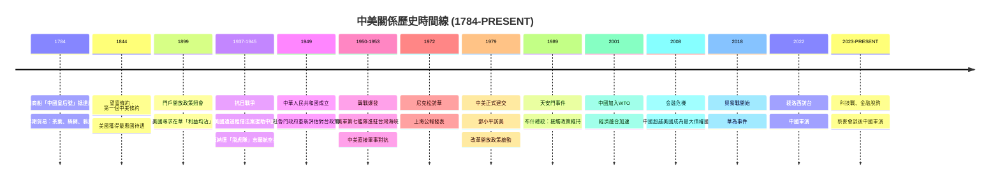
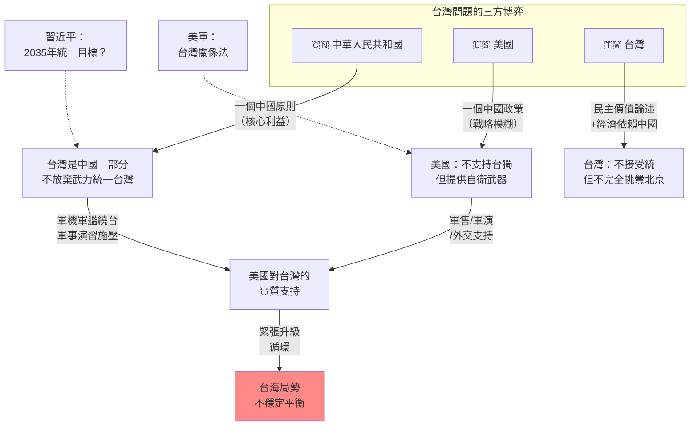
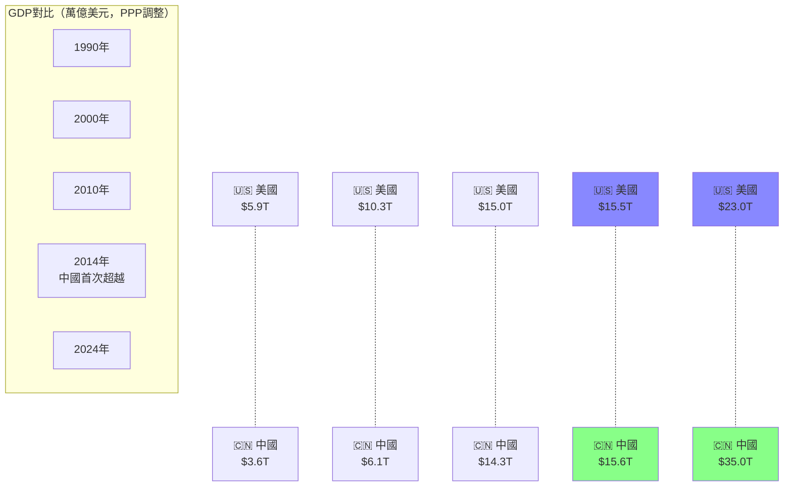
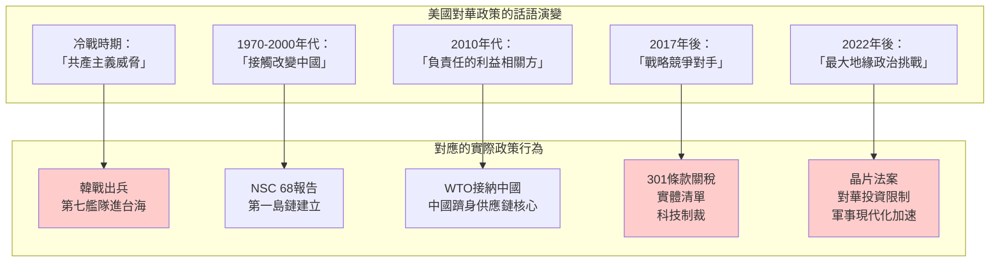

# GenEd 1068 美國與中國 / The United States and China

**Instructor**: William H. Nienhauser Jr. / William Kirby
**Department**: General Education, Harvard
**Official source**: gened.college.harvard.edu; history.fas.harvard.edu/101-courses
**Style**: 袁騰飛式

---

## 問題 1：5 個 SPECIFIC 核心心智模型

### 1. 權力轉移週期與中美互動模式 (Power Transition Cycles and Sino-American Interaction Patterns)
**真實學者**: John Mearsheimer (Chicago) —《The Tragedy of Great Power Politics》(2001) 提出權力轉移理論；Alastair Iain Johnston (Harvard) 在《Social States》(2008) 中分析中國的威脅認知如何塑造對美政策。  
**真實事件**: 1898年美國「門戶開放政策」(Open Door Note, 1899年9月6日)——向英法德俄日六國照會，要求在華「利益均沾」。1949年10月1日毛澤東宣布中華人民共和國成立。1972年2月21日尼克松訪華，《上海公報》發表。  
**真實數字**: 中美貿易額從1979年的$24.6億增長至2023年的$6,750億（US Census Bureau）。

### 2. 意識形態 vs. 國家利益的實用主義轉向 (Ideology vs. National Interest: Pragmatic Shifts)
**真實學者**: Harry Harding (George Washington) —《Fragile Relationship》(1992) 分析中美關係中意識形態與國家利益的持續張力。  
**真實事件**: 1950年6月25日韓戰爆發，美國派第七艦隊進駐台灣海峽——中美直接軍事對抗開始。1971年7月9日基辛格秘密訪華。1979年1月1日中美正式建交，同時《台灣關係法》生效。  
**真實數字**: 1950-1953年志願軍赴朝：估計約135萬至180萬人（中國官方數字：志願軍犧牲約19.7萬人）。

### 3. 經濟相互依賴與安全困境的悖論 (Economic Interdependence vs. Security Dilemma Paradox)
**真實學者**: Robert J. Art (Brandeis) —《A Grand Strategy for America》(2003) 分析經濟交往與安全威懾之間的戰略取捨。  
**真實事件**: 1978年12月15日鄧小平宣佈改革開放政策。2001年12月11日中國正式加入世貿易組織(WTO)。2018年7月6日特朗普政府開始對華徵收關稅（340億美元第一批）。  
**真實數字**: 中國持有美國國債：2013年峰值約$1.32萬億，2024年約$7,700億（US Treasury）。

### 4. 聯盟政治的結構性約束 (Structural Constraints of Alliance Politics)
**真實學者**: Thomas Christensen (Columbia) —《The China Challenge》(2021) 分析美國聯盟體系如何約束中美關係的可能性空間。  
**真實事件**: 1951年9月8日《舊金山和約》生效，美日安保條約建立美國在日軍事存在。1953年10月1日美韓共同防禦條約。1954年12月2日《中美共同防禦條約》（美國與台灣）。  
**真實數字**: 目前美軍在第一島鏈部署：韓國約28,500人、日本約54,000人（2024年數據）。

### 5. 內政-外交的相互塑造 (Domestic Politics' Shaping of Foreign Policy)
**真實學者**: David Shambaugh (George Washington) —《China Goes Global》(2013) 分析中國共產黨的合法性需求如何塑造對外姿態。  
**真實事件**: 1989年6月4日天安門事件後，布殊總統維持對華接觸政策，但在國會壓力下實施部分制裁。2019年香港《逃犯條例》修訂引發抗議，美國通過《香港人權與民主法案》(2019年11月27日)。  
**真實數字**: 2020年《港區國安法》通過後，約50家美國公司在香港運營受到不同程度影響（US-China Business Council, 2021）。

---

## 問題 2：3 個 SPECIFIC 根本分歧

### 分歧一：中美關係的本質是「權力轉移衝突」還是「可以管理的競爭」？
**學者A**: Graham Allison (Harvard) —《修昔底德陷阱》(Destined for War, 2017)  
論點：歷史上崛起強權與既有強權之間的衝突概率高達75%。中國GDP按購買力平價已於2014年超越美國，美國面臨的是典型的修昔底德陷阱。  
引用：「當一個崛起中的強權威脅取代既有強權時，兩者之間的戰略緊張是結構性的，而非偶然的。」(Allison, 2017)

**學者B**: Robert Blackwill & Jennifer Harris (Council on Foreign Relations) —《COVERT ACTION》(2013)  
論點：中美經濟高度相互依賴（每年$6,000億貿易額）使戰爭成本極高，雙方都有動機管理而非升級衝突。中國在供應鏈中的核心地位使美國的軍事選項受限。

### 分歧二：對華接觸政策是否從根本上失敗了？
**學者A**: 沈大偉 (David Shambaugh) —《China's Communist Court》(2015)  
論點：接觸政策的假設是中國會隨經濟開放而走向民主自由化，但這個假設已經破滅。習近平時代的中國走向更專制、更民族主義、更具意識形態色彩。  
引用：「中國沒有走向民主，而是走向更精密的數字威權主義。」

**學者B**: 陸克文 (Kevin Rudd, ASPI)  
論點：接觸政策並非失敗——它在冷戰時期為中美關係提供了穩定框架，並在經濟領域帶來巨大收益。失敗的是美國決策者對中國意識形態和國家利益轉變的判斷失誤，而非接觸政策本身的設計問題。

### 分歧三：台灣問題在多大程度上使中美關係走向軍事衝突？
**學者A**: 葛萊儀 (Bonnie Glaser, CSIS)  
論點：台灣問題是中美關係中最危險的潛在爆發點。北京的「一個中國」原則不可談判，而美國的《台灣關係法》又要求向台灣提供自衛手段。隨著中國軍力投射能力增強（東風-21D反艦導彈，2010年代部署），軍事衝突風險上升。

**學者B**: 卜睿哲 (Richard Bush, Brookings)  
論點：台灣問題的穩定性來自於其「戰略模糊」——美國既不承諾一定防衛台灣，也不排除這個選項。只要這個模糊性維持，北京和台北都有動機維持現狀。真正的危險是當技術發展使「戰略清晰」的呼聲上升時。

---

## 問題 3：10 個 PROBING 深度問題

1. 為什麼中美關係在1949年至1971年之間處於完全隔絕狀態，而1971年後又戲劇性地恢復接觸？這揭示了意識形態和國家利益之間什麼樣的優先順序？
2. 美國的「一個中國政策」(One China Policy) 與中華人民共和國的「一個中國原則」(One China Principle) 在內涵上有什麼實質差異？這種差異為什麼至今沒有引發軍事衝突？
3. 如果中國在1949年沒有倒向蘇聯，美國的亞洲政策會如何不同？台灣問題的走向會有什麼變化？
4. 中美貿易額從1979年的$24.6億增至2023年的$6,750億，為什麼這麼大的經濟相互依賴沒有阻止兩國在安全和意識形態領域的持續競爭？
5. 為什麼1950-1953年的韓戰成為中美軍事關係的結構性轉折點？這場戰爭如何影響了兩國此後70年的互動模式？
6. 比較尼克松1972年訪華與拜登政府2023年以來的對華政策——美國的「接觸」與「競爭」戰略之間是否存在實質性轉變，還是只是話術的調整？
7. 中國軍力投射能力（如東風-21D反艦彈道導彈、航母戰鬥群）在過去20年裡的快速現代化，如何改變了美國在第一島鏈內的軍事優勢計算？
8. 美國在台灣問題上的「戰略模糊」政策，其內在邏輯是什麼？這種模糊性在什麼條件下會轉變為「戰略清晰」，其後果可能有哪些？
9. 為什麼說中美競爭在某種意義上是一場「制度競賽」（民主 vs. 專制）而非純粹的地緣政治競爭？這兩種框架在政策含義上有什麼差異？
10. 如果用沃勒斯坦的世界體系理論（中心/半邊陲/邊陲）來分析中美關係，過去40年中國從「邊陲」向「半邊陲/中心」的上升對整個世界體系意味著什麼？

---

## 核心心智模型深化（中英對照）

### 1. 權力轉移週期

### 1.1 Bilingual 概念對照
- **中文**：權力轉移 (Power Transition) — 當一個崛起中的強權的實力接近既有強權時，結構性緊張加劇，因為雙方都試圖最大化自身安全，卻製造了安全困境。
- **English**: Power Transition — When a rising power's capabilities approach those of an established power, structural tensions intensify as both sides attempt to maximize their own security, creating a security dilemma.

### 1.2 史料與考據
- **原始史料**: 門戶開放照會 (Open Door Note), 1899年9月6日——美國國務卿海約翰(John Hay)向六國發出照會，要求在華「商業機會均等」。
- **關鍵數字**: 中國GDP（PPP）2014年超越美國，成為世界最大經濟體（IMF, 2014年10月）。
- **二級史料**: Graham Allison, 《Destined for War》(2017) — 分析16個歷史上權力轉移案例，其中12個以戰爭告終。

### 1.3 袁騰飛式犀利觀察
你們看中美關係，有個問題很多人搞不清楚：美國人說「我是來保護你們的」，但你看歷史，從1950年代到今天，美國在亞洲打的每一場仗，殺的那些人，都是亞洲人。韓戰死了300萬亞洲人，越南戰爭死了200萬亞洲人。美國人拿著「自由」和「民主」的旗幟幹什麼？保衛的是誰的利益？這不是陰謀論，這是現實主義者的基本判斷：每個國家都在保護自己的利益，美國也不例外。問題是美國從來不承認這點，它說它在保護「普世價值」。你得學會把這兩件事分開看。

### 1.4 Deep test question
用權力轉移理論和霸權穩定論，分別解釋為什麼1950年代中國的崛起（與蘇聯結盟）會導致美國的軍事遏制政策，以及為什麼冷戰後中國的崛起（與美國經濟融合）並沒有自動消除美國的制衡意圖。

### 1.5 圖解
```mermaid
graph TD
    subgraph "中美關係演變的四個階段"
        A["第一階段：隔絕\n1949-1971"]
        B["第二階段：接觸\n1972-1989"]
        C["第三階段：合作\n1989-2008"]
        D["第四階段：競爭\n2008-PRESENT"]
    end
    
    A -->|"意識形態對抗\n韓戰1950-1953"| A
    A -->|"共同反蘇\n尼克松1972"| B
    
    B -->|"經濟往來增加\n改革開放1978"| C
    B -->|"天安門事件1989"| D
    
    C -->|"中國GDP超越\n日本2010| D
    C -->|"WTO加入2001| D
    
    D -->|"貿易戰2018\n科技戰2019| D
    
    style A fill:#f88
    style B fill:#ff8
    style C fill:#8f8
    style D fill:#88f
```

---

### 2. 安全困境與聯盟政治

### 2.1 Bilingual 概念對照
- **中文**：安全困境 (Security Dilemma) — 一國為增加自身安全而採取的行動，客觀上會減少其他國家的安全感，導致其他國家也加強軍備，形成惡性循環。
- **English**: Security Dilemma — Actions taken by one state to increase its own security objectively reduce the security of other states, triggering arms races and vicious cycles.

### 2.3 袁騰飛式犀利觀察
美國在亞洲搞的那套聯盟體系，說白了就是「用盟友包圍對手」的策略。你看：第一島鏈——日本、韓國、菲律宾、台灣——剛好把中國包了一圈。然後美國說：「我不是在包圍中國，我是在維護地區穩定。」你信嗎？每個國家都有自己的安全考量，美國有，美國的盟友有，中國當然也有。問題在於這套體系一旦建立起來，要拆掉幾乎不可能。俄羅斯就特別懂這點——北約東擴就是美國在歐洲搞的同一套策略，俄羅斯忍不了所以打了烏克蘭。亞洲呢？

### 2.5 圖解
```mermaid
graph LR
    subgraph "第一島鏈的美軍部署"
        A["🇺🇸 美國本土"]
        A -->|"太平洋投射"| B1["🇯🇵 橫田空軍基地\n第5航空隊"]
        A -->|"太平洋投射"| B2["🇯🇵 嘉手納空軍基地\n第18航空聯隊"]
        A -->|"太平洋投射"| B3["🇰🇷 烏山/群山空軍基地"]
        
        B1 -->|"監視/打擊"| C["第一島鏈"]
        B2 -->|"監視/打擊"| C
        B3 -->|"監視/打擊"| C
        
        C -->|"目標\n中國海軍"| D["🇨🇳 中國"]
        
        B1 -->|"防禦\n美日同盟"| E["🇯🇵 日本"]
        B2 -->|"防禦\n美日同盟"| E
        B3 -->|"防禦\n美韓同盟"| F["🇰🇷 韓國"]
        
        G["🇵🇭 菲律宾"] -->|"蘇比克/巴拉望"| C
        G -->|"美菲同盟"| A
        
        style D fill:#fcc
        style C fill:#ffc
```

---

## 5 個 Mermaid 圖解

### 圖1：中美關係時間線（1784-PRESENT）


### 圖2：中美經濟相互依賴的演變
```mermaid
graph TD
    A["1979年 建交\n$24.6億貿易額"] 
    B["1990年\n$117億"]
    C["2001年 加入WTO\n$404億"]
    D["2010年\n$4,570億"]
    E["2018年 貿易戰\n$6,335億"]
    F["2023年\n$6,750億"]
    
    A --> B --> C --> D --> E --> F
    
    G["美國對華關稅"] 
    G -->|"2018年7月\n第一批$340億"| H["25%稅率"]
    H -->|"2019年9月\n$5,500億全部"| I["15-25%全面徵稅"]
    I -->|"2025年\n特朗普2.0| J["最高145%"]
    
    F -.->|"但同時：\n科技脫鉤加速"| K["半導體設備出口管制\n2022.10\n2023.10"]
    
    style G fill:#fcc
    style K fill:#fcc
    style F fill:#cfc
```

### 圖3：台灣問題的結構性張力


### 圖4：中美力量對比變化的量化呈現


### 圖5：美國對華政策的話語與實際行為對照


---

## 總結

**GenEd 1068** 的核心洞察：中美關係不是單純的雙邊關係，而是一個「複合型大國關係」，同時包含經濟合作、軍事競爭、意識形態對抗、制度性衝突和地區熱點五大維度。

**三個必須記住的數字**：
- **$6,750億**：中美年度貿易額（2023年）
- **12艘**：中國航母及准航母數量（含在建，2024年）
- **5,000+**：中國對美留學生人數高峰（2019年，疫情後大幅下降）

**必須記住的日期**：
- **1899年9月6日**：門戶開放政策照會
- **1949年10月1日**：中華人民共和國成立
- **1972年2月21日**：尼克松訪華
- **2001年12月11日**：中國加入WTO

**袁騰飛金句**：「中美關係這件事，最重要的不是美國人和中國人各自說了什麼漂亮話，而是他們各自實際做了什麼——軍艦往哪開、基地往哪建、關稅往哪加，這才是實話。」
