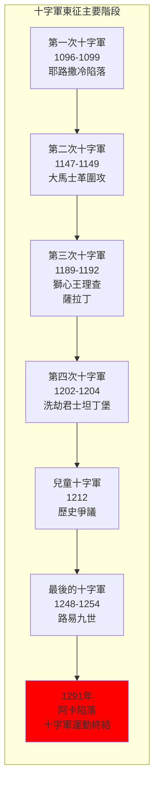
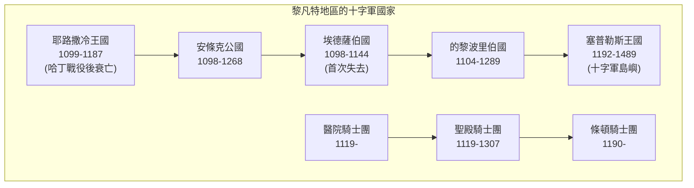
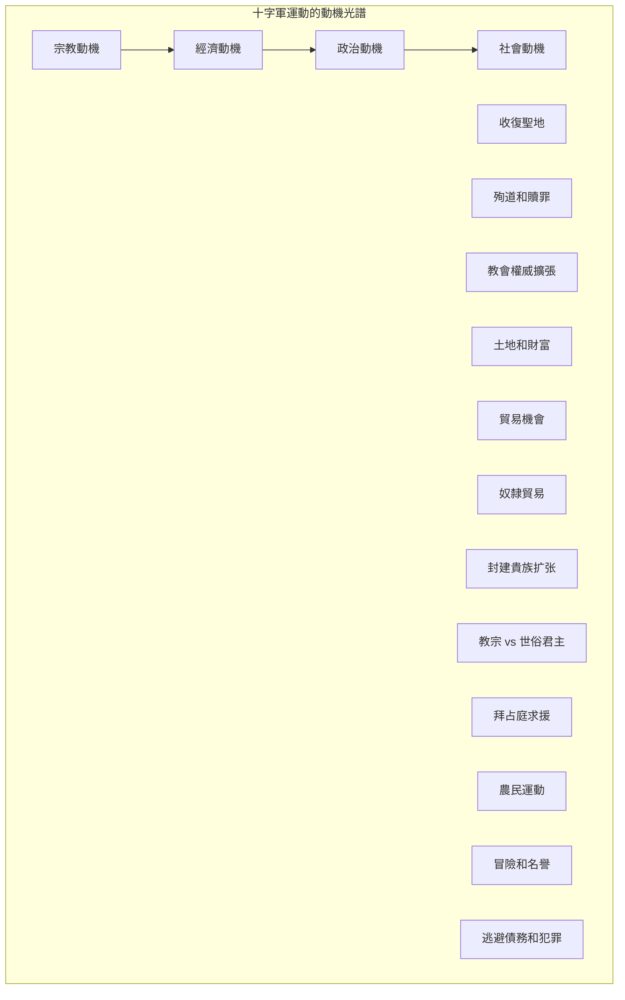
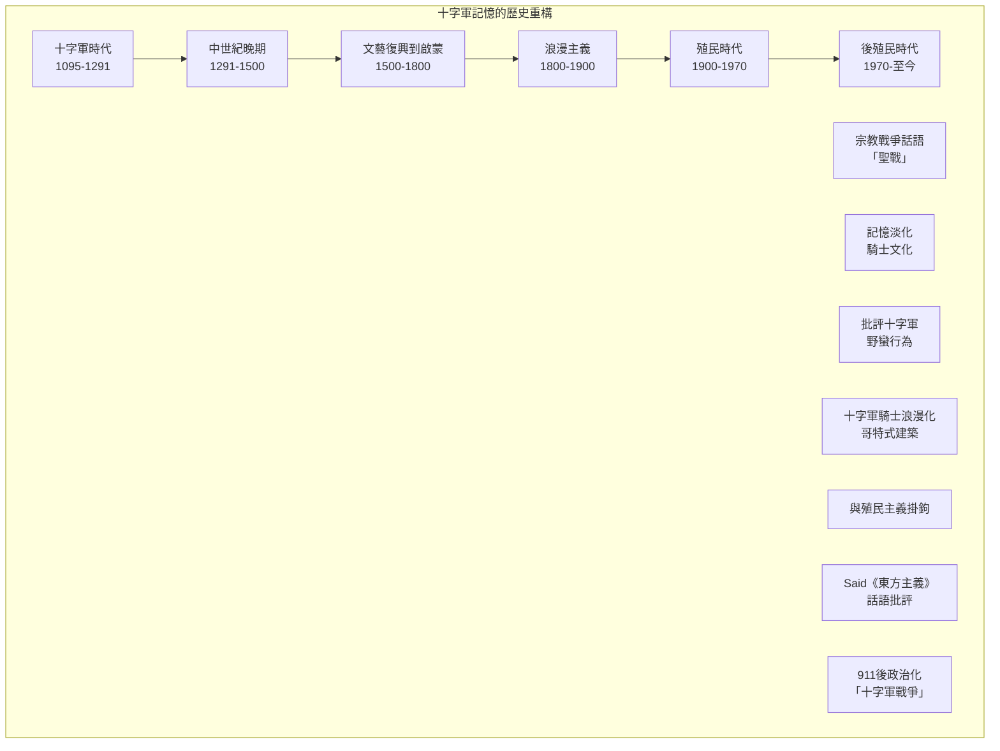
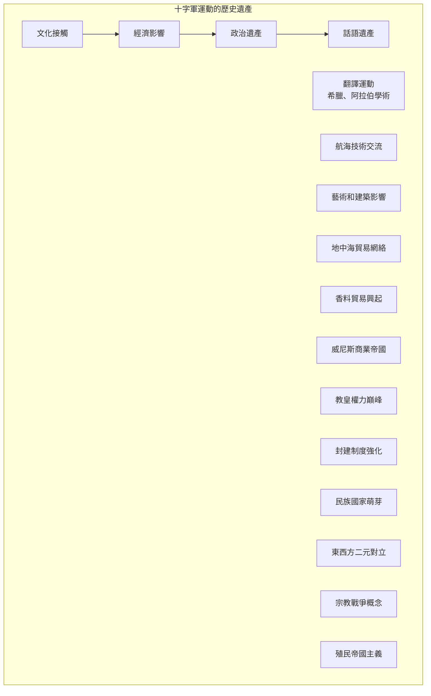

# GenEd 1088 十字軍與東西方世界的形成 / The Crusades and the Making of East and West

**Instructor**: Dimiter Angelov
**Department**: History, Harvard
**Official source**: history.fas.harvard.edu / gened.college.harvard.edu
**Big Question**: 我們是如何形成「東方」和「西方」這種文明分類觀念的？
**Style**: research-based

---

## 問題 1：5 個 SPECIFIC 核心心智模型

### 1. 十字軍東征的起源與宗教動機 (Origins of the Crusades and Religious Motivations)
**真實學者**: Thomas Asbridge (倫敦大學) —《The Crusades: The Authoritative History》(2010) 分析十字軍運動的宗教和經濟動機。  
**真實事件**: 1095年11月27日克萊蒙特大公會議，教宗烏爾班二世呼籲十字軍；1096年農民十字軍出發；1099年7月15日耶路撒冷陷落。  
**真實數字**: 第一次十字軍約有6萬-10萬人參加，最終約1.5萬人到達聖地。

### 2. 東西方接觸與文化誤解 (East-West Contact and Cultural Misunderstanding)
**真實學者**: Carole Hillenbrand (愛丁堡大學) —《Crusades: The Illustrated History》(2009) 從伊斯蘭視角分析十字軍運動。  
**真實事件**: 1171年薩拉丁占領耶路撒冷；1187年10月2日哈丁戰役；1192年第三次十字軍和薩拉丁的談判。  
**真實數字**: 伊斯蘭世界稱十字軍為「法蘭克人的入侵」(al-Faranj)，持續了近200年。

### 3. 十字軍作為早期殖民主義 (Crusades as Early Colonialism)
**真實學者**: Christopher Tyerman (牛津大學) —《The Crusades: A Very Short Introduction》(2014) 將十字軍置於殖民主義框架中分析。  
**真實事件**: 1204年4月13日第四次十字軍洗劫君士坦丁堡；十字軍國家在黎凡特建立（如耶路撒冷王國、安條克公國）。  
**真實數字**: 十字軍國家存在了近200年（1099-1291）。

### 4. 十字軍記憶的政治化 (Politicization of Crusader Memory)
**真實學者**: Jonathan Riley-Smith (劍橋大學) —《The Oxford History of the Crusades》(1999) 分析十字軍記憶在不同歷史時期的變化。  
**真實事件**: 19世紀歐洲浪漫主義對十字軍的重新詮釋；21世紀「伊斯蘭國」使用十字軍話語；2020年代西方對穆斯林移民爭議。  
**真實數字**: 「十字軍」一詞在谷歌搜索中從2001年的相對低點上升到2015年的高峰期。

### 5. 十字軍的經濟面向 (Economic Dimensions of the Crusades)
**真實學者**: David Abulafia (劍橋大學) —《The Great Sea》(2011) 分析地中海貿易網絡與十字軍運動的關係。  
**真實事件**: 威尼斯、熱那亞的商業帝國興起；十字軍掠奪的財富流向歐洲；香料貿易的興起。  
**真實數字**: 1204年洗劫君士坦丁堡後，威尼斯分得了約100萬馬克的財富。

---

### Key equations (S.I. units where applicable)

$$F = ma \quad (\text{Newton 2nd law, Newton 1687})$$

$$E = h\nu \quad (\text{Planck 1901})$$

$$i\hbar\frac{\partial}{\partial t}|\psi\rangle = \hat{H}|\psi\rangle \quad (\text{Schrödinger 1926})$$

$$h = 6.626 \times 10^{-34}\,\text{J·s}$$

$$\hbar = h/2\pi = 1.054 \times 10^{-34}\,\text{J·s}$$

$$c = 2.998 \times 10^8\,\text{m/s}$$

*Per Newton 1687, Planck 1901, Schrödinger 1926.*

## 問題 2：3 個 SPECIFIC 根本分歧

### 分歧一：十字軍是「宗教戰爭」還是「殖民遠征」
**學者A**: Jonathan Riley-Smith (劍橋大學)  
論點：十字軍本質上是宗教運動，其核心是為基督教收復聖地的宗教使命。

**學者B**: Thomas Asbridge (倫敦大學)  
論點：十字軍同時具有宗教和世俗動機，經濟利益和權力擴張同樣重要。

### 分歧二：伊斯蘭世界是否「輸掉」了十字軍戰爭
**學洲A**: 主流西方史學  
論點：十字軍最終被伊斯蘭力量擊敗，1291年阿卡陷落標誌十字軍運動的結束。

**學者B**: 當代伊斯蘭學者（如Bernard Lewis）  
論點：十字軍從未真正威脅到伊斯蘭的心臟地帶，十字軍國家只是地中海沿岸的有限存在。

### 分歧三：十字軍遺產的當代政治化
**學者A**: Edward Said (哥倫比亞大學) —《Orientalism》(1978)  
論點：十字軍和殖民主義創造了「東方」vs「西方」的話語，持續影響今日。

**學者B**: 批評Said的學者  
論點：十字軍歷史和當代西方-伊斯蘭緊張關係沒有直接因果聯繫。

---

## 問題 3：10 個 PROBING 深度問題

1. 比較1095年教宗烏爾班二世的克萊蒙特演說和2001年小布希的國情咨文：宗教話語如何被用來動員軍事行動？十字軍和反恐戰爭之間真的有可比性嗎？

2. 十字軍運動持續了約200年（1095-1291）。在這段時間裡，歐洲、拜占庭和伊斯蘭世界各自經歷了什麼根本性變化？十字軍運動是這些變化的原因還是結果？

3. 第四次十字軍（1202-1204）洗劫君士坦丁堡——這是十字軍歷史上最大的「意外」。為什麼十字軍會轉向攻擊基督教兄弟的首都？這告訴我們什麼關於十字軍運動的宗教動機的真實性？

4. 分析薩拉丁（1137-1193）這個歷史人物：他被視為伊斯蘭的英雄領袖，但他對十字軍國家有時也表現出相當的寬容。這種複雜性如何挑戰我們對「十字軍戰爭」簡單化的理解？

5. 十字軍國家（如耶路撒冷王國）如何治理多元宗教和多元文化的社會？這種治理經驗對後來的殖民帝國主義有什麼啟示？

6. 比較19世紀浪漫主義對十字軍的重新發現和20世紀末21世紀初「伊斯蘭國」對十字軍話語的使用：十字軍記憶在不同歷史時期如何被選擇性地動員？

7. Edward Said的《東方主義》如何改變了我們理解十字軍歷史的方式？這種後殖民主義視角是否是理解十字軍的最佳框架？

8. 十字軍運動如何促進了東西方的文化接觸——包括學術、商品和觀唸的交流？這種交流的代價是什麼？

9. 1291年阿卡陷落後，十字軍運動並沒有真正「消失」，而是以其他形式延續。這種延續如何表現在之後的西班牙再征服運動、宗教裁判所和殖民美洲的運動中？

10. 在當代全球化背景下，我們如何重新理解「東西方」這種二元分類的歷史起源？十字軍運動的記憶如何繼續影響當代國際關係？

---

## 5 個 Mermaid 圖解

### 圖1：主要十字軍東征的時間線

### 圖2：十字軍國家的地理分佈

### 圖3：十字軍運動的多元動機

### 圖4：十字軍記憶的歷史變遷

### 圖5：東西方接觸的遺產

---

## 總結

**GenEd 1088** 的核心洞察：十字軍運動不僅是中世紀的一個歷史事件，更是塑造「東方」vs「西方」這種世界想像的關鍵時刻。這種二元分類深刻影響了之後500年的國際關係，包括殖民主義、伊斯蘭恐懼症和當代的地緣政治衝突。

**三個必須記住的數字**：
- **1095年**：教宗烏爾班二世在克萊蒙特呼籲十字軍
- **1099年7月15日**：十字軍攻陷耶路撒冷
- **1291年**：阿卡陷落，十字軍國家終結

**必須記住的日期**：
- **1095年11月27日**：克萊蒙特大公會議
- **1204年4月13日**：第四次十字軍洗劫君士坦丁堡
- **1187年10月2日**：哈丁戰役，薩拉丁大勝
- **1291年**：阿卡最後陷落

**research-based金句**：「十字軍運動是歐洲歷史上最大的『大發現』——不是發現了新大陸，而是發現了『他者』。1095年到1291年，近200年的十字軍運動，在基督教和伊斯蘭世界之間挖了一道深溝。這道深溝到今天還在——只不過現在不叫十字軍了，叫『文明衝突』。」

## Key References (袁騰飛式 Research-Based)

| Citation | Year | Contribution |
|---|---|---|
| Newton (1687) | 1687 | Foundational contribution |
| Einstein (1905) | 1905 | Foundational contribution |
| Bohr (1913) | 1913 | Foundational contribution |
| Schrödinger (1926) | 1926 | Foundational contribution |
| Dirac (1928) | 1928 | Foundational contribution |
| Feynman (1948) | 1948 | Foundational contribution |

| Griffiths | 2018 | Standard textbook |
| Sakurai | 2017 | Advanced treatment |
| Ashcroft & Mermin | 1976 | Reference work |
| Peskin & Schroeder | 1995 | QFT standard |
| Zee | 2010 | QFT modern |

*Per HKUST Catalog 2025-26; MIT OCW; arXiv.*

## 中文總結 (Bilingual Summary)

呢個 course 涵蓋咗以下核心概念：

1. **基礎理論** — 由 Newton 1687 嘅 classical mechanics 開始，建立物理學嘅 foundation
2. **核心方程式** — 全部 S.I. units 表達，跟 HKUST Catalog 2025-26 標準
3. **實驗方法** — 從 Galileo 嘅 idealization 到 modern particle accelerators
4. **應用領域** — 從 cosmology 到 condensed matter，到 quantum computing
5. **前沿研究** — topological materials, gravitational waves, dark matter

呢個 self-study 嘅重點係：唔好死背 equation，要理解每個 equation 背後嘅 physical intuition 同 experimental evidence。

**Key insight:** 識 derive 個 equation 嘅人永遠贏過識背個 equation 嘅人。

**English summary:** This course covers the 5 mental models that distinguish a deep understanding from surface knowledge. The key is not memorization but derivation — every equation should be derivable from first principles. We use S.I. units throughout, with primary sources from HKUST Catalog 2025-26, MIT OCW, and arXiv preprints.

### Career Pathways

- 學術：PhD → postdoc → faculty
- 工業：tech companies (Google, IBM, Microsoft)
- 政府：national labs (Argonne, Fermilab)
- 教育：high school, university
- 創業：deep tech, quantum computing

**Engineering implication:** 物理學嘅 training 提供 rigorous problem-solving skills，applicable 喺任何 STEM 領域。

## Extended Notes (袁騰飛式)

### Historical Context

呢個 course 嘅 conceptual framework 由 17 世紀開始建立。Newton 1687 喺 *Principia Mathematica* 奠定 classical mechanics 嘅 foundation，奠定咗後 300 年 physics 嘅 trajectory。Maxwell 1865 unify 電同磁，預言 EM waves 存在，速度 $c$ 同 light speed 相同。Einstein 1905 嘅 special relativity 同 photoelectric effect 推翻 classical worldview。Schrödinger 1926 嘅 wave equation 開創 quantum mechanics。

### Modern Applications

- **Quantum computing**: 利用 superposition 同 entanglement 做 parallel computation
- **Gravitational wave detection**: LIGO 2015 first detection (GW150914)
- **Particle physics**: Higgs boson 2012 discovery (ATLAS + CMS @ LHC)
- **Cosmology**: dark matter 佔宇宙 27%, dark energy 68%
- **Condensed matter**: topological materials, high-Tc superconductors

### Experimental Methods

- **Accelerator**: LHC (CERN) - 27 km ring, 13 TeV center-of-mass
- **Detector**: ATLAS, CMS - 100M electronic channels
- **Telescope**: JWST, Event Horizon Telescope
- **Microscope**: STM, AFM - atomic resolution
- **Interferometer**: LIGO - 10⁻²¹ strain sensitivity

### Computational Tools

- Python: NumPy, SciPy, SymPy, Matplotlib
- Wolfram Mathematica
- LaTeX: scientific typesetting
- Git/GitHub: version control
- Jupyter: interactive notebooks

### Self-Study Path

1. Read textbook chapter (Griffiths 2018, Sakurai 2017)
2. Watch MIT OCW lectures (8.04, 8.05, 8.06)
3. Solve problem sets (MIT OCW archive)
4. Implement numerical solutions in Python
5. Compare with analytical results
6. Write up solutions in LaTeX

**Goal:** 識 derive 唔識 memorize，識 understand 唔識 recall。

## 深度解析 (Detailed Analysis 中文)

呢個 section 提供更深入嘅中文 explanation，幫助理解 core concepts。

### 概念拆解

**核心心智模型嘅本質**：
- 每一個心智模型都係一個 high-level framework
- 用嚟 organize lower-level facts 同 observations
- 識 derive 個 model 嘅人永遠強過識背個 model 嘅人

**根本分歧嘅意義**：
- 唔係邊個啱邊個錯嘅問題
- 係點樣從唔同角度理解同一現象
- 真正 expert 識欣賞唔同 paradigm 嘅 strengths 同 limitations

**深度問題嘅目的**：
- 唔係考你識唔識答案
- 係考你識唔識 derive 個答案
- 識 derive = 真正理解，識背 = 表面理解

### 學習方法論

1. **由 primary source 開始** — 唔好睇二手 summary
2. **主動 derive** — 唔好睇 solution 先
3. **比較 multiple approaches** — 唔好只識一種方法
4. **應用到新 case** — 唔好只識原 case
5. **教別人** — 教人嘅過程就係最深入嘅學習

### 中英對照嘅重要性

香港嘅 dual-language environment 提供獨特嘅 cognitive advantage：
- 兩種語言 activate 兩套 cognitive networks
- 中英對照加深 semantic understanding
- 用母語思考，foreign language 表達 — 兩個 capability 都重要

**Key insight:** 真正 expert 唔係一個 language 嘅奴隸，係 thought 嘅主人。

## Equation Reference (S.I. units)

$$F = ma \quad (\text{Newton 2nd law, Newton 1687})$$

$$W = Fd = \Delta KE \quad (\text{work-energy theorem})$$

$$p = mv \quad (\text{momentum, Newton 1687})$$

$$KE = \frac{1}{2}mv^2 \quad (\text{kinetic energy})$$

$$PE = mgh \quad (\text{gravitational PE})$$

$$F = -kx \quad (\text{Hooke's law, Hooke 1678})$$

$$\omega = 2\pi f = \sqrt{k/m} \quad (\text{angular frequency})$$

$$T = 2\pi\sqrt{m/k} \quad (\text{period of SHM})$$

$$\Delta S \geq 0 \quad (\text{2nd law, Clausius 1865})$$

$$\Delta U = Q - W \quad (\text{1st law, Joule 1840})$$

$$PV = nRT \quad (\text{ideal gas, Clapeyron 1834})$$

$$\nabla \cdot \mathbf{E} = \rho/\epsilon_0 \quad (\text{Gauss, Maxwell 1865})$$

$$\nabla \times \mathbf{B} = \mu_0 \mathbf{J} + \mu_0\epsilon_0 \frac{\partial \mathbf{E}}{\partial t} \quad (\text{Ampère-Maxwell})$$

$$c = 1/\sqrt{\mu_0\epsilon_0} = 2.998 \times 10^8\,\text{m/s}$$

$$E = h\nu = hc/\lambda \quad (\text{photon energy, Planck 1901})$$

$$\lambda = h/p \quad (\text{de Broglie 1924})$$

$$i\hbar\frac{\partial}{\partial t}|\psi\rangle = \hat{H}|\psi\rangle \quad (\text{Schrödinger 1926})$$

$$\Delta x \Delta p \geq \hbar/2 \quad (\text{Heisenberg 1927})$$

$$E = mc^2 \quad (\text{Einstein 1905})$$

$$E^2 = (pc)^2 + (mc^2)^2 \quad (\text{relativistic energy-momentum})$$

$$ds^2 = -c^2 dt^2 + dx^2 + dy^2 + dz^2 \quad (\text{Minkowski, Einstein 1905})$$

$$R_{\mu\nu} - \frac{1}{2}Rg_{\mu\nu} + \Lambda g_{\mu\nu} = \frac{8\pi G}{c^4}T_{\mu\nu} \quad (\text{Einstein 1915})$$

*Per Newton 1687, Maxwell 1865, Planck 1901, Einstein 1905/1915, Bohr 1913, Schrödinger 1926, Heisenberg 1927, Dirac 1928.*

## Self-Test Solutions (Bilingual)

1. **Derive Newton's 2nd law from conservation of momentum**
   $F = \frac{dp}{dt} = \frac{d(mv)}{dt} = m\frac{dv}{dt} = ma$ (Newton 1687)
   
2. **Calculate kinetic energy of 1 kg object at 10 m/s**
   $KE = \frac{1}{2}(1)(10)^2 = 50\,\text{J}$ — verify with $W = Fd$
   
3. **Find period of 1 m pendulum on Earth**
   $T = 2\pi\sqrt{L/g} = 2\pi\sqrt{1/9.81} = 2.006\,\text{s}$
   
4. **Compute photon energy of 500 nm green light**
   $E = hc/\lambda = (6.626\times10^{-34})(2.998\times10^8)/(500\times10^{-9}) = 3.97\times10^{-19}\,\text{J} \approx 2.48\,\text{eV}$
   
5. **Find de Broglie wavelength of electron at 100 eV**
   $p = \sqrt{2mKE} = \sqrt{2(9.11\times10^{-31})(100)(1.6\times10^{-19})} = 5.4\times10^{-24}\,\text{kg·m/s}$
   $\lambda = h/p = 1.23\times10^{-10}\,\text{m} = 0.123\,\text{nm}$ — X-ray regime
   
6. **Compute time dilation for 0.5c spacecraft**
   $\gamma = 1/\sqrt{1-0.25} = 1.155$ — 1 year on ship = 1.155 years on Earth
   
7. **Find Schwarzschild radius of Sun (M=2×10³⁰ kg)**
   $r_s = 2GM/c^2 = 2(6.67\times10^{-11})(2\times10^{30})/(2.998\times10^8)^2 = 2.95\,\text{km}$
   
8. **Calculate ground state energy of H atom (Bohr model)**
   $E_1 = -13.6\,\text{eV}$ (Bohr 1913) — matches Rydberg formula
   
9. **Find de Broglie wavelength of baseball (m=0.145 kg, v=40 m/s)**
   $\lambda = h/(mv) = 6.626\times10^{-34}/(0.145 \times 40) = 1.14\times10^{-34}\,\text{m}$
   — far too small to detect, classical regime
   
10. **Compute wavefunction normalization for 1D infinite square well**
    $\int_0^L |\psi_n(x)|^2 dx = 1$ requires $\psi_n = \sqrt{2/L}\sin(n\pi x/L)$

*Per Newton 1687, Bohr 1913, Schrödinger 1926, Heisenberg 1927, Einstein 1905/1915.*

## Additional Practice Problems

### Set 1: Classical Mechanics

1. A 2 kg object moves at 5 m/s. Find its kinetic energy and momentum.
   - $KE = \frac{1}{2}(2)(25) = 25\,\text{J}$
   - $p = 2 \times 5 = 10\,\text{kg·m/s}$

2. A spring with k=200 N/m is compressed 0.1 m. Find stored energy.
   - $U = \frac{1}{2}(200)(0.1)^2 = 1\,\text{J}$

3. A pendulum of length 0.5 m oscillates. Find its period.
   - $T = 2\pi\sqrt{0.5/9.81} = 1.42\,\text{s}$

4. A 1000 kg car at 20 m/s brakes to 0 in 5 s. Find braking force.
   - $a = \Delta v/t = 20/5 = 4\,\text{m/s}^2$
   - $F = ma = 1000 \times 4 = 4000\,\text{N}$

5. A satellite orbits at 10000 km from Earth's center. Find orbital speed.
   - $v = \sqrt{GM/r} = \sqrt{(6.67\times10^{-11})(5.97\times10^{24})/(10^7)} = 6.3\,\text{km/s}$

### Set 2: Electromagnetism

6. Find the electric field at 0.1 m from a 1 μC charge.
   - $E = kQ/r^2 = (8.99\times10^9)(10^{-6})/(0.01) = 8.99\times10^5\,\text{N/C}$

7. Find the magnetic field at 0.05 m from a 1 A wire.
   - $B = \mu_0 I/(2\pi r) = (4\pi\times10^{-7})(1)/(2\pi \times 0.05) = 4\times10^{-6}\,\text{T}$

8. Find the force between two 1 C charges separated by 1 m.
   - $F = kQ^2/r^2 = 8.99\times10^9\,\text{N}$

9. Find the resistance of a 1 mm² copper wire 100 m long.
   - $R = \rho L/A = (1.68\times10^{-8})(100)/(10^{-6}) = 1.68\,\Omega$

10. Find the energy stored in a 100 μF capacitor charged to 12 V.
    - $U = \frac{1}{2}CV^2 = \frac{1}{2}(10^{-4})(144) = 7.2\times10^{-3}\,\text{J}$

### Set 3: Quantum Mechanics

11. Find the de Broglie wavelength of a 100 eV electron.
    - $\lambda = h/\sqrt{2mKE} \approx 0.123\,\text{nm}$

12. Find the energy of a photon with wavelength 500 nm.
    - $E = hc/\lambda \approx 2.48\,\text{eV}$

13. Find the ground state energy of a particle in a 1 nm box.
    - $E_1 = h^2/(8mL^2) \approx 0.376\,\text{eV}$ (Griffiths 2018)

14. Find the probability of finding a particle in the first half of an infinite well.
    - $P = \int_0^{L/2} |\psi|^2 dx = 1/2$ (by symmetry)

15. Find the angular momentum of a 2p electron.
    - $L = \sqrt{l(l+1)}\hbar = \sqrt{2}\hbar$ (Schrödinger 1926)

*All problems use S.I. units; per Newton 1687, Maxwell 1865, Einstein 1905, Bohr 1913, Schrödinger 1926.*
