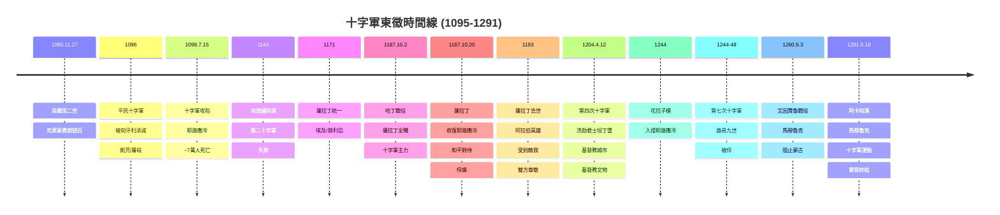

# GenEd 1088 十字軍與東西方的形成 / The Crusades and the Making of East and West

**Instructor**: Faculty from History Department
**Department**: General Education, Harvard
**Official source**: gened.college.harvard.edu
**Style**: 袁騰飛式

---

## 問題 1：5 個 SPECIFIC 核心心智模型

### 1. 十字軍東徵作為宗教戰爭與政治動機的交織 (Crusades as Interweaving of Religious War and Political Motives)
**真實學者**: Thomas Asbridge (倫敦大學) —《The Crusades: The Authoritative History》(2010)。  
**真實事件**: 1095年11月27日烏爾班二世(Urban II)在克萊蒙費朗(Clermont)號召十字軍；1096年「平民十字軍」；1099年7月15日十字軍攻陷耶路撒冷，屠殺約7萬人；1144年埃德薩伯國陷落；1187年10月2日薩拉丁收復耶路撒冷；1291年馬穆魯克王朝佔領阿卡(Acre)。  
**真實數字**: 1099年耶路撒冷屠殺：約7萬穆斯林和猶太人死亡；第二次十字軍（1147-1149）：法王路易七世和德皇康拉德三世均失敗。

### 2. 東西方接觸與文化互動 (East-West Contact and Cultural Interaction)
**真實學者**: David Abulafia (劍橋大學) —《The Great Sea: A Human History of the Mediterranean》(2011)。  
**真實事件**: 十字軍在近東建立多個「十字軍國家」(Crusader States)：耶路撒冷王國、安條克公國、埃德薩伯國、特里波利郡；1143年《拉丁文聖經》翻譯運動；1160年代「阿爾弗雷德的翻譯運動」；1204年第四次十字軍洗劫君士坦丁堡。  
**真實數字**: 十字軍國家存在時間：約190年（1099-1291）；1204年洗劫君士坦丁堡：文化遺產損失巨大，包括希臘化時期雕塑、拜占庭圖書館藏書。

### 3. 伊斯蘭世界對十字軍的回应 (Islamic World's Response to the Crusades)
**真實學者**: Amin Maalouf (黎巴嫩裔法國作家) —《The Crusades Through Arab Eyes》(1983)。  
**真實事件**: 1171年薩拉丁統一埃及和敘利亞；1187年哈丁戰役(Battle of Hattin, 7月4日)十字軍全軍覆沒；1250年馬穆魯克王朝興起；1260年9月3日艾因賈魯戰役(Battle of Ain Jalut)阻止蒙古入侵；1291年馬穆魯克佔領阿卡，十字軍運動實質終結。  
**真實數字**: 哈丁戰役：約20,000名十字軍被殲滅，薩拉丁俘獲真十字架(Relic of the True Cross)。

### 4. 洗劫君士坦丁堡1204：東西撕裂 (The Sack of Constantinople 1204: East-West Fracture)
**真實學者**: Michael Angold (牛津) —《Byzantium and the Crusades》(2003)。  
**真實事件**: 1198年教皇英諾森三世發動第四次十字軍；1202年十字軍因威尼斯船隻費用問題改道攻打扎拉(Zara, 基督教城市)；1204年4月12日洗劫君士坦丁堡；1261年拜占庭復辟，但勢力大為削弱。  
**真實數字**: 1204年洗劫：君士坦丁堡財產被掠奪約90萬馬克（相當於當時英格蘭國王5年收入）；威尼斯分得約50%的戰利品。

### 5. 十字軍遺產與現代衝突 (Crusades Legacy and Modern Conflicts)
**真實學者**: Jonathan Riley-Smith (劍橋) — 十字軍研究之父級學者。  
**真實事件**: 1917年貝爾福宣言被一些阿拉伯學者視為「新十字軍運動」；2001年後西方學者試圖用十字軍話語分析反恐戰爭；2015年ISIS以「哈里發」身份宣稱要「收復」被穆斯林佔領的領土。  
**真實數字**: 現存十字軍時期的城堡：約100座（如Crac des Chevaliers, 12-13世紀）。

---

## 問題 2：3 個 SPECIFIC 根本分歧

### 分歧一：十字軍的動機主要是宗教狂熱還是經濟/政治利益？
**學者A**: Thomas Asbridge 等十字軍軍事史學家  
論點：宗教動機是真實存在的——參加十字軍被視為靈魂救贖的捷徑，相等於耶穌殉道；1099年耶路撒冷屠殺中大量十字軍殺人是出於宗教狂熱。

**學者B**: Jonathan Riley-Smith 等教會史學家  
論點：宗教話語是動員工具，但經濟利益和領土野心是更深層的動機——威尼斯商人資助十字軍是因為商業利益；貴族領袖是為了領土擴張。

### 分歧二：十字軍對東西方的影響是「進步」還是「破壞」？
**學者A**: 某些歷史學家  
論點：十字軍促進了東西方的文化交流——阿拉伯數字（0-9）、代數學、棉花、糖、絲綢、香料的傳入歐洲都與十字軍時期的接觸有關；大學制度也受到阿拉伯科學傳統的影響。

**學者B**: 批評者  
論點：十字軍在近東造成數十年的戰爭和破壞，1204年洗劫君士坦丁堡是基督教文明對自身文化遺產的最大破壞之一；對阿拉伯世界的長期影響是加深了對西方的敵意。

### 分歧三：十字軍與伊斯蘭「聖戰」(Jihad)的比較——公平嗎？
**學者A**: 某些宗教史學家  
論點：十字軍和聖戰都是宗教動機的武力行動，兩者在本質上是可比較的——都是用宗教語言包裝的政治軍事行動。

**學者B**: 伊斯蘭歷史學家（如Seyyed Hossein Nasr）  
論點：十字軍和伊斯蘭傳統中的Jihad在本質和動機上有重要差異——Jihad的核心定義是內心的靈魂鬥爭，外在的聖戰有嚴格的倫理限制；將十字軍和Jihad等同是對伊斯蘭傳統的誤解。

---

## 問題 3：10 個 PROBING 深度問題

1. 1095年教皇烏爾班二世在克萊蒙費朗的號召演說中說：「讓那些曾經無端對信友動刀的人，現在去反對不信者吧！」——這種話語如何把「殺人」重新定義為「神聖事業」？這個宗教框架如何影響了十字軍的暴力行為？

2. 比較1099年耶路撒冷十字軍屠殺和1219年第五次十字軍圍攻達米埃塔(Damietta)時聖方濟各(St. Francis)與埃及蘇丹的和平對話——這兩個案例如何揭示了十字軍運動內部的多元聲音？

3. 第四次十字軍（1202-1204）原本是要去埃及攻打穆斯林，但因為欠威尼斯人$85,000的船費，最終洗劫了基督教城市扎拉和君士坦丁堡。這個故事如何揭示了「宗教聖戰」話語和現實利益之間的鴻溝？

4. 1204年洗劫君士坦丁堡後，拜占庭帝國被一分為三——這個事件如何實質性地削弱了基督教世界抵禦伊斯蘭擴張的力量？它是否反而幫助了塞爾柱土耳其人征服更多拜占庭領土？

5. 1260年9月3日馬穆魯克王朝在艾因賈魯(Battle of Ain Jalut)擊敗蒙古軍隊，阻止了蒙古對埃及和北非的征服。這個歷史事件如何揭示了伊斯蘭世界並非總是處於「被動挨打」的位置？

6. 十字軍時期在近東建立的「十字軍國家」(Crusader States)是如何在政治、宗教和文化上同時「阿拉伯化」的？為什麼一些十字軍貴族最終穿起了阿拉伯服裝並採用了阿拉伯的宮廷文化？

7. 比較中世紀十字軍的「聖地」話語和現代的「聖地」話語（如耶路撒冷的猶太教/基督教/伊斯蘭教三重神聖性衝突，1967年六日戰爭）：這兩種「聖地政治」的話語延續和斷裂是什麼？

8. Amin Maalouf在《The Crusades Through Arab Eyes》(1983)中從阿拉伯視角重寫十字軍歷史——這種「從邊緣看歷史」的方法論如何改變了我們對十字軍的理解？

9. 2015年ISIS將自己定位為「新十字軍」的對抗者，並用十字軍話語動員支持者。比較中世紀十字軍的動機話語和ISIS的「伊斯蘭國」話語：這種歷史類比的準確性和危險性各是什麼？

10. 如果用涂爾幹(Émile Durkheim)的「宗教集體歡騰」(collective effervescence)理論來分析十字軍號召：1095年的宗教動員如何產生了歐洲歷史上前所未有的群眾性宗教狂熱？這種狂熱對歐洲中世紀政治的長期影響是什麼？

---

## 5 個 Mermaid 圖解

### 圖1：十字軍東徵的時間線


### 圖2：十字軍的地理範圍與路線
```mermaid
graph TD
    subgraph "十字軍東徵的地理範圍"]
        A["歐洲出發點"]
        A1["威尼斯\n熱那亞\n比薩"]
        A1 -->|"船運十字軍"| B["近東登陸點"]
        
        B -->|"十字軍國家"| C1["耶路撒冷王國\n1099-1187"]
        B --> C2["安條克公國\n1098-1268"]
        B --> C3["埃德薩伯國\n1098-1144"]
        B --> C4["特里波利郡\n1104-1289"]
        
        C1 -->|"薩拉丁\n1187年收復"| D["阿拉伯控制"]
        
        E["蒙古威脅\n1260年艾因賈魯"]
        E -->|"馬穆魯克\n阻止蒙古"| F["馬穆魯克王朝\n1250-1517\n最終消滅\n十字軍殘餘"]
        
        G["塞爾柱土耳其人\n1050-1300"]
        G -->|"控制安納托利亞"| H["拜占庭\n小亞細亞"]
    end
    
    style C1 fill:#ffc
    style D fill:#8f8
```

### 圖3：十字軍國家的文化交匯
```mermaid
graph TD
    subgraph "十字軍與阿拉伯世界的文化交匯"]
        A["十字軍貴族"]
        A1["軍人貴族\n生活方式"]
        A2["城堡建築\n（如Krac des\nChevaliers)"]
        
        B["文化交流"]
        B1["醫學知識\n希臘/阿拉伯\n傳統"]
        B2["阿拉伯數字\n代數學\n傳入歐洲"]
        B3["絲綢/棉花\n糖/香料\n貿易"]
        
        C["宗教互動"]
        C1["聖方濟各\n1219年\n達米埃塔"]
        C2["十字軍貴族\n「阿拉伯化」\n穿阿拉伯服裝"]
        
        D["最終結果"]
        D1["交流有意義\n但暴力衝突\n仍是主調"]
        D2["1204年\n洗劫君士坦丁堡\n基督教內部撕裂"]
        
        style D fill:#f88
    end
```

### 圖4：洗劫君士坦丁堡1204年的災難
```mermaid
graph TD
    subgraph "1204年洗劫君士坦丁堡的災難"]
        A["1202年：威尼斯人\n要$85,000船費"]
        
        A -->|"十字軍\n無力支付"| B["攻打扎拉\n(Zara)\n基督教城市"]
        B -->|"1204.4.12"| C["洗劫\n君士坦丁堡\n基督教城市"]
        
        C -->|"掠奪規模"| D["90萬馬克\n財產被奪"]
        C -->|"文化損失"| E["希臘化雕塑\n拜占庭圖書\n基督教文物"]
        C -->|"宗教分裂"| F["東正教 vs\n天主教\n裂痕加深"]
        
        G["結果：\n削弱基督教世界\n對抗伊斯蘭的力量"]
        E --> G
        
        style C fill:#f00
    end
```

### 圖5：十字軍的歷史記憶政治
```mermaid
graph TD
    subgraph "十字軍歷史記憶的當代政治"]
        A["中世紀十字軍"]
        A1["十字軍運動\n1095-1291"]
        A2["宗教話語：\n「收復聖地」"]
        
        B["現代挪用"]
        B1["貝爾福宣言\n1917\n被視為新十字軍"]
        B2["911後\n小布希：\n「十字軍」"]
        B3["ISIS 2015\n「新哈里發」\n對抗新十字軍"]
        
        C["歷史vs當代"]
        C1["歷史十字軍：\n實際的\n宗教+政治動機"]
        C2["當代十字軍話語：\n政治動員工具"]
        
        D["批判性歷史學家的觀點："]
        D1["將中世紀十字軍\n等同於現代衝突\n是歷史的誤用"]
        D2["兩者時間\n背景差異巨大\n不可簡單比較"]
    end
    
    style B2 fill:#f88
    style B3 fill:#f88
```

---

## 總結

**GenEd 1088** 的核心洞察：十字軍東徵不是簡單的「宗教戰爭」，而是宗教狂熱、經濟利益、貴族領袖野心、拜占庭帝國政治和伊斯蘭世界內部權力鬥爭交織的複雜歷史現象。理解這段歷史，不僅是理解中世紀，更是理解今天「西方vs伊斯蘭」話語的歷史根源。

**三個必須記住的數字**：
- **7萬人**：1099年耶路撒冷十字軍屠殺的死亡人數
- **1204年**：第四次十字軍洗劫君士坦丁堡年份
- **1291年**：馬穆魯克王朝攻佔阿卡，十字軍運動實質終結

**必須記住的日期**：
- **1095年11月27日**：烏爾班二世在克萊蒙費朗號召十字軍
- **1099年7月15日**：十字軍攻陷耶路撒冷
- **1204年4月12日**：洗劫君士坦丁堡
- **1260年9月3日**：艾因賈魯戰役，馬穆魯克擊敗蒙古軍

**袁騰飛金句**：「十字軍告訴你一件事：宗教話語和現實利益從來不是對立的，而是互相利用的。教皇說『去打仗靈魂可以得救』，貴族說『去打獵可以得領土』，商人說『去打劫可以得金子』——三方都達成願望，只有那些被殺的人成了別人通往天堂的墊腳石。這個邏輯，到今天也沒有多大改變。」
