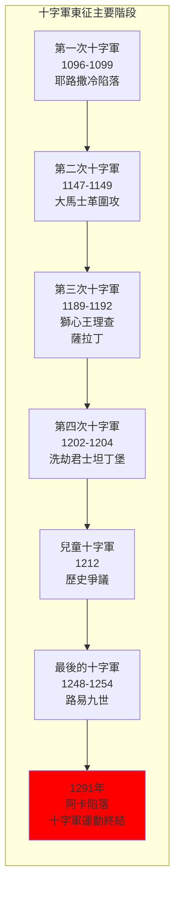
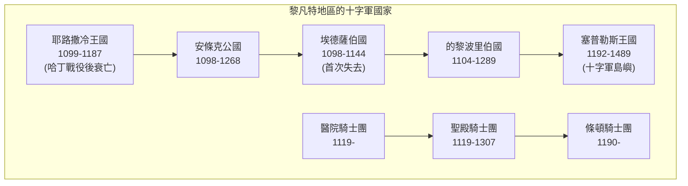
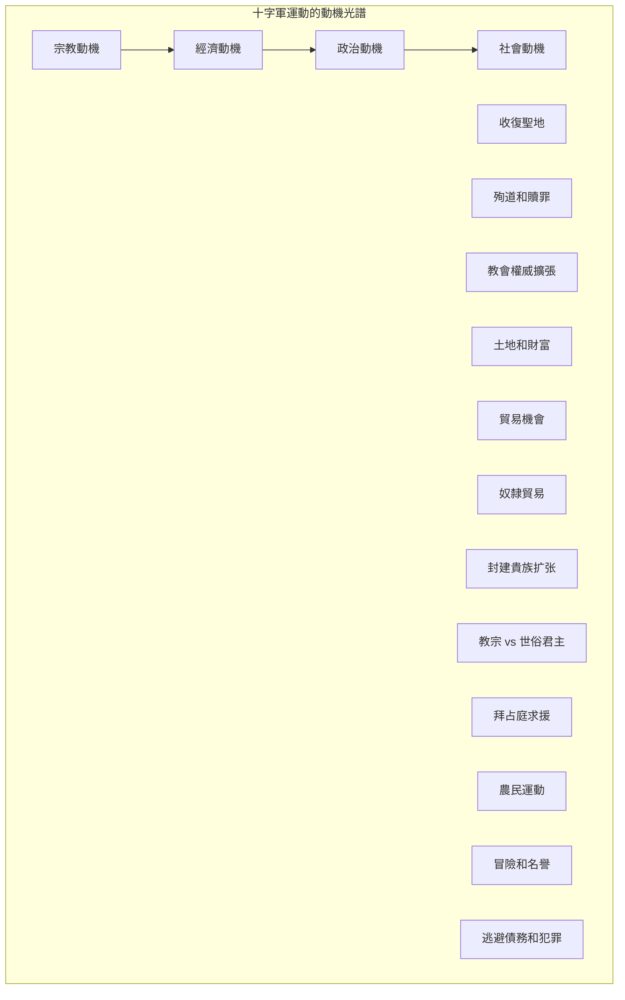
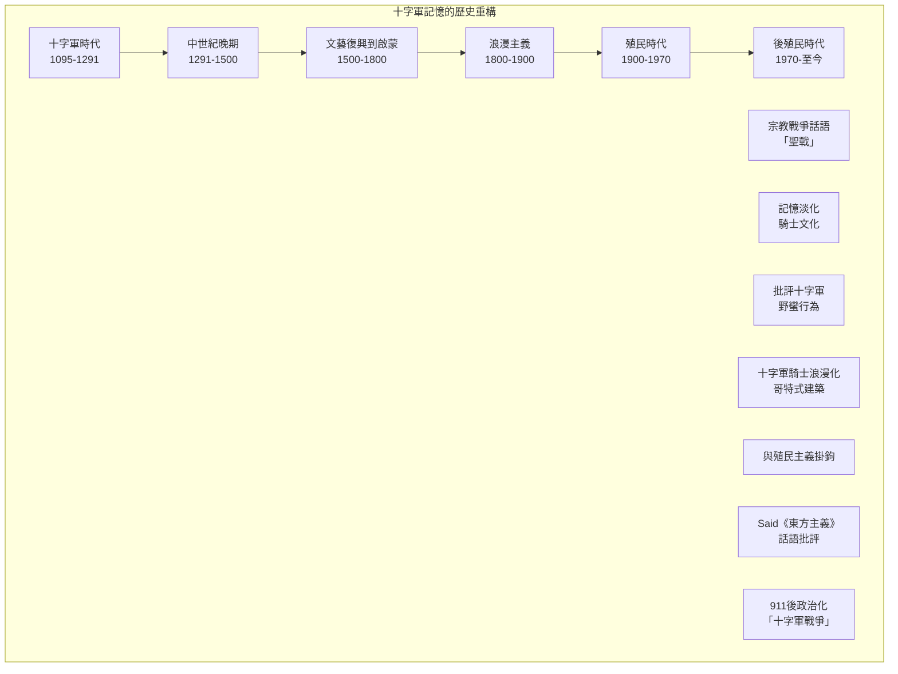
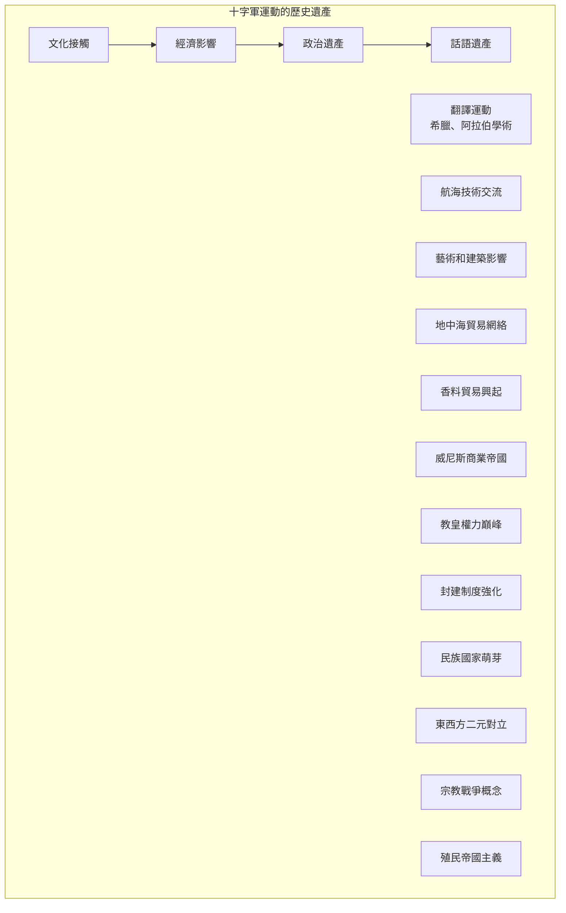

# GenEd 1088 十字軍與東西方世界的形成 / The Crusades and the Making of East and West

**Instructor**: Dimiter Angelov
**Department**: History, Harvard
**Official source**: history.fas.harvard.edu / gened.college.harvard.edu
**Big Question**: 我們是如何形成「東方」和「西方」這種文明分類觀念的？
**Style**: research-based

---

## 問題 1：5 個 SPECIFIC 核心心智模型

### 1. 十字軍東征的起源與宗教動機 (Origins of the Crusades and Religious Motivations)
**真實學者**: Thomas Asbridge (倫敦大學) —《The Crusades: The Authoritative History》(2010) 分析十字軍運動的宗教和經濟動機。  
**真實事件**: 1095年11月27日克萊蒙特大公會議，教宗烏爾班二世呼籲十字軍；1096年農民十字軍出發；1099年7月15日耶路撒冷陷落。  
**真實數字**: 第一次十字軍約有6萬-10萬人參加，最終約1.5萬人到達聖地。

### 2. 東西方接觸與文化誤解 (East-West Contact and Cultural Misunderstanding)
**真實學者**: Carole Hillenbrand (愛丁堡大學) —《Crusades: The Illustrated History》(2009) 從伊斯蘭視角分析十字軍運動。  
**真實事件**: 1171年薩拉丁占領耶路撒冷；1187年10月2日哈丁戰役；1192年第三次十字軍和薩拉丁的談判。  
**真實數字**: 伊斯蘭世界稱十字軍為「法蘭克人的入侵」(al-Faranj)，持續了近200年。

### 3. 十字軍作為早期殖民主義 (Crusades as Early Colonialism)
**真實學者**: Christopher Tyerman (牛津大學) —《The Crusades: A Very Short Introduction》(2014) 將十字軍置於殖民主義框架中分析。  
**真實事件**: 1204年4月13日第四次十字軍洗劫君士坦丁堡；十字軍國家在黎凡特建立（如耶路撒冷王國、安條克公國）。  
**真實數字**: 十字軍國家存在了近200年（1099-1291）。

### 4. 十字軍記憶的政治化 (Politicization of Crusader Memory)
**真實學者**: Jonathan Riley-Smith (劍橋大學) —《The Oxford History of the Crusades》(1999) 分析十字軍記憶在不同歷史時期的變化。  
**真實事件**: 19世紀歐洲浪漫主義對十字軍的重新詮釋；21世紀「伊斯蘭國」使用十字軍話語；2020年代西方對穆斯林移民爭議。  
**真實數字**: 「十字軍」一詞在谷歌搜索中從2001年的相對低點上升到2015年的高峰期。

### 5. 十字軍的經濟面向 (Economic Dimensions of the Crusades)
**真實學者**: David Abulafia (劍橋大學) —《The Great Sea》(2011) 分析地中海貿易網絡與十字軍運動的關係。  
**真實事件**: 威尼斯、熱那亞的商業帝國興起；十字軍掠奪的財富流向歐洲；香料貿易的興起。  
**真實數字**: 1204年洗劫君士坦丁堡後，威尼斯分得了約100萬馬克的財富。

---

## 問題 2：3 個 SPECIFIC 根本分歧

### 分歧一：十字軍是「宗教戰爭」還是「殖民遠征」
**學者A**: Jonathan Riley-Smith (劍橋大學)  
論點：十字軍本質上是宗教運動，其核心是為基督教收復聖地的宗教使命。

**學者B**: Thomas Asbridge (倫敦大學)  
論點：十字軍同時具有宗教和世俗動機，經濟利益和權力擴張同樣重要。

### 分歧二：伊斯蘭世界是否「輸掉」了十字軍戰爭
**學洲A**: 主流西方史學  
論點：十字軍最終被伊斯蘭力量擊敗，1291年阿卡陷落標誌十字軍運動的結束。

**學者B**: 當代伊斯蘭學者（如Bernard Lewis）  
論點：十字軍從未真正威脅到伊斯蘭的心臟地帶，十字軍國家只是地中海沿岸的有限存在。

### 分歧三：十字軍遺產的當代政治化
**學者A**: Edward Said (哥倫比亞大學) —《Orientalism》(1978)  
論點：十字軍和殖民主義創造了「東方」vs「西方」的話語，持續影響今日。

**學者B**: 批評Said的學者  
論點：十字軍歷史和當代西方-伊斯蘭緊張關係沒有直接因果聯繫。

---

## 問題 3：10 個 PROBING 深度問題

1. 比較1095年教宗烏爾班二世的克萊蒙特演說和2001年小布希的國情咨文：宗教話語如何被用來動員軍事行動？十字軍和反恐戰爭之間真的有可比性嗎？

2. 十字軍運動持續了約200年（1095-1291）。在這段時間裡，歐洲、拜占庭和伊斯蘭世界各自經歷了什麼根本性變化？十字軍運動是這些變化的原因還是結果？

3. 第四次十字軍（1202-1204）洗劫君士坦丁堡——這是十字軍歷史上最大的「意外」。為什麼十字軍會轉向攻擊基督教兄弟的首都？這告訴我們什麼關於十字軍運動的宗教動機的真實性？

4. 分析薩拉丁（1137-1193）這個歷史人物：他被視為伊斯蘭的英雄領袖，但他對十字軍國家有時也表現出相當的寬容。這種複雜性如何挑戰我們對「十字軍戰爭」簡單化的理解？

5. 十字軍國家（如耶路撒冷王國）如何治理多元宗教和多元文化的社會？這種治理經驗對後來的殖民帝國主義有什麼啟示？

6. 比較19世紀浪漫主義對十字軍的重新發現和20世紀末21世紀初「伊斯蘭國」對十字軍話語的使用：十字軍記憶在不同歷史時期如何被選擇性地動員？

7. Edward Said的《東方主義》如何改變了我們理解十字軍歷史的方式？這種後殖民主義視角是否是理解十字軍的最佳框架？

8. 十字軍運動如何促進了東西方的文化接觸——包括學術、商品和觀唸的交流？這種交流的代價是什麼？

9. 1291年阿卡陷落後，十字軍運動並沒有真正「消失」，而是以其他形式延續。這種延續如何表現在之後的西班牙再征服運動、宗教裁判所和殖民美洲的運動中？

10. 在當代全球化背景下，我們如何重新理解「東西方」這種二元分類的歷史起源？十字軍運動的記憶如何繼續影響當代國際關係？

---

## 5 個 Mermaid 圖解

### 圖1：主要十字軍東征的時間線

### 圖2：十字軍國家的地理分佈

### 圖3：十字軍運動的多元動機

### 圖4：十字軍記憶的歷史變遷

### 圖5：東西方接觸的遺產

---

## 總結

**GenEd 1088** 的核心洞察：十字軍運動不僅是中世紀的一個歷史事件，更是塑造「東方」vs「西方」這種世界想像的關鍵時刻。這種二元分類深刻影響了之後500年的國際關係，包括殖民主義、伊斯蘭恐懼症和當代的地緣政治衝突。

**三個必須記住的數字**：
- **1095年**：教宗烏爾班二世在克萊蒙特呼籲十字軍
- **1099年7月15日**：十字軍攻陷耶路撒冷
- **1291年**：阿卡陷落，十字軍國家終結

**必須記住的日期**：
- **1095年11月27日**：克萊蒙特大公會議
- **1204年4月13日**：第四次十字軍洗劫君士坦丁堡
- **1187年10月2日**：哈丁戰役，薩拉丁大勝
- **1291年**：阿卡最後陷落

**research-based金句**：「十字軍運動是歐洲歷史上最大的『大發現』——不是發現了新大陸，而是發現了『他者』。1095年到1291年，近200年的十字軍運動，在基督教和伊斯蘭世界之間挖了一道深溝。這道深溝到今天還在——只不過現在不叫十字軍了，叫『文明衝突』。」