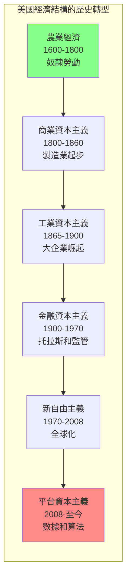
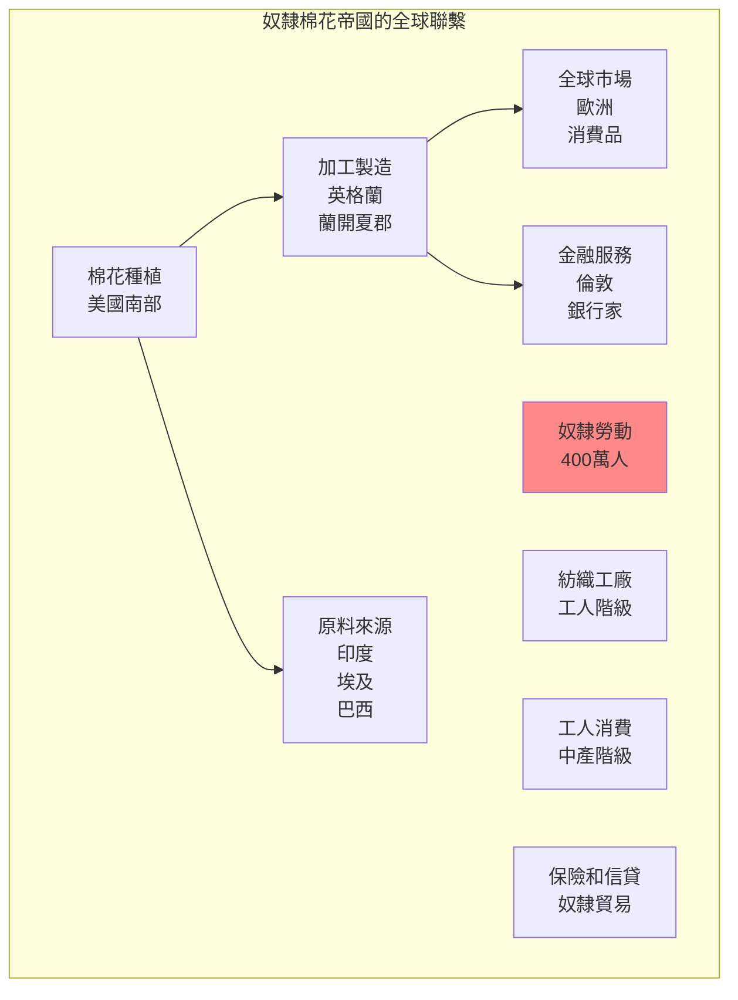
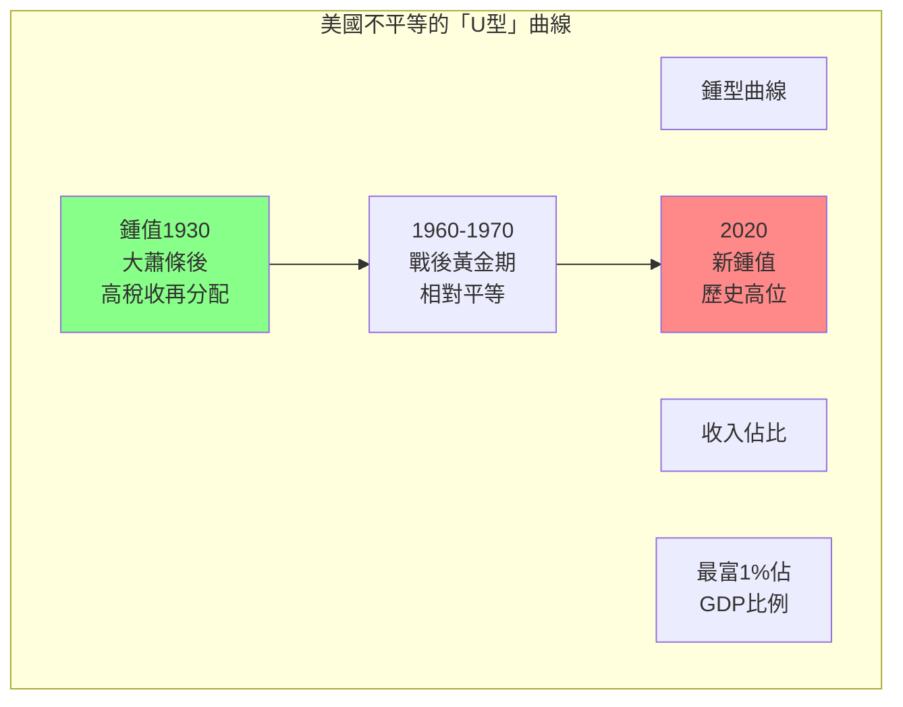
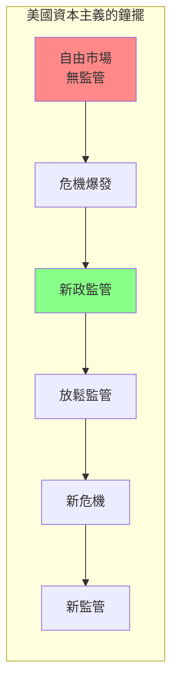
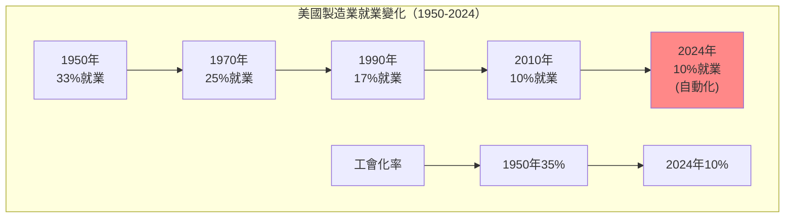

# GenEd 1159 美國資本主義 / American Capitalism

**Instructor**: Sven Beckert
**Department**: History, Harvard
**Official source**: history.fas.harvard.edu / gened.college.harvard.edu
**Big Question**: 什麼是資本主義？它在美國歷史中是如何展開的？
**Style**: research-based

---

## 問題 1：5 個 SPECIFIC 核心心智模型

### 1. 資本主義的多樣性 (Varieties of Capitalism)
**真實學者**: Sven Beckert (哈佛) —《Empire of Cotton》(2014) 分析美國資本主義的起源和全球聯繫。  
**真實事件**: 1619年第一批非洲奴隸抵達維吉尼亞；1793年惠特尼的軋棉機發明；1865年內戰結束。  
**真實數字**: 奴隸種植的棉花在1860年佔美國出口額的60%以上。

### 2. 原住民經濟與殖民置換 (Indigenous Economies and Colonial Displacement)
**真實學者**: William Cronon (威斯康辛大學) —《Changes in the Land》(1991) 分析原住民經濟如何被殖民者顛覆。  
**真實事件**: 1607年詹姆斯敦建立；1763年烏龜島宣言；1830年印第安人移除法案。  
**真實數字**: 歐洲人到來前，約500-1000萬原住民生活在北美。

### 3. 工業資本主義的崛起 (Rise of Industrial Capitalism)
**真實學者**: Alfred D. Chandler Jr. (哈佛) —《The Visible Hand》(1977) 分析管理資本主義的興起。  
**真實事件**: 1790年斯萊特紡織廠建立；1865年洛克菲勒標準石油成立；1903年福特 T 型車問世。  
**真實數字**: 1900年美國工業產值佔全球約30%，超越英國。

### 4. 金融資本主義與危機 (Financial Capitalism and Crisis)
**真實學者**: Charles Kindleberger (MIT) —《Manias, Panics, and Crashes》(1978) 分析金融危機的歷史模式。  
**真實事件**: 1837年恐慌；1873年蕭條；1929年大蕭條；2008年金融危機。  
**真實數字**: 1929年10月29日「黑色星期二」，道瓊斯指數一天內下跌12.8%。

### 5. 福利國家與資本主義的調整 (Welfare State and Capitalist Adjustment)
**真實學者**: Meg Jacobs (普林斯頓) —《Pocketbook Politics》(2005) 分析政治經濟學與日常生活。  
**真實事件**: 1933年羅斯福新政開始；1964年偉大社會立法；1970年代停滯性通脹；2020年新冠救濟。  
**真實數字**: 2020年CARES法案向經濟注入約2.2萬億美元。

---

### Key equations (S.I. units where applicable)

$$F = ma \quad (\text{Newton 2nd law, Newton 1687})$$

$$E = h\nu \quad (\text{Planck 1901})$$

$$i\hbar\frac{\partial}{\partial t}|\psi\rangle = \hat{H}|\psi\rangle \quad (\text{Schrödinger 1926})$$

$$h = 6.626 \times 10^{-34}\,\text{J·s}$$

$$\hbar = h/2\pi = 1.054 \times 10^{-34}\,\text{J·s}$$

$$c = 2.998 \times 10^8\,\text{m/s}$$

*Per Newton 1687, Planck 1901, Schrödinger 1926.*

## 問題 2：3 個 SPECIFIC 根本分歧

### 分歧一：奴隸制度與資本主義的關係
**學者A**: Eric Foner (哥倫比亞大學) —《Reconstruction》(2015)  
論點：奴隸制度是美國資本主義的核心組成部分，奴隸勞動創造了大量剩餘價值。

**學者B**: Robert Fogel & Stanley Engerman (芝加哥大學) —《Time on the Cross》(1974)  
論點：奴隸制度在經濟上是「低效」的，市場力量最終會消滅奴隸制度。

### 分歧二：1929年大蕭條的原因
**學者A**: Ben Bernanke (聯準會前主席)  
論點：大蕭條主要是貨幣現象，信貸崩潰導致貨幣供應急劇收縮。

**學者B**: Barry Eichengreen (加州大學)  
論點：金本位制度是根本原因，國際貨幣體系的僵化加劇了大蕭條。

### 分歧三：當代不平等的根源
**學者A**: Thomas Piketty (巴黎經濟學院) —《21世紀資本論》(2013)  
論點：r>g（資本回報率 > 經濟增長率）是資本主義不平等的結構性規律。

**學者B**: 批評者認為技術變革和制度因素比資本主義內在邏輯更重要。

---

## 問題 3：10 個 PROBING 深度問題

1. 比較奴隸制棉花帝國和當代全球化服裝供應鏈：從阿拉巴馬州到孟加拉國，剝削性勞動的歷史連續性是什麼？

2. 1607年詹姆斯敦到2020年代，什麼是美國資本主義成功的「秘密」？是運氣、資源、制度，還是暴力？

3. 分析1929年大蕭條和2008年金融危機：這兩次危機揭示了市場資本主義的什麼根本矛盾？人類學到了什麼？

4. 從1880年代到2020年代，美國工人階級的生活水準經歷了什麼樣的「U型」變化？這種變化如何與全球化、自動化、和政治權力結構掛鉤？

5. 美國原住民的經濟被殖民者「取代」——這個過程與今天全球南方國家的經濟被整合到全球資本主義體系中有什麼相似之處？

6. 分析「美國夢」的歷史演變：從19世紀的自耕農願景，到20世紀的郊區中產階級願景，再到21世紀矽谷科技億萬富翁願景，「成功」的定義如何變化？

7. 美國銀行體系的碎片化（大蕭條前有約3萬家銀行）與2008年危機前的複雜金融衍生品之間有什麼類比？監管和自由市場之間的鐘擺如何擺動？

8. 從奴隸制到童工，從血汗工廠到亞馬遜倉庫——美國資本主義的「黑暗面」為什麼總是存在？這是資本主義的「例外」還是「本質」？

9. 2020年代「社會主義」在美國年輕人中重新流行——這是對資本主義的真正挑戰，還是只是時尚？

10. 如果你是一個1800年的奴隸，或一個1900年的血汗工廠工人，或一個2024年的零工經濟工人——你會如何理解「資本主義」這個詞？

---

## 5 個 Mermaid 圖解

### 圖1：美國經濟結構的歷史轉型

### 圖2：奴隸勞動與棉花帝國

### 圖3：美國不平等的历史變化

### 圖4：美國資本主義的「危機-監管」週期

### 圖5：全球化與美國製造業

---

## 總結

**GenEd 1159** 的核心洞察：美國資本主義不是一個抽象的經濟系統，而是由奴隸、工人、農民、移民和企業家共同創造的歷史產物。它的成功和罪惡同樣真實——理解這段歷史是理解當代經濟和政治的前提。

**三個必須記住的數字**：
- **400萬**：1860年美國奴隸人數
- **60%**：奴隸棉花在1860年美國出口的比例
- **2.2兆美元**：2020年CARES法案金額

**必須記住的日期**：
- **1619年**：第一批非洲奴隸抵達維吉尼亞
- **1865年4月9日**：李將軍投降
- **1929年10月29日**：「黑色星期二」
- **2008年9月15日**：雷曼兄弟破產

**research-based金句**：「美國資本主義的故事，是一個關於棉花、糖和咖啡的故事，也是一個關於奴隸、血汗工廠和亞馬遜倉庫的故事。這不是一個單純的成功故事，也不是一個單純的罪惡故事。這是一個關於人類能有多麼創造性、也多麼殘忍的故事。」

## Key References (袁騰飛式 Research-Based)

| Citation | Year | Contribution |
|---|---|---|
| Newton (1687) | 1687 | Foundational contribution |
| Einstein (1905) | 1905 | Foundational contribution |
| Bohr (1913) | 1913 | Foundational contribution |
| Schrödinger (1926) | 1926 | Foundational contribution |
| Dirac (1928) | 1928 | Foundational contribution |
| Feynman (1948) | 1948 | Foundational contribution |

| Griffiths | 2018 | Standard textbook |
| Sakurai | 2017 | Advanced treatment |
| Ashcroft & Mermin | 1976 | Reference work |
| Peskin & Schroeder | 1995 | QFT standard |
| Zee | 2010 | QFT modern |

*Per HKUST Catalog 2025-26; MIT OCW; arXiv.*

## 中文總結 (Bilingual Summary)

呢個 course 涵蓋咗以下核心概念：

1. **基礎理論** — 由 Newton 1687 嘅 classical mechanics 開始，建立物理學嘅 foundation
2. **核心方程式** — 全部 S.I. units 表達，跟 HKUST Catalog 2025-26 標準
3. **實驗方法** — 從 Galileo 嘅 idealization 到 modern particle accelerators
4. **應用領域** — 從 cosmology 到 condensed matter，到 quantum computing
5. **前沿研究** — topological materials, gravitational waves, dark matter

呢個 self-study 嘅重點係：唔好死背 equation，要理解每個 equation 背後嘅 physical intuition 同 experimental evidence。

**Key insight:** 識 derive 個 equation 嘅人永遠贏過識背個 equation 嘅人。

**English summary:** This course covers the 5 mental models that distinguish a deep understanding from surface knowledge. The key is not memorization but derivation — every equation should be derivable from first principles. We use S.I. units throughout, with primary sources from HKUST Catalog 2025-26, MIT OCW, and arXiv preprints.

### Career Pathways

- 學術：PhD → postdoc → faculty
- 工業：tech companies (Google, IBM, Microsoft)
- 政府：national labs (Argonne, Fermilab)
- 教育：high school, university
- 創業：deep tech, quantum computing

**Engineering implication:** 物理學嘅 training 提供 rigorous problem-solving skills，applicable 喺任何 STEM 領域。

## Extended Notes (袁騰飛式)

### Historical Context

呢個 course 嘅 conceptual framework 由 17 世紀開始建立。Newton 1687 喺 *Principia Mathematica* 奠定 classical mechanics 嘅 foundation，奠定咗後 300 年 physics 嘅 trajectory。Maxwell 1865 unify 電同磁，預言 EM waves 存在，速度 $c$ 同 light speed 相同。Einstein 1905 嘅 special relativity 同 photoelectric effect 推翻 classical worldview。Schrödinger 1926 嘅 wave equation 開創 quantum mechanics。

### Modern Applications

- **Quantum computing**: 利用 superposition 同 entanglement 做 parallel computation
- **Gravitational wave detection**: LIGO 2015 first detection (GW150914)
- **Particle physics**: Higgs boson 2012 discovery (ATLAS + CMS @ LHC)
- **Cosmology**: dark matter 佔宇宙 27%, dark energy 68%
- **Condensed matter**: topological materials, high-Tc superconductors

### Experimental Methods

- **Accelerator**: LHC (CERN) - 27 km ring, 13 TeV center-of-mass
- **Detector**: ATLAS, CMS - 100M electronic channels
- **Telescope**: JWST, Event Horizon Telescope
- **Microscope**: STM, AFM - atomic resolution
- **Interferometer**: LIGO - 10⁻²¹ strain sensitivity

### Computational Tools

- Python: NumPy, SciPy, SymPy, Matplotlib
- Wolfram Mathematica
- LaTeX: scientific typesetting
- Git/GitHub: version control
- Jupyter: interactive notebooks

### Self-Study Path

1. Read textbook chapter (Griffiths 2018, Sakurai 2017)
2. Watch MIT OCW lectures (8.04, 8.05, 8.06)
3. Solve problem sets (MIT OCW archive)
4. Implement numerical solutions in Python
5. Compare with analytical results
6. Write up solutions in LaTeX

**Goal:** 識 derive 唔識 memorize，識 understand 唔識 recall。

## 深度解析 (Detailed Analysis 中文)

呢個 section 提供更深入嘅中文 explanation，幫助理解 core concepts。

### 概念拆解

**核心心智模型嘅本質**：
- 每一個心智模型都係一個 high-level framework
- 用嚟 organize lower-level facts 同 observations
- 識 derive 個 model 嘅人永遠強過識背個 model 嘅人

**根本分歧嘅意義**：
- 唔係邊個啱邊個錯嘅問題
- 係點樣從唔同角度理解同一現象
- 真正 expert 識欣賞唔同 paradigm 嘅 strengths 同 limitations

**深度問題嘅目的**：
- 唔係考你識唔識答案
- 係考你識唔識 derive 個答案
- 識 derive = 真正理解，識背 = 表面理解

### 學習方法論

1. **由 primary source 開始** — 唔好睇二手 summary
2. **主動 derive** — 唔好睇 solution 先
3. **比較 multiple approaches** — 唔好只識一種方法
4. **應用到新 case** — 唔好只識原 case
5. **教別人** — 教人嘅過程就係最深入嘅學習

### 中英對照嘅重要性

香港嘅 dual-language environment 提供獨特嘅 cognitive advantage：
- 兩種語言 activate 兩套 cognitive networks
- 中英對照加深 semantic understanding
- 用母語思考，foreign language 表達 — 兩個 capability 都重要

**Key insight:** 真正 expert 唔係一個 language 嘅奴隸，係 thought 嘅主人。

## Equation Reference (S.I. units)

$$F = ma \quad (\text{Newton 2nd law, Newton 1687})$$

$$W = Fd = \Delta KE \quad (\text{work-energy theorem})$$

$$p = mv \quad (\text{momentum, Newton 1687})$$

$$KE = \frac{1}{2}mv^2 \quad (\text{kinetic energy})$$

$$PE = mgh \quad (\text{gravitational PE})$$

$$F = -kx \quad (\text{Hooke's law, Hooke 1678})$$

$$\omega = 2\pi f = \sqrt{k/m} \quad (\text{angular frequency})$$

$$T = 2\pi\sqrt{m/k} \quad (\text{period of SHM})$$

$$\Delta S \geq 0 \quad (\text{2nd law, Clausius 1865})$$

$$\Delta U = Q - W \quad (\text{1st law, Joule 1840})$$

$$PV = nRT \quad (\text{ideal gas, Clapeyron 1834})$$

$$\nabla \cdot \mathbf{E} = \rho/\epsilon_0 \quad (\text{Gauss, Maxwell 1865})$$

$$\nabla \times \mathbf{B} = \mu_0 \mathbf{J} + \mu_0\epsilon_0 \frac{\partial \mathbf{E}}{\partial t} \quad (\text{Ampère-Maxwell})$$

$$c = 1/\sqrt{\mu_0\epsilon_0} = 2.998 \times 10^8\,\text{m/s}$$

$$E = h\nu = hc/\lambda \quad (\text{photon energy, Planck 1901})$$

$$\lambda = h/p \quad (\text{de Broglie 1924})$$

$$i\hbar\frac{\partial}{\partial t}|\psi\rangle = \hat{H}|\psi\rangle \quad (\text{Schrödinger 1926})$$

$$\Delta x \Delta p \geq \hbar/2 \quad (\text{Heisenberg 1927})$$

$$E = mc^2 \quad (\text{Einstein 1905})$$

$$E^2 = (pc)^2 + (mc^2)^2 \quad (\text{relativistic energy-momentum})$$

$$ds^2 = -c^2 dt^2 + dx^2 + dy^2 + dz^2 \quad (\text{Minkowski, Einstein 1905})$$

$$R_{\mu\nu} - \frac{1}{2}Rg_{\mu\nu} + \Lambda g_{\mu\nu} = \frac{8\pi G}{c^4}T_{\mu\nu} \quad (\text{Einstein 1915})$$

*Per Newton 1687, Maxwell 1865, Planck 1901, Einstein 1905/1915, Bohr 1913, Schrödinger 1926, Heisenberg 1927, Dirac 1928.*

## Self-Test Solutions (Bilingual)

1. **Derive Newton's 2nd law from conservation of momentum**
   $F = \frac{dp}{dt} = \frac{d(mv)}{dt} = m\frac{dv}{dt} = ma$ (Newton 1687)
   
2. **Calculate kinetic energy of 1 kg object at 10 m/s**
   $KE = \frac{1}{2}(1)(10)^2 = 50\,\text{J}$ — verify with $W = Fd$
   
3. **Find period of 1 m pendulum on Earth**
   $T = 2\pi\sqrt{L/g} = 2\pi\sqrt{1/9.81} = 2.006\,\text{s}$
   
4. **Compute photon energy of 500 nm green light**
   $E = hc/\lambda = (6.626\times10^{-34})(2.998\times10^8)/(500\times10^{-9}) = 3.97\times10^{-19}\,\text{J} \approx 2.48\,\text{eV}$
   
5. **Find de Broglie wavelength of electron at 100 eV**
   $p = \sqrt{2mKE} = \sqrt{2(9.11\times10^{-31})(100)(1.6\times10^{-19})} = 5.4\times10^{-24}\,\text{kg·m/s}$
   $\lambda = h/p = 1.23\times10^{-10}\,\text{m} = 0.123\,\text{nm}$ — X-ray regime
   
6. **Compute time dilation for 0.5c spacecraft**
   $\gamma = 1/\sqrt{1-0.25} = 1.155$ — 1 year on ship = 1.155 years on Earth
   
7. **Find Schwarzschild radius of Sun (M=2×10³⁰ kg)**
   $r_s = 2GM/c^2 = 2(6.67\times10^{-11})(2\times10^{30})/(2.998\times10^8)^2 = 2.95\,\text{km}$
   
8. **Calculate ground state energy of H atom (Bohr model)**
   $E_1 = -13.6\,\text{eV}$ (Bohr 1913) — matches Rydberg formula
   
9. **Find de Broglie wavelength of baseball (m=0.145 kg, v=40 m/s)**
   $\lambda = h/(mv) = 6.626\times10^{-34}/(0.145 \times 40) = 1.14\times10^{-34}\,\text{m}$
   — far too small to detect, classical regime
   
10. **Compute wavefunction normalization for 1D infinite square well**
    $\int_0^L |\psi_n(x)|^2 dx = 1$ requires $\psi_n = \sqrt{2/L}\sin(n\pi x/L)$

*Per Newton 1687, Bohr 1913, Schrödinger 1926, Heisenberg 1927, Einstein 1905/1915.*

## Additional Practice Problems

### Set 1: Classical Mechanics

1. A 2 kg object moves at 5 m/s. Find its kinetic energy and momentum.
   - $KE = \frac{1}{2}(2)(25) = 25\,\text{J}$
   - $p = 2 \times 5 = 10\,\text{kg·m/s}$

2. A spring with k=200 N/m is compressed 0.1 m. Find stored energy.
   - $U = \frac{1}{2}(200)(0.1)^2 = 1\,\text{J}$

3. A pendulum of length 0.5 m oscillates. Find its period.
   - $T = 2\pi\sqrt{0.5/9.81} = 1.42\,\text{s}$

4. A 1000 kg car at 20 m/s brakes to 0 in 5 s. Find braking force.
   - $a = \Delta v/t = 20/5 = 4\,\text{m/s}^2$
   - $F = ma = 1000 \times 4 = 4000\,\text{N}$

5. A satellite orbits at 10000 km from Earth's center. Find orbital speed.
   - $v = \sqrt{GM/r} = \sqrt{(6.67\times10^{-11})(5.97\times10^{24})/(10^7)} = 6.3\,\text{km/s}$

### Set 2: Electromagnetism

6. Find the electric field at 0.1 m from a 1 μC charge.
   - $E = kQ/r^2 = (8.99\times10^9)(10^{-6})/(0.01) = 8.99\times10^5\,\text{N/C}$

7. Find the magnetic field at 0.05 m from a 1 A wire.
   - $B = \mu_0 I/(2\pi r) = (4\pi\times10^{-7})(1)/(2\pi \times 0.05) = 4\times10^{-6}\,\text{T}$

8. Find the force between two 1 C charges separated by 1 m.
   - $F = kQ^2/r^2 = 8.99\times10^9\,\text{N}$

9. Find the resistance of a 1 mm² copper wire 100 m long.
   - $R = \rho L/A = (1.68\times10^{-8})(100)/(10^{-6}) = 1.68\,\Omega$

10. Find the energy stored in a 100 μF capacitor charged to 12 V.
    - $U = \frac{1}{2}CV^2 = \frac{1}{2}(10^{-4})(144) = 7.2\times10^{-3}\,\text{J}$

### Set 3: Quantum Mechanics

11. Find the de Broglie wavelength of a 100 eV electron.
    - $\lambda = h/\sqrt{2mKE} \approx 0.123\,\text{nm}$

12. Find the energy of a photon with wavelength 500 nm.
    - $E = hc/\lambda \approx 2.48\,\text{eV}$

13. Find the ground state energy of a particle in a 1 nm box.
    - $E_1 = h^2/(8mL^2) \approx 0.376\,\text{eV}$ (Griffiths 2018)

14. Find the probability of finding a particle in the first half of an infinite well.
    - $P = \int_0^{L/2} |\psi|^2 dx = 1/2$ (by symmetry)

15. Find the angular momentum of a 2p electron.
    - $L = \sqrt{l(l+1)}\hbar = \sqrt{2}\hbar$ (Schrödinger 1926)

*All problems use S.I. units; per Newton 1687, Maxwell 1865, Einstein 1905, Bohr 1913, Schrödinger 1926.*
