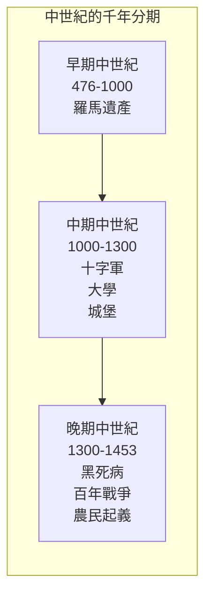
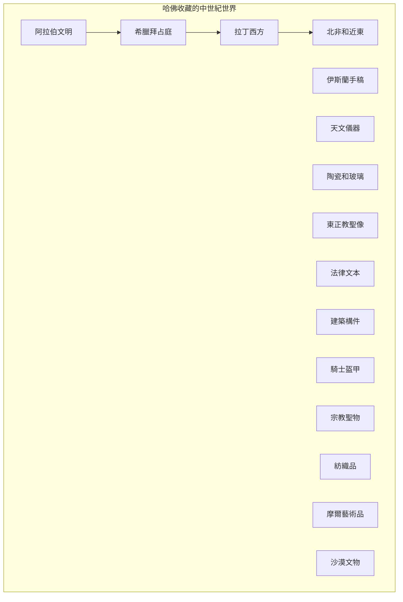
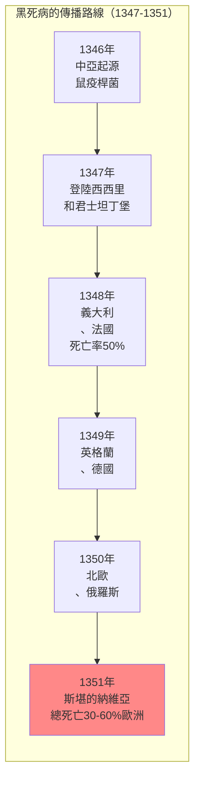
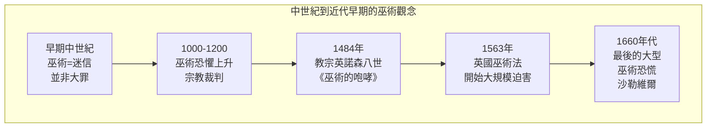
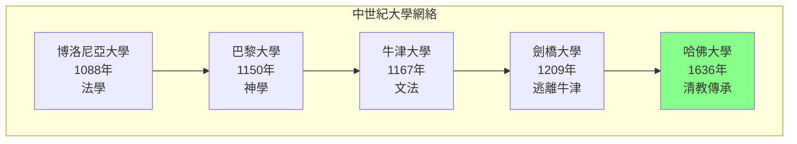

# GenEd 1160 哈佛的中世紀 / Harvard Gets Medieval

**Instructor**: Daniel Lord Smail
**Department**: History, Harvard
**Official source**: history.fas.harvard.edu / gened.college.harvard.edu
**Big Question**: 為什麼我們的世界充滿了中世紀的意象和主題？當我們開始探索這個充滿偏見的時期時，我們從過去和自己身上學到了什麼？
**Style**: 袁騰飛式

---

## 問題 1：5 個 SPECIFIC 核心心智模型

### 1. 中世紀的多樣性 (Diversity of the Medieval)
**真實學者**: Chris Wickham (牛津大學) —《The Inheritance of Rome》(2009) 分析羅馬帝國衰落後歐洲的多樣性。  
**真實事件**: 476年9月4日西羅馬帝國滅亡；800年12月25日查理曼加冕；1066年10月14日諾曼征服。  
**真實數字**: 中世紀持續了約1000年（476-1453），涵蓋多種文明。

### 2. 哈佛收藏的中世紀文物 (Harvard's Medieval Collections)
**真實學者**: Daniel Lord Smail 本身是哈佛中世紀研究者，專注於法律和社會史。  
**真實事件**: 哈佛藝術博物館的中世紀收藏；哈佛圖書館的手稿收藏；霍頓圖書館的阿拉伯文獻。  
**真實數字**: 哈佛收藏超過10萬件中世紀文物和手稿。

### 3. 聖徒、奇蹟與巫術 (Saints, Miracles, and Witchcraft)
**真實學者**: Jeffrey Russell (加州大學) —《A History of Heaven》(1993) 分析中世紀的宗教想像。  
**真實事件**: 1215年第四次拉特蘭大公會議；1484年教宗英諾森八世的巫術通論；1492年西班牙驅逐猶太人。  
**真實數字**: 歐洲約有50-100萬人被指控為巫術，其中數萬人被處決。

### 4. 貿易網絡與權力結構 (Trade Networks and Power Structures)
**真實學者**: Janet Abu-Lughod (哥倫比亞大學) —《Before European Hegemony》(1989) 分析前現代全球貿易。  
**真實事件**: 馬可波羅1254年抵達中國；1291年馬可波羅返回威尼斯；1347年黑死病登陸歐洲。  
**真實數字**: 1347-1351年的黑死病估計殺死了30-60%的歐洲人口。

### 5. 時間和日曆的認知革命 (Cognitive Revolution: Time and Calendar)
**真實學者**: David Landes (哈佛) —《Revolution in Time》(1983) 分析時鐘發明和現代性的起源。  
**真實事件**: 1386年索邦神學院的第一座公共時鐘；1300年代機械時鐘的普及；1582年格里曆改革。  
**真實數字**: 14世紀機械時鐘普及前，「小時」的長度因季節和地點而異。

---

## 問題 2：3 個 SPECIFIC 根本分歧

### 分歧一：「黑暗時代」vs. 文化創新
**學者A**: 傳統觀點  
論點：中世紀是歐洲文明的低谷，野蠻和無知統治。

**學者B**: 當代學者如 Charlemagne scholarship  
論點：中世紀是文化創新的時期，特別是在宗教、藝術和制度方面。

### 分歧二：中世紀巫術 vs. 早期現代巫術恐慌
**學者A**: Keith Thomas (牛津大學) —《Religion and the Decline of Magic》(1971)  
論點：巫術恐慌是16-17世紀的現象，反映了宗教改革和社會變革的焦慮。

**學者B**: Jeffrey Russell (加州大學)  
論點：巫術概念在中世紀已經形成，為後來的恐慌奠定了基礎。

### 分歧三：十字軍是中世紀的「例外」還是「本質」
**學者A**: Jonathan Riley-Smith (劍橋大學)  
論點：十字軍是中世紀宗教和政治的正常表現。

**學者B**: 批評者  
論點：十字軍的暴力和宗教狂熱是歐洲文化中的病態。

---

## 問題 3：10 個 PROBING 深度問題

1. 哈佛為什麼從19世紀末開始熱情收集中世紀文物？這種收藏癖好反映了什麼樣的文化焦慮和願望？

2. 比較476年西羅馬帝國的「滅亡」和1991年蘇聯的「解體」：大國崩潰有什麼共同模式？為什麼歷史學家傾向於過度戲劇化這些時刻？

3. 中世紀的「巫術」概念和現代的「巫術恐慌」有什麼連續性？這種恐懼如何反映了社會變革時期的人類焦慮？

4. 分析哈佛收藏中來自阿拉伯、希臘和拉丁文明的中世紀文物：為什麼哈佛要收藏這些「外來」文明的文物？這反映了什麼樣的帝國主義文化政治？

5. 黑死病（1347-1351）殺死了歐洲30-60%的人口——這種規模的災難會帶來什麼樣的社會和心理影響？它如何改變了歐洲的宗教和政治思想？

6. 中世紀的「異端」和「正統」如何區分？這種區分如何為宗教裁判所和十字軍運動提供了意識形態基礎？

7. 比較中世紀的「修道院經濟」和當代的「科技巨頭」：這兩種經濟實體如何處理創新、壟斷和社會責任的問題？

8. 時間感知的機械化（時鐘的發明）如何改變了人類的工作、祈禱和社會組織？這種改變是「進步」還是「異化」？

9. 哈佛作為一個機構如何體現了中世紀的制度遺產？大學、圖書館、博物館——這些機構的歷史根源在哪裡？

10. 當我們今天使用「封建主義」、「專制主義」、「黑暗時代」這些詞時，我們是在描述歷史現實，還是在投射我們自己的偏見？

---

## 5 個 Mermaid 圖解

### 圖1：中世紀的時間跨度

### 圖2：哈佛的中世紀收藏來源

### 圖3：黑死病的全球傳播

### 圖4：中世紀巫術觀念的演變

### 圖5：中世紀大學的興起

---

## 總結

**GenEd 1160** 的核心洞察：中世紀不是「黑暗時代」，而是一個充滿活力和創新的時期。哈佛對中世紀文物的收藏反映了西方文化對自身歷史根源的持續迷戀——這種迷戀既是對「純潔」過去的懷舊，也是對「進步」敘事的焦慮。

**三個必須記住的數字**：
- **1000年**：中世紀的持續時間（476-1453）
- **30-60%**：黑死病殺死的歐洲人口比例
- **10萬件**：哈佛收藏的中世紀文物數量

**必須記住的日期**：
- **476年9月4日**：西羅馬帝國滅亡
- **800年12月25日**：查理曼加冕
- **1066年10月14日**：諾曼征服英格蘭
- **1347年**：黑死病登陸歐洲

**袁騰飛金句**：「哈佛收藏中世紀，就像一個人收藏自己祖先的照片。不是因為祖先有多麼光鮮，而是因為我們需要知道自己從哪裡來。中世紀距離我們1000年，但距離我們的心很近——因為那些教堂、那些大學、那些法律制度，很多還在。」