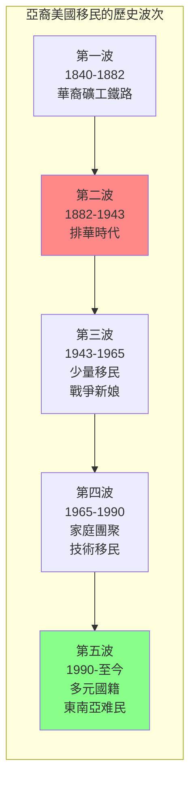
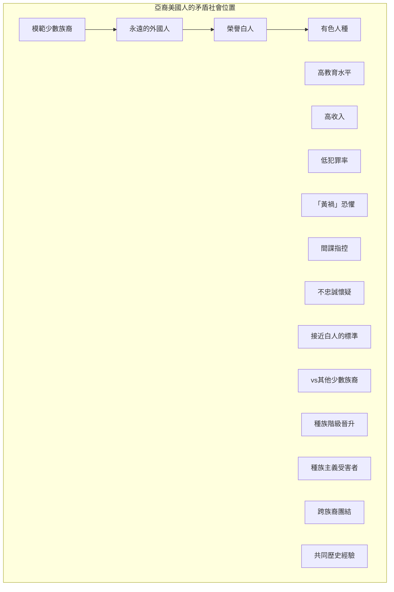
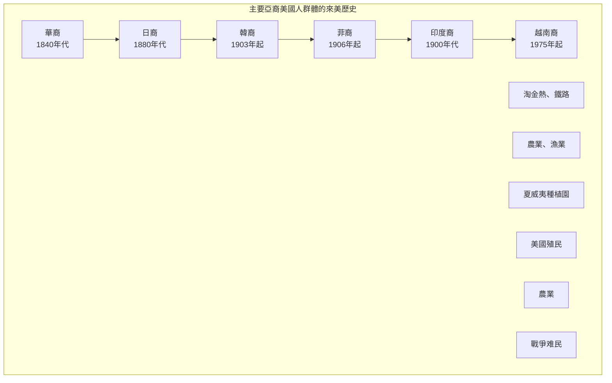
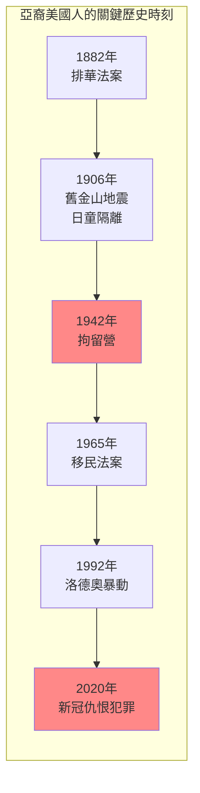
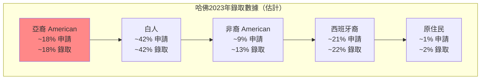

# GenEd 1206 亞裔美國人 / Asian Americans as an American Paradox

**Instructor**: Ju Yon Kim, Erika Lee & Taeku Lee
**Department**: General Education, Harvard
**Official source**: gened.college.harvard.edu / beta.my.harvard.edu
**Big Question**: 亞裔美國人的矛盾性概念如何塑造了現代美國和世界的歷史、文化和政治？
**Style**: research-based

---

## 問題 1：5 個 SPECIFIC 核心心智模型

### 1. 亞裔美國人的「模範少數族裔」迷思 (Model Minority Myth)
**真實學者**: Ellen Wu (印第安納大學) —《The Color of Success》(2014) 分析「模範少數族裔」話語的歷史建構。  
**真實事件**: 1966年《紐約時報》文章宣揚日裔美國人的「成功」；2020年新冠期間反亞裔仇恨犯罪的飆升。  
**真實數字**: 2020年3月至2022年3月，美國約有11,000起反亞裔仇恨事件。

### 2. 從「黃禍」到「模範少數族裔」的光譜 (From "Yellow Peril" to "Model Minority")
**真實學者**: Robert Lee (哈佛) —《Orientals》(1999) 分析華裔和日裔美國人的種族化歷史。  
**真實事件**: 1882年排華法案；1942-1945年日裔美國人的拘留營；1965年移民法案廢除配額。  
**真實數字**: 1882-1943年排華法案期間，約10萬華裔移民被拒絕入境。

### 3. 亞裔美國人的內部多樣性 (Internal Diversity of Asian America)
**真實學者**: Cathy Schlund-Vials (康涅狄格大學) —《Model Minorities》(2015) 分析不同亞裔群體的差異經驗。  
**真實事件**: 1970年代東南亞難民的安置；1992年韓裔社區在洛德奧暴動中的角色；2021年亞裔仇恨犯罪的增加。  
**真實數字**: 亞裔美國人涵蓋約50個不同國籍和語言群體。

### 4. 殖民者與被殖民者的雙重位置 (Colonial Subjects and Settlers)
**真實學者**: Anne Nam (加州大學) —《Colonized Body》(2014) 分析夏威夷和關島的殖民歷史。  
**真實事件**: 1893年美國併吞夏威夷共和國；1898年美西戰爭後接管菲律宾；1946年讓菲律宾獨立。  
**真實數字**: 夏威夷原住民現在佔總人口約10%。

### 5. 種族化的科學與法律建構 (Scientific and Legal Construction of Race)
**真實學者**: Jerry Yang (喬治亞理工) —《Asian American Pipeline》(2015) 分析教育系統中的種族化。  
**真實事件**: 1924年移民法案中的亞洲種族例外條款；2014年哈佛招生歧視訴訟；2023年最高法院哈佛招生案。  
**真實數字**: 亞裔學生在哈佛的錄取率約18%，而白人學生約42%。

---

## 問題 2：3 個 SPECIFIC 根本分歧

### 分歧一：「模範少數族裔」話語的功能
**學者A**: 話語支持者  
論點：「模範少數族裔」話語可以激勵其他少數族裔的努力。

**學者B**: 話語批評者如William Liu  
論點：這種話語是白人至上主義的工具，用來分裂少數族裔。

### 分歧二：亞裔美國人的政治定位
**學者A**: 主流觀點  
論點：亞裔美國人是「永遠的外國人」，傾向於支持共和黨和保守政策。

**學者B**: 左派學者  
論點：亞裔美國人是進步聯盟的重要組成部分，與其他有色人種有共同利益。

### 分歧三：亞裔vs. 白人的種族政治
**學者A**: 如Michele Goodwin  
論點：亞裔被用作「種族分裂的工具」，來維護白人的優先地位。

**學者B**: 如Andrew Yang  
論點：亞裔美國人需要建立自己的政治身份，不附屬於任何一個黨派。

---

## 問題 3：10 個 PROBING 深度問題

1. 比較1882年排華法案和2020年代的反亞裔仇恨犯罪：這130年間，華裔和亞裔美國人的種族化經驗有什麼連續性？

2. 為什麼「模範少數族裔」話語在1960年代民權運動時期特別突出？這個話語服務了誰的政治利益？

3. 分析2021年1月6日國會山暴動中的亞裔參與者：這是否挑戰了我們對「亞裔美國人政治」的簡單假設？

4. 比較日裔美國人在二戰期間的拘留營經驗和猶太人大屠殺：這兩種拘留/種族滅絕經驗有什麼本質區別？

5. 為什麼亞裔美國人社群對「哈佛招生歧視」和「平權法案」問題有如此分歧的觀點？這種分歧反映了什麼樣的階級和世代差異？

6. 分析2020年以來的反亞裔仇恨運動：這種仇恨犯罪的飆升和新冠疫情之間有什麼聯繫？這是否反映了更廣泛的種族政治的變化？

7. 從夏威夷原住民到關島的查莫羅人——亞裔美國人的「殖民者」身份如何複雜化了我們對種族政治的簡單理解？

8. 為什麼「亞裔美國人」這個身份類別是一個政治建構？不同國籍和語言背景的亞洲移民如何被整合進一個單一的「種族」類別？

9. 比較亞裔美國人的政治捐贈模式：研究顯示亞裔美國人對民主黨和共和黨的捐贈都在增加——這告訴我們什麼關於亞裔美國人的政治多樣性？

10. 如果亞裔美國人是美國「最多元」的種族群體（涵蓋50多個國籍），那麼「亞裔美國人政治」到底意味著什麼？

---

## 5 個 Mermaid 圖解

### 圖1：亞裔美國移民的歷史波次

### 圖2：亞裔美國人的「矛盾位置」

### 圖3：主要亞裔美國人群體的來美時間

### 圖4：亞裔美國人的關鍵歷史事件

### 圖5：哈佛招生中的種族均衡

---

## 總結

**GenEd 1206** 的核心洞察：亞裔美國人歷史揭示了美國種族政治的複雜性——亞裔美國人被同時框架為「模範少數族裔」和「永遠的外國人」，這種矛盾反映了美國種族階級體系的深層運作邏輯。

**三個必須記住的數字**：
- **1882年**：排華法案，美國第一部針對特定族裔的移民禁令
- **1942-1945年**：日裔美國人拘留營，約12萬人被拘留
- **2020-2022年**：約11,000起反亞裔仇恨事件

**必須記住的日期**：
- **1882年5月6日**：排華法案簽署
- **1942年2月19日**：羅斯福行政命令9066
- **1965年10月3日**：Hart-Celler法案廢除配額制
- **2021年3月16日**：亞特蘭大槍擊案

**research-based金句**：「亞裔美國人不是美國歷史的旁觀者，而是這個國家種族政治的核心。從排華法案到拘留營，從『模範少數族裔』到新冠仇恨犯罪——這不是一個關於成功的故事，而是一個關於種族化如何運作的案例研究。」