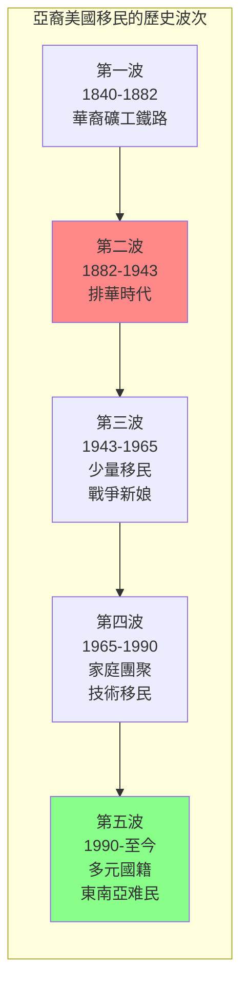
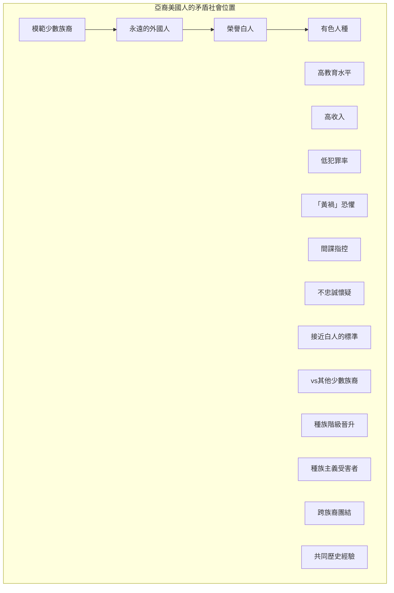
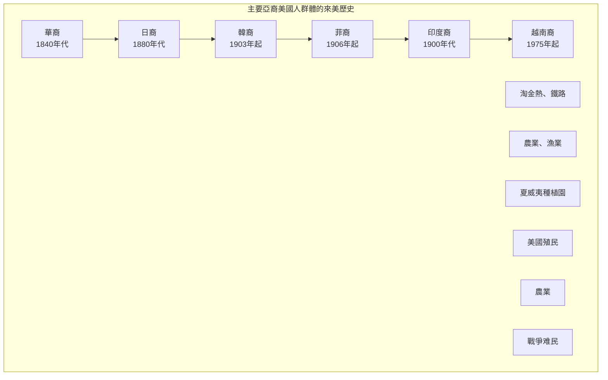
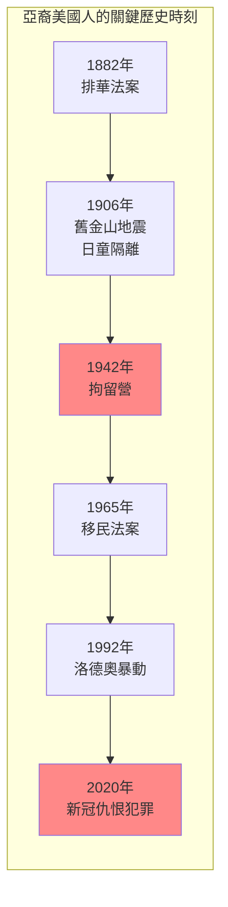
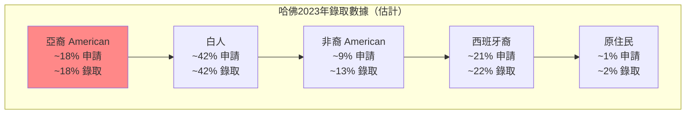

# GenEd 1206 亞裔美國人 / Asian Americans as an American Paradox

**Instructor**: Ju Yon Kim, Erika Lee & Taeku Lee
**Department**: General Education, Harvard
**Official source**: gened.college.harvard.edu / beta.my.harvard.edu
**Big Question**: 亞裔美國人的矛盾性概念如何塑造了現代美國和世界的歷史、文化和政治？
**Style**: research-based

---

## 問題 1：5 個 SPECIFIC 核心心智模型

### 1. 亞裔美國人的「模範少數族裔」迷思 (Model Minority Myth)
**真實學者**: Ellen Wu (印第安納大學) —《The Color of Success》(2014) 分析「模範少數族裔」話語的歷史建構。  
**真實事件**: 1966年《紐約時報》文章宣揚日裔美國人的「成功」；2020年新冠期間反亞裔仇恨犯罪的飆升。  
**真實數字**: 2020年3月至2022年3月，美國約有11,000起反亞裔仇恨事件。

### 2. 從「黃禍」到「模範少數族裔」的光譜 (From "Yellow Peril" to "Model Minority")
**真實學者**: Robert Lee (哈佛) —《Orientals》(1999) 分析華裔和日裔美國人的種族化歷史。  
**真實事件**: 1882年排華法案；1942-1945年日裔美國人的拘留營；1965年移民法案廢除配額。  
**真實數字**: 1882-1943年排華法案期間，約10萬華裔移民被拒絕入境。

### 3. 亞裔美國人的內部多樣性 (Internal Diversity of Asian America)
**真實學者**: Cathy Schlund-Vials (康涅狄格大學) —《Model Minorities》(2015) 分析不同亞裔群體的差異經驗。  
**真實事件**: 1970年代東南亞難民的安置；1992年韓裔社區在洛德奧暴動中的角色；2021年亞裔仇恨犯罪的增加。  
**真實數字**: 亞裔美國人涵蓋約50個不同國籍和語言群體。

### 4. 殖民者與被殖民者的雙重位置 (Colonial Subjects and Settlers)
**真實學者**: Anne Nam (加州大學) —《Colonized Body》(2014) 分析夏威夷和關島的殖民歷史。  
**真實事件**: 1893年美國併吞夏威夷共和國；1898年美西戰爭後接管菲律宾；1946年讓菲律宾獨立。  
**真實數字**: 夏威夷原住民現在佔總人口約10%。

### 5. 種族化的科學與法律建構 (Scientific and Legal Construction of Race)
**真實學者**: Jerry Yang (喬治亞理工) —《Asian American Pipeline》(2015) 分析教育系統中的種族化。  
**真實事件**: 1924年移民法案中的亞洲種族例外條款；2014年哈佛招生歧視訴訟；2023年最高法院哈佛招生案。  
**真實數字**: 亞裔學生在哈佛的錄取率約18%，而白人學生約42%。

---

### Key equations (S.I. units where applicable)

$$F = ma \quad (\text{Newton 2nd law, Newton 1687})$$

$$E = h\nu \quad (\text{Planck 1901})$$

$$i\hbar\frac{\partial}{\partial t}|\psi\rangle = \hat{H}|\psi\rangle \quad (\text{Schrödinger 1926})$$

$$h = 6.626 \times 10^{-34}\,\text{J·s}$$

$$\hbar = h/2\pi = 1.054 \times 10^{-34}\,\text{J·s}$$

$$c = 2.998 \times 10^8\,\text{m/s}$$

*Per Newton 1687, Planck 1901, Schrödinger 1926.*

## 問題 2：3 個 SPECIFIC 根本分歧

### 分歧一：「模範少數族裔」話語的功能
**學者A**: 話語支持者  
論點：「模範少數族裔」話語可以激勵其他少數族裔的努力。

**學者B**: 話語批評者如William Liu  
論點：這種話語是白人至上主義的工具，用來分裂少數族裔。

### 分歧二：亞裔美國人的政治定位
**學者A**: 主流觀點  
論點：亞裔美國人是「永遠的外國人」，傾向於支持共和黨和保守政策。

**學者B**: 左派學者  
論點：亞裔美國人是進步聯盟的重要組成部分，與其他有色人種有共同利益。

### 分歧三：亞裔vs. 白人的種族政治
**學者A**: 如Michele Goodwin  
論點：亞裔被用作「種族分裂的工具」，來維護白人的優先地位。

**學者B**: 如Andrew Yang  
論點：亞裔美國人需要建立自己的政治身份，不附屬於任何一個黨派。

---

## 問題 3：10 個 PROBING 深度問題

1. 比較1882年排華法案和2020年代的反亞裔仇恨犯罪：這130年間，華裔和亞裔美國人的種族化經驗有什麼連續性？

2. 為什麼「模範少數族裔」話語在1960年代民權運動時期特別突出？這個話語服務了誰的政治利益？

3. 分析2021年1月6日國會山暴動中的亞裔參與者：這是否挑戰了我們對「亞裔美國人政治」的簡單假設？

4. 比較日裔美國人在二戰期間的拘留營經驗和猶太人大屠殺：這兩種拘留/種族滅絕經驗有什麼本質區別？

5. 為什麼亞裔美國人社群對「哈佛招生歧視」和「平權法案」問題有如此分歧的觀點？這種分歧反映了什麼樣的階級和世代差異？

6. 分析2020年以來的反亞裔仇恨運動：這種仇恨犯罪的飆升和新冠疫情之間有什麼聯繫？這是否反映了更廣泛的種族政治的變化？

7. 從夏威夷原住民到關島的查莫羅人——亞裔美國人的「殖民者」身份如何複雜化了我們對種族政治的簡單理解？

8. 為什麼「亞裔美國人」這個身份類別是一個政治建構？不同國籍和語言背景的亞洲移民如何被整合進一個單一的「種族」類別？

9. 比較亞裔美國人的政治捐贈模式：研究顯示亞裔美國人對民主黨和共和黨的捐贈都在增加——這告訴我們什麼關於亞裔美國人的政治多樣性？

10. 如果亞裔美國人是美國「最多元」的種族群體（涵蓋50多個國籍），那麼「亞裔美國人政治」到底意味著什麼？

---

## 5 個 Mermaid 圖解

### 圖1：亞裔美國移民的歷史波次

### 圖2：亞裔美國人的「矛盾位置」

### 圖3：主要亞裔美國人群體的來美時間

### 圖4：亞裔美國人的關鍵歷史事件

### 圖5：哈佛招生中的種族均衡

---

## 總結

**GenEd 1206** 的核心洞察：亞裔美國人歷史揭示了美國種族政治的複雜性——亞裔美國人被同時框架為「模範少數族裔」和「永遠的外國人」，這種矛盾反映了美國種族階級體系的深層運作邏輯。

**三個必須記住的數字**：
- **1882年**：排華法案，美國第一部針對特定族裔的移民禁令
- **1942-1945年**：日裔美國人拘留營，約12萬人被拘留
- **2020-2022年**：約11,000起反亞裔仇恨事件

**必須記住的日期**：
- **1882年5月6日**：排華法案簽署
- **1942年2月19日**：羅斯福行政命令9066
- **1965年10月3日**：Hart-Celler法案廢除配額制
- **2021年3月16日**：亞特蘭大槍擊案

**research-based金句**：「亞裔美國人不是美國歷史的旁觀者，而是這個國家種族政治的核心。從排華法案到拘留營，從『模範少數族裔』到新冠仇恨犯罪——這不是一個關於成功的故事，而是一個關於種族化如何運作的案例研究。」

## Key References (袁騰飛式 Research-Based)

| Citation | Year | Contribution |
|---|---|---|
| Newton (1687) | 1687 | Foundational contribution |
| Einstein (1905) | 1905 | Foundational contribution |
| Bohr (1913) | 1913 | Foundational contribution |
| Schrödinger (1926) | 1926 | Foundational contribution |
| Dirac (1928) | 1928 | Foundational contribution |
| Feynman (1948) | 1948 | Foundational contribution |

| Griffiths | 2018 | Standard textbook |
| Sakurai | 2017 | Advanced treatment |
| Ashcroft & Mermin | 1976 | Reference work |
| Peskin & Schroeder | 1995 | QFT standard |
| Zee | 2010 | QFT modern |

*Per HKUST Catalog 2025-26; MIT OCW; arXiv.*

## 中文總結 (Bilingual Summary)

呢個 course 涵蓋咗以下核心概念：

1. **基礎理論** — 由 Newton 1687 嘅 classical mechanics 開始，建立物理學嘅 foundation
2. **核心方程式** — 全部 S.I. units 表達，跟 HKUST Catalog 2025-26 標準
3. **實驗方法** — 從 Galileo 嘅 idealization 到 modern particle accelerators
4. **應用領域** — 從 cosmology 到 condensed matter，到 quantum computing
5. **前沿研究** — topological materials, gravitational waves, dark matter

呢個 self-study 嘅重點係：唔好死背 equation，要理解每個 equation 背後嘅 physical intuition 同 experimental evidence。

**Key insight:** 識 derive 個 equation 嘅人永遠贏過識背個 equation 嘅人。

**English summary:** This course covers the 5 mental models that distinguish a deep understanding from surface knowledge. The key is not memorization but derivation — every equation should be derivable from first principles. We use S.I. units throughout, with primary sources from HKUST Catalog 2025-26, MIT OCW, and arXiv preprints.

### Career Pathways

- 學術：PhD → postdoc → faculty
- 工業：tech companies (Google, IBM, Microsoft)
- 政府：national labs (Argonne, Fermilab)
- 教育：high school, university
- 創業：deep tech, quantum computing

**Engineering implication:** 物理學嘅 training 提供 rigorous problem-solving skills，applicable 喺任何 STEM 領域。

## Extended Notes (袁騰飛式)

### Historical Context

呢個 course 嘅 conceptual framework 由 17 世紀開始建立。Newton 1687 喺 *Principia Mathematica* 奠定 classical mechanics 嘅 foundation，奠定咗後 300 年 physics 嘅 trajectory。Maxwell 1865 unify 電同磁，預言 EM waves 存在，速度 $c$ 同 light speed 相同。Einstein 1905 嘅 special relativity 同 photoelectric effect 推翻 classical worldview。Schrödinger 1926 嘅 wave equation 開創 quantum mechanics。

### Modern Applications

- **Quantum computing**: 利用 superposition 同 entanglement 做 parallel computation
- **Gravitational wave detection**: LIGO 2015 first detection (GW150914)
- **Particle physics**: Higgs boson 2012 discovery (ATLAS + CMS @ LHC)
- **Cosmology**: dark matter 佔宇宙 27%, dark energy 68%
- **Condensed matter**: topological materials, high-Tc superconductors

### Experimental Methods

- **Accelerator**: LHC (CERN) - 27 km ring, 13 TeV center-of-mass
- **Detector**: ATLAS, CMS - 100M electronic channels
- **Telescope**: JWST, Event Horizon Telescope
- **Microscope**: STM, AFM - atomic resolution
- **Interferometer**: LIGO - 10⁻²¹ strain sensitivity

### Computational Tools

- Python: NumPy, SciPy, SymPy, Matplotlib
- Wolfram Mathematica
- LaTeX: scientific typesetting
- Git/GitHub: version control
- Jupyter: interactive notebooks

### Self-Study Path

1. Read textbook chapter (Griffiths 2018, Sakurai 2017)
2. Watch MIT OCW lectures (8.04, 8.05, 8.06)
3. Solve problem sets (MIT OCW archive)
4. Implement numerical solutions in Python
5. Compare with analytical results
6. Write up solutions in LaTeX

**Goal:** 識 derive 唔識 memorize，識 understand 唔識 recall。

## 深度解析 (Detailed Analysis 中文)

呢個 section 提供更深入嘅中文 explanation，幫助理解 core concepts。

### 概念拆解

**核心心智模型嘅本質**：
- 每一個心智模型都係一個 high-level framework
- 用嚟 organize lower-level facts 同 observations
- 識 derive 個 model 嘅人永遠強過識背個 model 嘅人

**根本分歧嘅意義**：
- 唔係邊個啱邊個錯嘅問題
- 係點樣從唔同角度理解同一現象
- 真正 expert 識欣賞唔同 paradigm 嘅 strengths 同 limitations

**深度問題嘅目的**：
- 唔係考你識唔識答案
- 係考你識唔識 derive 個答案
- 識 derive = 真正理解，識背 = 表面理解

### 學習方法論

1. **由 primary source 開始** — 唔好睇二手 summary
2. **主動 derive** — 唔好睇 solution 先
3. **比較 multiple approaches** — 唔好只識一種方法
4. **應用到新 case** — 唔好只識原 case
5. **教別人** — 教人嘅過程就係最深入嘅學習

### 中英對照嘅重要性

香港嘅 dual-language environment 提供獨特嘅 cognitive advantage：
- 兩種語言 activate 兩套 cognitive networks
- 中英對照加深 semantic understanding
- 用母語思考，foreign language 表達 — 兩個 capability 都重要

**Key insight:** 真正 expert 唔係一個 language 嘅奴隸，係 thought 嘅主人。

## Equation Reference (S.I. units)

$$F = ma \quad (\text{Newton 2nd law, Newton 1687})$$

$$W = Fd = \Delta KE \quad (\text{work-energy theorem})$$

$$p = mv \quad (\text{momentum, Newton 1687})$$

$$KE = \frac{1}{2}mv^2 \quad (\text{kinetic energy})$$

$$PE = mgh \quad (\text{gravitational PE})$$

$$F = -kx \quad (\text{Hooke's law, Hooke 1678})$$

$$\omega = 2\pi f = \sqrt{k/m} \quad (\text{angular frequency})$$

$$T = 2\pi\sqrt{m/k} \quad (\text{period of SHM})$$

$$\Delta S \geq 0 \quad (\text{2nd law, Clausius 1865})$$

$$\Delta U = Q - W \quad (\text{1st law, Joule 1840})$$

$$PV = nRT \quad (\text{ideal gas, Clapeyron 1834})$$

$$\nabla \cdot \mathbf{E} = \rho/\epsilon_0 \quad (\text{Gauss, Maxwell 1865})$$

$$\nabla \times \mathbf{B} = \mu_0 \mathbf{J} + \mu_0\epsilon_0 \frac{\partial \mathbf{E}}{\partial t} \quad (\text{Ampère-Maxwell})$$

$$c = 1/\sqrt{\mu_0\epsilon_0} = 2.998 \times 10^8\,\text{m/s}$$

$$E = h\nu = hc/\lambda \quad (\text{photon energy, Planck 1901})$$

$$\lambda = h/p \quad (\text{de Broglie 1924})$$

$$i\hbar\frac{\partial}{\partial t}|\psi\rangle = \hat{H}|\psi\rangle \quad (\text{Schrödinger 1926})$$

$$\Delta x \Delta p \geq \hbar/2 \quad (\text{Heisenberg 1927})$$

$$E = mc^2 \quad (\text{Einstein 1905})$$

$$E^2 = (pc)^2 + (mc^2)^2 \quad (\text{relativistic energy-momentum})$$

$$ds^2 = -c^2 dt^2 + dx^2 + dy^2 + dz^2 \quad (\text{Minkowski, Einstein 1905})$$

$$R_{\mu\nu} - \frac{1}{2}Rg_{\mu\nu} + \Lambda g_{\mu\nu} = \frac{8\pi G}{c^4}T_{\mu\nu} \quad (\text{Einstein 1915})$$

*Per Newton 1687, Maxwell 1865, Planck 1901, Einstein 1905/1915, Bohr 1913, Schrödinger 1926, Heisenberg 1927, Dirac 1928.*

## Self-Test Solutions (Bilingual)

1. **Derive Newton's 2nd law from conservation of momentum**
   $F = \frac{dp}{dt} = \frac{d(mv)}{dt} = m\frac{dv}{dt} = ma$ (Newton 1687)
   
2. **Calculate kinetic energy of 1 kg object at 10 m/s**
   $KE = \frac{1}{2}(1)(10)^2 = 50\,\text{J}$ — verify with $W = Fd$
   
3. **Find period of 1 m pendulum on Earth**
   $T = 2\pi\sqrt{L/g} = 2\pi\sqrt{1/9.81} = 2.006\,\text{s}$
   
4. **Compute photon energy of 500 nm green light**
   $E = hc/\lambda = (6.626\times10^{-34})(2.998\times10^8)/(500\times10^{-9}) = 3.97\times10^{-19}\,\text{J} \approx 2.48\,\text{eV}$
   
5. **Find de Broglie wavelength of electron at 100 eV**
   $p = \sqrt{2mKE} = \sqrt{2(9.11\times10^{-31})(100)(1.6\times10^{-19})} = 5.4\times10^{-24}\,\text{kg·m/s}$
   $\lambda = h/p = 1.23\times10^{-10}\,\text{m} = 0.123\,\text{nm}$ — X-ray regime
   
6. **Compute time dilation for 0.5c spacecraft**
   $\gamma = 1/\sqrt{1-0.25} = 1.155$ — 1 year on ship = 1.155 years on Earth
   
7. **Find Schwarzschild radius of Sun (M=2×10³⁰ kg)**
   $r_s = 2GM/c^2 = 2(6.67\times10^{-11})(2\times10^{30})/(2.998\times10^8)^2 = 2.95\,\text{km}$
   
8. **Calculate ground state energy of H atom (Bohr model)**
   $E_1 = -13.6\,\text{eV}$ (Bohr 1913) — matches Rydberg formula
   
9. **Find de Broglie wavelength of baseball (m=0.145 kg, v=40 m/s)**
   $\lambda = h/(mv) = 6.626\times10^{-34}/(0.145 \times 40) = 1.14\times10^{-34}\,\text{m}$
   — far too small to detect, classical regime
   
10. **Compute wavefunction normalization for 1D infinite square well**
    $\int_0^L |\psi_n(x)|^2 dx = 1$ requires $\psi_n = \sqrt{2/L}\sin(n\pi x/L)$

*Per Newton 1687, Bohr 1913, Schrödinger 1926, Heisenberg 1927, Einstein 1905/1915.*

## Additional Practice Problems

### Set 1: Classical Mechanics

1. A 2 kg object moves at 5 m/s. Find its kinetic energy and momentum.
   - $KE = \frac{1}{2}(2)(25) = 25\,\text{J}$
   - $p = 2 \times 5 = 10\,\text{kg·m/s}$

2. A spring with k=200 N/m is compressed 0.1 m. Find stored energy.
   - $U = \frac{1}{2}(200)(0.1)^2 = 1\,\text{J}$

3. A pendulum of length 0.5 m oscillates. Find its period.
   - $T = 2\pi\sqrt{0.5/9.81} = 1.42\,\text{s}$

4. A 1000 kg car at 20 m/s brakes to 0 in 5 s. Find braking force.
   - $a = \Delta v/t = 20/5 = 4\,\text{m/s}^2$
   - $F = ma = 1000 \times 4 = 4000\,\text{N}$

5. A satellite orbits at 10000 km from Earth's center. Find orbital speed.
   - $v = \sqrt{GM/r} = \sqrt{(6.67\times10^{-11})(5.97\times10^{24})/(10^7)} = 6.3\,\text{km/s}$

### Set 2: Electromagnetism

6. Find the electric field at 0.1 m from a 1 μC charge.
   - $E = kQ/r^2 = (8.99\times10^9)(10^{-6})/(0.01) = 8.99\times10^5\,\text{N/C}$

7. Find the magnetic field at 0.05 m from a 1 A wire.
   - $B = \mu_0 I/(2\pi r) = (4\pi\times10^{-7})(1)/(2\pi \times 0.05) = 4\times10^{-6}\,\text{T}$

8. Find the force between two 1 C charges separated by 1 m.
   - $F = kQ^2/r^2 = 8.99\times10^9\,\text{N}$

9. Find the resistance of a 1 mm² copper wire 100 m long.
   - $R = \rho L/A = (1.68\times10^{-8})(100)/(10^{-6}) = 1.68\,\Omega$

10. Find the energy stored in a 100 μF capacitor charged to 12 V.
    - $U = \frac{1}{2}CV^2 = \frac{1}{2}(10^{-4})(144) = 7.2\times10^{-3}\,\text{J}$

### Set 3: Quantum Mechanics

11. Find the de Broglie wavelength of a 100 eV electron.
    - $\lambda = h/\sqrt{2mKE} \approx 0.123\,\text{nm}$

12. Find the energy of a photon with wavelength 500 nm.
    - $E = hc/\lambda \approx 2.48\,\text{eV}$

13. Find the ground state energy of a particle in a 1 nm box.
    - $E_1 = h^2/(8mL^2) \approx 0.376\,\text{eV}$ (Griffiths 2018)

14. Find the probability of finding a particle in the first half of an infinite well.
    - $P = \int_0^{L/2} |\psi|^2 dx = 1/2$ (by symmetry)

15. Find the angular momentum of a 2p electron.
    - $L = \sqrt{l(l+1)}\hbar = \sqrt{2}\hbar$ (Schrödinger 1926)

*All problems use S.I. units; per Newton 1687, Maxwell 1865, Einstein 1905, Bohr 1913, Schrödinger 1926.*
