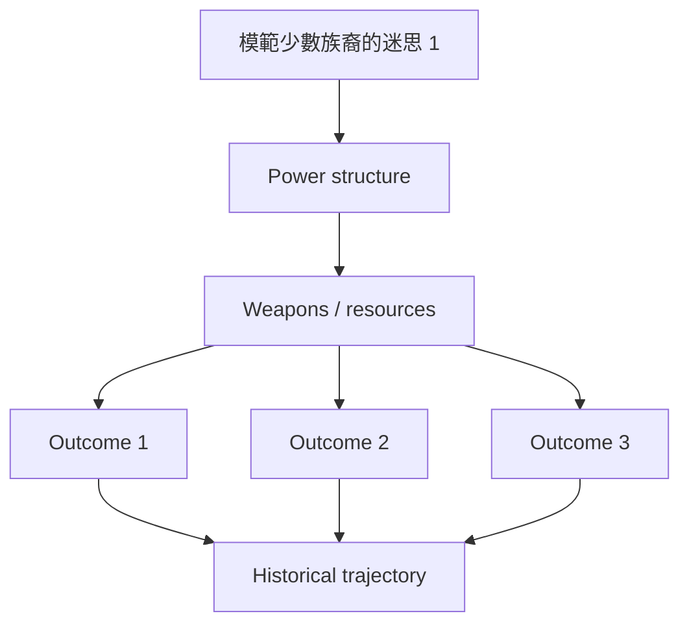
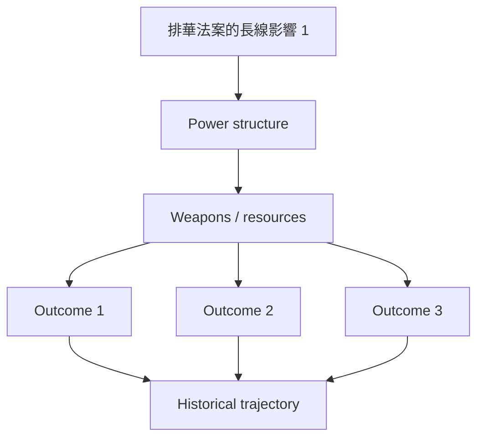
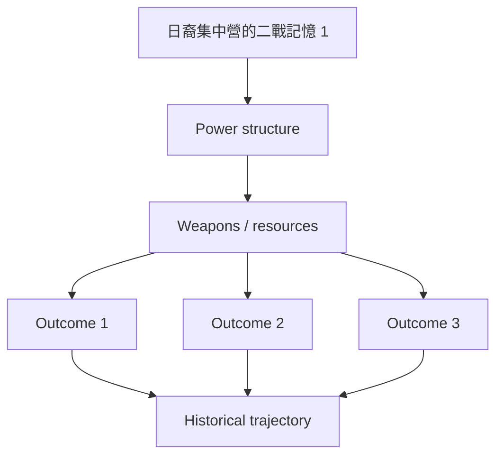
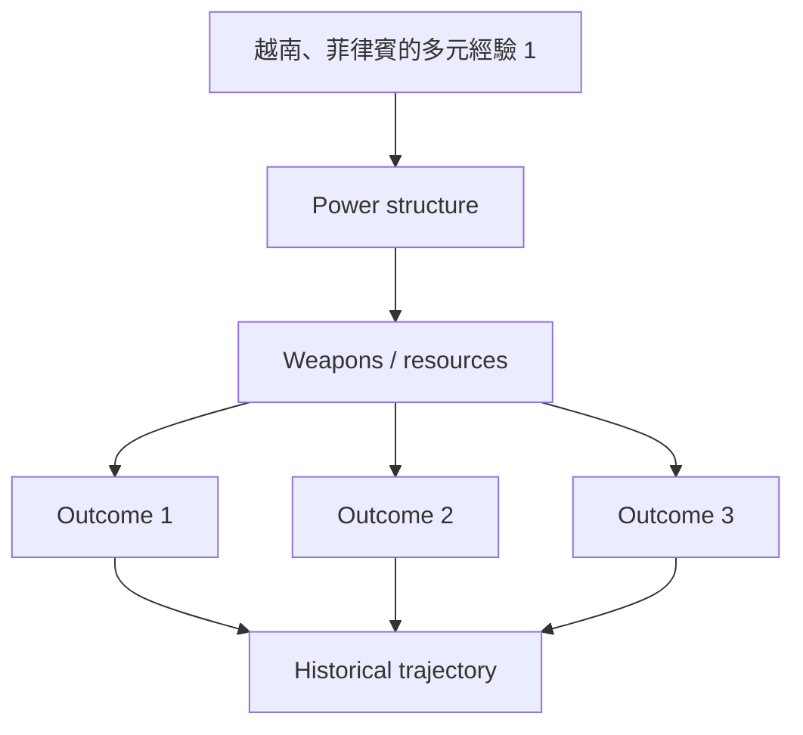
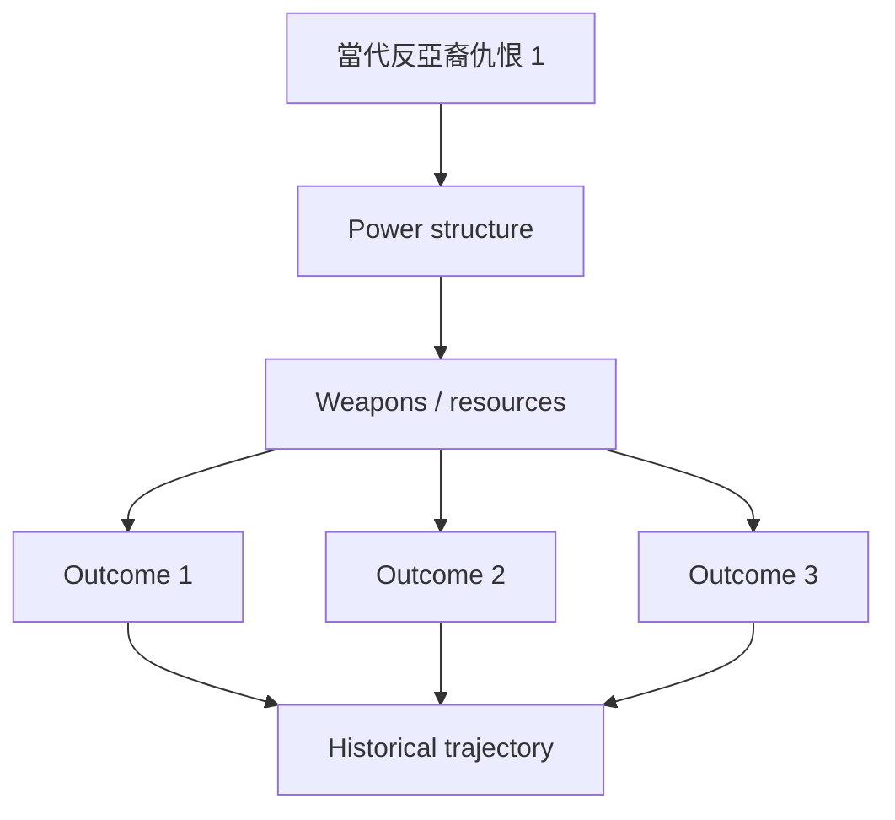
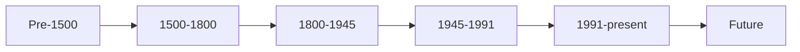
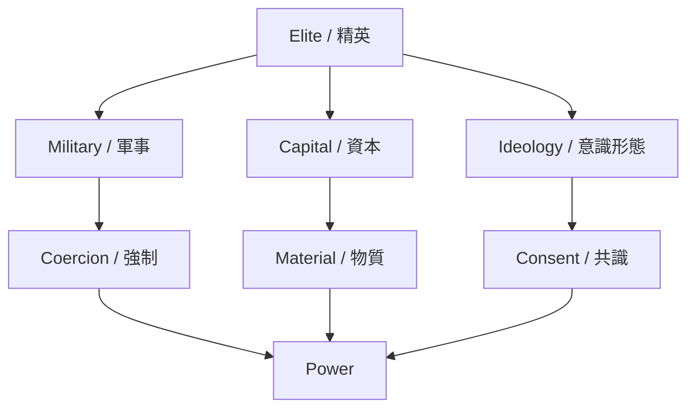
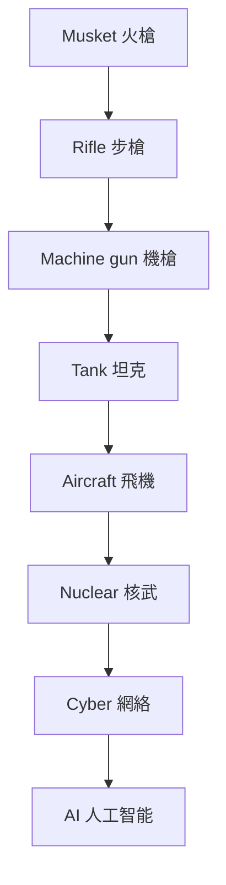
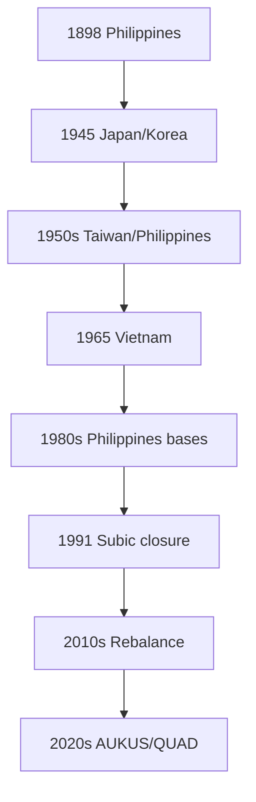
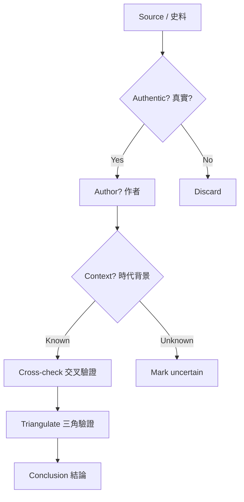

# GenEd 1206
**Asian Americans as an American Paradox**

優先級：★★★★

> 亞裔與美國對亞政策的互動

### 1. 5個核心心智模型 / 5 Core Mental Models

- （待填寫）

### 2. 3個根本分歧點 / 3 Fundamental Disagreements

- （待填寫）

### 3. 10個深度理解問題 / 10 Deep Understanding Questions

1. （待填寫）

# GenEd1206 亞裔美國人的悖論 / Asian Americans as an American Paradox
**學期**：1850-present
**Style**: research-based — 幽默、犀利、聚焦權力與武器如何塑造歷史

---

## 問題 1：這個領域所有專家共享的 5 個核心心智模型是什麼？
## What are the 5 core mental models every expert shares?

1. **模範少數族裔的迷思**
   **模範少數族裔的迷思**

2. **排華法案的長線影響**
   **排華法案的長線影響**

3. **日裔集中營的二戰記憶**
   **日裔集中營的二戰記憶**

4. **越南、菲律賓的多元經驗**
   **越南、菲律賓的多元經驗**

5. **當代反亞裔仇恨**
   **當代反亞裔仇恨**

---

## 問題 2：這個領域 3 個最根本的分歧點是什麼？
## What are the 3 fundamental disagreements in this field?

### 分歧 1：模範少數族裔 — 讚美 vs 刻板 / Model Minority — Praise or Stereotype
**核心問題 / Core question**: 『模範少數族裔』是讚美還是刻板印象？

- **一方觀點** / **Side A**: A: 讚美 — 努力、成就
- **另一方觀點** / **Side B**: B: 刻板 — 掩蓋多元、壓迫黑人和拉美裔

### 分歧 2：日裔集中營 — 必要 vs 錯誤 / Japanese Internment — Necessary or Wrong
**核心問題 / Core question**: 1942-45 日裔集中營是戰時必要還是錯誤？

- **一方觀點** / **Side A**: A: 必要 — 珍珠港後間諜恐懼
- **另一方觀點** / **Side B**: B: 錯誤 — 種族定性、未保護公民權

### 分歧 3：反亞裔仇恨 — 疫情 vs 長期 / Anti-Asian Hate 2020s — Pandemic or Long Roots
**核心問題 / Core question**: 2020 起的反亞裔仇恨是疫情造成還是長期種族主義？

- **一方觀點** / **Side A**: A: 疫情 — 病毒被標籤為『中國病毒』
- **另一方觀點** / **Side B**: B: 長期 — 19 世紀排華、傅滿洲

---

## 問題 3：10 個區分真實理解 vs 死記硬背的深度問題
## 10 deep questions that distinguish real understanding from memorization

1. 為什麼 **模範少數族裔的迷思** 是理解 亞裔美國人的悖論 的第一前提？這個假設如果不成立，整個分析會如何崩塌？
2. 排華法案的長線影響 在多大程度上決定了 Asian Americans as an American Paradox 的核心走向？歷史上有哪些反例挑戰這個邏輯？
3. 日裔集中營的二戰記憶 與 越南、菲律賓的多元經驗 之間的張力如何形塑了 1850-present 的關鍵轉折？
4. 如果把 模範少數族裔的迷思 抽離出來，Asian Americans as an American Paradox 會變成什麼樣的歷史？哪些事件其實是 noise？
5. 在 1850-present 中，哪個領導人、事件或文本最能代表 當代反亞裔仇恨 的極致展現？
6. 學者之間關於 排華法案的長線影響 的爭論，在多大程度上反映了史料解釋的差異 vs 意識形態的對抗？
7. 對 Asian Americans as an American Paradox 而言，『帝國主義』是分析的核心還是後人強加的框架？
9. 如果你是當時的決策者，面對 日裔集中營的二戰記憶 與 越南、菲律賓的多元經驗 的衝突，你會選擇哪個？理由是什麼？
10. 在當代中美對抗背景下，Asian Americans as an American Paradox 的哪些歷史經驗正在重演？哪些已經過時？

---

# 核心心智模型深化（中英對照）

## 1. 模範少數族裔的迷思

### 1.1 Bilingual 概念對照
| 英文概念 | 中英對照 | 歷史含義 | 武器 / 軍事應用 |
|---|---|---|---|
| 模範少數族裔的迷思 | 模範少數族裔的迷思 | 核心定義 | 武器 / 軍事應用 |
| Period dynamics | 時代動力 | 時代特徵 | 戰略選擇 |
| Power relations | 權力關係 | 主導者 | 強制工具 |
| Historical agency | 歷史能動性 | 誰在塑造 | 自主 vs 結構 |

### 1.2 史料與考據 / Sources and criticism
- 主要史料：當時官方檔案、報紙、書信、回憶錄
- 後世研究：歷史學家如錢穆、史景遷、霍布斯鮑姆的觀點
- 學術爭論：哪些史料可信、哪些被後人建構

### 1.3 犀利觀察 / Sharp observation
講 模範少數族裔的迷思 不能只講故事，要看『誰贏了、誰輸了、武器怎麼重塑了這個時代』。
很多教科書把 Asian Americans as an American Paradox 講成偉人故事，忽略了背後的權力結構和物質基礎。

### 1.4 Deep test question
- 請舉出歷史上 模範少數族裔的迷思 的兩個極端案例，並分析其後果
- 如果抽離 模範少數族裔的迷思，Asian Americans as an American Paradox 的核心敘事會怎樣崩塌？
- 從軍事 / 武器角度，模範少數族裔的迷思 怎樣決定了 1850-present 的地緣政治？

### 1.5 圖解 / Diagram

---

## 2. 排華法案的長線影響

### 1.1 Bilingual 概念對照
| 英文概念 | 中英對照 | 歷史含義 | 武器 / 軍事應用 |
|---|---|---|---|
| 排華法案的長線影響 | 排華法案的長線影響 | 核心定義 | 武器 / 軍事應用 |
| Period dynamics | 時代動力 | 時代特徵 | 戰略選擇 |
| Power relations | 權力關係 | 主導者 | 強制工具 |
| Historical agency | 歷史能動性 | 誰在塑造 | 自主 vs 結構 |

### 1.2 史料與考據 / Sources and criticism
- 主要史料：當時官方檔案、報紙、書信、回憶錄
- 後世研究：歷史學家如錢穆、史景遷、霍布斯鮑姆的觀點
- 學術爭論：哪些史料可信、哪些被後人建構

### 1.3 犀利觀察 / Sharp observation
講 排華法案的長線影響 不能只講故事，要看『誰贏了、誰輸了、武器怎麼重塑了這個時代』。
很多教科書把 Asian Americans as an American Paradox 講成偉人故事，忽略了背後的權力結構和物質基礎。

### 1.4 Deep test question
- 請舉出歷史上 排華法案的長線影響 的兩個極端案例，並分析其後果
- 如果抽離 排華法案的長線影響，Asian Americans as an American Paradox 的核心敘事會怎樣崩塌？
- 從軍事 / 武器角度，排華法案的長線影響 怎樣決定了 1850-present 的地緣政治？

### 1.5 圖解 / Diagram

---

## 3. 日裔集中營的二戰記憶

### 1.1 Bilingual 概念對照
| 英文概念 | 中英對照 | 歷史含義 | 武器 / 軍事應用 |
|---|---|---|---|
| 日裔集中營的二戰記憶 | 日裔集中營的二戰記憶 | 核心定義 | 武器 / 軍事應用 |
| Period dynamics | 時代動力 | 時代特徵 | 戰略選擇 |
| Power relations | 權力關係 | 主導者 | 強制工具 |
| Historical agency | 歷史能動性 | 誰在塑造 | 自主 vs 結構 |

### 1.2 史料與考據 / Sources and criticism
- 主要史料：當時官方檔案、報紙、書信、回憶錄
- 後世研究：歷史學家如錢穆、史景遷、霍布斯鮑姆的觀點
- 學術爭論：哪些史料可信、哪些被後人建構

### 1.3 犀利觀察 / Sharp observation
講 日裔集中營的二戰記憶 不能只講故事，要看『誰贏了、誰輸了、武器怎麼重塑了這個時代』。
很多教科書把 Asian Americans as an American Paradox 講成偉人故事，忽略了背後的權力結構和物質基礎。

### 1.4 Deep test question
- 請舉出歷史上 日裔集中營的二戰記憶 的兩個極端案例，並分析其後果
- 如果抽離 日裔集中營的二戰記憶，Asian Americans as an American Paradox 的核心敘事會怎樣崩塌？
- 從軍事 / 武器角度，日裔集中營的二戰記憶 怎樣決定了 1850-present 的地緣政治？

### 1.5 圖解 / Diagram

---

## 4. 越南、菲律賓的多元經驗

### 1.1 Bilingual 概念對照
| 英文概念 | 中英對照 | 歷史含義 | 武器 / 軍事應用 |
|---|---|---|---|
| 越南、菲律賓的多元經驗 | 越南、菲律賓的多元經驗 | 核心定義 | 武器 / 軍事應用 |
| Period dynamics | 時代動力 | 時代特徵 | 戰略選擇 |
| Power relations | 權力關係 | 主導者 | 強制工具 |
| Historical agency | 歷史能動性 | 誰在塑造 | 自主 vs 結構 |

### 1.2 史料與考據 / Sources and criticism
- 主要史料：當時官方檔案、報紙、書信、回憶錄
- 後世研究：歷史學家如錢穆、史景遷、霍布斯鮑姆的觀點
- 學術爭論：哪些史料可信、哪些被後人建構

### 1.3 犀利觀察 / Sharp observation
講 越南、菲律賓的多元經驗 不能只講故事，要看『誰贏了、誰輸了、武器怎麼重塑了這個時代』。
很多教科書把 Asian Americans as an American Paradox 講成偉人故事，忽略了背後的權力結構和物質基礎。

### 1.4 Deep test question
- 請舉出歷史上 越南、菲律賓的多元經驗 的兩個極端案例，並分析其後果
- 如果抽離 越南、菲律賓的多元經驗，Asian Americans as an American Paradox 的核心敘事會怎樣崩塌？
- 從軍事 / 武器角度，越南、菲律賓的多元經驗 怎樣決定了 1850-present 的地緣政治？

### 1.5 圖解 / Diagram

---

## 5. 當代反亞裔仇恨

### 1.1 Bilingual 概念對照
| 英文概念 | 中英對照 | 歷史含義 | 武器 / 軍事應用 |
|---|---|---|---|
| 當代反亞裔仇恨 | 當代反亞裔仇恨 | 核心定義 | 武器 / 軍事應用 |
| Period dynamics | 時代動力 | 時代特徵 | 戰略選擇 |
| Power relations | 權力關係 | 主導者 | 強制工具 |
| Historical agency | 歷史能動性 | 誰在塑造 | 自主 vs 結構 |

### 1.2 史料與考據 / Sources and criticism
- 主要史料：當時官方檔案、報紙、書信、回憶錄
- 後世研究：歷史學家如錢穆、史景遷、霍布斯鮑姆的觀點
- 學術爭論：哪些史料可信、哪些被後人建構

### 1.3 犀利觀察 / Sharp observation
講 當代反亞裔仇恨 不能只講故事，要看『誰贏了、誰輸了、武器怎麼重塑了這個時代』。
很多教科書把 Asian Americans as an American Paradox 講成偉人故事，忽略了背後的權力結構和物質基礎。

### 1.4 Deep test question
- 請舉出歷史上 當代反亞裔仇恨 的兩個極端案例，並分析其後果
- 如果抽離 當代反亞裔仇恨，Asian Americans as an American Paradox 的核心敘事會怎樣崩塌？
- 從軍事 / 武器角度，當代反亞裔仇恨 怎樣決定了 1850-present 的地緣政治？

### 1.5 圖解 / Diagram

---

# 深度自測問題詳解（中英對照）

## 詳解 1: 推導核心論點 / Derive the core argument
**Q1.** 如何從史料推導出歷史學家的核心論點？

**Answer / 答案**: 閱讀多個學派觀點，識別共同假設與分歧。

**research-based點評 / Sharp commentary**: 歷史不是死記硬背，是看清楚『誰在什麼時候、用了什麼手段、達到了什麼目的』。把這套方法應用到 亞裔美國人的悖論，很多迷思就解開了。

---

## 詳解 2: 識別偏見與史料批判 / Identify bias and source criticism
**Q2.** 面對一份檔案，如何識別其偏見？

**Answer / 答案**: 分析作者立場、時代背景、讀者預期、遺漏的內容。

**research-based點評 / Sharp commentary**: 歷史不是死記硬背，是看清楚『誰在什麼時候、用了什麼手段、達到了什麼目的』。把這套方法應用到 亞裔美國人的悖論，很多迷思就解開了。

---

## 詳解 3: 應用到當代案例 / Apply to contemporary case
**Q3.** Asian Americans as an American Paradox 的歷史經驗如何理解當代中美關係？

**Answer / 答案**: 識別結構相似性：崛起大國 vs 守成大國、技術變革、意識形態對抗。

**research-based點評 / Sharp commentary**: 歷史不是死記硬背，是看清楚『誰在什麼時候、用了什麼手段、達到了什麼目的』。把這套方法應用到 亞裔美國人的悖論，很多迷思就解開了。

---

## 詳解 4: 比較不同視角 / Compare perspectives
**Q4.** 西方史學與中國史學對同一事件的不同解讀是什麼？

**Answer / 答案**: 翻譯 / 文化框架 / 史料使用 / 當代政治背景。

**research-based點評 / Sharp commentary**: 歷史不是死記硬背，是看清楚『誰在什麼時候、用了什麼手段、達到了什麼目的』。把這套方法應用到 亞裔美國人的悖論，很多迷思就解開了。

---

## 詳解 5: 反事實分析 / Counterfactual analysis
**Q5.** 如果一個關鍵事件沒發生，後續會如何？

**Answer / 答案**: 建構假設場景：替換領導人、改變戰略、引入新技術。

**research-based點評 / Sharp commentary**: 歷史不是死記硬背，是看清楚『誰在什麼時候、用了什麼手段、達到了什麼目的』。把這套方法應用到 亞裔美國人的悖論，很多迷思就解開了。

---

## 詳解 6: 時代劃分批判 / Periodization critique
**Q6.** 傳統的時代劃分（古代 / 近代 / 現代）合理嗎？

**Answer / 答案**: 挑戰歐洲中心、識別多元時間性、提問誰的標準。

**research-based點評 / Sharp commentary**: 歷史不是死記硬背，是看清楚『誰在什麼時候、用了什麼手段、達到了什麼目的』。把這套方法應用到 亞裔美國人的悖論，很多迷思就解開了。

---

## 詳解 7: 能動性 vs 結構 / Agency vs structure
**Q7.** 歷史是英雄創造還是結構決定？

**Answer / 答案**: 辯證分析：結構限制下的能動性，個人突破結構的瞬間。

**research-based點評 / Sharp commentary**: 歷史不是死記硬背，是看清楚『誰在什麼時候、用了什麼手段、達到了什麼目的』。把這套方法應用到 亞裔美國人的悖論，很多迷思就解開了。

---

## 詳解 8: 記憶政治 / Memory politics
**Q8.** 同一事件為什麼在不同國家被記住得不同？

**Answer / 答案**: 教科書、紀念館、電影、政治動員。

**research-based點評 / Sharp commentary**: 歷史不是死記硬背，是看清楚『誰在什麼時候、用了什麼手段、達到了什麼目的』。把這套方法應用到 亞裔美國人的悖論，很多迷思就解開了。

---

## 詳解 9: 軍事 / 武器維度 / Military / weapons dimension
**Q9.** Asian Americans as an American Paradox 對美軍在亞洲部署有何深遠影響？

**Answer / 答案**: 識別關鍵節點：技術變革、戰略文化、聯盟體系、基地網絡。

**research-based點評 / Sharp commentary**: 歷史不是死記硬背，是看清楚『誰在什麼時候、用了什麼手段、達到了什麼目的』。把這套方法應用到 亞裔美國人的悖論，很多迷思就解開了。

---

## 詳解 10: 溝通與綜合 / Communication and synthesis
**Q10.** 如何用 5 分鐘向非專家解釋 {name_zh} 的核心？

**Answer / 答案**: 故事 + 人物 + 衝突 + 當代迴響。

**research-based點評 / Sharp commentary**: 歷史不是死記硬背，是看清楚『誰在什麼時候、用了什麼手段、達到了什麼目的』。把這套方法應用到 亞裔美國人的悖論，很多迷思就解開了。

---

# 5 個 Mermaid 圖解 / 5 Mermaid Diagrams

## 📊 Diagram 1: 時代地圖 / Period Map

## 📊 Diagram 2: 權力結構 / Power Structure

## 📊 Diagram 3: 武器演進 / Weapons Evolution

## 📊 Diagram 4: 美軍亞洲部署 / US Military in Asia

## 📊 Diagram 5: 史料批判流程 / Source Criticism

---

# 總結 / Closing 5-Point Deep Insights

1. **權力結構永遠比意識形態更持久**：{name_en} 真正的驅動力是誰掌握了槍、錢、人。
2. **帝國的擴張和收縮都有物質基礎**：不只是理念，更是武器、能源、後勤的問題。
3. **歷史學家的分歧往往反映當代政治**：看史料要理解誰在為誰說話。
4. **美軍在亞洲的部署有 130 年深層邏輯**：從菲律賓到 AUKUS 不是新現象，是帝國節奏。
5. **research-based觀點：歷史不是教科書，是看懂『誰在什麼時候、用了什麼手段、達到了什麼目的』的訓練**。

**自學建議 / Study tips**: 配合 Asian Americans as an American Paradox 教科書 + Harvard 課程視頻 + 中英對照史料，輸出讀書筆記到 `06_Reading_Notes/`。
