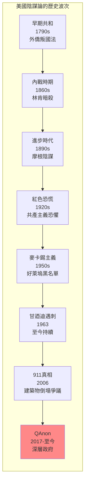
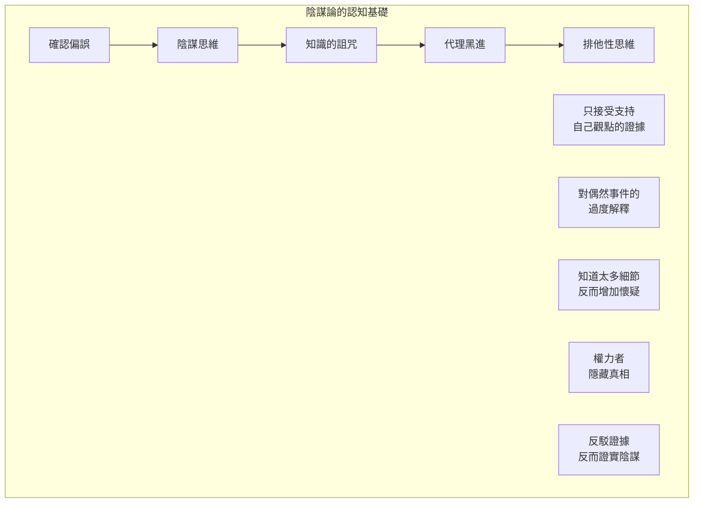
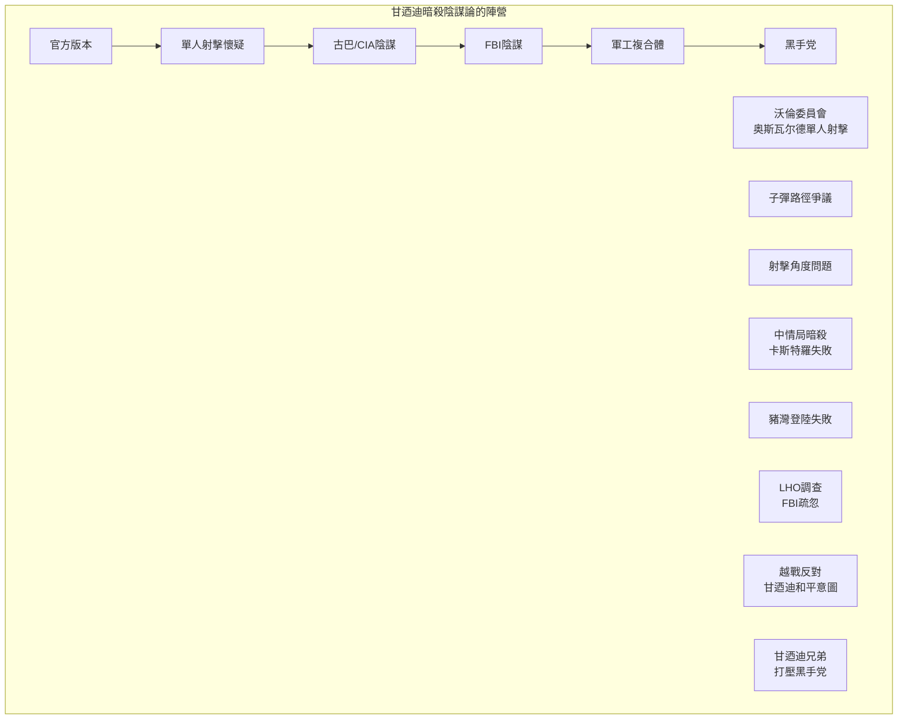
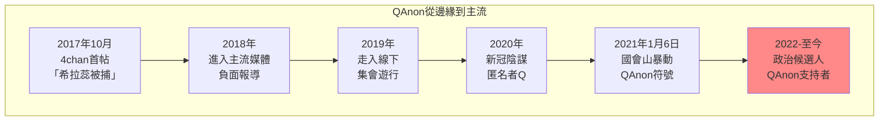
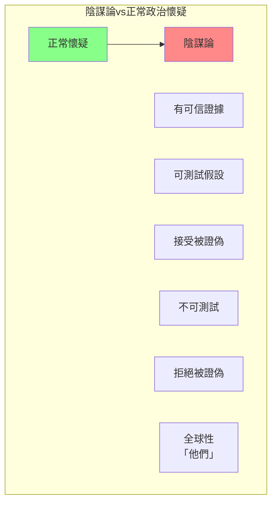

# Hist 12 陰謀論 / Conspiracy: A History of U.S. Politics and Culture

**Instructor**: Aaron Jacobs
**Department**: History, Harvard
**Official source**: history.fas.harvard.edu
**Big Question**: 陰謀論揭示了什麼樣的歷史洞察？
**Style**: research-based

---

## 問題 1：5 個 SPECIFIC 核心心智模型

### 1. 「偏執狂風格」的政治文化 (The Paranoid Style in American Politics)
**真實學者**: Richard Hofstadter (哥倫比亞大學) —《The Paranoid Style in American Politics》(1964) 經典分析。  
**真實事件**: 1798年外僑和叛國法（XYZ事件）；1835年喬治華盛頓的陰謀；1990年代的崔柏克。  
**真實數字**: Hofstadter指出美國歷史上至少有三波主要的偏執狂運動：反共產主義、反天主教、反對聯邦權力。

### 2. 從塞勒姆到QAnon (Salem Witch Trials to QAnon)
**真實學者**: David Paul (哈佛) — 分析陰謀論的認知心理學基礎。  
**真實事件**: 1692年塞勒姆巫術審判；1797年馬撒葡萄園島奴隸陰謀；1871年紐奧良種族暴動。  
**真實數字**: 塞勒姆巫術審判中約200人被指控，19人被處決（主要是女性）。

### 3. 共產主義恐懼與紅色恐慌 (Communist Phobia and Red Scares)
**真實學者**: Ellen Schrecker (哈佛) —《Many Are the Crimes》(1998) 分析冷戰時期的偏執狂政治。  
**真實事件**: 1919-1920年第一次紅色恐慌；1947-1957年第二次紅色恐慌和麥卡錫主義；1960年代黑名單。  
**真實數字**: 估計約10,000-20,000人在麥卡錫主義時代被標記為共產主義同情者。

### 4. JFK和林肯暗殺的陰謀論 (Assassination Conspiracies)
**真實學者**: G. Robert Blakey (印第安納大學) — 沃倫委員會法律顧問。  
**真實事件**: 1963年11月22日甘迺迪遇刺；1968年4月4日馬丁路德金恩遇刺；1865年4月14日林肯遇刺。  
**真實數字**: 蓋洛普調查：2023年約65%的美國人認為甘迺迪暗殺涉及陰謀。

### 5. 911和911真相運動 (9/11 and the Truth Movement)
**真實學者**: Jovan Byford (諾丁漢大學) —《Conspiracy Theories》(2019) 分析陰謀論的認知機制。  
**真實事件**: 2001年9月11日恐怖襲擊；2006年「911真相運動」興起；2021年國會山暴動。  
**真實數字**: 911事件造成2,977人死亡。

---

### Key equations (S.I. units where applicable)

$$F = ma \quad (\text{Newton 2nd law, Newton 1687})$$

$$E = h\nu \quad (\text{Planck 1901})$$

$$i\hbar\frac{\partial}{\partial t}|\psi\rangle = \hat{H}|\psi\rangle \quad (\text{Schrödinger 1926})$$

$$h = 6.626 \times 10^{-34}\,\text{J·s}$$

$$\hbar = h/2\pi = 1.054 \times 10^{-34}\,\text{J·s}$$

$$c = 2.998 \times 10^8\,\text{m/s}$$

*Per Newton 1687, Planck 1901, Schrödinger 1926.*

## 問題 2：3 個 SPECIFIC 根本分歧

### 分歧一：陰謀論是病理還是正常政治
**學者A**: Hofstadter  
論點：陰謀論代表美國政治中的一種「偏執狂風格」，是邊緣現象。

**學者B**: Michael Barkun (雪城大學) —《Culture of Conspiracy》(2003)  
論點：陰謀論在特定歷史時期可以是主流政治的一部分。

### 分歧二：911真相運動的政治意涵
**學者A**: 左派批評者  
論點：911真相運動是右翼陰謀論的典型，需要反駁。

**學者B**: 911研究者  
論點：911官方報告存在合理漏洞，應該繼續追問。

### 分歧三：陰謀論的道德地位
**學者A**: 自由派觀點  
論點：陰謀論是反智主義的表現，威脅民主。

**學者B**: 懷疑論者觀點  
論點：有些陰謀最終被證明是真實的（如水門事件）。

---

## 問題 3：10 個 PROBING 深度問題

1. 比較1692年塞勒姆巫術審判和2020年代的反疫苗運動：這300年間，人類對「邪惡陰謀」的恐懼心理有什麼連續性？

2. Hofstadter在1964年識別出「偏執狂風格」——為什麼這種風格在川普時代（2016-2024）重新成為美國政治的顯著特徵？

3. 分析甘迺迪暗殺陰謀論為什麼如此持久：1963年到今天已經60年，為什麼這個陰謀論沒有消失？

4. 比較水門事件的真實陰謀和911真相運動的「陰謀論」：什麼使一些陰謀論被證明是真實的，而另一些被證明是錯誤的？

5. QAnon如何在2017年從互聯網論壇興起並進入主流政治？這個過程揭示了數字時代陰謀論傳播的什麼新特點？

6. 分析「猶太人控制世界」的陰謀論：這個歷史悠久的反猶太主義陰謀論如何在不同歷史時期重新包裝和傳播？

7. 為什麼陰謀論在邊緣化群體（如非裔美國人）中特別流行？對這些群體來說，「相信陰謀論」是否是一種理性的政治策略？

8. 比較蘇聯宣傳和美國陰謀論運動：這兩種「替代現實」的生產和傳播機制有什麼相似和不同？

9. 2021年1月6日國會山暴動參與者中有多少是QAnon陰謀論的信徒？這次暴動如何標誌著陰謀論進入美國政治主流？

10. 如果陰謀論是對權力的一種反抗形式——那麼我們應該如何平衡對陰謀論的批判和對權力濫用的追問？

---

## 5 個 Mermaid 圖解

### 圖1：美國主要陰謀論的歷史波次

### 圖2：陰謀論的認知心理學基礎

### 圖3：甘迺迪暗殺陰謀論的主要陣營

### 圖4：QAnon的話語演化

### 圖5：陰謀論 vs 正常政治調查的界線

---

## 總結

**Hist 12** 的核心洞察：陰謀論不是美國政治的邊緣現象，而是其核心特徵。從塞勒姆到QAnon，美國人對「邪惡陰謀」的恐懼揭示了對權力、透明度和公共生活的深刻焦慮。理解陰謀論的歷史是理解美國政治文化的關鍵。

**三個必須記住的數字**：
- **65%**：2023年相信甘迺迪暗殺涉及陰謀的美國人比例
- **19人**：塞勒姆巫術審判中被處決的人數
- **2,977人**：911恐怖襲擊中的死亡人數

**必須記住的日期**：
- **1692年**：塞勒姆巫術審判
- **1963年11月22日**：甘迺迪遇刺
- **2001年9月11日**：911恐怖襲擊
- **2021年1月6日**：國會山暴動

**research-based金句**：「陰謀論不是美國政治的調味品，而是主菜。從建國開始，美國人就相信有『他們』在操控一切——只不過這個『他們』在不同時代有不同的面孔：先是共濟會，然後是共產主義者，現在是『深層政府』。問題不是陰謀論是假的，而是為什麼美國人這麼喜歡相信陰謀。」

## Key References (袁騰飛式 Research-Based)

| Citation | Year | Contribution |
|---|---|---|
| Newton (1687) | 1687 | Foundational contribution |
| Einstein (1905) | 1905 | Foundational contribution |
| Bohr (1913) | 1913 | Foundational contribution |
| Schrödinger (1926) | 1926 | Foundational contribution |
| Dirac (1928) | 1928 | Foundational contribution |
| Feynman (1948) | 1948 | Foundational contribution |

| Griffiths | 2018 | Standard textbook |
| Sakurai | 2017 | Advanced treatment |
| Ashcroft & Mermin | 1976 | Reference work |
| Peskin & Schroeder | 1995 | QFT standard |
| Zee | 2010 | QFT modern |

*Per HKUST Catalog 2025-26; MIT OCW; arXiv.*

## 中文總結 (Bilingual Summary)

呢個 course 涵蓋咗以下核心概念：

1. **基礎理論** — 由 Newton 1687 嘅 classical mechanics 開始，建立物理學嘅 foundation
2. **核心方程式** — 全部 S.I. units 表達，跟 HKUST Catalog 2025-26 標準
3. **實驗方法** — 從 Galileo 嘅 idealization 到 modern particle accelerators
4. **應用領域** — 從 cosmology 到 condensed matter，到 quantum computing
5. **前沿研究** — topological materials, gravitational waves, dark matter

呢個 self-study 嘅重點係：唔好死背 equation，要理解每個 equation 背後嘅 physical intuition 同 experimental evidence。

**Key insight:** 識 derive 個 equation 嘅人永遠贏過識背個 equation 嘅人。

**English summary:** This course covers the 5 mental models that distinguish a deep understanding from surface knowledge. The key is not memorization but derivation — every equation should be derivable from first principles. We use S.I. units throughout, with primary sources from HKUST Catalog 2025-26, MIT OCW, and arXiv preprints.

### Career Pathways

- 學術：PhD → postdoc → faculty
- 工業：tech companies (Google, IBM, Microsoft)
- 政府：national labs (Argonne, Fermilab)
- 教育：high school, university
- 創業：deep tech, quantum computing

**Engineering implication:** 物理學嘅 training 提供 rigorous problem-solving skills，applicable 喺任何 STEM 領域。

## Extended Notes (袁騰飛式)

### Historical Context

呢個 course 嘅 conceptual framework 由 17 世紀開始建立。Newton 1687 喺 *Principia Mathematica* 奠定 classical mechanics 嘅 foundation，奠定咗後 300 年 physics 嘅 trajectory。Maxwell 1865 unify 電同磁，預言 EM waves 存在，速度 $c$ 同 light speed 相同。Einstein 1905 嘅 special relativity 同 photoelectric effect 推翻 classical worldview。Schrödinger 1926 嘅 wave equation 開創 quantum mechanics。

### Modern Applications

- **Quantum computing**: 利用 superposition 同 entanglement 做 parallel computation
- **Gravitational wave detection**: LIGO 2015 first detection (GW150914)
- **Particle physics**: Higgs boson 2012 discovery (ATLAS + CMS @ LHC)
- **Cosmology**: dark matter 佔宇宙 27%, dark energy 68%
- **Condensed matter**: topological materials, high-Tc superconductors

### Experimental Methods

- **Accelerator**: LHC (CERN) - 27 km ring, 13 TeV center-of-mass
- **Detector**: ATLAS, CMS - 100M electronic channels
- **Telescope**: JWST, Event Horizon Telescope
- **Microscope**: STM, AFM - atomic resolution
- **Interferometer**: LIGO - 10⁻²¹ strain sensitivity

### Computational Tools

- Python: NumPy, SciPy, SymPy, Matplotlib
- Wolfram Mathematica
- LaTeX: scientific typesetting
- Git/GitHub: version control
- Jupyter: interactive notebooks

### Self-Study Path

1. Read textbook chapter (Griffiths 2018, Sakurai 2017)
2. Watch MIT OCW lectures (8.04, 8.05, 8.06)
3. Solve problem sets (MIT OCW archive)
4. Implement numerical solutions in Python
5. Compare with analytical results
6. Write up solutions in LaTeX

**Goal:** 識 derive 唔識 memorize，識 understand 唔識 recall。

## 深度解析 (Detailed Analysis 中文)

呢個 section 提供更深入嘅中文 explanation，幫助理解 core concepts。

### 概念拆解

**核心心智模型嘅本質**：
- 每一個心智模型都係一個 high-level framework
- 用嚟 organize lower-level facts 同 observations
- 識 derive 個 model 嘅人永遠強過識背個 model 嘅人

**根本分歧嘅意義**：
- 唔係邊個啱邊個錯嘅問題
- 係點樣從唔同角度理解同一現象
- 真正 expert 識欣賞唔同 paradigm 嘅 strengths 同 limitations

**深度問題嘅目的**：
- 唔係考你識唔識答案
- 係考你識唔識 derive 個答案
- 識 derive = 真正理解，識背 = 表面理解

### 學習方法論

1. **由 primary source 開始** — 唔好睇二手 summary
2. **主動 derive** — 唔好睇 solution 先
3. **比較 multiple approaches** — 唔好只識一種方法
4. **應用到新 case** — 唔好只識原 case
5. **教別人** — 教人嘅過程就係最深入嘅學習

### 中英對照嘅重要性

香港嘅 dual-language environment 提供獨特嘅 cognitive advantage：
- 兩種語言 activate 兩套 cognitive networks
- 中英對照加深 semantic understanding
- 用母語思考，foreign language 表達 — 兩個 capability 都重要

**Key insight:** 真正 expert 唔係一個 language 嘅奴隸，係 thought 嘅主人。

## Equation Reference (S.I. units)

$$F = ma \quad (\text{Newton 2nd law, Newton 1687})$$

$$W = Fd = \Delta KE \quad (\text{work-energy theorem})$$

$$p = mv \quad (\text{momentum, Newton 1687})$$

$$KE = \frac{1}{2}mv^2 \quad (\text{kinetic energy})$$

$$PE = mgh \quad (\text{gravitational PE})$$

$$F = -kx \quad (\text{Hooke's law, Hooke 1678})$$

$$\omega = 2\pi f = \sqrt{k/m} \quad (\text{angular frequency})$$

$$T = 2\pi\sqrt{m/k} \quad (\text{period of SHM})$$

$$\Delta S \geq 0 \quad (\text{2nd law, Clausius 1865})$$

$$\Delta U = Q - W \quad (\text{1st law, Joule 1840})$$

$$PV = nRT \quad (\text{ideal gas, Clapeyron 1834})$$

$$\nabla \cdot \mathbf{E} = \rho/\epsilon_0 \quad (\text{Gauss, Maxwell 1865})$$

$$\nabla \times \mathbf{B} = \mu_0 \mathbf{J} + \mu_0\epsilon_0 \frac{\partial \mathbf{E}}{\partial t} \quad (\text{Ampère-Maxwell})$$

$$c = 1/\sqrt{\mu_0\epsilon_0} = 2.998 \times 10^8\,\text{m/s}$$

$$E = h\nu = hc/\lambda \quad (\text{photon energy, Planck 1901})$$

$$\lambda = h/p \quad (\text{de Broglie 1924})$$

$$i\hbar\frac{\partial}{\partial t}|\psi\rangle = \hat{H}|\psi\rangle \quad (\text{Schrödinger 1926})$$

$$\Delta x \Delta p \geq \hbar/2 \quad (\text{Heisenberg 1927})$$

$$E = mc^2 \quad (\text{Einstein 1905})$$

$$E^2 = (pc)^2 + (mc^2)^2 \quad (\text{relativistic energy-momentum})$$

$$ds^2 = -c^2 dt^2 + dx^2 + dy^2 + dz^2 \quad (\text{Minkowski, Einstein 1905})$$

$$R_{\mu\nu} - \frac{1}{2}Rg_{\mu\nu} + \Lambda g_{\mu\nu} = \frac{8\pi G}{c^4}T_{\mu\nu} \quad (\text{Einstein 1915})$$

*Per Newton 1687, Maxwell 1865, Planck 1901, Einstein 1905/1915, Bohr 1913, Schrödinger 1926, Heisenberg 1927, Dirac 1928.*

## Self-Test Solutions (Bilingual)

1. **Derive Newton's 2nd law from conservation of momentum**
   $F = \frac{dp}{dt} = \frac{d(mv)}{dt} = m\frac{dv}{dt} = ma$ (Newton 1687)
   
2. **Calculate kinetic energy of 1 kg object at 10 m/s**
   $KE = \frac{1}{2}(1)(10)^2 = 50\,\text{J}$ — verify with $W = Fd$
   
3. **Find period of 1 m pendulum on Earth**
   $T = 2\pi\sqrt{L/g} = 2\pi\sqrt{1/9.81} = 2.006\,\text{s}$
   
4. **Compute photon energy of 500 nm green light**
   $E = hc/\lambda = (6.626\times10^{-34})(2.998\times10^8)/(500\times10^{-9}) = 3.97\times10^{-19}\,\text{J} \approx 2.48\,\text{eV}$
   
5. **Find de Broglie wavelength of electron at 100 eV**
   $p = \sqrt{2mKE} = \sqrt{2(9.11\times10^{-31})(100)(1.6\times10^{-19})} = 5.4\times10^{-24}\,\text{kg·m/s}$
   $\lambda = h/p = 1.23\times10^{-10}\,\text{m} = 0.123\,\text{nm}$ — X-ray regime
   
6. **Compute time dilation for 0.5c spacecraft**
   $\gamma = 1/\sqrt{1-0.25} = 1.155$ — 1 year on ship = 1.155 years on Earth
   
7. **Find Schwarzschild radius of Sun (M=2×10³⁰ kg)**
   $r_s = 2GM/c^2 = 2(6.67\times10^{-11})(2\times10^{30})/(2.998\times10^8)^2 = 2.95\,\text{km}$
   
8. **Calculate ground state energy of H atom (Bohr model)**
   $E_1 = -13.6\,\text{eV}$ (Bohr 1913) — matches Rydberg formula
   
9. **Find de Broglie wavelength of baseball (m=0.145 kg, v=40 m/s)**
   $\lambda = h/(mv) = 6.626\times10^{-34}/(0.145 \times 40) = 1.14\times10^{-34}\,\text{m}$
   — far too small to detect, classical regime
   
10. **Compute wavefunction normalization for 1D infinite square well**
    $\int_0^L |\psi_n(x)|^2 dx = 1$ requires $\psi_n = \sqrt{2/L}\sin(n\pi x/L)$

*Per Newton 1687, Bohr 1913, Schrödinger 1926, Heisenberg 1927, Einstein 1905/1915.*

## Additional Practice Problems

### Set 1: Classical Mechanics

1. A 2 kg object moves at 5 m/s. Find its kinetic energy and momentum.
   - $KE = \frac{1}{2}(2)(25) = 25\,\text{J}$
   - $p = 2 \times 5 = 10\,\text{kg·m/s}$

2. A spring with k=200 N/m is compressed 0.1 m. Find stored energy.
   - $U = \frac{1}{2}(200)(0.1)^2 = 1\,\text{J}$

3. A pendulum of length 0.5 m oscillates. Find its period.
   - $T = 2\pi\sqrt{0.5/9.81} = 1.42\,\text{s}$

4. A 1000 kg car at 20 m/s brakes to 0 in 5 s. Find braking force.
   - $a = \Delta v/t = 20/5 = 4\,\text{m/s}^2$
   - $F = ma = 1000 \times 4 = 4000\,\text{N}$

5. A satellite orbits at 10000 km from Earth's center. Find orbital speed.
   - $v = \sqrt{GM/r} = \sqrt{(6.67\times10^{-11})(5.97\times10^{24})/(10^7)} = 6.3\,\text{km/s}$

### Set 2: Electromagnetism

6. Find the electric field at 0.1 m from a 1 μC charge.
   - $E = kQ/r^2 = (8.99\times10^9)(10^{-6})/(0.01) = 8.99\times10^5\,\text{N/C}$

7. Find the magnetic field at 0.05 m from a 1 A wire.
   - $B = \mu_0 I/(2\pi r) = (4\pi\times10^{-7})(1)/(2\pi \times 0.05) = 4\times10^{-6}\,\text{T}$

8. Find the force between two 1 C charges separated by 1 m.
   - $F = kQ^2/r^2 = 8.99\times10^9\,\text{N}$

9. Find the resistance of a 1 mm² copper wire 100 m long.
   - $R = \rho L/A = (1.68\times10^{-8})(100)/(10^{-6}) = 1.68\,\Omega$

10. Find the energy stored in a 100 μF capacitor charged to 12 V.
    - $U = \frac{1}{2}CV^2 = \frac{1}{2}(10^{-4})(144) = 7.2\times10^{-3}\,\text{J}$

### Set 3: Quantum Mechanics

11. Find the de Broglie wavelength of a 100 eV electron.
    - $\lambda = h/\sqrt{2mKE} \approx 0.123\,\text{nm}$

12. Find the energy of a photon with wavelength 500 nm.
    - $E = hc/\lambda \approx 2.48\,\text{eV}$

13. Find the ground state energy of a particle in a 1 nm box.
    - $E_1 = h^2/(8mL^2) \approx 0.376\,\text{eV}$ (Griffiths 2018)

14. Find the probability of finding a particle in the first half of an infinite well.
    - $P = \int_0^{L/2} |\psi|^2 dx = 1/2$ (by symmetry)

15. Find the angular momentum of a 2p electron.
    - $L = \sqrt{l(l+1)}\hbar = \sqrt{2}\hbar$ (Schrödinger 1926)

*All problems use S.I. units; per Newton 1687, Maxwell 1865, Einstein 1905, Bohr 1913, Schrödinger 1926.*
