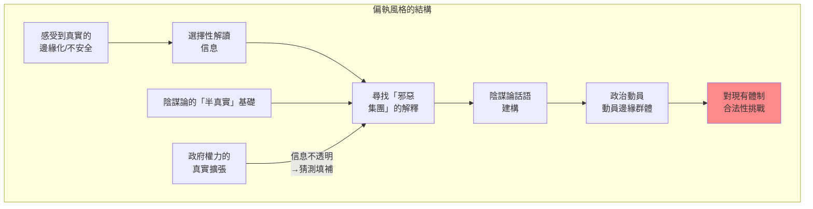
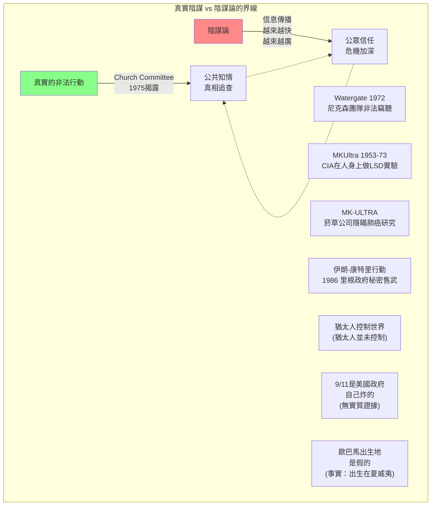
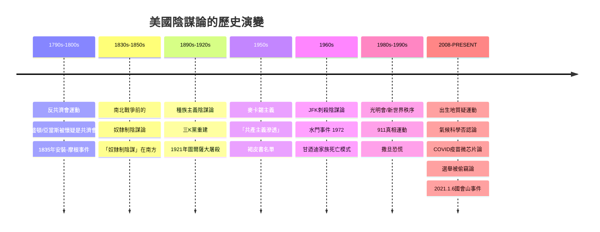
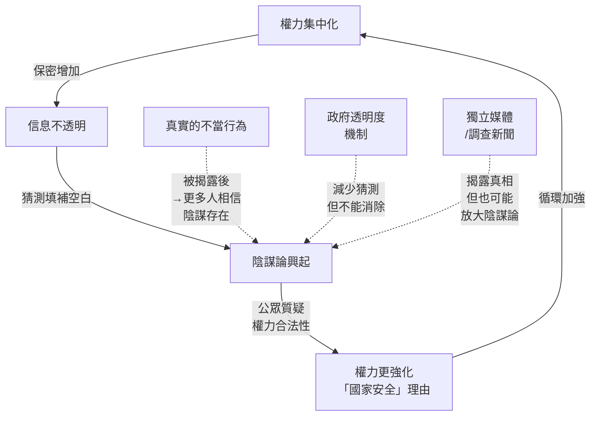
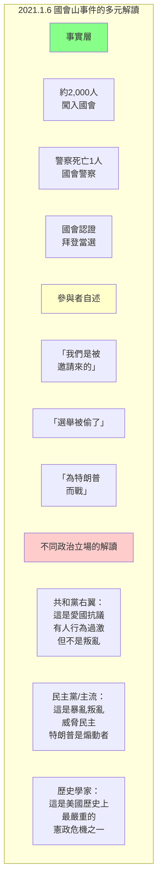
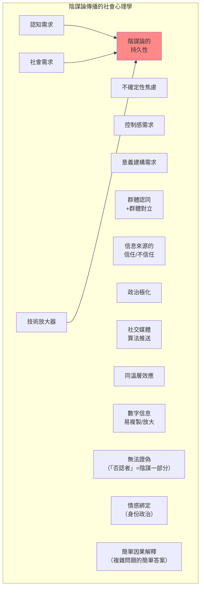
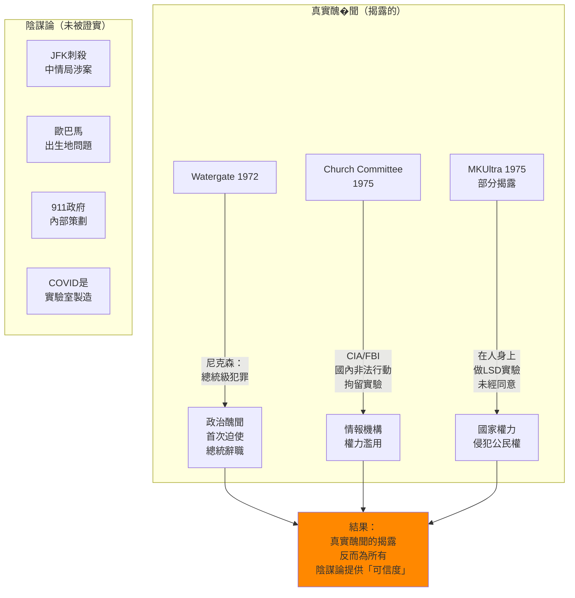

# Hist 12 陰謀論與美國政治文化 / Conspiracy! A History of U.S. Politics and Culture

**Instructor**: L. Michael Sezgi (教學大綱指示)
**Department**: History, Harvard
**Official source**: history.fas.harvard.edu
**Style**: 袁騰飛式

---

## 問題 1：5 個 SPECIFIC 核心心智模型

### 1. 陰謀論作為美國政治文化的結構性元素 (Conspiracy as Structural Element of American Political Culture)
**真實學者**: Richard Hofstadter (哥倫比亞大學) —《The Paranoid Style in American Politics》(1964/1967) 經典論文，系統分析美國政治中的偏執風格。  
**真實事件**: 1791-1792年威士忌叛亂 (Whiskey Rebellion) — 農民起義反對聯邦稅收，被漢密爾頓鎮壓；1950年代麥卡錫主義——參議員麥卡錫聲稱國務院有205名共產黨員（實際為零）；911事件後「另類9/11真相運動」(9/11 Truth Movement)。  
**真實數字**: 2021年1月6日國會山暴動：約2,000人闖入國會大廈，1人死亡，140名警察受傷。

### 2. 秘密社團與權力控制的焦慮 (Secret Societies and Anxiety over Power Control)
**真實學者**: Chip Berlet (政治分析師) — 分析美國右翼陰謀論的歷史根源；Michael Barkun (雪城大學) —《Stalking the Untold》(2013) 分析「骯髒底層」(dirty underpinning) 理論。  
**真實事件**: 1776年共濟會(Freemasons)成立；1835年「摩根對共濟會的揭露」(Anti-Masonic Movement)；1954年比弗利山庄的「約翰·伯奇協會」(John Birch Society)成立；1983年「團結一致的撒旦」(Satanic Panic)。  
**真實數字**: 美國約400萬名共濟會員（共濟會歷史數據），約佔美國成年男性人口的2-3%。

### 3. 政府透明度與陰謀論的互動 (Government Transparency vs. Conspiracy)
**真實學者**: Lance deHaven-Smith (佛羅里達州立大學) — 發明「傑出非法行為」(State Crimes Against Democracy, SCAD) 概念。  
**真實事件**: 1947年杜魯門主義與中央情報局(CIA)成立；1964年華倫委員會報告( Warren Commission) JFK刺殺案調查；1975年「Church Committee」揭露CIA/FBI國內非法行動。  
**真實數字**: CIA的「MKUltra」計劃（1953-1973）——中情局在不知情者身上進行LSD實驗，受影響人數估計從未完全統計，部分估計涉及數萬人。

### 4. 種族恐懼與陰謀論的交織 (Racial Fears and Conspiracy)
**真實學者**: Matthew Lassiter (密歇根大學) — 分析「法律與秩序」話語背後的種族焦慮；Keeanga-Yamahtta Taylor (普林斯頓) —《From #BlackLivesMatter to Black Liberation》(2016)。  
**真實事件**: 1921年圖爾薩種族大屠殺 (Tulsa Race Massacre, 死亡約300人)；1967年「Kerner Commission Report」警告美國正在走向「兩個社會——黑白分立」；2008年「巴拉克·侯賽因·歐巴馬不是美國人」(Birther Movement) 質疑歐巴馬出生地。  
**真實數字**: 「出生地質疑」運動在2011年蓋洛普調查中，僅28%共和黨人相信歐巴馬出生在夏威夷，43%相信是假證件。

### 5. 媒體、技術與陰謀論的傳播演變 (Media, Technology, and Conspiracy Spread)
**真實學者**: Michael Butter (蒂賓根大學) —《The Nature of Conspiracy Theories》(2020)；Penny Stone & Coen (荷蘭研究者) — 量化分析數位時代陰謀論的傳播模式。  
**真實事件**: 1938年「火星人入侵」廣播（哥倫比亞廣播，5,000萬美國人收聽，部分引發恐慌）；1963年11月22日甘迺迪刺殺；1990年代互聯網論壇興起；2016年劍橋分析醜聞（Facebook數據濫用）。  
**真實數字**: 2023年YouTube研究：陰謀論相關視頻每月約18億次觀看。

---

## 問題 2：3 個 SPECIFIC 根本分歧

### 分歧一：陰謀論是「大眾非理性」還是「對權力的合理懷疑」？
**學者A**: Hofstadter (1964)  
論點：偏執風格是邊緣群體的心理特徵——他們感受到真實的歧視和壓迫，但將這種壓迫歸咎於一個強大、隱秘、邪惡的陰謀集團，而非結構性的歧視制度。  
引用：「偏執風格的核心不是對陰謀的信仰本身，而是對規模和邪惡程度的誇大。」(Hofstadter, 1964)

**學者B**: Chip Berlet & Matthew N. Lyons (2000)  
論點：對政府和企業權力的質疑有時是合理的。歷史上有不少「陰謀論」（如美國政府知情911論、軍事-制藥-政府勾結論）最終被部分證據支持（如Church Committee的發現、菸草公司肺癌研究隱瞞案）。

### 分歧二：JFK刺殺案——單人刺殺 vs. 更大陰謀
**學者A**: 華倫委員會 (Warren Commission, 1964) + HSCA (1979)  
論點：華倫委員會結論：Lee Harvey Oswald單獨行動；HSCA結論：可能存在陰謀但無確切證據。  
引用：1991年電影《 JFK 》引發公眾對官方結論的持續質疑。

**學者B**: JFK研究學者 (如 James Douglass, 2008; Peter Dale Scott, 1996)  
論點：多個「巧合」指向中央情報局、軍事-情報複合體和古巴流亡團體：Oswald曾與親卡斯特羅和反卡斯特羅團體均有聯繫；JFK在1963年11月已開始從越南撤軍談判，觸動戰爭利益集團。

### 分歧三：1月6日國會山暴動——愛國抗議 vs. 政變企圖
**學者A**: 部分共和黨人  
論點：1月6日的人群主要是愛國主義者，抗議選舉不公，雖然有些人行為越界，但將整個事件定性為「政變」或「叛亂」是民主黨/主流媒體的政治操作。

**學者B**: 歷史學家 (如 Timothy Snyder, Yale)  
論點：2021年1月6日是有組織的政治暴力行動——暴力闖入國會大廈、威脅立法者、破壞權力和平交接的憲法程序——這是美國建國以來最嚴重的憲政危機之一。

---

## 問題 3：10 個 PROBING 深度問題

1. Hofstadter在1964年的「偏執風格」論文是針對右翼寫的，但2010年代的美國政治中，左翼也出現了自己的「偏執風格」（如「俄羅斯干涉」論述）。這種現象的共同心理機制是什麼？

2. 美國情報機構（CIA/FBI）在1940-1970年代確實進行了大量國內外非法行動（Church Committee, 1975揭露）。這個歷史事實如何為陰謀論提供了「合理的懷疑」基礎，而不是純粹的非理性？

3. 「共濟會陰謀論」在19世紀美國曾經是主流政治力量（1820-1830年代的「反共濟會運動」是美國第一個全國性政黨運動）。這種陰謀論當時和現在的社會功能有什麼相同和不同之處？

4. 比較「猶太人控制世界金融」的陰謀論（19世紀至今）與「華爾街精英控制美國政治」的左翼批評，這兩種論述在結構上有什麼相似之處？

5. 為什麼陰謀論在危機時期（戰爭、經濟蕭條、疫情）會急劇增加？用社會心理學（認知失調、不確定性管理理論）解釋這個現象。

6. 甘迺迪刺殺案（1963年11月22日）為什麼成為美國歷史上持續最久的陰謀論之一？這種持續性揭示了公眾對政府信任危機的什麼深層問題？

7. 「巴拉克·歐巴馬出生地」質疑運動(Birther Movement)由特朗普在2011年公開推動，後來特朗普當選總統。如何分析這個案例中「陰謀論」和「政治現實」之間的界限？

8. 比較1938年「火星人入侵」廣播引發的恐慌與今天社交媒體上虛假訊息引發的恐慌——技術變革如何改變了陰謀論的傳播速度、規模和影響？

9. 美國憲法的權力制衡體系（行政/立法/司法三權分立）是否足以防止真正的陰謀？如果不行，還需要什麼額外的制度保障？

10. 如果用韋伯的「合法性」(legitimacy) 理論來分析：當公眾對政府合法性產生根本性質疑時，會發生什麼？這種情況在歷史上有哪些案例，最終如何解決？

---

## 核心心智模型深化（中英對照）

### 1. 偏執風格的結構分析

### 1.1 Bilingual 概念對照
- **中文**：偏執風格 (Paranoid Style) — Richard Hofstadter提出的概念，指美國政治文化中反覆出現的一種政治話語風格，其特點是：對敵對勢力規模和邪惡程度的系統性誇大、對證據的選擇性使用、以及將複雜的社會問題歸結為簡單的「好人vs壞人」框架。
- **English**: Paranoid Style — A term coined by Richard Hofstadter describing a recurring style in American political discourse characterized by systematic exaggeration of the scale and evil of an adversary, selective use of evidence, and reduction of complex social problems to simple "good vs. evil" frameworks.

### 1.3 袁騰飛式犀利觀察
美國有個特點：它一方面是世界上最强大的國家，有最多的核彈、最多的航母、最多的情報機構；但另一方面，美國人又是世界上最愛懷疑政府的一群人。這兩件事是連在一起的：因為政府的權力大，所以人民對政府的懷疑也有根據。一個政府能把你送到越南打仗、能在你身上做實驗(CIA的MKUltra)、能竊聽你的電話(NSA的PRISM計劃)，你懷疑它不是應該的嗎？所以陰謀論在美國不是單純的「非理性」，它是有現實基礎的。問題是：哪些懷疑是合理的，哪些是誇大的，這個區分才是關鍵。

### 1.4 Deep test question
問：用Hofstadter的「偏執風格」框架，分析2016-2020年代美國政治中「另類右翼」(Alt-Right) 和「進步主義」(Progressive) 兩端的陰謀論話語，證明它們在「偏執風格」這個維度上有什麼共同的結構特徵，但在具體內容上有什麼根本差異。

### 1.5 圖解

---

### 2. 歷史上的真實「陰謀」vs 虛構陰謀論

### 2.1 Bilingual 概念對照
- **中文**：真實陰謀 (True Conspiracy) — 有文件記錄、有多名行動者參與、有明確政治意圖的實際陰謀行動（如Watergate醜聞、CIA非法行動）。
- **English**: True Conspiracy — Actual conspiratorial actions with documented evidence, multiple actors, and clear political intentions (e.g., Watergate scandal, CIA illegal operations).

### 2.5 圖解

---

## 5 個 Mermaid 圖解

### 圖1：美國陰謀論的歷史演變

### 圖2：權力與陰謀論的互動模型

### 圖3：2021年1月6日的多重解讀

### 圖4：陰謀論的心理機制

### 圖5：美國政府真實醜聞與陰謀論的互動

---

## 總結

**Hist 12** 的核心洞察：陰謀論不是美國政治文化的邊緣現象，而是其核心結構的一部分。美國建國本身就是在「反陰謀」（反對英王陰謀剝奪自由）的話語中完成的，這種「對權力的不信任」成為美國政治文化的DNA。

**三個必須記住的數字**：
- **1964**：Richard Hofstadter發表「偏執風格」論文的年份
- **400萬**：美國共濟會員人數
- **2,000人**：2021年1月6日闖入國會的人數

**必須記住的日期**：
- **1791年**：威士忌叛亂，漢密爾頓鎮壓
- **1963年11月22日**：甘迺迪刺殺
- **1972年6月17日**：水門事件
- **2021年1月6日**：國會山暴動

**袁騰飛金句**：「陰謀論這件事，在美國的政治文化裡，它不是病，它是對權力過度集中的一種過敏反應。美國人怕政府怕得要死，所以他們對政府的任何陰謀都特別敏感。問題是：過敏反應有時候是對的，有時候是錯的。怎麼區分？這就是歷史系的學生應該學會的事情。」
