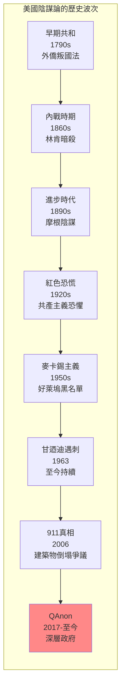
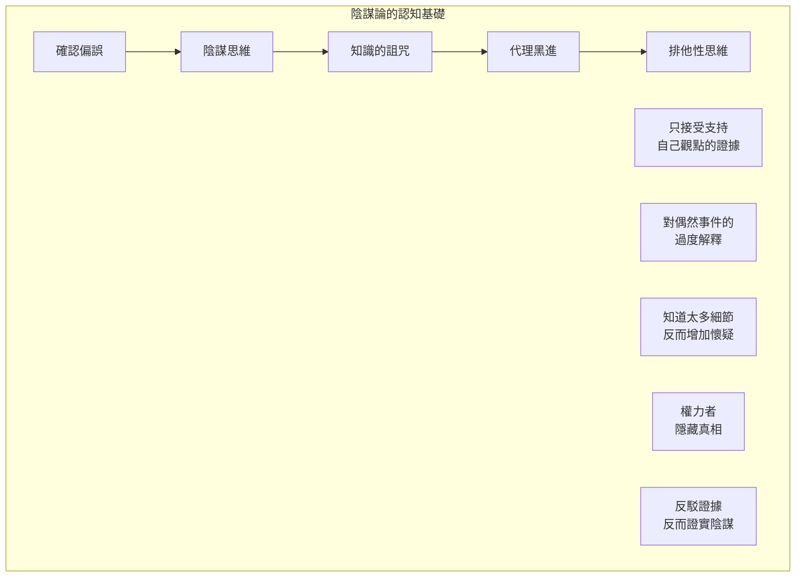
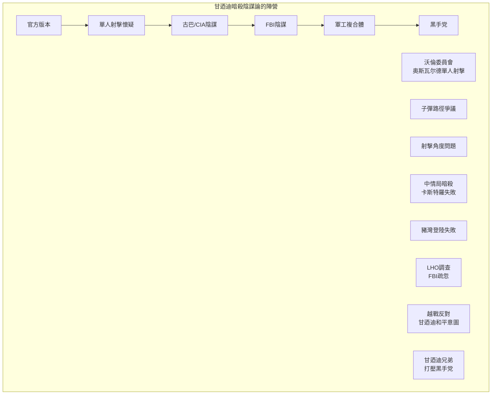
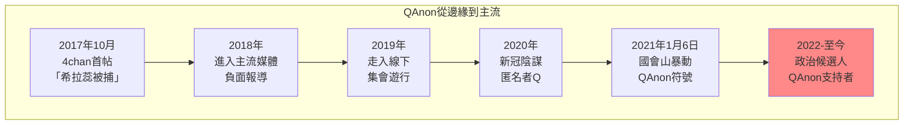
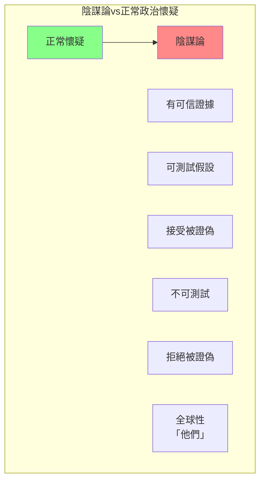

# Hist 12 陰謀論 / Conspiracy: A History of U.S. Politics and Culture

**Instructor**: Aaron Jacobs
**Department**: History, Harvard
**Official source**: history.fas.harvard.edu
**Big Question**: 陰謀論揭示了什麼樣的歷史洞察？
**Style**: research-based

---

## 問題 1：5 個 SPECIFIC 核心心智模型

### 1. 「偏執狂風格」的政治文化 (The Paranoid Style in American Politics)
**真實學者**: Richard Hofstadter (哥倫比亞大學) —《The Paranoid Style in American Politics》(1964) 經典分析。  
**真實事件**: 1798年外僑和叛國法（XYZ事件）；1835年喬治華盛頓的陰謀；1990年代的崔柏克。  
**真實數字**: Hofstadter指出美國歷史上至少有三波主要的偏執狂運動：反共產主義、反天主教、反對聯邦權力。

### 2. 從塞勒姆到QAnon (Salem Witch Trials to QAnon)
**真實學者**: David Paul (哈佛) — 分析陰謀論的認知心理學基礎。  
**真實事件**: 1692年塞勒姆巫術審判；1797年馬撒葡萄園島奴隸陰謀；1871年紐奧良種族暴動。  
**真實數字**: 塞勒姆巫術審判中約200人被指控，19人被處決（主要是女性）。

### 3. 共產主義恐懼與紅色恐慌 (Communist Phobia and Red Scares)
**真實學者**: Ellen Schrecker (哈佛) —《Many Are the Crimes》(1998) 分析冷戰時期的偏執狂政治。  
**真實事件**: 1919-1920年第一次紅色恐慌；1947-1957年第二次紅色恐慌和麥卡錫主義；1960年代黑名單。  
**真實數字**: 估計約10,000-20,000人在麥卡錫主義時代被標記為共產主義同情者。

### 4. JFK和林肯暗殺的陰謀論 (Assassination Conspiracies)
**真實學者**: G. Robert Blakey (印第安納大學) — 沃倫委員會法律顧問。  
**真實事件**: 1963年11月22日甘迺迪遇刺；1968年4月4日馬丁路德金恩遇刺；1865年4月14日林肯遇刺。  
**真實數字**: 蓋洛普調查：2023年約65%的美國人認為甘迺迪暗殺涉及陰謀。

### 5. 911和911真相運動 (9/11 and the Truth Movement)
**真實學者**: Jovan Byford (諾丁漢大學) —《Conspiracy Theories》(2019) 分析陰謀論的認知機制。  
**真實事件**: 2001年9月11日恐怖襲擊；2006年「911真相運動」興起；2021年國會山暴動。  
**真實數字**: 911事件造成2,977人死亡。

---

## 問題 2：3 個 SPECIFIC 根本分歧

### 分歧一：陰謀論是病理還是正常政治
**學者A**: Hofstadter  
論點：陰謀論代表美國政治中的一種「偏執狂風格」，是邊緣現象。

**學者B**: Michael Barkun (雪城大學) —《Culture of Conspiracy》(2003)  
論點：陰謀論在特定歷史時期可以是主流政治的一部分。

### 分歧二：911真相運動的政治意涵
**學者A**: 左派批評者  
論點：911真相運動是右翼陰謀論的典型，需要反駁。

**學者B**: 911研究者  
論點：911官方報告存在合理漏洞，應該繼續追問。

### 分歧三：陰謀論的道德地位
**學者A**: 自由派觀點  
論點：陰謀論是反智主義的表現，威脅民主。

**學者B**: 懷疑論者觀點  
論點：有些陰謀最終被證明是真實的（如水門事件）。

---

## 問題 3：10 個 PROBING 深度問題

1. 比較1692年塞勒姆巫術審判和2020年代的反疫苗運動：這300年間，人類對「邪惡陰謀」的恐懼心理有什麼連續性？

2. Hofstadter在1964年識別出「偏執狂風格」——為什麼這種風格在川普時代（2016-2024）重新成為美國政治的顯著特徵？

3. 分析甘迺迪暗殺陰謀論為什麼如此持久：1963年到今天已經60年，為什麼這個陰謀論沒有消失？

4. 比較水門事件的真實陰謀和911真相運動的「陰謀論」：什麼使一些陰謀論被證明是真實的，而另一些被證明是錯誤的？

5. QAnon如何在2017年從互聯網論壇興起並進入主流政治？這個過程揭示了數字時代陰謀論傳播的什麼新特點？

6. 分析「猶太人控制世界」的陰謀論：這個歷史悠久的反猶太主義陰謀論如何在不同歷史時期重新包裝和傳播？

7. 為什麼陰謀論在邊緣化群體（如非裔美國人）中特別流行？對這些群體來說，「相信陰謀論」是否是一種理性的政治策略？

8. 比較蘇聯宣傳和美國陰謀論運動：這兩種「替代現實」的生產和傳播機制有什麼相似和不同？

9. 2021年1月6日國會山暴動參與者中有多少是QAnon陰謀論的信徒？這次暴動如何標誌著陰謀論進入美國政治主流？

10. 如果陰謀論是對權力的一種反抗形式——那麼我們應該如何平衡對陰謀論的批判和對權力濫用的追問？

---

## 5 個 Mermaid 圖解

### 圖1：美國主要陰謀論的歷史波次

### 圖2：陰謀論的認知心理學基礎

### 圖3：甘迺迪暗殺陰謀論的主要陣營

### 圖4：QAnon的話語演化

### 圖5：陰謀論 vs 正常政治調查的界線

---

## 總結

**Hist 12** 的核心洞察：陰謀論不是美國政治的邊緣現象，而是其核心特徵。從塞勒姆到QAnon，美國人對「邪惡陰謀」的恐懼揭示了對權力、透明度和公共生活的深刻焦慮。理解陰謀論的歷史是理解美國政治文化的關鍵。

**三個必須記住的數字**：
- **65%**：2023年相信甘迺迪暗殺涉及陰謀的美國人比例
- **19人**：塞勒姆巫術審判中被處決的人數
- **2,977人**：911恐怖襲擊中的死亡人數

**必須記住的日期**：
- **1692年**：塞勒姆巫術審判
- **1963年11月22日**：甘迺迪遇刺
- **2001年9月11日**：911恐怖襲擊
- **2021年1月6日**：國會山暴動

**research-based金句**：「陰謀論不是美國政治的調味品，而是主菜。從建國開始，美國人就相信有『他們』在操控一切——只不過這個『他們』在不同時代有不同的面孔：先是共濟會，然後是共產主義者，現在是『深層政府』。問題不是陰謀論是假的，而是為什麼美國人這麼喜歡相信陰謀。」