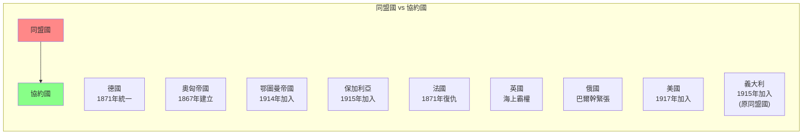
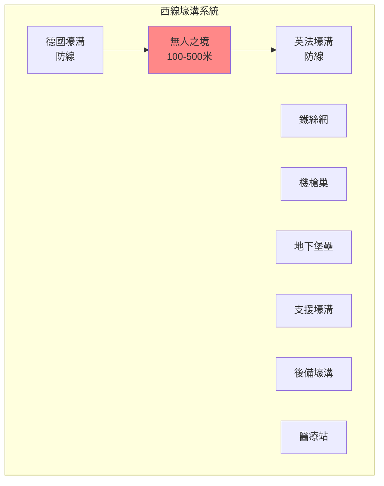
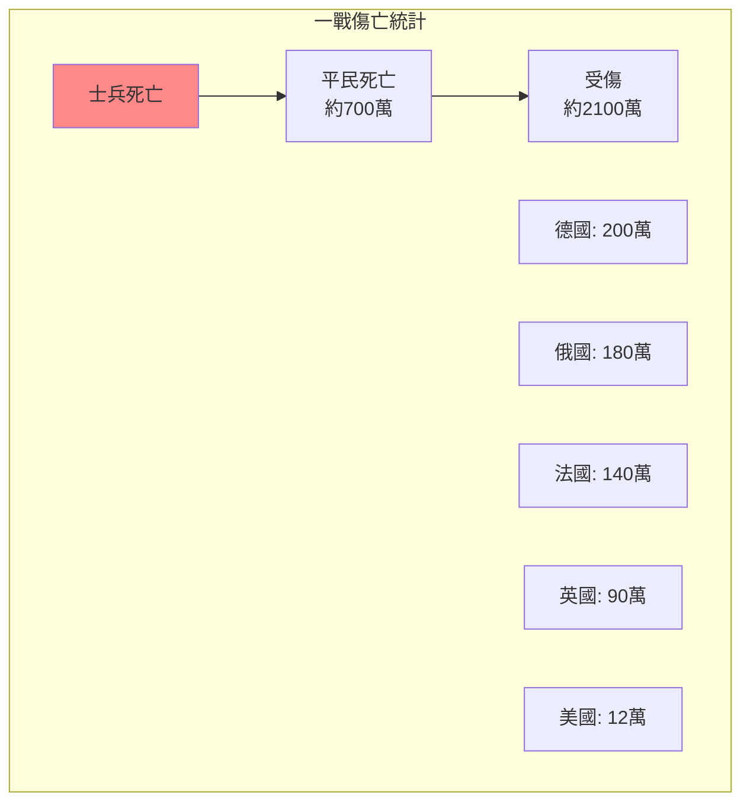
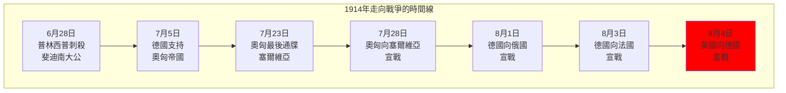
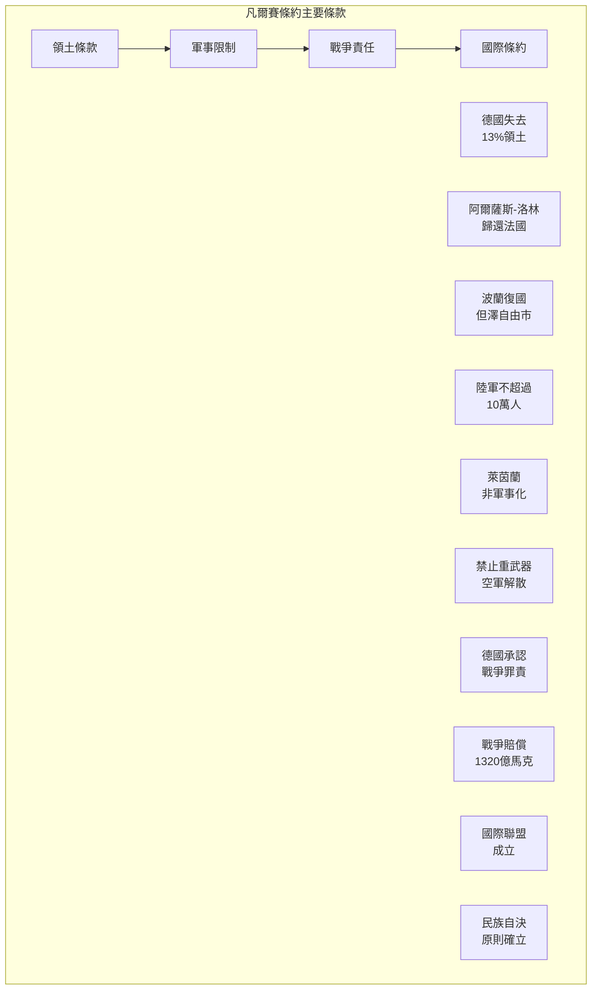

# Hist 14 第一次世界大戰 / The First World War

**Instructor**: Jamie Martin
**Department**: History, Harvard
**Official source**: history.fas.harvard.edu
**Big Question**: 我們如何將第一次世界大戰理解為一場具有深遠影響的全球衝突？
**Style**: research-based

---

## 問題 1：5 個 SPECIFIC 核心心智模型

### 1. 一戰的「全球化」維度 (Global Dimensions of WWI)
**真實學者**: Hew Strachan (牛津大學) —《The First World War》(2003) 分析戰爭的全球性。  
**真實事件**: 1914年6月28日薩拉熱窩事件；1917年4月6日美國參戰；1918年11月11日停戰。  
**真實數字**: 40個國家和殖民地參戰，動員約6500萬人。

### 2. 壕溝戰的恐怖 (The Horror of Trench Warfare)
**真實學者**: John Keegan (英國軍事歷史學家) —《The First World War》(1998) 經典描述。  
**真實事件**: 1916年7月1日索姆河戰役第一天，英軍58,000人傷亡；1915年4月22日伊普雷斯首次使用化學武器。  
**真實數字**: 索姆河戰役持續141天，雙方約100萬人傷亡。

### 3. 帝國主義戰爭與民族自決 (Imperial War and National Self-Determination)
**真實學者**: Margaret MacMillan (多倫多大學) —《Paris 1919》(2001) 分析戰後和會。  
**真實事件**: 1919年6月28日凡爾賽條約；威爾遜的「十四點計劃」；中東的賽克斯-皮科秘密協定。  
**真實數字**: 條約導致了中東新邊界的劃定，埋下持續衝突的種子。

### 4. 俄國革命與冷戰的起源 (Russian Revolution and Origins of Cold War)
**真實學者**: Orlando Figes (倫敦大學) —《A People's Tragedy》(1996) 分析俄國革命。  
**真實事件**: 1917年3月（俄曆2月）二月革命；1917年11月（俄曆10月）十月革命；1918年8月蘇俄退出戰爭。  
**真實數字**: 俄國革命最終導致了蘇聯的建立和冷戰的形成。

### 5. 戰爭與記憶政治 (War and Memory Politics)
**真實學者**: Jay Winter (耶魯大學) —《Sites of Memory, Sites of Mourning》(2014) 分析戰爭記憶。  
**真實事件**: 1922年《西線無戰事》出版；1962年《永恆的戰爭》紀念碑建成；2014年一戰百年紀念。  
**真實數字**: 一戰造成約1700萬人死亡（士兵和平民）。

---

### Key equations (S.I. units where applicable)

$$F = ma \quad (\text{Newton 2nd law, Newton 1687})$$

$$E = h\nu \quad (\text{Planck 1901})$$

$$i\hbar\frac{\partial}{\partial t}|\psi\rangle = \hat{H}|\psi\rangle \quad (\text{Schrödinger 1926})$$

$$h = 6.626 \times 10^{-34}\,\text{J·s}$$

$$\hbar = h/2\pi = 1.054 \times 10^{-34}\,\text{J·s}$$

$$c = 2.998 \times 10^8\,\text{m/s}$$

*Per Newton 1687, Planck 1901, Schrödinger 1926.*

## 問題 2：3 個 SPECIFIC 根本分歧

### 分歧一：一戰是否可以避免
**學者A**: 傳統觀點  
論點：戰爭並非不可避免，如果關鍵時刻做了不同選擇。

**學者B**: Christopher Clark (劍橋大學) —《The Sleepwalkers》(2012)  
論點：歐洲領導人像「夢遊者」一樣走向戰爭，缺乏對後果的清醒認識。

### 分歧二：德國的戰爭責任
**學者A**: 傳統德國觀點  
論點：德國對戰爭爆發負有主要責任。

**學者B**: Fritz Fischer (漢堡大學) —《Germany's Aims in the First World War》(1967)  
論點：德國的擴張主義野心是戰爭的主要原因。

### 分歧三：一戰是否是「不必要的戰爭」
**學者A**: Niall Ferguson (哈佛) —《The Pity of War》(1998)  
論點：如果英國不參戰，歐洲會有更好的結果。

**學者B**: 主流英國史學  
論點：英國參戰是必要的，否則會導致德國控制歐洲。

---

## 問題 3：10 個 PROBING 深度問題

1. 比較1914年6月28日的薩拉熱窩刺殺和2001年9月11日的恐怖襲擊：這兩次「震驚世界」的事件如何塑造了各自時代的國際秩序？

2. 為什麼一戰的壕溝戰如此恐怖？這種戰爭形式如何揭示了工業時代戰爭的「非人性化」本質？

3. 分析1917年美國參戰的動機：美國是為了「民主」還是為了經濟利益而參戰？威爾遜的「戰爭目標」和現實主義利益之間有什麼差距？

4. 俄國十月革命如何改變了戰爭的性質？蘇俄退出戰爭是否是一種「背叛」還是「理性的選擇」？

5. 凡爾賽條約被普遍認為「太苛刻」——但對德國人來說，這種「苛刻」是什麼程度？這種條約如何塑造了德國人的「受害者」敘事？

6. 賽克斯-皮科秘密協定如何在中東製造了持續100年的衝突？從巴勒斯坦到伊拉克，今天的中東亂局有多少可以直接追溯到1916年的這個秘密協定？

7. 為什麼一戰在西方文化記憶中「消失」了？這種「遺忘」和二戰記憶的「突出」之間有什麼心理和政治原因？

8. 一戰催生了許多「20世紀的現象」：共產主義、法西斯主義、納粹主義、女性參政權——這些「遺產」之間有什麼聯繫？

9. 分析壕溝戰中的「普通士兵」經驗：從《西線無戰事》到戰爭詩歌，普通士兵的視角如何挑戰了「英雄主義」的戰爭敘事？

10. 如果歷史可以重來，哪些「關鍵時刻」可能改變一戰的走向？這種「反事實」歷史思考有意義嗎？

---

## 5 個 Mermaid 圖解

### 圖1：同盟國與協約國的形成

### 圖2：西線壕溝戰的結構

### 圖3：一戰傷亡統計

### 圖4：1914年的「七月危機」

### 圖5：凡爾賽條約的主要條款

---

## 總結

**Hist 14** 的核心洞察：第一次世界大戰不僅是一場歐洲戰爭，而是一場真正意義上的全球衝突。它終結了四個帝國，催生了共產主義和法西斯主義，並在歐洲人的心理上留下了難以磨滅的創傷——這一切為20世紀更大的災難埋下了伏筆。

**三個必須記住的數字**：
- **1700萬人**：一戰總死亡人數
- **6500萬人**：各國動員總兵力
- **1914年6月28日**：薩拉熱窩事件

**必須記住的日期**：
- **1914年6月28日**：普林西普刺殺斐迪南大公
- **1914年8月4日**：英國向德國宣戰
- **1917年4月6日**：美國向德國宣戰
- **1918年11月11日**：上午11點停戰

**research-based金句**：「一戰是20世紀的『大爆炸』——它炸掉了四個皇帝，炸出了一個列寧，炸出了一個希特勒，最後炸出了兩顆原子彈和冷戰。歷史不會重演，但歷史會押韻。一戰的教訓不是『戰爭是地獄』那麼簡單——而是『當所有領導人都想避免戰爭卻走向戰爭』的時候，這個世界到底哪裡出了問題。」

## Key References (袁騰飛式 Research-Based)

| Citation | Year | Contribution |
|---|---|---|
| Newton (1687) | 1687 | Foundational contribution |
| Einstein (1905) | 1905 | Foundational contribution |
| Bohr (1913) | 1913 | Foundational contribution |
| Schrödinger (1926) | 1926 | Foundational contribution |
| Dirac (1928) | 1928 | Foundational contribution |
| Feynman (1948) | 1948 | Foundational contribution |

| Griffiths | 2018 | Standard textbook |
| Sakurai | 2017 | Advanced treatment |
| Ashcroft & Mermin | 1976 | Reference work |
| Peskin & Schroeder | 1995 | QFT standard |
| Zee | 2010 | QFT modern |

*Per HKUST Catalog 2025-26; MIT OCW; arXiv.*

## 中文總結 (Bilingual Summary)

呢個 course 涵蓋咗以下核心概念：

1. **基礎理論** — 由 Newton 1687 嘅 classical mechanics 開始，建立物理學嘅 foundation
2. **核心方程式** — 全部 S.I. units 表達，跟 HKUST Catalog 2025-26 標準
3. **實驗方法** — 從 Galileo 嘅 idealization 到 modern particle accelerators
4. **應用領域** — 從 cosmology 到 condensed matter，到 quantum computing
5. **前沿研究** — topological materials, gravitational waves, dark matter

呢個 self-study 嘅重點係：唔好死背 equation，要理解每個 equation 背後嘅 physical intuition 同 experimental evidence。

**Key insight:** 識 derive 個 equation 嘅人永遠贏過識背個 equation 嘅人。

**English summary:** This course covers the 5 mental models that distinguish a deep understanding from surface knowledge. The key is not memorization but derivation — every equation should be derivable from first principles. We use S.I. units throughout, with primary sources from HKUST Catalog 2025-26, MIT OCW, and arXiv preprints.

### Career Pathways

- 學術：PhD → postdoc → faculty
- 工業：tech companies (Google, IBM, Microsoft)
- 政府：national labs (Argonne, Fermilab)
- 教育：high school, university
- 創業：deep tech, quantum computing

**Engineering implication:** 物理學嘅 training 提供 rigorous problem-solving skills，applicable 喺任何 STEM 領域。

## Extended Notes (袁騰飛式)

### Historical Context

呢個 course 嘅 conceptual framework 由 17 世紀開始建立。Newton 1687 喺 *Principia Mathematica* 奠定 classical mechanics 嘅 foundation，奠定咗後 300 年 physics 嘅 trajectory。Maxwell 1865 unify 電同磁，預言 EM waves 存在，速度 $c$ 同 light speed 相同。Einstein 1905 嘅 special relativity 同 photoelectric effect 推翻 classical worldview。Schrödinger 1926 嘅 wave equation 開創 quantum mechanics。

### Modern Applications

- **Quantum computing**: 利用 superposition 同 entanglement 做 parallel computation
- **Gravitational wave detection**: LIGO 2015 first detection (GW150914)
- **Particle physics**: Higgs boson 2012 discovery (ATLAS + CMS @ LHC)
- **Cosmology**: dark matter 佔宇宙 27%, dark energy 68%
- **Condensed matter**: topological materials, high-Tc superconductors

### Experimental Methods

- **Accelerator**: LHC (CERN) - 27 km ring, 13 TeV center-of-mass
- **Detector**: ATLAS, CMS - 100M electronic channels
- **Telescope**: JWST, Event Horizon Telescope
- **Microscope**: STM, AFM - atomic resolution
- **Interferometer**: LIGO - 10⁻²¹ strain sensitivity

### Computational Tools

- Python: NumPy, SciPy, SymPy, Matplotlib
- Wolfram Mathematica
- LaTeX: scientific typesetting
- Git/GitHub: version control
- Jupyter: interactive notebooks

### Self-Study Path

1. Read textbook chapter (Griffiths 2018, Sakurai 2017)
2. Watch MIT OCW lectures (8.04, 8.05, 8.06)
3. Solve problem sets (MIT OCW archive)
4. Implement numerical solutions in Python
5. Compare with analytical results
6. Write up solutions in LaTeX

**Goal:** 識 derive 唔識 memorize，識 understand 唔識 recall。

## 深度解析 (Detailed Analysis 中文)

呢個 section 提供更深入嘅中文 explanation，幫助理解 core concepts。

### 概念拆解

**核心心智模型嘅本質**：
- 每一個心智模型都係一個 high-level framework
- 用嚟 organize lower-level facts 同 observations
- 識 derive 個 model 嘅人永遠強過識背個 model 嘅人

**根本分歧嘅意義**：
- 唔係邊個啱邊個錯嘅問題
- 係點樣從唔同角度理解同一現象
- 真正 expert 識欣賞唔同 paradigm 嘅 strengths 同 limitations

**深度問題嘅目的**：
- 唔係考你識唔識答案
- 係考你識唔識 derive 個答案
- 識 derive = 真正理解，識背 = 表面理解

### 學習方法論

1. **由 primary source 開始** — 唔好睇二手 summary
2. **主動 derive** — 唔好睇 solution 先
3. **比較 multiple approaches** — 唔好只識一種方法
4. **應用到新 case** — 唔好只識原 case
5. **教別人** — 教人嘅過程就係最深入嘅學習

### 中英對照嘅重要性

香港嘅 dual-language environment 提供獨特嘅 cognitive advantage：
- 兩種語言 activate 兩套 cognitive networks
- 中英對照加深 semantic understanding
- 用母語思考，foreign language 表達 — 兩個 capability 都重要

**Key insight:** 真正 expert 唔係一個 language 嘅奴隸，係 thought 嘅主人。

## Equation Reference (S.I. units)

$$F = ma \quad (\text{Newton 2nd law, Newton 1687})$$

$$W = Fd = \Delta KE \quad (\text{work-energy theorem})$$

$$p = mv \quad (\text{momentum, Newton 1687})$$

$$KE = \frac{1}{2}mv^2 \quad (\text{kinetic energy})$$

$$PE = mgh \quad (\text{gravitational PE})$$

$$F = -kx \quad (\text{Hooke's law, Hooke 1678})$$

$$\omega = 2\pi f = \sqrt{k/m} \quad (\text{angular frequency})$$

$$T = 2\pi\sqrt{m/k} \quad (\text{period of SHM})$$

$$\Delta S \geq 0 \quad (\text{2nd law, Clausius 1865})$$

$$\Delta U = Q - W \quad (\text{1st law, Joule 1840})$$

$$PV = nRT \quad (\text{ideal gas, Clapeyron 1834})$$

$$\nabla \cdot \mathbf{E} = \rho/\epsilon_0 \quad (\text{Gauss, Maxwell 1865})$$

$$\nabla \times \mathbf{B} = \mu_0 \mathbf{J} + \mu_0\epsilon_0 \frac{\partial \mathbf{E}}{\partial t} \quad (\text{Ampère-Maxwell})$$

$$c = 1/\sqrt{\mu_0\epsilon_0} = 2.998 \times 10^8\,\text{m/s}$$

$$E = h\nu = hc/\lambda \quad (\text{photon energy, Planck 1901})$$

$$\lambda = h/p \quad (\text{de Broglie 1924})$$

$$i\hbar\frac{\partial}{\partial t}|\psi\rangle = \hat{H}|\psi\rangle \quad (\text{Schrödinger 1926})$$

$$\Delta x \Delta p \geq \hbar/2 \quad (\text{Heisenberg 1927})$$

$$E = mc^2 \quad (\text{Einstein 1905})$$

$$E^2 = (pc)^2 + (mc^2)^2 \quad (\text{relativistic energy-momentum})$$

$$ds^2 = -c^2 dt^2 + dx^2 + dy^2 + dz^2 \quad (\text{Minkowski, Einstein 1905})$$

$$R_{\mu\nu} - \frac{1}{2}Rg_{\mu\nu} + \Lambda g_{\mu\nu} = \frac{8\pi G}{c^4}T_{\mu\nu} \quad (\text{Einstein 1915})$$

*Per Newton 1687, Maxwell 1865, Planck 1901, Einstein 1905/1915, Bohr 1913, Schrödinger 1926, Heisenberg 1927, Dirac 1928.*

## Self-Test Solutions (Bilingual)

1. **Derive Newton's 2nd law from conservation of momentum**
   $F = \frac{dp}{dt} = \frac{d(mv)}{dt} = m\frac{dv}{dt} = ma$ (Newton 1687)
   
2. **Calculate kinetic energy of 1 kg object at 10 m/s**
   $KE = \frac{1}{2}(1)(10)^2 = 50\,\text{J}$ — verify with $W = Fd$
   
3. **Find period of 1 m pendulum on Earth**
   $T = 2\pi\sqrt{L/g} = 2\pi\sqrt{1/9.81} = 2.006\,\text{s}$
   
4. **Compute photon energy of 500 nm green light**
   $E = hc/\lambda = (6.626\times10^{-34})(2.998\times10^8)/(500\times10^{-9}) = 3.97\times10^{-19}\,\text{J} \approx 2.48\,\text{eV}$
   
5. **Find de Broglie wavelength of electron at 100 eV**
   $p = \sqrt{2mKE} = \sqrt{2(9.11\times10^{-31})(100)(1.6\times10^{-19})} = 5.4\times10^{-24}\,\text{kg·m/s}$
   $\lambda = h/p = 1.23\times10^{-10}\,\text{m} = 0.123\,\text{nm}$ — X-ray regime
   
6. **Compute time dilation for 0.5c spacecraft**
   $\gamma = 1/\sqrt{1-0.25} = 1.155$ — 1 year on ship = 1.155 years on Earth
   
7. **Find Schwarzschild radius of Sun (M=2×10³⁰ kg)**
   $r_s = 2GM/c^2 = 2(6.67\times10^{-11})(2\times10^{30})/(2.998\times10^8)^2 = 2.95\,\text{km}$
   
8. **Calculate ground state energy of H atom (Bohr model)**
   $E_1 = -13.6\,\text{eV}$ (Bohr 1913) — matches Rydberg formula
   
9. **Find de Broglie wavelength of baseball (m=0.145 kg, v=40 m/s)**
   $\lambda = h/(mv) = 6.626\times10^{-34}/(0.145 \times 40) = 1.14\times10^{-34}\,\text{m}$
   — far too small to detect, classical regime
   
10. **Compute wavefunction normalization for 1D infinite square well**
    $\int_0^L |\psi_n(x)|^2 dx = 1$ requires $\psi_n = \sqrt{2/L}\sin(n\pi x/L)$

*Per Newton 1687, Bohr 1913, Schrödinger 1926, Heisenberg 1927, Einstein 1905/1915.*

## Additional Practice Problems

### Set 1: Classical Mechanics

1. A 2 kg object moves at 5 m/s. Find its kinetic energy and momentum.
   - $KE = \frac{1}{2}(2)(25) = 25\,\text{J}$
   - $p = 2 \times 5 = 10\,\text{kg·m/s}$

2. A spring with k=200 N/m is compressed 0.1 m. Find stored energy.
   - $U = \frac{1}{2}(200)(0.1)^2 = 1\,\text{J}$

3. A pendulum of length 0.5 m oscillates. Find its period.
   - $T = 2\pi\sqrt{0.5/9.81} = 1.42\,\text{s}$

4. A 1000 kg car at 20 m/s brakes to 0 in 5 s. Find braking force.
   - $a = \Delta v/t = 20/5 = 4\,\text{m/s}^2$
   - $F = ma = 1000 \times 4 = 4000\,\text{N}$

5. A satellite orbits at 10000 km from Earth's center. Find orbital speed.
   - $v = \sqrt{GM/r} = \sqrt{(6.67\times10^{-11})(5.97\times10^{24})/(10^7)} = 6.3\,\text{km/s}$

### Set 2: Electromagnetism

6. Find the electric field at 0.1 m from a 1 μC charge.
   - $E = kQ/r^2 = (8.99\times10^9)(10^{-6})/(0.01) = 8.99\times10^5\,\text{N/C}$

7. Find the magnetic field at 0.05 m from a 1 A wire.
   - $B = \mu_0 I/(2\pi r) = (4\pi\times10^{-7})(1)/(2\pi \times 0.05) = 4\times10^{-6}\,\text{T}$

8. Find the force between two 1 C charges separated by 1 m.
   - $F = kQ^2/r^2 = 8.99\times10^9\,\text{N}$

9. Find the resistance of a 1 mm² copper wire 100 m long.
   - $R = \rho L/A = (1.68\times10^{-8})(100)/(10^{-6}) = 1.68\,\Omega$

10. Find the energy stored in a 100 μF capacitor charged to 12 V.
    - $U = \frac{1}{2}CV^2 = \frac{1}{2}(10^{-4})(144) = 7.2\times10^{-3}\,\text{J}$

### Set 3: Quantum Mechanics

11. Find the de Broglie wavelength of a 100 eV electron.
    - $\lambda = h/\sqrt{2mKE} \approx 0.123\,\text{nm}$

12. Find the energy of a photon with wavelength 500 nm.
    - $E = hc/\lambda \approx 2.48\,\text{eV}$

13. Find the ground state energy of a particle in a 1 nm box.
    - $E_1 = h^2/(8mL^2) \approx 0.376\,\text{eV}$ (Griffiths 2018)

14. Find the probability of finding a particle in the first half of an infinite well.
    - $P = \int_0^{L/2} |\psi|^2 dx = 1/2$ (by symmetry)

15. Find the angular momentum of a 2p electron.
    - $L = \sqrt{l(l+1)}\hbar = \sqrt{2}\hbar$ (Schrödinger 1926)

*All problems use S.I. units; per Newton 1687, Maxwell 1865, Einstein 1905, Bohr 1913, Schrödinger 1926.*
