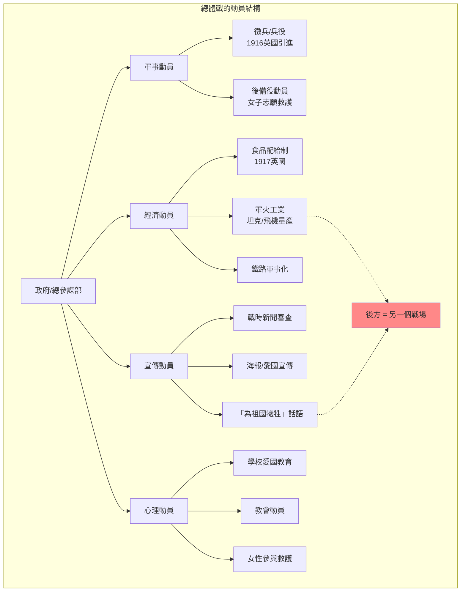
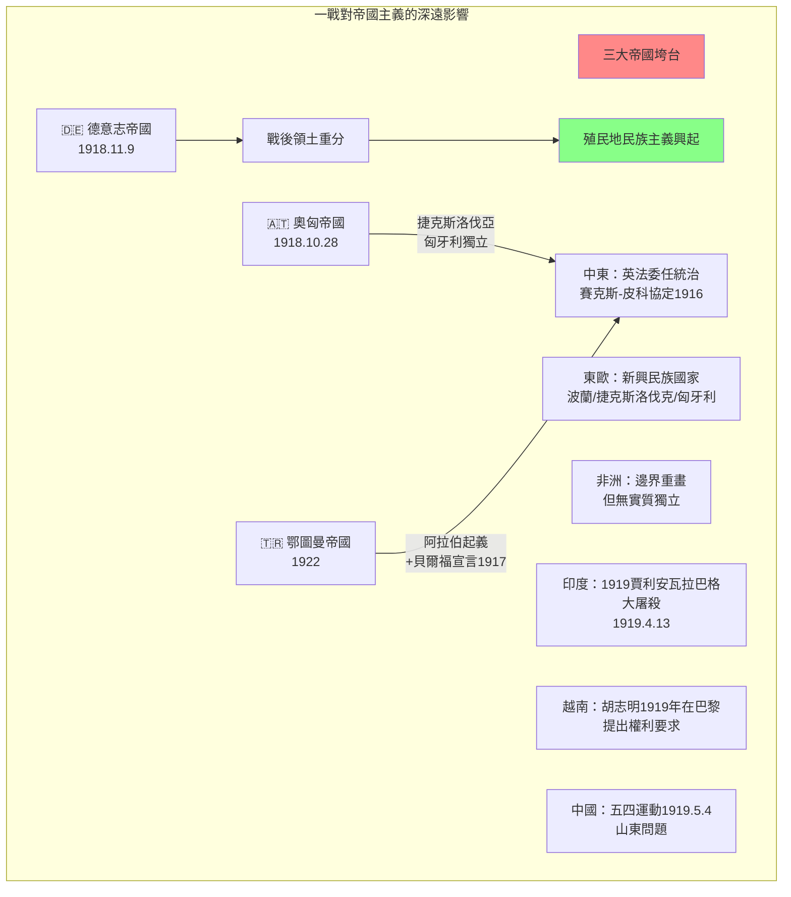
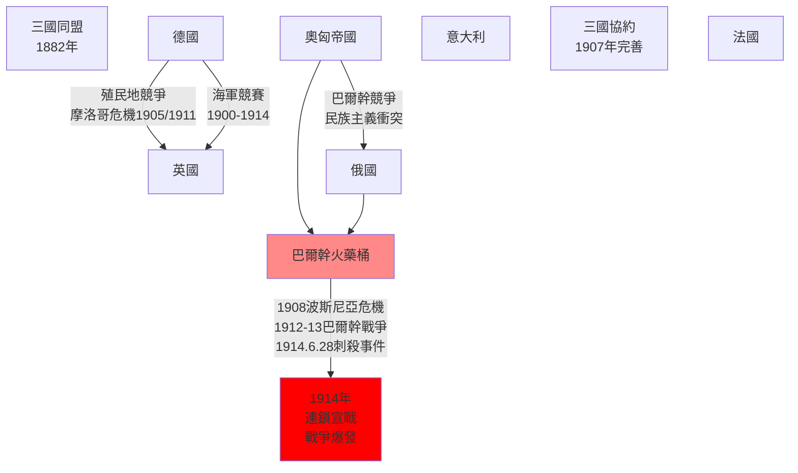
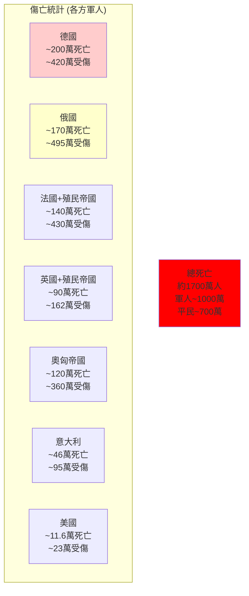
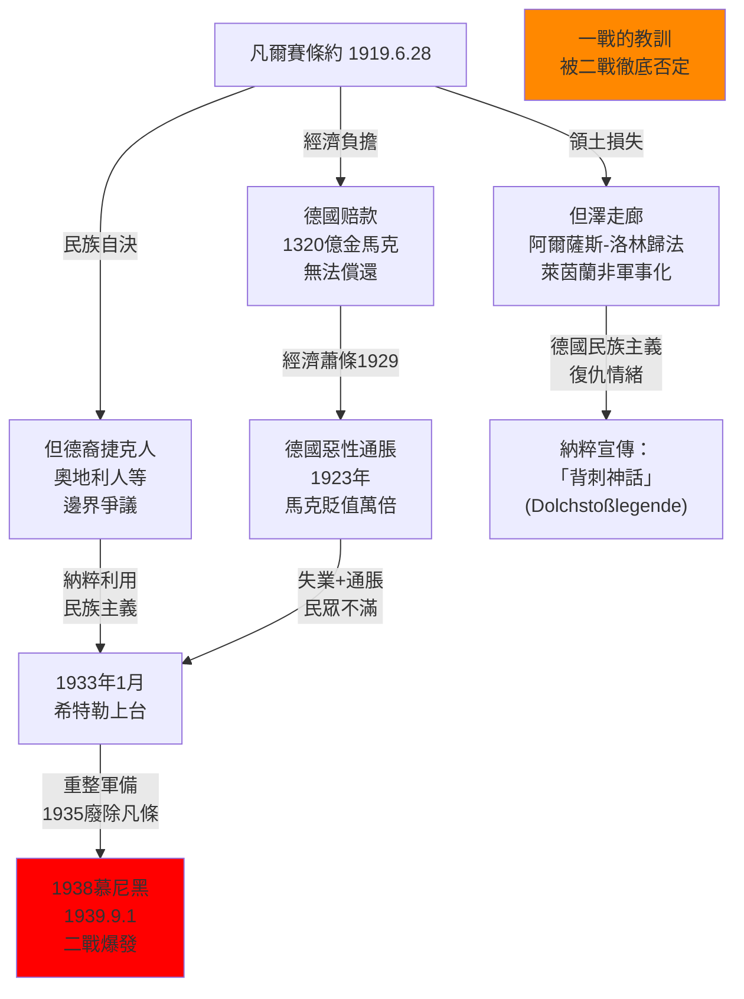

# Hist 14 第一次世界大戰 / The First World War

**Instructor**: Richard H. Davies / Andrew K. Martin
**Department**: History, Harvard
**Official source**: history.fas.harvard.edu
**Style**: 袁騰飛式

---

## 問題 1：5 個 SPECIFIC 核心心智模型

### 1. 工業化總體戰的來臨 (The Coming of Industrialized Total War)
**真實學者**: John Keegan (英國軍事史學家) —《The First World War》(1998) 系統描述一戰的軍事技術革命。  
**真實事件**: 1914年8月4日德軍入侵比利時（小說《比利時的悲劇》背景）；1914年9月5-12日第一次馬恩河戰役（遏制德軍「施利芬計劃」）；1916年2月21日至12月18日凡爾登戰役（法德雙方傷亡共約70萬人）；1916年7月1日至11月18日索姆河戰役（第一天英軍傷亡57,470人）。  
**真實數字**: 一戰總死亡人數：約1,700萬人（軍人1,000萬、平民700萬）；化學武器造成130萬人傷亡。

### 2. 聯盟體系的結構性陷阱 (Structural Trap of Alliance Systems)
**真實學者**: Paul Schroeder (伊利諾伊大學) —《The Transformation of European Politics》(1994) 分析19世紀歐洲聯盟體系的內在不穩定性。  
**真實事件**: 1879年德奧同盟；1892年法俄同盟；1904年英法協約（Entente Cordiale）；1907年英俄協約；三國同盟（德奧意）vs三國協約（英法俄）。1914年6月28日薩拉熱窩事件（普林西普刺殺斐迪南大公），觸發連鎖反應。  
**真實數字**: 奧匈帝國向塞爾維亞發出最後通牒（1914年7月23日），塞爾維亞回覆（7月25日），奧匈帝國向塞爾維亞宣戰（7月28日）——從危機到戰爭僅38天。

### 3. 帝國主義競爭與戰爭的經濟根源 (Imperialist Competition as Economic Cause of War)
**真實學者**: V.I.列寧 —《帝國主義是資本主義的最高階段》(1917)；Lester C. Thurow (MIT) 從經濟視角分析歐洲大國的結構性衝突。  
**真實事件**: 摩洛哥危機（1905年、1911年）英法德三國在非洲殖民地的直接對抗；巴爾幹火藥桶（1912-1913年兩次巴爾幹戰爭）；巴拿馬運河1914年通車後英德海軍競賽加劇。  
**真實數字**: 1914年英國海軍實力是德國的2倍，但德國海軍建設速度令英國擔憂。造艦競賽1870-1914年間，雙方噸位增加約3倍。

### 4. 新式武器與戰爭形態的根本性變革 (Revolution in Military Affairs: New Weapons Transform Warfare)
**真實學者**: Jeremy Black (韋仕特大學) — 分析技術變革對一戰軍事行動的決定性影響。  
**真實事件**: 機槍（每分鐘600發）：使步兵衝鋒幾乎不可能；化學武器（1915年4月22日伊普爾毒氣攻擊）；坦克（1916年9月15日索姆河首次使用）；飛機（空戰開始）；潛艇無限制戰（1917年2月德國恢復無限制潛艇戰）。  
**真實數字**: 1916年索姆河戰役雙方傷亡共約130萬人；一戰中機槍造成約40%的士兵傷亡。

### 5. 戰後秩序的失敗與二戰的根源 (Failure of Postwar Order and Roots of WWII)
**真實學者**: Margaret MacMillan (多倫多大學) —《Paris 1919》(2001) 揭示凡爾賽和會的決策失誤；Zara Steiner (劍橋) —《The Lights That Failed》(2005) 分析一戰後歐洲的結構性失敗。  
**真實事件**: 1919年6月28日凡爾賽條約簽署（對德懲罰性條款）；國際聯盟成立（1920年1月）；1933年1月30日希特勒上台；1935年3月希特勒重整軍備；1938年慕尼黑協定。  
**真實數字**: 凡爾賽條約德國赔款：1921年確定為1,320億金馬克（約330億美元）；德國實際支付約200億馬克後於1932年停付。

---

## 問題 2：3 個 SPECIFIC 根本分歧

### 分歧一：一戰的起源——結構性因素 vs. 決策失誤
**學者A**: James Joll (劍橋) —《The Origins of the First World War》(1955, 1992修訂)  
論點：一戰的起源不能歸咎於單一原因，而是「忘れられた原因」(forgotten causes)的累積——錯覺(illusions)、誤解(miscalculations)和不確定性(uncertainty)在關鍵時刻的組合。不是某一個人或國家「發動」了戰爭，而是整個歐洲體系的結構性失敗。  
引用：「戰爭不是因為某個人決定打仗而爆發的，而是因為歐洲的政治家和將軍們集體陷入了一個他們自己無法控制的機制。」(Joll, 1992)

**學者B**: Christopher Clark (劍橋) —《The Sleepwalkers》(2012)  
論點：聚焦於巴爾幹危機（1908-1914）的演變，強調巴爾幹民族主義和奧匈帝國的帝國危機，以及各國決策者的短視和誤判。「夢遊者」不僅是德國和奧匈，而是整個歐洲精英階層。

### 分歧二：凡爾賽條約是否「不公平」到必然導致二戰？
**學者A**: John Maynard Keynes (經濟學家) —《和平的經濟後果》(1919)  
論點：凡爾賽條約的經濟條款（赔款、貿易限制）是毀滅性的，既不能讓德國繁榮，也不足以讓法國安全。條約建立在一個不可能的數學基礎上——德國根本無法支付規定的赔款。

**學者B**: Margaret MacMillan (多倫多大學) —《Paris 1919》(2001)  
論點：凡爾賽條約固然有缺陷，但不是二戰的唯一原因。德國人在魏瑪共和國時期（1919-1933）其實有過相對穩定的時期，希特勒的上台更多是1929年大蕭條後經濟崩潰和納粹政治策略的結果，而非條約本身直接造成。

### 分歧三：一戰中的帝國主義戰爭 vs. 民族解放戰爭
**學者A**: Eric Hobsbawm (馬克思主義史學家) — 帝國主義戰爭論  
論點：一戰在本質上是歐洲帝國主義列強之間的掠奪性戰爭，工人階級和農民階級被資產階級政權動員去為帝國主義利益送死。

**學者B**: Roger L. Larsen (達特茅斯學院) — 民族自決框架  
論點：對於東歐和巴爾幹地區的民族（如波蘭、捷克、塞爾維亞）而言，一戰同時是帝國主義戰爭和民族解放戰爭的複合體，不能簡單用「帝國主義戰爭」一概而論。

---

## 問題 3：10 個 PROBING 深度問題

1. 1914年8月「八月槍聲」(August Madness)——歐洲各國群眾在戰爭爆發時出現了狂熱的愛國主義歡迎場面（巴黎、柏林、維也納均有記載）。這種群眾狂熱如何影響了各國政府的決策空間？群眾情緒和精英決策之間是什麼關係？

2. 為什麼在西線的塹壕戰(trench warfare)中，雙方軍隊最終陷入了戰略僵局？這種僵局持續了近4年（1914-1918），最終是靠什麼打破的？

3. 「施利芬計劃」(Schlieffen Plan)的失敗是如何暴露出19世紀戰爭計劃與20世紀工業化戰爭現實之間的根本矛盾的？這種矛盾在一戰的其他戰場上是否也有類似體現？

4. 美國於1917年4月6日對德宣戰。威爾遜總統的「戰爭目標聲明」(Fourteen Points, 1918年1月8日)中提出的「民族自決」原則與美國同時支持法國領土主張之間存在什麼矛盾？這種矛盾揭示了什麼？

5. 比較一戰期間歐洲各國的總動員體制（conscription + 國家控制經濟），這種「總體戰」(total war)體制如何重塑了戰後歐洲的國家-社會關係，並為二戰的爆發奠定了什麼樣的制度基礎？

6. 1917年俄國革命（布爾什維克政權）和1918年德國革命如何從根本上改變了這場戰爭的性質？布列斯特-立陶夫斯克條約(1918年3月3日)對德國和俄國分別意味著什麼？

7. 一戰期間（1914-1918）英法帝國帝國動員了大量殖民地兵力（如印度、塞內加爾、越南、阿爾及利亞）。這些殖民軍的參與經驗如何影響了戰後殖民地的民族主義運動？

8. 「伊普爾毒氣」(Ypres, 1915年4月22日)是化學武器在戰爭中的首次大規模使用。為什麼這種武器最終沒有改變戰局，但它對士兵心理和國際戰爭法的長遠影響是什麼？

9. 凡爾賽條約中「戰爭罪責條款」(War Guilt Clause, 第231條)要求德國承認發動戰爭的責任。這個條款在法律、道德和實際政治後果上各自意味著什麼？它對後來國際法中「侵略戰爭非法化」的影響是什麼？

10. 如果用「帝國主義戰爭」框架分析一戰，那麼亞洲、非洲、澳洲的參戰者（從印度、中國、越南到澳洲、新西蘭）與歐洲列強之間的關係是什麼？他們在戰爭中的角色和犧牲如何被歷史記憶塑造？

---

## 核心心智模型深化（中英對照）

### 1. 總體戰的來臨

### 1.1 Bilingual 概念對照
- **中文**：總體戰 (Total War) — 動員全部社會資源（經濟、心理、文化、人口）為戰爭服務，模糊戰時和平時的界限，使戰爭從職業軍人的事務轉變為整個民族的生存鬥爭。
- **English**: Total War — The mobilization of all societal resources (economic, psychological, cultural, demographic) for warfare, blurring the line between wartime and peacetime, transforming war from an affair of professional soldiers into a struggle for the survival of entire nations.

### 1.2 史料與考據
- **原始史料**: Erich von Falkenhayn, 《德國總參謀部的命令》(1915) — 記錄早期塹壕戰的困境。
- **關鍵數字**: 德國1914年動員350萬人，到1918年總動員人數達1,100萬人（佔男性人口約25%）。
- **二級史料**: John Keegan, 《The First World War》(1998) — 標準軍事史敘事。

### 1.3 袁騰飛式犀利觀察
一戰最殘酷的一點是：它把戰爭變成了國家機器的高速運轉，所有的人力、資源、社會力量都被吸進這個戰爭機器裡。你在後方紡織廠工作，和在塹壕裡爬行，本質上都是在為戰爭服務。歐洲各國的政府厲害的地方在哪裡？它們把殺人這種最野蠻的行為，變成了愛國主義的表現。你去打仗叫「報效祖國」，你在家裡造炮彈也叫「為戰爭做貢獻」。這種道德外包(moral outsourcing)的機制，是理解20世紀兩次世界大戰的關鍵。

### 1.4 Deep test question
問：比較一戰時期英國的「徵兵制」(conscription) vs 德國的「興登堡方案」(Hindenburg Program, 1916年8月)對兩國後方社會和戰後政治的不同影響。這兩種總體戰模式如何影響了兩國的戰後民主化路徑？

### 1.5 圖解


---

### 2. 戰爭如何重塑帝國

### 2.3 袁騰飛式犀利觀察
一戰打完，最大的受害者是三個帝國：德意志帝國、奧匈帝國、鄂圖曼帝國。英法這兩個「戰勝國」其實也元氣大傷，它們靠著殖民地的人力資源才勉強撐住。但歷史的有趣之處在這裡：一戰在歐洲打完了，但在殖民地的影響才剛開始。印度人、越南人、非洲人在歐洲的戰場上替英法流了血，回去之後就想：「憑什麼歐洲人能打仗，我們就得被管？」民族主義的種子在歐洲人自己手裡埋下的。

### 2.5 圖解


---

## 5 個 Mermaid 圖解

### 圖1：一戰爆發的連鎖反應
```mermaid
graph TD
    A["1914.6.28\n普林西普刺殺\n斐迪南大公"]
    
    A -->|"奧匈使節館\n評估塞爾維亞"| B["奧匈向塞爾維亞\n發出最後通牒\n7.23"]
    
    B -->|"塞爾維亞：\n部分接受| C["奧匈：\n部分接受=拒絕"]
    C -->|"7.28"| D["奧匈向塞爾維亞\n宣戰"]
    
    D -->|"俄國：\n支持塞爾維亞\n民族主義"| E["俄國部分動員\n7.29"]
    
    E -->|"德國：\n向俄國下通牒\n7.31"| F["俄國：\n不理通牒\n全面動員"]
    
    F -->|"8.1"| G["德國向俄國\n宣戰"]
    F -->|"8.1"| H["德國向法國\n宣戰"]
    
    G -->|"德國：\n入侵比利時\n8.4"| I["英國：\n保護比利時中立\n向德國宣戰\n8.4"]
    
    I -->|"連鎖效應"| J["全部歐洲\n主要國家\n進入戰爭\n1914.8月"]
    
    style J fill:#f00
    style A fill:#f80
```

### 圖2：西線塹壕戰的演變
```mermaid
graph TD
    subgraph "西線四年戰爭的階段"
        A["1914年8-9月\n運動戰階段"]
        B["1914年9月-\n1917年\n塹壕僵局"]
        C["1917年\n帝國主義階段"]
        D["1918年3-11月\n德軍進攻\n最終崩潰"]
    end
    
    A -->|"馬恩河會戰\n9月5-12日\n遏制施利芬計劃"| B
    
    B -->|"凡爾登 1916.2-12\n70萬人傷亡"| B
    B -->|"索姆河 1916.7-11\n130萬人傷亡"| B
    
    B -->|"法國軍隊\n嘩變 1917.5"| C
    C -->|"俄國革命\n退出戰爭 1918.3"| D
    D -->|"美軍抵達\n100萬人 1918.6"| D
    D -->|"11月11日\n上午11時\n停戰協定"]
    
    style D fill:#8f8
    style A fill:#ff8
```

### 圖3：同盟體系 vs. 一戰爆發


### 圖4：一戰傷亡的殘酷數據


### 圖5：戰後秩序與二戰的聯繫


---

## 總結

**Hist 14** 的核心洞察：一戰不僅是一場歐洲大國之間的戰爭，它是整個人類歷史上的一個斷裂點——標誌著農業社會的戰爭形態（有限戰爭、職業軍人）向工業社會的戰爭形態（總體戰、動員整個社會）轉變的完成，同時也是歐洲世紀（European century）的終結。

**三個必須記住的數字**：
- **1,700萬**：一戰總死亡人數
- **38天**：從薩拉熱窩刺殺到歐洲大戰爆發
- **11月11日上午11時**：1918年11時11分停戰（象徵「第十一小時的第十一分」）

**必須記住的日期**：
- **1914年6月28日**：薩拉熱窩事件
- **1914年9月5-12日**：第一次馬恩河戰役
- **1916年2月21日**：凡爾登戰役開始
- **1917年4月6日**：美國對德宣戰
- **1918年11月11日**：停戰協定

**袁騰飛金句**：「一戰告訴你兩件事：第一，歐洲人是人類歷史上最能折騰自己的一群人——打了兩次世界大戰，把整個20世紀折騰成了『歐洲世紀』的終結。第二，所謂『文明人』一旦進入戰爭狀態，比野蠻人還要野蠻——塹壕戰、毒氣、機槍，都是歐洲『文明』的結晶。用到人類身上，就是互相屠殺。」
