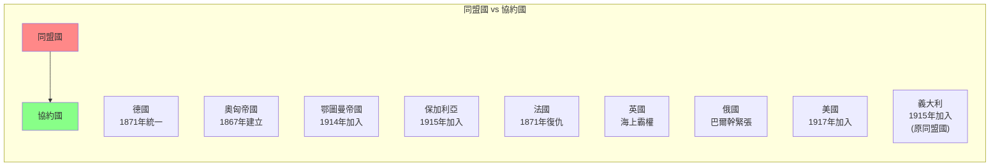
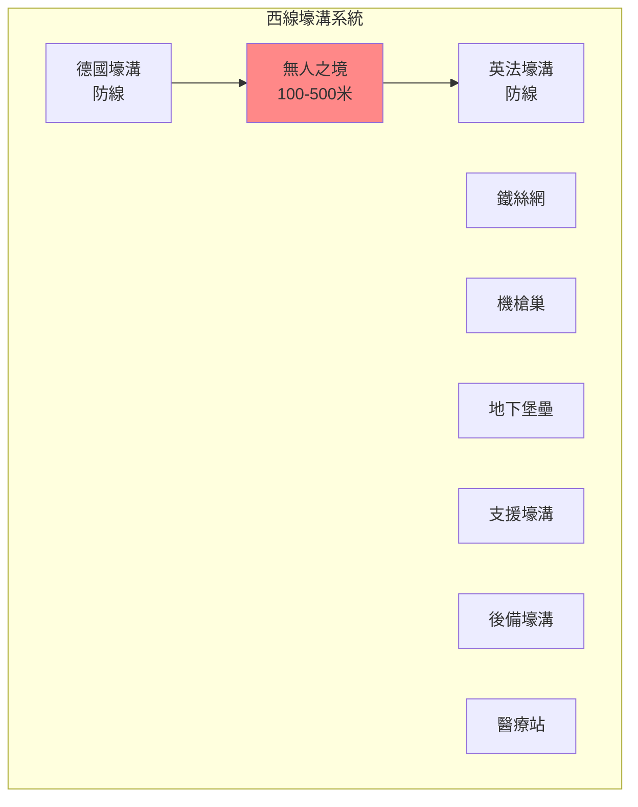
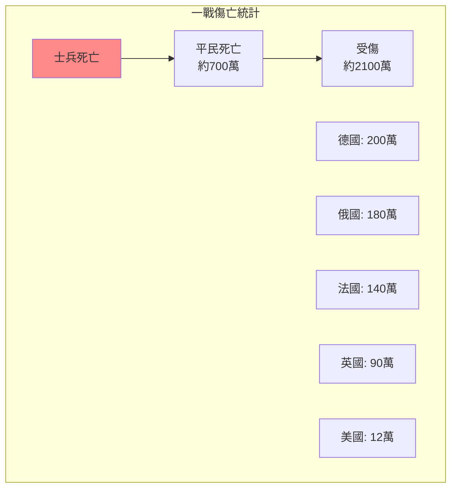
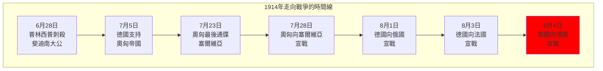
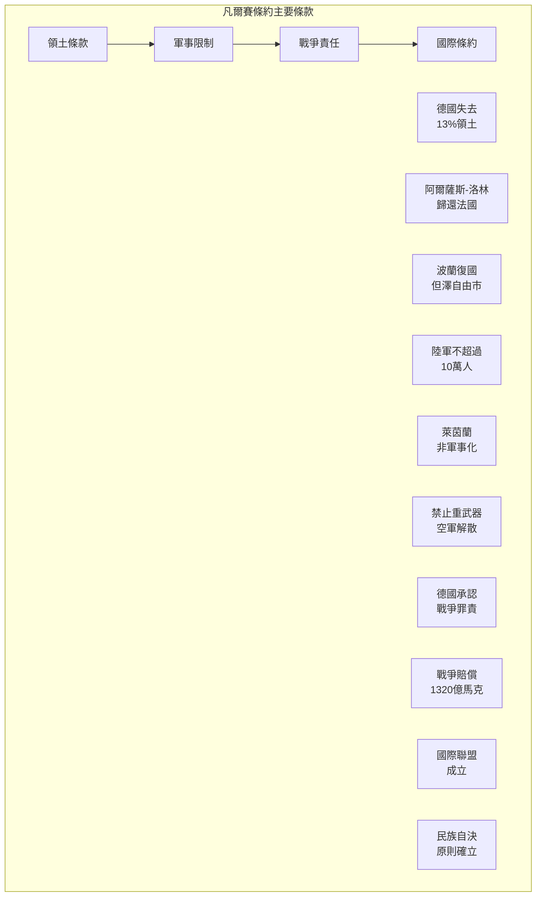

# Hist 14 第一次世界大戰 / The First World War

**Instructor**: Jamie Martin
**Department**: History, Harvard
**Official source**: history.fas.harvard.edu
**Big Question**: 我們如何將第一次世界大戰理解為一場具有深遠影響的全球衝突？
**Style**: 袁騰飛式

---

## 問題 1：5 個 SPECIFIC 核心心智模型

### 1. 一戰的「全球化」維度 (Global Dimensions of WWI)
**真實學者**: Hew Strachan (牛津大學) —《The First World War》(2003) 分析戰爭的全球性。  
**真實事件**: 1914年6月28日薩拉熱窩事件；1917年4月6日美國參戰；1918年11月11日停戰。  
**真實數字**: 40個國家和殖民地參戰，動員約6500萬人。

### 2. 壕溝戰的恐怖 (The Horror of Trench Warfare)
**真實學者**: John Keegan (英國軍事歷史學家) —《The First World War》(1998) 經典描述。  
**真實事件**: 1916年7月1日索姆河戰役第一天，英軍58,000人傷亡；1915年4月22日伊普雷斯首次使用化學武器。  
**真實數字**: 索姆河戰役持續141天，雙方約100萬人傷亡。

### 3. 帝國主義戰爭與民族自決 (Imperial War and National Self-Determination)
**真實學者**: Margaret MacMillan (多倫多大學) —《Paris 1919》(2001) 分析戰後和會。  
**真實事件**: 1919年6月28日凡爾賽條約；威爾遜的「十四點計劃」；中東的賽克斯-皮科秘密協定。  
**真實數字**: 條約導致了中東新邊界的劃定，埋下持續衝突的種子。

### 4. 俄國革命與冷戰的起源 (Russian Revolution and Origins of Cold War)
**真實學者**: Orlando Figes (倫敦大學) —《A People's Tragedy》(1996) 分析俄國革命。  
**真實事件**: 1917年3月（俄曆2月）二月革命；1917年11月（俄曆10月）十月革命；1918年8月蘇俄退出戰爭。  
**真實數字**: 俄國革命最終導致了蘇聯的建立和冷戰的形成。

### 5. 戰爭與記憶政治 (War and Memory Politics)
**真實學者**: Jay Winter (耶魯大學) —《Sites of Memory, Sites of Mourning》(2014) 分析戰爭記憶。  
**真實事件**: 1922年《西線無戰事》出版；1962年《永恆的戰爭》紀念碑建成；2014年一戰百年紀念。  
**真實數字**: 一戰造成約1700萬人死亡（士兵和平民）。

---

## 問題 2：3 個 SPECIFIC 根本分歧

### 分歧一：一戰是否可以避免
**學者A**: 傳統觀點  
論點：戰爭並非不可避免，如果關鍵時刻做了不同選擇。

**學者B**: Christopher Clark (劍橋大學) —《The Sleepwalkers》(2012)  
論點：歐洲領導人像「夢遊者」一樣走向戰爭，缺乏對後果的清醒認識。

### 分歧二：德國的戰爭責任
**學者A**: 傳統德國觀點  
論點：德國對戰爭爆發負有主要責任。

**學者B**: Fritz Fischer (漢堡大學) —《Germany's Aims in the First World War》(1967)  
論點：德國的擴張主義野心是戰爭的主要原因。

### 分歧三：一戰是否是「不必要的戰爭」
**學者A**: Niall Ferguson (哈佛) —《The Pity of War》(1998)  
論點：如果英國不參戰，歐洲會有更好的結果。

**學者B**: 主流英國史學  
論點：英國參戰是必要的，否則會導致德國控制歐洲。

---

## 問題 3：10 個 PROBING 深度問題

1. 比較1914年6月28日的薩拉熱窩刺殺和2001年9月11日的恐怖襲擊：這兩次「震驚世界」的事件如何塑造了各自時代的國際秩序？

2. 為什麼一戰的壕溝戰如此恐怖？這種戰爭形式如何揭示了工業時代戰爭的「非人性化」本質？

3. 分析1917年美國參戰的動機：美國是為了「民主」還是為了經濟利益而參戰？威爾遜的「戰爭目標」和現實主義利益之間有什麼差距？

4. 俄國十月革命如何改變了戰爭的性質？蘇俄退出戰爭是否是一種「背叛」還是「理性的選擇」？

5. 凡爾賽條約被普遍認為「太苛刻」——但對德國人來說，這種「苛刻」是什麼程度？這種條約如何塑造了德國人的「受害者」敘事？

6. 賽克斯-皮科秘密協定如何在中東製造了持續100年的衝突？從巴勒斯坦到伊拉克，今天的中東亂局有多少可以直接追溯到1916年的這個秘密協定？

7. 為什麼一戰在西方文化記憶中「消失」了？這種「遺忘」和二戰記憶的「突出」之間有什麼心理和政治原因？

8. 一戰催生了許多「20世紀的現象」：共產主義、法西斯主義、納粹主義、女性參政權——這些「遺產」之間有什麼聯繫？

9. 分析壕溝戰中的「普通士兵」經驗：從《西線無戰事》到戰爭詩歌，普通士兵的視角如何挑戰了「英雄主義」的戰爭敘事？

10. 如果歷史可以重來，哪些「關鍵時刻」可能改變一戰的走向？這種「反事實」歷史思考有意義嗎？

---

## 5 個 Mermaid 圖解

### 圖1：同盟國與協約國的形成

### 圖2：西線壕溝戰的結構

### 圖3：一戰傷亡統計

### 圖4：1914年的「七月危機」

### 圖5：凡爾賽條約的主要條款

---

## 總結

**Hist 14** 的核心洞察：第一次世界大戰不僅是一場歐洲戰爭，而是一場真正意義上的全球衝突。它終結了四個帝國，催生了共產主義和法西斯主義，並在歐洲人的心理上留下了難以磨滅的創傷——這一切為20世紀更大的災難埋下了伏筆。

**三個必須記住的數字**：
- **1700萬人**：一戰總死亡人數
- **6500萬人**：各國動員總兵力
- **1914年6月28日**：薩拉熱窩事件

**必須記住的日期**：
- **1914年6月28日**：普林西普刺殺斐迪南大公
- **1914年8月4日**：英國向德國宣戰
- **1917年4月6日**：美國向德國宣戰
- **1918年11月11日**：上午11點停戰

**袁騰飛金句**：「一戰是20世紀的『大爆炸』——它炸掉了四個皇帝，炸出了一個列寧，炸出了一個希特勒，最後炸出了兩顆原子彈和冷戰。歷史不會重演，但歷史會押韻。一戰的教訓不是『戰爭是地獄』那麼簡單——而是『當所有領導人都想避免戰爭卻走向戰爭』的時候，這個世界到底哪裡出了問題。」