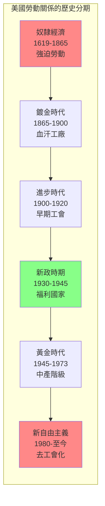
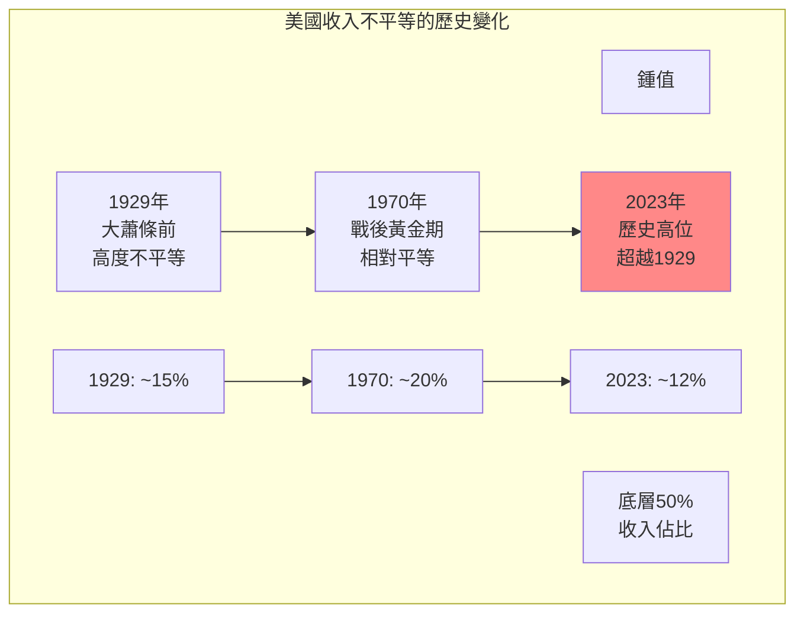
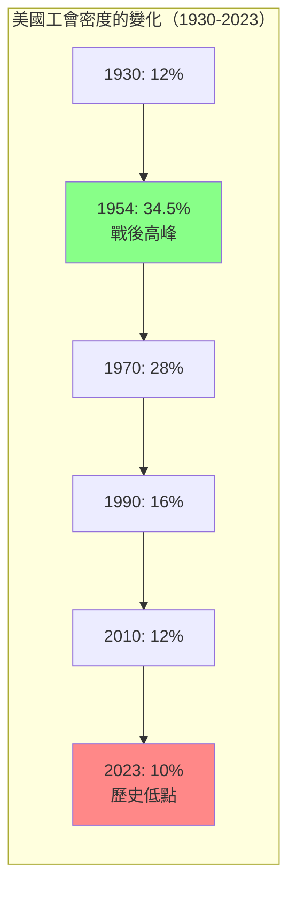
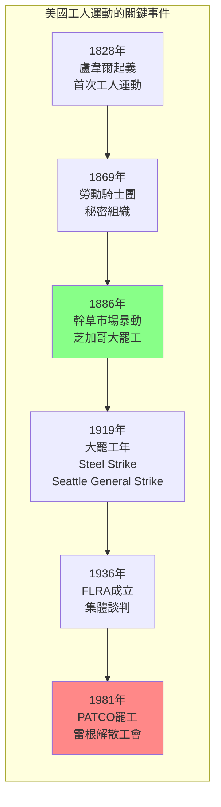
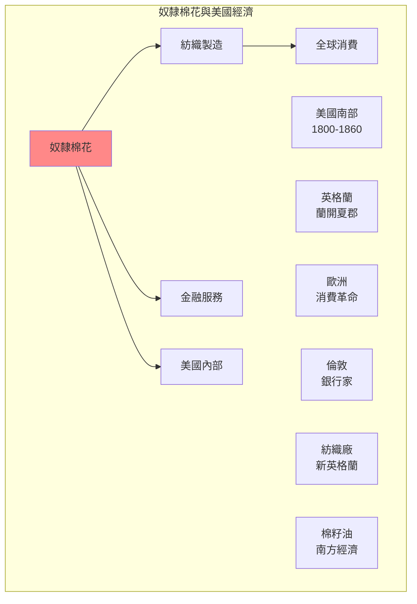

# Hist 21 勞動、自由與衝突 / Labor, Liberty, and Conflict in American History

**Instructor**: Joel Suarez
**Department**: History, Harvard
**Official source**: history.fas.harvard.edu
**Big Question**: 勞動歷史的視角如何照亮從殖民時期到現在對自由概念的演變理解？
**Style**: research-based

---

## 問題 1：5 個 SPECIFIC 核心心智模型

### 1. 奴隸勞動與美國資本主義 (Slave Labor and American Capitalism)
**真實學者**: Edward Baptist (康奈爾大學) —《The Half Has Never Been Told》(2014) 分析奴隸勞動與美國經濟增長。  
**真實事件**: 1619年第一批奴隸抵達；1808年禁止國際奴隸貿易；1865年第十三條修正案廢除奴隸制。  
**真實數字**: 奴隸勞動創造的美國GDP增長估計佔1860年前總量的約1/3。

### 2. 從工匠到工廠工人 (From Artisans to Factory Workers)
**真實學者**: Sean Wilentz (普林斯頓大學) —《Chants Democratic》(1984) 分析工人階級的形成。  
**真實事件**: 1820年代盧韋爾起義；1850年代機械化紡織；1869年格蘭特大陸工人罷工。  
**真實數字**: 1860年約500萬工人在工廠工作，佔勞動力約15%。

### 3. 工會運動的興起與衰落 (Rise and Fall of Labor Unions)
**真實學者**: Rosemary Feurer (北伊利諾大學) — 分析19世紀工人運動。  
**真實事件**: 1869年勞動騎士團成立；1886年幹草市場暴動；1935年瓦格納法案。  
**真實數字**: 工會密度從1954年的34.5%下降到2023年的10%。

### 4. 新政與福利國家的建立 (New Deal and the Welfare State)
**真實學者**: Alice Kessler-Harris (哥倫比亞大學) —《In Pursuit of Equity》(2007) 分析新政的性別維度。  
**真實事件**: 1933年國家工業復興法案；1935年社會保障法案；1963年同工同酬法案。  
**真實數字**: 新政期間建立了最低工資、加班費、失業保險等基本保障。

### 5. 去工業化與新自由主義 (Deindustrialization and Neoliberalism)
**真實學者**: Jefferson Cowie (康奈爾大學) —《The Great Exception》(2016) 分析戰後黃金時代的終結。  
**真實事件**: 1970年代鋼鐵和汽車工業衰落；1979年伊朗革命後的通脹；1980年雷根當選。  
**真實數字**: 1979-1983年間，約240萬製造業工作消失。

---

## 問題 2：3 個 SPECIFIC 根本分歧

### 分歧一：奴隸制是否阻礙了美國資本主義
**學者A**: Baptist等馬克思主義學者  
論點：奴隸制是美國資本主義的核心組成部分。

**學者B**: 修正主義經濟史學家  
論點：奴隸制最終會被市場力量消滅。

### 分歧二：工會是進步的還是保守的
**學者A**: 工會支持者  
論點：工會是美國民主的重要支柱，保護工人權利。

**學者B**: 新自由主義批評者  
論點：工會保護內部人，損害外部人和經濟效率。

### 分歧三：雷根革命的真實遺產
**學者A**: 保守派歷史學家  
論點：雷根代表了對過度政府和稅收的必要反擊。

**學者B**: 進步派歷史學家  
論點：雷根開啟了美國不平等加劇的時代。

---

## 問題 3：10 個 PROBING 深度問題

1. 奴隸制和美國建國的「自由」話語之間有什麼關係？奴隸主如何同時宣揚自由和擁有奴隸？

2. 比較1886年芝加哥幹草市場暴動和2020-2021年亞馬遜倉庫工人的組織行動：這130年間工人階級鬥爭的連續性是什麼？

3. 為什麼美國沒有社會主義政黨？比較美國勞工運動和歐洲各國的社會民主主義運動。

4. 分析1930年代新政和2020年代「民主黨的社會主義」之間的歷史聯繫：桑德斯和沃倫代表了什麼樣的傳統？

5. 去工業化如何影響了工人階級社區？比較1970-1990年代的「銹帶」和今天中國的「東北振興」政策。

6. 奴隸制如何影響了美國的白人工人階級？這種歷史遺產如何塑造了今天美國政治的種族兩極化？

7. 分析女性和移民工人在美國勞動史中的特殊位置：她們如何同時被邊緣化和組織化？

8. 從奴隸制到血汗工廠，從卡車司機到亞馬遜倉庫工人——美國勞動者的「脆弱性」有什麼歷史連續性？

9. 工會密度的下降和美國不平等的加劇之間有什麼因果關係？這種關係是否可以逆轉？

10. 如果勞動歷史是我們理解美國過去的關鍵——那麼什麼是「美國夢」的真正歷史？它是什麼時候開始成為神話的？

---

## 5 個 Mermaid 圖解

### 圖1：美國勞動關係的歷史分期

### 圖2：美國不平等的「U型曲線」

### 圖3：工會密度的歷史變化

### 圖4：工人階級運動的關鍵時刻

### 圖5：奴隸勞動與棉花帝國

---

## 總結

**Hist 21** 的核心洞察：美國勞動歷史揭示了「自由」的矛盾性——在奴隸主宣揚自由和擁有奴隸之間，在工廠主慶祝進步和剥削工人之間。理解這段歷史是理解當代美國政治經濟不平等等問題的關鍵。

**三個必須記住的數字**：
- **1619年**：第一批非洲奴隸抵達維吉尼亞
- **34.5%**：1954年工會密度的歷史峰值
- **10%**：2023年工會密度，歷史低點

**必須記住的日期**：
- **1619年8月**：第一批奴隸抵達
- **1865年4月**：林肯遇刺；12月第十三條修正案
- **1886年5月4日**：幹草市場暴動
- **1935年7月**：瓦格納法案

**research-based金句**：「美國勞動史不是一個關於進步的故事，而是一個關於階級的故事。奴隸在田裡工作，工人在工廠工作，亞馬遜倉庫工人在演算法下工作——三個時代，三種剝削，但都是同一個故事的延續：誰控制了勞動，誰就控制了美國。」