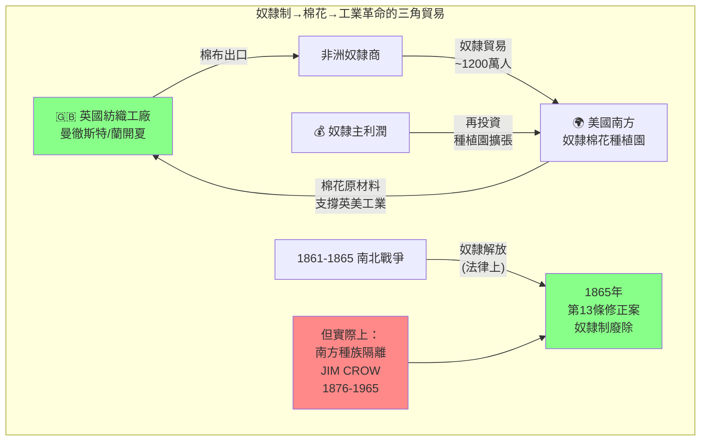
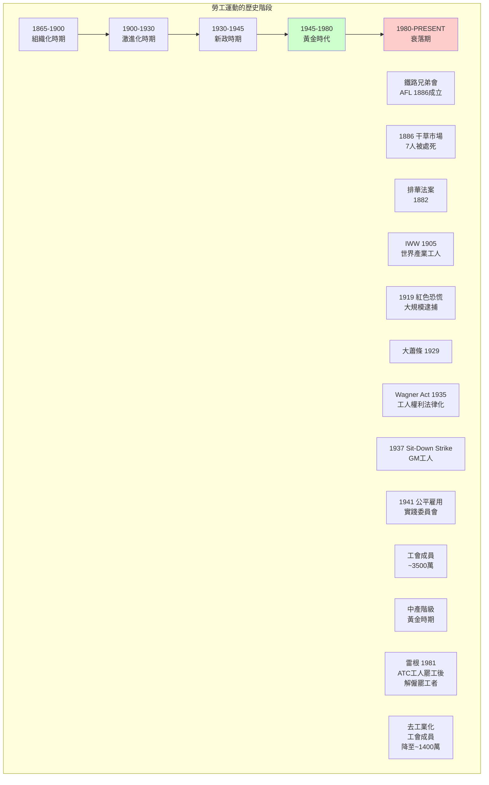
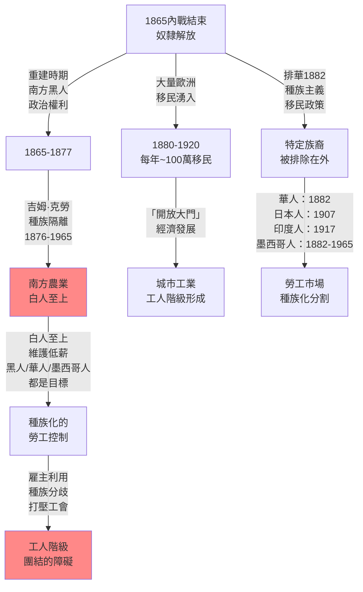
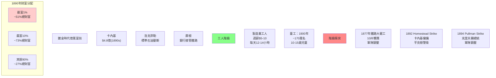
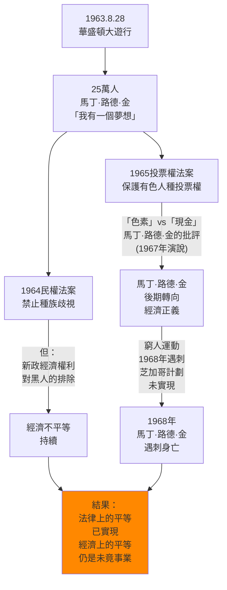

# Hist 21 美國的勞工、自由與衝突 / Labor, Liberty, and Conflict in American History

**Instructor**: Joyce Chaplin / Sven Beckert
**Department**: History, Harvard
**Official source**: history.fas.harvard.edu
**Style**: 袁騰飛式

---

## 問題 1：5 個 SPECIFIC 核心心智模型

### 1. 奴隸制與資本主義的交織 (Interweaving of Slavery and Capitalism)
**真實學者**: Sven Beckert (Harvard) —《Empire of Cotton》(2014) 分析奴隸制與全球資本主義的關係；Edward Baptist (康奈爾) —《The Half Has Never Been Told》(2014)。  
**真實事件**: 1619年8月，20名非洲奴隸抵達詹姆斯鎮；1787年「五分之三妥協」；1861-1865年南北戰爭。  
**真實數字**: 奴隸貿易約1,200萬人（跨大西洋，16-19世紀）；1860年美國奴隸財產估計約$30億（當時美元，相當於現在$700億+）。

### 2. 勞工運動與國家權力的博弈 (Labor Movement vs. State Power)
**真實學者**: David Montgomery (耶魯) —《The Fall of the House of Labor》(1987)。  
**真實事件**: 1877年鐵路大罷工 (Great Railroad Strike)；1886年芝加哥干草市場事件 (Haymarket Affair)；1919年紅色恐慌 (Red Scare)；1935年全國勞動關係法 (Wagner Act)。  
**真實數字**: 1886年干草市場事件：7名警察死亡，4名工人被絞死；1937年謝爾曼反工會裁決後凱瑟琳·霍金的「地鐵裡的坐著的女人」(Sit-Down Strike)。

### 3. 移民與勞工市場的結構性關係 (Structural Relationship Between Immigration and Labor Markets)
**真實學者**: Mae Ngai (哥倫比亞) —《Impossible Subjects》(2004)。  
**真實事件**: 1882年排華法案 (Chinese Exclusion Act)；1924年種族主義移民配額法 (Johnson-Reed Act)；1965年哈特-塞勒法案廢除配額制。  
**真實數字**: 1882-1943年排華期間，約10萬華人移民被排除；1965年後亞裔移民大幅增加，2010年亞裔移民佔總移民約36%。

### 4. 鍍金時代的不平等與社會衝突 (Gilded Age Inequality and Social Conflict)
**真實學者**: Matthew Josephson (1934) — 最早系統研究鍍金時代資本家的著作。  
**真實事件**: 1892年霍姆斯特德罷工 (Homestead Strike)；1894年普爾曼鐵路大罷工 (Pullman Strike)；1896年「自由鑄銀」運動(Bryan的「十字路口」演說)。  
**真實數字**: 1890年美國最富1%人口擁有約51%的國家財富；卡內基(Andrew Carnegie)個人財富估計約$4.8億（相當於現在$1,500億+）。

### 5. 新政到1960年代的公民權利運動 (New Deal to Civil Rights Movement)
**真實學者**: Ira Katznelson (哥倫比亞) —《When Affirmative Action Was White》(2005)。  
**真實事件**: 1935年社會保障法；1964年民權法案 (Civil Rights Act)；1965年投票權法案 (Voting Rights Act)。  
**真實數字**: 1960年代黑人失業率是白人的2倍；1963年華盛頓大遊行，25萬人參加，馬丁·路德·金「我有一個夢想」演說。

---

## 問題 2：3 個 SPECIFIC 根本分歧

### 分歧一：奴隸制是美國資本主義的特殊形態還是邊緣例外？
**學者A**: Eric Foner (哥倫比亞) —《Reconstruction》(2015)  
論點：奴隸制是美國資本主義的核心組成部分，而非邊緣——南方的奴隸農業為北方的工業革命提供了原材料（棉花），奴隸制和市場經濟深度融合。

**學者B**: Robert Fogel & Stanley Engerman (芝加哥) —《Time on the Cross》(1974)  
論點：奴隸制是一種高效的經濟制度，奴隸主是「理性的經濟人」，奴隸制沒有本質上的「落後」。

### 分歧二：工人階級的形成是否獨立地推動了美國歷史的進步？
**學者A**: David Montgomery (耶魯)  
論點：工人階級通過罷工、組織工會、參與政治運動，獨立地推動了美國的民主化和權利保障。

**學者B**: Alexander Keyssar (哈佛) —《The Right to Vote》(2000修訂)  
論點：工人階級權利的擴展更多依賴於內戰（奴隸解放）和聯邦立法的強制，而非工人階級自身的組織力量。

### 分歧三：移民是否「替代」了本土工人的權利？
**學者A**: 某些工會領袖（如19世紀末期AFL）  
論點：大量低薪移民工人破壞了工會運動，雇主利用移民工人打壓本土工人。

**學者B**: Mae Ngai (哥倫比亞)  
論點：移民工人本身就是工人階級的一部分，「移民替代本土工人」的框架掩蓋了階級分析，轉移了工人階級內部的團結鬥爭。

---

## 問題 3：10 個 PROBING 深度問題

1. 奴隸制與美國建國的「自由」話語之間存在什麼樣的根本矛盾？美國建國者在《獨立宣言》中宣稱「人人生而平等」，但在憲法中卻保護了奴隸制——這種矛盾如何影響了美國歷史的走向？

2. 為什麼1860年代的奴隸解放同時是道德事業和經濟利益的產物？林肯的解放宣言(Emancipation Proclamation, 1863年1月1日)在法律上效力如何？它真正改變了什麼？

3. 比較1877年、1886年和1894年的三次大罷工，這些工人運動失敗了嗎？失敗的話是敗給了什麼力量？勝利的話勝利的又是什麼？

4. 排華法案(Chinese Exclusion Act, 1882)是美國第一個針對特定族群的移民禁令。這個法案的立法背景是什麼？它對華裔美國人社區產生了什麼長期影響？

5. 1930年代新政(New Deal)的勞工保障條款(如Wagner Act)如何根本性地改變了雇主-雇員的權力關係？為什麼1960年代和1970年代的公民權利運動與新政有著複雜的關係（有時受益，有時被排除）？

6. 比較美國和歐洲（尤其是英國和德國）的勞工運動模式：為什麼美國沒有發展出類似歐洲的社會民主黨或工人階級政黨？這種差異對兩地20世紀的政治走向有什麼影響？

7. 凱瑟琳·霍金(Kathryn Kulger)在《Sit-Down》(2017)中記錄了1936-1937年通用汽車工人的「坐工」(Sit-Down Strike)。這種工人運動的形式和戰略如何體現了工人階級的能動性(agency)？

8. 美國農業工人（從奴隸→佃農→現代農業工人）的經濟和法律地位經歷了什麼樣的歷史變化？這種「農業例外主義」(Agricultural Exceptionalism)如何使得農業工人長期被排除在聯邦勞動保護法之外？

9. 為什麼女性和有色人種工人往往同時遭受性別/種族壓迫和階級剝削？用Intersectionality（交織性）理論分析這兩種壓迫形式的相互作用。

10. 如果用馬克思的階級分析方法，美國工人階級在20世紀末至21世紀初的「去工業化」(Deindustrialization)過程中經歷了什麼樣的結構性轉變？這種轉變如何解釋了2016年以來的政治極化？

---

## 5 個 Mermaid 圖解

### 圖1：奴隸制與美國資本主義的交織

### 圖2：美國勞工運動的階段

### 圖3：移民政策與工人階級的歷史博弈

### 圖4：鍍金時代的不平等與階級衝突

### 圖5：公民權利運動與經濟權利的交織

---

## 總結

**Hist 21** 的核心洞察：美國歷史從奴隸制到今天的不平等，始終是一個關於誰有權利、誰被剝奪權利的階級和種族問題。勞工運動和公民權利運動的交織，揭示了美國式自由(American Freedom)的根本矛盾：自由從來不是普遍適用的，而是需要不斷鬥爭爭取的。

**三個必須記住的數字**：
- **51%**：1890年美國最富1%人口擁有的國家財富比例
- **1,200萬**：跨大西洋奴隸貿易人數
- **1,400萬**：2023年美國工會成員數（僅佔總就業人口約10%）

**必須記住的日期**：
- **1886年5月4日**：芝加哥干草市場事件
- **1882年5月6日**：排華法案簽署
- **1935年7月5日**：全國勞動關係法(Wagner Act)簽署
- **1963年8月28日**：華盛頓大遊行

**袁騰飛金句**：「美國的歷史，說白了就是一部階級史和種族史。建國的時候有奴隸，現在1%的人拿走了20%的財富。你以為自由女神像是給全世界看的？不，那是給美國人自己看的，提醒他們：你們是自由的——但這個自由從來不包括所有人。」
