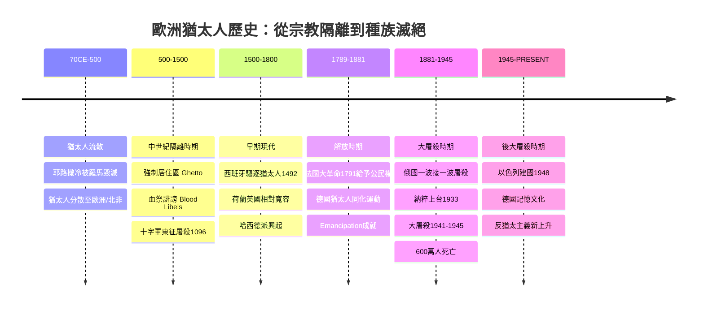
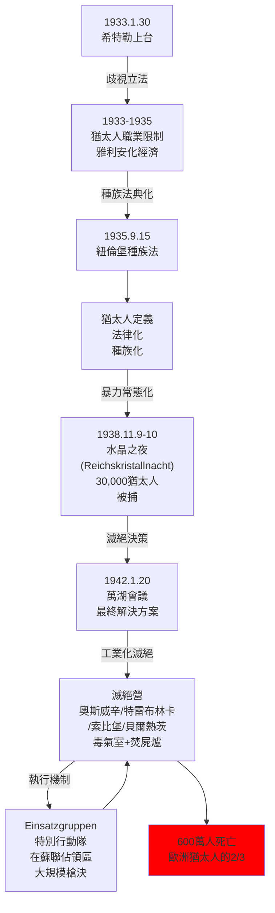
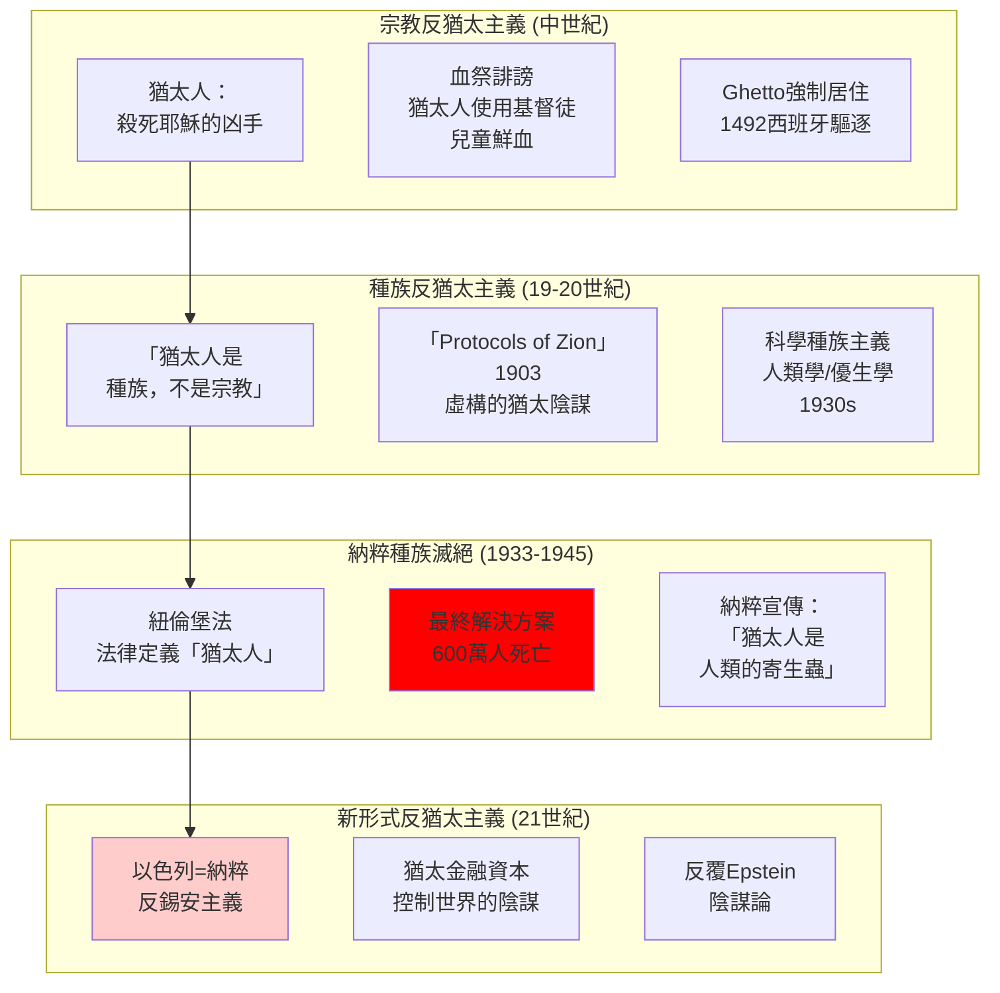
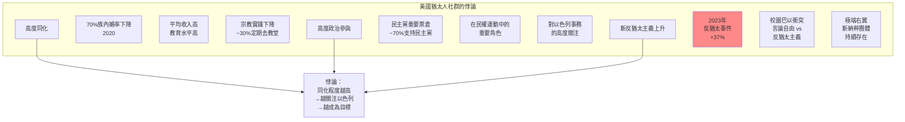

# Hist 32A 現代世界的猶太人 / Jews in the Modern World

**Instructor**: David M. Shtob (based on course listing)
**Department**: History, Harvard
**Official source**: history.fas.harvard.edu; cjs.fas.harvard.edu
**Style**: 袁騰飛式

---

## 問題 1：5 個 SPECIFIC 核心心智模型

### 1. 現代性與猶太人的「選擇」(Modernity and the Jewish "Choice")
**真實學者**: Yuri Slezkine (科羅拉多大學) —《The Jewish Century》(2006) 提出猶太人是「人類管家」(human Mercurians)的理論，分析猶太人在現代化中的特殊角色。  
**真實事件**: 1791年法國革命時期法國給予猶太人公民權；1880年代德國「猶太人解放」(Emancipation)；1882年錫安主義運動興起；1948年以色列建國。  
**真實數字**: 1800年歐洲猶太人口約250萬；1939年二戰前歐洲猶太人口約950萬；2024年全球猶太人口約1,500萬。

### 2. 大屠殺(Holocaust)的結構性根源 (Structural Roots of the Holocaust)
**真實學者**: Raul Hilberg (加州大學, 《The Destruction of the European Jews》1961, 2003三卷本)；Timothy Snyder (耶魯) —《Black Earth》(2015) 分析納粹滅絕的生態和經濟背景。  
**真實事件**: 1933年1月30日希特勒上台；1935年紐倫堡種族法 (Nuremberg Laws)；1941年6月22日「特別行動隊」(Einsatzgruppen) 開始大規模槍決；1942年1月20日萬湖會議(Wannsee Conference)確定「最終解決方案」；1944年6月6日布痕瓦爾德解放。  
**真實數字**: 600萬猶太人在大屠殺中被殺害（歐洲猶太人口的約三分之二）；納粹建立了約4萬個大屠殺設施（含集中營、滅絕營、槍決地點）。

### 3. 錫安主義與以色列建國的複雜遺產 (Zionism and the Complex Legacy of Israel's Founding)
**真實學者**: Rashid Khalidi (哥倫比亞) —《The Hundred Years' War on Palestine》(2020) 從巴勒斯坦視角分析錫安主義。  
**真實事件**: 1897年第一屆錫安主義代表大會（巴塞爾，赫茨爾主持）；1917年貝爾福宣言；1948年5月14日以色列建國；1948年「災難」(Nakba)，約70-80萬巴勒斯坦人流離失所。  
**真實數字**: 1948年Nakba中，巴勒斯坦村莊約530個被摧毀或佔領；2024年巴勒斯坦难民约580萬人，分布在約60個營地。

### 4. 美國猶太人的同化與獨特性 (American Jewish Assimilation and Distinctiveness)
**真實學者**: Jonathan Sarna (布蘭迪斯大學) —《American Judaism》(2004)。  
**真實事件**: 1880年代東歐猶太人大批移民美國；1924年移民配額法限制東歐猶太人；1960年代民權運動中美國猶太社群的深度參與；2020年代反猶太主義事件增加。  
**真實數字**: 2023年美國猶太人口約750萬，佔全球猶太人口約50%；美國猶太人平均收入高於美國平均水平，但在政治傾向上高度自由主義（60-70%支持民主黨）。

### 5. 歐洲反猶太主義的演變 (Evolution of European Antisemitism)
**真實學者**: Robert Wistrich (希伯來大學) —《Antisemitism: The Longest Hatred》(1991)。  
**真實事件**: 1881年俄國屠殺猶太人(Pogroms)；1903年「猶太人問答書」(The Protocols of the Elders of Zion) 首次出版；1933年納粹開始系統性歧視猶太人；2018年匹茲堡猶太教堂槍擊案（11人死亡）。  
**真實數字**: 1881-1914年俄國「一波接一波」的反猶太屠殺；2023年FBI報告：反猶太事件較2022年增加約37%。

---

## 問題 2：3 個 SPECIFIC 根本分歧

### 分歧一：大屠殺是歐洲反猶太主義歷史的「例外」還是「必然」？
**學者A**: Saul Friedländer (加州大學) —《Nazi Germany and the Jews》(1997, 2007)  
論點：大屠殺是歐洲一個半世紀以來反猶太主義話語的「極端化」——從宗教偏見到種族歧視，從歧視到種族滅絕，是一個連續的歷史過程。

**學者B**: Daniel Goldhagen (哈佛) —《Hitler's Willing Executioners》(1996)  
論點：大屠殺不能簡單歸結為歐洲反猶太主義的「自然延伸」——納粹意識形態和德國民眾的「eliminationist antisemitism」（消除性反猶太主義）是獨特的，不能與其他歐洲國家的反猶太主義相提並論。

### 分歧二：錫安主義是正義的民族解放運動還是殖民行為？
**學者A**: Benny Morris (本·古里安大學) — 右翼錫安主義歷史學家  
論點：錫安主義是歐洲猶太人面對系統性迫害的合理回應，是19世紀民族主義浪潮中的正常現象，以色列的建立是正義的民族自決行為。

**學者B**: Rashid Khalidi (哥倫比亞) —《The Hundred Years' War on Palestine》(2020)  
論點：錫安主義運動在巴勒斯坦的土地上建立猶太多數國家，必然涉及對當地阿拉伯人口的政治和軍事支配——這在客觀效果上與歐洲殖民主義的模式高度相似。歷史的「正義」問題不能脫離巴勒斯坦人的苦難來回答。

### 分歧三：反猶太主義是「穆斯林/阿拉伯」的問題還是西方文明的普遍問題？
**學者A**: 有些西方政治人物  
論點：中東地區的反猶太主義主要源於伊斯蘭原教旨主義和阿拉伯民族主義，是獨特的宗教和文化現象。

**學者B**: 歷史學家  
論點：反猶太主義是一個西方現象——起源於中世紀歐洲基督教反猶太主義，20世紀納粹大屠殺也是歐洲文明的產物。現代以色列-巴勒斯坦衝突中的反猶太主義只是這一傳統的延續，而非新的伊斯蘭發明。

---

## 問題 3：10 個 PROBING 深度問題

1. 為什麼說大屠殺(Holocaust)不能只用「歐洲反猶太主義」來解釋？納粹意識形態的「種族科學」和19世紀歐洲的科學種族主義之間是什麼關係？

2. 「萬湖會議」(1942年1月20日)是歷史上最邪惡的會議之一——這15個納粹官員在一個湖邊的別墅裡，討論如何系統性地殺害600萬猶太人。這個會議的過程如何揭示了大屠殺的「官僚主義理性」(bureaucratic rationality)特徵？

3. 比較歐洲猶太人、美國猶太人和以色列猶太人在20世紀的命運軌跡，分析「現代性」(modernity)對猶太人而言究竟是解放還是災難，或者兩者同時存在？

4. 1948年的Nakba（巴勒斯坦「災難」）與同一年以色列建國是同一歷史事件的不同面向。如何理解這兩個群體對同一個歷史事件截然對立的集體記憶？

5. 為什麼俄國1881年的大屠殺(Pogroms)成為錫安主義( Zionism)興起的直接催化劑？而在德國，猶太人同化程度更高，錫安主義的吸引力反而較小？這揭示了什麼關於錫安主義興起的社會條件？

6. 大屠殺的記憶政治(memory politics)在戰後歐洲和美國有什麼不同的表現？德國的「記憶文化」(Erinnerungskultur)和美國的「大屠殺教育」在政治和教育上有什麼不同的功能和局限？

7. 美國猶太人社群的同化程度極高（ intermarriage rates達70%），但同時以色列事務在美國外交政策中佔有不成比例的重要性。如何解釋這種「距離悖論」(paradox of distance)？

8. 如果用Hannah Arendt的分析框架（大屠殺是「平庸之惡」(banality of evil)的極端表現），那麼「普通德國人」在大屠殺中扮演什麼角色？這種分析是否為大屠殺的責任者提供了「開脫」？

9. 比較大屠殺的「獨特性」(uniqueness)和「普遍性」(universality)兩種話語——前者強調大屠殺不可比較，後者強調大屠殺是人類暴行的一種模式。這兩種話語各自的意識形態和政治功能是什麼？

10. 為什麼2020年代以來全球反猶太事件急劇增加（從紐約到柏林到好萊塢）？這種增加與社交媒體時代的極化、COVID-19陰謀論、以及以哈戰爭(2023.10.7)之間有什麼關係？

---

## 5 個 Mermaid 圖解

### 圖1：歐洲猶太人歷史的千年軌跡


### 圖2：大屠殺的制度化過程


### 圖3：錫安主義運動與以色列建國的歷史糾葛
```mermaid
graph TD
    subgraph "錫安主義興起"
        A["1882\n錫安主義運動\n「比亞韋斯托克」"]
        B["1897\n第一屆錫安主義\n代表大會\n巴塞爾"]
        C["1917\n貝爾福宣言\n英國支持猶太家園"]
        D["1920-30s\n猶太移民增加\n土地購買"]
    end
    
    subgraph "巴勒斯坦阿拉伯人的回應"
        A -->|"猶太人在巴的土地\n購買增加"| E["阿拉伯起義\n1920, 1929, 1936-39"]
        C -->|"英國委任統治\n優先照顧猶太移民"| E
    end
    
    subgraph "1948年Nakba"]
        F["1947聯合國分治\n方案 181號"]
        F -->|"1948.5.14\n以色列建國"| G["阿拉伯國家\n反對\n戰爭爆發"]
        E --> G
        G -->|"70-80萬\n巴勒斯坦人\n流離失所"| H["Nakba\n「災難」"]
    end
    
    style H fill:#f88
    style G fill:#fcc
```

### 圖4：反猶太主義的歷史演變


### 圖5：美國猶太人的同化悖論


---

## 總結

**Hist 32A** 的核心洞察：猶太人近現代史是一部關於現代性的悖論史——現代性既帶來了解放（公民權、同化機會），也帶來了前所未有的毀滅（大屠殺）。理解這段歷史，不僅是理解猶太人的命運，更是理解現代國家的暴力潛能和人類道德的極限。

**三個必須記住的數字**：
- **600萬**：大屠殺中被殺害的猶太人人數
- **70%**：當代美國猶太人的族內婚率下降幅度
- **1948年5月14日**：以色列建國

**必須記住的日期**：
- **1933年1月30日**：希特勒上台
- **1942年1月20日**：萬湖會議
- **1944年4月11日**：布痕瓦爾德集中營解放
- **1948年5月14日**：以色列建國
- **2023年10月7日**：哈馬斯襲擊以色列，引發加沙戰爭

**袁騰飛金句**：「大屠殺這件事，是人類歷史上的一個深淵。但你得記住一件事：600萬人不是一個抽象的數字，每一個人都是有名有姓的，都是父母養大的，都是有故事的。在歷史書上，它們被簡化成一個數字；但在歷史上，每一個數字背後都是一整個宇宙的故事。」
