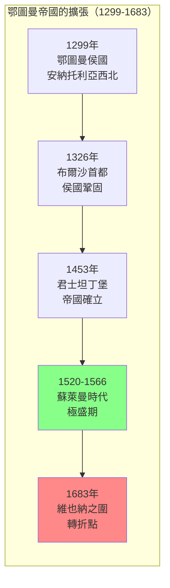
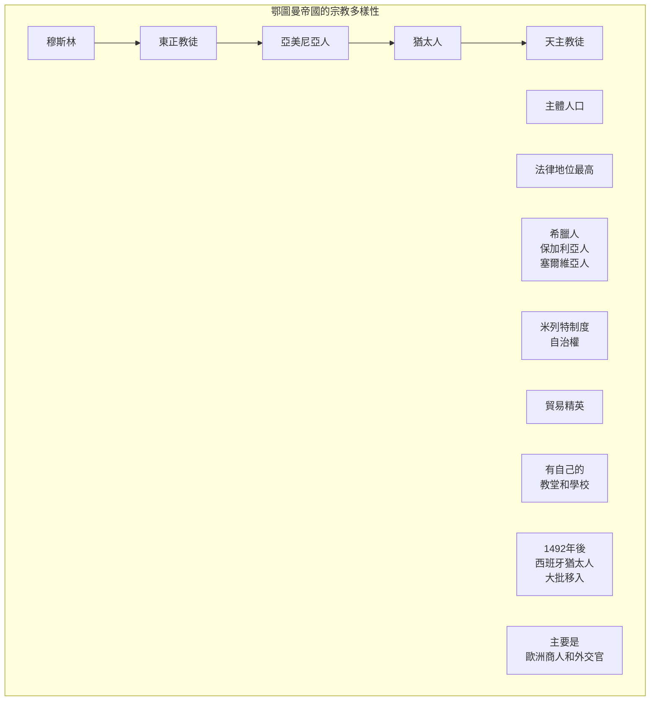
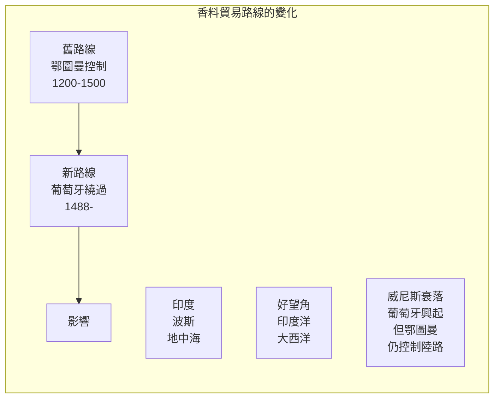
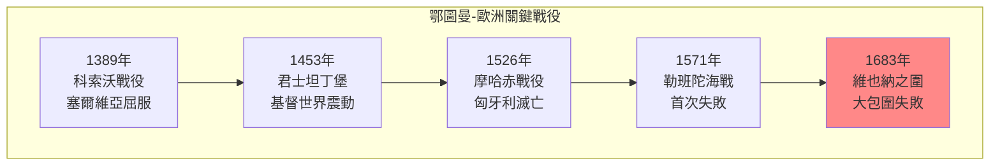
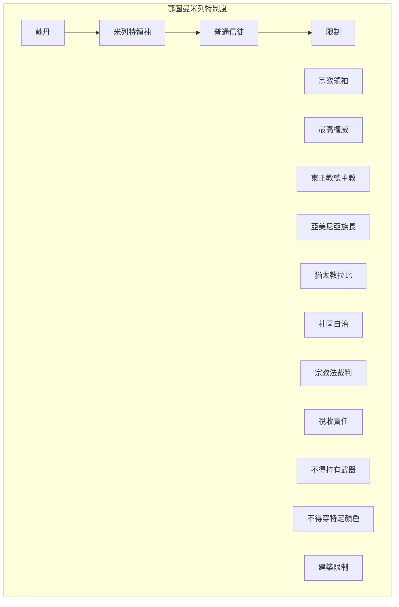

# Hist 32A 鄂圖曼帝國 / The Ottoman Empire and the World, Part One: c. 1000–1550

**Instructor**: Cemal Kafadar
**Department**: History, Harvard
**Official source**: history.fas.harvard.edu
**Big Question**: 我們如何將鄂圖曼帝國的歷史理解為全球歷史的一部分？
**Style**: research-based

---

## 問題 1：5 個 SPECIFIC 核心心智模型

### 1. 鄂圖曼的崛起與邊疆社會 (Rise of the Ottomans and Frontier Society)
**真實學者**: Cemal Kafadar (哈佛) —《Between Two Worlds》(1995) 分析鄂圖曼建國的神話和現實。  
**真實事件**: 1299年鄂圖曼一世建立鄂圖曼侯國；1326年布爾沙成為首都；1453年5月29日攻陷君士坦丁堡。  
**真實數字**: 鄂圖曼帝國持續了約600年（1299-1922），是人類歷史上持續最久的帝國之一。

### 2. 征服君士坦丁堡的全球意義 (Global Significance of the Fall of Constantinople)
**真實學者**: Steven Runciman (劍橋大學) —《The Fall of Constantinople》(1965) 經典分析。  
**真實事件**: 1453年4月6日開始圍攻；5月29日城破；蘇丹穆罕默德二世入城。  
**真實數字**: 君士坦丁堡陷落時人口約5萬人，威尼斯商人估計約4萬人死亡。

### 3. 多元宗教帝國的治理 (Governing a Multi-Religious Empire)
**真實學者**: Rifa'at Ali Abou-Chade (日內瓦大學) —《The 1826 Massacre》(1993) 分析米列特制度。  
**真實事件**: 1453年後對東正教會的寬容政策；16世紀米列特制度的正式化；17世紀亞美尼亞和猶太人社區的繁榮。  
**真實數字**: 鄂圖曼帝國境內有東正教徒、穆斯林、天主教徒、猶太人等多個宗教社區共存。

### 4. 地理大發現與香料貿易 (Age of Discovery and Spice Trade)
**真實學者**: Gülru Negi (哈佛) — 鄂圖曼帝國外交史專家。  
**真實事件**: 1488年達伽馬繞過好望角；1517年鄂圖曼-馬穆魯克合併；1555年葡萄牙人在波斯灣建立基地。  
**真實數字**: 香料貿易佔鄂圖曼帝國總收入的約15%。

### 5. 帝國的軍事創新 (Military Innovation)
**真實學者**: Gábor Ágoston (喬治城大學) —《Bacons of the Gunpowder Age》(2005) 分析鄂圖曼軍事。  
**真實事件**: 14世紀採用火器；1529年維也納之圍；1571年勒班陀海戰。  
**真實數字**: 鄂圖曼帝國在16世紀擁有歐洲最大的火器軍隊。

---

## 問題 2：3 個 SPECIFIC 根本分歧

### 分歧一：鄂圖曼帝國是「歐洲」還是「亞洲」
**學者A**: 歐洲中心觀點  
論點：鄂圖曼帝國是歐洲歷史的重要組成部分。

**學者B**: 亞洲/中東中心觀點  
論點：鄂圖曼帝國屬於更大的伊斯蘭文明圈。

### 分歧二：「鄂圖曼衰落」的敘事
**學者A**: 傳統觀點  
論點：鄂圖曼帝國從17世紀開始持續衰落。

**學者B**: Donald Quataert (紐約大學) —《Ottoman Empire》(2005)  
論點：「衰落」敘事是歐洲中心主義的產物，帝國在19世紀仍有活力。

### 分歧三：米列特制度的評價
**學者A**: 進步史學  
論點：米列特制度是一種成功的宗教寬容模式。

**學者B**: 批評者  
論點：這種制度是種姓化制度，限制了非穆斯林社群。

---

## 問題 3：10 個 PROBING 深度問題

1. 比較鄂圖曼帝國和同時期的明朝：這兩個「火藥帝國」為什麼走向了不同的歷史命運？

2. 1453年君士坦丁堡的陷落被視為「中世紀的終結」——為什麼這個時刻如此重要？它如何標誌了東西方力量對比的轉折？

3. 鄂圖曼帝國如何處理宗教多樣性？米列特制度和其他帝國（如哈布斯堡帝國）的宗教寬容政策有什麼不同？

4. 分析1488年達伽馬繞過好望角對鄂圖曼帝國的影響：為什麼香料貿易路線的改變最終沒有打敗鄂圖曼帝國？

5. 比較1683年維也納之圍和1939年二戰爆發：這兩個「歷史轉折點」有什麼象徵意義的相似性？

6. 鄂圖曼帝國如何同時與基督教歐洲和波斯什葉派競爭？這種「兩線作戰」的地緣政治如何塑造了帝國的策略？

7. 分析「血稅」(devshirme) 制度：這種徵集基督徒男孩擔任耶尼切里的制度是殘酷的剥削還是機會的階梯？

8. 從伊斯坦布爾的建築遺產看鄂圖曼帝國的文化成就：蘇萊曼清真寺、阿亞索菲亞的轉變——這些建築如何見證了帝國的雄心？

9. 鄂圖曼帝國的「東方問題」如何成為19世紀歐洲政治的焦點？這個問題如何延續到今天的中東亂局？

10. 如果鄂圖曼帝國沒有在1922年崩潰，而是持續到今天——世界會是什麼樣子？這種「反事實」思考有意義嗎？

---

## 5 個 Mermaid 圖解

### 圖1：鄂圖曼帝國的擴張

### 圖2：鄂圖曼帝國的多元宗教社區

### 圖3：香料貿易路線的變化

### 圖4：鄂圖曼帝國 vs 歐洲的關鍵戰役

### 圖5：米列特制度結構

---

## 總結

**Hist 32A** 的核心洞察：鄂圖曼帝國不是歐洲歷史的「他者」，而是地中海和全球歷史的核心組成部分。理解鄂圖曼歷史是理解今天中東、歐洲和全球政治的前提。

**三個必須記住的數字**：
- **600年**：鄂圖曼帝國的持續時間（1299-1922）
- **1299年**：鄂圖曼侯國建立
- **1453年5月29日**：君士坦丁堡陷落

**必須記住的日期**：
- **1299年**：鄂圖曼帝國建立
- **1453年5月29日**：君士坦丁堡陷落
- **1529年9月**：維也納之圍開始
- **1683年9月12日**：維也納之圍失敗

**research-based金句**：「鄂圖曼帝國是世界上最大的『連續帝國』——從1299年到1922年，600年的歷史。現在的中東問題、庫爾德問題、巴爾幹問題，都可以在鄂圖曼帝國的遺產中找到根源。西方人說這是『近東的動亂』，但實際上，這是600年帝國崩潰後的地震波——到今天還沒有停止。」