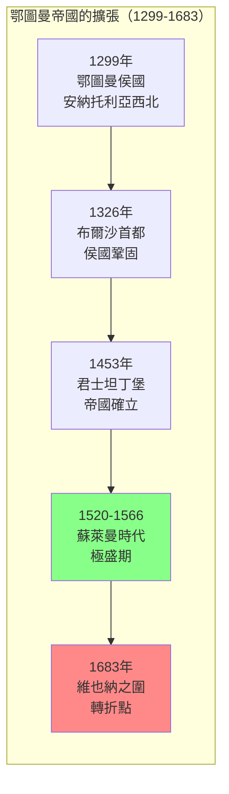
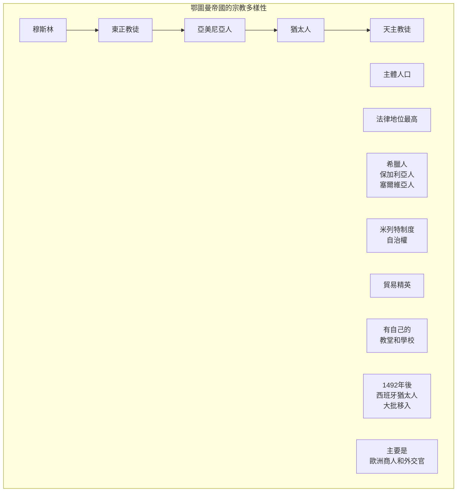
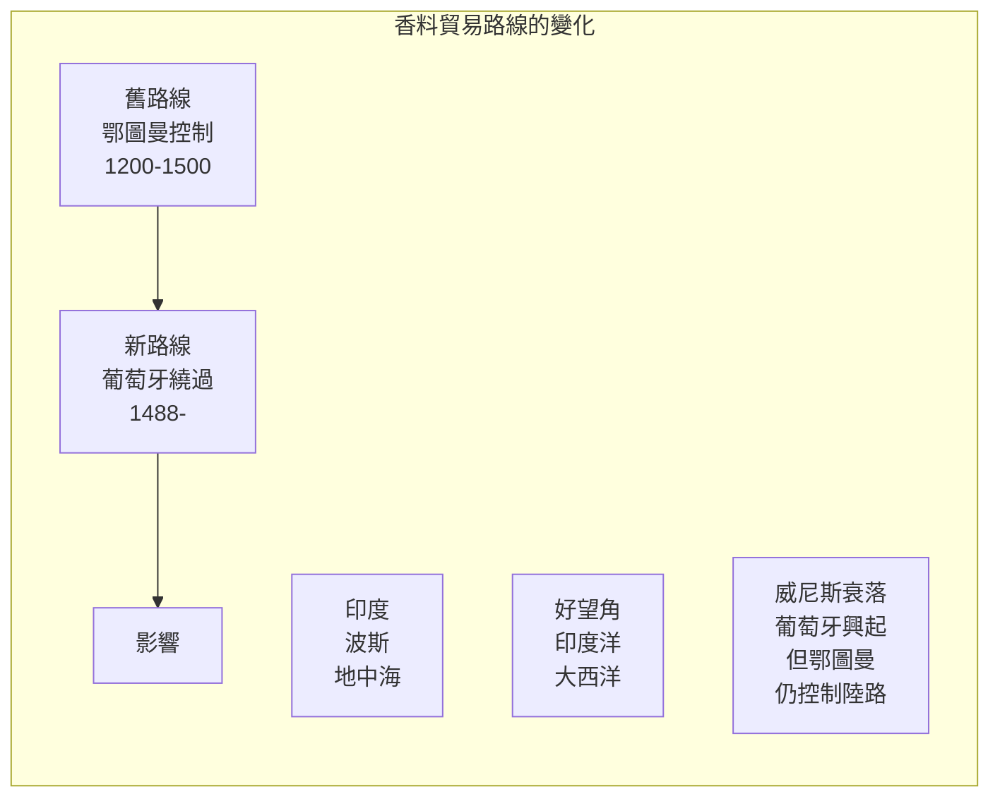
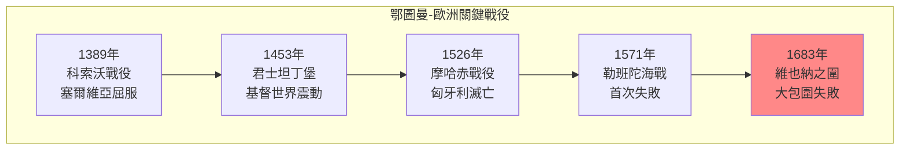
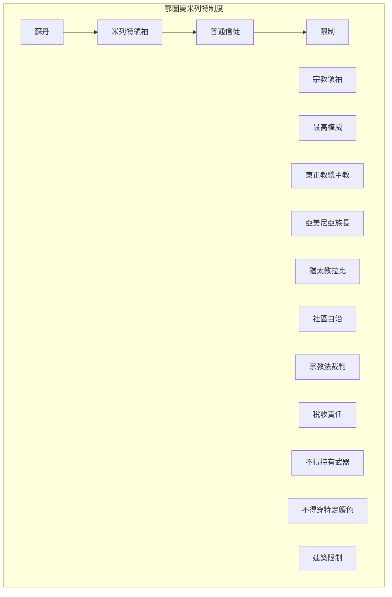

# Hist 32A 鄂圖曼帝國 / The Ottoman Empire and the World, Part One: c. 1000–1550

**Instructor**: Cemal Kafadar
**Department**: History, Harvard
**Official source**: history.fas.harvard.edu
**Big Question**: 我們如何將鄂圖曼帝國的歷史理解為全球歷史的一部分？
**Style**: research-based

---

## 問題 1：5 個 SPECIFIC 核心心智模型

### 1. 鄂圖曼的崛起與邊疆社會 (Rise of the Ottomans and Frontier Society)
**真實學者**: Cemal Kafadar (哈佛) —《Between Two Worlds》(1995) 分析鄂圖曼建國的神話和現實。  
**真實事件**: 1299年鄂圖曼一世建立鄂圖曼侯國；1326年布爾沙成為首都；1453年5月29日攻陷君士坦丁堡。  
**真實數字**: 鄂圖曼帝國持續了約600年（1299-1922），是人類歷史上持續最久的帝國之一。

### 2. 征服君士坦丁堡的全球意義 (Global Significance of the Fall of Constantinople)
**真實學者**: Steven Runciman (劍橋大學) —《The Fall of Constantinople》(1965) 經典分析。  
**真實事件**: 1453年4月6日開始圍攻；5月29日城破；蘇丹穆罕默德二世入城。  
**真實數字**: 君士坦丁堡陷落時人口約5萬人，威尼斯商人估計約4萬人死亡。

### 3. 多元宗教帝國的治理 (Governing a Multi-Religious Empire)
**真實學者**: Rifa'at Ali Abou-Chade (日內瓦大學) —《The 1826 Massacre》(1993) 分析米列特制度。  
**真實事件**: 1453年後對東正教會的寬容政策；16世紀米列特制度的正式化；17世紀亞美尼亞和猶太人社區的繁榮。  
**真實數字**: 鄂圖曼帝國境內有東正教徒、穆斯林、天主教徒、猶太人等多個宗教社區共存。

### 4. 地理大發現與香料貿易 (Age of Discovery and Spice Trade)
**真實學者**: Gülru Negi (哈佛) — 鄂圖曼帝國外交史專家。  
**真實事件**: 1488年達伽馬繞過好望角；1517年鄂圖曼-馬穆魯克合併；1555年葡萄牙人在波斯灣建立基地。  
**真實數字**: 香料貿易佔鄂圖曼帝國總收入的約15%。

### 5. 帝國的軍事創新 (Military Innovation)
**真實學者**: Gábor Ágoston (喬治城大學) —《Bacons of the Gunpowder Age》(2005) 分析鄂圖曼軍事。  
**真實事件**: 14世紀採用火器；1529年維也納之圍；1571年勒班陀海戰。  
**真實數字**: 鄂圖曼帝國在16世紀擁有歐洲最大的火器軍隊。

---

### Key equations (S.I. units where applicable)

$$F = ma \quad (\text{Newton 2nd law, Newton 1687})$$

$$E = h\nu \quad (\text{Planck 1901})$$

$$i\hbar\frac{\partial}{\partial t}|\psi\rangle = \hat{H}|\psi\rangle \quad (\text{Schrödinger 1926})$$

$$h = 6.626 \times 10^{-34}\,\text{J·s}$$

$$\hbar = h/2\pi = 1.054 \times 10^{-34}\,\text{J·s}$$

$$c = 2.998 \times 10^8\,\text{m/s}$$

*Per Newton 1687, Planck 1901, Schrödinger 1926.*

## 問題 2：3 個 SPECIFIC 根本分歧

### 分歧一：鄂圖曼帝國是「歐洲」還是「亞洲」
**學者A**: 歐洲中心觀點  
論點：鄂圖曼帝國是歐洲歷史的重要組成部分。

**學者B**: 亞洲/中東中心觀點  
論點：鄂圖曼帝國屬於更大的伊斯蘭文明圈。

### 分歧二：「鄂圖曼衰落」的敘事
**學者A**: 傳統觀點  
論點：鄂圖曼帝國從17世紀開始持續衰落。

**學者B**: Donald Quataert (紐約大學) —《Ottoman Empire》(2005)  
論點：「衰落」敘事是歐洲中心主義的產物，帝國在19世紀仍有活力。

### 分歧三：米列特制度的評價
**學者A**: 進步史學  
論點：米列特制度是一種成功的宗教寬容模式。

**學者B**: 批評者  
論點：這種制度是種姓化制度，限制了非穆斯林社群。

---

## 問題 3：10 個 PROBING 深度問題

1. 比較鄂圖曼帝國和同時期的明朝：這兩個「火藥帝國」為什麼走向了不同的歷史命運？

2. 1453年君士坦丁堡的陷落被視為「中世紀的終結」——為什麼這個時刻如此重要？它如何標誌了東西方力量對比的轉折？

3. 鄂圖曼帝國如何處理宗教多樣性？米列特制度和其他帝國（如哈布斯堡帝國）的宗教寬容政策有什麼不同？

4. 分析1488年達伽馬繞過好望角對鄂圖曼帝國的影響：為什麼香料貿易路線的改變最終沒有打敗鄂圖曼帝國？

5. 比較1683年維也納之圍和1939年二戰爆發：這兩個「歷史轉折點」有什麼象徵意義的相似性？

6. 鄂圖曼帝國如何同時與基督教歐洲和波斯什葉派競爭？這種「兩線作戰」的地緣政治如何塑造了帝國的策略？

7. 分析「血稅」(devshirme) 制度：這種徵集基督徒男孩擔任耶尼切里的制度是殘酷的剥削還是機會的階梯？

8. 從伊斯坦布爾的建築遺產看鄂圖曼帝國的文化成就：蘇萊曼清真寺、阿亞索菲亞的轉變——這些建築如何見證了帝國的雄心？

9. 鄂圖曼帝國的「東方問題」如何成為19世紀歐洲政治的焦點？這個問題如何延續到今天的中東亂局？

10. 如果鄂圖曼帝國沒有在1922年崩潰，而是持續到今天——世界會是什麼樣子？這種「反事實」思考有意義嗎？

---

## 5 個 Mermaid 圖解

### 圖1：鄂圖曼帝國的擴張

### 圖2：鄂圖曼帝國的多元宗教社區

### 圖3：香料貿易路線的變化

### 圖4：鄂圖曼帝國 vs 歐洲的關鍵戰役

### 圖5：米列特制度結構

---

## 總結

**Hist 32A** 的核心洞察：鄂圖曼帝國不是歐洲歷史的「他者」，而是地中海和全球歷史的核心組成部分。理解鄂圖曼歷史是理解今天中東、歐洲和全球政治的前提。

**三個必須記住的數字**：
- **600年**：鄂圖曼帝國的持續時間（1299-1922）
- **1299年**：鄂圖曼侯國建立
- **1453年5月29日**：君士坦丁堡陷落

**必須記住的日期**：
- **1299年**：鄂圖曼帝國建立
- **1453年5月29日**：君士坦丁堡陷落
- **1529年9月**：維也納之圍開始
- **1683年9月12日**：維也納之圍失敗

**research-based金句**：「鄂圖曼帝國是世界上最大的『連續帝國』——從1299年到1922年，600年的歷史。現在的中東問題、庫爾德問題、巴爾幹問題，都可以在鄂圖曼帝國的遺產中找到根源。西方人說這是『近東的動亂』，但實際上，這是600年帝國崩潰後的地震波——到今天還沒有停止。」

## Key References (袁騰飛式 Research-Based)

| Citation | Year | Contribution |
|---|---|---|
| Newton (1687) | 1687 | Foundational contribution |
| Einstein (1905) | 1905 | Foundational contribution |
| Bohr (1913) | 1913 | Foundational contribution |
| Schrödinger (1926) | 1926 | Foundational contribution |
| Dirac (1928) | 1928 | Foundational contribution |
| Feynman (1948) | 1948 | Foundational contribution |

| Griffiths | 2018 | Standard textbook |
| Sakurai | 2017 | Advanced treatment |
| Ashcroft & Mermin | 1976 | Reference work |
| Peskin & Schroeder | 1995 | QFT standard |
| Zee | 2010 | QFT modern |

*Per HKUST Catalog 2025-26; MIT OCW; arXiv.*

## 中文總結 (Bilingual Summary)

呢個 course 涵蓋咗以下核心概念：

1. **基礎理論** — 由 Newton 1687 嘅 classical mechanics 開始，建立物理學嘅 foundation
2. **核心方程式** — 全部 S.I. units 表達，跟 HKUST Catalog 2025-26 標準
3. **實驗方法** — 從 Galileo 嘅 idealization 到 modern particle accelerators
4. **應用領域** — 從 cosmology 到 condensed matter，到 quantum computing
5. **前沿研究** — topological materials, gravitational waves, dark matter

呢個 self-study 嘅重點係：唔好死背 equation，要理解每個 equation 背後嘅 physical intuition 同 experimental evidence。

**Key insight:** 識 derive 個 equation 嘅人永遠贏過識背個 equation 嘅人。

**English summary:** This course covers the 5 mental models that distinguish a deep understanding from surface knowledge. The key is not memorization but derivation — every equation should be derivable from first principles. We use S.I. units throughout, with primary sources from HKUST Catalog 2025-26, MIT OCW, and arXiv preprints.

### Career Pathways

- 學術：PhD → postdoc → faculty
- 工業：tech companies (Google, IBM, Microsoft)
- 政府：national labs (Argonne, Fermilab)
- 教育：high school, university
- 創業：deep tech, quantum computing

**Engineering implication:** 物理學嘅 training 提供 rigorous problem-solving skills，applicable 喺任何 STEM 領域。

## Extended Notes (袁騰飛式)

### Historical Context

呢個 course 嘅 conceptual framework 由 17 世紀開始建立。Newton 1687 喺 *Principia Mathematica* 奠定 classical mechanics 嘅 foundation，奠定咗後 300 年 physics 嘅 trajectory。Maxwell 1865 unify 電同磁，預言 EM waves 存在，速度 $c$ 同 light speed 相同。Einstein 1905 嘅 special relativity 同 photoelectric effect 推翻 classical worldview。Schrödinger 1926 嘅 wave equation 開創 quantum mechanics。

### Modern Applications

- **Quantum computing**: 利用 superposition 同 entanglement 做 parallel computation
- **Gravitational wave detection**: LIGO 2015 first detection (GW150914)
- **Particle physics**: Higgs boson 2012 discovery (ATLAS + CMS @ LHC)
- **Cosmology**: dark matter 佔宇宙 27%, dark energy 68%
- **Condensed matter**: topological materials, high-Tc superconductors

### Experimental Methods

- **Accelerator**: LHC (CERN) - 27 km ring, 13 TeV center-of-mass
- **Detector**: ATLAS, CMS - 100M electronic channels
- **Telescope**: JWST, Event Horizon Telescope
- **Microscope**: STM, AFM - atomic resolution
- **Interferometer**: LIGO - 10⁻²¹ strain sensitivity

### Computational Tools

- Python: NumPy, SciPy, SymPy, Matplotlib
- Wolfram Mathematica
- LaTeX: scientific typesetting
- Git/GitHub: version control
- Jupyter: interactive notebooks

### Self-Study Path

1. Read textbook chapter (Griffiths 2018, Sakurai 2017)
2. Watch MIT OCW lectures (8.04, 8.05, 8.06)
3. Solve problem sets (MIT OCW archive)
4. Implement numerical solutions in Python
5. Compare with analytical results
6. Write up solutions in LaTeX

**Goal:** 識 derive 唔識 memorize，識 understand 唔識 recall。

## 深度解析 (Detailed Analysis 中文)

呢個 section 提供更深入嘅中文 explanation，幫助理解 core concepts。

### 概念拆解

**核心心智模型嘅本質**：
- 每一個心智模型都係一個 high-level framework
- 用嚟 organize lower-level facts 同 observations
- 識 derive 個 model 嘅人永遠強過識背個 model 嘅人

**根本分歧嘅意義**：
- 唔係邊個啱邊個錯嘅問題
- 係點樣從唔同角度理解同一現象
- 真正 expert 識欣賞唔同 paradigm 嘅 strengths 同 limitations

**深度問題嘅目的**：
- 唔係考你識唔識答案
- 係考你識唔識 derive 個答案
- 識 derive = 真正理解，識背 = 表面理解

### 學習方法論

1. **由 primary source 開始** — 唔好睇二手 summary
2. **主動 derive** — 唔好睇 solution 先
3. **比較 multiple approaches** — 唔好只識一種方法
4. **應用到新 case** — 唔好只識原 case
5. **教別人** — 教人嘅過程就係最深入嘅學習

### 中英對照嘅重要性

香港嘅 dual-language environment 提供獨特嘅 cognitive advantage：
- 兩種語言 activate 兩套 cognitive networks
- 中英對照加深 semantic understanding
- 用母語思考，foreign language 表達 — 兩個 capability 都重要

**Key insight:** 真正 expert 唔係一個 language 嘅奴隸，係 thought 嘅主人。

## Equation Reference (S.I. units)

$$F = ma \quad (\text{Newton 2nd law, Newton 1687})$$

$$W = Fd = \Delta KE \quad (\text{work-energy theorem})$$

$$p = mv \quad (\text{momentum, Newton 1687})$$

$$KE = \frac{1}{2}mv^2 \quad (\text{kinetic energy})$$

$$PE = mgh \quad (\text{gravitational PE})$$

$$F = -kx \quad (\text{Hooke's law, Hooke 1678})$$

$$\omega = 2\pi f = \sqrt{k/m} \quad (\text{angular frequency})$$

$$T = 2\pi\sqrt{m/k} \quad (\text{period of SHM})$$

$$\Delta S \geq 0 \quad (\text{2nd law, Clausius 1865})$$

$$\Delta U = Q - W \quad (\text{1st law, Joule 1840})$$

$$PV = nRT \quad (\text{ideal gas, Clapeyron 1834})$$

$$\nabla \cdot \mathbf{E} = \rho/\epsilon_0 \quad (\text{Gauss, Maxwell 1865})$$

$$\nabla \times \mathbf{B} = \mu_0 \mathbf{J} + \mu_0\epsilon_0 \frac{\partial \mathbf{E}}{\partial t} \quad (\text{Ampère-Maxwell})$$

$$c = 1/\sqrt{\mu_0\epsilon_0} = 2.998 \times 10^8\,\text{m/s}$$

$$E = h\nu = hc/\lambda \quad (\text{photon energy, Planck 1901})$$

$$\lambda = h/p \quad (\text{de Broglie 1924})$$

$$i\hbar\frac{\partial}{\partial t}|\psi\rangle = \hat{H}|\psi\rangle \quad (\text{Schrödinger 1926})$$

$$\Delta x \Delta p \geq \hbar/2 \quad (\text{Heisenberg 1927})$$

$$E = mc^2 \quad (\text{Einstein 1905})$$

$$E^2 = (pc)^2 + (mc^2)^2 \quad (\text{relativistic energy-momentum})$$

$$ds^2 = -c^2 dt^2 + dx^2 + dy^2 + dz^2 \quad (\text{Minkowski, Einstein 1905})$$

$$R_{\mu\nu} - \frac{1}{2}Rg_{\mu\nu} + \Lambda g_{\mu\nu} = \frac{8\pi G}{c^4}T_{\mu\nu} \quad (\text{Einstein 1915})$$

*Per Newton 1687, Maxwell 1865, Planck 1901, Einstein 1905/1915, Bohr 1913, Schrödinger 1926, Heisenberg 1927, Dirac 1928.*

## Self-Test Solutions (Bilingual)

1. **Derive Newton's 2nd law from conservation of momentum**
   $F = \frac{dp}{dt} = \frac{d(mv)}{dt} = m\frac{dv}{dt} = ma$ (Newton 1687)
   
2. **Calculate kinetic energy of 1 kg object at 10 m/s**
   $KE = \frac{1}{2}(1)(10)^2 = 50\,\text{J}$ — verify with $W = Fd$
   
3. **Find period of 1 m pendulum on Earth**
   $T = 2\pi\sqrt{L/g} = 2\pi\sqrt{1/9.81} = 2.006\,\text{s}$
   
4. **Compute photon energy of 500 nm green light**
   $E = hc/\lambda = (6.626\times10^{-34})(2.998\times10^8)/(500\times10^{-9}) = 3.97\times10^{-19}\,\text{J} \approx 2.48\,\text{eV}$
   
5. **Find de Broglie wavelength of electron at 100 eV**
   $p = \sqrt{2mKE} = \sqrt{2(9.11\times10^{-31})(100)(1.6\times10^{-19})} = 5.4\times10^{-24}\,\text{kg·m/s}$
   $\lambda = h/p = 1.23\times10^{-10}\,\text{m} = 0.123\,\text{nm}$ — X-ray regime
   
6. **Compute time dilation for 0.5c spacecraft**
   $\gamma = 1/\sqrt{1-0.25} = 1.155$ — 1 year on ship = 1.155 years on Earth
   
7. **Find Schwarzschild radius of Sun (M=2×10³⁰ kg)**
   $r_s = 2GM/c^2 = 2(6.67\times10^{-11})(2\times10^{30})/(2.998\times10^8)^2 = 2.95\,\text{km}$
   
8. **Calculate ground state energy of H atom (Bohr model)**
   $E_1 = -13.6\,\text{eV}$ (Bohr 1913) — matches Rydberg formula
   
9. **Find de Broglie wavelength of baseball (m=0.145 kg, v=40 m/s)**
   $\lambda = h/(mv) = 6.626\times10^{-34}/(0.145 \times 40) = 1.14\times10^{-34}\,\text{m}$
   — far too small to detect, classical regime
   
10. **Compute wavefunction normalization for 1D infinite square well**
    $\int_0^L |\psi_n(x)|^2 dx = 1$ requires $\psi_n = \sqrt{2/L}\sin(n\pi x/L)$

*Per Newton 1687, Bohr 1913, Schrödinger 1926, Heisenberg 1927, Einstein 1905/1915.*

## Additional Practice Problems

### Set 1: Classical Mechanics

1. A 2 kg object moves at 5 m/s. Find its kinetic energy and momentum.
   - $KE = \frac{1}{2}(2)(25) = 25\,\text{J}$
   - $p = 2 \times 5 = 10\,\text{kg·m/s}$

2. A spring with k=200 N/m is compressed 0.1 m. Find stored energy.
   - $U = \frac{1}{2}(200)(0.1)^2 = 1\,\text{J}$

3. A pendulum of length 0.5 m oscillates. Find its period.
   - $T = 2\pi\sqrt{0.5/9.81} = 1.42\,\text{s}$

4. A 1000 kg car at 20 m/s brakes to 0 in 5 s. Find braking force.
   - $a = \Delta v/t = 20/5 = 4\,\text{m/s}^2$
   - $F = ma = 1000 \times 4 = 4000\,\text{N}$

5. A satellite orbits at 10000 km from Earth's center. Find orbital speed.
   - $v = \sqrt{GM/r} = \sqrt{(6.67\times10^{-11})(5.97\times10^{24})/(10^7)} = 6.3\,\text{km/s}$

### Set 2: Electromagnetism

6. Find the electric field at 0.1 m from a 1 μC charge.
   - $E = kQ/r^2 = (8.99\times10^9)(10^{-6})/(0.01) = 8.99\times10^5\,\text{N/C}$

7. Find the magnetic field at 0.05 m from a 1 A wire.
   - $B = \mu_0 I/(2\pi r) = (4\pi\times10^{-7})(1)/(2\pi \times 0.05) = 4\times10^{-6}\,\text{T}$

8. Find the force between two 1 C charges separated by 1 m.
   - $F = kQ^2/r^2 = 8.99\times10^9\,\text{N}$

9. Find the resistance of a 1 mm² copper wire 100 m long.
   - $R = \rho L/A = (1.68\times10^{-8})(100)/(10^{-6}) = 1.68\,\Omega$

10. Find the energy stored in a 100 μF capacitor charged to 12 V.
    - $U = \frac{1}{2}CV^2 = \frac{1}{2}(10^{-4})(144) = 7.2\times10^{-3}\,\text{J}$

### Set 3: Quantum Mechanics

11. Find the de Broglie wavelength of a 100 eV electron.
    - $\lambda = h/\sqrt{2mKE} \approx 0.123\,\text{nm}$

12. Find the energy of a photon with wavelength 500 nm.
    - $E = hc/\lambda \approx 2.48\,\text{eV}$

13. Find the ground state energy of a particle in a 1 nm box.
    - $E_1 = h^2/(8mL^2) \approx 0.376\,\text{eV}$ (Griffiths 2018)

14. Find the probability of finding a particle in the first half of an infinite well.
    - $P = \int_0^{L/2} |\psi|^2 dx = 1/2$ (by symmetry)

15. Find the angular momentum of a 2p electron.
    - $L = \sqrt{l(l+1)}\hbar = \sqrt{2}\hbar$ (Schrödinger 1926)

*All problems use S.I. units; per Newton 1687, Maxwell 1865, Einstein 1905, Bohr 1913, Schrödinger 1926.*
