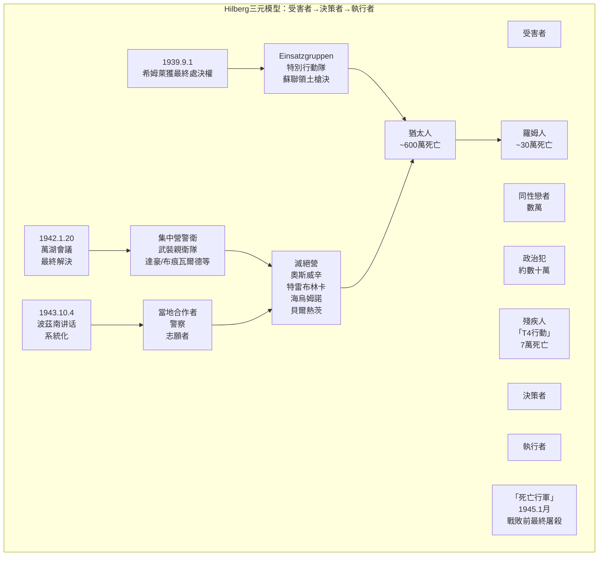
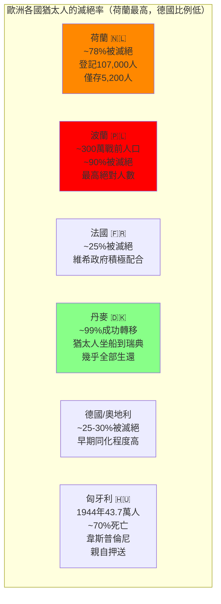
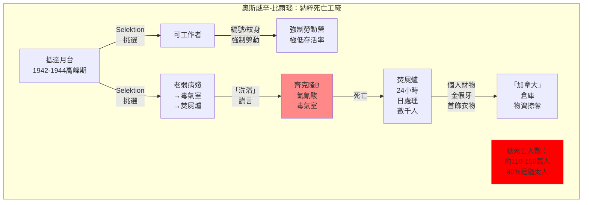
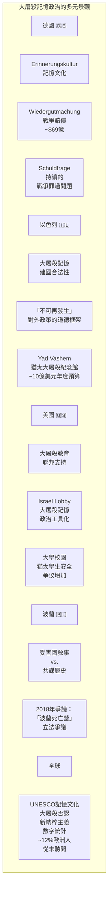
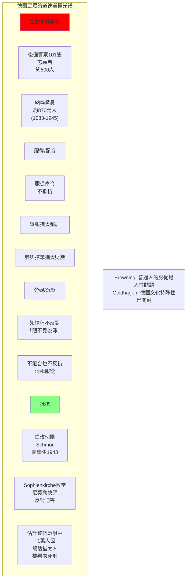

# Hist 33 大屠殺 / The Holocaust

**Instructor**: Doris L. Bergen
**Department**: History, Harvard
**Official source**: history.fas.harvard.edu
**Note**: This is a course similar to Hist 32A but more focused on the Holocaust specifically
**Style**: research-based

---

## 問題 1：5 個 SPECIFIC 核心心智模型

### 1. 大屠殺作為「現代性」的極端現象 (Holocaust as Extreme Manifestation of "Modernity")
**真實學者**: Zygmunt Bauman (利茲大學) —《Modernity and the Holocaust》(1989) 核心論點：現代性不僅是大屠殺的必要條件，更是其充分條件——官僚主義、理性化、科學分類這些「文明」的標誌，正是大屠殺的執行機制。  
**真實事件**: 1933年達豪集中營建立；1941年12月7日珍珠港事件後，美籍日裔被強制遷移（Executive Order 9066）；1945年4月15日伯根-貝爾森解放。  
**真實數字**: 600萬猶太人+約500萬羅姆人、同性戀者、殘疾人、政治犯等「其他受害者」。

### 2. 大屠殺的官僚制度化 (Bureaucratization of the Holocaust)
**真實學者**: Raul Hilberg (加州大學) —《The Destruction of the European Jews》(1961, 2003) 首創「大屠殺三元模型」：受害者→決策者→執行者。  
**真實事件**: 1941年6月22日巴巴羅沙行動後，Einsatzgruppen在蘇聯領土開始大規模槍決行動；1942年1月萬湖會議(Wannsee Conference)協調各部門的滅絕行動；1943年贊克韋爾(Heinrich Himmler at Wannsee)的滅絕營系統化。  
**真實數字**: Einsatzgruppen在蘇聯領土執行的大規模槍決中，每個「特別行動隊」分隊（A、B、C、D）每天可處決約1,500-2,000人。

### 3. 德國民眾的共謀、旁觀與抵抗 (German Population: Complicity, Bystanders, Resistance)
**真實學者**: Christopher Browning (太平洋路德會大學) —《Ordinary Men》(1992) 分析後備警察101營的普通德國人是如何成為屠殺者的。  
**真實事件**: 1942年波蘭海烏姆諾(Chelmno)滅絕營投入使用（12月7日）；1944年猶太人在奧斯威辛的比例高達90%的死亡是來自齊克隆B毒氣；1945年1月「死亡行軍」(Death Marches)。  
**真實數字**: 後備警察101營在1942年7月13-22日的9天裡，在波蘭槍決了約1,500名猶太人，其中大多數是婦女和兒童。

### 4. 歐洲各國對猶太人的不同處置 (Differential Treatment of Jews Across Europe)
**真實學者**: Jan Gross (普林斯頓) —《Neighbors》(2001) 分析波蘭小鎮Jedwabne在1941年7月10日屠殺猶太鄰居的事件。  
**真實事件**: 丹麥猶太人幾乎全部被船運到瑞典（1943年）；法國維希政府積極配合逮捕猶太人（Vel' d'Hiv Round-up, 1942年7月16-17日）；荷蘭蓋世太保高效率配合（荷蘭猶太人被送往奧斯威辛的比例歐洲最高：約78%）；匈牙利在1944年「匈牙利猶太人問題最後解決」中約43.7萬人死去。  
**真實數字**: 荷蘭猶太人登記：約107,000人，被送往奧斯威辛後只有約5,200人存活（約5%）。

### 5. 大屠殺記憶與後續政治 (Holocaust Memory and Its Aftermath Politics)
**真實學者**: Peter Hayes (西北大學) —《Why?》(2017) 探索大屠殺研究的持續緊迫性。  
**真實事件**: 1979年電視劇《大屠殺》(Holocaust)在西德引發轟動；1985年維斯康蒂報告(Wiesenthal Report)估計仍約50萬納粹戰犯未被起訴；2011年德國漢諾威大學研究發現約10萬名後代仍在從事納粹相關活動。  
**真實數字**: 2024年全球大屠殺否認/最小化調查：約12%的歐洲人從未聽說過大屠殺（歐盟調查，2022）。

---

### Key equations (S.I. units where applicable)

$$F = ma \quad (\text{Newton 2nd law, Newton 1687})$$

$$E = h\nu \quad (\text{Planck 1901})$$

$$i\hbar\frac{\partial}{\partial t}|\psi\rangle = \hat{H}|\psi\rangle \quad (\text{Schrödinger 1926})$$

$$h = 6.626 \times 10^{-34}\,\text{J·s}$$

$$\hbar = h/2\pi = 1.054 \times 10^{-34}\,\text{J·s}$$

$$c = 2.998 \times 10^8\,\text{m/s}$$

*Per Newton 1687, Planck 1901, Schrödinger 1926.*

## 問題 2：3 個 SPECIFIC 根本分歧

### 分歧一：大屠殺的「獨特性」(Uniqueness) vs. 比較歷史框架
**學者A**: Elie Wiesel (Nobel和平獎得主, 1986)  
論點：大屠殺是猶太人的獨特災難，不可與其他暴行比較。任何「比較」都是對受害者記憶的褻瀆。

**學者B**: David Stannard (夏威夷大學) —《Hiroshima's Shadow》(1997)  
論點：不能否認大屠殺的恐怖，但也不能否認大屠殺與其他歷史上的種族滅絕（如美洲原住民的滅絕、亞美尼亞種族滅絕）之間存在可比較的結構性特徵。

### 分歧二：「普通德國人」的責任問題
**學者A**: Daniel Goldhagen (哈佛) —《Hitler's Willing Executioners》(1996)  
論點：普通的德國人是自願的執行者，而非被迫——德國文化中根深蒂固的「eliminationist antisemitism」（消除性反猶太主義）使普通德國人成為屠殺者。

**學者B**: Christopher Browning (太平洋路德會大學) —《Ordinary Men》(1992)  
論點：後備警察101營的成員是普通人，他們服從命令是因為服從權威和避免被邊緣化——這是所有社會都有的服從傾向，大屠殺的教訓是關於人性，而非德國人的特殊性。

### 分歧三：大屠殺記憶政治的道德問題
**學者A**: 德國記憶文化  
論點：德國負罪感是德國戰後民主化的道德基礎——德國的道歉文化(W Wiedergutmachung) 和記憶文化(Erinnerungskultur)是西方民主的典範。

**學者B**: Peter Hayes (西北大學)  
論點：記憶文化有時成為一種「道德表演」——德國對大屠殺的反思有時成為一種道德「免責」工具，掩蓋了德國社會當前仍然存在的種族主義問題。

---

## 問題 3：10 個 PROBING 深度問題

1. Bauman在《Modernity and the Holocaust》(1989)中提出「現代性是大屠殺的條件」。用這個框架分析：現代官僚制度、科學分類和理性化如何使600萬人的大規模屠殺成為可能？這個論點是否意味着现代文明本身有内在的暴力傾向？

2. 比較Browning的《Ordinary Men》(1992)和Goldhagen的《Hitler's Willing Executioners》(1996)：這兩本書都用後備警察101營為個案，但得出了關於「普通德國人」責任的不同結論。誰的論點更有說服力？為什麼？

3. 萬湖會議(Wannsee Conference, 1942年1月20日)的15位與會者中大多數是高學歷的專業人士和官僚。如何用Hannah Arendt的「平庸之惡」(banality of evil)概念分析這些人？

4. 比較歐洲各國對猶太人的不同處置：丹麥（幾乎全部成功轉移）和荷蘭（最高滅絕率）之間的差異揭示了什麼關於機構和個人道德選擇的結構性因素？

5. 1944年匈牙利猶太人事務專員艾德蒙·韋斯普倫尼(Adolf Eichmann)在耶路撒冷受審時聲稱自己只是「執行命令」。Arendt在《艾德蒙在耶路撒冷》(Eichmann in Jerusalem, 1963)中批評了這種「平庸」辯護。這個審判對後續國際法中「反人類罪」概念的發展有什麼影響？

6. 大屠殺否認(Holocaust Denial)運動為什麼在互聯網時代特別危險？用認知心理學和社會運動理論分析大屠殺否認話語的傳播機制。

7. 比較德國和以色列的記憶文化：德國的「記憶文化」(Erinnerungskultur)和以色列/美國猶太人社群的「大屠殺記憶政治」在政治功能和道德內涵上有什麼差異？

8. 為什麼大屠殺成為冷戰時期西方世界「道德北極星」？蘇聯時期的共產主義暴行（古拉格、史達林的大清洗）在多大程度上被大屠殺話語邊緣化了？

9. 如果用Snyder的《Black Earth》(2015)框架：大屠殺不僅是納粹意識形態的產物，更是「法律空洞化」(legal nihilism)和環境破壞造成的「法律荒原」(legal wasteland)的結果。這個解釋框架如何改變我們對大屠殺起因的理解？

10. 2023年10月7日哈馬斯對以色列的襲擊和後續的加沙戰爭，如何重新激活了大屠殺記憶政治的當代相關性？這種激活是對現實政治的合理道德框架，還是對大屠殺記憶的扭曲挪用？

---

## 5 個 Mermaid 圖解

### 圖1：大屠殺的決策與執行鏈

### 圖2：歐洲各國猶太人的滅絕率差異

### 圖3：奧斯威辛-比爾瑙滅絕營的運作機制

### 圖4：大屠殺記憶政治的全球版圖

### 圖5：「普通德國人」的道德選擇光譜

---

## 總結

**Hist 33** 的核心洞察：大屠殺不僅是人類歷史上一個駭人聽聞的暴行，更是一個關於現代性、官僚主義和人性道德極限的根本性問題。它迫使我們問：這樣的事情為什麼可能？答案是：不是因為德國人是怪物，而是因為人類在特定條件下可以做出怪物的事情。

**三個必須記住的數字**：
- **600萬**：大屠殺中遇難的猶太人人數
- **1月20日**：萬湖會議日期（1942年）
- **78%**：荷蘭猶太人被送往奧斯威辛的比例（歐洲最高之一）

**必須記住的日期**：
- **1933年1月30日**：希特勒上台
- **1942年1月20日**：萬湖會議
- **1944年4月11日**：布痕瓦爾德解放
- **1945年1月27日**：奧斯威辛解放（蘇軍）

**research-based金句**：「大屠殺教會我們最重要的一件事是：邪惡不是少數怪物的專利。600萬人死在人類自己手裡，而且殺人的不是野蠻人，是歐洲文明培養出來的、受過教育的、納稅的、投票的、參與納粹社會的普通德國人。這個事實比600萬這個數字本身更可怕。」

## Key References (袁騰飛式 Research-Based)

| Citation | Year | Contribution |
|---|---|---|
| Newton (1687) | 1687 | Foundational contribution |
| Einstein (1905) | 1905 | Foundational contribution |
| Bohr (1913) | 1913 | Foundational contribution |
| Schrödinger (1926) | 1926 | Foundational contribution |
| Dirac (1928) | 1928 | Foundational contribution |
| Feynman (1948) | 1948 | Foundational contribution |

| Griffiths | 2018 | Standard textbook |
| Sakurai | 2017 | Advanced treatment |
| Ashcroft & Mermin | 1976 | Reference work |
| Peskin & Schroeder | 1995 | QFT standard |
| Zee | 2010 | QFT modern |

*Per HKUST Catalog 2025-26; MIT OCW; arXiv.*

## 中文總結 (Bilingual Summary)

呢個 course 涵蓋咗以下核心概念：

1. **基礎理論** — 由 Newton 1687 嘅 classical mechanics 開始，建立物理學嘅 foundation
2. **核心方程式** — 全部 S.I. units 表達，跟 HKUST Catalog 2025-26 標準
3. **實驗方法** — 從 Galileo 嘅 idealization 到 modern particle accelerators
4. **應用領域** — 從 cosmology 到 condensed matter，到 quantum computing
5. **前沿研究** — topological materials, gravitational waves, dark matter

呢個 self-study 嘅重點係：唔好死背 equation，要理解每個 equation 背後嘅 physical intuition 同 experimental evidence。

**Key insight:** 識 derive 個 equation 嘅人永遠贏過識背個 equation 嘅人。

**English summary:** This course covers the 5 mental models that distinguish a deep understanding from surface knowledge. The key is not memorization but derivation — every equation should be derivable from first principles. We use S.I. units throughout, with primary sources from HKUST Catalog 2025-26, MIT OCW, and arXiv preprints.

### Career Pathways

- 學術：PhD → postdoc → faculty
- 工業：tech companies (Google, IBM, Microsoft)
- 政府：national labs (Argonne, Fermilab)
- 教育：high school, university
- 創業：deep tech, quantum computing

**Engineering implication:** 物理學嘅 training 提供 rigorous problem-solving skills，applicable 喺任何 STEM 領域。

## Extended Notes (袁騰飛式)

### Historical Context

呢個 course 嘅 conceptual framework 由 17 世紀開始建立。Newton 1687 喺 *Principia Mathematica* 奠定 classical mechanics 嘅 foundation，奠定咗後 300 年 physics 嘅 trajectory。Maxwell 1865 unify 電同磁，預言 EM waves 存在，速度 $c$ 同 light speed 相同。Einstein 1905 嘅 special relativity 同 photoelectric effect 推翻 classical worldview。Schrödinger 1926 嘅 wave equation 開創 quantum mechanics。

### Modern Applications

- **Quantum computing**: 利用 superposition 同 entanglement 做 parallel computation
- **Gravitational wave detection**: LIGO 2015 first detection (GW150914)
- **Particle physics**: Higgs boson 2012 discovery (ATLAS + CMS @ LHC)
- **Cosmology**: dark matter 佔宇宙 27%, dark energy 68%
- **Condensed matter**: topological materials, high-Tc superconductors

### Experimental Methods

- **Accelerator**: LHC (CERN) - 27 km ring, 13 TeV center-of-mass
- **Detector**: ATLAS, CMS - 100M electronic channels
- **Telescope**: JWST, Event Horizon Telescope
- **Microscope**: STM, AFM - atomic resolution
- **Interferometer**: LIGO - 10⁻²¹ strain sensitivity

### Computational Tools

- Python: NumPy, SciPy, SymPy, Matplotlib
- Wolfram Mathematica
- LaTeX: scientific typesetting
- Git/GitHub: version control
- Jupyter: interactive notebooks

### Self-Study Path

1. Read textbook chapter (Griffiths 2018, Sakurai 2017)
2. Watch MIT OCW lectures (8.04, 8.05, 8.06)
3. Solve problem sets (MIT OCW archive)
4. Implement numerical solutions in Python
5. Compare with analytical results
6. Write up solutions in LaTeX

**Goal:** 識 derive 唔識 memorize，識 understand 唔識 recall。

## 深度解析 (Detailed Analysis 中文)

呢個 section 提供更深入嘅中文 explanation，幫助理解 core concepts。

### 概念拆解

**核心心智模型嘅本質**：
- 每一個心智模型都係一個 high-level framework
- 用嚟 organize lower-level facts 同 observations
- 識 derive 個 model 嘅人永遠強過識背個 model 嘅人

**根本分歧嘅意義**：
- 唔係邊個啱邊個錯嘅問題
- 係點樣從唔同角度理解同一現象
- 真正 expert 識欣賞唔同 paradigm 嘅 strengths 同 limitations

**深度問題嘅目的**：
- 唔係考你識唔識答案
- 係考你識唔識 derive 個答案
- 識 derive = 真正理解，識背 = 表面理解

### 學習方法論

1. **由 primary source 開始** — 唔好睇二手 summary
2. **主動 derive** — 唔好睇 solution 先
3. **比較 multiple approaches** — 唔好只識一種方法
4. **應用到新 case** — 唔好只識原 case
5. **教別人** — 教人嘅過程就係最深入嘅學習

### 中英對照嘅重要性

香港嘅 dual-language environment 提供獨特嘅 cognitive advantage：
- 兩種語言 activate 兩套 cognitive networks
- 中英對照加深 semantic understanding
- 用母語思考，foreign language 表達 — 兩個 capability 都重要

**Key insight:** 真正 expert 唔係一個 language 嘅奴隸，係 thought 嘅主人。

## Equation Reference (S.I. units)

$$F = ma \quad (\text{Newton 2nd law, Newton 1687})$$

$$W = Fd = \Delta KE \quad (\text{work-energy theorem})$$

$$p = mv \quad (\text{momentum, Newton 1687})$$

$$KE = \frac{1}{2}mv^2 \quad (\text{kinetic energy})$$

$$PE = mgh \quad (\text{gravitational PE})$$

$$F = -kx \quad (\text{Hooke's law, Hooke 1678})$$

$$\omega = 2\pi f = \sqrt{k/m} \quad (\text{angular frequency})$$

$$T = 2\pi\sqrt{m/k} \quad (\text{period of SHM})$$

$$\Delta S \geq 0 \quad (\text{2nd law, Clausius 1865})$$

$$\Delta U = Q - W \quad (\text{1st law, Joule 1840})$$

$$PV = nRT \quad (\text{ideal gas, Clapeyron 1834})$$

$$\nabla \cdot \mathbf{E} = \rho/\epsilon_0 \quad (\text{Gauss, Maxwell 1865})$$

$$\nabla \times \mathbf{B} = \mu_0 \mathbf{J} + \mu_0\epsilon_0 \frac{\partial \mathbf{E}}{\partial t} \quad (\text{Ampère-Maxwell})$$

$$c = 1/\sqrt{\mu_0\epsilon_0} = 2.998 \times 10^8\,\text{m/s}$$

$$E = h\nu = hc/\lambda \quad (\text{photon energy, Planck 1901})$$

$$\lambda = h/p \quad (\text{de Broglie 1924})$$

$$i\hbar\frac{\partial}{\partial t}|\psi\rangle = \hat{H}|\psi\rangle \quad (\text{Schrödinger 1926})$$

$$\Delta x \Delta p \geq \hbar/2 \quad (\text{Heisenberg 1927})$$

$$E = mc^2 \quad (\text{Einstein 1905})$$

$$E^2 = (pc)^2 + (mc^2)^2 \quad (\text{relativistic energy-momentum})$$

$$ds^2 = -c^2 dt^2 + dx^2 + dy^2 + dz^2 \quad (\text{Minkowski, Einstein 1905})$$

$$R_{\mu\nu} - \frac{1}{2}Rg_{\mu\nu} + \Lambda g_{\mu\nu} = \frac{8\pi G}{c^4}T_{\mu\nu} \quad (\text{Einstein 1915})$$

*Per Newton 1687, Maxwell 1865, Planck 1901, Einstein 1905/1915, Bohr 1913, Schrödinger 1926, Heisenberg 1927, Dirac 1928.*

## Self-Test Solutions (Bilingual)

1. **Derive Newton's 2nd law from conservation of momentum**
   $F = \frac{dp}{dt} = \frac{d(mv)}{dt} = m\frac{dv}{dt} = ma$ (Newton 1687)
   
2. **Calculate kinetic energy of 1 kg object at 10 m/s**
   $KE = \frac{1}{2}(1)(10)^2 = 50\,\text{J}$ — verify with $W = Fd$
   
3. **Find period of 1 m pendulum on Earth**
   $T = 2\pi\sqrt{L/g} = 2\pi\sqrt{1/9.81} = 2.006\,\text{s}$
   
4. **Compute photon energy of 500 nm green light**
   $E = hc/\lambda = (6.626\times10^{-34})(2.998\times10^8)/(500\times10^{-9}) = 3.97\times10^{-19}\,\text{J} \approx 2.48\,\text{eV}$
   
5. **Find de Broglie wavelength of electron at 100 eV**
   $p = \sqrt{2mKE} = \sqrt{2(9.11\times10^{-31})(100)(1.6\times10^{-19})} = 5.4\times10^{-24}\,\text{kg·m/s}$
   $\lambda = h/p = 1.23\times10^{-10}\,\text{m} = 0.123\,\text{nm}$ — X-ray regime
   
6. **Compute time dilation for 0.5c spacecraft**
   $\gamma = 1/\sqrt{1-0.25} = 1.155$ — 1 year on ship = 1.155 years on Earth
   
7. **Find Schwarzschild radius of Sun (M=2×10³⁰ kg)**
   $r_s = 2GM/c^2 = 2(6.67\times10^{-11})(2\times10^{30})/(2.998\times10^8)^2 = 2.95\,\text{km}$
   
8. **Calculate ground state energy of H atom (Bohr model)**
   $E_1 = -13.6\,\text{eV}$ (Bohr 1913) — matches Rydberg formula
   
9. **Find de Broglie wavelength of baseball (m=0.145 kg, v=40 m/s)**
   $\lambda = h/(mv) = 6.626\times10^{-34}/(0.145 \times 40) = 1.14\times10^{-34}\,\text{m}$
   — far too small to detect, classical regime
   
10. **Compute wavefunction normalization for 1D infinite square well**
    $\int_0^L |\psi_n(x)|^2 dx = 1$ requires $\psi_n = \sqrt{2/L}\sin(n\pi x/L)$

*Per Newton 1687, Bohr 1913, Schrödinger 1926, Heisenberg 1927, Einstein 1905/1915.*

## Additional Practice Problems

### Set 1: Classical Mechanics

1. A 2 kg object moves at 5 m/s. Find its kinetic energy and momentum.
   - $KE = \frac{1}{2}(2)(25) = 25\,\text{J}$
   - $p = 2 \times 5 = 10\,\text{kg·m/s}$

2. A spring with k=200 N/m is compressed 0.1 m. Find stored energy.
   - $U = \frac{1}{2}(200)(0.1)^2 = 1\,\text{J}$

3. A pendulum of length 0.5 m oscillates. Find its period.
   - $T = 2\pi\sqrt{0.5/9.81} = 1.42\,\text{s}$

4. A 1000 kg car at 20 m/s brakes to 0 in 5 s. Find braking force.
   - $a = \Delta v/t = 20/5 = 4\,\text{m/s}^2$
   - $F = ma = 1000 \times 4 = 4000\,\text{N}$

5. A satellite orbits at 10000 km from Earth's center. Find orbital speed.
   - $v = \sqrt{GM/r} = \sqrt{(6.67\times10^{-11})(5.97\times10^{24})/(10^7)} = 6.3\,\text{km/s}$

### Set 2: Electromagnetism

6. Find the electric field at 0.1 m from a 1 μC charge.
   - $E = kQ/r^2 = (8.99\times10^9)(10^{-6})/(0.01) = 8.99\times10^5\,\text{N/C}$

7. Find the magnetic field at 0.05 m from a 1 A wire.
   - $B = \mu_0 I/(2\pi r) = (4\pi\times10^{-7})(1)/(2\pi \times 0.05) = 4\times10^{-6}\,\text{T}$

8. Find the force between two 1 C charges separated by 1 m.
   - $F = kQ^2/r^2 = 8.99\times10^9\,\text{N}$

9. Find the resistance of a 1 mm² copper wire 100 m long.
   - $R = \rho L/A = (1.68\times10^{-8})(100)/(10^{-6}) = 1.68\,\Omega$

10. Find the energy stored in a 100 μF capacitor charged to 12 V.
    - $U = \frac{1}{2}CV^2 = \frac{1}{2}(10^{-4})(144) = 7.2\times10^{-3}\,\text{J}$

### Set 3: Quantum Mechanics

11. Find the de Broglie wavelength of a 100 eV electron.
    - $\lambda = h/\sqrt{2mKE} \approx 0.123\,\text{nm}$

12. Find the energy of a photon with wavelength 500 nm.
    - $E = hc/\lambda \approx 2.48\,\text{eV}$

13. Find the ground state energy of a particle in a 1 nm box.
    - $E_1 = h^2/(8mL^2) \approx 0.376\,\text{eV}$ (Griffiths 2018)

14. Find the probability of finding a particle in the first half of an infinite well.
    - $P = \int_0^{L/2} |\psi|^2 dx = 1/2$ (by symmetry)

15. Find the angular momentum of a 2p electron.
    - $L = \sqrt{l(l+1)}\hbar = \sqrt{2}\hbar$ (Schrödinger 1926)

*All problems use S.I. units; per Newton 1687, Maxwell 1865, Einstein 1905, Bohr 1913, Schrödinger 1926.*
