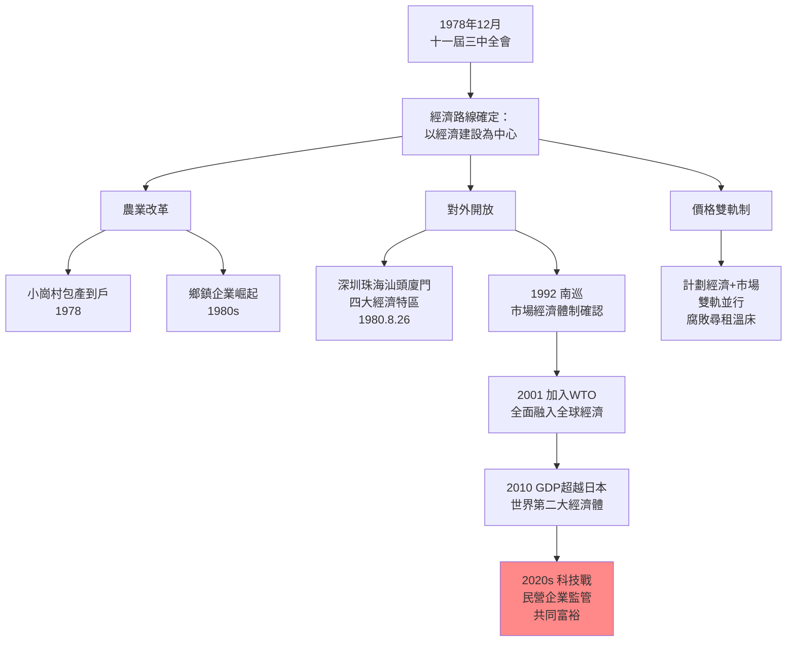
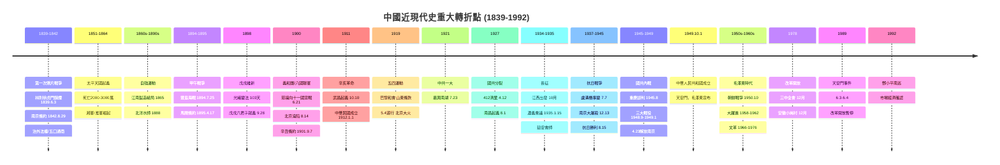
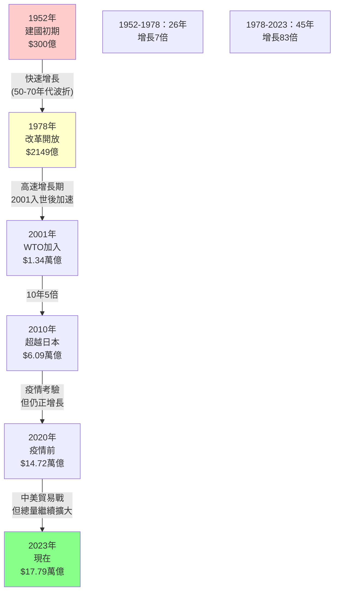
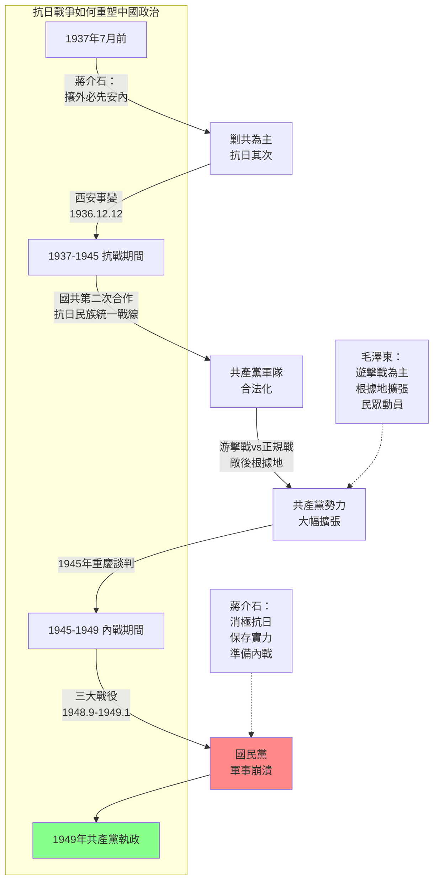
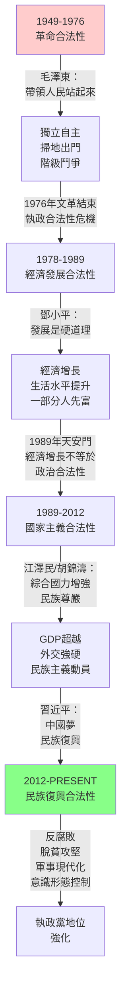
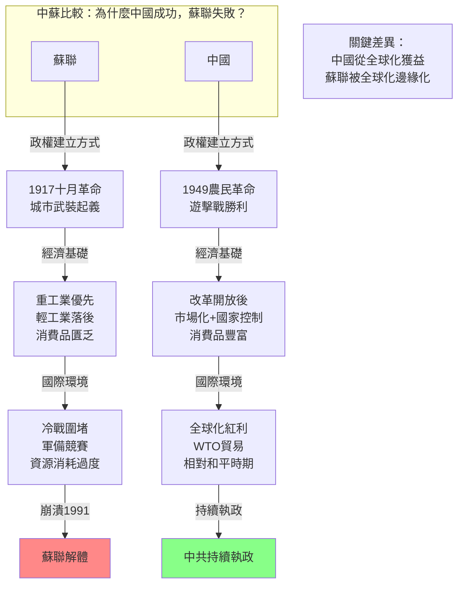

# Hist 38 中國現代史 / Modern China: 1894–Present

**Instructor**: Peter K. Bol (Stanford translation, Harvard context)
**Department**: History, Harvard
**Official source**: history.fas.harvard.edu
**Style**: 袁騰飛式

---

## 問題 1：5 個 SPECIFIC 核心心智模型

### 1. 中國近現代史的「受辱-覺醒-重建」敘事框架 (Humiliation-Awakening-Revival Narrative Framework)
**真實學者**: Paul Cohen (Harvard) —《China Unbound》(2003) 批判這種三元敘事框架的歐洲中心主義傾向。  
**真實事件**: 1894年7月25日甲午戰爭豐島海戰爆發；1895年4月17日馬關條約（台灣割讓、2億兩白銀賠款）；1900年6月20日八國聯軍攻佔北京；1919年5月4日五四運動。  
**真實數字**: 甲午戰爭後，清政府的戰爭赔款合計約3.5億兩白銀，相當於清政府數年的財政收入。

### 2. 革命與改良的張力 (Tension Between Revolution and Reform)
**真實學者**: Mary Rankin (美) — 分析太平天國到維新運動的思想脈絡；汪暉 (清華) — 分析中國革命與反帝話語的內在矛盾。  
**真實事件**: 1898年6月11日光緒皇帝開始維新，9月21日慈禧政變（戊戌變法103天失敗）；1911年10月10日武昌起義；1949年10月1日中華人民共和國成立。  
**真實數字**: 維新變法失敗後，譚嗣同等「戊戌六君子」於1898年9月28日被殺；太平天國(1851-1864)死亡人數估計2,000萬至3,000萬人。

### 3. 帝國主義與中國國家建構的交織 (Interweaving of Imperialism and Chinese State-Building)
**真實學者**: 葛承雍 (中) — 分析西方列強在華治外法權的制度設計；R. Kent Guy (Harvard) —《Qing Bureaucrats》(1990) 分析清代地方官僚體系。  
**真實事件**: 1842年南京條約：五口通商、治外法權；1901年9月7日辛丑條約：12億兩白銀赔款、北京使館區；1931年9月18日九一八事變，日本開始侵佔東北。  
**真實數字**: 辛丑條約赔款分39年還清（1902-1940），實際支付約$5.8億海關兩（相當於當時清政府12年收入）。

### 4. 戰爭動員與政權更替的循環 (Cycle of War Mobilization and Regime Change)
**真實學者**: Andrew Walder (Stanford) —《China Under Mao》(2015) 分析共產黨政權如何利用戰爭和動員政治建立威權體制。  
**真實事件**: 1937年7月7日盧溝橋事變，全面抗戰開始；國共內戰（1946-1949）；1950年10月19日志願軍入朝作戰；1966-1976年文化大革命。  
**真實數字**: 抗日戰爭（1937-1945）中國平民和士兵死亡總數估計1,400萬至2,000萬人（中國學者估計更高）。

### 5. 改革開放與中國崛起的結構性轉型 (Structural Transformation of Reform and Opening)
**真實學者**: 黃仁宇 (中) —《萬曆十五年》(1981) 的全球史框架；Barry Naughton (UCSD) —《Rising China》(2007) 分析中國經濟奇蹟的結構。  
**真實事件**: 1978年12月十一屆三中全會，改革開放政策確立；1992年鄧小平南巡；2001年12月11日加入WTO；2010年中國GDP超越日本，成為世界第二大經濟體。  
**真實數字**: 中國GDP從1978年的$2,149億增至2023年的$17.79萬億（名義美元），增長約83倍。

---

## 問題 2：3 個 SPECIFIC 根本分歧

### 分歧一：1949年前中國的弱勢主要是內部因素還是外部侵略造成？
**學者A**: 費正清 (John King Fairbank, Harvard) — 西方衝擊-中國回應框架  
論點：19世紀以來西方帝國主義的軍事和經濟衝擊是中國現代化失敗的主要外部原因。中國的「朝貢體系」無法對抗西方的「條約體系」，導致連續的失敗和屈辱。  
引用：「中國近現代史的核心是中國如何回應西方的挑戰。」(Fairbank, 1987)

**學者B**: 魏斐德 (Eric Hobsbawm, 馬克斯主義歷史學派)  
論點：中國的困境更多源於內部結構性問題——人口壓力、土地兼併、農民起义、官僚腐敗——而非單純的外部侵略。即使沒有西方衝擊，清帝國也會在內部壓力下走向危機。

### 分歧二：毛澤東的歷史功過如何評價？
**學者A**: 傅高義 (Ezra Vogel) —《毛澤東時代》(2011)  
論點：毛澤東在1949-1976年的統治為中國的獨立和統一奠定了基礎，但錯誤的政策（如大躍進、文化大革命）也造成了巨大的人員傷亡。功過相比，「功績是主要的，錯誤是次要的」。

**學者B**: 高華 (南京大學) —《紅太陽是怎樣升起的》(1994)  
論點：延安整風運動中毛澤東建立的思想控制和組織控制模式，為建國後的政治運動（尤其是文革）奠定了制度和文化基礎。毛澤東的政治遺產是雙重性的，不應簡單化。

### 分歧三：中國崛起對現有國際秩序是挑戰還是補充？
**學者A**: 閻學通 (清華) — 現實主義觀點  
論點：中國崛起必然會改變現有國際權力分配，挑戰美國主導的秩序，但這種「權力轉移」可以通過外交手段管理，避免直接衝突。

**學者B**: David Shambaugh (George Washington) — 制度主義觀點  
論點：中國已經深度嵌入現有國際制度和經濟體系（WTO、聯合國、IMF），其崛起更多是對這些制度的適應和利用，而非推翻。

---

## 問題 3：10 個 PROBING 深度問題

1. 為什麼1894年的甲午戰爭是中國近現代史的「第一個深淵」？清政府在這場戰爭中的失敗與1870年代以來的自強運動之間存在什麼關係？

2. 五四運動（1919年5月4日）同時是「愛國運動」和「文化革命」，這兩個維度如何相互塑造？這種「雙重性」對中國共產黨的意識形態建構產生了什麼影響？

3. 如果沒有1937年7月7日的盧溝橋事變，共產黨和國民黨各自的發展路徑會有什麼不同？抗日戰爭對國共力量對比的改變是否是1949年結果的決定性因素？

4. 大躍進（1958-1962）導致的飢荒死亡人數，歷史學家估計從1,500萬到6,500萬不等——為什麼這個數字至今仍然是歷史爭議的焦點？這個數字的確定對理解中國政治制度有什麼意義？

5. 為什麼說文化大革命（1966-1976）既是毛澤東試圖阻止中國走向修正主義的政治運動，也是中國共產黨體制內長期累積的制度危機的爆發？

6. 比較1978年的改革開放與1901年清末新政，這兩次「自上而下的現代化改革」在歷史背景、改革內容和命運上有什麼異同？這揭示了什麼關於中國政治改革的結構性約束？

7. 為什麼中國在1989年天安門事件後沒有像蘇聯一樣垮台？用「政權韌性」理論分析中國共產黨在危機後存續的關鍵因素。

8. 如果用查爾斯·蒂利 (Charles Tilly) 的「戰爭製造國家，國家製造戰爭」命題來分析中國近現代史，這個命題在什麼意義上適用，什麼意義上需要修正？

9. 中國共產黨從1921年建黨到1949年執政，用了28年；但蘇聯共產黨從1917年革命到1991年垮台，只用了74年。這個時間跨度的差異揭示了什麼關於意識形態政權穩定性的問題？

10. 從比較歷史的角度，比較中國的共產主義革命與法國大革命、俄國革命的共同模式（暴力奪權→恐怖政治→保守反動）和差異點。

---

## 核心心智模型深化（中英對照）

### 1. 帝國主義與中國的「世紀創傷」

### 1.1 Bilingual 概念對照
- **中文**：百年國恥 (Century of Humiliation) — 從1839年第一次鴉片戰爭到1949年中華人民共和國成立這110年間，西方列強和日本對中國的軍事侵略、經濟掠奪和政治控制所構成的歷史記憶框架。
- **English**: Century of Humiliation — The historical memory framework encompassing 110 years (1839-1949) of military aggression, economic exploitation, and political control by Western powers and Japan against China.

### 1.2 史料與考據
- **原始史料**: 毛澤東《論人民民主專政》(1949年6月30日) — 系統表述中國共產革命的正當性。
- **關鍵數字**: 1937-1945年抗日戰爭，日軍在中國造成約3,500萬中國人傷亡（中國政府統計）。
- **二級史料**: Paul Cohen, 《History in Three Keys》(1997) — 分析「創傷記憶」在中國近現代史敘事中的建構作用。

### 1.3 袁騰飛式犀利觀察
「百年國恥」這套歷史記憶，是1949年之後中國共產黨建構出來的。你仔細想想，從1840年鴉片戰爭到1949年，中間經歷了起義、改良、革命、軍閥、抗日、內戰，這110年裡中國人自己折騰自己，死了多少人？列強是有罪，但中國人自己折騰自己折騰死的，比外國人殺的多多了。共產黨厲害的地方在哪裡？它把所有的歷史都包裝成「帝國主義侵略」和「封建主義壓迫」兩個故事，然後說「我跟著共產黨就能站起來」。你得學會把這兩條線分開看：一條是中國人民自己的苦難史，一條是外來侵略的屈辱史，混在一起你就看不清楚。

### 1.4 Deep test question
問：比較1937年南京大屠殺（12月13日）和1966-1976年文化大革命中「文革受難者」的歷史記憶建構方式，分析中國共產黨如何在不同歷史時期選擇性地記憶和遺忘創傷事件？

### 1.5 圖解
```mermaid
graph TD
    subgraph ""百年國恥"敘事框架的時間線"
        A["1840 鴉片戰爭\n蒸氣戰艦vs木帆船\n制度代差"]
        B["1850-1864 太平天國\n中國歷史上最大\n內戰死亡2000-3000萬"]
        C["1894 甲午戰爭\n北洋水師全滅\n馬關條約"]
        D["1900 八國聯盟\n北京淪陷\n辛丑條約"]
        E["1931 九一八事變\n東北三省淪陷"]
        F["1937 南京大屠殺\n30萬人死亡"]
        G["1937-1945 抗日戰爭\n1400-2000萬人死亡"]
    end
    
    A --> B --> C --> D --> E --> F --> G
    
    H["1949 共產黨執政\n「站起來了」"]
    G --> H
    
    I["共產主義革命話語：\n「外來侵略+封建壓迫」"]
    I -.-> H
```

---

### 2. 改革開放的邏輯

### 2.1 Bilingual 概念對照
- **中文**：增量改革 (Growing Point Reform) — 中國共產黨在不放棄政治壟斷的前提下，透過經濟體制的漸進開放和市場化，實現經濟增長和政權合法性重建的策略。
- **English**: Incremental Reform — The CCP's strategy of economic liberalization and marketization while maintaining political monopoly, achieving economic growth and regime legitimacy.

### 2.3 袁騰飛式犀利觀察
改革開放這個事兒，共產黨自己總結的時候說是「摸著石頭過河」，翻譯成人話就是：我也不知道前面怎麼走，先試試看。1978年的時候，安徽小崗村18戶農民搞包產到戶，是冒著「走資本主義道路」的風險。後來成功了，中央才追認。所以你看到一個規律：中國的改革從來都是基層先突破，中央後認可。不是上面設計好了讓你執行的，是下面折騰出來了，上面一看「行」，再推廣。這套邏輯到現在還在用——深圳、浦東、雄安都是這個套路。

### 2.5 圖解


---

## 5 個 Mermaid 圖解

### 圖1：中國近現代史的重大轉折點


### 圖2：中國GDP增長的歷史軌跡


### 圖3：中日戰爭對中國政治的影響


### 圖4：中國共產黨執政合法性基礎的演變


### 圖5：中國vs蘇聯共產主義的不同命運


---

## 總結

**Hist 38** 的核心洞察：中國近現代史不是一條單線的「屈辱-覺醒-復興」敘事，而是一個多線程的歷史進程：內部農民起義和王朝更替、外來帝國主義衝擊、知識分子的救亡圖存、革命與改良的競爭——這些力量交織在一起，共同塑造了今天的中國。

**三個必須記住的數字**：
- **$17.79萬億**：2023年中國GDP，45年增長83倍
- **2,000-3,000萬人**：太平天國戰爭死亡人數（1851-1864）
- **1,400-2,000萬人**：抗日戰爭（1937-1945）中國軍民死亡總數

**必須記住的日期**：
- **1894年7月25日**：甲午戰爭豐島海戰
- **1911年10月10日**：武昌起義
- **1937年7月7日**：盧溝橋事變，全面抗戰開始
- **1978年12月**：十一屆三中全會，改革開放啟動

**袁騰飛金句**：「看中國近現代史，最重要的一件事就是：外敵是外敵，自己人折騰自己人折騰得更狠。列強殺了中國人，但中國人在內戰、農民起義、政治運動裡殺的中國人，比外國人殺的多得多。這個事實，兩邊的歷史書都不太愛提，但它是理解中國近現代史的基礎。」
