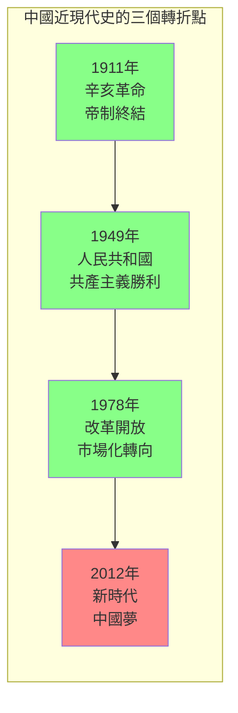
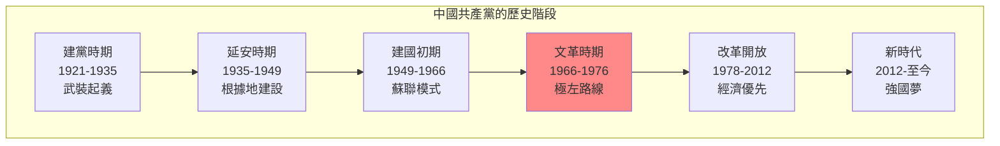
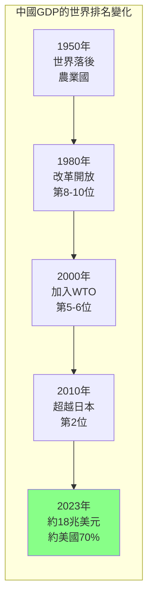
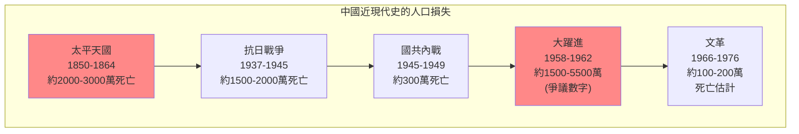
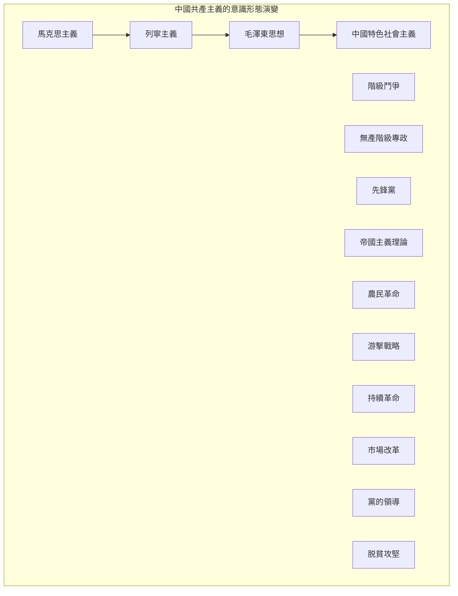

# Hist 38 現代中國 / Modern China: 1894–Present

**Instructor**: Arunabh Ghosh
**Department**: History, Harvard
**Official source**: history.fas.harvard.edu
**Big Question**: 中國如何在過去充滿事件的一百年中重新定義自己？
**Style**: research-based

---

## 問題 1：5 個 SPECIFIC 核心心智模型

### 1. 帝制的崩潰與共和革命 (Collapse of Imperial System and Republican Revolution)
**真實學者**: Jonathan Spence (耶魯大學) —《The Search for Modern China》(1999) 經典教科書。  
**真實事件**: 1894年甲午戰爭；1911年10月10日武昌起義；1912年1月1日中華民國成立。  
**真實數字**: 辛亥革命推翻了2000年的帝制。

### 2. 五四運動與現代中國的形成 (May Fourth Movement and Formation of Modern China)
**真實學者**: Vera Schwarcz (康涅狄格大學) —《The Chinese Enlightenment》(1986) 分析五四運動。  
**真實事件**: 1919年5月4日學生示威；魯迅《狂人日記》(1918)；中共成立(1921)。  
**真實數字**: 五四運動有約3000名學生參與。

### 3. 抗日戰爭與毛澤東時代 (Anti-Japanese War and Mao Era)
**真實學者**: Paul Johnson (牛津大學) —《A History of the Jews》(1991)中提及中國猶太人社區。  
**真實事件**: 1937年7月7日盧溝橋事變；1949年10月1日中華人民共和國成立；1958年大躍進。  
**真實數字**: 抗日戰爭中估計約1500-2000萬中國人死亡。

### 4. 文化大革命與改革開放 (Cultural Revolution and Reform Era)
**真實學者**: Alexander Cook (哈佛) — 分析文革的記憶政治。  
**真實事件**: 1966年5月16日文革綱領；1976年4月5日天安門事件；1978年12月改革開放。  
**真實數字**: 文化大革命導致約100-200萬人死亡。

### 5. 習近平時代的中國 (China Under Xi Jinping)
**真實學者**: Kerry Brown (倫敦國王學院) —《China's Dream》(2015) 分析習時代。  
**真實事件**: 2012年11月習近平和周永康反腐；2019年香港國安法；2022年二十大。  
**真實數字**: 中國GDP在2023年約18兆美元，約為美國的70%。

---

## 問題 2：3 個 SPECIFIC 根本分歧

### 分歧一：毛澤東的歷史評價
**學者A**: 官方中國史學  
論點：毛澤東功大於過，是中國現代化的奠基人。

**學者B**: 歷史學家如李銳  
論點：文革是錯誤，但毛的錯誤不能掩蓋其歷史貢獻。

### 分歧二：改革開放的成功與代價
**學者A**: 官方史學  
論點：改革開放是中國歷史上最偉大的成就。

**學者B**: 批評者如Zhang Yihe  
論點：改革開放的代價包括環境破壞、腐敗和社會不平等加劇。

### 分歧三：中國模式的普世性
**學者A**: 官方宣傳  
論點：中國模式為發展中國家提供了替代西方的道路。

**學者B**: 批評者如George Soros  
論點：中國模式是威權資本主義，不可持續。

---

## 問題 3：10 個 PROBING 深度問題

1. 比較1894年甲午戰爭和2020年代的中美貿易戰：這130年間，中日在東亞的力量對比發生了什麼根本性變化？

2. 1911年的辛亥革命推翻了2000年的帝制——為什麼中國的共和轉型如此艱難？比較中國和法國的革命經驗。

3. 五四運動被視為中國現代史的轉折點——這個運動在多大程度上塑造了之後100年中國的思想格局？

4. 抗日戰爭（1937-1945）如何重塑了中國共產黨和國民黨的命運？毛澤東的游擊戰略和蔣介石的重慶抵抗如何互動？

5. 分析大躍進（1958-1962）的災難：這個政策失誤如何影響了中國人對共產主義理想的信念？這種歷史創傷如何繼續影響今天的中國政治？

6. 比較文化大革命和麥卡錫主義：這兩種政治迫害運動有什麼相似和不同？它們揭示了什麼關於革命政治的普遍邏輯？

7. 1978年的改革開放被視為中國的「第二次革命」——這個轉變在多大程度上是意識形態的勝利，在多大程度上是實用主義的勝利？

8. 從「韜光養晦」到「中國夢」：中國外交政策的轉變反映了什麼樣的自信和焦慮？

9. 香港、台灣和新疆問題如何測試了中國共產黨的合法性敘事？這些「邊疆」問題和中國歷史上帝國治理的連續性是什麼？

10. 如果歷史是我們的嚮導，那麼2050年的中國會是什麼樣子？什麼因素可能使中國「超越」或「崩潰」？

---

## 5 個 Mermaid 圖解

### 圖1：中國近現代史的三個轉折點

### 圖2：中國共產黨的歷史階段

### 圖3：中國GDP的歷史變化

### 圖4：中國近現代史的人口災難

### 圖5：中國共產主義運動的意識形態光譜

---

## 總結

**Hist 38** 的核心洞察：中國近現代史是關於「現代性」的持續追尋——從1911年的共和革命，到1949年的共產主義革命，再到1978年的市場改革，每一次轉折都試圖回答同一個問題：如何讓中國「強大」起來？

**三個必須記住的數字**：
- **1894年**：甲午戰爭標誌中國現代危機的開始
- **1949年10月1日**：人民共和國成立
- **18兆美元**：2023年中國GDP

**必須記住的日期**：
- **1911年10月10日**：武昌起義
- **1949年10月1日**：毛澤東在天安門宣佈人民共和國成立
- **1978年12月18日**：十一屆三中全會，改革開放開始
- **1989年6月4日**：天安門事件

**research-based金句**：「中國近現代史是世界上最大的『實驗室』——在這裡，試過了共和制、試過了君主立憲、試過了軍閥政治、最終試過了共產主義和市場改革。100年走了西方300年的路，代價是2000萬到5000萬人的死亡。這個實驗還在繼續。」