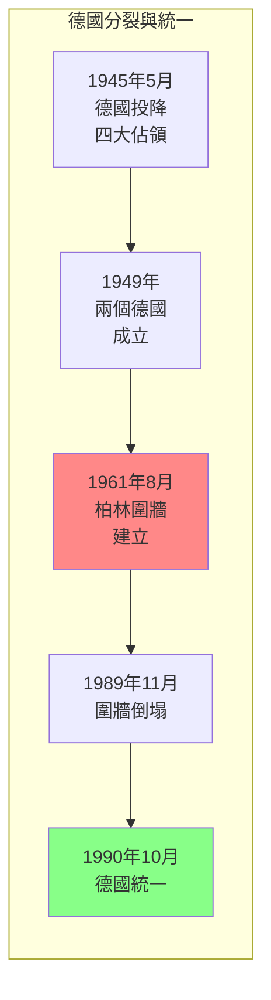
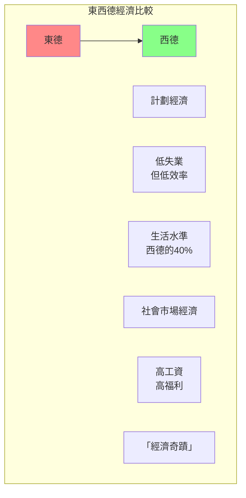
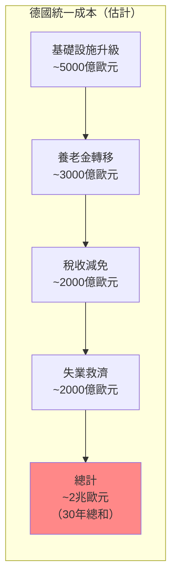
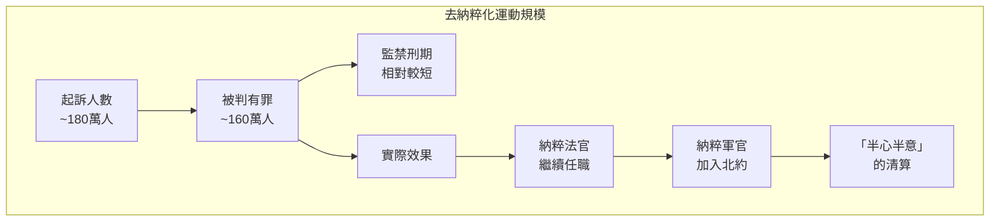
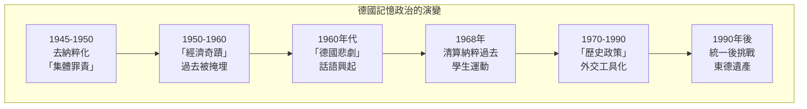

# Hist 46 希特勒之後的生活 / Life after Hitler: How Decolonization and Global Cold War Shaped Germany after WW2

**Instructor**: David Spreen
**Department**: History, Harvard
**Official source**: history.fas.harvard.edu
**Big Question**: 我們如何理解二戰後德國的全球角色？
**Style**: research-based

---

## 問題 1：5 個 SPECIFIC 核心心智模型

### 1. 三個德國的出現 (The Emergence of Three Germanies)
**真實學者**: Mary Fulbrook (倫敦大學) —《A History of Germany》(2002) 分析戰後德國的分裂。  
**真實事件**: 1945年5月8日德國無條件投降；1949年5月23日西德成立；1949年10月7日東德成立。  
**真實數字**: 冷戰高峰期，東德人口約1700萬，西德約5900萬。

### 2. 去納粹化與記憶政治 (Denazification and Memory Politics)
**真實學者**: Jeffrey Herf (馬里蘭大學) —《Divided Memory》(1997) 分析東西德的記憶政治。  
**真實事件**: 1945-1950年去納粹化運動；1951年聯邦德國補償條例；1968年學生運動和納粹過去的公開討論。  
**真實數字**: 約180萬人被起訴去納粹化，但大多數案件被撤銷。

### 3. 經濟奇蹟與社會市場經濟 (Wirtschaftswunder and Social Market Economy)
**真實學者**: Werner Abelshauser (比勒費爾德大學) — 分析西德經濟奇蹟。  
**真實事件**: 1948年貨幣改革；1950年代西德經濟高速增長期；1966年第一次經濟衰退。  
**真實數字**: 西德GDP從1950年的約200億美元增長到1970年的約2200億美元。

### 4. 1968年運動與納粹過去 (1968 Movement and Nazi Past)
**真實學者**: Detlev Peukert (漢堡大學) — 分析1968年運動的政治意義。  
**真實事件**: 1967年學生Ben Ohnesorg被警察射殺；1968年4月攻擊施普林格大樓；1969年學生運動與恐怖主義興起。  
**真實數字**: 1968年運動最終導致了1970年代恐怖主義浪潮，包括紅軍旅。

### 5. 統一與統一後的挑戰 (Unification and Post-Unification Challenges)
**真實學者**: Charles Maier (哈佛) — 分析德國統一的歷史意義。  
**真實事件**: 1989年11月9日柏林圍牆倒塌；1990年10月3日德國統一；2015年移民危機。  
**真實數字**: 統一後東德轉型耗費了約2兆歐元。

---

## 問題 2：3 個 SPECIFIC 根本分歧

### 分歧一：西德 vs 東德的評價
**學者A**: 主流西方史學  
論點：西德代表了民主和繁榮，東德代表了壓迫和失敗。

**學者B**: 東德記憶研究者如 Giesela Derler  
論點：東德有自己的「社會主義成就」，不應被完全否定。

### 分歧二：德國的戰爭責任
**學者A**: 主流德國史學  
論點：德國有持續的歷史責任，記憶文化是必要的。

**學者B**: 批評者如 Götz Aly  
論點：過度的記憶責任可能成為德國外交政策的障礙。

### 分歧三：2015年移民政策的歷史根源
**學者A**: 人道主義觀點  
論點：德國有歷史責任接受移民，特別是來自中東的戰爭受害者。

**學者B**: 現實主義觀點  
論點：大量移民帶來了社會整合挑戰，特別是對納粹遺產敏感的東德地區。

---

## 問題 3：10 個 PROBING 深度問題

1. 比較冷戰時期的東西德：這兩個「德國」如何同時是獨立的實體，又是美國和蘇聯之間冷戰的棋子？

2. 為什麼去納粹化運動最終成為一個「半心半意」的程序？這種不完整的過去處理如何影響了德國社會對納粹歷史的集體記憶？

3. 分析1968年學生運動的政治意義：這一代戰後出生的年輕人為什麼要「清算」他們父母一代的納粹過去？這種清算對德國政治文化有什麼影響？

4. 西德的「經濟奇蹟」在多大程度上依賴於馬歇爾計劃、冷戰紅利和對納粹受害者的剝削？

5. 比較東德的「現實社會主義」和蘇聯的共產主義實驗：東德的「社會主義成就」和失敗各是什麼？

6. 1989年柏林圍牆倒塌和1990年德國統一：這些事件在多大程度上是德國人自己的選擇，在多大程度上是美蘇冷戰結構轉變的結果？

7. 德國統一30年後，東西德之間的經濟和社會差距仍然存在：這種「心理分界線」(Mauer im Kopf) 如何繼續影響德國政治？

8. 比較德國和日本的戰後記憶政治：為什麼德國能夠建立「記憶文化」，而日本的戰爭歷史爭議持續到今天？

9. 2015年德國開放邊境接收約100萬移民：這個決定如何與德國的納粹歷史相關聯？這種歷史責任感是健康的還是過度的？

10. 如果冷戰是美蘇兩個超級大國的代理人戰爭——那麼東西德是否是這場戰爭中最大的受害者？

---

## 5 個 Mermaid 圖解

### 圖1：德國分裂與統一

### 圖2：東西德經濟比較

### 圖3：德國統一成本

### 圖4：去納粹化運動

### 圖5：德國記憶政治的演變

---

## 總結

**Hist 46** 的核心洞察：德國戰後歷史是關於如何處理「不可處理的過去」的持續實驗。從去納粹化到統一後的挑戰，德國經驗告訴我們：記憶政治不僅是對過去的回應，更是塑造現在和未來政治的工具。

**三個必須記住的數字**：
- **2兆歐元**：德國統一30年的總成本
- **1949年**：東西德分別成立
- **1989年11月9日**：柏林圍牆倒塌

**必須記住的日期**：
- **1945年5月8日**：德國無條件投降
- **1961年8月13日**：柏林圍牆建立
- **1989年11月9日**：柏林圍牆倒塌
- **1990年10月3日**：德國統一

**research-based金句**：「德國戰後史是世界上最大的『贖罪實驗』——用經濟補償、政治教育和記憶文化來洗刷納粹的罪惡。但這個實驗從來沒有完成過。1968年的學生運動、2015年的移民危機、東西德的差距——每一次新的危機，都會讓德國人重新問：我們到底應該怎麼面對那段歷史？」