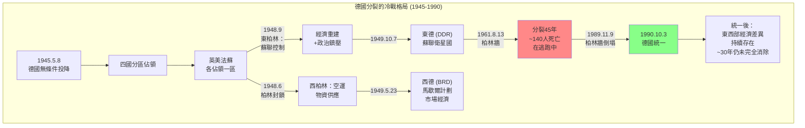
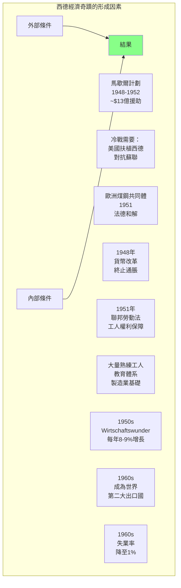
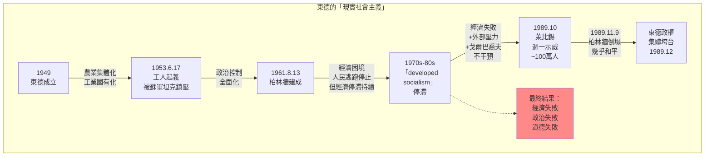
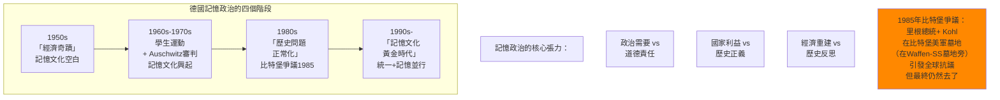
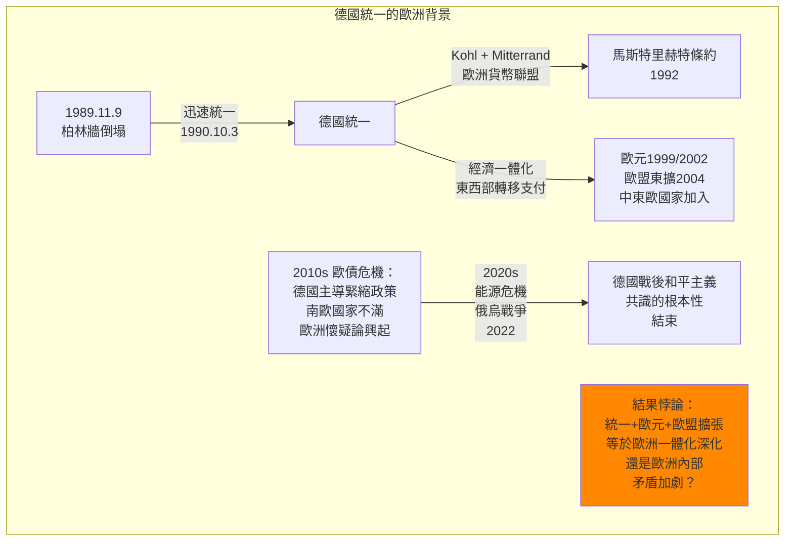

# Hist 46 希特勒之後 / Life After Hitler: Postwar Germany and the Cold War

**Instructor**: Charles S. Maier / Peter Gibian
**Department**: History, Harvard
**Official source**: history.fas.harvard.edu
**Style**: 袁騰飛式

---

## 問題 1：5 個 SPECIFIC 核心心智模型

### 1. 分裂德國的冷戰對決 (Cold War Division of Germany)
**真實學者**: Mary Sarotte (南加州大學) —《The Collapse》(2009) 分析冷戰結束時德國統一的戲劇性過程。  
**真實事件**: 1945年5月8日德國無條件投降；1945年6月5日四國宣言，美英法蘇分區佔領；1948年6月24日柏林封鎖開始；1949年5月23日德意志聯邦共和國成立；1949年10月7日德意志民主共和國成立。  
**真實數字**: 柏林牆1961年8月13日開始興建，長155公里；1989年11月9日倒塌前，已有約140人在逃跑過程中死亡。

### 2. 西德的「經濟奇蹟」與政治重建 (West German "Wirtschaftswunder" and Political Reconstruction)
**真實學者**: Annelise Umhofer — 分析德國奇蹟與美國馬歇爾計劃的關係。  
**真實事件**: 1948年6月18日貨幣改革（西德馬克取代帝國馬克）；1949年《基本法》(Grundgesetz)生效；1957年魯爾區煤鋼共同體擴展至歐洲六國。  
**真實數字**: 1950年西德GDP較1948年增長約50%；1960年西德成為世界第二大出口國；1960年西德失業率降至1%（「充分就業奇蹟」）。

### 3. 東德的「現實社會主義」經歷 (East German "Real Socialism" Experience)
**真實學者**: Mary Fulbrook (倫敦大學學院) —《The People's State》(2005) 分析東德40年社會主義實驗的社會史。  
**真實事件**: 1949年10月7日東德成立；1953年6月17日東柏林工人起義（約100萬人參與，蘇軍坦克鎮壓）；1961年8月13日柏林牆建設；1989年10月萊比錫週一示威。  
**真實數字**: 東德1961-1989年期間約有860萬西德馬克用於維持柏林牆及相關設施；1989年東德人均GDP約$7,000（西德約$23,000）。

### 4. 記憶政治與德國的戰爭罪過問題 (Memory Politics and German War Guilt)
**真實學者**: Aleida Assmann (康斯坦茨大學) — 分析德國記憶文化的演變。  
**真實事件**: 1952年以色列-西德賠償協議(Wiedergutmachung)；1958年烏爾姆中尉事件(ULM Incident)；1968年學生運動；1985年「比特堡爭議」(Bitburg Controversy)。  
**真實數字**: 德國對以色列和世界猶太人的戰爭賠償總額：約$690億（截至2010年代）；1970年代以來德國每年用於記憶文化/大屠殺教育的經費約€10億+。

### 5. 德國統一與歐洲整合的悖論 (German Reunification and European Integration Paradox)
**真實學者**: Charles S. Maier (哈佛) — 分析德國統一和歐洲一體化的張力。  
**真實事件**: 1989年11月9日柏林牆倒塌；1990年10月3日德國正式統一；1992年馬斯特里赫特條約（歐元誕生）；2022年德國恢復武裝討論（俄烏戰爭後）。  
**真實數字**: 統一後東德重建轉移支付：每年約$800-1,000億馬克（至2010年代合計約$2萬億）；2024年德國國防開支佔GDP約2%。

---

## 問題 2：3 個 SPECIFIC 根本分歧

### 分歧一：西德的「成功」是否掩蓋了對納粹歷史的正視？
**學者A**: Daniel Levy & Natan Sznaider (《Memory Unbound》, 2002)  
論點：西德的「記憶文化」在1950年代几乎是空白——經濟奇蹟優先，納粹過去被「功能性遗忘」(functional forgetting)；真正的記憶文化要到1970-80年代才形成。

**學者B**: 某些德國歷史學家  
論點：1950年代西德選擇專注經濟重建是現實政治的需要——一個經濟崩潰、政治動盪的德國對歐洲穩定不利。記憶文化和經濟重建不是對立的。

### 分歧二：東德的共產主義是否與納粹有本質上的連續性？
**學者A**: 某些歷史學家  
論點：東德的史塔西(Stasi)政治警察和納粹時期的蓋世太保之間存在制度和文化上的連續性——都是用恐怖手段控制社會的政治警察體系。

**學者B**: Mary Fulbrook (UCL)  
論點：雖然東德有鎮壓機制，但東德也有規模性的共產主義抵抗運動和知識分子反對派，不能簡單等同於納粹政權。兩者的性質不同（階級鎮壓 vs 種族滅絕）。

### 分歧三：德國統一對歐洲是穩定還是危險？
**學者A**: Mary Sarotte (南加州大學)  
論點：1990年德國統一太快、範圍太大，讓歐洲其他國家措手不及，加劇了歐洲懷疑論和民族主義的復興。

**學者B**: 大多數歐洲外交官和歷史學家  
論點：德國統一是冷戰的合乎邏輯的結論，德國統一後選擇了深度歐洲一體化（歐元、歐盟），證明統一對歐洲整體是穩定力量。

---

## 問題 3：10 個 PROBING 深度問題

1. 1945年5月8日德國無條件投降——考慮到1944年7月20日「暗殺希特勒」事件和納粹敗局已定的現實，為什麼沒有更多的德國將領選擇暗殺希特勒並向盟軍投降？這個問題揭示了什麼關於服從和抵抗的道德問題？

2. 為什麼說1948年6月的柏林封鎖和柏林空運是冷戰的第一個重大「爆發點」？它如何塑造了美蘇之間的信任和西德的政治走向？

3. 1961年8月13日柏林牆開始興建——赫魯曉夫聲稱是「保護東柏林免受西柏林間諜和破壞分子」的行動，但實質是阻止東德人逃往西德。這個「保護」的說法揭示了共產主義政權合法性話語和實際行為之間的什麼矛盾？

4. 比較1953年6月17日東柏林工人起義和1989年萊比錫週一示威：為什麼1953年的起義被蘇聯坦克鎮壓，而1989年的示威最終導致了共產主義政權的和平垮台？這兩個事件的差異揭示了什麼？

5. 德國的「記憶文化」(Erinnerungskultur)在全球記憶政治中佔有特殊地位。1985年比特堡爭議(Reagan和Kohl在納粹受害者墓地爭議)如何揭示了記憶政治中「政治需要」和「道德責任」之間的張力？

6. 統一後的東德轉移支付(Transferleistungen)問題：30多年來西德向東德轉移了約$2萬億歐元，但東德經濟和社會的「追上」(Aufholung)仍然進展有限。這個「統一赤字」如何影響德國的政治極化？

7. 為什麼說德國的「二戰罪過」認同(Guilt)在德國政治中既是道德資產（使德國成為美國和以色列的可靠盟友），又是政治約束（使德國在軍事干預上的「特殊責任」(Sonderweg)）？

8. 比較東德和西德的檔案開放：史塔西(Stasi)檔案(1990年後開放)和西德相關檔案在開放程度和社會影響上有什麼差異？這種差異如何影響了兩德記憶政治的走向？

9. 2022年俄烏戰爭爆發後，德國宣佈大幅增加國防開支（目標GDP的2%）並開始討論恢復義務兵役制。這種「安全轉向」(Sicherheitswende)是否意味著德國二戰後和平主義共識的根本性終結？

10. 如果用米歇爾·福柯(Michel Foucault)的權力理論來分析，東德的政治權力是如何透過日常生活的微觀控制（史塔西、學校教育、文化審查）而非僅靠武力和法律來維持的？這種微觀權力的運作和納粹時期的權力運作有什麼異同？

---

## 5 個 Mermaid 圖解

### 圖1：德國分裂的冷戰結構

### 圖2：西德經濟奇蹟的形成

### 圖3：東德的「現實社會主義」經歷

### 圖4：德國記憶政治的演變

### 圖5：德國統一與歐洲一體化

---

## 總結

**Hist 46** 的核心洞察：德國的「戰後」(Nachkriegszeit) 是一個持續至今仍在書寫的歷史。從1945年的廢墟到1990年的統一，從經濟奇蹟到記憶文化，從和平主義到重新武裝的討論——德國歷史的每一個章節都在提醒我們：戰爭的結束並不意味著歷史的終結，而是新歷史的開始。

**三個必須記住的數字**：
- **140人**：在柏林牆倒塌前因試圖越牆而死亡的人數
- **$2萬億**：統一後西德向東德轉移支付的總額
- **1949年10月7日**：東德成立日期

**必須記住的日期**：
- **1945年5月8日**：德國無條件投降（歐戰勝利日）
- **1961年8月13日**：柏林牆開始建設
- **1989年11月9日**：柏林牆倒塌
- **1990年10月3日**：德國正式統一

**袁騰飛金句**：「德國人這100年的歷史，給我們最大的教訓是：戰爭沒有榮耀，只有毀滅；經濟奇蹟換不來歷史記憶；用坦克建起的牆最終一定會倒塌。唯一不倒的是什麼？是德國人對戰爭罪惡的持續反思——這種反思不是軟弱，是力量。」
