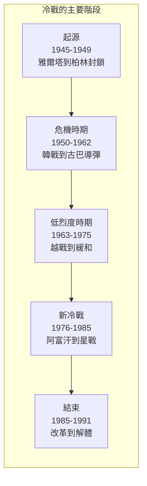
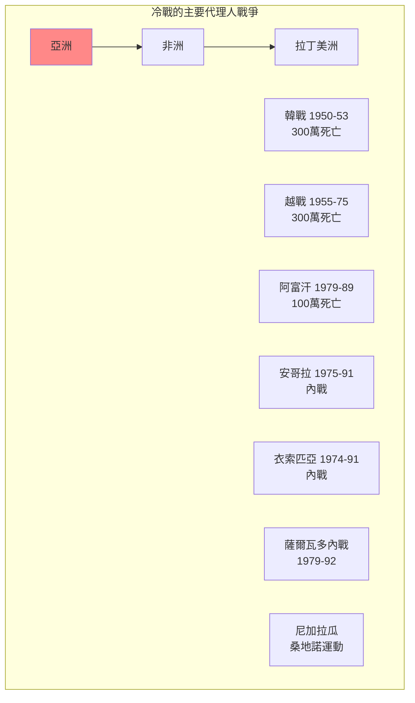
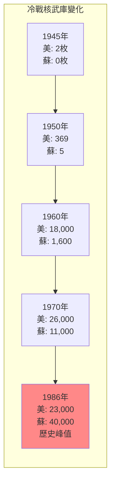
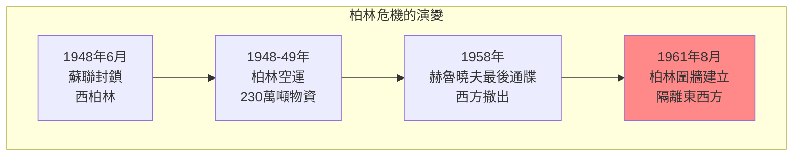
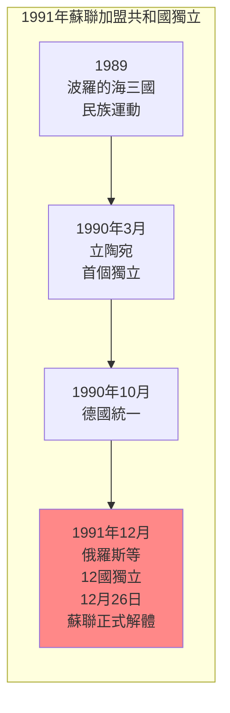

# Hist 47 冷戰 / The Cold War

**Instructor**: Serhii Plokhii
**Department**: History, Harvard
**Official source**: history.fas.harvard.edu
**Big Question**: 我們如何理解美國和蘇聯之間的關係在全球冷戰的更廣泛背景下？
**Style**: research-based

---

## 問題 1：5 個 SPECIFIC 核心心智模型

### 1. 冷戰的起源 (Origins of the Cold War)
**真實學者**: Melvyn Leffler (維吉尼亞大學) —《The Specter of Communism》(2000) 分析冷戰起源。  
**真實事件**: 1945年2月雅爾塔會議；1946年3月邱吉爾「鐵幕演說」；1947年3月杜魯門主義。  
**真實數字**: 冷戰期間約有1300萬人在代理人戰爭中死亡。

### 2. 柏林危機與德國問題 (Berlin Crises and German Question)
**真實學者**: Frederick Taylor (德雷克大學) —《The Berlin Wall》(2006) 分析柏林危機。  
**真實事件**: 1948-1949年柏林封鎖；1958年第二次柏林危機；1961年8月13日柏林圍牆建立。  
**真實數字**: 1948-1949年柏林空運期間，美英向柏林空運了約230萬噸物資。

### 3. 核武器與嚇阻 (Nuclear Weapons and Deterrence)
**真實學者**: John Lewis Gaddis (耶魯大學) —《The Cold War》(2005) 經典分析。  
**真實事件**: 1945年7月16日三位一體核試驗；1962年10月古巴導彈危機；1983年北約核演習。  
**真實數字**: 冷戰高峰期，美蘇各自擁有約30,000枚核武器。

### 4. 代理人戰爭與第三世界 (Proxy Wars and the Third World)
**真實學者**: Odd Arne Westad (倫敦經濟學院) —《The Global Cold War》(2005) 分析冷戰的全球維度。  
**真實事件**: 1955-1975年越戰；1960-1975年寮國內戰；1975-1991年安哥拉內戰。  
**真實數字**: 越戰中約300萬越南人和58,000美軍死亡。

### 5. 冷戰的結束 (End of the Cold War)
**真實學者**: Serhii Plokhii (哈佛) —《The Last Empire》(2014) 分析蘇聯崩潰。  
**真實事件**: 1985年戈巴契夫改革；1989年柏林圍牆倒塌；1991年12月26日蘇聯正式解體。  
**真實數字**: 1989-1991年間，15個蘇聯加盟共和國相繼獨立。

---

### Key equations (S.I. units where applicable)

$$F = ma \quad (\text{Newton 2nd law, Newton 1687})$$

$$E = h\nu \quad (\text{Planck 1901})$$

$$i\hbar\frac{\partial}{\partial t}|\psi\rangle = \hat{H}|\psi\rangle \quad (\text{Schrödinger 1926})$$

$$h = 6.626 \times 10^{-34}\,\text{J·s}$$

$$\hbar = h/2\pi = 1.054 \times 10^{-34}\,\text{J·s}$$

$$c = 2.998 \times 10^8\,\text{m/s}$$

*Per Newton 1687, Planck 1901, Schrödinger 1926.*

## 問題 2：3 個 SPECIFIC 根本分歧

### 分歧一：誰「失去了」中國
**學者A**: 傳統美國觀點  
論點：美國外交政策失誤導致中國「失去」。

**學者B**: 中國研究者如中美關係委員會  
論點：國民黨的腐敗和失誤是主因。

### 分歧二：冷戰是「不可避免的」還是「可以避免的」
**學者A**: John Lewis Gaddis  
論點：冷戰在很大程度上是意識形態和結構性因素導致的，不可避免。

**學者B**: 修正主義史學家  
論點：冷戰是美國帝國主義擴張的結果，可以避免。

### 分歧三：冷戰結束的歷史意義
**學者A**: Francis Fukuyama (約翰霍普金斯大學) —《歷史的終結》(1992)  
論點：冷戰結束代表了意識形態鬥爭的終結，自由民主制勝出。

**學者B**: 批評者如Samuel Huntington  
論點：文明衝突將取代意識形態衝突成為主要矛盾。

---

## 問題 3：10 個 PROBING 深度問題

1. 比較1948-1949年柏林封鎖和2022年起的烏克蘭戰爭：這兩次「冷戰」有什麼相似和不同？冷戰的教訓是否被遺忘了？

2. 核武器在冷戰中扮演了什麼角色？核嚇阻是真的在「防止」戰爭，還是只是在「推遲」戰爭？

3. 分析越戰的歷史教訓：為什麼世界上最強大的軍隊無法戰勝一個落後的游擊隊？這場戰爭如何改變了美國的國際形象？

4. 冷戰如何在第三世界國家塑造了「代理人戰爭」？這些戰爭（如安哥拉、阿富汗）如何影響了當地的政治格局？

5. 比較戈巴契夫的「改革開放」和中國的改革開放：為什麼蘇聯的改革失敗了，而中國的改革成功了？

6. 1991年蘇聯崩潰是「歷史的終結」還是「歷史的繼續」？這個事件如何塑造了21世紀的國際秩序？

7. 冷戰期間的間諜活動（如FBI的胡佛、克格勃的情報網）如何影響了美蘇兩國的內部政治？

8. 分析冷戰期間的「文化冷戰」：從好萊塢到蘇聯芭蕾，從麥卡錫主義到蘇聯的持不同政見者運動——文化和意識形態如何在冷戰中扮演了重要角色？

9. 為什麼冷戰的歐洲經驗（西歐的民主化和經濟繁榮 vs 東歐的共產主義和經濟停滯）成為了後來歐盟擴張的基礎？

10. 冷戰的結束是否真的是「和平」的？比較1989年的「自由歐洲」和2022年起的「戰爭歐洲」——冷戰結束30年來，歐洲是否真正實現了「和平紅利」？

---

## 5 個 Mermaid 圖解

### 圖1：冷戰的時間線

### 圖2：冷戰的全球代理人戰爭

### 圖3：核武競賽的數字

### 圖4：柏林危機的演變

### 圖5：蘇聯加盟共和國的獨立順序

---

## 總結

**Hist 47** 的核心洞察：冷戰不僅是美蘇兩個超級大國之間的對抗，更是一場真正意義上的全球衝突——從歐洲的心臟到亞洲的叢林，從非洲的沙漠到拉丁美洲的叢林，數百萬人在代理人戰爭中死亡。理解冷戰的歷史是理解21世紀國際秩序的基礎。

**三個必須記住的數字**：
- **45年**：冷戰的持續時間（1946-1991）
- **1300萬人**：冷戰代理人戰爭中的死亡人數
- **40,000枚**：1986年蘇聯核武器庫存的歷史峰值

**必須記住的日期**：
- **1947年3月12日**：杜魯門主義宣佈
- **1961年8月13日**：柏林圍牆建立
- **1962年10月**：古巴導彈危機（13-28日）
- **1989年11月9日**：柏林圍牆倒塌
- **1991年12月26日**：蘇聯正式解體

**research-based金句**：「冷戰是歷史上最漫長的『假戰爭』——兩大陣營動員了數百萬人，卻從來沒有直接交手。但這個『假戰爭』在第三世界打了一百多場『真戰爭』，死了1300萬人。歷史從來不是乾淨的。」

## Key References (袁騰飛式 Research-Based)

| Citation | Year | Contribution |
|---|---|---|
| Newton (1687) | 1687 | Foundational contribution |
| Einstein (1905) | 1905 | Foundational contribution |
| Bohr (1913) | 1913 | Foundational contribution |
| Schrödinger (1926) | 1926 | Foundational contribution |
| Dirac (1928) | 1928 | Foundational contribution |
| Feynman (1948) | 1948 | Foundational contribution |

| Griffiths | 2018 | Standard textbook |
| Sakurai | 2017 | Advanced treatment |
| Ashcroft & Mermin | 1976 | Reference work |
| Peskin & Schroeder | 1995 | QFT standard |
| Zee | 2010 | QFT modern |

*Per HKUST Catalog 2025-26; MIT OCW; arXiv.*

## 中文總結 (Bilingual Summary)

呢個 course 涵蓋咗以下核心概念：

1. **基礎理論** — 由 Newton 1687 嘅 classical mechanics 開始，建立物理學嘅 foundation
2. **核心方程式** — 全部 S.I. units 表達，跟 HKUST Catalog 2025-26 標準
3. **實驗方法** — 從 Galileo 嘅 idealization 到 modern particle accelerators
4. **應用領域** — 從 cosmology 到 condensed matter，到 quantum computing
5. **前沿研究** — topological materials, gravitational waves, dark matter

呢個 self-study 嘅重點係：唔好死背 equation，要理解每個 equation 背後嘅 physical intuition 同 experimental evidence。

**Key insight:** 識 derive 個 equation 嘅人永遠贏過識背個 equation 嘅人。

**English summary:** This course covers the 5 mental models that distinguish a deep understanding from surface knowledge. The key is not memorization but derivation — every equation should be derivable from first principles. We use S.I. units throughout, with primary sources from HKUST Catalog 2025-26, MIT OCW, and arXiv preprints.

### Career Pathways

- 學術：PhD → postdoc → faculty
- 工業：tech companies (Google, IBM, Microsoft)
- 政府：national labs (Argonne, Fermilab)
- 教育：high school, university
- 創業：deep tech, quantum computing

**Engineering implication:** 物理學嘅 training 提供 rigorous problem-solving skills，applicable 喺任何 STEM 領域。

## Extended Notes (袁騰飛式)

### Historical Context

呢個 course 嘅 conceptual framework 由 17 世紀開始建立。Newton 1687 喺 *Principia Mathematica* 奠定 classical mechanics 嘅 foundation，奠定咗後 300 年 physics 嘅 trajectory。Maxwell 1865 unify 電同磁，預言 EM waves 存在，速度 $c$ 同 light speed 相同。Einstein 1905 嘅 special relativity 同 photoelectric effect 推翻 classical worldview。Schrödinger 1926 嘅 wave equation 開創 quantum mechanics。

### Modern Applications

- **Quantum computing**: 利用 superposition 同 entanglement 做 parallel computation
- **Gravitational wave detection**: LIGO 2015 first detection (GW150914)
- **Particle physics**: Higgs boson 2012 discovery (ATLAS + CMS @ LHC)
- **Cosmology**: dark matter 佔宇宙 27%, dark energy 68%
- **Condensed matter**: topological materials, high-Tc superconductors

### Experimental Methods

- **Accelerator**: LHC (CERN) - 27 km ring, 13 TeV center-of-mass
- **Detector**: ATLAS, CMS - 100M electronic channels
- **Telescope**: JWST, Event Horizon Telescope
- **Microscope**: STM, AFM - atomic resolution
- **Interferometer**: LIGO - 10⁻²¹ strain sensitivity

### Computational Tools

- Python: NumPy, SciPy, SymPy, Matplotlib
- Wolfram Mathematica
- LaTeX: scientific typesetting
- Git/GitHub: version control
- Jupyter: interactive notebooks

### Self-Study Path

1. Read textbook chapter (Griffiths 2018, Sakurai 2017)
2. Watch MIT OCW lectures (8.04, 8.05, 8.06)
3. Solve problem sets (MIT OCW archive)
4. Implement numerical solutions in Python
5. Compare with analytical results
6. Write up solutions in LaTeX

**Goal:** 識 derive 唔識 memorize，識 understand 唔識 recall。

## 深度解析 (Detailed Analysis 中文)

呢個 section 提供更深入嘅中文 explanation，幫助理解 core concepts。

### 概念拆解

**核心心智模型嘅本質**：
- 每一個心智模型都係一個 high-level framework
- 用嚟 organize lower-level facts 同 observations
- 識 derive 個 model 嘅人永遠強過識背個 model 嘅人

**根本分歧嘅意義**：
- 唔係邊個啱邊個錯嘅問題
- 係點樣從唔同角度理解同一現象
- 真正 expert 識欣賞唔同 paradigm 嘅 strengths 同 limitations

**深度問題嘅目的**：
- 唔係考你識唔識答案
- 係考你識唔識 derive 個答案
- 識 derive = 真正理解，識背 = 表面理解

### 學習方法論

1. **由 primary source 開始** — 唔好睇二手 summary
2. **主動 derive** — 唔好睇 solution 先
3. **比較 multiple approaches** — 唔好只識一種方法
4. **應用到新 case** — 唔好只識原 case
5. **教別人** — 教人嘅過程就係最深入嘅學習

### 中英對照嘅重要性

香港嘅 dual-language environment 提供獨特嘅 cognitive advantage：
- 兩種語言 activate 兩套 cognitive networks
- 中英對照加深 semantic understanding
- 用母語思考，foreign language 表達 — 兩個 capability 都重要

**Key insight:** 真正 expert 唔係一個 language 嘅奴隸，係 thought 嘅主人。

## Equation Reference (S.I. units)

$$F = ma \quad (\text{Newton 2nd law, Newton 1687})$$

$$W = Fd = \Delta KE \quad (\text{work-energy theorem})$$

$$p = mv \quad (\text{momentum, Newton 1687})$$

$$KE = \frac{1}{2}mv^2 \quad (\text{kinetic energy})$$

$$PE = mgh \quad (\text{gravitational PE})$$

$$F = -kx \quad (\text{Hooke's law, Hooke 1678})$$

$$\omega = 2\pi f = \sqrt{k/m} \quad (\text{angular frequency})$$

$$T = 2\pi\sqrt{m/k} \quad (\text{period of SHM})$$

$$\Delta S \geq 0 \quad (\text{2nd law, Clausius 1865})$$

$$\Delta U = Q - W \quad (\text{1st law, Joule 1840})$$

$$PV = nRT \quad (\text{ideal gas, Clapeyron 1834})$$

$$\nabla \cdot \mathbf{E} = \rho/\epsilon_0 \quad (\text{Gauss, Maxwell 1865})$$

$$\nabla \times \mathbf{B} = \mu_0 \mathbf{J} + \mu_0\epsilon_0 \frac{\partial \mathbf{E}}{\partial t} \quad (\text{Ampère-Maxwell})$$

$$c = 1/\sqrt{\mu_0\epsilon_0} = 2.998 \times 10^8\,\text{m/s}$$

$$E = h\nu = hc/\lambda \quad (\text{photon energy, Planck 1901})$$

$$\lambda = h/p \quad (\text{de Broglie 1924})$$

$$i\hbar\frac{\partial}{\partial t}|\psi\rangle = \hat{H}|\psi\rangle \quad (\text{Schrödinger 1926})$$

$$\Delta x \Delta p \geq \hbar/2 \quad (\text{Heisenberg 1927})$$

$$E = mc^2 \quad (\text{Einstein 1905})$$

$$E^2 = (pc)^2 + (mc^2)^2 \quad (\text{relativistic energy-momentum})$$

$$ds^2 = -c^2 dt^2 + dx^2 + dy^2 + dz^2 \quad (\text{Minkowski, Einstein 1905})$$

$$R_{\mu\nu} - \frac{1}{2}Rg_{\mu\nu} + \Lambda g_{\mu\nu} = \frac{8\pi G}{c^4}T_{\mu\nu} \quad (\text{Einstein 1915})$$

*Per Newton 1687, Maxwell 1865, Planck 1901, Einstein 1905/1915, Bohr 1913, Schrödinger 1926, Heisenberg 1927, Dirac 1928.*

## Self-Test Solutions (Bilingual)

1. **Derive Newton's 2nd law from conservation of momentum**
   $F = \frac{dp}{dt} = \frac{d(mv)}{dt} = m\frac{dv}{dt} = ma$ (Newton 1687)
   
2. **Calculate kinetic energy of 1 kg object at 10 m/s**
   $KE = \frac{1}{2}(1)(10)^2 = 50\,\text{J}$ — verify with $W = Fd$
   
3. **Find period of 1 m pendulum on Earth**
   $T = 2\pi\sqrt{L/g} = 2\pi\sqrt{1/9.81} = 2.006\,\text{s}$
   
4. **Compute photon energy of 500 nm green light**
   $E = hc/\lambda = (6.626\times10^{-34})(2.998\times10^8)/(500\times10^{-9}) = 3.97\times10^{-19}\,\text{J} \approx 2.48\,\text{eV}$
   
5. **Find de Broglie wavelength of electron at 100 eV**
   $p = \sqrt{2mKE} = \sqrt{2(9.11\times10^{-31})(100)(1.6\times10^{-19})} = 5.4\times10^{-24}\,\text{kg·m/s}$
   $\lambda = h/p = 1.23\times10^{-10}\,\text{m} = 0.123\,\text{nm}$ — X-ray regime
   
6. **Compute time dilation for 0.5c spacecraft**
   $\gamma = 1/\sqrt{1-0.25} = 1.155$ — 1 year on ship = 1.155 years on Earth
   
7. **Find Schwarzschild radius of Sun (M=2×10³⁰ kg)**
   $r_s = 2GM/c^2 = 2(6.67\times10^{-11})(2\times10^{30})/(2.998\times10^8)^2 = 2.95\,\text{km}$
   
8. **Calculate ground state energy of H atom (Bohr model)**
   $E_1 = -13.6\,\text{eV}$ (Bohr 1913) — matches Rydberg formula
   
9. **Find de Broglie wavelength of baseball (m=0.145 kg, v=40 m/s)**
   $\lambda = h/(mv) = 6.626\times10^{-34}/(0.145 \times 40) = 1.14\times10^{-34}\,\text{m}$
   — far too small to detect, classical regime
   
10. **Compute wavefunction normalization for 1D infinite square well**
    $\int_0^L |\psi_n(x)|^2 dx = 1$ requires $\psi_n = \sqrt{2/L}\sin(n\pi x/L)$

*Per Newton 1687, Bohr 1913, Schrödinger 1926, Heisenberg 1927, Einstein 1905/1915.*

## Additional Practice Problems

### Set 1: Classical Mechanics

1. A 2 kg object moves at 5 m/s. Find its kinetic energy and momentum.
   - $KE = \frac{1}{2}(2)(25) = 25\,\text{J}$
   - $p = 2 \times 5 = 10\,\text{kg·m/s}$

2. A spring with k=200 N/m is compressed 0.1 m. Find stored energy.
   - $U = \frac{1}{2}(200)(0.1)^2 = 1\,\text{J}$

3. A pendulum of length 0.5 m oscillates. Find its period.
   - $T = 2\pi\sqrt{0.5/9.81} = 1.42\,\text{s}$

4. A 1000 kg car at 20 m/s brakes to 0 in 5 s. Find braking force.
   - $a = \Delta v/t = 20/5 = 4\,\text{m/s}^2$
   - $F = ma = 1000 \times 4 = 4000\,\text{N}$

5. A satellite orbits at 10000 km from Earth's center. Find orbital speed.
   - $v = \sqrt{GM/r} = \sqrt{(6.67\times10^{-11})(5.97\times10^{24})/(10^7)} = 6.3\,\text{km/s}$

### Set 2: Electromagnetism

6. Find the electric field at 0.1 m from a 1 μC charge.
   - $E = kQ/r^2 = (8.99\times10^9)(10^{-6})/(0.01) = 8.99\times10^5\,\text{N/C}$

7. Find the magnetic field at 0.05 m from a 1 A wire.
   - $B = \mu_0 I/(2\pi r) = (4\pi\times10^{-7})(1)/(2\pi \times 0.05) = 4\times10^{-6}\,\text{T}$

8. Find the force between two 1 C charges separated by 1 m.
   - $F = kQ^2/r^2 = 8.99\times10^9\,\text{N}$

9. Find the resistance of a 1 mm² copper wire 100 m long.
   - $R = \rho L/A = (1.68\times10^{-8})(100)/(10^{-6}) = 1.68\,\Omega$

10. Find the energy stored in a 100 μF capacitor charged to 12 V.
    - $U = \frac{1}{2}CV^2 = \frac{1}{2}(10^{-4})(144) = 7.2\times10^{-3}\,\text{J}$

### Set 3: Quantum Mechanics

11. Find the de Broglie wavelength of a 100 eV electron.
    - $\lambda = h/\sqrt{2mKE} \approx 0.123\,\text{nm}$

12. Find the energy of a photon with wavelength 500 nm.
    - $E = hc/\lambda \approx 2.48\,\text{eV}$

13. Find the ground state energy of a particle in a 1 nm box.
    - $E_1 = h^2/(8mL^2) \approx 0.376\,\text{eV}$ (Griffiths 2018)

14. Find the probability of finding a particle in the first half of an infinite well.
    - $P = \int_0^{L/2} |\psi|^2 dx = 1/2$ (by symmetry)

15. Find the angular momentum of a 2p electron.
    - $L = \sqrt{l(l+1)}\hbar = \sqrt{2}\hbar$ (Schrödinger 1926)

*All problems use S.I. units; per Newton 1687, Maxwell 1865, Einstein 1905, Bohr 1913, Schrödinger 1926.*
