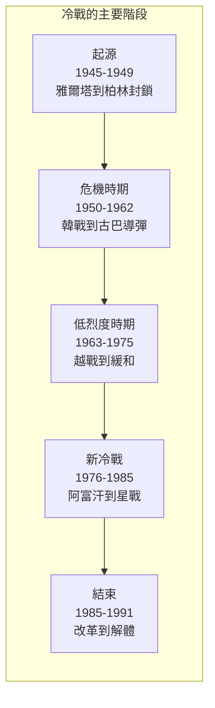
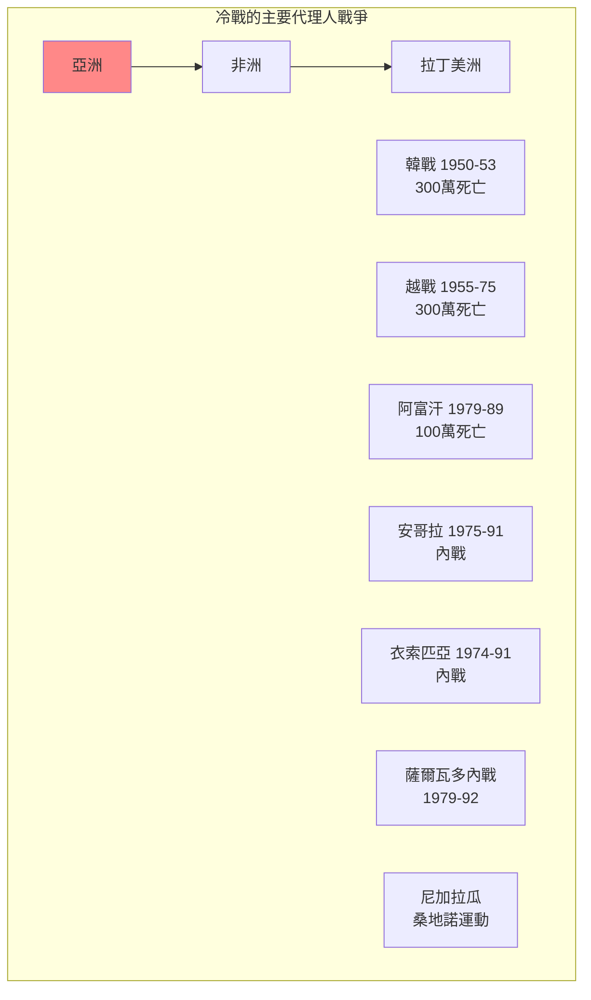
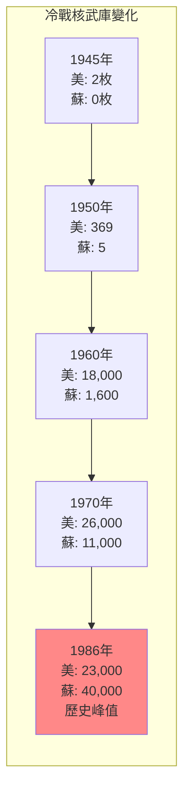
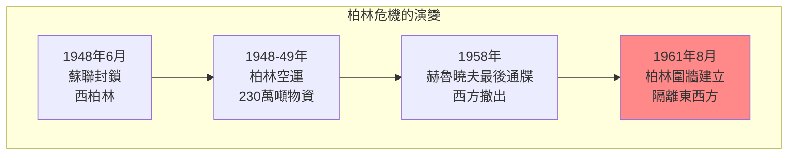
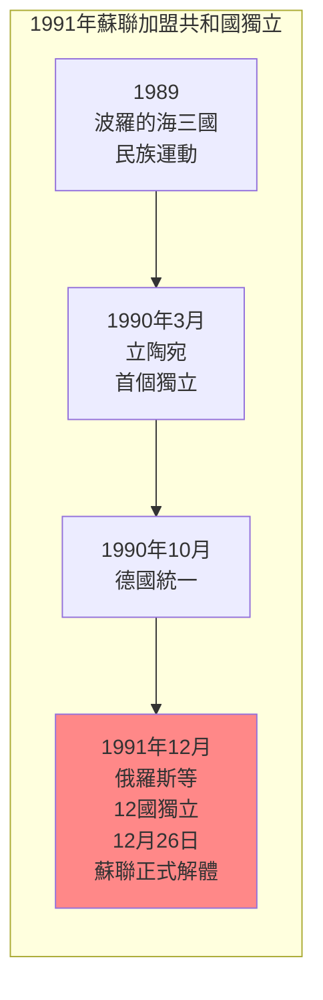

# Hist 47 冷戰 / The Cold War

**Instructor**: Serhii Plokhii
**Department**: History, Harvard
**Official source**: history.fas.harvard.edu
**Big Question**: 我們如何理解美國和蘇聯之間的關係在全球冷戰的更廣泛背景下？
**Style**: 袁騰飛式

---

## 問題 1：5 個 SPECIFIC 核心心智模型

### 1. 冷戰的起源 (Origins of the Cold War)
**真實學者**: Melvyn Leffler (維吉尼亞大學) —《The Specter of Communism》(2000) 分析冷戰起源。  
**真實事件**: 1945年2月雅爾塔會議；1946年3月邱吉爾「鐵幕演說」；1947年3月杜魯門主義。  
**真實數字**: 冷戰期間約有1300萬人在代理人戰爭中死亡。

### 2. 柏林危機與德國問題 (Berlin Crises and German Question)
**真實學者**: Frederick Taylor (德雷克大學) —《The Berlin Wall》(2006) 分析柏林危機。  
**真實事件**: 1948-1949年柏林封鎖；1958年第二次柏林危機；1961年8月13日柏林圍牆建立。  
**真實數字**: 1948-1949年柏林空運期間，美英向柏林空運了約230萬噸物資。

### 3. 核武器與嚇阻 (Nuclear Weapons and Deterrence)
**真實學者**: John Lewis Gaddis (耶魯大學) —《The Cold War》(2005) 經典分析。  
**真實事件**: 1945年7月16日三位一體核試驗；1962年10月古巴導彈危機；1983年北約核演習。  
**真實數字**: 冷戰高峰期，美蘇各自擁有約30,000枚核武器。

### 4. 代理人戰爭與第三世界 (Proxy Wars and the Third World)
**真實學者**: Odd Arne Westad (倫敦經濟學院) —《The Global Cold War》(2005) 分析冷戰的全球維度。  
**真實事件**: 1955-1975年越戰；1960-1975年寮國內戰；1975-1991年安哥拉內戰。  
**真實數字**: 越戰中約300萬越南人和58,000美軍死亡。

### 5. 冷戰的結束 (End of the Cold War)
**真實學者**: Serhii Plokhii (哈佛) —《The Last Empire》(2014) 分析蘇聯崩潰。  
**真實事件**: 1985年戈巴契夫改革；1989年柏林圍牆倒塌；1991年12月26日蘇聯正式解體。  
**真實數字**: 1989-1991年間，15個蘇聯加盟共和國相繼獨立。

---

## 問題 2：3 個 SPECIFIC 根本分歧

### 分歧一：誰「失去了」中國
**學者A**: 傳統美國觀點  
論點：美國外交政策失誤導致中國「失去」。

**學者B**: 中國研究者如中美關係委員會  
論點：國民黨的腐敗和失誤是主因。

### 分歧二：冷戰是「不可避免的」還是「可以避免的」
**學者A**: John Lewis Gaddis  
論點：冷戰在很大程度上是意識形態和結構性因素導致的，不可避免。

**學者B**: 修正主義史學家  
論點：冷戰是美國帝國主義擴張的結果，可以避免。

### 分歧三：冷戰結束的歷史意義
**學者A**: Francis Fukuyama (約翰霍普金斯大學) —《歷史的終結》(1992)  
論點：冷戰結束代表了意識形態鬥爭的終結，自由民主制勝出。

**學者B**: 批評者如Samuel Huntington  
論點：文明衝突將取代意識形態衝突成為主要矛盾。

---

## 問題 3：10 個 PROBING 深度問題

1. 比較1948-1949年柏林封鎖和2022年起的烏克蘭戰爭：這兩次「冷戰」有什麼相似和不同？冷戰的教訓是否被遺忘了？

2. 核武器在冷戰中扮演了什麼角色？核嚇阻是真的在「防止」戰爭，還是只是在「推遲」戰爭？

3. 分析越戰的歷史教訓：為什麼世界上最強大的軍隊無法戰勝一個落後的游擊隊？這場戰爭如何改變了美國的國際形象？

4. 冷戰如何在第三世界國家塑造了「代理人戰爭」？這些戰爭（如安哥拉、阿富汗）如何影響了當地的政治格局？

5. 比較戈巴契夫的「改革開放」和中國的改革開放：為什麼蘇聯的改革失敗了，而中國的改革成功了？

6. 1991年蘇聯崩潰是「歷史的終結」還是「歷史的繼續」？這個事件如何塑造了21世紀的國際秩序？

7. 冷戰期間的間諜活動（如FBI的胡佛、克格勃的情報網）如何影響了美蘇兩國的內部政治？

8. 分析冷戰期間的「文化冷戰」：從好萊塢到蘇聯芭蕾，從麥卡錫主義到蘇聯的持不同政見者運動——文化和意識形態如何在冷戰中扮演了重要角色？

9. 為什麼冷戰的歐洲經驗（西歐的民主化和經濟繁榮 vs 東歐的共產主義和經濟停滯）成為了後來歐盟擴張的基礎？

10. 冷戰的結束是否真的是「和平」的？比較1989年的「自由歐洲」和2022年起的「戰爭歐洲」——冷戰結束30年來，歐洲是否真正實現了「和平紅利」？

---

## 5 個 Mermaid 圖解

### 圖1：冷戰的時間線

### 圖2：冷戰的全球代理人戰爭

### 圖3：核武競賽的數字

### 圖4：柏林危機的演變

### 圖5：蘇聯加盟共和國的獨立順序

---

## 總結

**Hist 47** 的核心洞察：冷戰不僅是美蘇兩個超級大國之間的對抗，更是一場真正意義上的全球衝突——從歐洲的心臟到亞洲的叢林，從非洲的沙漠到拉丁美洲的叢林，數百萬人在代理人戰爭中死亡。理解冷戰的歷史是理解21世紀國際秩序的基礎。

**三個必須記住的數字**：
- **45年**：冷戰的持續時間（1946-1991）
- **1300萬人**：冷戰代理人戰爭中的死亡人數
- **40,000枚**：1986年蘇聯核武器庫存的歷史峰值

**必須記住的日期**：
- **1947年3月12日**：杜魯門主義宣佈
- **1961年8月13日**：柏林圍牆建立
- **1962年10月**：古巴導彈危機（13-28日）
- **1989年11月9日**：柏林圍牆倒塌
- **1991年12月26日**：蘇聯正式解體

**袁騰飛金句**：「冷戰是歷史上最漫長的『假戰爭』——兩大陣營動員了數百萬人，卻從來沒有直接交手。但這個『假戰爭』在第三世界打了一百多場『真戰爭』，死了1300萬人。歷史從來不是乾淨的。」