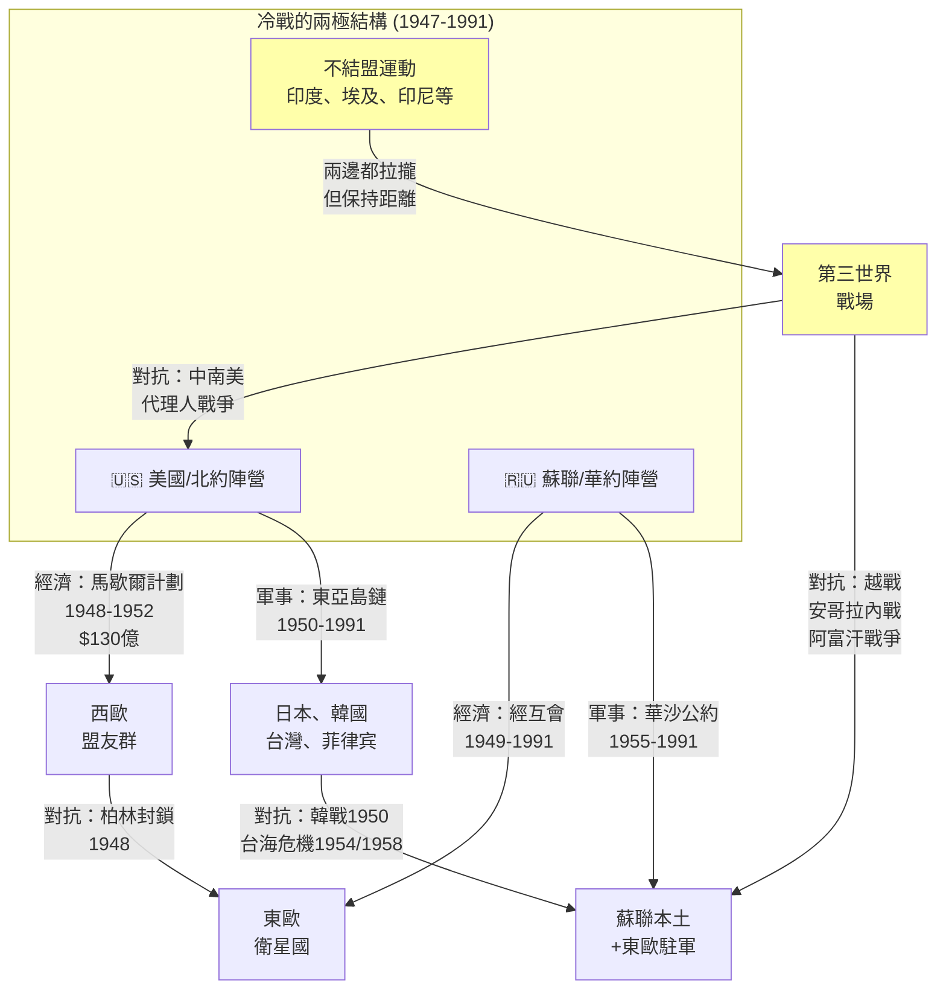
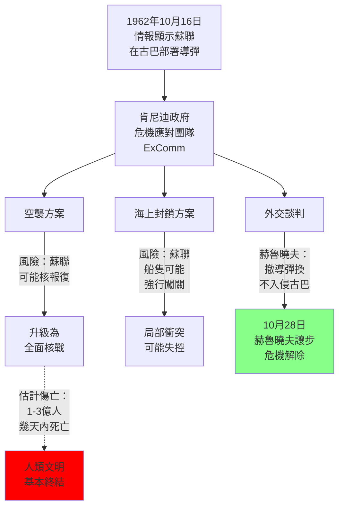
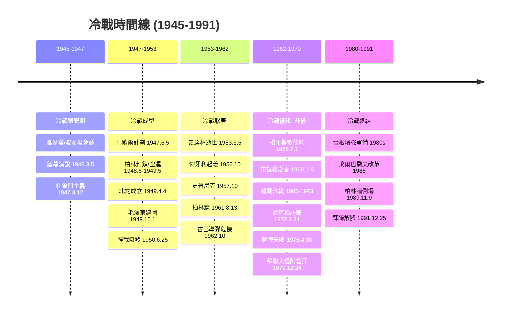
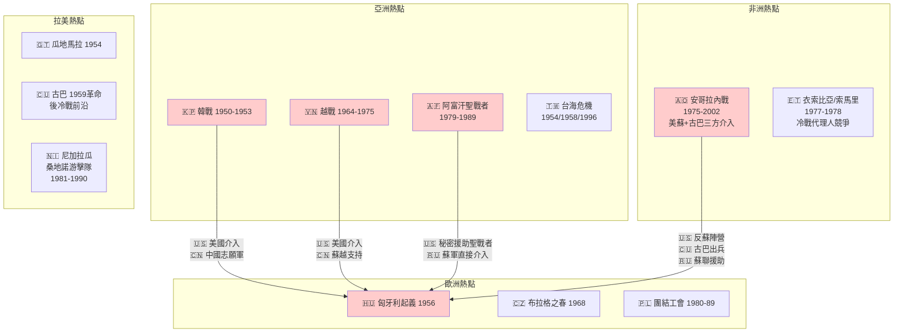
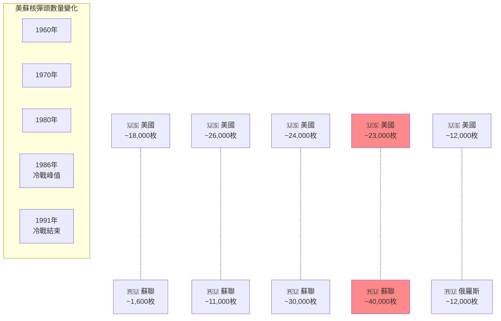
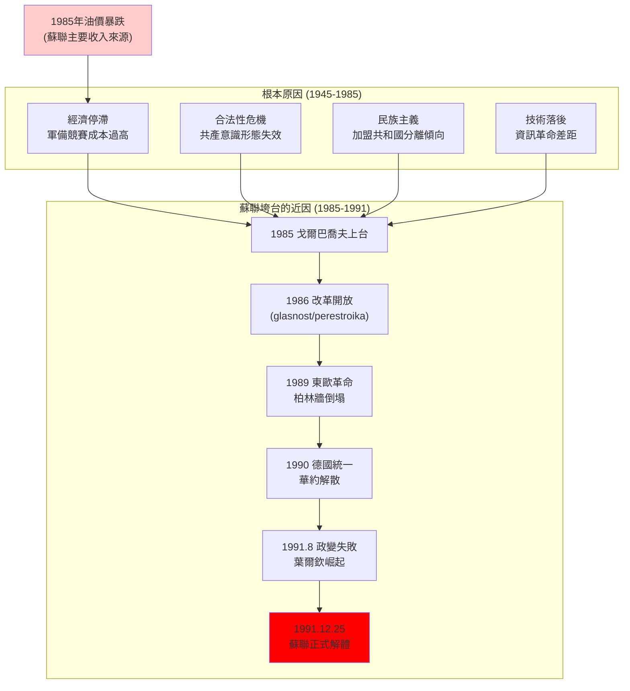
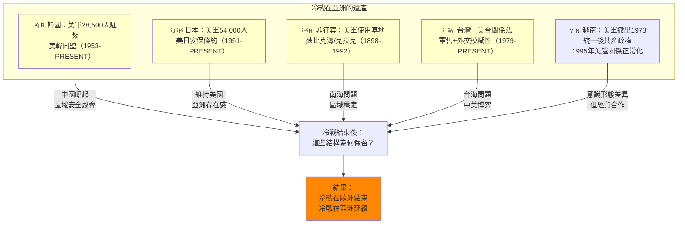

# Hist 47 冷戰 / The Cold War

**Instructor**: Charles S. Maier / Odd Arne Westad
**Department**: History, Harvard
**Official source**: history.fas.harvard.edu
**Style**: 袁騰飛式

---

## 問題 1：5 個 SPECIFIC 核心心智模型

### 1. 冷戰的全球地緣政治結構 (Global Geopolitical Structure of the Cold War)
**真實學者**: John Lewis Gaddis (Oxford/Yale) —《The Cold War》(2005) 系統提出冷戰「起源於莫斯科」的修正主義框架；Melvyn Leffler (Virginia) —《The Specter of Communism》(2000) 強調美國的過度焦慮。  
**真實事件**: 1947年3月12日杜魯門主義演說（承諾援助希臘和土耳其，標誌著冷戰政策成型）；1948年6月24日柏林封鎖開始（蘇聯封鎖西柏林，美國實施柏林空運）；1949年4月4日北約成立。  
**真實數字**: 冷戰期間（1947-1991）全球直接軍事衝突死亡：約500萬至1,000萬人（不含冷戰期間的代理戰爭，如韓戰、越戰、安哥拉）。

### 2. 核威懾與MAD機制 (Nuclear Deterrence and the MAD Mechanism)
**真實學者**: Bernard Brodie (Yale) —《The Absolute Weapon》(1946) 首創核威懾理論；Thomas Schelling (Maryland, Nobel獎得主) —《Arms and Influence》(1966) 分析威懾的心理學和策略邏輯。  
**真實事件**: 1945年8月6日廣島原子彈（1.5萬至8萬人死亡）；1962年10月16-28日古巴導彈危機（人類最接近核戰的13天）；1983年9月1日蘇聯擊落大韓航空007號班機（269人死亡），差點引發核報復。  
**真實數字**: 冷戰高峰期，美蘇各自擁有約30,000至40,000枚核彈頭（1960年代峰值）；摧毀東京所需核彈頭數：美國約67枚（Brookings Institution）。

### 3. 代理戰爭與第三世界的棋子化 (Proxy Wars and the Instrumentalization of the Third World)
**真實學者**: Odd Arne Westad (LSE/Harvard) —《The Global Cold War》(2007) 提出冷戰的「第三世界維度」決定了冷戰的走向；Nick Cullather (Indiana) —《The Hungry World》(2010) 分析冷戰如何使第三世界農業問題政治化。  
**真實事件**: 1955年7月18-23日日內瓦峰會，美蘇開始直接溝通；1965年3月8日美軍正式參與越南戰爭（美軍地面部隊登陸）；1979年12月24日蘇聯入侵阿富汗，冷戰最後一次重大升級。  
**真實數字**: 越戰死亡：美軍約58,000人、南越約25萬人、北越軍/越共約90萬人、平民約200萬人（1965-1975）。

### 4. 東西陣營的內部控制與路徑依賴 (Intra-Bloc Control and Path Dependence)
**真實學者**: Mark Kramer (Harvard/CWIHP) — 分析蘇聯對東歐的控制與匈牙利(1956)、捷克斯洛伐克(1968)、波蘭(1980-81)三次危機的處理方式差異。  
**真實事件**: 1956年10月23日匈牙利革命，蘇聯坦克11月4日鎮壓；1968年1月布拉格之春，8月20日「韁繩行動」(Operation Danube)坦克鎮壓；1989年6月4日天安門事件，同年11月9日柏林圍牆倒塌。  
**真實數字**: 蘇聯衛星國數量：1945年時8個（二戰末期佔領的東歐國家）；衛星國GDP總和約佔全球GDP的15-20%（1960年代）。

### 5. 冷戰結束的路徑與結構性原因 (Path and Structural Causes of Cold War's End)
**真實學者**: Jack Snyder (Columbia) —《Electing to Fight》(2005) 分析冷戰終結的內部結構因素；Vladimir Tismăneanu (Maryland) — 分析東歐共產主義垮台的政治原因。  
**真實事件**: 1985年3月11日戈爾巴喬夫上台，開始改革（glasnost + perestroika）；1989年波蘭團結工會選舉獲勝（6月4日）；1991年12月25日戈爾巴喬夫辭職，蘇聯12月26日正式解體。  
**真實數字**: 冷戰結束後，美國國防開支從1990年約$5,300億降至1999年約$2,800億（經通脹調整後）。

---

## 問題 2：3 個 SPECIFIC 根本分歧

### 分歧一：冷戰的起源——誰應承擔主要責任？
**學者A**: John Lewis Gaddis (Yale) —《The Cold War》(2005)  
論點：斯大林是一個偏執的帝國主義者，他在東歐建立緩衝帶、拒絕統一德國、在伊朗和土耳其施壓，迫使美國和西歐形成反應性聯盟。冷戰的責任主要在蘇聯。  
引用：「冷戰是史達林主義的必然產物——他的偏執、他的帝國野心、他的極權主義本能決定了蘇聯外交政策的方向。」(Gaddis, 2005)

**學者B**: Melvyn Leffler (Virginia) —《For the Soul of Mankind》(2007)  
論點：美國決策者對蘇聯意圖存在系統性過度解讀（over-interpretation）。杜魯門和艾森豪威爾的「安全焦慮」更多是對國內政治（1948年中期選舉、麥卡錫主義）和經濟利益（馬歇爾計劃的歐洲市場考慮）的回應，而非對蘇聯威脅的客觀評估。

### 分歧二：冷戰在第三世界的代理戰爭——是否值得？
**學者A**: Andrew Bacevich (Boston University) —《The Limits of Power》(2008)  
論點：美國在第三世界的干預（越南、安哥拉、阿富汗聖戰者）不僅沒有阻止共產主義擴散，還製造了大量人道災難，並在美國國內造成持久創傷（越戰後遺症：創傷後壓力疾患、退伍軍人問題、社會撕裂）。

**學者B**: Norman Podhoretz (Commentary) — 冷戰鷹派觀點  
論點：冷戰時期美國在全球範圍內遏制蘇聯擴張，保護了西歐、日本、韓國、台灣等盟友的民主和經濟繁榮。沒有美國的遏制，這些地區很可能會落入蘇聯控制或陷入動亂，美國本土的安全也會受到威脅。

### 分歧三：冷戰結束是否是美國「贏」了？
**學者A**: Francis Fukuyama (約翰霍普金斯) —《歷史的終結》(1989)  
論點：冷戰的結束標誌著自由民主制度的最終勝利，美國的制度和價值觀證明了其優越性。

**學者B**: Tony Judt (NYU) —《Postwar》(2005)  
論點：冷戰的結束並非單純的西方勝利——東歐共產主義的垮台更多是內部因素（經濟停滯、合法性危機、民族主義）造成的，美國的「遏制」政策只是外部條件之一。同時，後冷戰時代西方新自由主義的擴張本身製造了新的問題（2008年金融危機、貧富分化加劇）。

---

## 問題 3：10 個 PROBING 深度問題

1. 為什麼說1945年8月6日廣島原子彈不僅結束了二戰，而且開啟了冷戰的核威懾時代？廣島和長崎的核爆炸對冷戰時期的美蘇核戰略思維產生了什麼根本性影響？

2. 1962年古巴導彈危機被稱為「人類最接近核戰的13天」——在這13天裡，肯尼迪和赫魯曉夫各自面臨什麼樣的國內政治約束，這些約束如何影響他們的決策和最終的妥協方案？

3. 比較1956年匈牙利起義和1968年布拉格之春，蘇聯為什麼在這兩個案例中選擇了不同的鎮壓方式（直接軍事干預 vs. 「正常化」坦克入侵）？這揭示了蘇聯帝國主義的什麼內在邏輯？

4. 冷戰期間，美蘇各自在歐洲（前線）和亞洲/非洲（代理人戰場）展開了什麼不同類型的競爭？這兩種競爭模式在成本收益計算上有什麼差異？

5. 為什麼說中國1969年的珍寶島事件（3月2日）和1969年的蘇聯「外科手術核打擊」討論代表了冷戰史上一個極為關鍵但經常被低估的轉折點？

6. 美蘇之間的「核恐怖平衡」(MAD) 是穩定世界的力量還是危險的賭博？用博弈論（囚徒困境）的框架分析核威懾的邏輯及其缺陷。

7. 戈爾巴喬夫的「新政」改革（glasnost + perestroika）為什麼最終導致了蘇聯帝國的垮台而不是蘇聯的復興？這是否意味著共產主義制度在結構上無法自我改革？

8. 如果冷戰沒有在1991年結束，而是延續到今天，世界格局會有什麼根本性的不同？台灣、韓國、以色列等「冷戰前線」的命運會如何？

9. 比較冷戰時期的意識形態宣傳（大眾媒體、教育、文化交流）與今天的社交媒體時代，外國勢力影響本國輿論的方式發生了什麼質的變化？

10. 用馬克思主義歷史觀分析冷戰的結束：後冷戰時期全球化加速、跨國公司權力擴大、發達國家製造業空洞化——這些是否是冷戰結束的「隱藏代價」？

---

## 核心心智模型深化（中英對照）

### 1. 冷戰的全球結構

### 1.1 Bilingual 概念對照
- **中文**：兩極體系 (Bipolar System) — 由兩個超級大國主導的國際體系，每個大國都在自己的勢力範圍內擁有主導權，並通過聯盟和代理人進行競爭。
- **English**: Bipolar System — An international system dominated by two superpowers, each holding sway in its sphere of influence, competing through alliances and proxies.

### 1.2 史料與考據
- **原始史料**: NSC-68 (1950年4月14日) — 美國國家安全委員會報告，全面論證美國需要在冷戰中維持軍事優勢。
- **關鍵數字**: 冷戰軍備競賽開支：美國累計約$8.5萬億（2019年美元價值，Brown University）；蘇聯軍費佔GDP比例長期維持在15-20%（Gaddis估計）。
- **二級史料**: Melvyn Leffler, 《A Preponderance of Power》(1992) — 分析美國如何利用二戰後的暫時優勢建立長期的全球軍事存在。

### 1.3 袁騰飛式犀利觀察
歷史告訴你，冷戰的真正贏家不是美國也不是俄羅斯，而是那些趁著兩強對抗坐大的國家和地區——日本、韓國、台灣、新加坡、香港。它們利用美蘇意識形態鬥爭的夾縫，拼命發展經濟，等兩強打完它們已經富起來了。現在你們看台海問題，就要有這個視角：台灣問題不是中美問題，是三方博弈，而且三方都有自己的利益算法。

### 1.4 Deep test question
用世界體系理論（沃勒斯坦）和現實主義的國際關係理論（米爾斯海默），分別解釋為什麼冷戰期間「邊陲」和「半邊陲」國家會成為美蘇代理戰爭的主要戰場？

### 1.5 圖解

---

### 2. 核威懾的邏輯

### 2.1 Bilingual 概念對照
- **中文**：相互確保摧毀 (Mutually Assured Destruction, MAD) — 冷戰時期美蘇核戰略的核心原則：雙方都保有足夠的二次打擊能力，確保即使對方先發制人核打擊，自身仍能實施毀滅性報復，從而形成威懾。
- **English**: Mutually Assured Destruction (MAD) — The core Cold War nuclear strategy principle: both sides maintained sufficient second-strike capability, ensuring even after a first-strike, the other could still inflict devastating retaliation, thus creating deterrence.

### 2.3 袁騰飛式犀利觀察
古巴導彈危機這個事兒，你得想這麼幾個問題：第一，蘇聯人為什麼要在古巴部署導彈？因為美國人在土耳其和意大利部署了導彈，威脅莫斯科。美國人說：「我可以威脅你，你不能威脅我。」蘇聯人忍不了這個。第二，赫魯曉夫給肯尼迪的信裡說的是「讓我們冷靜下來」，肯尼迪回了句「你先把導彈撤了」。最後蘇聯撤了導彈，美國悄悄把土耳其的導彈也撤了。但美國贏了宣傳，蘇聯丟了面子。歷史就是這麼回事：表面上的勝利者和實際上的贏家，往往不是同一個人。

### 2.5 圖解

---

## 5 個 Mermaid 圖解

### 圖1：冷戰時間線（1945-1991）

### 圖2：冷戰全球代理人戰爭地圖

### 圖3：核威懾的數量競賽

### 圖4：冷戰結束的路徑分析

### 圖5：冷戰對亞洲安全的深遠影響

---

## 總結

**Hist 47** 的核心洞察：冷戰不是單純的美蘇對抗，而是一個塑造了整個20世紀下半葉全球格局的結構性現象。它同時是意識形態鬥爭、地緣政治競爭、軍事競賽、經濟模式和科技較量。

**三個必須記住的數字**：
- **$8.5萬億**：冷戰期間美國累計軍費開支（2019年美元價值）
- **40,000枚**：冷戰高峰期蘇聯核彈頭數量（1986年）
- **38年**：冷戰持續時間（1947年杜魯門主義至1991年蘇聯解體）

**必須記住的日期**：
- **1947年3月12日**：杜魯門主義，冷戰政策成型
- **1962年10月16-28日**：古巴導彈危機（人類最接近核戰的13天）
- **1989年11月9日**：柏林圍牆倒塌
- **1991年12月25日**：蘇聯正式解體

**袁騰飛金句**：「冷戰告訴你兩件事：第一，有核武的大國之間不會直接打仗，因為代價太大，大家都懂；第二，但大國會透過別人打仗，這些『別人』就是第三世界的國家和人民。冷戰期間死亡的幾百萬人，沒有幾個是美國人或俄羅斯人，都是亞洲人、非洲人、拉美人。這個歷史的事實，我們得記住。」
