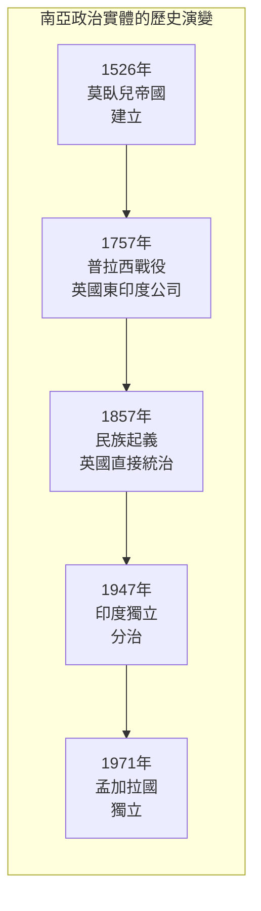
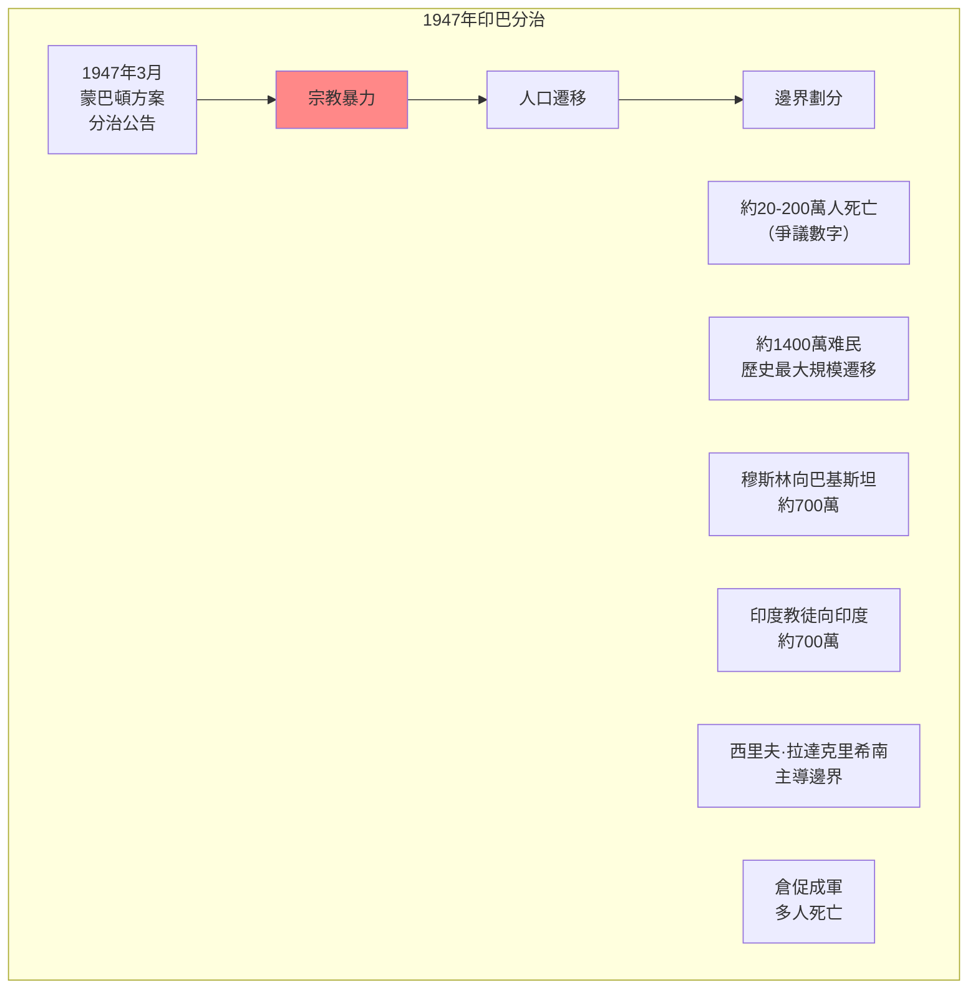
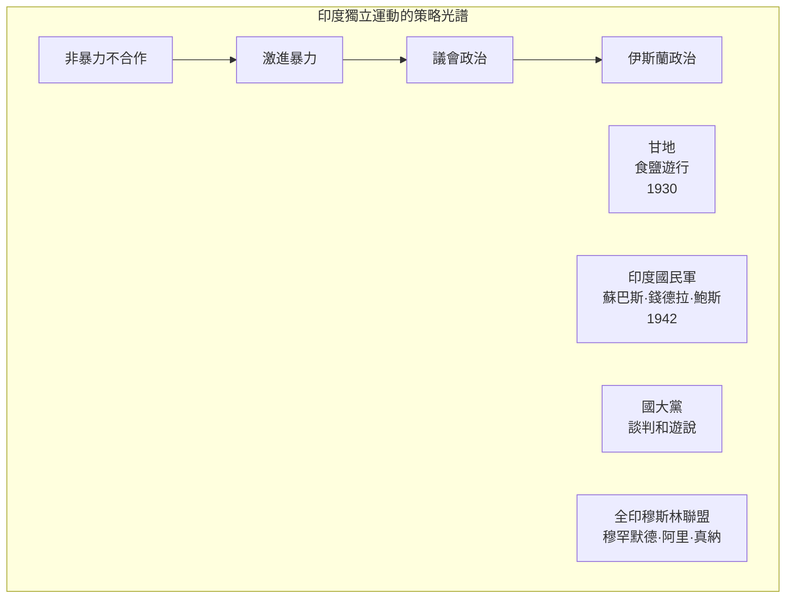
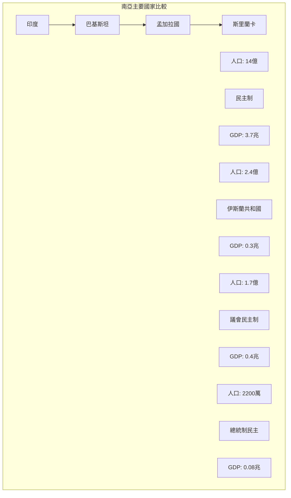
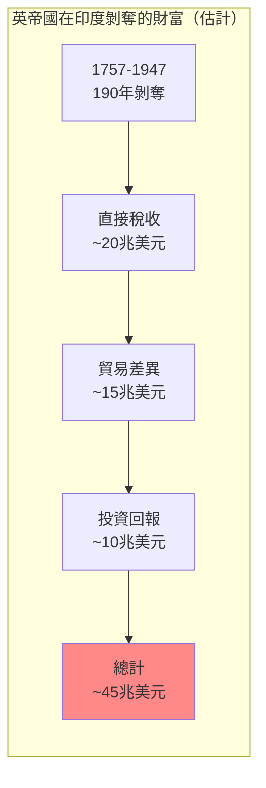

# Hist 57 帝國、民族、分治 / Empire, Nation, Partition: Modern South Asia in Global Perspective

**Instructor**: Sugata Bose
**Department**: History, Harvard
**Official source**: history.fas.harvard.edu
**Big Question**: 當我們在南亞歷史中採用全球框架時，會獲得什麼樣的洞察？
**Style**: 袁騰飛式

---

## 問題 1：5 個 SPECIFIC 核心心智模型

### 1. 莫臥兒帝國的遺產 (Legacy of the Mughal Empire)
**真實學者**: Stephen Dale (俄亥俄州立大學) —《The Mughal Empire》(2010) 分析莫臥兒帝國的多元宗教政策。  
**真實事件**: 1526年巴布爾入侵印度；1605年阿克巴大帝登基；1707年奧朗則布去世後帝國衰落。  
**真實數字**: 莫臥兒帝國人口在1700年約1.5億，佔全球GDP約25%。

### 2. 大英帝國在南亞的殖民 (British Colonialism in South Asia)
**真實學者**: Sugata Bose (哈佛) —《A Hundred Horizons》(2006) 分析殖民遺產。  
**真實事件**: 1757年普拉西戰役；1857年民族起義；1947年8月15日印度獨立。  
**真實數字**: 英帝國在印度統治約200年（1757-1947），剝奪了估計約45兆美元的財富。

### 3. 印度獨立運動與甘地 (Indian Independence Movement and Gandhi)
**真實學者**: David Arnold (沃里克大學) —《Gandhi》(2001) 分析甘地的歷史地位。  
**真實事件**: 1919年4月13日阿姆利則屠殺；1930年食鹽遊行；1942年退出印度運動。  
**真實數字**: 甘地的非暴力抵抗運動最終動員了數百萬印度人參與獨立運動。

### 4. 1947年印巴分治 (1947 Partition of India and Pakistan)
**真實學者**: Yasmin Khan (康奈爾大學) —《The Great Partition》(2007) 分析分治的災難。  
**真實事件**: 1947年8月分治公告；大規模人口遷移；估計20-200萬人在暴力中死亡。  
**真實數字**: 約1400萬人因分治而成為难民。

### 5. 南亞的後殖民困境 (Post-Colonial Challenges of South Asia)
**真實學者**: Ayesha Jalal (塔夫茨大學) —《Democracy and Disorder》(2000) 分析後殖民南亞的政治挑戰。  
**真實事件**: 1971年孟加拉國獨立戰爭；1975年印度緊急狀態；2019年印度廢除克什米爾自治地位。  
**真實數字**: 印度是世界上人口最多的民主國家（14億），巴基斯坦2.4億，孟加拉國1.7億。

---

## 問題 2：3 個 SPECIFIC 根本分歧

### 分歧一：殖民遺產是好還是壞
**學者A**: 自由派史學  
論點：殖民留下了負面遺產（分裂、怨恨、種姓制度）。

**學者B**: 修正主義史學如Anita Desai  
論點：殖民和後殖民之間的連續性被低估了。

### 分歧二：甘地非暴力的歷史評價
**學者A**: 主流史學  
論點：甘地的非暴力抵抗是印度獨立成功的關鍵。

**學者B**: 批評者如Bipan Chandra  
論點：獨立成功更多歸功於資產階級談判和軍隊叛變，非暴力只是次要因素。

### 分歧三：巴基斯坦建國的歷史意義
**學者A**: 巴基斯坦史學  
論點：巴基斯坦建國代表了穆斯林對印度教多數統治的反對。

**學者B**: 批評者如Ayesha Jalal  
論點：巴基斯坦建國更多是少數精英的政治選擇，而非群眾運動的結果。

---

## 問題 3：10 個 PROBING 深度問題

1. 比較莫臥兒帝國的宗教寬容政策（如阿克巴大帝）和當代印度的宗教政治：這400年間，「印度」的宗教多元性經歷了什麼根本性變化？

2. 英帝國在印度剝奪了約45兆美元的財富——這個數字如何計算？這個殖民剝奪的歷史如何影響了我們理解當代的全球不平等？

3. 甘地的非暴力抵抗運動在多大程度上是「印度」的獨特現象？這種策略在其他殖民地去殖民運動中是否被模仿或適應？

4. 1947年印巴分治是「英帝國蓄意設計」還是「不可控制的群眾暴力」的結果？這個歷史爭議為什麼重要？

5. 比較1947年印巴分治和1990年代南斯拉夫分治：這兩次「分治」有什麼相似和不同？分治是否總是暴力的？

6. 1971年孟加拉國獨立戰爭如何揭示了巴基斯坦內部的東-西分裂？這個戰爭如何塑造了南亞的政治格局？

7. 分析印度教民族主義的崛起：莫迪政府的政策（如廢除克什米爾自治）在多大程度上是印度歷史的「連續性」，在多大程度上是「斷裂」？

8. 從巴基斯坦建國到今天的阿富汗塔利班——南亞的伊斯蘭政治經歷了什麼樣的演變？

9. 比較印度和中國的建國經驗：為什麼印度採取了民主制而中國採取了共產黨領導？這種制度差異如何影響了兩國的經濟和社會發展？

10. 南亞如何塑造了全球歷史？從佛教到信息技術，從英帝國到好萊塢——南亞在全球歷史中的「百個地平線」是什麼？

---

## 5 個 Mermaid 圖解

### 圖1：南亞政治實體的歷史演變

### 圖2：1947年印巴分治

### 圖3：印度獨立運動的策略光譜

### 圖4：南亞國家的比較

### 圖5：殖民剝奪的規模

---

## 總結

**Hist 57** 的核心洞察：南亞歷史告訴我們，帝國的興衰、民族的形成和國家的分治是交織在一起的。理解這段歷史不僅是理解南亞過去的前提，更是理解當代南亞政治、印巴關係和全球殖民遺產的關鍵。

**三個必須記住的數字**：
- **1757年**：普拉西戰役，英帝國開始統治印度
- **1947年8月15日**：印度獨立和分治
- **45兆美元**：英帝國在印度剝奪的估計財富

**必須記住的日期**：
- **1526年4月**：巴布爾在帕尼帕特擊敗德里蘇丹
- **1857年5月10日**：印度民族起義開始
- **1947年8月15日**：印度獨立
- **1971年12月16日**：孟加拉國成立

**袁騰飛金句**：「南亞是世界上最大的民主實驗室——14億人在一個民主制度下生活，但同時也有世界上最多的宗教衝突、種姓壓迫和軍事政變。從莫臥兒的花園到英帝國的總督府，從甘地的非暴力到MODI的印度教民族主義——南亞的歷史是一個關於帝國、宗教、民主和身份認同的複雜交織。」