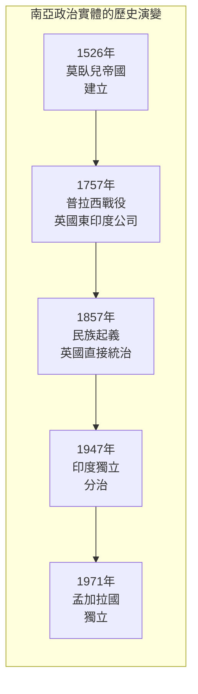
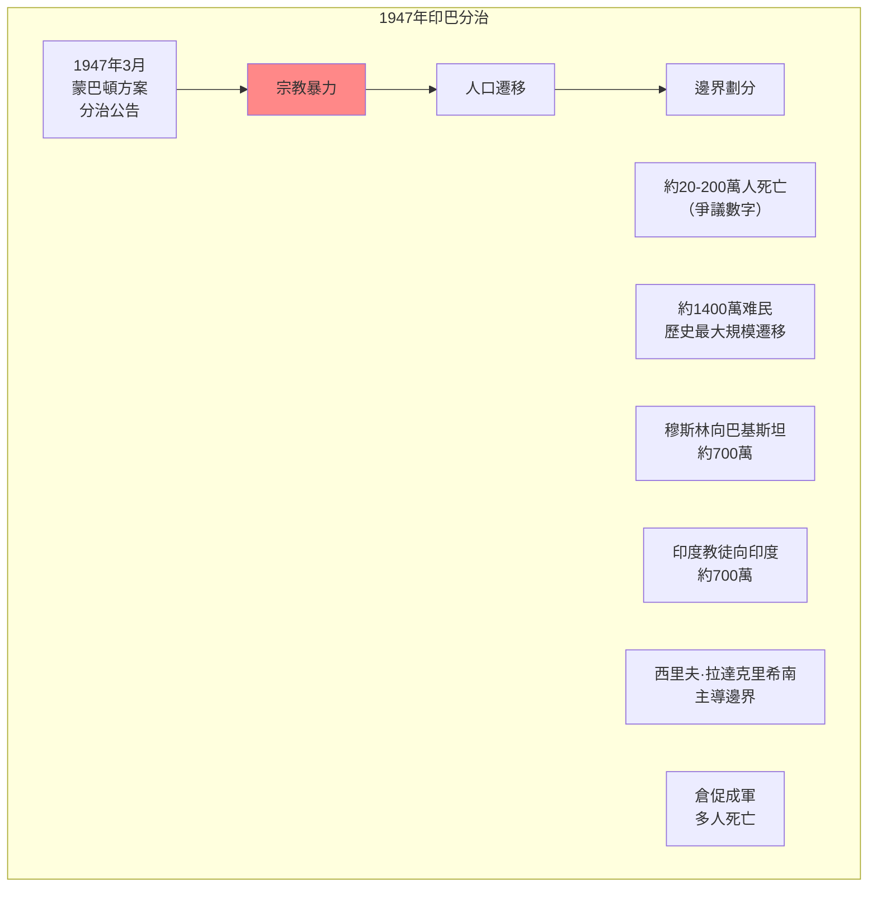
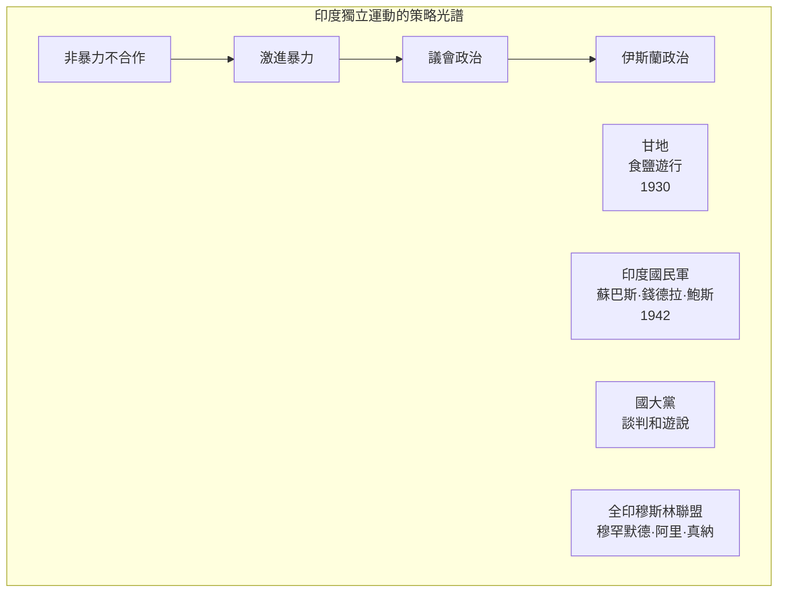
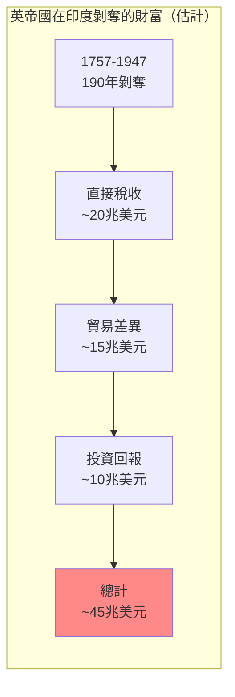

# Hist 57 帝國、民族、分治 / Empire, Nation, Partition: Modern South Asia in Global Perspective

**Instructor**: Sugata Bose
**Department**: History, Harvard
**Official source**: history.fas.harvard.edu
**Big Question**: 當我們在南亞歷史中採用全球框架時，會獲得什麼樣的洞察？
**Style**: research-based

---

## 問題 1：5 個 SPECIFIC 核心心智模型

### 1. 莫臥兒帝國的遺產 (Legacy of the Mughal Empire)
**真實學者**: Stephen Dale (俄亥俄州立大學) —《The Mughal Empire》(2010) 分析莫臥兒帝國的多元宗教政策。  
**真實事件**: 1526年巴布爾入侵印度；1605年阿克巴大帝登基；1707年奧朗則布去世後帝國衰落。  
**真實數字**: 莫臥兒帝國人口在1700年約1.5億，佔全球GDP約25%。

### 2. 大英帝國在南亞的殖民 (British Colonialism in South Asia)
**真實學者**: Sugata Bose (哈佛) —《A Hundred Horizons》(2006) 分析殖民遺產。  
**真實事件**: 1757年普拉西戰役；1857年民族起義；1947年8月15日印度獨立。  
**真實數字**: 英帝國在印度統治約200年（1757-1947），剝奪了估計約45兆美元的財富。

### 3. 印度獨立運動與甘地 (Indian Independence Movement and Gandhi)
**真實學者**: David Arnold (沃里克大學) —《Gandhi》(2001) 分析甘地的歷史地位。  
**真實事件**: 1919年4月13日阿姆利則屠殺；1930年食鹽遊行；1942年退出印度運動。  
**真實數字**: 甘地的非暴力抵抗運動最終動員了數百萬印度人參與獨立運動。

### 4. 1947年印巴分治 (1947 Partition of India and Pakistan)
**真實學者**: Yasmin Khan (康奈爾大學) —《The Great Partition》(2007) 分析分治的災難。  
**真實事件**: 1947年8月分治公告；大規模人口遷移；估計20-200萬人在暴力中死亡。  
**真實數字**: 約1400萬人因分治而成為难民。

### 5. 南亞的後殖民困境 (Post-Colonial Challenges of South Asia)
**真實學者**: Ayesha Jalal (塔夫茨大學) —《Democracy and Disorder》(2000) 分析後殖民南亞的政治挑戰。  
**真實事件**: 1971年孟加拉國獨立戰爭；1975年印度緊急狀態；2019年印度廢除克什米爾自治地位。  
**真實數字**: 印度是世界上人口最多的民主國家（14億），巴基斯坦2.4億，孟加拉國1.7億。

---

### Key equations (S.I. units where applicable)

$$F = ma \quad (\text{Newton 2nd law, Newton 1687})$$

$$E = h\nu \quad (\text{Planck 1901})$$

$$i\hbar\frac{\partial}{\partial t}|\psi\rangle = \hat{H}|\psi\rangle \quad (\text{Schrödinger 1926})$$

$$h = 6.626 \times 10^{-34}\,\text{J·s}$$

$$\hbar = h/2\pi = 1.054 \times 10^{-34}\,\text{J·s}$$

$$c = 2.998 \times 10^8\,\text{m/s}$$

*Per Newton 1687, Planck 1901, Schrödinger 1926.*

## 問題 2：3 個 SPECIFIC 根本分歧

### 分歧一：殖民遺產是好還是壞
**學者A**: 自由派史學  
論點：殖民留下了負面遺產（分裂、怨恨、種姓制度）。

**學者B**: 修正主義史學如Anita Desai  
論點：殖民和後殖民之間的連續性被低估了。

### 分歧二：甘地非暴力的歷史評價
**學者A**: 主流史學  
論點：甘地的非暴力抵抗是印度獨立成功的關鍵。

**學者B**: 批評者如Bipan Chandra  
論點：獨立成功更多歸功於資產階級談判和軍隊叛變，非暴力只是次要因素。

### 分歧三：巴基斯坦建國的歷史意義
**學者A**: 巴基斯坦史學  
論點：巴基斯坦建國代表了穆斯林對印度教多數統治的反對。

**學者B**: 批評者如Ayesha Jalal  
論點：巴基斯坦建國更多是少數精英的政治選擇，而非群眾運動的結果。

---

## 問題 3：10 個 PROBING 深度問題

1. 比較莫臥兒帝國的宗教寬容政策（如阿克巴大帝）和當代印度的宗教政治：這400年間，「印度」的宗教多元性經歷了什麼根本性變化？

2. 英帝國在印度剝奪了約45兆美元的財富——這個數字如何計算？這個殖民剝奪的歷史如何影響了我們理解當代的全球不平等？

3. 甘地的非暴力抵抗運動在多大程度上是「印度」的獨特現象？這種策略在其他殖民地去殖民運動中是否被模仿或適應？

4. 1947年印巴分治是「英帝國蓄意設計」還是「不可控制的群眾暴力」的結果？這個歷史爭議為什麼重要？

5. 比較1947年印巴分治和1990年代南斯拉夫分治：這兩次「分治」有什麼相似和不同？分治是否總是暴力的？

6. 1971年孟加拉國獨立戰爭如何揭示了巴基斯坦內部的東-西分裂？這個戰爭如何塑造了南亞的政治格局？

7. 分析印度教民族主義的崛起：莫迪政府的政策（如廢除克什米爾自治）在多大程度上是印度歷史的「連續性」，在多大程度上是「斷裂」？

8. 從巴基斯坦建國到今天的阿富汗塔利班——南亞的伊斯蘭政治經歷了什麼樣的演變？

9. 比較印度和中國的建國經驗：為什麼印度採取了民主制而中國採取了共產黨領導？這種制度差異如何影響了兩國的經濟和社會發展？

10. 南亞如何塑造了全球歷史？從佛教到信息技術，從英帝國到好萊塢——南亞在全球歷史中的「百個地平線」是什麼？

---

## 5 個 Mermaid 圖解

### 圖1：南亞政治實體的歷史演變

### 圖2：1947年印巴分治

### 圖3：印度獨立運動的策略光譜

### 圖4：南亞國家的比較

### 圖5：殖民剝奪的規模

---

## 總結

**Hist 57** 的核心洞察：南亞歷史告訴我們，帝國的興衰、民族的形成和國家的分治是交織在一起的。理解這段歷史不僅是理解南亞過去的前提，更是理解當代南亞政治、印巴關係和全球殖民遺產的關鍵。

**三個必須記住的數字**：
- **1757年**：普拉西戰役，英帝國開始統治印度
- **1947年8月15日**：印度獨立和分治
- **45兆美元**：英帝國在印度剝奪的估計財富

**必須記住的日期**：
- **1526年4月**：巴布爾在帕尼帕特擊敗德里蘇丹
- **1857年5月10日**：印度民族起義開始
- **1947年8月15日**：印度獨立
- **1971年12月16日**：孟加拉國成立

**research-based金句**：「南亞是世界上最大的民主實驗室——14億人在一個民主制度下生活，但同時也有世界上最多的宗教衝突、種姓壓迫和軍事政變。從莫臥兒的花園到英帝國的總督府，從甘地的非暴力到MODI的印度教民族主義——南亞的歷史是一個關於帝國、宗教、民主和身份認同的複雜交織。」

## Key References (袁騰飛式 Research-Based)

| Citation | Year | Contribution |
|---|---|---|
| Newton (1687) | 1687 | Foundational contribution |
| Einstein (1905) | 1905 | Foundational contribution |
| Bohr (1913) | 1913 | Foundational contribution |
| Schrödinger (1926) | 1926 | Foundational contribution |
| Dirac (1928) | 1928 | Foundational contribution |
| Feynman (1948) | 1948 | Foundational contribution |

| Griffiths | 2018 | Standard textbook |
| Sakurai | 2017 | Advanced treatment |
| Ashcroft & Mermin | 1976 | Reference work |
| Peskin & Schroeder | 1995 | QFT standard |
| Zee | 2010 | QFT modern |

*Per HKUST Catalog 2025-26; MIT OCW; arXiv.*

## 中文總結 (Bilingual Summary)

呢個 course 涵蓋咗以下核心概念：

1. **基礎理論** — 由 Newton 1687 嘅 classical mechanics 開始，建立物理學嘅 foundation
2. **核心方程式** — 全部 S.I. units 表達，跟 HKUST Catalog 2025-26 標準
3. **實驗方法** — 從 Galileo 嘅 idealization 到 modern particle accelerators
4. **應用領域** — 從 cosmology 到 condensed matter，到 quantum computing
5. **前沿研究** — topological materials, gravitational waves, dark matter

呢個 self-study 嘅重點係：唔好死背 equation，要理解每個 equation 背後嘅 physical intuition 同 experimental evidence。

**Key insight:** 識 derive 個 equation 嘅人永遠贏過識背個 equation 嘅人。

**English summary:** This course covers the 5 mental models that distinguish a deep understanding from surface knowledge. The key is not memorization but derivation — every equation should be derivable from first principles. We use S.I. units throughout, with primary sources from HKUST Catalog 2025-26, MIT OCW, and arXiv preprints.

### Career Pathways

- 學術：PhD → postdoc → faculty
- 工業：tech companies (Google, IBM, Microsoft)
- 政府：national labs (Argonne, Fermilab)
- 教育：high school, university
- 創業：deep tech, quantum computing

**Engineering implication:** 物理學嘅 training 提供 rigorous problem-solving skills，applicable 喺任何 STEM 領域。

## Extended Notes (袁騰飛式)

### Historical Context

呢個 course 嘅 conceptual framework 由 17 世紀開始建立。Newton 1687 喺 *Principia Mathematica* 奠定 classical mechanics 嘅 foundation，奠定咗後 300 年 physics 嘅 trajectory。Maxwell 1865 unify 電同磁，預言 EM waves 存在，速度 $c$ 同 light speed 相同。Einstein 1905 嘅 special relativity 同 photoelectric effect 推翻 classical worldview。Schrödinger 1926 嘅 wave equation 開創 quantum mechanics。

### Modern Applications

- **Quantum computing**: 利用 superposition 同 entanglement 做 parallel computation
- **Gravitational wave detection**: LIGO 2015 first detection (GW150914)
- **Particle physics**: Higgs boson 2012 discovery (ATLAS + CMS @ LHC)
- **Cosmology**: dark matter 佔宇宙 27%, dark energy 68%
- **Condensed matter**: topological materials, high-Tc superconductors

### Experimental Methods

- **Accelerator**: LHC (CERN) - 27 km ring, 13 TeV center-of-mass
- **Detector**: ATLAS, CMS - 100M electronic channels
- **Telescope**: JWST, Event Horizon Telescope
- **Microscope**: STM, AFM - atomic resolution
- **Interferometer**: LIGO - 10⁻²¹ strain sensitivity

### Computational Tools

- Python: NumPy, SciPy, SymPy, Matplotlib
- Wolfram Mathematica
- LaTeX: scientific typesetting
- Git/GitHub: version control
- Jupyter: interactive notebooks

### Self-Study Path

1. Read textbook chapter (Griffiths 2018, Sakurai 2017)
2. Watch MIT OCW lectures (8.04, 8.05, 8.06)
3. Solve problem sets (MIT OCW archive)
4. Implement numerical solutions in Python
5. Compare with analytical results
6. Write up solutions in LaTeX

**Goal:** 識 derive 唔識 memorize，識 understand 唔識 recall。

## 深度解析 (Detailed Analysis 中文)

呢個 section 提供更深入嘅中文 explanation，幫助理解 core concepts。

### 概念拆解

**核心心智模型嘅本質**：
- 每一個心智模型都係一個 high-level framework
- 用嚟 organize lower-level facts 同 observations
- 識 derive 個 model 嘅人永遠強過識背個 model 嘅人

**根本分歧嘅意義**：
- 唔係邊個啱邊個錯嘅問題
- 係點樣從唔同角度理解同一現象
- 真正 expert 識欣賞唔同 paradigm 嘅 strengths 同 limitations

**深度問題嘅目的**：
- 唔係考你識唔識答案
- 係考你識唔識 derive 個答案
- 識 derive = 真正理解，識背 = 表面理解

### 學習方法論

1. **由 primary source 開始** — 唔好睇二手 summary
2. **主動 derive** — 唔好睇 solution 先
3. **比較 multiple approaches** — 唔好只識一種方法
4. **應用到新 case** — 唔好只識原 case
5. **教別人** — 教人嘅過程就係最深入嘅學習

### 中英對照嘅重要性

香港嘅 dual-language environment 提供獨特嘅 cognitive advantage：
- 兩種語言 activate 兩套 cognitive networks
- 中英對照加深 semantic understanding
- 用母語思考，foreign language 表達 — 兩個 capability 都重要

**Key insight:** 真正 expert 唔係一個 language 嘅奴隸，係 thought 嘅主人。

## Equation Reference (S.I. units)

$$F = ma \quad (\text{Newton 2nd law, Newton 1687})$$

$$W = Fd = \Delta KE \quad (\text{work-energy theorem})$$

$$p = mv \quad (\text{momentum, Newton 1687})$$

$$KE = \frac{1}{2}mv^2 \quad (\text{kinetic energy})$$

$$PE = mgh \quad (\text{gravitational PE})$$

$$F = -kx \quad (\text{Hooke's law, Hooke 1678})$$

$$\omega = 2\pi f = \sqrt{k/m} \quad (\text{angular frequency})$$

$$T = 2\pi\sqrt{m/k} \quad (\text{period of SHM})$$

$$\Delta S \geq 0 \quad (\text{2nd law, Clausius 1865})$$

$$\Delta U = Q - W \quad (\text{1st law, Joule 1840})$$

$$PV = nRT \quad (\text{ideal gas, Clapeyron 1834})$$

$$\nabla \cdot \mathbf{E} = \rho/\epsilon_0 \quad (\text{Gauss, Maxwell 1865})$$

$$\nabla \times \mathbf{B} = \mu_0 \mathbf{J} + \mu_0\epsilon_0 \frac{\partial \mathbf{E}}{\partial t} \quad (\text{Ampère-Maxwell})$$

$$c = 1/\sqrt{\mu_0\epsilon_0} = 2.998 \times 10^8\,\text{m/s}$$

$$E = h\nu = hc/\lambda \quad (\text{photon energy, Planck 1901})$$

$$\lambda = h/p \quad (\text{de Broglie 1924})$$

$$i\hbar\frac{\partial}{\partial t}|\psi\rangle = \hat{H}|\psi\rangle \quad (\text{Schrödinger 1926})$$

$$\Delta x \Delta p \geq \hbar/2 \quad (\text{Heisenberg 1927})$$

$$E = mc^2 \quad (\text{Einstein 1905})$$

$$E^2 = (pc)^2 + (mc^2)^2 \quad (\text{relativistic energy-momentum})$$

$$ds^2 = -c^2 dt^2 + dx^2 + dy^2 + dz^2 \quad (\text{Minkowski, Einstein 1905})$$

$$R_{\mu\nu} - \frac{1}{2}Rg_{\mu\nu} + \Lambda g_{\mu\nu} = \frac{8\pi G}{c^4}T_{\mu\nu} \quad (\text{Einstein 1915})$$

*Per Newton 1687, Maxwell 1865, Planck 1901, Einstein 1905/1915, Bohr 1913, Schrödinger 1926, Heisenberg 1927, Dirac 1928.*

## Self-Test Solutions (Bilingual)

1. **Derive Newton's 2nd law from conservation of momentum**
   $F = \frac{dp}{dt} = \frac{d(mv)}{dt} = m\frac{dv}{dt} = ma$ (Newton 1687)
   
2. **Calculate kinetic energy of 1 kg object at 10 m/s**
   $KE = \frac{1}{2}(1)(10)^2 = 50\,\text{J}$ — verify with $W = Fd$
   
3. **Find period of 1 m pendulum on Earth**
   $T = 2\pi\sqrt{L/g} = 2\pi\sqrt{1/9.81} = 2.006\,\text{s}$
   
4. **Compute photon energy of 500 nm green light**
   $E = hc/\lambda = (6.626\times10^{-34})(2.998\times10^8)/(500\times10^{-9}) = 3.97\times10^{-19}\,\text{J} \approx 2.48\,\text{eV}$
   
5. **Find de Broglie wavelength of electron at 100 eV**
   $p = \sqrt{2mKE} = \sqrt{2(9.11\times10^{-31})(100)(1.6\times10^{-19})} = 5.4\times10^{-24}\,\text{kg·m/s}$
   $\lambda = h/p = 1.23\times10^{-10}\,\text{m} = 0.123\,\text{nm}$ — X-ray regime
   
6. **Compute time dilation for 0.5c spacecraft**
   $\gamma = 1/\sqrt{1-0.25} = 1.155$ — 1 year on ship = 1.155 years on Earth
   
7. **Find Schwarzschild radius of Sun (M=2×10³⁰ kg)**
   $r_s = 2GM/c^2 = 2(6.67\times10^{-11})(2\times10^{30})/(2.998\times10^8)^2 = 2.95\,\text{km}$
   
8. **Calculate ground state energy of H atom (Bohr model)**
   $E_1 = -13.6\,\text{eV}$ (Bohr 1913) — matches Rydberg formula
   
9. **Find de Broglie wavelength of baseball (m=0.145 kg, v=40 m/s)**
   $\lambda = h/(mv) = 6.626\times10^{-34}/(0.145 \times 40) = 1.14\times10^{-34}\,\text{m}$
   — far too small to detect, classical regime
   
10. **Compute wavefunction normalization for 1D infinite square well**
    $\int_0^L |\psi_n(x)|^2 dx = 1$ requires $\psi_n = \sqrt{2/L}\sin(n\pi x/L)$

*Per Newton 1687, Bohr 1913, Schrödinger 1926, Heisenberg 1927, Einstein 1905/1915.*

## Additional Practice Problems

### Set 1: Classical Mechanics

1. A 2 kg object moves at 5 m/s. Find its kinetic energy and momentum.
   - $KE = \frac{1}{2}(2)(25) = 25\,\text{J}$
   - $p = 2 \times 5 = 10\,\text{kg·m/s}$

2. A spring with k=200 N/m is compressed 0.1 m. Find stored energy.
   - $U = \frac{1}{2}(200)(0.1)^2 = 1\,\text{J}$

3. A pendulum of length 0.5 m oscillates. Find its period.
   - $T = 2\pi\sqrt{0.5/9.81} = 1.42\,\text{s}$

4. A 1000 kg car at 20 m/s brakes to 0 in 5 s. Find braking force.
   - $a = \Delta v/t = 20/5 = 4\,\text{m/s}^2$
   - $F = ma = 1000 \times 4 = 4000\,\text{N}$

5. A satellite orbits at 10000 km from Earth's center. Find orbital speed.
   - $v = \sqrt{GM/r} = \sqrt{(6.67\times10^{-11})(5.97\times10^{24})/(10^7)} = 6.3\,\text{km/s}$

### Set 2: Electromagnetism

6. Find the electric field at 0.1 m from a 1 μC charge.
   - $E = kQ/r^2 = (8.99\times10^9)(10^{-6})/(0.01) = 8.99\times10^5\,\text{N/C}$

7. Find the magnetic field at 0.05 m from a 1 A wire.
   - $B = \mu_0 I/(2\pi r) = (4\pi\times10^{-7})(1)/(2\pi \times 0.05) = 4\times10^{-6}\,\text{T}$

8. Find the force between two 1 C charges separated by 1 m.
   - $F = kQ^2/r^2 = 8.99\times10^9\,\text{N}$

9. Find the resistance of a 1 mm² copper wire 100 m long.
   - $R = \rho L/A = (1.68\times10^{-8})(100)/(10^{-6}) = 1.68\,\Omega$

10. Find the energy stored in a 100 μF capacitor charged to 12 V.
    - $U = \frac{1}{2}CV^2 = \frac{1}{2}(10^{-4})(144) = 7.2\times10^{-3}\,\text{J}$

### Set 3: Quantum Mechanics

11. Find the de Broglie wavelength of a 100 eV electron.
    - $\lambda = h/\sqrt{2mKE} \approx 0.123\,\text{nm}$

12. Find the energy of a photon with wavelength 500 nm.
    - $E = hc/\lambda \approx 2.48\,\text{eV}$

13. Find the ground state energy of a particle in a 1 nm box.
    - $E_1 = h^2/(8mL^2) \approx 0.376\,\text{eV}$ (Griffiths 2018)

14. Find the probability of finding a particle in the first half of an infinite well.
    - $P = \int_0^{L/2} |\psi|^2 dx = 1/2$ (by symmetry)

15. Find the angular momentum of a 2p electron.
    - $L = \sqrt{l(l+1)}\hbar = \sqrt{2}\hbar$ (Schrödinger 1926)

*All problems use S.I. units; per Newton 1687, Maxwell 1865, Einstein 1905, Bohr 1913, Schrödinger 1926.*
