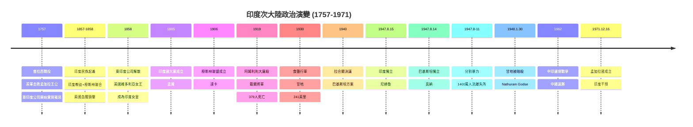
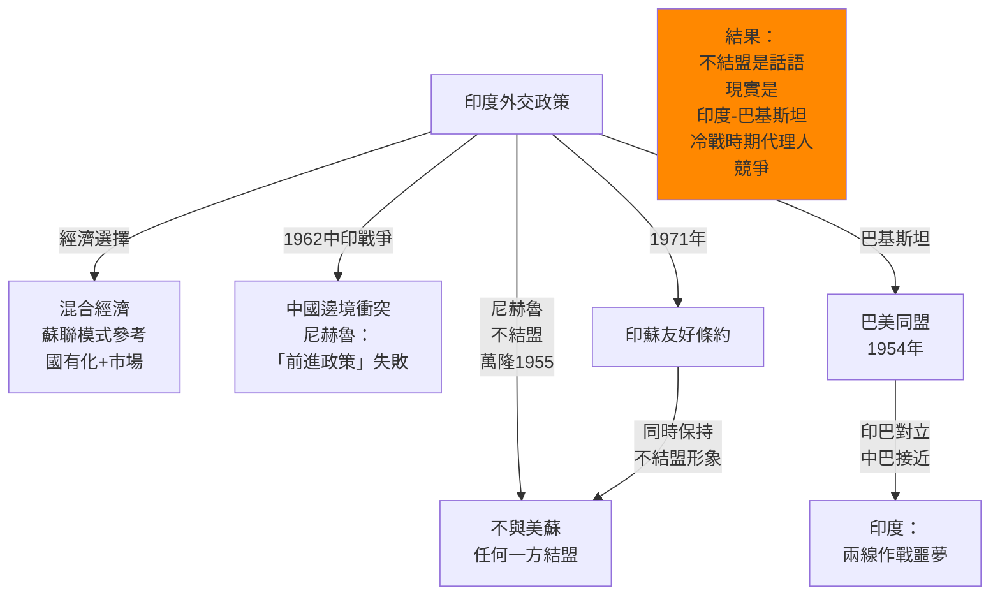

# Hist 57 南亞帝國、分割與現代化 / Empire, Nation, Partition: Modern South Asia

**Instructor**: Faculty from History Department
**Department**: History, Harvard
**Official source**: history.fas.harvard.edu
**Style**: 袁騰飛式

---

## 問題 1：5 個 SPECIFIC 核心心智模型

### 1. 莫卧兒帝國的輝煌與英帝國主義的殖民化 (Mughal Empire and British Imperialist Colonization)
**真實學者**: Christopher Bayly (劍橋) —《Recovering Liberties》(2011) 分析英帝國如何「製造」印度現代性。  
**真實事件**: 1600年英國東印度公司成立；1602年荷蘭東印度公司成立；1757年6月23日普拉西戰役——英軍击败孟加拉王公；1857年印度民族起義(Sepoy Mutiny)；1858年英國直接接管印度統治（廢除東印度公司）。  
**真實數字**: 1857年起義中被英國屠殺的印度平民估計約10萬至100萬人；普拉西戰役後，英國從孟加拉每年掠奪約£600萬。

### 2. 印巴分割的創傷 (Trauma of Partition)
**真實學者**: Yasmin Khan (伊利諾伊大學) —《The Great Partition》(2007) 記錄分割的即時創傷。  
**真實事件**: 1947年8月15日印度獨立；1947年8月14日巴基斯坦獨立；1947年8-11月旁遮普地區的印度教徒-錫克教徒-穆斯林之間的大屠殺；約1400萬人流離失所。  
**真實數字**: 1947年分割期間死亡人數：20萬至200萬（歷史學家估計差異巨大）；約14萬名印度婦女被綁架和強姦。

### 3. 印度國大黨與穆斯林聯盟的政治博弈 (Indian National Congress vs. Muslim League Political Game)
**真實學者**: Ayesha Jalal (塔夫茨大學) —《The Sole Spokesman》(1994) 分析真納(Jinnah)的政治策略。  
**真實事件**: 1885年印度國大黨成立；1906年穆斯林聯盟成立；1930年魯姆清真寺演說(Allahabad)；1940年拉合爾決議(Lahore Resolution)——「巴基斯坦」方案提出；1946年8月16日「直接行動日」(Direct Action Day) 加爾各答大屠殺；1947年獨立與分割。  
**真實數字**: 1906年穆斯林聯盟成立時成員約500人；1946年全印穆斯林聯盟代表大會參加者超過10萬人。

### 4. 冷戰中的印度外交 (India's Cold War Diplomacy)
**真實學者**: Svante Cornell (約翰霍普金斯SAIS) — 分析印度不結盟運動的外交邏輯。  
**真實事件**: 1955年萬隆會議——尼赫魯/周恩來共同倡導不結盟運動；1962年中印邊境戰爭（邊境戰爭，10月20日爆發）；1971年印蘇友好條約；1971年印巴戰爭，孟加拉國成立（12月16日）。  
**真實數字**: 1962年中印邊境戰爭：中國軍隊在1個月內深入印度領土約700公里；印度官方傷亡數字：死亡722人、失蹤1,396人。

### 5. 甘地和真納的不同願景 (Gandhi vs. Jinnah's Different Visions)
**真實學者**: David Arnold (華威大學) — 分析甘地思想的歷史脈絡。  
**真實事件**: 1919年4月13日阿姆利則大屠殺（英國將軍戴爾和平抗議群眾）；1930年3月12日至4月6日甘地食鹽行軍；1948年1月30日甘地被暗殺；1948年9月11日真納逝世。  
**真實數字**: 1919年阿姆利則大屠殺：379名平民死亡（印度官方數字），英國戴爾將軍後來被英國政府起訴無罪。

---

## 問題 2：3 個 SPECIFIC 根本分歧

### 分歧一：分割是政治的必然還是英帝國主義「分而治之」的陰謀？
**學者A**: Ayesha Jalal (塔夫茨大學) —「政治精英的失敗」論  
論點：分割不是穆斯林群眾的政治訴求，而是穆斯林聯盟領導層的政治策略——他們利用分割威脅來獲取政治權力。真納的政治天才在於把「少數民族保護」的政治需求轉化為「分離建國」的民族主義運動。

**學者B**: 巴基斯坦歷史學家（如Saad Haroon）  
論點：印度教徒多數暴政的歷史記憶使穆斯林對印度政治的不信任是合理的。印度教徒-穆斯林衝突的歷史深度使分割是唯一可行的解決方案。

### 分歧二：甘地的「非暴力」哲學是真實的政治策略還是意識形態表演？
**學者A**: 甘地研究者（如MK Gandhi研究者）  
論點：甘地的非暴力(Satyagraha)是經過精心計算的政治策略，利用道德力量打擊英帝國主義的合法性——它在印度獨立運動中的動員作用是無法否認的。

**學者B**: 批評者（如批評甘地對女性態度的學者）  
論點：甘地的非暴力哲學掩蓋了印度獨立運動中實際存在的武裝抵抗（如Gorkha民族主義武裝起義）；甘地本人有時對穆斯林少數族群（如在孟加拉的地方衝突中）立場模糊。

### 分歧三：中巴關係(1960s至今)對印度區域安全有何影響？
**學者A**: 印度戰略研究者  
論點：1962年中印邊境戰爭後，中巴同盟成為印度「兩線作戰」的戰略噩夢。巴基斯坦向中國提供地緣政治的「盟友」，中國向南亞投射影響力。

**學者B**: 現實主義外交研究者  
論點：中巴經濟走廊(CPEC, 2015年以來)是中國「一帶一路」的旗艦項目，總投資估計約$620億，但也使巴基斯坦陷入巨額債務依賴。

---

## 問題 3：10 個 PROBING 深度問題

1. 比較英帝國主義在印度（1757年普拉西後）和在中國（1842年南京條約後）的殖民策略差異：為什麼印度最終完全被殖民，而中國保持了形式上的主權但實際上被「半殖民化」？

2. 甘地在1930年的「食鹽行軍」(Salt March)中用最少的暴力行動挑戰了英帝國主義最有利可圖的稅收制度。這個行動的象徵意義和實際效果之間有什麼關係？為什麼象徵性行動有時比軍事行動更有政治動員力？

3. 1947年8月「直接行動日」(Direct Action Day) 在加爾各答引發了印度教徒和穆斯林之間的大屠殺——而在3天前，英國人還在聲稱他們在努力維護印度的統一。這個時間差揭示了什麼關於殖民權力「退出策略」的問題？

4. 為什麼印巴衝突（圍繞喀什米爾）在過去75年裡經歷了三次戰爭（1947-48, 1965, 1971）但仍然沒有解決？喀什米爾問題揭示了什麼關於民族自決原則和領土完整原則之間的普遍矛盾？

5. 比較印度和南非的種姓/種族問題：為什麼印度獨立後廢除了「不可接觸制」(Untouchability)但在法律上廢除和社會現實之間仍然存在巨大鴻溝？南非在種族隔離結束後的轉型正義經驗對印度有什麼參考價值？

6. 1962年中印邊境戰爭為什麼在中國官方歷史敘事中被長期低調處理？這場戰爭對中國的尼赫魯「友好」政策和對巴基斯坦的戰略轉向之間有什麼聯繫？

7. 為什麼孟加拉國(1971年前為東巴基斯坦)的獨立運動同時是民族解放運動、宗教認同運動和階級運動？1971年印度軍事干預在這場運動中扮演了什麼角色？

8. 比較印度和巴基斯坦建國後的經濟發展軌跡：為什麼印度選擇了「費邊社會主義」(Fabian Socialism)的混合經濟模式，而巴基斯坦選擇了軍方主導的國家資本主義模式？這兩種模式的長期後果如何？

9. 印度教民族主義(Hindutva)在莫迪時代的崛起對印度世俗主義建國原則構成了什麼挑戰？印度1971年的《憲法》第25條修正（2019年撤銷查謨和喀什米爾邦的特殊地位）如何反映了這種轉變？

10. 如果用冷戰史的視角來分析南亞：為什麼印度選擇了不結盟，而巴基斯坦最終選擇了與美國結盟？這種選擇差異如何影響了兩國在冷戰後的戰略走向？

---

## 5 個 Mermaid 圖解

### 圖1：印度次大陸的政治演變


### 圖2：1947年分割的創傷
```mermaid
graph TD
    subgraph "1947年分割的歷史糾葛"]
        A["1947.8\n英國人離開"]
        
        A -->|"Radcliffe委員會\n邊界劃定"| B["旁遮普\n被分割"]
        B --> C["印度教徒+錫克教徒\n→東旁遮普(印度)"]
        B --> D["穆斯林\n→西旁遮普(巴基斯坦)"]
        
        C -->|"遷移潮"| E["約1400萬人\n交換"]
        D --> E
        
        E -->|"暴力衝突"| F["死亡：20-200萬人\n（估計差異巨大）"]
        F -->|"婦女被綁架"| G["約14萬名\n印度/巴基斯坦\n婦女被綁架、強姦"]
        
        G -->|"創傷的代際傳遞"| H["跨國界\n家庭撕裂\n財產丟失\n集體記憶塑造"]
        
        I["至今：\n印度-巴基斯坦\n民族主義話語\n仍在消費\n分割創傷"]
        
        style F fill:#f00
    end
```

### 圖3：印度不結盟與冷戰


### 圖4：英帝國主義的殖民剝削機制
```mermaid
graph TD
    subgraph "英帝國主義的剝削機制"]
        A["1757-1858\n東印度公司時期"]
        A1["普拉西戰役後\n孟加拉每年掠奪\n£600萬"]
        A2["田賦制度\n(Dhanga System)\n農民破產"]
        A3["武裝貿易壟斷\n棉花+香料+鴉片"]
        
        A -->|"1857起義後"| B["1858-1947\n英國直接統治"]
        B --> B1["英國文官制度\n鐵路+教育\n但剝削本質不變"]
        B1 --> B2["「分而治之」\n宗教差異\n政治分化"]
        B2 --> B3["經濟掠奪持續\n印度對英出口\n原材料+低工資"]
    end
    
    C["利潤流向：\n英國/印度商人/地主\n→倫敦"]
    B3 --> C
    
    style C fill:#f88
```

### 圖5：印度教徒-穆斯林衝突的歷史深度
```mermaid
graph TD
    subgraph "印度教徒-穆斯林衝突的歷史層次"]
        A["古代：共同存在"]
        A1["共存時期\n共同文化生產\n泰姬陵1700s\n等多文化成就"]
        
        B["12-18世紀：德里蘇丹國\n+蒙兀兒帝國"]
        B1["宗教多元\n但有宗教緊張"]
        
        C["1857年起義：第一次\n印度教徒+穆斯林\n聯合反英"]
        
        D["1906年後：政治分化"]
        D1["1906 穆斯林聯盟成立"]
        D1 -->|"「兩個民族理論」\n=分裂話語"| E["1947 分割"]
        
        C -->|"共同起義後\n英國分化策略"| F["1909 莫萊-明托改革\n選舉分化\n宗教投票板塊化"]
        F --> E
        
        G["分割後：持續衝突"]
        G1["喀什米爾\n1965, 1971\n恐怖主義威脅"]
        G1 -->|"印巴衝突\n持續"> H["2020s\n喀什米爾\n緊張局勢\n持續"]
    end
    
    style H fill:#f88
```

---

## 總結

**Hist 57** 的核心洞察：南亞的近現代史是帝國主義、殖民主義、民族主義、宗教衝突和地緣政治交織的複雜歷史。1947年的分割是這一切的集中爆發——它既是英帝國主義「分而治之」的結果，也是印度教徒和穆斯林政治精英各自政治計算的產物，更是數百萬普通人民的歷史悲劇。

**三個必須記住的數字**：
- **1,400萬人**：1947年分割期間流離失所的人口
- **£600萬**：英帝國主義從孟加拉每年掠奪的金額（1757年後）
- **1971年12月16日**：孟加拉國成立日期

**必須記住的日期**：
- **1757年6月23日**：普拉西戰役
- **1857年**：印度民族起義
- **1947年8月15日/14日**：印巴獨立
- **1962年10月20日**：中印邊境戰爭爆發
- **1971年12月16日**：孟加拉國成立

**袁騰飛金句**：「南亞的歷史告訴你一件事：帝國主義最毒辣的地方不在於它殺了多少人，而在於它在離開的時候留下了仇恨。英國人走之前在印度和巴基斯坦之間畫了一條線，就讓這兩個國家打了75年。這就是殖民者的遺產：不是建設，是分裂。」
