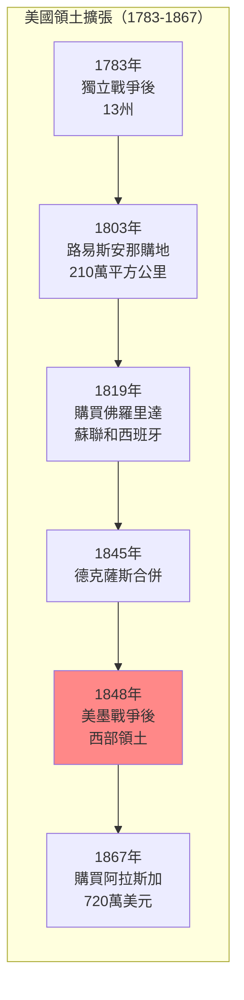
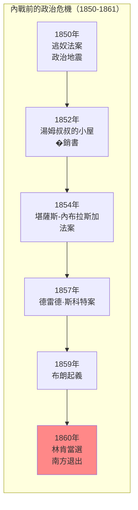
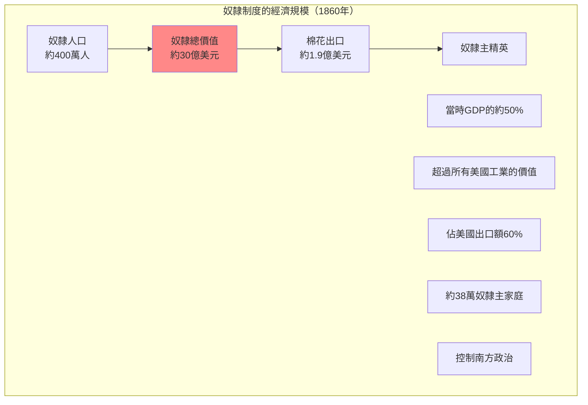
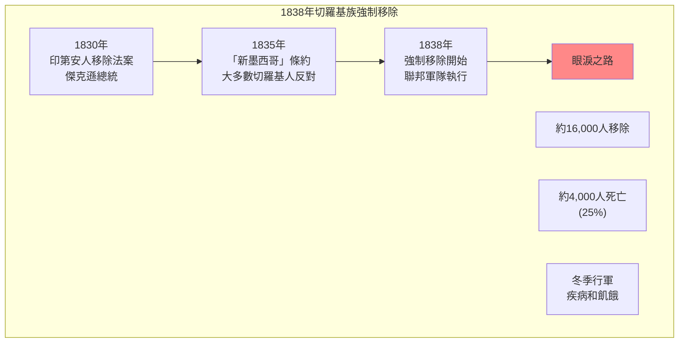

# Hist 66 內戰的來臨 / The Coming of the Civil War

**Instructor**: Walter Johnson
**Department**: History, Harvard
**Official source**: history.fas.harvard.edu
**Big Question**: 我們如何將美國內戰置於19世紀帝國主義的背景下理解？
**Style**: 袁騰飛式

---

## 問題 1：5 個 SPECIFIC 核心心智模型

### 1. 奴隸制與美國帝國主義 (Slavery and American Imperialism)
**真實學者**: Walter Johnson (哈佛) —《River of Dark Dreams》(2013) 分析奴隸種植園與帝國主義的關係。  
**真實事件**: 1803年路易斯安那購地；1845年德克薩斯合併；1846-1848年美墨戰爭。  
**真實數字**: 路易斯安那購地面積約210萬平方公里，價格1500萬美元。

### 2. 海地革命與美國奴隸政治 (Haitian Revolution and American Slave Politics)
**真實學者**: Robin Blackburn (羅格斯大學) —《The Overthrow of Colonial Slavery》(1988) 分析海地革命的影響。  
**真實事件**: 1791年8月海地起義；1804年1月海地獨立；1825年美國承認海地（推遲）。  
**真實數字**: 海地革命是歷史上唯一成功的奴隸起義。

### 3. 內戰前的政治危機 (Political Crisis Before the Civil War)
**真實學者**: David Blight (耶魯大學) —《Race and Reunion》(2001) 分析內戰記憶政治。  
**真實事件**: 1850年逃奴法案；1854年堪薩斯-內布拉斯加法案；1857年德雷德·斯科特案；1859年布朗起義。  
**真實數字**: 1850年逃奴法案迫使約10萬自由黑人逃往加拿大。

### 4. 奴隸制度的政治經濟學 (Political Economy of Slavery)
**真實學者**: Edward Baptist (康奈爾大學) —《The Half Has Never Been Told》(2014) 分析奴隸勞動的剝削。  
**真實事件**: 1808年禁止國際奴隸貿易；1830年代棉花帝國興起；1850年代奴隸價格的飆升。  
**真實數字**: 1860年奴隸制度價值約30億美元，相當於當時美國GDP的約50%。

### 5. 美洲原住民的移除 (Removal of Indigenous Peoples)
**真實學者**: Claudio Saunt (喬治亞大學) —《Unworthy Republic》(2020) 分析強制移除。  
**真實事件**: 1830年印第安人移除法案；1838年切羅基族的眼淚之路；1862年宅基地法案。  
**真實數字**: 切羅基族移除中約4,000人死亡（總數16,000人中的25%）。

---

## 問題 2：3 個 SPECIFIC 根本分歧

### 分歧一：內戰是否是「關於」奴隸制的戰爭
**學者A**: 自由派史學如David Blight  
論點：奴隸制是內戰的核心原因，「州權」只是掩飾。

**學者B**: 修正主義史學  
論點：內戰有更複雜的原因，包括經濟、地區和階級因素。

### 分歧二：奴隸制是否「高效」
**學者A**: Baptist等學者  
論點：奴隸制是「高效」的剝削制度，奴隸勞動創造了巨大剩餘價值。

**學者B**: Fogel和Engerman  
論點：奴隸制是「低效」的，市場力量最終會消滅它。

### 分歧三：林肯的歷史評價
**學者A**: 進步史學  
論點：林肯是偉大的廢奴主義者。

**學者B**: 修正主義如 Lerone Bennett Jr.  
論點：林肯是種族主義者，廢奴並非他的首要目標。

---

## 問題 3：10 個 PROBING 深度問題

1. 比較1803年路易斯安那購地和2020年代的並購——美國領土擴張的「帝國主義」邏輯是否有連續性？

2. 海地革命（1791-1804）如何影響了美國對奴隸制度的政治態度？為什麼美國推遲承認海地直到1862年？

3. 分析「眼淚之路」（1838年）——約4,000名切羅基人在強制移除中死亡。這個歷史如何影響了我們理解當代原住民權利運動？

4. 奴隸制度價值約30億美元（1860年）——這個數字如何計算？奴隸制度對美國經濟的貢獻是否被傳統歷史敘事低估了？

5. 比較美墨戰爭（1846-1848）和2003年伊拉克戰爭：這兩場「帝國主義戰爭」在動機、話語和代價上有什麼相似和不同？

6. 為什麼南方的奴隸主精英願意為了「州權」冒險發動戰爭？這個「州權」的真正內容是什麼？

7. 德雷德·斯科特案（1857年）為什麼成為內戰前的關鍵法律時刻？這個案件如何揭示了奴隸制和憲法之間的不可調和矛盾？

8. 約翰·布朗（1859年）的起義是「英雄主義」還是「恐怖主義」？這個歷史評價的爭議如何繼續影響當代政治？

9. 比較內戰前的廢奴主義運動和今天的種族正義運動：這兩場運動在策略、話語和動員模式上有什麼相似和不同？

10. 如果歷史可以重來——有什麼「關鍵時刻」可能避免內戰？這種反事實歷史思考有意義嗎？

---

## 5 個 Mermaid 圖解

### 圖1：美國領土擴張的時間線

### 圖2：奴隸制度在美國南部的地理分佈

### 圖3：內戰前的關鍵政治事件

### 圖4：奴隸制度的經濟規模

### 圖5：切羅基族移除（眼淚之路）

---

## 總結

**Hist 66** 的核心洞察：美國內戰不是一個孤立的「內部」事件，而是與美國帝國主義、奴隸制度和美洲原住民移除緊密相連的。理解這段歷史是理解當代美國種族問題和帝國主義遺產的前提。

**三個必須記住的數字**：
- **400萬**：1860年美國奴隸人數
- **30億美元**：1860年奴隸制度的總價值
- **約50%**：奴隸制度價值佔當時美國GDP的比例

**必須記住的日期**：
- **1857年3月6日**：德雷德·斯科特案裁決
- **1859年10月16日**：約翰·布朗起義
- **1860年11月6日**：林肯當選總統
- **1861年4月12日**：邦聯軍隊攻擊桑特堡

**袁騰飛金句**：「美國內戰不是一個關於『自由』vs『奴隸制』的簡單故事。這是一個關於帝國主義的故事——美國用奴隸勞動開發南方，用戰爭掠奪墨西哥，用種族主義團結白人的帝國主義。內戰不是美國歷史的『例外』，而是它的『本質』。」