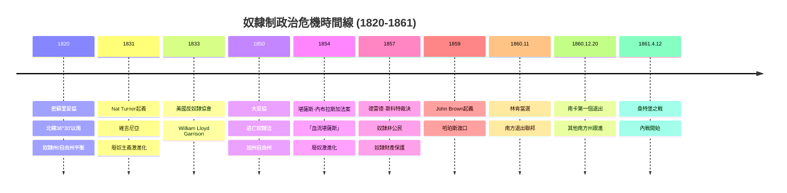
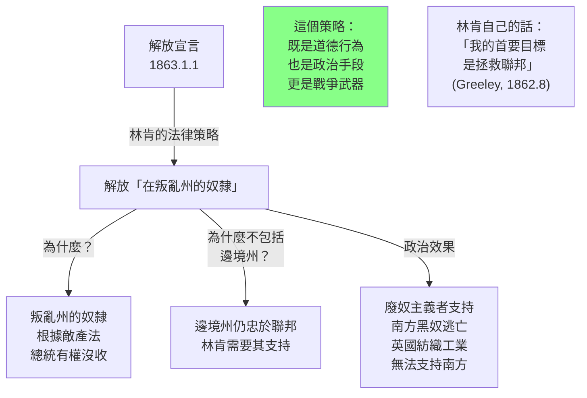
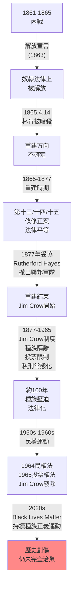

# Hist 66 美國內戰的來臨 / The Coming of the Civil War

**Instructor**: Faculty from History Department
**Department**: History, Harvard
**Official source**: history.fas.harvard.edu
**Style**: 袁騰飛式

---

## 問題 1：5 個 SPECIFIC 核心心智模型

### 1. 奴隸制與聯邦主義的政治張力 (Political Tension Between Slavery and Federalism)
**真實學者**: David Blight (耶魯) —《Race and Reunion》(2001) 分析內戰記憶如何在戰後被政治化。  
**真實事件**: 1820年密蘇里妥協(Missouri Compromise)；1850年大妥協(The Compromise of 1850)；1854年堪薩斯-內布拉斯加法案(Kansas-Nebraska Act)；1857年德雷德·斯科特裁決(Dred Scott Decision)；1860年12月南卡羅來納州脫離聯邦。  
**真實數字**: 1857年德雷德·斯科特裁決：約280萬黑人被裁定不為公民；1860年南方奴隸州數量：15個。

### 2. 意識形態的地域分化 (Regional Polarization of Ideologies)
**真實學者**: Michael Holt (芝加哥) —《The Political Crisis of 1850s》(2000)。  
**真實事件**: 1854年「血腥的堪薩斯」(Bleeding Kansas)——反奴隸和擁奴兩派在堪薩斯內戰；1859年布朗(John Brown)突襲哈珀斯渡口(Harper's Ferry)；1860年林肯當選總統（僅獲得約40%普選票）。  
**真實數字**: 1860年林肯當選：39.8%普選票，但 electoral votes 180票；南卡羅來納州1860年12月20日投票脫離聯邦，成為第一個退出州。

### 3. 奴隸制作為經濟制度的利益衝突 (Slavery as Economic Interest Conflict)
**真實學者**: Robert Fogel & Stanley Engerman —《Time on the Cross》(1974)。  
**真實事件**: 1808年禁止國際奴隸貿易（聯邦法律）；1850年逃亡奴隸法(Fugitive Slave Act)；1850年《湯姆叔叔的小屋》出版；1861年4月12日南方邦聯軍攻擊桑特堡(Fort Sumter)。  
**真實數字**: 1860年奴隸財產估值：約$30億（相當於2010年約$7,000億）；奴隸佔美國南方總財富的約27%。

### 4. 種族科學與廢奴主義話語的交織 (Racial Science and Abolitionist Discourse)
**真實學者**: Eric Foner (哥倫比亞) —《Free Soil, Free Labor, Free Men》(1995)。  
**真實事件**: 1831年Nat Turner's Rebellion（維吉尼亞起義，約60人死亡）；1833年美國反奴隸協會成立；1845年Frederick Douglass自傳出版；1848年塞內卡福爾斯會議(Seneca Falls Convention)。  
**真實數字**: Nat Turner起義後：約100名奴隸被捕，其中18人被處死；南方「奴隸巡查法」(Slave Patrol)制度的規模和功能。

### 5. 從談判到戰爭的轉折點 (Turning Points: Negotiation to War)
**真實學者**: James McPherson (普林斯頓) —《Battle Cry of Freedom》(1988)。  
**真實事件**: 1861年4月12日南方邦聯軍攻擊桑特堡；1861年7月21日第一次牛奔河戰役(Bull Run)；1863年1月1日林肯解放宣言(Emancipation Proclamation)。  
**真實數字**: 桑特堡戰役：美軍守軍26人全部投降，無人死亡（南方故意避免第一滴血）；第一牛奔河戰役：聯邦軍約3,000人傷亡，南方首次重大勝利。

---

## 問題 2：3 個 SPECIFIC 根本分歧

### 分歧一：內戰是否是「不可避免」(Inevitable) 的？
**學者A**: James McPherson (普林斯頓)  
論點：奴隸制和自由勞動制度之間的不可調和矛盾使內戰在結構上是不可避免的——雙方在領土擴張問題上的衝突最終只能以武力解決。

**學者B**: Michael Holt (芝加哥)  
論點：內戰並非結構性不可避免——如果1850年代的立法妥協（如克里坦登妥協）得到執行，戰爭可能延遲甚至避免。內戰更多是因為當時的政治體制（兩黨制、聯邦制度）無法有效處理奴隸制擴展的問題。

### 分歧二：林肯的解放宣言是道德行為還是政治手段？
**學者A**: 廢奴主義歷史學家  
論點：林肯是真心反奴隸的，但受到政治現實的制約。解放宣言是他道德信念和政治策略的結合——他先解放叛亂州的奴隸，逐步建立法律和道德的正當性。

**學者B**: 修正主義觀點  
論點：林肯的核心目標是維護聯邦而非解放奴隸——他在1862年寫給Horace Greeley的信中說「我的首要目標是拯救聯邦，不是拯救或摧毀奴隸制」。

### 分歧三：南方「起義」(secession)是維護奴隸制的叛亂還是正當的權利主張？
**學者A**: 南方歷史學家（仍存在爭議）  
論點：南方各州行使了合法退出聯邦的權利——這是《憲法》第十修正案保留給各州的權力。

**學者B**: David Blight (耶魯)  
論點：南方起義的核心動機是維護奴隸制——《脫離聯邦宣言》中明確說明這一點。任何將其描述為「維護州權」的說法都是對歷史事實的扭曲。

---

## 問題 3：10 個 PROBING 深度問題

1. 1820年的密蘇里妥協和1850年的大妥協都在試圖「解決」奴隸制問題——為什麼這兩次妥協都失敗了？這揭示了奴隸制問題的什麼本質特徵使其「不可調和」？

2. 德雷德·斯科特裁決(1857年)宣布「奴隸不是公民，黑人從來沒有被《獨立宣言》涵蓋」——這個裁決不僅是法律失敗，它如何實際上激化了廢奴主義和南方奴隸權利的對立？

3. 1859年John Brown在哈珀斯渡口的武裝起義失敗後被處死，但這個行動如何反而幫助了林肯的當選？這個案例揭示了政治暴力的什麼「反直覺」效果？

4. 比較1861年4月12日南方邦聯軍對桑特堡的攻擊與1861年7月21日第一次牛奔河戰役——這兩場軍事行動如何決定了內戰的走向和雙方的戰略選擇？

5. 為什麼林肯在1863年1月1日的解放宣言( Emancipation Proclamation)中特意選擇了解放「在叛亂州的奴隸」而非「在聯邦控制州的奴隸」？這個法律策略的背後邏輯是什麼？

6. 南方邦聯的失敗不僅是軍事失敗，還是經濟和外交失敗。比較南方邦聯和北方聯邦的經濟基礎：鐵路、工業、農業、對外貿易——這些差異如何影響了戰爭的結果？

7. 內戰期間約18.8萬黑人男子加入聯邦軍隊作戰——這種大規模的武裝動員如何改變了美國軍隊和社會的種族關係，並為戰後重建(Civil War Reconstruction)奠定基礎？

8. 為什麼1860年代的「重建」(Reconstruction)最終失敗了？這個失敗如何為1890年代至1960年代的「Jim Crow種族隔離制度」奠定了基礎？

9. 比較美國內戰和同時期的俄國1861年解放農奴制——這兩個「解放」運動在結果上有什麼根本差異？這種差異如何影響了兩國此後100年的歷史走向？

10. 如果用Gunnar Myrdal的「美國民主的兩難」(American Dilemma, 1944)框架：內戰前的奴隸制和內戰後的Jim Crow制度都揭示了「自由民主」話語和「種族壓迫」現實之間的深刻矛盾。這個「美國民主兩難」在今天仍然存在嗎？

---

## 5 個 Mermaid 圖解

### 圖1：奴隸制與聯邦的政治危機時間線


### 圖2：奴隸制與南方經濟的利益紐帶
```mermaid
graph TD
    subgraph "奴隸制作為南方經濟的核心利益"]
        A["1860年奴隸州\n奴隸財產估値\n$30億(當時美元)"]
        
        A -->|"奴隸=抵押品"| B["奴隸主信用\n銀行借貸基礎"]
        A -->|"奴隸=農業工人"| C["煙草/棉花\n種植園經濟"]
        A -->|"奴隸=政治權力"| D["五分之三妥協\n南方政治代表"]
        
        B -->|"金融穩定"| E["南方銀行/商業\n奴隸市場"]
        C -->|"出口收入"| F["棉花出口\n美國出口額50%+"]
        D -->|"政治權力"| G["美國參眾兩院\n南方不成比例"]
        
        H["奴隸主精英\n控制了南方的\n政治/經濟/社會"]
        E --> H
        F --> H
        G --> H
        
        I["因此：\n奴隸制不僅是道德問題\n更是經濟利益問題\n這使廢奴更困難"]
    end
    
    style I fill:#f88
```

### 圖3：內戰的政治地理
```mermaid
graph TD
    subgraph "1861年內戰的政治地理"]
        A["北方自由州\n~2200萬人口"]
        A1["紐約：金融/工業中心"]
        A2["鐵路網絡：北方發達"]
        A3["海軍：封鎖南方"]
        
        B["南方奴隸州\n~900萬人口\n（含380萬奴隸）"]
        B1["農業：棉花/煙草\n出口依賴"]
        B2["軍事：騎兵/地頭蛇\n當地知識"]
        B3["外交：依賴英法\n棉花外交"]
        
        C["邊境州\n肯塔基/密蘇里\n馬里蘭/德拉瓦\n成為雙方爭奪"]
        
        D["問題：\n南方能否\n國際承認？"]
        D -.-> B1
    end
    
    style B fill:#fcc
    style A fill:#cfc
```

### 圖4：林肯解放宣言的法律策略


### 圖5：內戰與重建的歷史連續性


---

## 總結

**Hist 66** 的核心洞察：美國內戰是關於奴隸制和自由這兩個根本價值之間不可調和的矛盾最終以暴力方式解決的歷史事件。它揭示了「自由女神」話語和奴隸制現實之間的深刻鴻溝，也揭示了這個鴻溝至今仍在困擾美國政治。

**三個必須記住的數字**：
- **$30億**：1860年奴隸財產估值（當時美元）
- **618,222**：內戰中美軍死亡人數（北方約36萬，南方約26萬）
- **1820年**：密蘇里妥協年份

**必須記住的日期**：
- **1857年3月6日**：德雷德·斯科特裁決
- **1860年11月6日**：林肯當選
- **1860年12月20日**：南卡羅來納州脫離聯邦
- **1863年1月1日**：解放宣言生效
- **1865年4月14日**：林肯被暗殺

**袁騰飛金句**：「美國的奴隸制和美國的自由口號，這兩件事在歷史上一直是並存的。建國的時候說『人人生而平等』，但憲法裡保護奴隸制。一百年後的林肯說要解放奴隸，但他在信裡說『我的首要目標是拯救聯邦』。政治人物的話，你得學會兩件事：他們說什麼，和他們做什麼——有時候這兩件事之間的差距，就是歷史的真相。」
