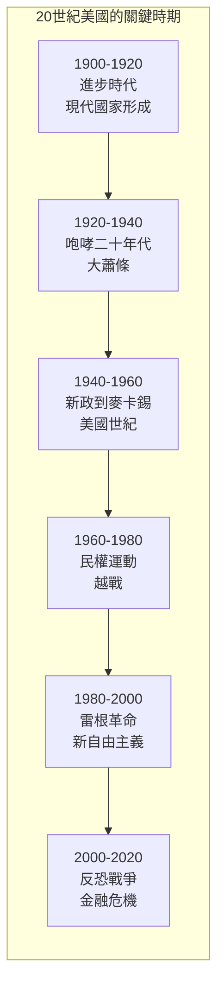
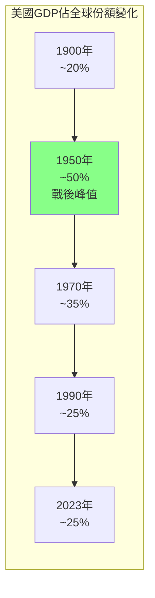
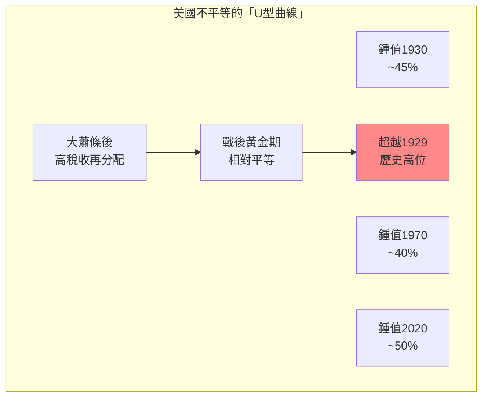
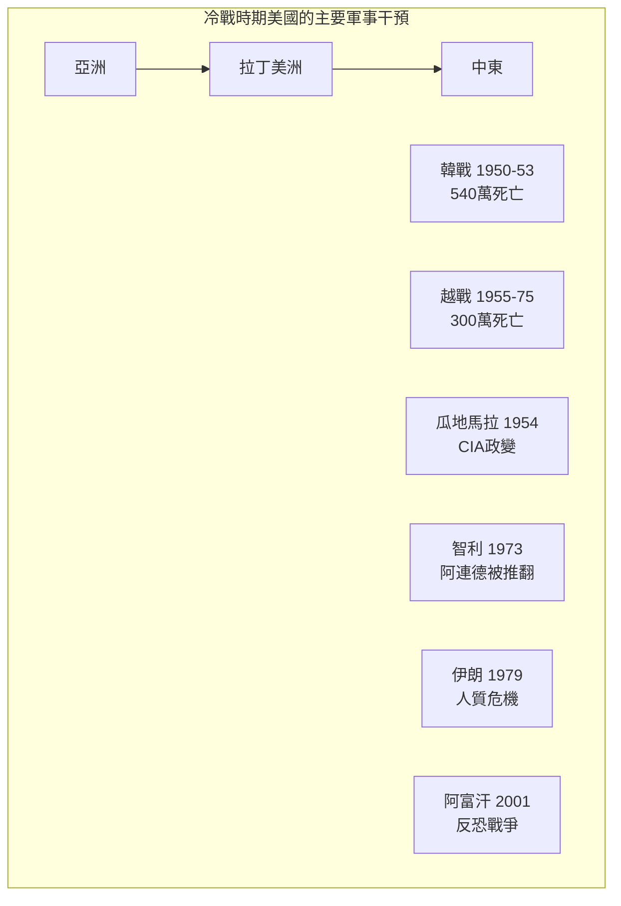
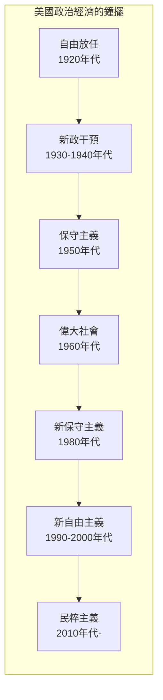

# Hist 68 20世紀的美國 / The 20th-Century United States: Politics, Society, Culture

**Instructor**: Lisa McGirr
**Department**: History, Harvard
**Official source**: history.fas.harvard.edu
**Big Question**: 美國如何在20世紀成為世界上最強大的國家？
**Style**: 袁騰飛式

---

## 問題 1：5 個 SPECIFIC 核心心智模型

### 1. 進步時代與現代國家的形成 (Progressive Era and Formation of Modern State)
**真實學者**: Samuel Haber (加州大學) — 分析進步時代的改革運動。  
**真實事件**: 1890年謝爾曼反托拉斯法；1906年食品安全法；1913年聯邦儲備系統成立。  
**真實數字**: 進步時代見證了約30,000項立法改革。

### 2. 一戰與美國的全球崛起 (WWI and America's Global Rise)
**真實學者**: Kennedy (哈佛) — 分析一戰對美國全球地位的影響。  
**真實事件**: 1917年4月美國參戰；威爾遜的「十四點計劃」；1919年6月凡爾賽條約。  
**真實數字**: 一戰後，美國從債務國變成世界上最大的債權國。

### 3. 大蕭條與新政 (Great Depression and New Deal)
**真實學者**: Alan Brinkley (哈佛) —《The End of Reform》(1995) 分析新政的轉向。  
**真實事件**: 1929年10月29日「黑色星期二」；1933年3月羅斯福就職；1935年社會保障法案。  
**真實數字**: 大蕭條期間，失業率最高達25%（1933年）。

### 4. 二戰與美國世紀 (WWII and the American Century)
**真實學者**: David Kennedy (史丹福大學) —《Freedom from Fear》(1999) 分析二戰如何塑造美國世紀。  
**真實事件**: 1941年12月7日珍珠港事件；1944年布雷頓森林體系；1945年8月原子彈。  
**真實數字**: 二戰後，美國佔全球GDP的約50%和工業產出的約40%。

### 5. 民權運動與新保守主義 (Civil Rights Movement and Neoliberalism)
**真實學者**: Lisa McGirr (哈佛) —《Suburban Warriors》(2001) 分析保守派的興起。  
**真實事件**: 1964年民權法案；1965年投票權法案；1980年雷根當選。  
**真實數字**: 1960年代約有200萬黑人遷移到北方城市。

---

## 問題 2：3 個 SPECIFIC 根本分歧

### 分歧一：美國世紀的代價
**學者A**: 自由派史學  
論點：美國世紀帶來了民主和繁榮。

**學者B**: 批評者如Noam Chomsky  
論點：美國世紀是帝國主義和剝削的世紀。

### 分歧二：新政的歷史評價
**學者A**: 進步史學  
論點：新政是偉大的改革成就，拯救了資本主義。

**學者B**: 保守派史學  
論點：新政擴大了政府權力，開始了福利國家的失控。

###分歧三：民權運動的遺產
**學者A**: 主流史學  
論點：民權運動是20世紀最重要的社會進步運動。

**學者B**: 批評者如Michelle Alexander  
論點：種族主義只是轉移到了「大規模監禁」系統。

---

## 問題 3：10 個 PROBING 深度問題

1. 美國如何從一戰後的孤立主義轉向二戰後的全球帝國主義？這種轉變背後的經濟和意識形態原因是什麼？

2. 大蕭條如何同時是「資本主義的危機」和「資本主義的重組」？新政如何在不改變基本制度的條件下「拯救」了資本主義？

3. 比較冷戰時期的麥卡錫主義和今天的川普現象：美國政治中的「偏執狂風格」有什麼歷史連續性？

4. 民權運動如何同時是「黑人的運動」和「白人的運動」？這個運動如何改變了美國政治的兩黨格局？

5. 為什麼1960年代成為美國政治的「分水嶺」？比較這個時期的社會運動（民權、女性運動、環保運動、反戰運動）和今天的社會運動。

6. 分析「美國夢」的歷史演變：從1950年代的郊區中產階級願景到今天的科技億萬富翁願景，「成功」的定義如何變化？

7. 為什麼美國沒有社會主義政黨？比較美國勞工運動和歐洲社會民主主義的命運。

8. 從新政到偉大社會再到雷根革命：美國政治經濟學的鐘擺如何擺動？這種擺動是否有「底」？

9. 「美國世紀」的代價是什麼？從越戰到伊拉克戰爭，從古巴到阿富汗——美國帝國主義的「受害者」是誰？

10. 如果20世紀是「美國世紀」——21世紀會是什麼？這個問題為什麼對理解當代世界秩序至關重要？

---

## 5 個 Mermaid 圖解

### 圖1：美國世紀的時間線

### 圖2：美國GDP的世界份額變化

### 圖3：美國不平等的歷史變化

### 圖4：美國世紀的代理人戰爭

### 圖5：美國政治經濟的鐘擺

---

## 總結

**Hist 68** 的核心洞察：20世紀美國從一個區域強國崛起為全球超級大國，這個過程既是美國夢的實現，也是美國帝國主義的膨脹。理解這段歷史是理解當代美國政治、經濟和外交政策的基礎。

**三個必須記住的數字**：
- **50%**：1950年美國佔全球GDP的比例
- **25%**：2023年美國佔全球GDP的比例
- **50%**：最富1%美國人佔有的財富比例

**必須記住的日期**：
- **1929年10月29日**：「黑色星期二」，大蕭條開始
- **1933年3月4日**：羅斯福就職
- **1941年12月7日**：珍珠港事件
- **1964年7月2日**：民權法案
- **1980年11月4日**：雷根當選

**袁騰飛金句**：「20世紀是美國的世紀——但這個世紀不是免費的。韓戰死了540萬人，越戰死了300萬人，伊拉克戰爭花了2兆美元。美國世紀是用別人的血和錢建立起來的。這個代價從來不在美國的官方歷史裡——但它應該在。」