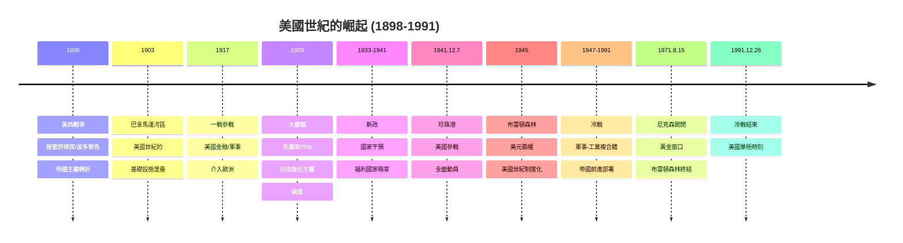

# Hist 68 二十世紀的美國 / The 20th-Century United States

**Instructor**: Faculty from History Department
**Department**: History, Harvard
**Official source**: history.fas.harvard.edu
**Style**: 袁騰飛式

---

## 問題 1：5 個 SPECIFIC 核心心智模型

### 1. 美國世紀的崛起：從地區強權到全球霸權 (Rise of the American Century: Regional Power to Global Hegemon)
**真實學者**: Paul Kennedy (耶魯) —《The Rise and Fall of the Great Powers》(1987) 分析美國世紀的物質基礎。  
**真實事件**: 1898年美西戰爭（帝國主義轉折點）；1903年巴拿馬運河區租借；1917年4月6日美國參加一戰；1941年12月7日珍珠港事件；1945年布雷頓森林體系建立。  
**真實數字**: 1945年美國GDP約$2,220億，佔全球GDP約40%（二戰後初期的超級優勢）。

### 2. 新政國家建構與福利國家的誕生 (New Deal State-Building and Birth of the Welfare State)
**真實學者**: Jason Parillo & Theda Skocpol — 分析新政的政治聯盟和制度遺產。  
**真實事件**: 1933年3月4日羅斯福就職；1933年6月16日國家工業復興法案(NIRA)；1935年社會保障法(Social Security Act)；1964年民權法案(Civil Rights Act)；1965年醫療保險(Medicare)。  
**真實數字**: 1933年失業率達25%；新政公共工程項目僱用了約800萬工人；社會保障法1935年覆蓋約2,700萬人。

### 3. 冷戰與國內安全的悖論 (Cold War and Domestic Security Paradox)
**真實學者**: Ellen Schrecker (哈佛) —《Many Are the Crimes》(1998)。  
**真實事件**: 1950年麥卡錫主義高峰期；1954年軍人限額法(Army-McCarthy Hearings)；1971年五角大樓文件洩露(Pentagon Papers)；1972年水門事件。  
**真實數字**: 1947-1954年麥卡錫時代：約10,000-15,000名聯邦雇員被認為有共產主義傾向而遭到迫害；實際確認的蘇聯間諜：約140人（Venona Project解密後確認）。

### 4. 民權革命的矛盾 (Contradictions of the Civil Rights Revolution)
**真實學者**: Thomas Sugrue (賓夕法尼亞大學) —《The Origins of the Urban Crisis》(1996)。  
**真實事件**: 1955年12月1日Rosa Parks拒絕讓座；1960年2月1日格林斯博羅四人組(Greensboro Four)；1963年8月28日華盛頓大遊行；1965年2月21日馬爾科姆·X被暗殺；1968年4月4日馬丁·路德·金被暗殺。  
**真實數字**: 1950年代至1960年代：黑人家庭收入約為白人家庭收入的50-55%；1960年代黑人失業率約為白人的2倍。

### 5. 越戰與帝國過度擴張 (Vietnam War and Imperial Overstretch)
**真實學者**: Andrew Bacevich (波士頓大學) —《The Limits of Power》(2008)。  
**真實事件**: 1964年8月東京灣事件(Tonkin Gulf Incident)；1965年3月8日美軍地面部隊登陸越南；1968年1月春節攻勢(Tet Offensive)；1973年1月27日巴黎和平協定；1975年4月30日西貢陷落。  
**真實數字**: 越戰死亡：美軍58,000人；南越軍隊約25萬人；平民約200萬人；美國在越南的總軍事支出約$1,680億（2020年美元價值）。

---

## 問題 2：3 個 SPECIFIC 根本分歧

### 分歧一：美國是「例外」(Exceptional) 的帝國還是普通帝國？
**學者A**: Seymour Martin Lipset (美國例外論研究者)  
論點：美國建國時的「自由」話語、天賦使命(Manifest Destiny)和反傳統主義(anti-traditionalism)使美國與舊世界帝國主義有本質差異。

**學者B**: Charles Maier (哈佛)  
論點：美國的「例外論」是意識形態話語——美國的海外軍事存在（800個海外基地）和經濟權力（美元霸權）與歷史上的帝國主義沒有本質差異，只是更具意識形態色彩。

### 分歧二：越戰的教訓是關於武力使用的極限還是美國意誌的不足？
**學者A**: Victor Davis Hanson (加州州立大學) 等保守派歷史學家  
論點：越戰失敗不是因為戰爭不可能打贏，而是因為美國政治領袖缺乏打到底的意志——國會在1968年禁止增兵，公眾反戰運動削弱了士氣。

**學者B**: George Herring (肯塔基大學)  
論點：越戰的失敗是結構性的——美軍無法識別游擊隊和村民的區別，無法贏得「民心」，而南越政權腐敗無能，根本無法承擔民主國家建設的任務。

### 分歧三：1960年代的民權革命是否被「逆轉」了？
**學者A**: 進步主義觀點  
論點：1964年民權法案和1965年投票權法案雖然在法律上廢除了種族隔離，但實質性的種族經濟不平等在1960年代後持續存在——平權行動(Affirmative Action)在2014年Fisher案中受到重大限制。

**學者B**: 保守派觀點  
論點：民權革命的目標（法律上的種族平等）已基本實現，現在的挑戰是階級問題而非種族問題，「種族」話語已成為政治動員工具而非真實描述。

---

## 問題 3：10 個 PROBING 深度問題

1. 美國在1898年美西戰爭後開始從美洲大陸擴張轉向海外帝國主義。這種轉變在「門戶開放政策」(Open Door Policy)中如何體現？這個政策的實質是什麼？

2. 比較新政(1933-1941)和二戰後歐洲的馬歇爾計劃(1948-1952)：兩者都是大規模國家干預經濟的案例，但為什麼新政成為美國的政治遺產而馬歇爾計劃成為歐美同盟的基礎？

3. 1950年代麥卡錫主義的「紅色恐慌」最終在1954年軍人聽證會後走向終結。這個事件如何揭示了美國政治中「愛國主義」和「政治迫害」之間的危險邊界？

4. 為什麼馬丁·路德·金在1967年公開反對越戰時說「我是站在良心的反對者」？這個轉變如何標誌著美國民權運動從「自由主義聯盟」轉向「激進正義」？

5. 比較1960年代黑豹黨(Black Panther Party)的「自我防衛」政治和馬丁·路德·金的「非暴力直接行動」——這兩種策略在政治效果和歷史影響上有什麼差異？

6. 美國在二戰後建立的布雷頓森林體系（美元-黃金掛鉤、IMF、世行、關稅總協定）如何塑造了戰後全球經濟秩序？1971年8月15日尼克森關閉黃金窗口如何標誌著這個體系的終結和美元霸權的新階段？

7. 為什麼1973年的石油危機(OECD國家石油危機)是美國經濟霸權衰落的轉折點？這個危機如何同時揭示了中東石油政治的脆弱性和美國外交政策中「能源安全」的優先地位？

8. 1980年代雷根政府的「實力帶來和平」(Peace Through Strength)政策——增加國防開支（1980年代國防預算從約$1,340億增至約$2,500億）、支持反蘇聖戰者（阿富汗）——如何為1991年冷戰結束奠定了基礎，但同時也留下了什麼樣的歷史後果？

9. 比較美國在1930年代的新政(國家干預福利)和1970-80年代的「新自由主義」(放鬆管制、私有化、削減福利)：這種從福利國家向市場自由主義的轉向如何解釋？這種轉向和2008年金融危機、2011年佔領華爾街運動、2020年疫情應對之間有什麼聯繫？

10. 如果用Gunnar Myrdal的「美國民主兩難」框架：這個「兩難」（民主話語 vs 種族壓迫）在1930年代的新政聯盟和1960年代的民權聯盟中各自是如何表現的？這種「兩難」在今天的美國政治中以什麼形式繼續存在？

---

## 5 個 Mermaid 圖解

### 圖1：美國世紀的崛起時間線


### 圖2：冷戰時期的美國全球軍事存在
```mermaid
graph TD
    subgraph "冷戰時期美國全球軍事存在"]
        A["1950-1953\n韓戰"]
        A1["~330萬美國人\n服役"]
        A1 -->|"死亡約54,000"| B["冷戰的\n「警察行動」"]
        
        A -->|"日本：\n美軍基地保留"| C["美日安保\n制度化"]
        A -->|"韓國：\n美軍28,500人駐紮"| D["美韓同盟\n1953-PRESENT"]
        A -->|"歐洲：\n北約基地"| E["~40萬美軍\n西歐駐紮"]
        
        A -->|"越南：\n1965-1973\n美軍約540萬人\n服役，死亡58,000"| F["越戰\n失敗"]
        
        G["1980s\n蘇聯阿富汗戰爭\n美國秘密支持\n阿富汗聖戰者\n→本·拉登"]
        
        F -->|"美國政治創傷"| H["1973 水門事件\n1974 尼克森辭職\n1975 西貢陷落"]
    end
    
    style F fill:#f88
    style H fill:#f88
```

### 圖3：民權革命的矛盾
```mermaid
graph TD
    subgraph "民權革命的成就與矛盾"]
        A["1963.8.28\n華盛頓大遊行"]
        A --> B["25萬人\n馬丁·路德·金\n「我有一個夢想」"]
        
        B -->|"法律勝利"| C["1964民權法案\n廢除種族隔離"]
        B -->|"法律勝利"| D["1965投票權法案\n保護投票權"]
        
        E["但實質性不平等\n持續存在"]
        C --> E
        D --> E
        
        E -->|"1960s末\n「黑人資本主義」\n失敗"| F["黑人失業率\n仍是白人2倍"]
        E -->|"1960s末\n馬爾科姆·X\n(1965)被暗殺"| G["1968.4.4\n馬丁·路德·金\n被暗殺"]
        
        G -->|"城市起義\n1967-68"| H["黑人權力運動\n分裂"]
        
        E -->|"1965年平權行動\nAffirmative Action"| I["1970s-2000s\n法律訴訟\n增加"]
        
        I -->|"2013 Shelby County\n裁決"| J["投票權法案\n核心條款失效\n南方州投票限制\n重新實施"]
        
        K["結果：\n法律上的平等\n已經實現\n經濟上的平等\n仍是未竟事業\n民權革命\n被部分逆轉"]
        
        style K fill:#f80
    end
```

### 圖4：美國新政國家的建立
```mermaid
graph TD
    subgraph "新政：福利國家的建立"]
        A["1933.3.4\n羅斯福就職"]
        A -->|"第一新政\n1933-1934"| B["銀行緊急救援\n農業調整法案\n工業復興法案"]
        
        B -->|"失業緩解\n約800萬人就業\n公共工程"| C["公共事業\n振興署 (PWA)\n田納西流域管理局"]
        
        A -->|"第二新政\n1935-1939"| D["社會保障法\n$10億初始基金\n約2700萬人被覆蓋"]
        A -->|"1935年\n沃爾什-希拉里法\n集體談判權"| E["國家勞動關係法\n(NLRA)\nWagner Act"]
        
        F["新政的政治聯盟"]
        F1["工人階級\n白人中產階級\n種族聯盟"]
        F1 -->|"但：黑人選民\n新政聯盟形成\n戰後種族聯盟\n開始重組"| G["1948年\n杜魯門整合軍隊\n1950s民權運動\n民權聯盟形成"]
    end
    
    style D fill:#8f8
```

### 圖5：越戰教訓與後越戰綜合徵
```mermaid
graph TD
    subgraph "越戰：美國帝國主義的教訓"]
        A["1965.3.8\n美軍地面部隊\n登陸越南"]
        A -->|"為什麼打？\n多數美國人\n支持"| B["多米諾理論\n「共產主義\n控制東南亞」"]
        
        A -->|"為什麼輸？"| C["錯誤假設"]
        C --> C1["南越政府\n群眾基礎薄弱"]
        C --> C2["游擊戰 vs\n常規戰\n美軍無效"]
        C --> C3["美國政治\n分裂：反戰\n群眾運動"]
        
        A -->|"美國政治創傷"| D["58,000死亡\n+200萬平民\n整代人的創傷"]
        A -->|"制度學習"| E["1973年戰爭權力\n決議案\n國會收回\n總統對外戰爭權"]
        
        D -->|"後越戰綜合徵"| F["「不要問\n你能為國家做什麼」\n美國例外論\n=質疑"]
        
        G["結果：\n美國外交政策\n的單邊主義\nvs\n多邊主義的\n持續爭論"]
        
        style D fill:#f88
    end
```

---

## 總結

**Hist 68** 的核心洞察：20世紀美國歷史是「例外論」話語和帝國主義現實之間持續張力的歷史。從美西戰爭到新政，從冷戰到越戰，從民權革命到新自由主義轉向——每一個重大歷史轉折點都揭示了美國政治中理想主義話語和現實主義利益之間的深刻矛盾。

**三個必須記住的數字**：
- **58,000人**：越戰美軍死亡人數
- **800**：美國海外軍事基地數量（2023年）
- **25%**：1933年大蕭條時期失業率

**必須記住的日期**：
- **1933年3月4日**：羅斯福就職，新政開始
- **1963年8月28日**：華盛頓大遊行
- **1975年4月30日**：西貢陷落
- **1991年12月26日**：冷戰正式結束

**袁騰飛金句**：「美國20世紀的歷史告訴你一件事：美國人最會做的事情就是把帝國主義叫做『國際主義』，把軍費開支叫做『維護世界和平』，把自己的利益叫做『普世價值』。這個話語和現實之間的鴻溝，就是理解20世紀美國歷史的鑰匙。」
