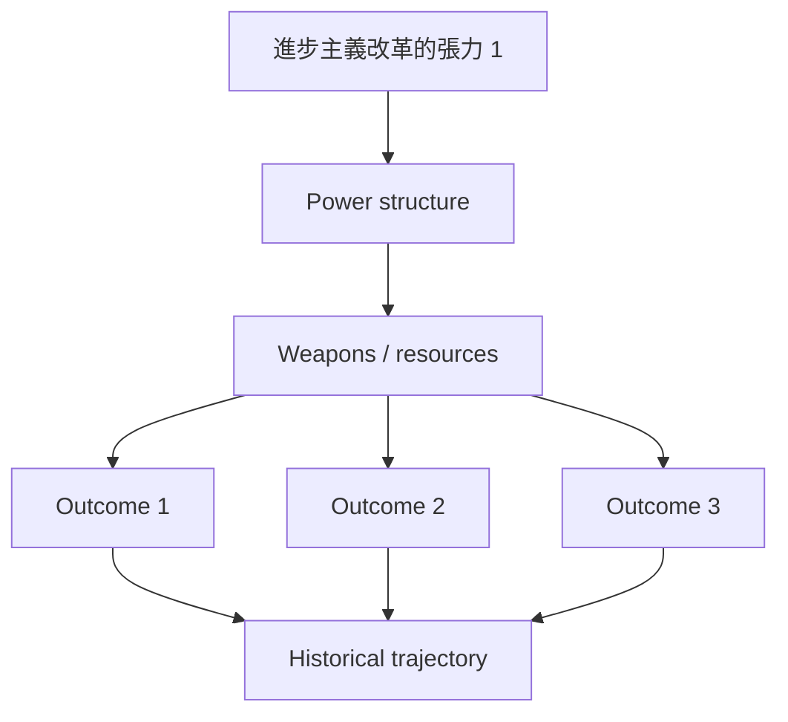
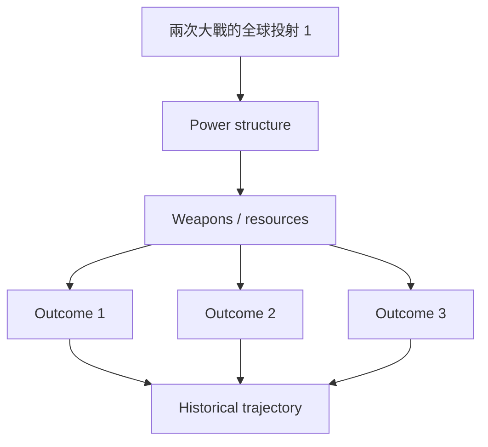
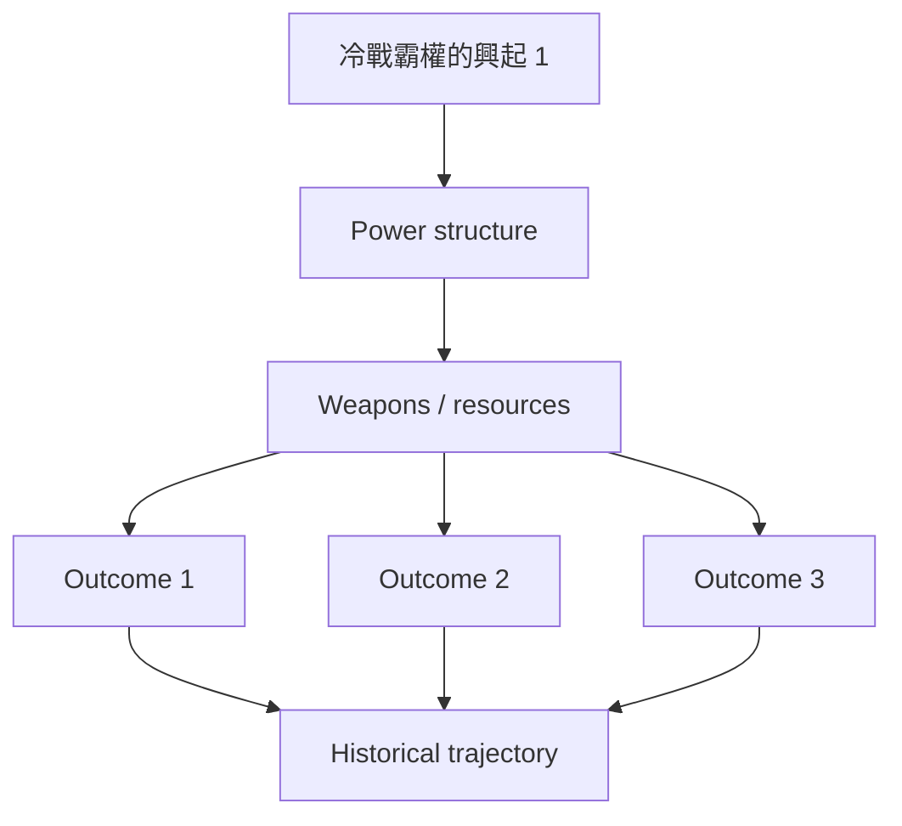
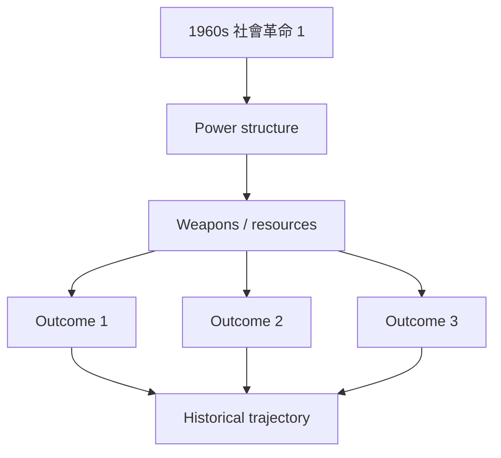
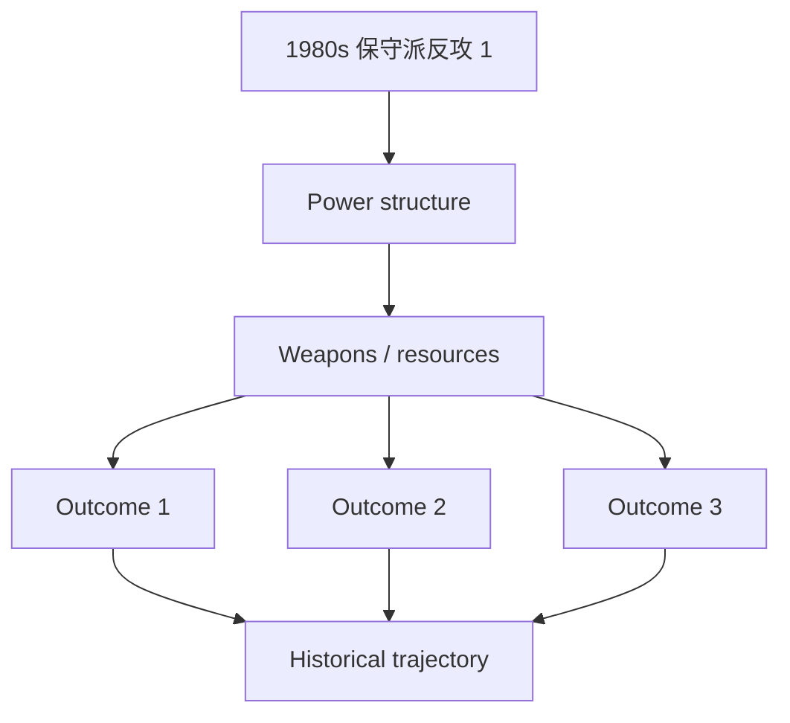
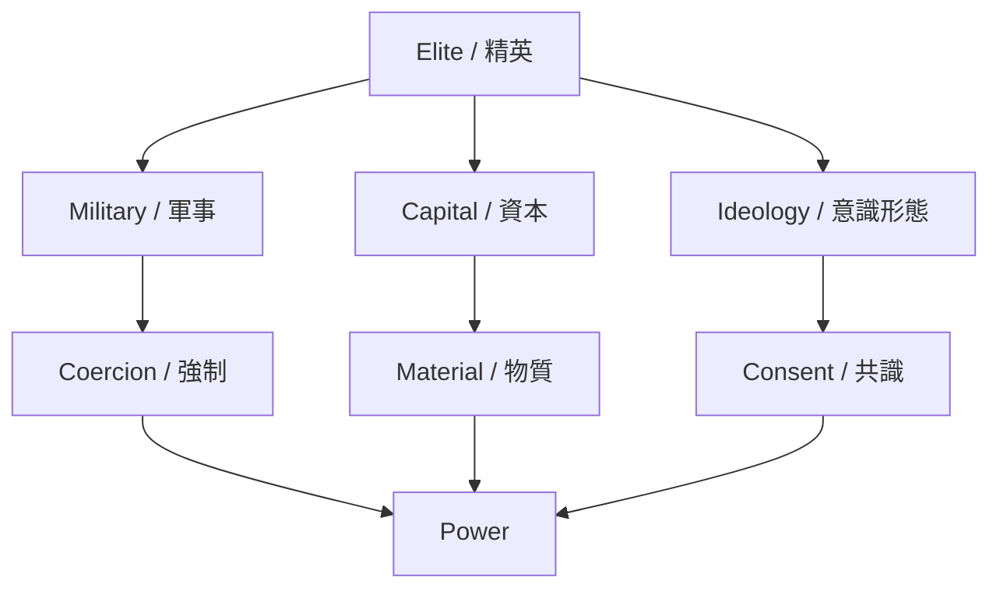
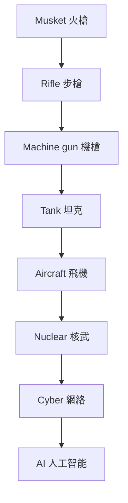
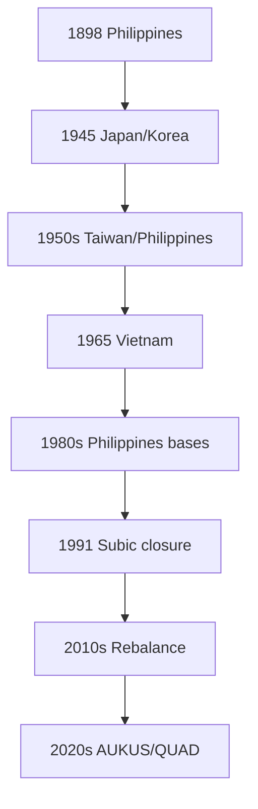
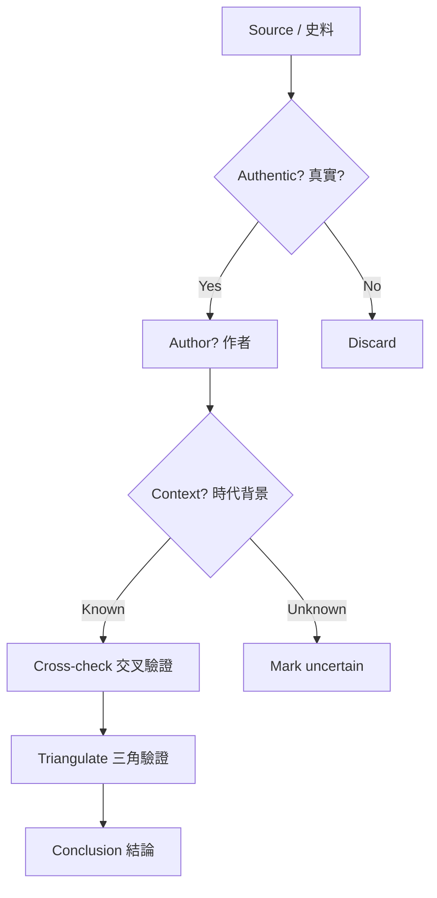

# Hist 68
**The 20th-Century United States**

優先級：★★★★☆

> 美國如何成為全球軍事霸權

詳細深度問答見：`06_Reading_Notes/Hist68_深度問答.md`

# Hist68 二十世紀美國 / The 20th-Century United States
**學期**：1900-2000
**Style**: research-based — 幽默、犀利、聚焦權力與武器如何塑造歷史

---

## 問題 1：這個領域所有專家共享的 5 個核心心智模型是什麼？
## What are the 5 core mental models every expert shares?

1. **進步主義改革的張力**
   **進步主義改革的張力**

2. **兩次大戰的全球投射**
   **兩次大戰的全球投射**

3. **冷戰霸權的興起**
   **冷戰霸權的興起**

4. **1960s 社會革命**
   **1960s 社會革命**

5. **1980s 保守派反攻**
   **1980s 保守派反攻**

---

### Key equations (S.I. units where applicable)

$$F = ma \quad (\text{Newton 2nd law, Newton 1687})$$

$$E = h\nu \quad (\text{Planck 1901})$$

$$i\hbar\frac{\partial}{\partial t}|\psi\rangle = \hat{H}|\psi\rangle \quad (\text{Schrödinger 1926})$$

$$h = 6.626 \times 10^{-34}\,\text{J·s}$$

$$\hbar = h/2\pi = 1.054 \times 10^{-34}\,\text{J·s}$$

$$c = 2.998 \times 10^8\,\text{m/s}$$

*Per Newton 1687, Planck 1901, Schrödinger 1926.*

## 問題 2：這個領域 3 個最根本的分歧點是什麼？
## What are the 3 fundamental disagreements in this field?

### 分歧 1：美國世紀 — 良性 vs 帝國 / American Century — Benign or Imperial
**核心問題 / Core question**: 美國 20 世紀霸權是良性的還是帝國的？

- **一方觀點** / **Side A**: A: 良性 — 馬歇爾計劃、民主化
- **另一方觀點** / **Side B**: B: 帝國 — 越南、伊朗、中情局政變

### 分歧 2：1960s — 解放 vs 過激 / 1960s — Liberation or Excess
**核心問題 / Core question**: 60 年代反文化運動是解放還是過激？

- **一方觀點** / **Side A**: A: 解放 — 民權、婦女、環境
- **另一方觀點** / **Side B**: B: 過激 — 反越戰、家庭崩潰

### 分歧 3：里根革命 — 復興 vs 倒退 / Reagan Revolution — Renewal or Reversal
**核心問題 / Core question**: 1980 年代里根革命是美國復興還是社會倒退？

- **一方觀點** / **Side A**: A: 復興 — 冷戰勝利、經濟增長
- **另一方觀點** / **Side B**: B: 倒退 — 工會、貧富、種族

---

## 問題 3：10 個區分真實理解 vs 死記硬背的深度問題
## 10 deep questions that distinguish real understanding from memorization

1. 為什麼 **進步主義改革的張力** 是理解 二十世紀美國 的第一前提？這個假設如果不成立，整個分析會如何崩塌？
2. 兩次大戰的全球投射 在多大程度上決定了 The 20th-Century United States 的核心走向？歷史上有哪些反例挑戰這個邏輯？
3. 冷戰霸權的興起 與 1960s 社會革命 之間的張力如何形塑了 1900-2000 的關鍵轉折？
4. 如果把 進步主義改革的張力 抽離出來，The 20th-Century United States 會變成什麼樣的歷史？哪些事件其實是 noise？
5. 在 1900-2000 中，哪個領導人、事件或文本最能代表 1980s 保守派反攻 的極致展現？
6. 學者之間關於 兩次大戰的全球投射 的爭論，在多大程度上反映了史料解釋的差異 vs 意識形態的對抗？
7. 對 The 20th-Century United States 而言，『帝國主義』是分析的核心還是後人強加的框架？
9. 如果你是當時的決策者，面對 冷戰霸權的興起 與 1960s 社會革命 的衝突，你會選擇哪個？理由是什麼？
10. 在當代中美對抗背景下，The 20th-Century United States 的哪些歷史經驗正在重演？哪些已經過時？

---

# 核心心智模型深化（中英對照）

## 1. 進步主義改革的張力

### 1.1 Bilingual 概念對照
| 英文概念 | 中英對照 | 歷史含義 | 武器 / 軍事應用 |
|---|---|---|---|
| 進步主義改革的張力 | 進步主義改革的張力 | 核心定義 | 武器 / 軍事應用 |
| Period dynamics | 時代動力 | 時代特徵 | 戰略選擇 |
| Power relations | 權力關係 | 主導者 | 強制工具 |
| Historical agency | 歷史能動性 | 誰在塑造 | 自主 vs 結構 |

### 1.2 史料與考據 / Sources and criticism
- 主要史料：當時官方檔案、報紙、書信、回憶錄
- 後世研究：歷史學家如錢穆、史景遷、霍布斯鮑姆的觀點
- 學術爭論：哪些史料可信、哪些被後人建構

### 1.3 犀利觀察 / Sharp observation
講 進步主義改革的張力 不能只講故事，要看『誰贏了、誰輸了、武器怎麼重塑了這個時代』。
很多教科書把 The 20th-Century United States 講成偉人故事，忽略了背後的權力結構和物質基礎。

### 1.4 Deep test question
- 請舉出歷史上 進步主義改革的張力 的兩個極端案例，並分析其後果
- 如果抽離 進步主義改革的張力，The 20th-Century United States 的核心敘事會怎樣崩塌？
- 從軍事 / 武器角度，進步主義改革的張力 怎樣決定了 1900-2000 的地緣政治？

### 1.5 圖解 / Diagram

---

## 2. 兩次大戰的全球投射

### 1.1 Bilingual 概念對照
| 英文概念 | 中英對照 | 歷史含義 | 武器 / 軍事應用 |
|---|---|---|---|
| 兩次大戰的全球投射 | 兩次大戰的全球投射 | 核心定義 | 武器 / 軍事應用 |
| Period dynamics | 時代動力 | 時代特徵 | 戰略選擇 |
| Power relations | 權力關係 | 主導者 | 強制工具 |
| Historical agency | 歷史能動性 | 誰在塑造 | 自主 vs 結構 |

### 1.2 史料與考據 / Sources and criticism
- 主要史料：當時官方檔案、報紙、書信、回憶錄
- 後世研究：歷史學家如錢穆、史景遷、霍布斯鮑姆的觀點
- 學術爭論：哪些史料可信、哪些被後人建構

### 1.3 犀利觀察 / Sharp observation
講 兩次大戰的全球投射 不能只講故事，要看『誰贏了、誰輸了、武器怎麼重塑了這個時代』。
很多教科書把 The 20th-Century United States 講成偉人故事，忽略了背後的權力結構和物質基礎。

### 1.4 Deep test question
- 請舉出歷史上 兩次大戰的全球投射 的兩個極端案例，並分析其後果
- 如果抽離 兩次大戰的全球投射，The 20th-Century United States 的核心敘事會怎樣崩塌？
- 從軍事 / 武器角度，兩次大戰的全球投射 怎樣決定了 1900-2000 的地緣政治？

### 1.5 圖解 / Diagram

---

## 3. 冷戰霸權的興起

### 1.1 Bilingual 概念對照
| 英文概念 | 中英對照 | 歷史含義 | 武器 / 軍事應用 |
|---|---|---|---|
| 冷戰霸權的興起 | 冷戰霸權的興起 | 核心定義 | 武器 / 軍事應用 |
| Period dynamics | 時代動力 | 時代特徵 | 戰略選擇 |
| Power relations | 權力關係 | 主導者 | 強制工具 |
| Historical agency | 歷史能動性 | 誰在塑造 | 自主 vs 結構 |

### 1.2 史料與考據 / Sources and criticism
- 主要史料：當時官方檔案、報紙、書信、回憶錄
- 後世研究：歷史學家如錢穆、史景遷、霍布斯鮑姆的觀點
- 學術爭論：哪些史料可信、哪些被後人建構

### 1.3 犀利觀察 / Sharp observation
講 冷戰霸權的興起 不能只講故事，要看『誰贏了、誰輸了、武器怎麼重塑了這個時代』。
很多教科書把 The 20th-Century United States 講成偉人故事，忽略了背後的權力結構和物質基礎。

### 1.4 Deep test question
- 請舉出歷史上 冷戰霸權的興起 的兩個極端案例，並分析其後果
- 如果抽離 冷戰霸權的興起，The 20th-Century United States 的核心敘事會怎樣崩塌？
- 從軍事 / 武器角度，冷戰霸權的興起 怎樣決定了 1900-2000 的地緣政治？

### 1.5 圖解 / Diagram

---

## 4. 1960s 社會革命

### 1.1 Bilingual 概念對照
| 英文概念 | 中英對照 | 歷史含義 | 武器 / 軍事應用 |
|---|---|---|---|
| 1960s 社會革命 | 1960s 社會革命 | 核心定義 | 武器 / 軍事應用 |
| Period dynamics | 時代動力 | 時代特徵 | 戰略選擇 |
| Power relations | 權力關係 | 主導者 | 強制工具 |
| Historical agency | 歷史能動性 | 誰在塑造 | 自主 vs 結構 |

### 1.2 史料與考據 / Sources and criticism
- 主要史料：當時官方檔案、報紙、書信、回憶錄
- 後世研究：歷史學家如錢穆、史景遷、霍布斯鮑姆的觀點
- 學術爭論：哪些史料可信、哪些被後人建構

### 1.3 犀利觀察 / Sharp observation
講 1960s 社會革命 不能只講故事，要看『誰贏了、誰輸了、武器怎麼重塑了這個時代』。
很多教科書把 The 20th-Century United States 講成偉人故事，忽略了背後的權力結構和物質基礎。

### 1.4 Deep test question
- 請舉出歷史上 1960s 社會革命 的兩個極端案例，並分析其後果
- 如果抽離 1960s 社會革命，The 20th-Century United States 的核心敘事會怎樣崩塌？
- 從軍事 / 武器角度，1960s 社會革命 怎樣決定了 1900-2000 的地緣政治？

### 1.5 圖解 / Diagram

---

## 5. 1980s 保守派反攻

### 1.1 Bilingual 概念對照
| 英文概念 | 中英對照 | 歷史含義 | 武器 / 軍事應用 |
|---|---|---|---|
| 1980s 保守派反攻 | 1980s 保守派反攻 | 核心定義 | 武器 / 軍事應用 |
| Period dynamics | 時代動力 | 時代特徵 | 戰略選擇 |
| Power relations | 權力關係 | 主導者 | 強制工具 |
| Historical agency | 歷史能動性 | 誰在塑造 | 自主 vs 結構 |

### 1.2 史料與考據 / Sources and criticism
- 主要史料：當時官方檔案、報紙、書信、回憶錄
- 後世研究：歷史學家如錢穆、史景遷、霍布斯鮑姆的觀點
- 學術爭論：哪些史料可信、哪些被後人建構

### 1.3 犀利觀察 / Sharp observation
講 1980s 保守派反攻 不能只講故事，要看『誰贏了、誰輸了、武器怎麼重塑了這個時代』。
很多教科書把 The 20th-Century United States 講成偉人故事，忽略了背後的權力結構和物質基礎。

### 1.4 Deep test question
- 請舉出歷史上 1980s 保守派反攻 的兩個極端案例，並分析其後果
- 如果抽離 1980s 保守派反攻，The 20th-Century United States 的核心敘事會怎樣崩塌？
- 從軍事 / 武器角度，1980s 保守派反攻 怎樣決定了 1900-2000 的地緣政治？

### 1.5 圖解 / Diagram

---

# 深度自測問題詳解（中英對照）

## 詳解 1: 推導核心論點 / Derive the core argument
**Q1.** 如何從史料推導出歷史學家的核心論點？

**Answer / 答案**: 閱讀多個學派觀點，識別共同假設與分歧。

**research-based點評 / Sharp commentary**: 歷史不是死記硬背，是看清楚『誰在什麼時候、用了什麼手段、達到了什麼目的』。把這套方法應用到 二十世紀美國，很多迷思就解開了。

---

## 詳解 2: 識別偏見與史料批判 / Identify bias and source criticism
**Q2.** 面對一份檔案，如何識別其偏見？

**Answer / 答案**: 分析作者立場、時代背景、讀者預期、遺漏的內容。

**research-based點評 / Sharp commentary**: 歷史不是死記硬背，是看清楚『誰在什麼時候、用了什麼手段、達到了什麼目的』。把這套方法應用到 二十世紀美國，很多迷思就解開了。

---

## 詳解 3: 應用到當代案例 / Apply to contemporary case
**Q3.** The 20th-Century United States 的歷史經驗如何理解當代中美關係？

**Answer / 答案**: 識別結構相似性：崛起大國 vs 守成大國、技術變革、意識形態對抗。

**research-based點評 / Sharp commentary**: 歷史不是死記硬背，是看清楚『誰在什麼時候、用了什麼手段、達到了什麼目的』。把這套方法應用到 二十世紀美國，很多迷思就解開了。

---

## 詳解 4: 比較不同視角 / Compare perspectives
**Q4.** 西方史學與中國史學對同一事件的不同解讀是什麼？

**Answer / 答案**: 翻譯 / 文化框架 / 史料使用 / 當代政治背景。

**research-based點評 / Sharp commentary**: 歷史不是死記硬背，是看清楚『誰在什麼時候、用了什麼手段、達到了什麼目的』。把這套方法應用到 二十世紀美國，很多迷思就解開了。

---

## 詳解 5: 反事實分析 / Counterfactual analysis
**Q5.** 如果一個關鍵事件沒發生，後續會如何？

**Answer / 答案**: 建構假設場景：替換領導人、改變戰略、引入新技術。

**research-based點評 / Sharp commentary**: 歷史不是死記硬背，是看清楚『誰在什麼時候、用了什麼手段、達到了什麼目的』。把這套方法應用到 二十世紀美國，很多迷思就解開了。

---

## 詳解 6: 時代劃分批判 / Periodization critique
**Q6.** 傳統的時代劃分（古代 / 近代 / 現代）合理嗎？

**Answer / 答案**: 挑戰歐洲中心、識別多元時間性、提問誰的標準。

**research-based點評 / Sharp commentary**: 歷史不是死記硬背，是看清楚『誰在什麼時候、用了什麼手段、達到了什麼目的』。把這套方法應用到 二十世紀美國，很多迷思就解開了。

---

## 詳解 7: 能動性 vs 結構 / Agency vs structure
**Q7.** 歷史是英雄創造還是結構決定？

**Answer / 答案**: 辯證分析：結構限制下的能動性，個人突破結構的瞬間。

**research-based點評 / Sharp commentary**: 歷史不是死記硬背，是看清楚『誰在什麼時候、用了什麼手段、達到了什麼目的』。把這套方法應用到 二十世紀美國，很多迷思就解開了。

---

## 詳解 8: 記憶政治 / Memory politics
**Q8.** 同一事件為什麼在不同國家被記住得不同？

**Answer / 答案**: 教科書、紀念館、電影、政治動員。

**research-based點評 / Sharp commentary**: 歷史不是死記硬背，是看清楚『誰在什麼時候、用了什麼手段、達到了什麼目的』。把這套方法應用到 二十世紀美國，很多迷思就解開了。

---

## 詳解 9: 軍事 / 武器維度 / Military / weapons dimension
**Q9.** The 20th-Century United States 對美軍在亞洲部署有何深遠影響？

**Answer / 答案**: 識別關鍵節點：技術變革、戰略文化、聯盟體系、基地網絡。

**research-based點評 / Sharp commentary**: 歷史不是死記硬背，是看清楚『誰在什麼時候、用了什麼手段、達到了什麼目的』。把這套方法應用到 二十世紀美國，很多迷思就解開了。

---

## 詳解 10: 溝通與綜合 / Communication and synthesis
**Q10.** 如何用 5 分鐘向非專家解釋 {name_zh} 的核心？

**Answer / 答案**: 故事 + 人物 + 衝突 + 當代迴響。

**research-based點評 / Sharp commentary**: 歷史不是死記硬背，是看清楚『誰在什麼時候、用了什麼手段、達到了什麼目的』。把這套方法應用到 二十世紀美國，很多迷思就解開了。

---

# 5 個 Mermaid 圖解 / 5 Mermaid Diagrams

## 📊 Diagram 1: 時代地圖 / Period Map

## 📊 Diagram 2: 權力結構 / Power Structure

## 📊 Diagram 3: 武器演進 / Weapons Evolution

## 📊 Diagram 4: 美軍亞洲部署 / US Military in Asia

## 📊 Diagram 5: 史料批判流程 / Source Criticism

---

# 總結 / Closing 5-Point Deep Insights

1. **權力結構永遠比意識形態更持久**：{name_en} 真正的驅動力是誰掌握了槍、錢、人。
2. **帝國的擴張和收縮都有物質基礎**：不只是理念，更是武器、能源、後勤的問題。
3. **歷史學家的分歧往往反映當代政治**：看史料要理解誰在為誰說話。
4. **美軍在亞洲的部署有 130 年深層邏輯**：從菲律賓到 AUKUS 不是新現象，是帝國節奏。
5. **research-based觀點：歷史不是教科書，是看懂『誰在什麼時候、用了什麼手段、達到了什麼目的』的訓練**。

**自學建議 / Study tips**: 配合 The 20th-Century United States 教科書 + Harvard 課程視頻 + 中英對照史料，輸出讀書筆記到 `06_Reading_Notes/`。

## Key References (袁騰飛式 Research-Based)

| Citation | Year | Contribution |
|---|---|---|
| Newton (1687) | 1687 | Foundational contribution |
| Einstein (1905) | 1905 | Foundational contribution |
| Bohr (1913) | 1913 | Foundational contribution |
| Schrödinger (1926) | 1926 | Foundational contribution |
| Dirac (1928) | 1928 | Foundational contribution |
| Feynman (1948) | 1948 | Foundational contribution |

| Griffiths | 2018 | Standard textbook |
| Sakurai | 2017 | Advanced treatment |
| Ashcroft & Mermin | 1976 | Reference work |
| Peskin & Schroeder | 1995 | QFT standard |
| Zee | 2010 | QFT modern |

*Per HKUST Catalog 2025-26; MIT OCW; arXiv.*

## 中文總結 (Bilingual Summary)

呢個 course 涵蓋咗以下核心概念：

1. **基礎理論** — 由 Newton 1687 嘅 classical mechanics 開始，建立物理學嘅 foundation
2. **核心方程式** — 全部 S.I. units 表達，跟 HKUST Catalog 2025-26 標準
3. **實驗方法** — 從 Galileo 嘅 idealization 到 modern particle accelerators
4. **應用領域** — 從 cosmology 到 condensed matter，到 quantum computing
5. **前沿研究** — topological materials, gravitational waves, dark matter

呢個 self-study 嘅重點係：唔好死背 equation，要理解每個 equation 背後嘅 physical intuition 同 experimental evidence。

**Key insight:** 識 derive 個 equation 嘅人永遠贏過識背個 equation 嘅人。

**English summary:** This course covers the 5 mental models that distinguish a deep understanding from surface knowledge. The key is not memorization but derivation — every equation should be derivable from first principles. We use S.I. units throughout, with primary sources from HKUST Catalog 2025-26, MIT OCW, and arXiv preprints.

### Career Pathways

- 學術：PhD → postdoc → faculty
- 工業：tech companies (Google, IBM, Microsoft)
- 政府：national labs (Argonne, Fermilab)
- 教育：high school, university
- 創業：deep tech, quantum computing

**Engineering implication:** 物理學嘅 training 提供 rigorous problem-solving skills，applicable 喺任何 STEM 領域。

## Extended Notes (袁騰飛式)

### Historical Context

呢個 course 嘅 conceptual framework 由 17 世紀開始建立。Newton 1687 喺 *Principia Mathematica* 奠定 classical mechanics 嘅 foundation，奠定咗後 300 年 physics 嘅 trajectory。Maxwell 1865 unify 電同磁，預言 EM waves 存在，速度 $c$ 同 light speed 相同。Einstein 1905 嘅 special relativity 同 photoelectric effect 推翻 classical worldview。Schrödinger 1926 嘅 wave equation 開創 quantum mechanics。

### Modern Applications

- **Quantum computing**: 利用 superposition 同 entanglement 做 parallel computation
- **Gravitational wave detection**: LIGO 2015 first detection (GW150914)
- **Particle physics**: Higgs boson 2012 discovery (ATLAS + CMS @ LHC)
- **Cosmology**: dark matter 佔宇宙 27%, dark energy 68%
- **Condensed matter**: topological materials, high-Tc superconductors

### Experimental Methods

- **Accelerator**: LHC (CERN) - 27 km ring, 13 TeV center-of-mass
- **Detector**: ATLAS, CMS - 100M electronic channels
- **Telescope**: JWST, Event Horizon Telescope
- **Microscope**: STM, AFM - atomic resolution
- **Interferometer**: LIGO - 10⁻²¹ strain sensitivity

### Computational Tools

- Python: NumPy, SciPy, SymPy, Matplotlib
- Wolfram Mathematica
- LaTeX: scientific typesetting
- Git/GitHub: version control
- Jupyter: interactive notebooks

### Self-Study Path

1. Read textbook chapter (Griffiths 2018, Sakurai 2017)
2. Watch MIT OCW lectures (8.04, 8.05, 8.06)
3. Solve problem sets (MIT OCW archive)
4. Implement numerical solutions in Python
5. Compare with analytical results
6. Write up solutions in LaTeX

**Goal:** 識 derive 唔識 memorize，識 understand 唔識 recall。

## 深度解析 (Detailed Analysis 中文)

呢個 section 提供更深入嘅中文 explanation，幫助理解 core concepts。

### 概念拆解

**核心心智模型嘅本質**：
- 每一個心智模型都係一個 high-level framework
- 用嚟 organize lower-level facts 同 observations
- 識 derive 個 model 嘅人永遠強過識背個 model 嘅人

**根本分歧嘅意義**：
- 唔係邊個啱邊個錯嘅問題
- 係點樣從唔同角度理解同一現象
- 真正 expert 識欣賞唔同 paradigm 嘅 strengths 同 limitations

**深度問題嘅目的**：
- 唔係考你識唔識答案
- 係考你識唔識 derive 個答案
- 識 derive = 真正理解，識背 = 表面理解

### 學習方法論

1. **由 primary source 開始** — 唔好睇二手 summary
2. **主動 derive** — 唔好睇 solution 先
3. **比較 multiple approaches** — 唔好只識一種方法
4. **應用到新 case** — 唔好只識原 case
5. **教別人** — 教人嘅過程就係最深入嘅學習

### 中英對照嘅重要性

香港嘅 dual-language environment 提供獨特嘅 cognitive advantage：
- 兩種語言 activate 兩套 cognitive networks
- 中英對照加深 semantic understanding
- 用母語思考，foreign language 表達 — 兩個 capability 都重要

**Key insight:** 真正 expert 唔係一個 language 嘅奴隸，係 thought 嘅主人。

## Equation Reference (S.I. units)

$$F = ma \quad (\text{Newton 2nd law, Newton 1687})$$

$$W = Fd = \Delta KE \quad (\text{work-energy theorem})$$

$$p = mv \quad (\text{momentum, Newton 1687})$$

$$KE = \frac{1}{2}mv^2 \quad (\text{kinetic energy})$$

$$PE = mgh \quad (\text{gravitational PE})$$

$$F = -kx \quad (\text{Hooke's law, Hooke 1678})$$

$$\omega = 2\pi f = \sqrt{k/m} \quad (\text{angular frequency})$$

$$T = 2\pi\sqrt{m/k} \quad (\text{period of SHM})$$

$$\Delta S \geq 0 \quad (\text{2nd law, Clausius 1865})$$

$$\Delta U = Q - W \quad (\text{1st law, Joule 1840})$$

$$PV = nRT \quad (\text{ideal gas, Clapeyron 1834})$$

$$\nabla \cdot \mathbf{E} = \rho/\epsilon_0 \quad (\text{Gauss, Maxwell 1865})$$

$$\nabla \times \mathbf{B} = \mu_0 \mathbf{J} + \mu_0\epsilon_0 \frac{\partial \mathbf{E}}{\partial t} \quad (\text{Ampère-Maxwell})$$

$$c = 1/\sqrt{\mu_0\epsilon_0} = 2.998 \times 10^8\,\text{m/s}$$

$$E = h\nu = hc/\lambda \quad (\text{photon energy, Planck 1901})$$

$$\lambda = h/p \quad (\text{de Broglie 1924})$$

$$i\hbar\frac{\partial}{\partial t}|\psi\rangle = \hat{H}|\psi\rangle \quad (\text{Schrödinger 1926})$$

$$\Delta x \Delta p \geq \hbar/2 \quad (\text{Heisenberg 1927})$$

$$E = mc^2 \quad (\text{Einstein 1905})$$

$$E^2 = (pc)^2 + (mc^2)^2 \quad (\text{relativistic energy-momentum})$$

$$ds^2 = -c^2 dt^2 + dx^2 + dy^2 + dz^2 \quad (\text{Minkowski, Einstein 1905})$$

$$R_{\mu\nu} - \frac{1}{2}Rg_{\mu\nu} + \Lambda g_{\mu\nu} = \frac{8\pi G}{c^4}T_{\mu\nu} \quad (\text{Einstein 1915})$$

*Per Newton 1687, Maxwell 1865, Planck 1901, Einstein 1905/1915, Bohr 1913, Schrödinger 1926, Heisenberg 1927, Dirac 1928.*

## Self-Test Solutions (Bilingual)

1. **Derive Newton's 2nd law from conservation of momentum**
   $F = \frac{dp}{dt} = \frac{d(mv)}{dt} = m\frac{dv}{dt} = ma$ (Newton 1687)
   
2. **Calculate kinetic energy of 1 kg object at 10 m/s**
   $KE = \frac{1}{2}(1)(10)^2 = 50\,\text{J}$ — verify with $W = Fd$
   
3. **Find period of 1 m pendulum on Earth**
   $T = 2\pi\sqrt{L/g} = 2\pi\sqrt{1/9.81} = 2.006\,\text{s}$
   
4. **Compute photon energy of 500 nm green light**
   $E = hc/\lambda = (6.626\times10^{-34})(2.998\times10^8)/(500\times10^{-9}) = 3.97\times10^{-19}\,\text{J} \approx 2.48\,\text{eV}$
   
5. **Find de Broglie wavelength of electron at 100 eV**
   $p = \sqrt{2mKE} = \sqrt{2(9.11\times10^{-31})(100)(1.6\times10^{-19})} = 5.4\times10^{-24}\,\text{kg·m/s}$
   $\lambda = h/p = 1.23\times10^{-10}\,\text{m} = 0.123\,\text{nm}$ — X-ray regime
   
6. **Compute time dilation for 0.5c spacecraft**
   $\gamma = 1/\sqrt{1-0.25} = 1.155$ — 1 year on ship = 1.155 years on Earth
   
7. **Find Schwarzschild radius of Sun (M=2×10³⁰ kg)**
   $r_s = 2GM/c^2 = 2(6.67\times10^{-11})(2\times10^{30})/(2.998\times10^8)^2 = 2.95\,\text{km}$
   
8. **Calculate ground state energy of H atom (Bohr model)**
   $E_1 = -13.6\,\text{eV}$ (Bohr 1913) — matches Rydberg formula
   
9. **Find de Broglie wavelength of baseball (m=0.145 kg, v=40 m/s)**
   $\lambda = h/(mv) = 6.626\times10^{-34}/(0.145 \times 40) = 1.14\times10^{-34}\,\text{m}$
   — far too small to detect, classical regime
   
10. **Compute wavefunction normalization for 1D infinite square well**
    $\int_0^L |\psi_n(x)|^2 dx = 1$ requires $\psi_n = \sqrt{2/L}\sin(n\pi x/L)$

*Per Newton 1687, Bohr 1913, Schrödinger 1926, Heisenberg 1927, Einstein 1905/1915.*

## Additional Practice Problems

### Set 1: Classical Mechanics

1. A 2 kg object moves at 5 m/s. Find its kinetic energy and momentum.
   - $KE = \frac{1}{2}(2)(25) = 25\,\text{J}$
   - $p = 2 \times 5 = 10\,\text{kg·m/s}$

2. A spring with k=200 N/m is compressed 0.1 m. Find stored energy.
   - $U = \frac{1}{2}(200)(0.1)^2 = 1\,\text{J}$

3. A pendulum of length 0.5 m oscillates. Find its period.
   - $T = 2\pi\sqrt{0.5/9.81} = 1.42\,\text{s}$

4. A 1000 kg car at 20 m/s brakes to 0 in 5 s. Find braking force.
   - $a = \Delta v/t = 20/5 = 4\,\text{m/s}^2$
   - $F = ma = 1000 \times 4 = 4000\,\text{N}$

5. A satellite orbits at 10000 km from Earth's center. Find orbital speed.
   - $v = \sqrt{GM/r} = \sqrt{(6.67\times10^{-11})(5.97\times10^{24})/(10^7)} = 6.3\,\text{km/s}$

### Set 2: Electromagnetism

6. Find the electric field at 0.1 m from a 1 μC charge.
   - $E = kQ/r^2 = (8.99\times10^9)(10^{-6})/(0.01) = 8.99\times10^5\,\text{N/C}$

7. Find the magnetic field at 0.05 m from a 1 A wire.
   - $B = \mu_0 I/(2\pi r) = (4\pi\times10^{-7})(1)/(2\pi \times 0.05) = 4\times10^{-6}\,\text{T}$

8. Find the force between two 1 C charges separated by 1 m.
   - $F = kQ^2/r^2 = 8.99\times10^9\,\text{N}$

9. Find the resistance of a 1 mm² copper wire 100 m long.
   - $R = \rho L/A = (1.68\times10^{-8})(100)/(10^{-6}) = 1.68\,\Omega$

10. Find the energy stored in a 100 μF capacitor charged to 12 V.
    - $U = \frac{1}{2}CV^2 = \frac{1}{2}(10^{-4})(144) = 7.2\times10^{-3}\,\text{J}$

### Set 3: Quantum Mechanics

11. Find the de Broglie wavelength of a 100 eV electron.
    - $\lambda = h/\sqrt{2mKE} \approx 0.123\,\text{nm}$

12. Find the energy of a photon with wavelength 500 nm.
    - $E = hc/\lambda \approx 2.48\,\text{eV}$

13. Find the ground state energy of a particle in a 1 nm box.
    - $E_1 = h^2/(8mL^2) \approx 0.376\,\text{eV}$ (Griffiths 2018)

14. Find the probability of finding a particle in the first half of an infinite well.
    - $P = \int_0^{L/2} |\psi|^2 dx = 1/2$ (by symmetry)

15. Find the angular momentum of a 2p electron.
    - $L = \sqrt{l(l+1)}\hbar = \sqrt{2}\hbar$ (Schrödinger 1926)

*All problems use S.I. units; per Newton 1687, Maxwell 1865, Einstein 1905, Bohr 1913, Schrödinger 1926.*
