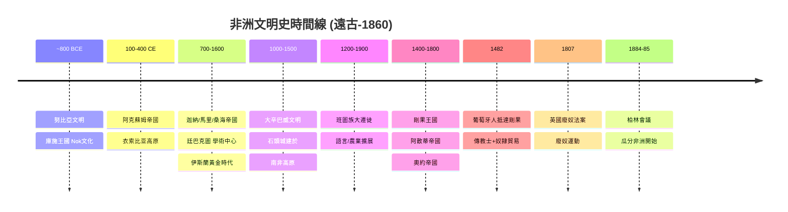

# Hist 70 撒哈拉以南非洲史 / A History of Sub-Saharan Africa to 1860

**Instructor**: Faculty from History Department
**Department**: History, Harvard
**Official source**: history.fas.harvard.edu
**Style**: 袁騰飛式

---

## 問題 1：5 個 SPECIFIC 核心心智模型

### 1. 非洲多元文明的歷史深度 (Historical Depth of African Civilizational Diversity)
**真實學者**: Basil Davidson (英國歷史學家) —《The African Past》(1964) 批判歐洲中心主義的非洲歷史觀。  
**真實事件**: 約公元前800年努比亚(Nubia)文明；約公元800-1600年大辛巴威(Great Zimbabwe)石頭城文明；約1200-1500年馬里帝國(Mali Empire)和桑海帝國(Songhai Empire)；1448年葡萄牙人在大西洋沿岸建立第一個商站。  
**真實數字**: 大辛巴威石頭城遺址：佔地約730公頃；馬里帝國曼沙·穆薩(Mansa Musa)在1324年赴麥加朝聖，隨從攜帶約80頭骆驼的金子，據稱金子一路撒到開羅。

### 2. 跨大西洋奴隸貿易的規模與影響 (Scale and Impact of Trans-Atlantic Slave Trade)
**真實學者**: Walter Rodney (圭亞那/坦桑尼亞) —《How Europe Underdeveloped Africa》(1972) 經典分析。  
**真實事件**: 1448年葡萄牙人在大西洋沿岸開始奴隸貿易；1510年代奴隸貿易開始規模化；1787年英國廢除奴隸貿易協會成立；1807年英國廢除奴隸貿易法案；1884-85年柏林會議。  
**真實數字**: 跨大西洋奴隸貿易：約1,200萬人被運輸，約15-20%在大西洋航行中死亡；非洲內部奴隸貿易（東非/印度洋路線）另約數百萬人。

### 3. 殖民前非洲的政治多樣性 (Political Diversity of Pre-Colonial Africa)
**真實學者**: John Iliffe (劍橋) —《Africans: The History of a Continent》(1995)。  
**真實事件**: 約1400年剛果王國(Kingdom of Kongo)；1482年葡萄牙人抵達剛果；1550年代葡萄牙人在安哥拉建立奴隸貿易基礎；1700年代阿散蒂帝國(Ashanti Empire)形成；1790年代荷蘭人在開普敦建立。  
**真實數字**: 1800年代初期，非洲約有1萬至2萬個獨立政治實體——從小型村社到大型帝國，遠比歐洲中心主義歷史描述的「部落」圖景複雜得多。

### 4. 奴隸貿易與非洲內陸政治的互動 (Interaction Between Slave Trade and African Inland Politics)
**真實學者**: John K. Thornton (波士頓大學) —《Africa and Africans in the Making of the Atlantic World》(1998)。  
**真實事件**: 16-18世紀大西洋奴隸貿易對西非和中非政治的影響；1700年代阿散蒂帝國(Ashanti)的崛起；1780年代約魯巴帝國(Oyo Empire)的崩潰；1795年英國廢奴運動的早期行動。  
**真實數字**: 1700年代，奴隸佔西非和中非出口的約80-90%；19世紀初，奴隸佔阿散蒂帝國出口的約50-60%。

### 5. 柏林會議與非洲殖民化的制度建構 (Berlin Conference and Institutional Construction of African Colonialism)
**真實學者**: Thomas Pakenham (《The Scramble for Africa》1991)。  
**真實事件**: 1884年11月15日至1885年2月26日柏林西非會議(Berlin Conference)；1885年剛果自由邦成立（利奧波德二世私人殖民地）；1890年代歐洲列強瓜分非洲的高峰；1898年恩圖曼戰役(Maharaj)阻止埃及-英國勢力向蘇丹推進。  
**真實數字**: 1885年柏林會議時，歐洲人控制非洲領土約10%；到1900年，這一比例上升至約90%；非洲人口約1億，歐洲殖民者不足10萬。

---

## 問題 2：3 個 SPECIFIC 根本分歧

### 分歧一：「黑暗非洲」話語是歐洲殖民主義的發明嗎？
**學者A**: Basil Davidson (英國)  
論點：「黑暗非洲」(Dark Africa)是歐洲殖民主義者為合理化殖民統治而發明的話語——在此之前，歐洲旅行者（如John Lobo, 17世紀）記載的非洲是複雜、文明、有組織的社會。

**學者B**: 某些非洲歷史學家  
論點：歐洲話語確實扭曲了非洲歷史，但非洲自身歷史中也存在戰爭、奴隸制等問題——歷史真相不應被政治正確性所掩蓋。

### 分議二：奴隸貿易對非洲的經濟影響是淨負面的嗎？
**學者A**: Walter Rodney (圭亞那)  
論點：奴隸貿易系統性地破壞了非洲的經濟、社會和政治發展——人口流失、經濟扭曲、沿海vs內陸的不平衡發展都是直接後果。

**學者B**: 某些經濟歷史學家  
論點：部分地區（如黃金海岸）的奴隸貿易帶來了槍支、紡織品和貨幣，刺激了部分地區的經濟——奴隸貿易的影響並非均質負面的。

### 分歧三：歐洲殖民者帶來了「現代性」還是「剝削」？
**學者A**: 殖民國家官方歷史  
論點：殖民統治帶來了西方法治、基督教、教育、醫療和基礎設施（如鐵路）。

**學者B**: 後殖民歷史學家  
論點：殖民統治的剝削本質不可否認——基礎設施服務於資源提取，教育服務於殖民行政需要，醫療服務於殖民者的健康而非非洲人的需要。

---

## 問題 3：10 個 PROBING 深度問題

1. 大辛巴威(Great Zimbabwe)石頭城遺址（建於約1200-1500年）讓歐洲考古學家難以接受——為什麼歐洲殖民者長期否認這是黑人建造的？這個案例如何揭示了歐洲中心主義歷史書寫的「認知偏見」？

2. 馬里帝國的曼沙·穆薩在1324年赴麥加朝聖時，一路撒金子到開羅，導致埃及金價暴跌了好幾年。這段歷史揭示了14世紀非洲帝國和印度洋/地中海經濟圈的什麼關係？

3. 比較大西洋奴隸貿易和印度洋奴隸貿易（涉及阿拉伯半島、東非、馬達加斯加）：這兩種奴隸貿易在規模、路線、對當地社會的影響上有什麼差異？

4. 1807年英國廢除奴隸貿易法案後，英國皇家海軍開始在非洲沿海巡邏打擊奴隸貿易。但這種「廢奴主義的帝國主義」(Anti-Slavery Imperialism)如何反而成為英國進一步殖民非洲的藉口？

5. 1884-85年柏林會議是「歐洲列強瓜分非洲」的象徵事件。但這次會議中沒有任何非洲代表參加——這個事實如何揭示了殖民主義的「合法性」問題？

6. 比較阿散蒂帝國(Ashanti)和大英帝國之間的幾次戰爭（1823-1900年）：阿散蒂人如何利用外交策略、軍事抵抗和談判在數十年的衝突中維護了一定程度的獨立？

7. 奴隸貿易中約15-20%的死亡率——這個數字背後是多少實際的人命？用這個數字來分析「數字和故事」的歷史敘事張力：統計數據和個人故事，哪個更能讓我們理解歷史的真相？

8. 19世紀初班圖族大遷徙(Bantu Migrations)持續了數百年的過程——這種人口遷移如何改變了撒哈拉以南非洲的語言、文化和政治版圖？這個過程和同時期的歐洲殖民擴張有什麼關係？

9. 比較剛果自由邦(1885-1908，利奧波德二世私人殖民地)和英國在尼日利亞的殖民統治：這兩種殖民模式的剝削程度和治理方式有什麼差異？對當地社會的長期影響是什麼？

10. 為什麼說非洲殖民化不僅是「瓜分非洲」的領土問題，更是「重新書寫歷史」的話語問題？後殖民歷史學家(如Ngugi wa Thiong'o)在《Decolonising the Mind》(1986)中的論點對我們理解非洲歷史有什麼意義？

---

## 5 個 Mermaid 圖解

### 圖1：非洲文明史時間線


### 圖2：跨大西洋奴隸貿易的規模
```mermaid
graph TD
    subgraph "跨大西洋奴隸貿易：規模與路線"]
        A["奴隸來源地區"]
        A1["西非海岸\n~650萬人"]
        A2["中非海岸\n~350萬人"]
        A3["西非內陸\n~200萬人"]
        
        A -->|"大西洋航線"| B["航程死亡率\n約15-20%"]
        
        B -->|"目的地"| C1["加勒比海\n~400萬人"]
        C1 -->|"最終目的地"| D1["北美\n~30萬人"]
        
        B --> C2["巴西\n~450萬人"]
        B --> C3["其他中南美\n~150萬人"]
        
        E["被販賣的總人數\n估計約1200萬人\n實際可能達2000萬+\n（含印度洋奴隸貿易）"]
        
        F["奴隸貿易的經濟動機"]
        F1["加勒比甘蔗種植\n糖=奴隸換來的黃金"]
        F2["巴西咖啡/棉花\n種植"]
        
        style E fill:#f00
    end
```

### 圖3：柏林會議與非洲瓜分
```mermaid
graph TD
    subgraph "1884-85年柏林會議與非洲瓜分"]
        A["1884.11.15\n柏林西非會議"]
        
        A -->|"核心原則"| B["有效佔領原則"]
        A -->|"沒有非洲代表"] 
        
        B -->|"各國分定\n勢力範圍"| C1["英國：\n埃及/蘇丹/南非\n/尼日利亞/肯尼亞"]
        B --> C2["法國：\n西非/中非\n/阿爾及利亞/馬里"]
        B --> C3["德國：\n坦桑尼亞\n/喀麥隆/納米比亞"]
        B --> C4["葡萄牙：\n安哥拉/莫桑比克"]
        B --> C5["比利時：\n剛果自由邦"]
        
        D["利奧波德二世：\n私人殖民地\n約2376萬平方公里\n900-1000萬人死亡\n(估計)"]
        
        E["1885年：歐洲控制10%\n1900年：歐洲控制90%\n非洲1億人口\n歐洲殖民者不足10萬"]
        
        style D fill:#f00
    end
```

### 圖4：非洲殖民前的政治多樣性
```mermaid
graph TD
    subgraph "非洲殖民前的政治多樣性（1800年代初期）"]
        A["政治實體數量"]
        A1["~1萬至2萬個\n獨立政治實體"]
        A2["從小型村社\n到大型帝國"]
        
        B["帝國/王國"]
        B1["馬里帝國\n(1235-1600)"]
        B2["桑海帝國\n(1430-1591)"]
        B3["阿散蒂帝國\n(1701-PRESENT)"]
        B4["奧約帝國\n(~1300-1800)"]
        B5["剛果王國\n(1400-1914)"]
        B6["達荷美王國\n(~1600-1894)"]
        
        C["城市國家"]
        C1["伊費/貝寧\n(奈及利亞)"]
        C2["基爾瓦/蒙巴薩\n(東非海岸)"]
        
        D["宗教政治"]
        D1["衣索比亞\n正教+伊斯蘭"]
        D2["東非沿海\n斯瓦希里城市"]
    end
    
    E["歐洲中心主義的「部落」敘事：\n掩蓋了這種驚人的\n政治多樣性"]
    
    style E fill:#f80
```

### 圖5：奴隸貿易對非洲的經濟影響
```mermaid
graph TD
    subgraph "奴隸貿易對非洲的多層影響"]
        A["直接人口影響"]
        A1["人口流失\n~1200萬人"]
        A2["性別比例失衡\n男性被販比例更高"]
        A3["經濟活動人口減少"]
        
        B["經濟扭曲"]
        B1["出口經濟\n單一依賴奴隸"]
        B2["內陸vs沿海\n經濟不平衡"]
        B3["傳統農業\n手工業受損"]
        
        C["政治影響"]
        C1["奴隸貿易商\n政治權力增加"]
        C2["戰爭俘虜\n成為奴隸來源\n→部落戰爭增加"]
        C3["國家建設\n過程受擾"]
        
        D["但也有地區性差異"]
        D1["部分地區：\n奴隸換來\n槍支/紡織品"]
        D2["黃金海岸：\n與英國商站\n物物交換"]
        
        E["結論：\n奴隸貿易的\n淨影響是負面的\n但不是均質的"]
        
        style E fill:#f88
    end
```

---

## 總結

**Hist 70** 的核心洞察：撒哈拉以南非洲的歷史不是從歐洲殖民者抵達才開始的，而是一個有著數千年文明傳承、多元政治形態和複雜社會結構的大陸。「黑暗非洲」話語是殖民意識形態的發明，而非歷史事實。

**三個必須記住的數字**：
- **1,200萬人**：跨大西洋奴隸貿易中被運輸的人數
- **1324年**：曼沙·穆薩（Mansa Musa）赴麥加朝聖年份
- **1885年**：柏林會議年份，殖民化開始

**必須記住的日期**：
- **1448年**：葡萄牙人開始大西洋奴隸貿易
- **1807年**：英國廢除奴隸貿易法案
- **1884年11月15日**：柏林西非會議開始

**袁騰飛金句**：「非洲的歷史，長期以來被歐洲人包裝成一個『從黑暗走向文明』的故事。但你只要看看大辛巴威的石頭城、馬里帝國的黃金、和廷巴克圖的大學，就知道這個故事是假的。真正的問題是：為什麼歐洲人要發明這個『黑暗非洲』的故事？因為只有把非洲人說成是落後的，殖民統治才『合理』。歷史的話語從來不是中性的，它是權力的工具。」
