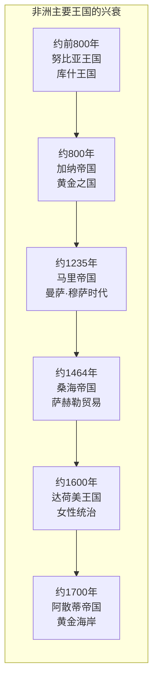
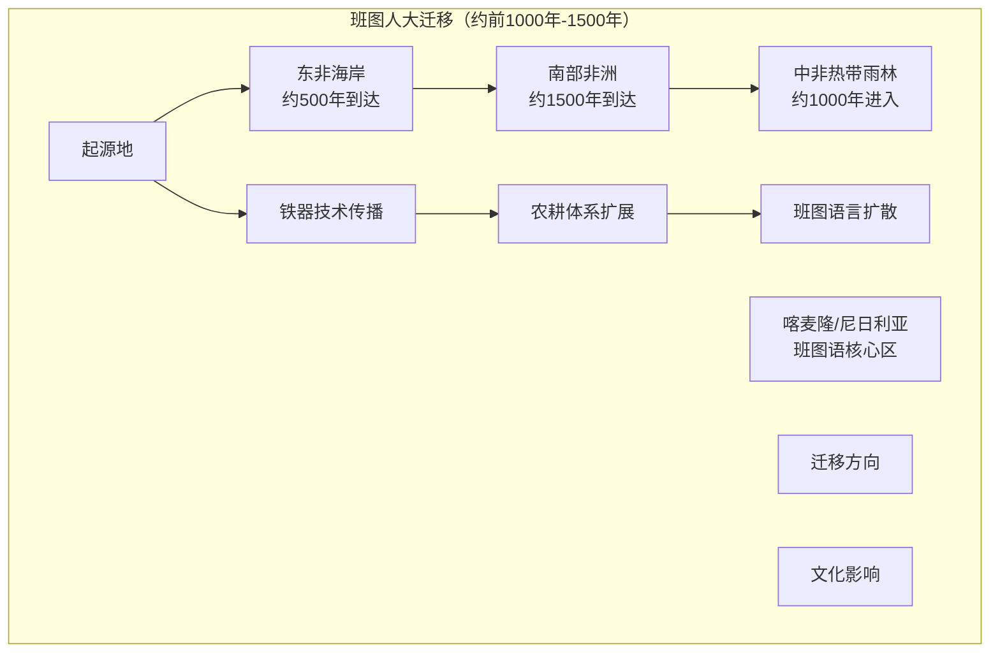
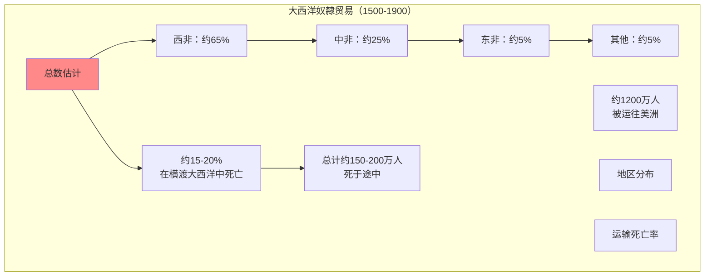
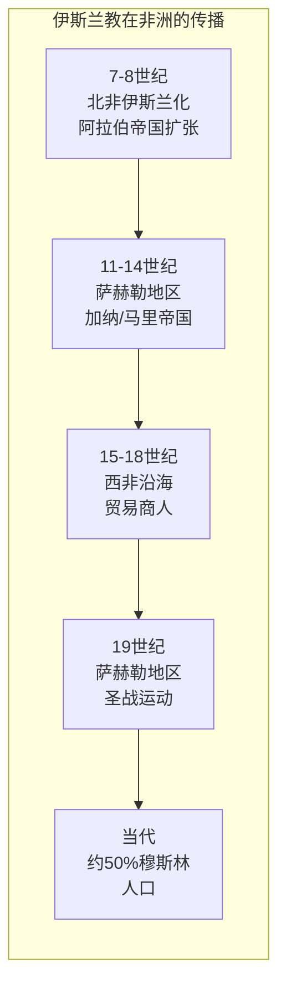
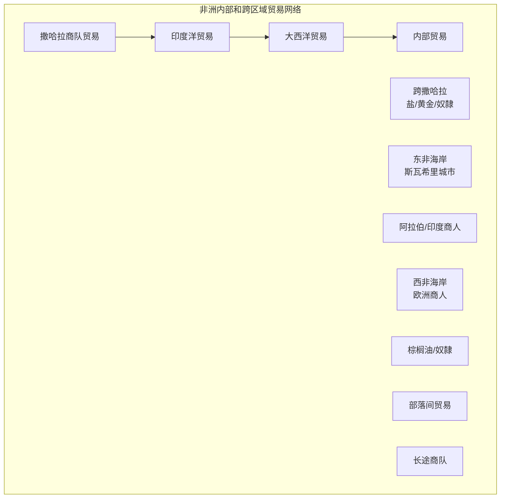

# Hist 70 撒哈拉以南非洲史 / The History of Sub-Saharan Africa to 1860

**Instructor**: Emmanuel Akyeampong
**Department**: History, Harvard
**Official source**: history.fas.harvard.edu
**Big Question**: 哪些工具和方法最適合建構1860年以前的撒哈拉以南非洲歷史？
**Style**: 袁騰飛式

---

## 問題 1：5 個 SPECIFIC 核心心智模型

### 1. 早期非洲文明與國家形成 (Early African Civilizations and State Formation)
**真實學者**: John Iliffe (劍橋大學) —《Africans》(1989) 非洲歷史概觀。  
**真實事件**: 約公元前800年努比亚王國建立；約1000年加納帝國興起；約1200年馬里帝國興起。  
**真實數字**: 在欧洲殖民者到来之前，撒哈拉以南非洲有數百個不同的政治實體。

### 2. 大西洋奴隸貿易 (Atlantic Slave Trade)
**真實學者**: Walter Rodney (喬治城大學) —《How Europe Underdeveloped Africa》(1972) 分析奴隸貿易影響。  
**真實事件**: 1444年葡萄牙人抵达西非；1652年荷兰人在好望角建立基地；1807年英国禁止奴隸贸易。  
**真實數字**: 1500-1900年间，約1200萬非洲人被贩运到大西洋彼岸。

### 3. 伊斯兰教在非洲的传播 (Spread of Islam in Africa)
**真實學者**: John O. Hunwick (維吉尼亞大學) — 分析伊斯兰教在非洲的传播。  
**真實事件**: 8-9世紀北非伊斯兰化；11世紀桑海帝國興起；19世紀聖戰運動。  
**真實數字**: 今天约有一半的撒哈拉以南非洲人是穆斯林。

### 4. 班图人大迁移 (Bantu Migrations)
**真實學者**: Christopher Ehret (加州大學) — 分析班图語言和文化的传播。  
**真實事件**: 公元前1000年班图人开始扩张；约500年班图人到达南非；约1500年班图农耕体系覆盖大部分撒哈拉以南非洲。  
**真實數字**: 今天约3億人使用班图語言。

### 5. 非洲内部的贸易网络 (Internal African Trade Networks)
**真實學者**: Patrick Manning (東北大學) —《Slavery and African Life》(1990) 分析非洲内部经济。  
**真實事件**: 13-15世紀撒哈拉商隊貿易；15-19世紀印度洋貿易網絡；18-19世紀棕榈油貿易。  
**真實數字**: 在大西洋奴隸貿易之前，非洲内部贸易已经非常活跃。

---

## 問題 2：3 個 SPECIFIC 根本分歧

### 分歧一：非洲歷史的起源
**學者A**: 传统欧洲中心观点  
論點：非洲历史始于欧洲殖民者到来。

**學者B**: 非洲中心史學如Cheikh Anta Diop  
論點：非洲有独立的文明发展脉络，古埃及是黑人文明。

### 分歧二：奴隸贸易对非洲的影响
**學者A**: Rodney等马克思主义学者  
論點：奴隸贸易彻底破坏了非洲的发展。

**學者B**: 修正主义学者  
論點：影响是复杂的，部分地区從贸易中獲益。

### 分歧三：伊斯兰教在非洲的性质
**學者A**: 宗教史学者  
論點：伊斯兰教为非洲带来了文明和文字。

**學者B**: 批评者  
論點：伊斯兰教与非洲本土宗教的融合有时导致宗教冲突。

---

## 問題 3：10 個 PROBING 深度問題

1. 在欧洲殖民者到来之前，撒哈拉以南非洲的“国家”和“政府”是什么样子？非洲本土的政治组织形式是否被传统欧洲中心历史叙事低估了？

2. 大西洋奴隸贸易如何改变了非洲内部的政治和经济格局？为什么有些非洲统治者积极参与奴隸贸易？

3. 伊斯兰教和基督教在非洲的传播如何与非洲本土宗教共存和竞争？这种宗教多元性如何影响了非洲社会的结构？

4. 比较廷巴克图的学术传统和欧洲中世纪的学术传统：为什么廷巴克图的大学（Solokiyya）在15世纪有约10,000名学生？

5. 班图人大迁移如何塑造了今天撒哈拉以南非洲的政治和文化版图？这种迁移与当代非洲的政治边界有什么关系？

6. 在欧洲殖民者到来之前，非洲的经济体系是什么样子？非洲的贸易网络（包括印度洋贸易）如何连接到全球贸易体系？

7. 比较达荷美王国（今贝宁）和阿散蒂帝国（今加纳）的女性统治者：非洲本土的政治体系中性别角色是什么样子？

8. 奴隸制度在非洲本土文化中的地位是什么？非洲的奴隸制度和大西洋奴隸贸易有什么区别？

9. 为什么欧洲殖民者能够在19世纪末期迅速殖民整个非洲？这种“瓜分非洲”是否不可避免？

10. 如果没有欧洲殖民者，非洲的发展轨迹会是什么样子？这种反事实历史思考有意义吗？

---

## 5 個 Mermaid 圖解

### 圖1：非洲主要古王国

### 圖2：班图人大迁移

### 圖3：大西洋奴隸贸易规模

### 圖4：伊斯兰教在非洲的传播

### 圖5：非洲内部贸易网络

---

## 總結

**Hist 70** 的核心洞察：撒哈拉以南非洲有丰富多样的历史，远远早于欧洲殖民者到来。在欧洲殖民之前的非洲有复杂的王国、繁荣的贸易网络和深厚的学术传统。理解这段历史是解构欧洲中心主义非洲叙事的关键。

**三個必須記住的數字**：
- **约1200万人**：大西洋奴隸贸易中被贩运的非洲人数量
- **约50%**：今天撒哈拉以南非洲穆斯林人口比例
- **约3亿人**：今天使用班图语的人数

**必須記住的日期**：
- **约前800年**：库什王国建立
- **约1444年**：葡萄牙人到达西非
- **1807年**：英国禁止大西洋奴隸贸易
- **1884-85年**：柏林会议，欧洲列强瓜分非洲

**袁騰飛金句**：「非洲历史不是从欧洲殖民者到来才开始——这个观点本身就是殖民主义的产物。在欧洲人到达之前，非洲有廷巴克图的大学、马里帝国的黄金、桑海帝国的学术传统。大西洋奴隸贸易不是非洲历史的全部，只是它最黑暗的一章。今天的非洲，正在书写自己历史的新篇章。」