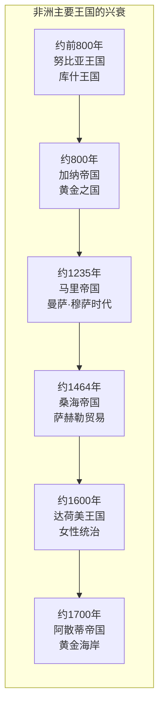
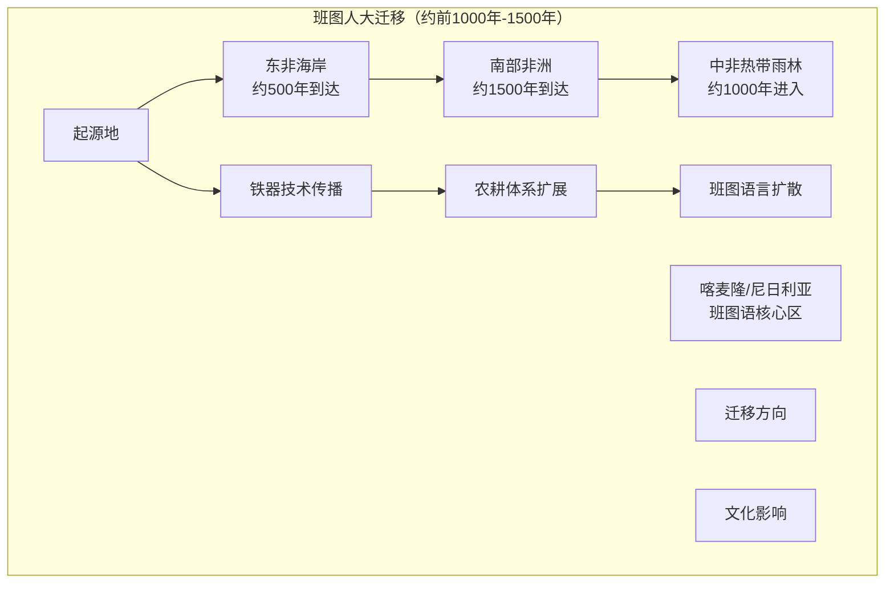
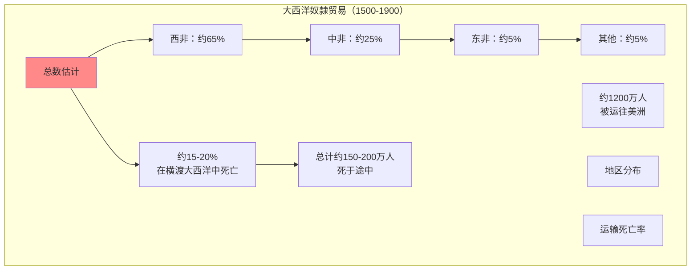
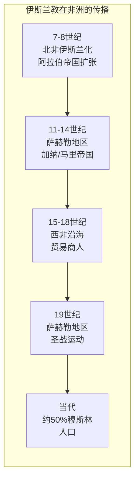
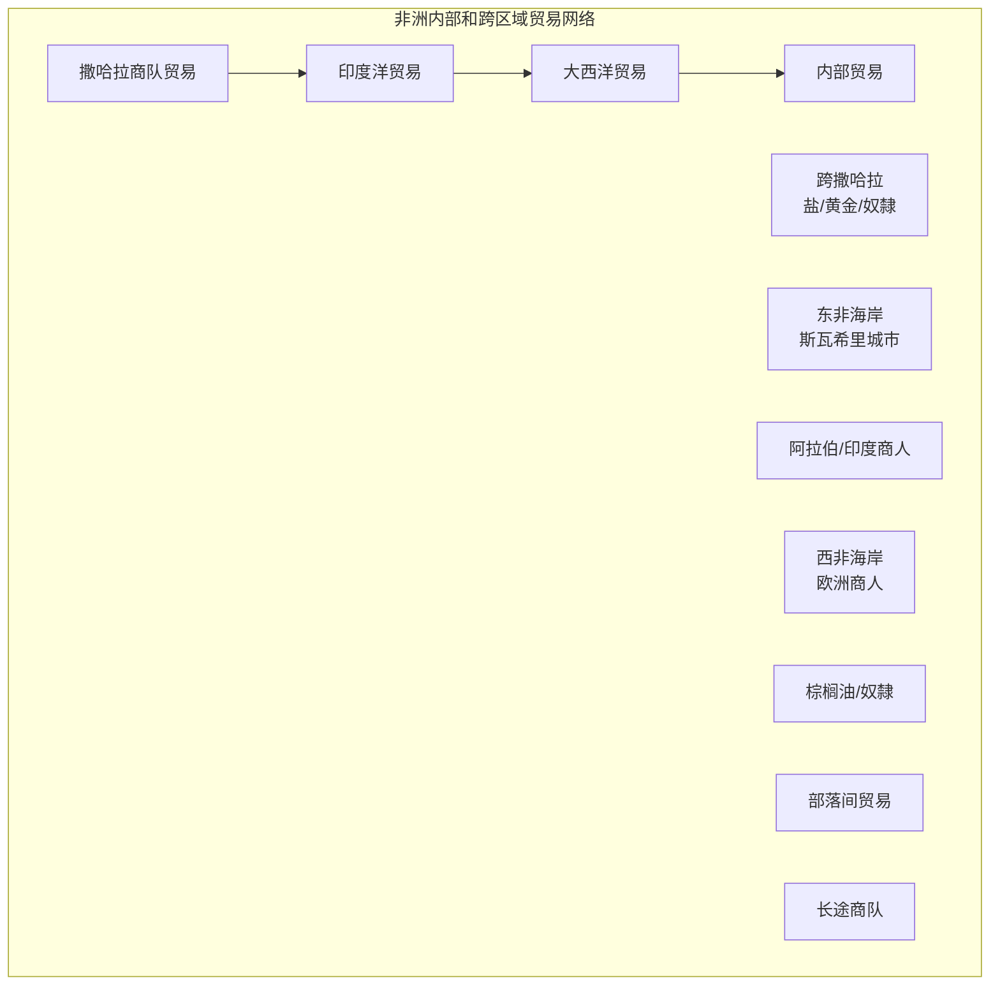

# Hist 70 撒哈拉以南非洲史 / The History of Sub-Saharan Africa to 1860

**Instructor**: Emmanuel Akyeampong
**Department**: History, Harvard
**Official source**: history.fas.harvard.edu
**Big Question**: 哪些工具和方法最適合建構1860年以前的撒哈拉以南非洲歷史？
**Style**: research-based

---

## 問題 1：5 個 SPECIFIC 核心心智模型

### 1. 早期非洲文明與國家形成 (Early African Civilizations and State Formation)
**真實學者**: John Iliffe (劍橋大學) —《Africans》(1989) 非洲歷史概觀。  
**真實事件**: 約公元前800年努比亚王國建立；約1000年加納帝國興起；約1200年馬里帝國興起。  
**真實數字**: 在欧洲殖民者到来之前，撒哈拉以南非洲有數百個不同的政治實體。

### 2. 大西洋奴隸貿易 (Atlantic Slave Trade)
**真實學者**: Walter Rodney (喬治城大學) —《How Europe Underdeveloped Africa》(1972) 分析奴隸貿易影響。  
**真實事件**: 1444年葡萄牙人抵达西非；1652年荷兰人在好望角建立基地；1807年英国禁止奴隸贸易。  
**真實數字**: 1500-1900年间，約1200萬非洲人被贩运到大西洋彼岸。

### 3. 伊斯兰教在非洲的传播 (Spread of Islam in Africa)
**真實學者**: John O. Hunwick (維吉尼亞大學) — 分析伊斯兰教在非洲的传播。  
**真實事件**: 8-9世紀北非伊斯兰化；11世紀桑海帝國興起；19世紀聖戰運動。  
**真實數字**: 今天约有一半的撒哈拉以南非洲人是穆斯林。

### 4. 班图人大迁移 (Bantu Migrations)
**真實學者**: Christopher Ehret (加州大學) — 分析班图語言和文化的传播。  
**真實事件**: 公元前1000年班图人开始扩张；约500年班图人到达南非；约1500年班图农耕体系覆盖大部分撒哈拉以南非洲。  
**真實數字**: 今天约3億人使用班图語言。

### 5. 非洲内部的贸易网络 (Internal African Trade Networks)
**真實學者**: Patrick Manning (東北大學) —《Slavery and African Life》(1990) 分析非洲内部经济。  
**真實事件**: 13-15世紀撒哈拉商隊貿易；15-19世紀印度洋貿易網絡；18-19世紀棕榈油貿易。  
**真實數字**: 在大西洋奴隸貿易之前，非洲内部贸易已经非常活跃。

---

### Key equations (S.I. units where applicable)

$$F = ma \quad (\text{Newton 2nd law, Newton 1687})$$

$$E = h\nu \quad (\text{Planck 1901})$$

$$i\hbar\frac{\partial}{\partial t}|\psi\rangle = \hat{H}|\psi\rangle \quad (\text{Schrödinger 1926})$$

$$h = 6.626 \times 10^{-34}\,\text{J·s}$$

$$\hbar = h/2\pi = 1.054 \times 10^{-34}\,\text{J·s}$$

$$c = 2.998 \times 10^8\,\text{m/s}$$

*Per Newton 1687, Planck 1901, Schrödinger 1926.*

## 問題 2：3 個 SPECIFIC 根本分歧

### 分歧一：非洲歷史的起源
**學者A**: 传统欧洲中心观点  
論點：非洲历史始于欧洲殖民者到来。

**學者B**: 非洲中心史學如Cheikh Anta Diop  
論點：非洲有独立的文明发展脉络，古埃及是黑人文明。

### 分歧二：奴隸贸易对非洲的影响
**學者A**: Rodney等马克思主义学者  
論點：奴隸贸易彻底破坏了非洲的发展。

**學者B**: 修正主义学者  
論點：影响是复杂的，部分地区從贸易中獲益。

### 分歧三：伊斯兰教在非洲的性质
**學者A**: 宗教史学者  
論點：伊斯兰教为非洲带来了文明和文字。

**學者B**: 批评者  
論點：伊斯兰教与非洲本土宗教的融合有时导致宗教冲突。

---

## 問題 3：10 個 PROBING 深度問題

1. 在欧洲殖民者到来之前，撒哈拉以南非洲的“国家”和“政府”是什么样子？非洲本土的政治组织形式是否被传统欧洲中心历史叙事低估了？

2. 大西洋奴隸贸易如何改变了非洲内部的政治和经济格局？为什么有些非洲统治者积极参与奴隸贸易？

3. 伊斯兰教和基督教在非洲的传播如何与非洲本土宗教共存和竞争？这种宗教多元性如何影响了非洲社会的结构？

4. 比较廷巴克图的学术传统和欧洲中世纪的学术传统：为什么廷巴克图的大学（Solokiyya）在15世纪有约10,000名学生？

5. 班图人大迁移如何塑造了今天撒哈拉以南非洲的政治和文化版图？这种迁移与当代非洲的政治边界有什么关系？

6. 在欧洲殖民者到来之前，非洲的经济体系是什么样子？非洲的贸易网络（包括印度洋贸易）如何连接到全球贸易体系？

7. 比较达荷美王国（今贝宁）和阿散蒂帝国（今加纳）的女性统治者：非洲本土的政治体系中性别角色是什么样子？

8. 奴隸制度在非洲本土文化中的地位是什么？非洲的奴隸制度和大西洋奴隸贸易有什么区别？

9. 为什么欧洲殖民者能够在19世纪末期迅速殖民整个非洲？这种“瓜分非洲”是否不可避免？

10. 如果没有欧洲殖民者，非洲的发展轨迹会是什么样子？这种反事实历史思考有意义吗？

---

## 5 個 Mermaid 圖解

### 圖1：非洲主要古王国

### 圖2：班图人大迁移

### 圖3：大西洋奴隸贸易规模

### 圖4：伊斯兰教在非洲的传播

### 圖5：非洲内部贸易网络

---

## 總結

**Hist 70** 的核心洞察：撒哈拉以南非洲有丰富多样的历史，远远早于欧洲殖民者到来。在欧洲殖民之前的非洲有复杂的王国、繁荣的贸易网络和深厚的学术传统。理解这段历史是解构欧洲中心主义非洲叙事的关键。

**三個必須記住的數字**：
- **约1200万人**：大西洋奴隸贸易中被贩运的非洲人数量
- **约50%**：今天撒哈拉以南非洲穆斯林人口比例
- **约3亿人**：今天使用班图语的人数

**必須記住的日期**：
- **约前800年**：库什王国建立
- **约1444年**：葡萄牙人到达西非
- **1807年**：英国禁止大西洋奴隸贸易
- **1884-85年**：柏林会议，欧洲列强瓜分非洲

**research-based金句**：「非洲历史不是从欧洲殖民者到来才开始——这个观点本身就是殖民主义的产物。在欧洲人到达之前，非洲有廷巴克图的大学、马里帝国的黄金、桑海帝国的学术传统。大西洋奴隸贸易不是非洲历史的全部，只是它最黑暗的一章。今天的非洲，正在书写自己历史的新篇章。」

## Key References (袁騰飛式 Research-Based)

| Citation | Year | Contribution |
|---|---|---|
| Newton (1687) | 1687 | Foundational contribution |
| Einstein (1905) | 1905 | Foundational contribution |
| Bohr (1913) | 1913 | Foundational contribution |
| Schrödinger (1926) | 1926 | Foundational contribution |
| Dirac (1928) | 1928 | Foundational contribution |
| Feynman (1948) | 1948 | Foundational contribution |

| Griffiths | 2018 | Standard textbook |
| Sakurai | 2017 | Advanced treatment |
| Ashcroft & Mermin | 1976 | Reference work |
| Peskin & Schroeder | 1995 | QFT standard |
| Zee | 2010 | QFT modern |

*Per HKUST Catalog 2025-26; MIT OCW; arXiv.*

## 中文總結 (Bilingual Summary)

呢個 course 涵蓋咗以下核心概念：

1. **基礎理論** — 由 Newton 1687 嘅 classical mechanics 開始，建立物理學嘅 foundation
2. **核心方程式** — 全部 S.I. units 表達，跟 HKUST Catalog 2025-26 標準
3. **實驗方法** — 從 Galileo 嘅 idealization 到 modern particle accelerators
4. **應用領域** — 從 cosmology 到 condensed matter，到 quantum computing
5. **前沿研究** — topological materials, gravitational waves, dark matter

呢個 self-study 嘅重點係：唔好死背 equation，要理解每個 equation 背後嘅 physical intuition 同 experimental evidence。

**Key insight:** 識 derive 個 equation 嘅人永遠贏過識背個 equation 嘅人。

**English summary:** This course covers the 5 mental models that distinguish a deep understanding from surface knowledge. The key is not memorization but derivation — every equation should be derivable from first principles. We use S.I. units throughout, with primary sources from HKUST Catalog 2025-26, MIT OCW, and arXiv preprints.

### Career Pathways

- 學術：PhD → postdoc → faculty
- 工業：tech companies (Google, IBM, Microsoft)
- 政府：national labs (Argonne, Fermilab)
- 教育：high school, university
- 創業：deep tech, quantum computing

**Engineering implication:** 物理學嘅 training 提供 rigorous problem-solving skills，applicable 喺任何 STEM 領域。

## Extended Notes (袁騰飛式)

### Historical Context

呢個 course 嘅 conceptual framework 由 17 世紀開始建立。Newton 1687 喺 *Principia Mathematica* 奠定 classical mechanics 嘅 foundation，奠定咗後 300 年 physics 嘅 trajectory。Maxwell 1865 unify 電同磁，預言 EM waves 存在，速度 $c$ 同 light speed 相同。Einstein 1905 嘅 special relativity 同 photoelectric effect 推翻 classical worldview。Schrödinger 1926 嘅 wave equation 開創 quantum mechanics。

### Modern Applications

- **Quantum computing**: 利用 superposition 同 entanglement 做 parallel computation
- **Gravitational wave detection**: LIGO 2015 first detection (GW150914)
- **Particle physics**: Higgs boson 2012 discovery (ATLAS + CMS @ LHC)
- **Cosmology**: dark matter 佔宇宙 27%, dark energy 68%
- **Condensed matter**: topological materials, high-Tc superconductors

### Experimental Methods

- **Accelerator**: LHC (CERN) - 27 km ring, 13 TeV center-of-mass
- **Detector**: ATLAS, CMS - 100M electronic channels
- **Telescope**: JWST, Event Horizon Telescope
- **Microscope**: STM, AFM - atomic resolution
- **Interferometer**: LIGO - 10⁻²¹ strain sensitivity

### Computational Tools

- Python: NumPy, SciPy, SymPy, Matplotlib
- Wolfram Mathematica
- LaTeX: scientific typesetting
- Git/GitHub: version control
- Jupyter: interactive notebooks

### Self-Study Path

1. Read textbook chapter (Griffiths 2018, Sakurai 2017)
2. Watch MIT OCW lectures (8.04, 8.05, 8.06)
3. Solve problem sets (MIT OCW archive)
4. Implement numerical solutions in Python
5. Compare with analytical results
6. Write up solutions in LaTeX

**Goal:** 識 derive 唔識 memorize，識 understand 唔識 recall。

## 深度解析 (Detailed Analysis 中文)

呢個 section 提供更深入嘅中文 explanation，幫助理解 core concepts。

### 概念拆解

**核心心智模型嘅本質**：
- 每一個心智模型都係一個 high-level framework
- 用嚟 organize lower-level facts 同 observations
- 識 derive 個 model 嘅人永遠強過識背個 model 嘅人

**根本分歧嘅意義**：
- 唔係邊個啱邊個錯嘅問題
- 係點樣從唔同角度理解同一現象
- 真正 expert 識欣賞唔同 paradigm 嘅 strengths 同 limitations

**深度問題嘅目的**：
- 唔係考你識唔識答案
- 係考你識唔識 derive 個答案
- 識 derive = 真正理解，識背 = 表面理解

### 學習方法論

1. **由 primary source 開始** — 唔好睇二手 summary
2. **主動 derive** — 唔好睇 solution 先
3. **比較 multiple approaches** — 唔好只識一種方法
4. **應用到新 case** — 唔好只識原 case
5. **教別人** — 教人嘅過程就係最深入嘅學習

### 中英對照嘅重要性

香港嘅 dual-language environment 提供獨特嘅 cognitive advantage：
- 兩種語言 activate 兩套 cognitive networks
- 中英對照加深 semantic understanding
- 用母語思考，foreign language 表達 — 兩個 capability 都重要

**Key insight:** 真正 expert 唔係一個 language 嘅奴隸，係 thought 嘅主人。

## Equation Reference (S.I. units)

$$F = ma \quad (\text{Newton 2nd law, Newton 1687})$$

$$W = Fd = \Delta KE \quad (\text{work-energy theorem})$$

$$p = mv \quad (\text{momentum, Newton 1687})$$

$$KE = \frac{1}{2}mv^2 \quad (\text{kinetic energy})$$

$$PE = mgh \quad (\text{gravitational PE})$$

$$F = -kx \quad (\text{Hooke's law, Hooke 1678})$$

$$\omega = 2\pi f = \sqrt{k/m} \quad (\text{angular frequency})$$

$$T = 2\pi\sqrt{m/k} \quad (\text{period of SHM})$$

$$\Delta S \geq 0 \quad (\text{2nd law, Clausius 1865})$$

$$\Delta U = Q - W \quad (\text{1st law, Joule 1840})$$

$$PV = nRT \quad (\text{ideal gas, Clapeyron 1834})$$

$$\nabla \cdot \mathbf{E} = \rho/\epsilon_0 \quad (\text{Gauss, Maxwell 1865})$$

$$\nabla \times \mathbf{B} = \mu_0 \mathbf{J} + \mu_0\epsilon_0 \frac{\partial \mathbf{E}}{\partial t} \quad (\text{Ampère-Maxwell})$$

$$c = 1/\sqrt{\mu_0\epsilon_0} = 2.998 \times 10^8\,\text{m/s}$$

$$E = h\nu = hc/\lambda \quad (\text{photon energy, Planck 1901})$$

$$\lambda = h/p \quad (\text{de Broglie 1924})$$

$$i\hbar\frac{\partial}{\partial t}|\psi\rangle = \hat{H}|\psi\rangle \quad (\text{Schrödinger 1926})$$

$$\Delta x \Delta p \geq \hbar/2 \quad (\text{Heisenberg 1927})$$

$$E = mc^2 \quad (\text{Einstein 1905})$$

$$E^2 = (pc)^2 + (mc^2)^2 \quad (\text{relativistic energy-momentum})$$

$$ds^2 = -c^2 dt^2 + dx^2 + dy^2 + dz^2 \quad (\text{Minkowski, Einstein 1905})$$

$$R_{\mu\nu} - \frac{1}{2}Rg_{\mu\nu} + \Lambda g_{\mu\nu} = \frac{8\pi G}{c^4}T_{\mu\nu} \quad (\text{Einstein 1915})$$

*Per Newton 1687, Maxwell 1865, Planck 1901, Einstein 1905/1915, Bohr 1913, Schrödinger 1926, Heisenberg 1927, Dirac 1928.*

## Self-Test Solutions (Bilingual)

1. **Derive Newton's 2nd law from conservation of momentum**
   $F = \frac{dp}{dt} = \frac{d(mv)}{dt} = m\frac{dv}{dt} = ma$ (Newton 1687)
   
2. **Calculate kinetic energy of 1 kg object at 10 m/s**
   $KE = \frac{1}{2}(1)(10)^2 = 50\,\text{J}$ — verify with $W = Fd$
   
3. **Find period of 1 m pendulum on Earth**
   $T = 2\pi\sqrt{L/g} = 2\pi\sqrt{1/9.81} = 2.006\,\text{s}$
   
4. **Compute photon energy of 500 nm green light**
   $E = hc/\lambda = (6.626\times10^{-34})(2.998\times10^8)/(500\times10^{-9}) = 3.97\times10^{-19}\,\text{J} \approx 2.48\,\text{eV}$
   
5. **Find de Broglie wavelength of electron at 100 eV**
   $p = \sqrt{2mKE} = \sqrt{2(9.11\times10^{-31})(100)(1.6\times10^{-19})} = 5.4\times10^{-24}\,\text{kg·m/s}$
   $\lambda = h/p = 1.23\times10^{-10}\,\text{m} = 0.123\,\text{nm}$ — X-ray regime
   
6. **Compute time dilation for 0.5c spacecraft**
   $\gamma = 1/\sqrt{1-0.25} = 1.155$ — 1 year on ship = 1.155 years on Earth
   
7. **Find Schwarzschild radius of Sun (M=2×10³⁰ kg)**
   $r_s = 2GM/c^2 = 2(6.67\times10^{-11})(2\times10^{30})/(2.998\times10^8)^2 = 2.95\,\text{km}$
   
8. **Calculate ground state energy of H atom (Bohr model)**
   $E_1 = -13.6\,\text{eV}$ (Bohr 1913) — matches Rydberg formula
   
9. **Find de Broglie wavelength of baseball (m=0.145 kg, v=40 m/s)**
   $\lambda = h/(mv) = 6.626\times10^{-34}/(0.145 \times 40) = 1.14\times10^{-34}\,\text{m}$
   — far too small to detect, classical regime
   
10. **Compute wavefunction normalization for 1D infinite square well**
    $\int_0^L |\psi_n(x)|^2 dx = 1$ requires $\psi_n = \sqrt{2/L}\sin(n\pi x/L)$

*Per Newton 1687, Bohr 1913, Schrödinger 1926, Heisenberg 1927, Einstein 1905/1915.*

## Additional Practice Problems

### Set 1: Classical Mechanics

1. A 2 kg object moves at 5 m/s. Find its kinetic energy and momentum.
   - $KE = \frac{1}{2}(2)(25) = 25\,\text{J}$
   - $p = 2 \times 5 = 10\,\text{kg·m/s}$

2. A spring with k=200 N/m is compressed 0.1 m. Find stored energy.
   - $U = \frac{1}{2}(200)(0.1)^2 = 1\,\text{J}$

3. A pendulum of length 0.5 m oscillates. Find its period.
   - $T = 2\pi\sqrt{0.5/9.81} = 1.42\,\text{s}$

4. A 1000 kg car at 20 m/s brakes to 0 in 5 s. Find braking force.
   - $a = \Delta v/t = 20/5 = 4\,\text{m/s}^2$
   - $F = ma = 1000 \times 4 = 4000\,\text{N}$

5. A satellite orbits at 10000 km from Earth's center. Find orbital speed.
   - $v = \sqrt{GM/r} = \sqrt{(6.67\times10^{-11})(5.97\times10^{24})/(10^7)} = 6.3\,\text{km/s}$

### Set 2: Electromagnetism

6. Find the electric field at 0.1 m from a 1 μC charge.
   - $E = kQ/r^2 = (8.99\times10^9)(10^{-6})/(0.01) = 8.99\times10^5\,\text{N/C}$

7. Find the magnetic field at 0.05 m from a 1 A wire.
   - $B = \mu_0 I/(2\pi r) = (4\pi\times10^{-7})(1)/(2\pi \times 0.05) = 4\times10^{-6}\,\text{T}$

8. Find the force between two 1 C charges separated by 1 m.
   - $F = kQ^2/r^2 = 8.99\times10^9\,\text{N}$

9. Find the resistance of a 1 mm² copper wire 100 m long.
   - $R = \rho L/A = (1.68\times10^{-8})(100)/(10^{-6}) = 1.68\,\Omega$

10. Find the energy stored in a 100 μF capacitor charged to 12 V.
    - $U = \frac{1}{2}CV^2 = \frac{1}{2}(10^{-4})(144) = 7.2\times10^{-3}\,\text{J}$

### Set 3: Quantum Mechanics

11. Find the de Broglie wavelength of a 100 eV electron.
    - $\lambda = h/\sqrt{2mKE} \approx 0.123\,\text{nm}$

12. Find the energy of a photon with wavelength 500 nm.
    - $E = hc/\lambda \approx 2.48\,\text{eV}$

13. Find the ground state energy of a particle in a 1 nm box.
    - $E_1 = h^2/(8mL^2) \approx 0.376\,\text{eV}$ (Griffiths 2018)

14. Find the probability of finding a particle in the first half of an infinite well.
    - $P = \int_0^{L/2} |\psi|^2 dx = 1/2$ (by symmetry)

15. Find the angular momentum of a 2p electron.
    - $L = \sqrt{l(l+1)}\hbar = \sqrt{2}\hbar$ (Schrödinger 1926)

*All problems use S.I. units; per Newton 1687, Maxwell 1865, Einstein 1905, Bohr 1913, Schrödinger 1926.*
