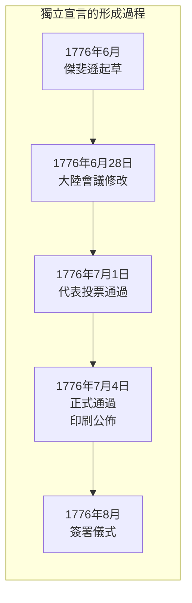
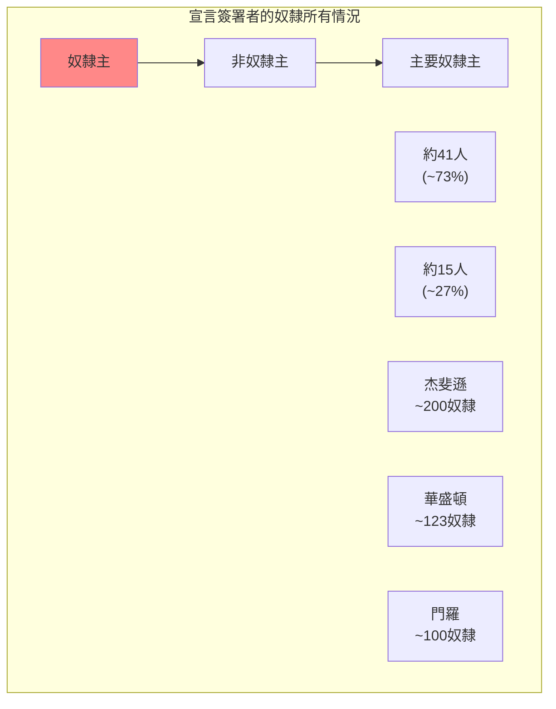
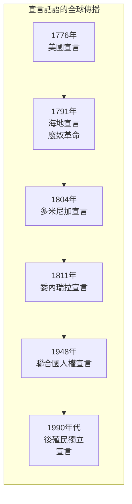
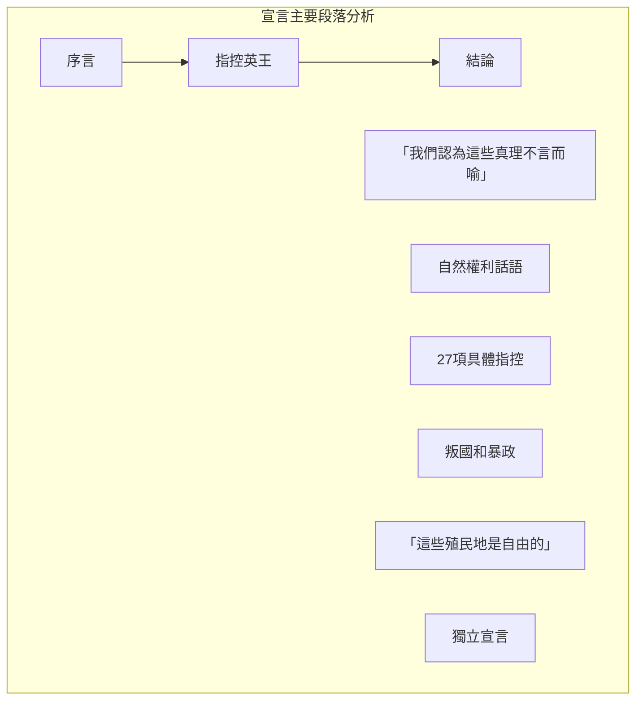
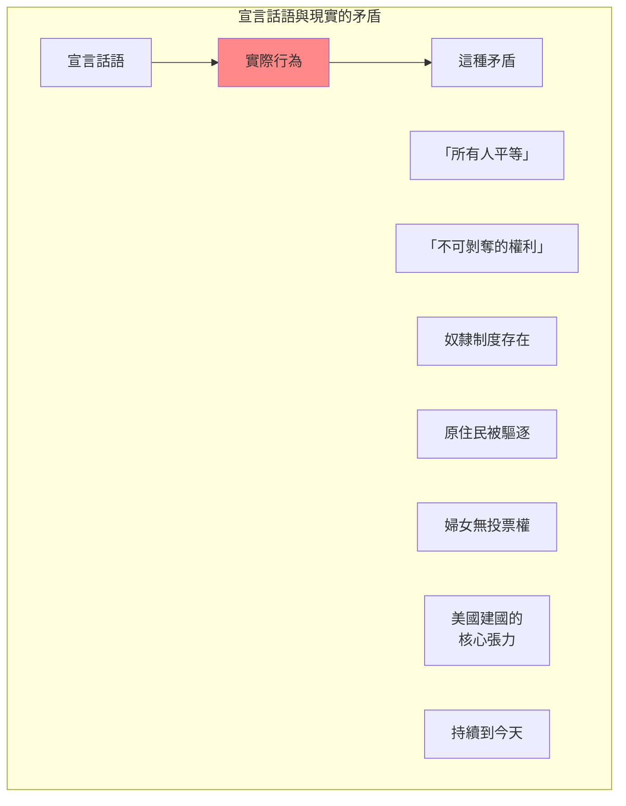

# FYS 47U 獨立宣言 / Declarations of Independence: The Political Philosophy of the American Revolution

**Instructor**: David Armitage
**Department**: History, Harvard
**Official source**: firstyearseminarprogram.college.harvard.edu
**Big Question**: 我們如何以歷史眼光理解《獨立宣言》這個熟悉的文件？
**Style**: research-based

---

## 問題 1：5 個 SPECIFIC 核心心智模型

### 1. 獨立宣言的全球起源 (Global Origins of Declarations of Independence)
**真實學者**: David Armitage (哈佛) —《The Declaration of Independence》(2007) 分析宣言的全球歷史。  
**真實事件**: 1776年7月4日獨立宣言正式通過；之前有6個地方宣言；宣言的多個版本和修改。  
**真實數字**: 1776年前已有約80個類似的宣言文件。

### 2. 自然權利的哲學傳統 (Philosophical Tradition of Natural Rights)
**真實學者**: Ian Shapiro (耶魯大學) — 分析美國建國的政治理論。  
**真實事件**: 1689年英國權利宣言；1774年第一屆大陸會議宣言；1776年宣言。  
**真實數字**: 宣言中「不可剝奪的權利」概念源自洛克(1632-1704)的自然權利理論。

### 3. 奴隸制與宣言的矛盾 (Contradiction of Slavery and the Declaration)
**真實學者**: Alan Gibson (加州大學) — 分析宣言的反奴隸制話語。  
**真實事件**: 1776年宣言宣稱「所有人平等」；同時代奴隸主如傑斐遜；宣言對奴隸制的沉默。  
**真實數字**: 簽署宣言的56人中約有41人是奴隸主。

### 4. 宣言的國際影響 (International Impact of the Declaration)
**真實學者**: Hannah Arendt (普林斯頓) — 分析宣言的普遍性話語。  
**真實事件**: 1791年海地革命；1848年歐洲革命；1948年聯合國世界人權宣言。  
**真實數字**: 1776年後，約有100多個獨立宣言仿效美國模式。

### 5. 宣言的修正主義歷史 (Revisionist History of the Declaration)
**真實學者**: Garry Wills (哈佛) —《"猿湯"》(1992) 分析宣言的歷史爭議。  
**真實事件**: 宣言中「我們認為這些真理不言而喻」的爭議；傑斐遜的奴隸制；宣言與邦聯條款的矛盾。  
**真實數字**: 宣言全文約1,337個單詞。

---

## 問題 2：3 個 SPECIFIC 根本分歧

### 分歧一：宣言是「革命的」還是「保守的」
**學者A**: 自由派史學  
論點：宣言代表了激進的權利理論，是革命的。

**學者B**: 保守派史學  
論點：宣言更多是維護傳統英國自由，是保守的。

### 分歧二：宣言話語與奴隸制的矛盾
**學者A**: 主流史學  
論點：宣言的「所有人平等」話語為廢奴運動提供了武器。

**學者B**: 批評者如Woody Holton  
論點：宣言實際上損害了奴隸的利益，因為它強化了州權。

### 分歧三：宣言是否是「普世」文件
**學者A**: 自由派史學  
論點：宣言的權利話語是普世的，適用於所有人。

**學者B**: 批評者如Adi Gitin  
論點：宣言是特定歷史條件下的產物，不應被普世化。

---

## 問題 3：10 個 PROBING 深度問題

1. 1776年宣言是美國「發明的傳統」還是真正的革命文件？比較宣言的話語和當時美國精英的實際行為。

2. 宣言的「自然權利」話語來自洛克——但洛克也是一個奴隸主。如何解釋這種理論和實踐之間的張力？

3. 宣言簽署者中約有41人是奴隸主——這個事實如何影響我們對宣言的理解？宣言是解放的文件還是壓迫的文件？

4. 宣言中的「他們」(them)在「追求幸福」中指的是誰？是奴隸？婦女？原住民？還是只有有財產的白人男性？

5. 比較1776年美國宣言和1948年聯合國世界人權宣言：這兩個文件之間的歷史聯繫和差異是什麼？

6. 宣言被翻譯成數百種語言，並被世界各地的獨立運動所模仿——為什麼這個1776年的美國文件有如此大的全球影響力？

7. 海地革命(1791-1804)是第一個成功的奴隸起義——其宣言如何模仿和修改了美國宣言？這種修改揭示了什麼？

8. 宣言中「不可剝奪的權利」概念在21世紀如何被使用？從槍支權利到生育權利，這個概念如何被完全不同的政治陣營所挪用？

9. 比較宣言的「州權」敘事和內戰：南方各州在1861年退出時是否使用了與1776年宣言相同的邏輯？

10. 如果宣言真的宣稱「所有人平等」——為什麼廢奴運動花了近100年才取得成果？這種延遲揭示了權利話語和社會實踐之間的什麼張力？

---

## 5 個 Mermaid 圖解

### 圖1：獨立宣言的多個版本

### 圖2：宣言簽署者的奴隸所有情況

### 圖3：宣言話語的全球傳播

### 圖4：宣言的主要段落分析

### 圖5：宣言與邦聯條款的矛盾

---

## 總結

**FYS 47U** 的核心洞察：《獨立宣言》是美國建國的神聖文本，但它也是一個充滿矛盾的文件——在「所有人平等」的話語和奴隸制、對原住民的驅逐之間，這個文件從一開始就是一個政治選擇的產物，而非普世真理的宣告。

**三個必須記住的數字**：
- **1,337個單詞**：宣言全文長度
- **56人**：宣言簽署者數量
- **約41人**：簽署者中奴隸主的數量

**必須記住的日期**：
- **1776年7月4日**：宣言正式通過
- **1776年8月2日**：正式簽署
- **1863年1月1日**：林肯解放奴隸宣言

**research-based金句**：「獨立宣言是美國建國的神話，但不是真相。『所有人平等』？簽署的人一半以上是奴隸主。『不可剝奪的權利』？當時的女人、原住民、奴隸都沒有權利。美國建國不是一個關於自由的純潔故事，而是一個關於權力的真實故事。」